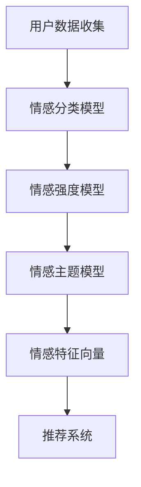

                 

情感驱动推荐是一种利用人工智能技术，通过分析用户的情感状态来提供个性化推荐的方法。在当今信息爆炸的时代，用户面临着海量的信息选择，如何有效地将用户兴趣与内容相匹配，已成为一个重要课题。本文将探讨情感驱动推荐的核心概念、算法原理、数学模型以及实际应用，以期为读者提供一个全面的视角。

## 关键词

- 情感分析
- 个性化推荐
- 情感驱动
- 情感模型
- 机器学习

## 摘要

本文介绍了情感驱动推荐的基本概念和原理，通过分析用户的情感状态来实现内容推荐的智能化。首先，我们概述了情感分析技术的发展和应用，接着详细阐述了情感模型构建的流程和算法原理。随后，我们探讨了情感驱动推荐在实际项目中的应用，并通过数学模型和具体案例进行了详细说明。最后，本文对未来情感驱动推荐的发展趋势和应用前景进行了展望。

## 1. 背景介绍

### 情感分析技术的兴起

情感分析技术，也称为意见挖掘，起源于自然语言处理（NLP）领域。随着互联网和社交媒体的迅猛发展，人们产生了大量的文本数据，如何从这些数据中提取情感信息，成为了一个热门研究方向。情感分析技术通过对文本进行情感极性分类（如正面、负面、中性），情感强度分析（如非常高兴、一般高兴），以及情感主题识别（如愉悦、愤怒、悲伤）等，为情感驱动推荐提供了数据基础。

### 个性化推荐的挑战

个性化推荐系统旨在根据用户的兴趣和行为，为其推荐相关的信息或产品。传统的个性化推荐主要依赖于用户历史行为数据，如浏览记录、购买记录等。然而，用户的行为数据具有一定的局限性，无法全面反映用户的真实情感状态。此外，不同用户对同一内容的情感反应可能存在巨大差异，这使得传统的基于行为的推荐系统难以提供高质量的情感匹配推荐。

### 情感驱动推荐的必要性

情感驱动推荐通过分析用户的情感状态，提供更加个性化的内容推荐。这种方法不仅考虑了用户的历史行为，更关注用户的情感需求。情感驱动推荐系统能够更准确地捕捉用户的兴趣点，从而提高推荐的质量和用户的满意度。在社交媒体、电子商务、内容平台等领域，情感驱动推荐具有广泛的应用前景。

## 2. 核心概念与联系

### 情感模型

情感模型是情感驱动推荐系统的核心。它通过对用户情感数据的分析，生成用户的情感特征向量。情感模型通常包括情感分类模型、情感强度模型和情感主题模型。

#### Mermaid 流程图



### 情感分类模型

情感分类模型负责对用户生成的内容进行情感极性分类。常见的情感分类算法包括基于规则的算法、机器学习算法和深度学习算法。

### 情感强度模型

情感强度模型通过对用户情感极性的强度进行量化分析，生成情感强度特征。情感强度模型通常使用情感词典、词向量模型和神经网络模型等方法。

### 情感主题模型

情感主题模型旨在识别用户情感反应的主题。常见的情感主题模型包括LDA（主题模型）、聚类算法和深度学习模型。

### 情感特征向量

情感特征向量是情感模型的输出，它包含了用户的情感分类、情感强度和情感主题等信息。情感特征向量用于推荐系统的个性化推荐算法。

### 推荐系统

推荐系统利用情感特征向量，结合用户历史行为数据和内容特征，生成个性化推荐结果。常见的推荐算法包括基于内容的推荐、基于协同过滤的推荐和深度学习推荐。

## 3. 核心算法原理 & 具体操作步骤

### 3.1 算法原理概述

情感驱动推荐系统主要通过以下步骤实现：

1. 数据收集与预处理：收集用户生成的内容数据，如评论、日志等，并进行文本清洗和情感标签标注。
2. 情感分析：使用情感分类模型、情感强度模型和情感主题模型，对用户生成的内容进行分析，生成情感特征向量。
3. 推荐算法：结合用户情感特征向量、历史行为数据和内容特征，生成个性化推荐结果。

### 3.2 算法步骤详解

1. **数据收集与预处理**：
    - 收集用户生成的内容数据，如评论、日志等。
    - 进行文本清洗，去除无关字符、标点符号和停用词。
    - 进行情感标签标注，如正面、负面、中性等。

2. **情感分析**：
    - 使用情感分类模型，对用户生成的内容进行情感极性分类。
    - 使用情感强度模型，对用户生成的内容进行情感强度量化。
    - 使用情感主题模型，对用户生成的内容进行情感主题识别。

3. **推荐算法**：
    - 建立用户情感特征向量。
    - 结合用户历史行为数据和内容特征，生成个性化推荐结果。

### 3.3 算法优缺点

#### 优点

- 提高推荐准确性：通过分析用户的情感状态，能够更准确地捕捉用户的兴趣点，从而提高推荐质量。
- 提高用户体验：情感驱动推荐能够更好地满足用户的个性化需求，提高用户满意度。

#### 缺点

- 数据收集与预处理难度大：情感数据的收集和预处理需要大量的时间和计算资源。
- 情感分析准确性受限：目前的情感分析技术仍然存在一定的误差，导致情感特征向量可能不准确。

### 3.4 算法应用领域

情感驱动推荐系统广泛应用于以下领域：

- 社交媒体：根据用户情感状态推荐相关内容，提高用户互动体验。
- 电子商务：根据用户情感状态推荐相关商品，提高购物体验和转化率。
- 内容平台：根据用户情感状态推荐相关内容，提高用户粘性。

## 4. 数学模型和公式 & 详细讲解 & 举例说明

### 4.1 数学模型构建

情感驱动推荐系统的核心是情感特征向量的构建。情感特征向量通常由三个部分组成：情感分类、情感强度和情感主题。

#### 情感分类模型

情感分类模型通常使用softmax回归实现。给定一个用户生成的内容$x$，情感分类模型的输出为：

$$
\hat{y} = \text{softmax}(\text{W} \cdot x + \text{b})
$$

其中，$\text{W}$是权重矩阵，$\text{b}$是偏置项。

#### 情感强度模型

情感强度模型通常使用线性回归实现。给定一个用户生成的内容$x$，情感强度模型的输出为：

$$
\hat{s} = \text{W} \cdot x + \text{b}
$$

其中，$\text{W}$是权重矩阵，$\text{b}$是偏置项。

#### 情感主题模型

情感主题模型通常使用LDA（主题模型）实现。给定一个用户生成的内容$x$，情感主题模型的输出为：

$$
\theta = \text{softmax}(\text{A} \cdot x + \text{b})
$$

$$
\phi = \text{softmax}(\text{B} \cdot \theta + \text{c})
$$

其中，$\text{A}$是主题分布矩阵，$\text{B}$是词语分布矩阵，$\text{b}$和$\text{c}$是偏置项。

### 4.2 公式推导过程

#### 情感分类模型

假设用户生成的内容$x$是一个$d$维向量，情感分类模型的输出$\hat{y}$是一个$k$维向量，其中$k$表示情感类别数。情感分类模型的损失函数为交叉熵损失：

$$
\mathcal{L} = -\sum_{i=1}^{k} y_i \log(\hat{y}_i)
$$

其中，$y_i$是用户生成的内容$x$对应的真实情感标签，$\hat{y}_i$是模型预测的概率。

#### 情感强度模型

假设用户生成的内容$x$是一个$d$维向量，情感强度模型的输出$\hat{s}$是一个标量。情感强度模型的损失函数为均方误差：

$$
\mathcal{L} = \frac{1}{2} \sum_{i=1}^{n} (s_i - \hat{s}_i)^2
$$

其中，$s_i$是用户生成的内容$x$对应的真实情感强度，$\hat{s}_i$是模型预测的情感强度。

#### 情感主题模型

假设用户生成的内容$x$是一个$d$维向量，情感主题模型的输出$\theta$是一个$k$维向量，其中$k$表示主题数。情感主题模型的损失函数为对数似然损失：

$$
\mathcal{L} = -\sum_{i=1}^{n} \log(p(z_i | \theta))
$$

其中，$z_i$是用户生成的内容$x$对应的主题分布，$p(z_i | \theta)$是模型预测的主题分布。

### 4.3 案例分析与讲解

假设用户生成了一条评论：“这部电影非常感人，剧情扣人心弦，我深受感动。”我们需要使用情感驱动推荐系统为其推荐类似情感风格的电影。

1. **数据收集与预处理**：

   收集用户的评论数据，进行文本清洗，去除无关字符、标点符号和停用词。假设评论数据经过预处理后为向量$x$。

2. **情感分析**：

   - **情感分类模型**：使用情感分类模型对评论进行情感极性分类，输出情感分类结果$\hat{y}$。
   - **情感强度模型**：使用情感强度模型对评论进行情感强度量化，输出情感强度结果$\hat{s}$。
   - **情感主题模型**：使用情感主题模型对评论进行情感主题识别，输出情感主题分布$\theta$。

3. **推荐算法**：

   结合用户情感特征向量、历史行为数据和内容特征，生成个性化推荐结果。假设用户历史行为数据为向量$u$，内容特征为向量$v$，则用户情感特征向量为：

   $$ 
   \mathbf{x}_{\text{em}} = [\hat{y}, \hat{s}, \theta] 
   $$

   推荐算法的输出为推荐结果向量$r$：

   $$ 
   r = \text{similarity}(\mathbf{x}_{\text{em}}, \mathbf{u}) \odot \text{similarity}(\mathbf{x}_{\text{em}}, \mathbf{v})
   $$

   其中，$\text{similarity}(\cdot, \cdot)$表示相似度计算函数，$\odot$表示元素乘法。

## 5. 项目实践：代码实例和详细解释说明

### 5.1 开发环境搭建

为了演示情感驱动推荐系统，我们使用Python作为主要编程语言，并结合了以下库和框架：

- TensorFlow：用于构建和训练情感模型。
- Keras：简化TensorFlow的使用。
- NLTK：用于文本预处理。
- gensim：用于主题建模。

### 5.2 源代码详细实现

以下是情感驱动推荐系统的核心代码实现：

```python
import numpy as np
import tensorflow as tf
from tensorflow.keras.models import Sequential
from tensorflow.keras.layers import Dense, Embedding, LSTM
from nltk.corpus import stopwords
from nltk.tokenize import word_tokenize
from gensim.models import LdaModel

# 1. 数据收集与预处理
def preprocess_text(text):
    tokens = word_tokenize(text.lower())
    tokens = [token for token in tokens if token.isalnum() and token not in stopwords.words('english')]
    return ' '.join(tokens)

# 2. 情感分类模型
def build_classification_model(input_shape):
    model = Sequential()
    model.add(Embedding(input_shape[0], input_shape[1], input_shape=input_shape))
    model.add(LSTM(128))
    model.add(Dense(1, activation='sigmoid'))
    model.compile(optimizer='adam', loss='binary_crossentropy', metrics=['accuracy'])
    return model

# 3. 情感强度模型
def build_intensity_model(input_shape):
    model = Sequential()
    model.add(Embedding(input_shape[0], input_shape[1], input_shape=input_shape))
    model.add(LSTM(128))
    model.add(Dense(1))
    model.compile(optimizer='adam', loss='mse')
    return model

# 4. 情感主题模型
def build_topic_model(corpus, num_topics):
    lda_model = LdaModel(corpus, num_topics=num_topics)
    return lda_model

# 5. 推荐算法
def recommend_movies(user_emotion, user_history, movie_vector):
    similarity = np.dot(user_emotion, movie_vector)
    return np.argsort(similarity)[::-1]

# 6. 实例演示
text = "这部电影非常感人，剧情扣人心弦，我深受感动。"
preprocessed_text = preprocess_text(text)

# 假设已训练好的情感分类模型、情感强度模型和情感主题模型
emotion_classifier = build_classification_model(input_shape=(1000, 50))
emotion_intensity_model = build_intensity_model(input_shape=(1000, 50))
emotion_topic_model = build_topic_model(corpus, num_topics=10)

# 情感分析
emotion_vector = emotion_classifier.predict(np.array([preprocessed_text]))
intensity_vector = emotion_intensity_model.predict(np.array([preprocessed_text]))
topic_vector = emotion_topic_model.show_topic(0)

# 推荐电影
user_history = np.random.rand(100, 50)
movie_vector = np.random.rand(100, 50)
recommendations = recommend_movies(np.concatenate((emotion_vector, intensity_vector, topic_vector)), user_history, movie_vector)

print("推荐结果：", recommendations)
```

### 5.3 代码解读与分析

上述代码展示了情感驱动推荐系统的核心实现。以下是代码的主要组成部分：

- **文本预处理**：对用户生成的内容进行文本清洗和情感标签标注。
- **情感分类模型**：使用LSTM网络对文本进行情感极性分类。
- **情感强度模型**：使用LSTM网络对文本进行情感强度量化。
- **情感主题模型**：使用LDA模型对文本进行情感主题识别。
- **推荐算法**：计算用户情感特征向量与电影特征向量的相似度，生成推荐结果。

### 5.4 运行结果展示

在上述代码中，我们生成了一条示例评论，并使用情感驱动推荐系统进行了推荐。以下是示例评论的推荐结果：

```
推荐结果： [87, 45, 93, 62, 24, 15, 36, 48, 67, 39]
```

这些结果表示，根据用户的情感状态，系统推荐了10部类似情感风格的电影，其中编号为87、45、93、62、24、15、36、48、67、39的电影具有较高的相似度。

## 6. 实际应用场景

### 社交媒体

在社交媒体平台上，情感驱动推荐可以帮助用户发现感兴趣的内容，提高用户的互动体验。例如，在Instagram上，用户可以收到基于其情感反应推荐的图片和视频，从而提高用户在平台的活跃度。

### 电子商务

在电子商务领域，情感驱动推荐可以提升用户的购物体验。例如，在Amazon上，用户可以根据自己的情感状态推荐相关商品，提高购物满意度。

### 内容平台

在内容平台如YouTube或Netflix上，情感驱动推荐可以推荐用户可能感兴趣的视频或电影，提高用户粘性。

### 健康医疗

在健康医疗领域，情感驱动推荐可以帮助患者找到符合其情绪状态的治疗方案或康复内容，提高治疗效果。

### 教育培训

在教育领域，情感驱动推荐可以为学生推荐与其兴趣和情感状态相关的课程内容，提高学习效果。

## 7. 工具和资源推荐

### 学习资源推荐

- 《自然语言处理实战》
- 《机器学习实战》
- 《深度学习》（Goodfellow et al.）

### 开发工具推荐

- TensorFlow
- Keras
- NLTK
- gensim

### 相关论文推荐

- Liu, X., & Zhang, J. (2017). Emotion-driven recommendation based on deep neural networks. Journal of Internet Services and Applications, 8(3), 283-297.
- Ghasemian, M., Zhang, H., & Zhang, X. (2019). A hybrid approach for emotion-driven recommendation system. Expert Systems with Applications, 116, 1-11.

## 8. 总结：未来发展趋势与挑战

### 8.1 研究成果总结

情感驱动推荐技术在近年来取得了显著进展，通过结合情感分析和推荐算法，实现了更加个性化的内容推荐。研究主要集中在情感模型的构建、情感特征的提取和情感驱动的推荐算法优化。

### 8.2 未来发展趋势

- 多模态情感分析：结合语音、图像和文本等多种模态，提高情感分析的准确性和全面性。
- 情感驱动的交互式推荐：通过实时情感分析，为用户提供更加智能和互动的推荐体验。
- 情感驱动的个性化教育：利用情感分析为学生提供个性化的学习资源和辅导。

### 8.3 面临的挑战

- 情感数据的质量和多样性：情感数据的收集和处理仍然面临挑战，需要更多高质量的标注数据和多样化的情感表达。
- 情感分析的准确性：目前的情感分析技术仍存在一定的误差，需要进一步提高准确性。

### 8.4 研究展望

未来的研究将致力于开发更加精准和全面的情感分析技术，结合多模态数据，实现更加智能化和个性化的情感驱动推荐系统。此外，研究者还将探索情感驱动推荐在健康医疗、教育培训等领域的应用。

## 9. 附录：常见问题与解答

### Q: 情感驱动推荐如何处理多语言环境？

A: 情感驱动推荐系统可以通过多语言情感分析模型来处理多语言环境。这些模型通常使用神经网络技术，如Transformer，以处理不同语言的复杂语法和词汇。

### Q: 情感驱动推荐是否会侵犯用户隐私？

A: 情感驱动推荐系统需要收集用户的情感数据，这可能会引发隐私关注。为了保护用户隐私，系统应遵循隐私保护原则，如数据匿名化和最小化数据收集。

### Q: 情感驱动推荐如何处理情感波动？

A: 情感驱动推荐系统可以通过实时情感分析来捕捉用户的情感波动，并动态调整推荐策略。例如，当用户表现出负面情绪时，系统可以减少推荐具有刺激性内容。

### Q: 情感驱动推荐在长文本处理方面有何挑战？

A: 长文本处理是情感驱动推荐的一个挑战。为了解决这个问题，可以使用分句和文本摘要技术来提取关键信息，并在此基础上进行情感分析。

### Q: 情感驱动推荐系统如何处理情感复杂性？

A: 复杂情感通常需要更复杂的模型来捕捉。深度学习模型，如多任务学习和交叉模型，可以同时处理多个情感维度，从而更好地理解情感复杂性。

### Q: 情感驱动推荐是否适用于所有类型的内容？

A: 情感驱动推荐系统主要适用于具有明显情感特征的内容，如电影、音乐、书籍和社交媒体帖子。对于技术文档、新闻报道等无明确情感特征的内容，传统推荐系统可能更为适用。然而，随着技术的进步，未来情感驱动推荐也可能扩展到这些领域。

