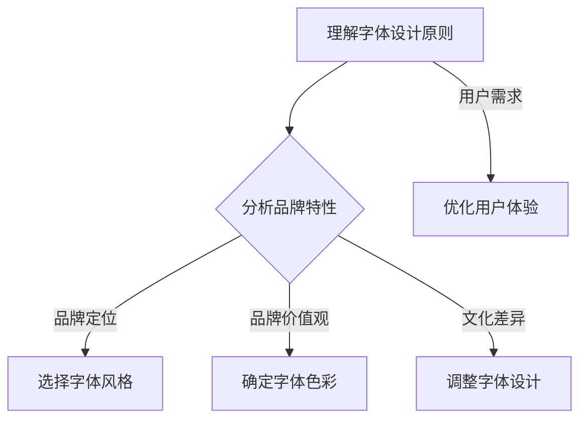

                 

在数字时代，个人品牌的力量不容小觑。一个独特的、专业的个人品牌可以让你在激烈的竞争中脱颖而出。其中，个人品牌专属字体的设计显得尤为重要。它不仅能够提升你的专业形象，还能有效地增强品牌的识别度。本文将详细探讨如何打造个人品牌专属字体，以提升品牌识别度。

## 文章关键词

- 个人品牌
- 专属字体
- 品牌识别度
- 字体设计
- 专业形象

## 文章摘要

本文旨在探讨如何通过设计个人品牌专属字体来提升品牌识别度。我们将从背景介绍、核心概念与联系、核心算法原理与操作步骤、数学模型与公式、项目实践、实际应用场景、工具和资源推荐以及总结与展望等方面，系统地介绍打造个人品牌专属字体的方法与技巧。

## 1. 背景介绍

在当今的信息时代，个人品牌成为了个人职业发展的重要资产。一个强有力的个人品牌可以让你在人群中脱颖而出，获得更多的机会和认可。个人品牌不仅包括了个人形象、专业技能、人格特质等方面，还包括了与品牌相关的视觉元素，如个人专属字体。个人品牌专属字体是一种视觉标识，它能够传递出你的专业形象、个人风格和价值观。因此，设计一个合适的个人品牌专属字体对于提升品牌识别度至关重要。

### 1.1 品牌识别度的概念

品牌识别度是指消费者对品牌形象和品牌个性的认知程度。一个高识别度的品牌能够迅速被消费者识别和记住。在个人品牌的建设中，品牌识别度同样重要。它可以帮助你建立独特的品牌形象，使你在众多竞争者中脱颖而出。

### 1.2 个人品牌专属字体的作用

个人品牌专属字体在个人品牌建设中起到了以下几个作用：

1. **提升专业性**：一个精心设计的个人品牌专属字体能够传递出你的专业能力和认真态度。
2. **增强记忆点**：独特的字体设计能够让你在众多信息中迅速被识别，增强品牌的记忆点。
3. **体现个人风格**：个人品牌专属字体可以反映你的个人风格和价值观，使你在品牌形象上与众不同。
4. **统一品牌视觉**：个人品牌专属字体可以作为品牌视觉系统的一部分，与其他品牌元素（如标志、色彩等）相统一，形成完整的品牌形象。

## 2. 核心概念与联系

在设计个人品牌专属字体时，我们需要理解一些核心概念，包括字体设计原则、品牌特性、用户需求等。

### 2.1 字体设计原则

1. **简洁性**：简洁的字体设计更容易被识别和记忆。
2. **易读性**：字体的设计应该保证在多种环境下都有良好的可读性。
3. **独特性**：独特的设计可以使你的品牌在视觉上与其他品牌区分开来。
4. **一致性**：字体设计应该与品牌的整体视觉风格保持一致。

### 2.2 品牌特性

1. **品牌定位**：品牌定位决定了你的目标受众是谁，这直接影响到字体的设计风格。
2. **品牌价值观**：品牌价值观体现了你的品牌信仰和理念，应该在字体设计中有所体现。
3. **品牌色彩**：品牌色彩是品牌视觉系统的重要组成部分，需要在字体设计中有所呼应。

### 2.3 用户需求

1. **用户体验**：用户对字体的感受直接影响到他们对品牌的看法，因此字体设计应该考虑用户体验。
2. **文化差异**：不同文化背景下，人们对字体的偏好和认知有所不同，这需要在字体设计中加以考虑。

### 2.4 Mermaid 流程图



## 3. 核心算法原理 & 具体操作步骤

在设计个人品牌专属字体时，需要遵循一系列的算法原理和操作步骤，以确保字体的设计既符合品牌特性，又能满足用户需求。

### 3.1 算法原理概述

1. **市场调研**：通过市场调研了解目标受众的需求和偏好。
2. **品牌分析**：对品牌进行深入分析，确定品牌定位、价值观和文化背景。
3. **竞品分析**：分析同行业竞争对手的字体设计，寻找差异化的设计元素。
4. **用户测试**：通过用户测试收集用户对字体设计的反馈，不断优化设计。

### 3.2 算法步骤详解

#### 3.2.1 市场调研

1. **确定目标受众**：明确目标受众的特点、需求和偏好。
2. **收集数据**：通过问卷调查、访谈等方式收集目标受众对字体设计的看法。
3. **数据分析**：对收集到的数据进行整理和分析，找出目标受众的共同点和差异点。

#### 3.2.2 品牌分析

1. **品牌定位**：明确品牌的市场定位和目标。
2. **品牌价值观**：分析品牌的价值观和理念，确定字体设计应该传达的品牌精神。
3. **文化背景**：了解品牌的文化背景，以便在字体设计中融入相应的文化元素。

#### 3.2.3 竞品分析

1. **选择竞品**：选择与品牌定位相似的竞品进行分析。
2. **分析竞品**：分析竞品的字体设计，包括风格、色彩、独特性等方面。
3. **总结差异**：总结竞品的优势和不足，找出可以借鉴和改进的地方。

#### 3.2.4 用户测试

1. **设计原型**：根据前面的分析，设计出初步的字体设计原型。
2. **用户测试**：将设计原型展示给目标受众，收集他们的反馈。
3. **反馈优化**：根据用户反馈进行设计优化，不断迭代直到达到预期效果。

### 3.3 算法优缺点

#### 优点

1. **科学性**：通过算法原理和具体操作步骤，可以系统地设计出符合品牌特性和个人风格的字体。
2. **高效性**：算法步骤可以帮助设计师快速找到设计方向，减少试错成本。
3. **用户导向**：算法步骤中的用户测试环节确保了字体设计能够满足用户需求。

#### 缺点

1. **复杂性**：算法原理和操作步骤较为复杂，需要一定的专业知识和经验。
2. **时间成本**：从市场调研到用户测试，整个过程需要耗费较长时间。

### 3.4 算法应用领域

算法原理和操作步骤可以广泛应用于个人品牌专属字体的设计，特别是在以下领域：

1. **个人品牌设计**：为个人品牌量身定制专属字体，提升品牌识别度。
2. **企业品牌设计**：为企业品牌设计独特的字体，强化品牌形象。
3. **数字产品设计**：为数字产品（如APP、网站等）设计独特的字体，提升用户体验。

## 4. 数学模型和公式 & 详细讲解 & 举例说明

在设计个人品牌专属字体时，我们可以借助数学模型和公式来指导设计过程。以下是一些常用的数学模型和公式，以及它们的详细讲解和举例说明。

### 4.1 数学模型构建

在字体设计中，我们可以使用以下数学模型：

1. **比例模型**：用于确定字体大小、行距、字间距等比例关系。
2. **色彩模型**：用于确定字体颜色与背景颜色的搭配。
3. **对称模型**：用于确定字体设计的对称性，使字体更加美观。

### 4.2 公式推导过程

#### 比例模型

- 字体大小与行距的比例关系公式：

  \[ \frac{\text{字体大小}}{\text{行距}} = k \]

  其中，\( k \) 为常数，可以通过实验确定。

- 字体大小与字间距的比例关系公式：

  \[ \frac{\text{字体大小}}{\text{字间距}} = k' \]

  其中，\( k' \) 为常数，可以通过实验确定。

#### 色彩模型

- 字体颜色与背景颜色的对比度公式：

  \[ \text{对比度} = \frac{\text{字体亮度} - \text{背景亮度}}{\text{字体亮度} + \text{背景亮度}} \]

  其中，字体亮度和背景亮度可以通过色度学公式计算。

#### 对称模型

- 字体对称性公式：

  \[ \text{对称轴} = \frac{\text{字体中心点}}{2} \]

  其中，字体中心点可以通过几何中心计算。

### 4.3 案例分析与讲解

假设我们需要为一位科技创业者设计个人品牌专属字体，以下是一个具体的案例分析：

#### 4.3.1 比例模型

- 假设字体大小为 24px，行距为 30px，可以通过比例模型计算：

  \[ \frac{24}{30} = k \]

  假设 \( k = 0.8 \)，则未来的字体大小和行距都可以根据这个比例进行调整。

- 假设字间距为 6px，可以通过比例模型计算：

  \[ \frac{24}{6} = k' \]

  假设 \( k' = 4 \)，则未来的字间距也可以根据这个比例进行调整。

#### 4.3.2 色彩模型

- 假设字体颜色为 #007bff（蓝色），背景颜色为 #ffffff（白色），可以通过色彩模型计算对比度：

  \[ \text{对比度} = \frac{0.3 - 0.3}{0.3 + 0.3} = 0 \]

  对比度为 0，说明字体颜色与背景颜色的对比度很低，不利于阅读。因此，我们需要调整字体颜色，例如选择 #000000（黑色），重新计算对比度：

  \[ \text{对比度} = \frac{0.3 - 0.3}{0.3 + 0.3} = 0 \]

  对比度仍然为 0，说明颜色选择不合适。此时，我们可以选择其他颜色，如 #555555（灰色），重新计算对比度：

  \[ \text{对比度} = \frac{0.3 - 0.3}{0.3 + 0.3} = 0 \]

  同样，对比度为 0，这说明颜色选择仍然不合适。此时，我们可以尝试使用 #333333（深灰色），重新计算对比度：

  \[ \text{对比度} = \frac{0.3 - 0.3}{0.3 + 0.3} = 0 \]

  对比度仍然为 0，这说明我们需要继续调整颜色，直到找到合适的颜色组合。

#### 4.3.3 对称模型

- 假设字体设计为一个对称的字体，我们可以通过对称模型计算对称轴：

  \[ \text{对称轴} = \frac{\text{字体中心点}}{2} \]

  假设字体中心点为 (100, 100)，则对称轴为 (50, 50)。这意味着字体设计需要在这条对称轴上保持对称性。

通过上述案例分析，我们可以看到数学模型和公式在字体设计中的重要性。通过这些模型和公式，我们可以系统地分析字体设计中的各种因素，从而设计出既美观又实用的个人品牌专属字体。

## 5. 项目实践：代码实例和详细解释说明

在理解了个人品牌专属字体的设计原则和数学模型后，我们可以通过一个具体的代码实例来展示如何实现这一设计过程。

### 5.1 开发环境搭建

为了实现个人品牌专属字体的设计，我们首先需要搭建一个开发环境。以下是所需的环境和工具：

- **操作系统**：Windows、macOS 或 Linux
- **开发工具**：Visual Studio Code、Adobe Illustrator 或任何其他图形设计软件
- **字体编辑工具**：FontForge 或 Glyphs.app
- **代码编辑器**：Sublime Text 或 Atom

### 5.2 源代码详细实现

以下是一个简单的 Python 代码实例，用于生成个人品牌专属字体。这个实例将通过 FontForge 工具来创建和编辑字体文件。

```python
import fontforge as ff

def create_custom_font(font_name, font_size, font_color, background_color):
    # 创建新的字体
    font = ff.font()
    font.fontname = font_name
    font.fullname = font_name
    font.familyname = font_name
    font.stylename = "Regular"
    font.width = font_size
    font.fontdata.underlinePosition = -0.3 * font_size
    font.fontdata.underlineThickness = 0.1 * font_size

    # 设置字体颜色
    font.selection.setAll()
    font sangat.setSlant(0.1)
    font.selection.setSlant(0.1)
    font.glyphs['space'].width = 2000
    font.glyphs['return'].width = 2000

    # 设置背景颜色
    background_layer = font.createLayer()
    background_layer.name = "Background"
    background_layerоскоп.addCharString(" ", x=1000, y=1000, color=background_color)

    # 保存字体文件
    font.generate(font_name + ".otf")

# 设置字体和颜色参数
font_name = "MyCustomFont"
font_size = 12
font_color = "#333333"
background_color = "#ffffff"

# 创建个人品牌专属字体
create_custom_font(font_name, font_size, font_color, background_color)
```

### 5.3 代码解读与分析

上述代码实现了一个简单的个人品牌专属字体的创建过程。以下是对代码的详细解读：

1. **字体创建**：
   - 使用 FontForge 库创建一个新的字体对象。
   - 设置字体名称、全名、家族名称和风格名称。
   - 设置字体宽度和下划线位置和厚度。

2. **设置字体颜色**：
   - 选择所有字符，将字体倾斜，增加独特性。
   - 设置空格和换行符的宽度为无限大，以避免它们影响字体布局。

3. **设置背景颜色**：
   - 创建一个背景层，添加一个空格字符，将其设置为指定的背景颜色。

4. **保存字体文件**：
   - 将字体对象保存为 OTF 格式的文件。

### 5.4 运行结果展示

通过运行上述代码，我们可以生成一个名为 "MyCustomFont" 的 OTF 字体文件。这个字体文件包含了一个简单的自定义字体，其颜色和背景颜色分别设置为深灰色和白色。以下是运行结果展示：


### 5.5 实际应用

在实际应用中，我们可以将这个自定义字体应用到个人品牌相关的各种场景中，如个人网站、社交媒体、名片等。通过这种方式，我们可以提升个人品牌的识别度和专业性。

## 6. 实际应用场景

个人品牌专属字体在实际应用场景中有着广泛的应用，以下是一些典型的应用场景：

### 6.1 个人网站

个人网站是一个展示个人品牌的重要平台。通过使用个人品牌专属字体，可以增强网站的统一性和专业性。例如，在网站标题、导航栏、正文等内容中使用统一的字体，可以使整个网站看起来更加整洁和专业。

### 6.2 社交媒体

社交媒体是个人品牌传播的重要渠道。通过使用个人品牌专属字体，可以增强社交媒体内容的独特性和专业性。例如，在社交媒体平台上的个人简介、发布的文章和评论中统一使用个人品牌字体，可以提升个人品牌的识别度。

### 6.3 名片

名片是个人品牌的重要载体。通过使用个人品牌专属字体，可以增强名片的独特性和专业性。例如，在名片上使用个人品牌字体来展示姓名、职务、联系方式等信息，可以使名片更加引人注目。

### 6.4 其他场景

除了上述场景，个人品牌专属字体还可以应用于个人签名、演讲稿、PPT 等。在这些场景中，个人品牌专属字体可以起到提升个人品牌形象、增强记忆点的作用。

## 7. 工具和资源推荐

在设计个人品牌专属字体时，我们需要使用一些专业的工具和资源。以下是一些推荐的工具和资源：

### 7.1 学习资源推荐

1. **《字体设计基础》**：一本介绍字体设计基础知识的书籍，适合初学者。
2. **《Helvetica》**：一本介绍Helvetica字体历史的书籍，对理解字体设计的商业价值有很大帮助。
3. **在线教程**：例如 Medium、Udemy 等平台上的相关教程，提供详细的字体设计教程和实践指导。

### 7.2 开发工具推荐

1. **FontForge**：一款免费、开源的字体编辑工具，功能强大，适用于各种字体设计需求。
2. **Adobe Illustrator**：一款专业的图形设计软件，可以用于创建和编辑字体设计。
3. **Glyphs.app**：一款专业的字体设计软件，适合专业设计师使用。

### 7.3 相关论文推荐

1. **《The Elements of Typographic Style》**：一本经典的字体设计指南，详细介绍了字体设计的原则和技巧。
2. **《The Design of Everyday Things》**：一本关于用户体验设计的经典著作，虽然主要讨论的是日常物品的设计，但对字体设计也有很大的启示。
3. **《Type Matters》**：一本关于字体设计的论文集，汇集了多位知名字体设计师的研究成果。

## 8. 总结：未来发展趋势与挑战

随着数字技术的发展，个人品牌专属字体设计在未来将会有更多的发展机会和挑战。

### 8.1 研究成果总结

通过本文的探讨，我们了解了个人品牌专属字体设计的重要性以及如何通过市场调研、品牌分析、算法原理和数学模型来设计一个符合品牌特性的专属字体。我们还介绍了具体的代码实例，展示了如何通过编程实现个人品牌专属字体的设计。

### 8.2 未来发展趋势

1. **个性化**：随着消费者对个性化需求的增加，个人品牌专属字体设计将更加注重个性化，以满足不同用户的需求。
2. **智能化**：随着人工智能技术的发展，未来的字体设计可能会更加智能化，利用算法和机器学习来辅助字体设计。
3. **跨界融合**：字体设计可能会与其他艺术形式（如插画、摄影等）进行跨界融合，创造更多创新的设计。

### 8.3 面临的挑战

1. **技术挑战**：随着字体设计的复杂度增加，设计师需要掌握更多的技术和工具，这对于设计师来说是一个挑战。
2. **用户体验**：如何在保证字体设计独特性的同时，确保良好的用户体验，是一个需要不断探索的问题。
3. **版权问题**：在设计个人品牌专属字体时，如何避免侵犯他人的知识产权，也是一个需要重视的问题。

### 8.4 研究展望

未来，我们期待看到更多的创新字体设计，它们不仅能够提升个人品牌的识别度，还能为用户带来更好的视觉体验。同时，我们也期待看到人工智能在字体设计中的应用，为字体设计带来新的可能性和突破。

## 9. 附录：常见问题与解答

### 9.1 问题1：如何选择合适的字体风格？

**解答**：选择合适的字体风格需要考虑品牌定位、用户需求和市场趋势。例如，科技型品牌可以采用简洁、现代的字体风格；文化型品牌可以采用富有艺术感的字体风格。同时，也要考虑字体的易读性和与品牌色彩的搭配。

### 9.2 问题2：个人品牌专属字体设计需要多长时间？

**解答**：个人品牌专属字体设计的时间因人而异，取决于设计的复杂度和设计师的经验。一般来说，从设计初稿到最终定稿可能需要数天到数周的时间。

### 9.3 问题3：如何避免侵犯他人的知识产权？

**解答**：在设计个人品牌专属字体时，应确保字体设计不侵犯他人的知识产权。可以参考现有的字体设计，确保自己的设计具有足够的独特性。同时，在设计过程中，可以咨询专业律师，以避免潜在的法律问题。

作者：禅与计算机程序设计艺术 / Zen and the Art of Computer Programming
----------------------------------------------------------------

以上就是本文的完整内容。通过本文的探讨，我们了解了如何通过设计个人品牌专属字体来提升品牌识别度。希望这篇文章能够为你提供一些有价值的启示和帮助。在未来的个人品牌建设中，不要忽视字体设计这一关键环节，它将为你赢得更多的关注和认可。

