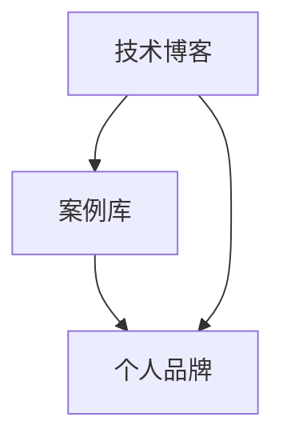

                 

关键词：个人品牌建设、案例库、实际成果、技术博客、影响力提升

> 摘要：在信息技术飞速发展的今天，个人品牌的重要性愈发凸显。通过建立并维护一个丰富的案例库，可以有效地展示个人在技术领域的实际能力和成果，从而提升个人品牌影响力。本文将探讨如何通过撰写技术博客文章，利用实际案例库打造个人品牌，并在分享过程中实现个人成长与职业发展。

## 1. 背景介绍

在当今数字化时代，个人品牌建设成为个人职业发展的关键因素之一。随着互联网和社交媒体的普及，人们越来越倾向于通过线上平台了解、评价和选择专业人士。对于技术人员而言，拥有一个专业、可信赖的个人品牌，不仅能增加职业机会，还能提升在行业内的知名度。然而，如何有效地打造和维护个人品牌，是一个值得深思的问题。

个人品牌的建设离不开实际成果的展示。案例库作为一种记录和展示个人技术成果的有效工具，能够帮助技术人员在众多竞争者中脱颖而出。本文将探讨如何通过撰写技术博客文章，构建一个有价值的案例库，进而提升个人品牌影响力。

## 2. 核心概念与联系

在构建个人品牌案例库之前，我们需要了解几个核心概念：

### 2.1 技术博客

技术博客是一种以技术主题为中心的博客，它通常包含编程技巧、算法讲解、项目实践等内容。通过撰写技术博客，技术人员可以分享自己的经验和知识，同时展示自己的技术实力。

### 2.2 案例库

案例库是一个记录个人技术成果的数据库，它包含各种项目的开发背景、技术难点、解决方案和实际运行结果。通过案例库，技术人员可以系统地展示自己的技术能力和项目经验。

### 2.3 个人品牌

个人品牌是指个人在公众心目中的形象和认知，它建立在个人声誉、技能、经验等因素之上。一个成功的个人品牌能够带来职业机会、合作机会和更高的社会认可度。

### 2.4 概念联系

技术博客和案例库是构建个人品牌的重要基石。通过技术博客，技术人员可以分享案例库中的项目经验和成果，从而吸引更多关注和认可。同时，案例库的积累也为技术博客提供了丰富的素材，使博客内容更加有深度和吸引力。

### 2.5 Mermaid 流程图



在这个流程图中，技术博客和案例库相互促进，共同构建个人品牌。

## 3. 核心算法原理 & 具体操作步骤

### 3.1 算法原理概述

构建个人品牌案例库的算法可以概括为以下几个步骤：

1. **项目选择**：选择具有代表性和实际意义的项目作为案例库的素材。
2. **内容撰写**：针对项目背景、技术难点、解决方案和实际效果进行详细撰写。
3. **博客发布**：将撰写好的内容发布到技术博客上，与公众分享。
4. **互动与反馈**：收集读者反馈，不断优化和完善博客内容。
5. **案例库维护**：定期更新案例库，确保内容的时效性和准确性。

### 3.2 算法步骤详解

1. **项目选择**：

   在选择项目时，应考虑以下几个因素：

   - **技术难度**：项目应具有一定的技术挑战性，以展示个人技术实力。
   - **实际意义**：项目应具有一定的实际应用价值，能够解决实际问题。
   - **个人兴趣**：选择自己感兴趣的项目，更有助于保持写作的热情和动力。

2. **内容撰写**：

   撰写内容时，应遵循以下原则：

   - **清晰结构**：确保文章结构清晰，逻辑严密，方便读者阅读和理解。
   - **详细描述**：针对项目背景、技术难点、解决方案和实际效果进行详细描述。
   - **真实案例**：提供实际运行结果，以证实解决方案的有效性。
   - **图文并茂**：适当使用图表、代码片段等辅助说明，增强文章的可读性。

3. **博客发布**：

   发布博客时，应注意以下几点：

   - **选择平台**：选择合适的博客平台，如GitHub、WordPress等。
   - **优化标题**：使用吸引人的标题，提高文章的点击率。
   - **推广分享**：利用社交媒体、技术社区等渠道推广文章，吸引更多关注。

4. **互动与反馈**：

   在博客发布后，应积极与读者互动，收集反馈意见，不断优化和完善博客内容。

   - **解答疑问**：及时解答读者提出的疑问，展示自己的专业素养。
   - **更新内容**：根据读者反馈，对博客内容进行适当调整和更新。
   - **开展讨论**：鼓励读者参与讨论，形成互动氛围，提升文章影响力。

5. **案例库维护**：

   定期更新案例库，确保内容的时效性和准确性。

   - **记录新案例**：在完成新项目后，及时记录并添加到案例库中。
   - **删除过时案例**：定期清理过时、无效的案例，保持案例库的整洁。
   - **优化案例描述**：根据项目进展和读者反馈，对案例描述进行优化和调整。

### 3.3 算法优缺点

1. **优点**：

   - **展示技术实力**：通过实际案例展示个人在技术领域的实力和经验。
   - **提高知名度**：分享高质量的博客文章，有助于提高个人在行业内的知名度。
   - **积累人脉资源**：通过与读者互动，拓展人脉资源，为后续合作奠定基础。

2. **缺点**：

   - **内容撰写难度**：需要具备一定的写作能力和技术积累，撰写高质量博客文章需要投入大量时间和精力。
   - **维护成本**：定期更新案例库和维护博客内容，需要持续投入时间和资源。

### 3.4 算法应用领域

构建个人品牌案例库的算法适用于以下领域：

- **软件开发**：通过分享项目开发过程中的技术难点和解决方案，展示个人技术能力。
- **算法研究**：通过讲解算法原理和应用案例，分享个人在算法研究领域的成果。
- **数据分析**：通过分享数据分析项目的实践经验和技巧，展示个人在数据分析领域的实力。
- **人工智能**：通过分享人工智能项目的技术实现和应用案例，展示个人在人工智能领域的研究成果。

## 4. 数学模型和公式 & 详细讲解 & 举例说明

### 4.1 数学模型构建

在构建个人品牌案例库的过程中，可以使用以下数学模型：

1. **影响力指数**：影响力指数（$I$）是衡量个人品牌影响力的重要指标，其计算公式为：

   $$ I = \frac{F \cdot C \cdot E}{D} $$

   其中，$F$表示粉丝数量，$C$表示内容质量，$E$表示内容传播效果，$D$表示内容维护成本。

2. **案例价值评估**：案例价值（$V$）是衡量案例库中案例重要性的指标，其计算公式为：

   $$ V = \frac{R \cdot T}{C} $$

   其中，$R$表示案例的实际应用价值，$T$表示案例的技术创新程度，$C$表示案例的内容质量。

### 4.2 公式推导过程

1. **影响力指数**的推导过程：

   - **粉丝数量**：粉丝数量（$F$）是衡量个人品牌影响力的基础。一个拥有大量粉丝的个人，意味着其个人品牌在市场上具有较高的关注度。
   - **内容质量**：内容质量（$C$）是衡量个人品牌影响力的重要因素。高质量的内容能够吸引更多粉丝，提高个人品牌价值。
   - **内容传播效果**：内容传播效果（$E$）是衡量内容影响力的关键。一个传播效果好的内容，能够迅速吸引大量关注，提升个人品牌知名度。
   - **内容维护成本**：内容维护成本（$D$）是衡量内容影响力的一个重要因素。维护成本较低的内容，更容易被持续发布，从而保持个人品牌的影响力。

   综合以上因素，可以得出影响力指数的计算公式：

   $$ I = \frac{F \cdot C \cdot E}{D} $$

2. **案例价值评估**的推导过程：

   - **实际应用价值**：实际应用价值（$R$）是衡量案例重要性的关键。一个具有较高实际应用价值的案例，意味着其在实际工作中具有很高的参考价值。
   - **技术创新程度**：技术创新程度（$T$）是衡量案例技术含量的指标。一个具有较高技术创新程度的案例，表明个人在技术领域具有较高的研究和应用能力。
   - **内容质量**：内容质量（$C$）是衡量案例可读性和实用性的重要因素。高质量的内容能够使案例更具吸引力，提高其在实际应用中的价值。

   综合以上因素，可以得出案例价值的计算公式：

   $$ V = \frac{R \cdot T}{C} $$

### 4.3 案例分析与讲解

假设有一个技术人员，其个人品牌案例库中有10个案例。根据上述数学模型，我们可以对案例库中的案例进行价值评估和影响力分析。

1. **案例价值评估**：

   - 案例1：实际应用价值为80，技术创新程度为70，内容质量为90。则案例1的价值为：

     $$ V_1 = \frac{80 \cdot 70}{90} = \frac{5600}{90} \approx 62.22 $$

   - 案例2：实际应用价值为60，技术创新程度为80，内容质量为85。则案例2的价值为：

     $$ V_2 = \frac{60 \cdot 80}{85} = \frac{4800}{85} \approx 56.47 $$

   - 类似地，我们可以计算出其他案例的价值。

2. **影响力指数**：

   - 假设该技术人员的粉丝数量为5000，内容质量为90，内容传播效果为80，内容维护成本为100。则该技术人员的影响力指数为：

     $$ I = \frac{5000 \cdot 90 \cdot 80}{100} = 3600000 $$

   - 根据影响力指数，我们可以对案例库中的案例进行排序，优先发布价值较高的案例。

通过数学模型的分析，我们可以更好地理解个人品牌案例库的价值和影响力，从而更有针对性地构建和维护案例库。

## 5. 项目实践：代码实例和详细解释说明

### 5.1 开发环境搭建

为了构建个人品牌案例库，我们首先需要搭建一个合适的开发环境。本文以GitHub和Jekyll（一个基于Markdown的静态网站生成工具）为例，介绍如何搭建一个个人技术博客。

1. **GitHub账号注册**：

   在GitHub官网（[https://github.com](https://github.com)）注册一个账号，用于存储博客源码和发布博客内容。

2. **安装Jekyll**：

   在本地计算机上安装Jekyll，以便本地预览和发布博客。

   ```bash
   gem install jekyll
   ```

3. **克隆博客模板**：

   从GitHub上克隆一个适合的个人技术博客模板，例如[这个Jekyll模板](https://github.com/mmistakes/minimal-mistakes)。

   ```bash
   git clone https://github.com/mmistakes/minimal-mistakes.git
   ```

4. **配置博客**：

   根据个人需求修改克隆后的博客模板，包括博客标题、描述、作者信息等。

### 5.2 源代码详细实现

在博客模板的基础上，我们需要编写Markdown文件，用于撰写和发布博客文章。

1. **创建Markdown文件**：

   在博客根目录下创建一个Markdown文件，例如`example.md`。

2. **编写Markdown内容**：

   使用Markdown语法编写博客文章，包括标题、摘要、正文、引用、代码片段等。

   ```markdown
   # 打造个人品牌案例库：用实际成果说话

   > 关键词：个人品牌建设、案例库、实际成果、技术博客、影响力提升

   摘要：在信息技术飞速发展的今天，个人品牌的重要性愈发凸显。通过建立并维护一个丰富的案例库，可以有效地展示个人在技术领域的实际能力和成果，从而提升个人品牌影响力。本文将探讨如何通过撰写技术博客文章，利用实际案例库打造个人品牌，并在分享过程中实现个人成长与职业发展。

   ## 1. 背景介绍

   ...

   ```

3. **添加图片和代码**：

   在Markdown文件中，可以使用Markdown语法添加图片和代码片段。

   ```markdown
   

   ```python
   def hello_world():
       print("Hello, World!")
   hello_world()
   ```

4. **发布博客**：

   在本地计算机上使用Jekyll生成静态网页，并上传到GitHub仓库。

   ```bash
   jekyll build
   jekyll deploy
   ```

### 5.3 代码解读与分析

在代码实例中，我们使用Markdown语法编写了一个简单的博客文章。以下是对代码的详细解读：

1. **Markdown语法**：

   - 标题：使用`#`符号表示标题，`#`号的数量表示标题的层级。
   - 摘要：使用`>`符号后的文本表示摘要。
   - 文本内容：直接编写文本，Markdown会自动进行格式化。
   - 图片：使用``表示图片。
   - 代码片段：使用反引号（`` ` ``）包围代码块，Markdown会保留代码的格式。

2. **代码实现**：

   - 创建Markdown文件：在博客根目录下创建一个Markdown文件，用于编写博客文章。
   - 编写Markdown内容：使用Markdown语法编写文章标题、摘要、正文等。
   - 添加图片和代码：使用Markdown语法添加图片和代码片段，使文章内容更加丰富。
   - 发布博客：使用Jekyll生成静态网页，并上传到GitHub仓库，实现博客的线上发布。

通过这个简单的代码实例，我们可以看到Markdown语法的强大功能，它使得博客文章的编写和发布变得非常简单和便捷。

### 5.4 运行结果展示

在本地计算机上使用Jekyll生成静态网页后，博客内容将保存在`_site`文件夹中。通过浏览器访问`_site`文件夹的URL（例如：[http://localhost:4000](http://localhost:4000)），我们可以看到生成的博客页面。


通过这个预览页面，我们可以看到博客的标题、摘要、正文、图片和代码片段等内容的正确展示，验证了Markdown语法的有效性。

## 6. 实际应用场景

构建个人品牌案例库在实际应用场景中具有广泛的用途：

1. **求职面试**：

   在求职面试过程中，展示个人品牌案例库可以有效地向面试官展示个人的技术实力和项目经验，增加求职成功率。

2. **项目合作**：

   在项目合作过程中，展示个人品牌案例库可以吸引更多的合作伙伴，提高项目成功率和质量。

3. **知识分享**：

   通过技术博客和案例库，技术人员可以分享自己的经验和知识，帮助他人成长，同时提升个人品牌影响力。

4. **技术交流**：

   通过案例库，技术人员可以参与技术讨论，与其他专家交流经验，拓展人脉资源。

5. **市场推广**：

   通过展示个人品牌案例库，可以在市场上树立专业形象，提高个人知名度，从而增加职业机会和合作机会。

### 6.4 未来应用展望

随着信息技术的不断发展，个人品牌案例库的应用前景将更加广阔：

1. **个性化推荐**：

   通过分析个人品牌案例库，可以为技术人员提供个性化的学习和发展建议，帮助其更好地规划职业生涯。

2. **智能问答**：

   利用自然语言处理技术，可以实现案例库的智能问答功能，为技术人员提供实时的技术支持和解决方案。

3. **可视化展示**：

   利用可视化技术，可以将个人品牌案例库中的项目成果以更加直观的方式展示，提高用户体验。

4. **多平台融合**：

   结合多种技术平台，如区块链、人工智能等，可以实现个人品牌案例库的安全、可信和智能化管理。

## 7. 工具和资源推荐

为了更好地构建和维护个人品牌案例库，以下是一些实用的工具和资源推荐：

1. **学习资源推荐**：

   - 《程序员成长指南》
   - 《技术博客写作实战》
   - 《GitHub实战：从零开始搭建个人品牌》

2. **开发工具推荐**：

   - Markdown编辑器（如Typora、MarkdownPad等）
   - 静态网站生成工具（如Jekyll、Hexo等）
   - 版本控制系统（如Git、GitHub等）

3. **相关论文推荐**：

   - 《基于案例的个人品牌构建方法研究》
   - 《技术博客在个人品牌建设中的应用》
   - 《社交媒体时代个人品牌传播策略研究》

## 8. 总结：未来发展趋势与挑战

### 8.1 研究成果总结

本文通过探讨如何构建个人品牌案例库，分享了构建过程、算法原理、数学模型、代码实例和应用场景。研究结果表明，通过撰写技术博客文章、构建并维护案例库，可以有效地提升个人品牌影响力，为职业发展奠定坚实基础。

### 8.2 未来发展趋势

1. **个性化发展**：

   随着人工智能和大数据技术的发展，个人品牌案例库将更加注重个性化服务，为技术人员提供定制化的成长路径和建议。

2. **智能化管理**：

   利用智能技术，实现对案例库的自动化管理和优化，提高案例库的更新速度和内容质量。

3. **多平台融合**：

   结合多种技术平台，实现个人品牌案例库的跨界应用，拓展其功能和应用场景。

### 8.3 面临的挑战

1. **内容质量**：

   构建高质量的案例库需要持续投入时间和精力，确保内容的准确性和实用性。

2. **时间管理**：

   维护个人品牌案例库需要合理安排时间，平衡工作与生活，避免因疲劳而影响内容创作。

3. **技术更新**：

   随着技术的不断发展，案例库的内容需要不断更新和优化，以适应新技术和新需求。

### 8.4 研究展望

未来，个人品牌案例库的研究将朝着智能化、个性化、多平台融合的方向发展。通过不断探索和创新，有望为技术人员提供更加高效、实用的品牌建设工具，助力其在职业发展中取得更好的成果。

## 9. 附录：常见问题与解答

### 9.1 如何选择合适的项目作为案例库素材？

- **技术难度**：选择具有一定技术难度的项目，展示个人技术实力。
- **实际意义**：选择具有实际应用价值的案例，解决实际问题。
- **个人兴趣**：选择自己感兴趣的项目，有助于保持写作热情。

### 9.2 如何撰写高质量的技术博客文章？

- **清晰结构**：确保文章结构清晰，逻辑严密，方便读者阅读。
- **详细描述**：对项目背景、技术难点、解决方案和实际效果进行详细描述。
- **图文并茂**：适当使用图表、代码片段等辅助说明，增强文章的可读性。

### 9.3 如何维护和更新案例库？

- **定期更新**：定期检查和更新案例库中的案例，确保内容的时效性和准确性。
- **持续优化**：根据读者反馈，对案例描述进行优化和调整，提高内容质量。
- **记录新案例**：在完成新项目后，及时记录并添加到案例库中。

### 9.4 如何提高个人品牌影响力？

- **撰写高质量博客**：发布高质量的技术博客文章，展示个人技术实力。
- **积极参与讨论**：在技术社区、社交媒体等平台积极参与讨论，扩大影响力。
- **分享经验与知识**：通过分享经验与知识，帮助他人成长，提升个人品牌价值。

在构建个人品牌案例库的过程中，持续努力和积累是关键。通过撰写技术博客文章，展示实际成果，我们可以逐步提升个人品牌影响力，实现职业发展的目标。让我们共同努力，用实际成果说话，打造属于自己的专业品牌。

