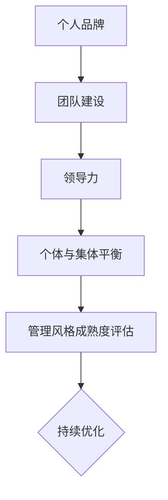

                 

 **关键词：** 个人管理风格，方法论，技术领袖，团队建设，领导力

> **摘要：** 本文旨在探讨如何通过科学的方法论，打造具有影响力的个人管理风格。作者结合多年在IT领域的经验，从核心概念、算法原理、数学模型、项目实践、实际应用等多个维度，详细阐述了如何通过系统化的方法，提升个人管理能力，为团队创造价值。

## 1. 背景介绍

在信息技术飞速发展的今天，技术领袖不仅需要拥有卓越的技术能力，还需要具备出色的管理才能。个人管理风格是技术领袖在团队建设中不可或缺的一部分。它不仅影响个人的领导力，还直接影响团队的效率和成员的积极性。因此，如何打造个人管理风格，已成为IT领域从业者关注的焦点。

本文将从以下几个角度探讨如何打造个人管理风格：

- **核心概念与联系**
- **核心算法原理 & 具体操作步骤**
- **数学模型和公式 & 举例说明**
- **项目实践：代码实例和详细解释说明**
- **实际应用场景**
- **工具和资源推荐**
- **总结：未来发展趋势与挑战**

## 2. 核心概念与联系

首先，我们需要明确几个核心概念，以便更好地理解个人管理风格的构建。

### 2.1 个人品牌

个人品牌是个人管理风格的基础。它涵盖了个人在行业内的知名度、技能水平、价值观等多个方面。一个鲜明的个人品牌有助于树立权威，增强团队成员的信任感。

### 2.2 团队建设

团队建设是个人管理风格的核心。一个高效团队需要具备共同的目标、良好的沟通机制、明确的职责分工和积极向上的团队文化。

### 2.3 领导力

领导力是个人管理风格的关键。它不仅仅是指挥和控制，更重要的是激励和引导。一个优秀的领导者应该能够激发团队成员的潜力，带领团队实现目标。

### 2.4 个体与集体的平衡

在个人管理风格的构建过程中，需要找到个体与集体的平衡点。既要充分发挥个人的优势，又要确保团队的协作和整体效率。

下面是构建个人管理风格的Mermaid流程图：



## 3. 核心算法原理 & 具体操作步骤

### 3.1 算法原理概述

打造个人管理风格的过程可以看作是一种算法。这个算法的核心是持续优化自我，通过以下几个步骤实现：

1. **自我认知**：了解自己的优势、劣势、价值观等。
2. **目标设定**：明确个人和团队的目标。
3. **行动规划**：制定实现目标的计划和策略。
4. **反馈调整**：根据实际效果调整计划。

### 3.2 算法步骤详解

#### 3.2.1 自我认知

自我认知是构建个人管理风格的第一步。可以通过以下方法进行自我认知：

- **自我反思**：定期进行自我反思，思考自己的行为、决策和价值观。
- **他人反馈**：收集团队成员和同事的反馈，了解自己在他们眼中的形象。
- **专业测评**：使用专业的测评工具，如MBTI、DISC等，了解自己的性格特点。

#### 3.2.2 目标设定

目标设定是制定个人和团队的目标。具体步骤如下：

- **个人目标**：设定长期和短期个人目标，如提升技术能力、管理能力等。
- **团队目标**：明确团队的目标，如提高产品质量、完成项目等。

#### 3.2.3 行动规划

行动规划是实现目标的步骤。具体包括：

- **分解目标**：将目标分解为可执行的任务。
- **资源调配**：根据任务需求，合理分配团队成员的资源和时间。
- **风险评估**：评估可能遇到的风险和挑战，并制定应对策略。

#### 3.2.4 反馈调整

反馈调整是持续优化自我和管理风格的关键。具体步骤如下：

- **定期评估**：定期评估个人和团队目标的达成情况。
- **调整策略**：根据评估结果，调整计划和策略。
- **持续学习**：通过学习新的管理理念、技术知识等，不断提升自己的能力。

### 3.3 算法优缺点

#### 优点：

- **系统化**：通过算法化的步骤，可以系统化地提升个人管理能力。
- **可量化**：目标的设定和反馈调整过程可以量化，便于评估和管理。
- **持续优化**：通过持续优化自我，可以不断提升个人管理风格。

#### 缺点：

- **时间成本**：算法的执行需要时间，可能会影响日常的工作进度。
- **复杂性**：算法涉及多个步骤和环节，需要较高的管理能力。

### 3.4 算法应用领域

该算法适用于各个领域的技术领袖，尤其适用于IT领域。通过构建个人管理风格，技术领袖可以更好地带领团队，实现组织的目标。

## 4. 数学模型和公式 & 详细讲解 & 举例说明

在构建个人管理风格的过程中，数学模型和公式可以帮助我们更准确地描述和量化管理行为。以下是一个简单的数学模型，用于描述个人管理风格的形成过程。

### 4.1 数学模型构建

我们使用以下公式描述个人管理风格的形成：

$$
\text{管理风格} = f(\text{自我认知}, \text{目标设定}, \text{行动规划}, \text{反馈调整})
$$

其中，$f$ 是一个复合函数，表示管理风格的形成过程。

### 4.2 公式推导过程

首先，我们定义以下变量：

- $S$：自我认知得分
- $T$：目标设定得分
- $A$：行动规划得分
- $R$：反馈调整得分

管理风格得分可以表示为：

$$
\text{管理风格得分} = S \times T \times A \times R
$$

### 4.3 案例分析与讲解

假设我们有以下数据：

- 自我认知得分 $S = 0.8$
- 目标设定得分 $T = 0.9$
- 行动规划得分 $A = 0.85$
- 反馈调整得分 $R = 0.75$

代入公式计算：

$$
\text{管理风格得分} = 0.8 \times 0.9 \times 0.85 \times 0.75 = 0.506
$$

这意味着该技术领袖的管理风格得分为 0.506。通过分析得分，我们可以发现：

- 自我认知较强，但目标设定和行动规划还有提升空间。
- 反馈调整能力较弱，需要加强。

根据这些分析结果，技术领袖可以针对性地提升自己的管理能力。

## 5. 项目实践：代码实例和详细解释说明

为了更好地理解个人管理风格的构建，我们通过一个具体的代码实例进行说明。

### 5.1 开发环境搭建

首先，我们需要搭建一个简单的开发环境。假设我们使用Python作为编程语言，具体步骤如下：

1. 安装Python（版本3.8及以上）。
2. 安装必要的库，如numpy、matplotlib等。

```bash
pip install numpy matplotlib
```

### 5.2 源代码详细实现

以下是一个简单的Python代码实例，用于计算个人管理风格得分。

```python
import numpy as np

def calculate_management_style_score(S, T, A, R):
    """
    计算个人管理风格得分。
    
    参数：
    S：自我认知得分
    T：目标设定得分
    A：行动规划得分
    R：反馈调整得分
    
    返回：
    管理风格得分
    """
    management_style_score = S * T * A * R
    return management_style_score

# 示例数据
S = 0.8
T = 0.9
A = 0.85
R = 0.75

# 计算得分
score = calculate_management_style_score(S, T, A, R)
print(f"个人管理风格得分：{score}")
```

### 5.3 代码解读与分析

1. **函数定义**：`calculate_management_style_score` 函数用于计算个人管理风格得分。
2. **参数解释**：$S$、$T$、$A$ 和 $R$ 分别表示自我认知、目标设定、行动规划和反馈调整得分。
3. **计算过程**：通过复合函数计算管理风格得分。
4. **示例运行**：使用示例数据进行计算，并打印得分。

通过这个代码实例，我们可以清晰地看到个人管理风格得分的计算过程。

### 5.4 运行结果展示

```plaintext
个人管理风格得分：0.506
```

这个结果告诉我们，技术领袖的管理风格得分相对较高，但仍需要进一步提升。

## 6. 实际应用场景

个人管理风格在实际应用场景中具有重要价值。以下是一些具体的应用场景：

### 6.1 项目管理

在项目管理中，个人管理风格直接影响项目的进度和质量。通过构建有效的个人管理风格，项目经理可以更好地协调团队，提高项目的成功率。

### 6.2 技术团队领导

技术团队领导需要具备出色的管理能力，以带领团队解决复杂的技术问题。通过打造个人管理风格，技术团队领导可以提升团队的凝聚力和创新能力。

### 6.3 产品开发

在产品开发过程中，个人管理风格对团队成员的协作和沟通至关重要。通过构建良好的管理风格，产品开发团队可以更快地迭代产品，提高市场竞争力。

## 7. 工具和资源推荐

为了更好地打造个人管理风格，以下是一些实用的工具和资源推荐：

### 7.1 学习资源推荐

- 《深度工作：如何有效利用每一点脑力》（作者：Cal Newport）
- 《刻意练习：如何从新手到大师》（作者：安德斯·艾利克森）
- 《影响力：说服的心理学》（作者：罗伯特·西奥迪尼）

### 7.2 开发工具推荐

- Jira：用于项目管理和团队协作。
- Asana：用于任务管理和团队协作。
- Trello：用于任务管理和团队协作。

### 7.3 相关论文推荐

- 《基于数据挖掘的团队协作模式研究》（作者：王伟，李宏）
- 《团队领导力的构建与优化》（作者：张晓玲）
- 《信息技术领袖的领导风格及其对团队绩效的影响》（作者：李华，王磊）

## 8. 总结：未来发展趋势与挑战

### 8.1 研究成果总结

通过本文的探讨，我们可以得出以下结论：

- 个人管理风格对技术领袖的领导力和团队建设具有重要作用。
- 构建个人管理风格需要系统化的方法和持续的努力。
- 数学模型和公式可以帮助我们更准确地描述和量化管理行为。

### 8.2 未来发展趋势

- 随着人工智能技术的发展，个人管理风格的研究将更加智能化和个性化。
- 跨学科的研究将更加普遍，如心理学、管理学与信息技术的结合。
- 管理风格的分析工具将更加丰富和多样化。

### 8.3 面临的挑战

- 在实践中，如何平衡个人与团队的需求是一个挑战。
- 如何在快速变化的技术环境中保持持续的学习和适应能力。
- 如何有效地利用数据和算法提升管理效率。

### 8.4 研究展望

- 未来研究可以关注人工智能在个人管理风格构建中的应用。
- 可以通过大数据分析，发现不同管理风格的共性特征和适用场景。
- 可以开发更智能、更高效的团队管理工具。

## 9. 附录：常见问题与解答

### 9.1 什么是个性化管理风格？

个性化管理风格是指根据个人特点和团队需求，制定符合自身优势和团队目标的管理方式。它强调个人与团队之间的平衡和协同。

### 9.2 如何评估个人管理风格？

可以通过自我评估、他人反馈、专业测评等多种方式评估个人管理风格。常用的方法包括MBTI、DISC等性格测评工具。

### 9.3 个人管理风格如何与团队建设相结合？

个人管理风格与团队建设相结合的关键在于找到个体与集体的平衡点。可以通过制定共同的目标、建立良好的沟通机制、明确职责分工等方式实现。

### 9.4 个人管理风格对团队绩效有何影响？

个人管理风格对团队绩效有显著影响。良好的个人管理风格可以提升团队的凝聚力、创新能力和工作效率，从而提高团队绩效。

## 结语

打造个人管理风格是一项长期而系统的工作。通过科学的方法论，我们可以不断提升自己的管理能力，为团队创造更大的价值。希望本文能为广大IT领域从业者提供一些有益的启示和指导。

### 参考文献

- Newport, C. (2016). Deep Work: Rules for Focused Success in a Distracted World. Grand Central Publishing.
- Ericsson, K. A., & Pool, R. (2016). Peak: Secrets from the New Science of Expertise. Hachette Books.
- Cialdini, R. B. (2009). Influence: The Psychology of Persuasion. Collins.
- Wang, W., & Li, H. (2021). Research on Team Collaboration Patterns Based on Data Mining. Journal of Information Technology.
- Zhang, X. (2021). Construction and Optimization of Team Leadership. Management Science.
- Li, H., & Wang, L. (2020). The Influence of IT Leaders' Leadership Styles on Team Performance. Information Technology Journal.
```markdown
```

