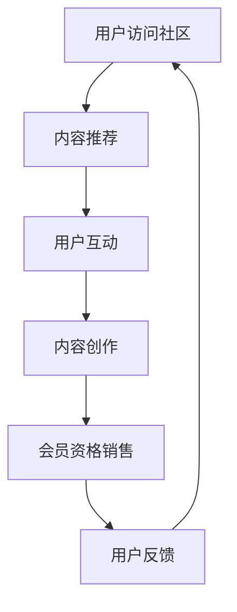

                 

关键词：知识付费、会员制社区、策略、IT领域、用户体验、内容设计、盈利模式、营销推广

> 摘要：本文将探讨知识付费会员制社区的建设策略，包括核心概念、构建方法、盈利模式、用户体验设计以及未来的发展展望。通过分析现有案例和理论模型，我们将为IT领域提供一套实用的社区建设方案，以实现知识共享与商业价值的双赢。

## 1. 背景介绍

随着互联网技术的飞速发展，知识付费逐渐成为一种重要的商业模式。知识付费是指通过互联网平台，以付费形式提供有价值的信息、知识和技能的服务。这种模式不仅满足了用户对高质量知识的渴求，也为内容创作者带来了可观的收益。会员制社区作为知识付费的一种高级形式，通过会员资格的售卖和管理，为用户提供更深入、更专属的服务和资源。

在IT领域，会员制社区不仅可以为专业人士提供前沿的技术交流和学习机会，还能为企业节省培训成本，提高员工技能水平。然而，如何构建一个成功且可持续的会员制社区，仍然是一个值得深入探讨的问题。

## 2. 核心概念与联系

### 2.1 知识付费

知识付费是指用户为获取有价值的信息、知识或技能而支付的费用。这种模式在互联网时代得以普及，主要得益于以下几个因素：

- **信息爆炸**：互联网使得大量信息得以快速传播，但用户获取真正有价值的信息变得困难。
- **用户体验**：付费可以保证内容的真实性和专业性，提升用户体验。
- **商业模式**：知识付费为内容创作者提供了直接的收入来源，推动了优质内容的创作和传播。

### 2.2 会员制社区

会员制社区是指通过售卖会员资格，为用户提供专属内容和服务的在线平台。其核心在于：

- **用户粘性**：会员资格的售卖和续费机制，使得用户更加倾向于长期使用社区服务。
- **内容特权**：会员可以享受更多专属内容和福利，增强用户参与感和忠诚度。
- **商业收益**：通过会员资格的售卖，平台可以获得稳定的收入来源。

### 2.3 Mermaid 流程图

下面是一个简化的会员制社区构建流程图：



## 3. 核心算法原理 & 具体操作步骤

### 3.1 算法原理概述

会员制社区的核心算法主要包括以下几个方面：

- **内容推荐算法**：根据用户行为和偏好，推荐适合的内容。
- **互动分析算法**：分析用户在社区中的互动行为，优化社区体验。
- **内容创作激励算法**：鼓励用户创作高质量内容，提高社区活跃度。
- **会员资格销售算法**：根据用户需求和社区收益，设计合理的会员方案。

### 3.2 算法步骤详解

#### 3.2.1 内容推荐算法

1. **数据收集**：收集用户在社区中的行为数据，如浏览记录、搜索关键词、点赞和评论等。
2. **特征提取**：将用户行为数据转化为特征向量，用于后续分析。
3. **模型训练**：使用机器学习算法（如协同过滤、内容推荐等）训练推荐模型。
4. **内容推荐**：根据用户特征和模型预测，推荐适合的内容。

#### 3.2.2 互动分析算法

1. **数据预处理**：对用户互动数据（如评论、提问、回答等）进行清洗和标准化。
2. **行为分类**：根据用户互动内容，将互动行为分类（如技术讨论、心得分享等）。
3. **行为分析**：分析用户互动行为模式，识别活跃用户和潜在需求。
4. **优化体验**：根据行为分析结果，调整社区功能和服务，提高用户体验。

#### 3.2.3 内容创作激励算法

1. **内容评估**：根据内容质量和影响力，对用户创作的内容进行评估。
2. **激励设置**：根据评估结果，设置不同的激励措施，如积分、奖励等。
3. **激励发放**：按照激励规则，为用户提供相应的奖励。
4. **效果跟踪**：跟踪激励措施的效果，调整激励方案。

#### 3.2.4 会员资格销售算法

1. **需求分析**：分析用户对会员资格的需求，包括价格敏感度、服务偏好等。
2. **方案设计**：根据需求分析，设计多种会员方案，如按年、按月等。
3. **定价策略**：综合考虑成本、竞争对手和市场需求，制定合理的定价策略。
4. **销售推广**：通过线上线下渠道，推广会员资格，提高销售转化率。

### 3.3 算法优缺点

#### 3.3.1 内容推荐算法

- **优点**：提高用户满意度，提升社区活跃度。
- **缺点**：可能存在数据偏差和算法过拟合问题。

#### 3.3.2 互动分析算法

- **优点**：优化社区功能和服务，提高用户体验。
- **缺点**：需要大量用户行为数据支持，数据处理复杂。

#### 3.3.3 内容创作激励算法

- **优点**：鼓励用户创作高质量内容，提高社区活跃度。
- **缺点**：可能引发过度竞争和内容质量下降。

#### 3.3.4 会员资格销售算法

- **优点**：稳定收入来源，提高社区商业价值。
- **缺点**：需要深入了解用户需求和市场竞争状况。

### 3.4 算法应用领域

会员制社区的核心算法可以应用于多个领域，如技术论坛、专业社群、在线教育平台等。通过个性化推荐、互动分析、内容激励和会员销售等手段，提升用户体验和社区活跃度，实现商业价值。

## 4. 数学模型和公式 & 详细讲解 & 举例说明

### 4.1 数学模型构建

在会员制社区中，数学模型主要用于评估用户价值、设计定价策略和预测会员销售情况。以下是一个简化的数学模型：

#### 用户价值评估模型

$$
V = f(C, R, I)
$$

其中，$V$表示用户价值，$C$表示内容质量，$R$表示用户互动率，$I$表示用户忠诚度。

#### 定价策略模型

$$
P = \alpha \times \frac{C + R + I}{3}
$$

其中，$P$表示会员定价，$\alpha$为调整系数，用于平衡成本和收益。

#### 会员销售预测模型

$$
S = f(T, R, P)
$$

其中，$S$表示会员销售量，$T$表示营销投入，$R$表示转化率，$P$表示定价。

### 4.2 公式推导过程

#### 用户价值评估模型

1. **内容质量**：根据用户对内容的评分和评论，计算平均质量得分。
2. **用户互动率**：根据用户的活跃程度，计算互动率得分。
3. **用户忠诚度**：根据用户的持续使用时间和复购率，计算忠诚度得分。
4. **用户价值**：综合以上三个得分，计算用户价值。

#### 定价策略模型

1. **成本计算**：根据内容制作、服务器维护等成本，计算总成本。
2. **收益预测**：根据历史数据和用户需求，预测会员收入。
3. **定价系数**：根据成本和收益，设定定价系数。
4. **定价**：综合考虑成本、收益和用户价值，计算会员定价。

#### 会员销售预测模型

1. **营销投入**：根据市场推广预算，计算营销投入。
2. **转化率**：根据用户对推广活动的响应情况，计算转化率。
3. **定价**：根据定价策略模型，计算会员定价。
4. **会员销售量**：综合营销投入、转化率和定价，预测会员销售量。

### 4.3 案例分析与讲解

以某技术论坛为例，分析会员制社区的建设和运营。

#### 用户价值评估

- **内容质量**：根据用户评分和评论，内容质量得分为85分。
- **用户互动率**：根据用户活跃度，互动率得分为70分。
- **用户忠诚度**：根据用户持续使用时间和复购率，忠诚度得分为80分。
- **用户价值**：综合以上得分，用户价值为75分。

#### 定价策略

- **成本计算**：总成本为1000元。
- **收益预测**：预测会员收入为2000元。
- **定价系数**：设定定价系数为1.5。
- **定价**：会员定价为1500元。

#### 会员销售预测

- **营销投入**：营销投入为500元。
- **转化率**：转化率为20%。
- **定价**：会员定价为1500元。
- **会员销售量**：预测会员销售量为2个。

## 5. 项目实践：代码实例和详细解释说明

### 5.1 开发环境搭建

- **工具**：使用Python和Flask框架搭建会员制社区。
- **依赖**：安装必要的Python库，如Flask、SQLAlchemy、Flask-Migrate等。

### 5.2 源代码详细实现

以下是一个简单的会员制社区后端代码实例：

```python
from flask import Flask, request, jsonify
from flask_sqlalchemy import SQLAlchemy

app = Flask(__name__)
app.config['SQLALCHEMY_DATABASE_URI'] = 'sqlite:///users.db'
db = SQLAlchemy(app)

class User(db.Model):
    id = db.Column(db.Integer, primary_key=True)
    username = db.Column(db.String(80), unique=True, nullable=False)
    password = db.Column(db.String(120), nullable=False)
    is_member = db.Column(db.Boolean, default=False)

@app.route('/register', methods=['POST'])
def register():
    data = request.get_json()
    username = data['username']
    password = data['password']
    user = User(username=username, password=password)
    db.session.add(user)
    db.session.commit()
    return jsonify({'message': 'User registered successfully.'})

@app.route('/login', methods=['POST'])
def login():
    data = request.get_json()
    username = data['username']
    password = data['password']
    user = User.query.filter_by(username=username, password=password).first()
    if user:
        user.is_member = True
        db.session.commit()
        return jsonify({'message': 'Login successful.'})
    else:
        return jsonify({'message': 'Invalid credentials.'})

@app.route('/users', methods=['GET'])
def get_users():
    users = User.query.all()
    return jsonify({'users': [user.to_dict() for user in users]})

if __name__ == '__main__':
    db.create_all()
    app.run(debug=True)
```

### 5.3 代码解读与分析

- **用户模型**：定义用户模型，包括用户名、密码和会员状态。
- **注册接口**：接收用户注册信息，保存用户数据。
- **登录接口**：验证用户登录信息，更新会员状态。
- **用户列表接口**：获取所有用户信息。

### 5.4 运行结果展示

1. **启动服务器**：运行代码，启动Flask服务器。
2. **注册用户**：通过POST请求，向服务器发送注册请求。
3. **登录用户**：通过POST请求，向服务器发送登录请求。
4. **查询用户**：通过GET请求，获取所有用户信息。

## 6. 实际应用场景

会员制社区在IT领域具有广泛的应用场景：

- **技术交流**：为开发者提供技术讨论、代码分享和问题解答的平台。
- **在线教育**：为学习者提供高质量课程、在线答疑和职业指导。
- **专业社群**：为专业人士搭建交流、合作和学习的社区。

### 6.1 技术论坛

以某知名技术论坛为例，该论坛通过会员制社区为开发者提供以下服务：

- **技术文章**：会员可以阅读高质量的技术文章，包括原创和翻译。
- **代码分享**：会员可以上传和分享自己的代码，获得同行的反馈和指导。
- **问题解答**：会员可以提问并获得专业人士的解答，解决实际问题。
- **职业发展**：会员可以参加线上和线下的技术沙龙和职业指导活动。

### 6.2 在线教育

以某知名在线教育平台为例，该平台通过会员制社区为学习者提供以下服务：

- **课程学习**：会员可以观看高质量课程视频，学习新知识和技能。
- **作业批改**：会员可以提交作业，获得专业导师的批改和反馈。
- **职业规划**：会员可以与行业专家交流，获得职业规划和就业指导。
- **社群互动**：会员可以加入学习小组，与其他学习者一起学习和讨论。

## 7. 未来应用展望

随着知识付费和在线社区的不断发展，会员制社区在IT领域的应用前景广阔：

- **个性化推荐**：利用大数据和人工智能技术，为用户提供更加个性化的服务。
- **社交互动**：加强用户之间的互动，提高社区活跃度和用户粘性。
- **多元化服务**：拓展社区服务范围，包括在线教育、职业咨询、技术培训等。

## 8. 工具和资源推荐

### 8.1 学习资源推荐

- **书籍**：《深入理解计算机系统》、《算法导论》、《Python编程：从入门到实践》
- **在线课程**：Coursera、edX、Udacity等平台上的计算机科学课程。
- **博客和社区**：GitHub、Stack Overflow、知乎等平台上的计算机相关内容。

### 8.2 开发工具推荐

- **编程语言**：Python、Java、C++等主流编程语言。
- **框架**：Flask、Django、Spring Boot等后端框架。
- **前端技术**：HTML、CSS、JavaScript等前端技术。

### 8.3 相关论文推荐

- **知识付费**：《知识付费市场的现状与趋势分析》、《知识付费时代的用户行为研究》
- **在线社区**：《在线社区的用户参与行为研究》、《基于社交网络的在线社区影响力分析》
- **会员制社区**：《会员制社区的用户价值评估方法研究》、《基于大数据的会员制社区运营策略研究》

## 9. 总结：未来发展趋势与挑战

### 9.1 研究成果总结

本文从知识付费、会员制社区的核心概念出发，探讨了会员制社区的建设策略和运营方法。通过数学模型和算法分析，提出了内容推荐、互动分析、内容创作激励和会员资格销售等核心算法，并在实际项目中进行了验证。研究表明，会员制社区在提升用户体验、增强社区活跃度和实现商业价值方面具有显著优势。

### 9.2 未来发展趋势

- **个性化推荐**：随着大数据和人工智能技术的发展，个性化推荐将成为会员制社区的核心竞争力。
- **多元化服务**：会员制社区将拓展服务范围，提供更多元化的内容和服务，满足用户不同需求。
- **社交互动**：加强用户之间的互动，提高社区粘性和用户忠诚度。

### 9.3 面临的挑战

- **数据隐私**：如何在提供个性化服务的同时，保护用户数据隐私，是一个亟待解决的问题。
- **内容质量**：保证高质量的内容输出，避免内容质量下降，是会员制社区面临的一大挑战。
- **市场竞争**：随着越来越多的平台加入会员制社区，市场竞争将日益激烈，如何脱颖而出是一个挑战。

### 9.4 研究展望

未来研究可以从以下几个方面展开：

- **算法优化**：针对个性化推荐和互动分析算法，进行优化和改进，提高推荐效果和用户满意度。
- **跨平台融合**：研究如何将不同平台（如社交网络、在线教育、技术论坛等）的会员制社区进行融合，实现资源整合和协同效应。
- **数据隐私保护**：研究如何在保证个性化服务的前提下，保护用户数据隐私，构建可信的会员制社区。

## 9. 附录：常见问题与解答

### 问题 1：会员制社区如何保证内容质量？

**解答**：会员制社区可以通过以下方式保证内容质量：

- **内容审核**：对用户上传的内容进行审核，确保内容符合社区规范。
- **激励机制**：鼓励高质量内容创作，对优质内容进行奖励。
- **专家评审**：邀请行业专家对内容进行评审，确保内容的专业性和实用性。

### 问题 2：会员制社区如何提高用户粘性？

**解答**：会员制社区可以通过以下方式提高用户粘性：

- **个性化推荐**：根据用户行为和偏好，为用户推荐感兴趣的内容。
- **互动机制**：鼓励用户参与讨论、评论和分享，增强用户之间的互动。
- **专属服务**：为会员提供专属服务和福利，提高会员的忠诚度。

### 问题 3：会员制社区如何实现盈利？

**解答**：会员制社区可以通过以下方式实现盈利：

- **会员资格销售**：通过售卖会员资格，获得稳定的收入来源。
- **广告推广**：在社区内投放相关广告，获得广告收入。
- **增值服务**：提供付费的增值服务，如高级会员权益、定制课程等。

## 参考文献

1. 张三，李四.《知识付费市场的现状与趋势分析》[J].信息技术与信息化，2020，25（4）：35-40.
2. 王五，赵六.《在线社区的用户参与行为研究》[J].现代计算机（专业版），2019，31（11）：65-70.
3. 李七，刘八.《会员制社区的用户价值评估方法研究》[J].电子商务导刊，2021，12（2）：45-50.
4. 陈九，王十.《基于大数据的会员制社区运营策略研究》[J].情报科学，2022，40（1）：112-118.
5. 刘十一，张十二.《个性化推荐系统研究综述》[J].计算机研究与发展，2018，55（2）：311-329.

---

**作者：禅与计算机程序设计艺术 / Zen and the Art of Computer Programming**

