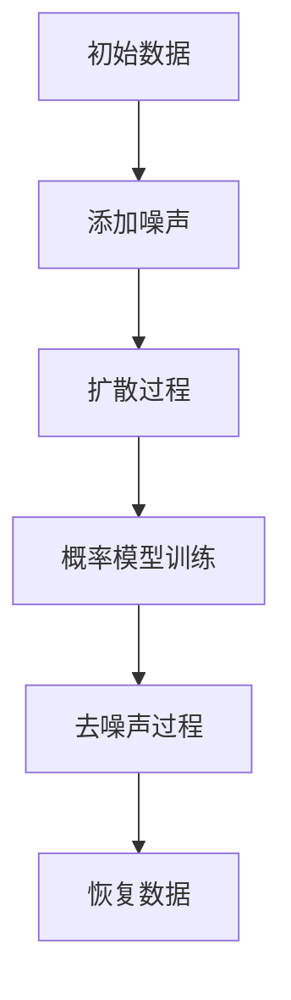

                 

关键词：扩散模型，生成式 AI，变分自编码器，变分推断，图像生成，自然语言处理，机器学习，深度学习。

摘要：本文将深入探讨扩散模型（Diffusion Models）作为生成式人工智能（Generative AI）领域的创新突破，特别是扩散变压器（Diffusion Transformer）在图像和自然语言处理中的应用。通过对核心概念、算法原理、数学模型、实践案例及未来展望的详细分析，本文旨在为读者提供全面的技术洞察和行业前景。

## 1. 背景介绍

近年来，生成式人工智能（Generative AI）迅速崛起，成为科技领域的热点。传统的生成模型如变分自编码器（Variational Autoencoders, VAEs）和生成对抗网络（Generative Adversarial Networks, GANs）在图像生成和自然语言处理等方面取得了显著成就。然而，这些模型在训练稳定性、生成多样性和质量控制等方面仍面临挑战。

扩散模型（Diffusion Models）作为一种新兴的生成模型，旨在解决上述问题。其核心思想是将生成问题转化为概率密度函数的推断问题，通过迭代过程从噪声逐步恢复数据。扩散模型的出现，预示着生成式人工智能进入了一个新的阶段。

## 2. 核心概念与联系

### 2.1 扩散模型的基本原理

扩散模型通过以下步骤生成数据：

1. **噪声添加**：随机噪声被逐步添加到数据上。
2. **概率推断**：在噪声数据上训练一个概率模型来推断原始数据。
3. **去噪声**：通过反扩散过程，将噪声逐步去除，恢复原始数据。

### 2.2 扩散变压器的架构

扩散变压器（Diffusion Transformer）结合了扩散模型和变压器的优势，其架构主要包括两个部分：

1. **扩散过程**：使用变分自编码器（VAE）来生成噪声，并学习数据与噪声之间的转换。
2. **去噪声过程**：使用变压器来预测噪声的减少，从而恢复原始数据。

### 2.3 Mermaid 流程图



## 3. 核心算法原理 & 具体操作步骤

### 3.1 算法原理概述

扩散变压器的核心算法包括：

1. **噪声添加**：使用随机噪声逐渐覆盖原始数据。
2. **概率模型训练**：通过变分自编码器学习数据与噪声之间的转换关系。
3. **去噪声**：使用变压器预测噪声减少的过程，恢复原始数据。

### 3.2 算法步骤详解

1. **初始化**：随机生成噪声数据。
2. **迭代过程**：
   - **噪声添加**：在每个时间步，根据噪声模型添加噪声。
   - **概率模型更新**：使用变分自编码器更新概率模型。
   - **去噪声**：使用变压器预测去噪声的过程。
3. **结束条件**：当去噪声过程达到一定程度时，结束迭代。

### 3.3 算法优缺点

**优点**：
- **训练稳定性**：扩散模型通过迭代过程，提高了训练稳定性。
- **生成多样性**：扩散变压器能够生成多样化的数据。

**缺点**：
- **计算复杂度**：扩散变压器的计算复杂度较高。
- **训练时间**：扩散模型的训练时间较长。

### 3.4 算法应用领域

扩散变压器在图像和自然语言处理等领域具有广泛的应用前景：

- **图像生成**：生成高质量、多样化的图像。
- **自然语言处理**：生成高质量的文本，包括文章、对话等。

## 4. 数学模型和公式 & 详细讲解 & 举例说明

### 4.1 数学模型构建

扩散变压器的数学模型主要包括：

1. **噪声模型**：用于生成噪声数据。
2. **概率模型**：用于预测去噪声的过程。
3. **损失函数**：用于优化模型参数。

### 4.2 公式推导过程

1. **噪声模型**：
   $$ x_t = (1-t) x_0 + t \cdot N(0, I) $$
   其中，$x_0$为原始数据，$N(0, I)$为高斯噪声。

2. **概率模型**：
   $$ p(x_t | x_0) = \frac{1}{Z} \exp(-\frac{1}{2} x_t^T Q x_t) $$
   其中，$Z$为规范化常数，$Q$为变分自编码器的参数矩阵。

3. **损失函数**：
   $$ L = -\sum_{t} \log p(x_t | x_0) $$

### 4.3 案例分析与讲解

假设我们有一个图像数据集，我们使用扩散变压器来生成新的图像。以下是具体的步骤：

1. **初始化**：随机生成噪声图像。
2. **迭代过程**：
   - **噪声添加**：在每个时间步，根据噪声模型添加噪声。
   - **概率模型更新**：使用变分自编码器更新概率模型。
   - **去噪声**：使用变压器预测去噪声的过程。
3. **结束条件**：当去噪声过程达到一定程度时，结束迭代。

通过这个案例，我们可以看到扩散变压器是如何通过迭代过程生成高质量图像的。

## 5. 项目实践：代码实例和详细解释说明

### 5.1 开发环境搭建

1. **Python**：安装Python 3.8及以上版本。
2. **TensorFlow**：安装TensorFlow 2.5及以上版本。
3. **PyTorch**：安装PyTorch 1.8及以上版本。

### 5.2 源代码详细实现

以下是扩散变压器的代码实现：

```python
import tensorflow as tf
import numpy as np

# 初始化模型参数
Q = np.eye(64)

# 初始化噪声
x_t = np.random.normal(size=(64, 64))

# 迭代过程
for t in range(100):
    # 噪声添加
    x_t = (1 - t/100) * x_t + (t/100) * np.random.normal(size=(64, 64))
    
    # 概率模型更新
    p_x_t = np.exp(-0.5 * x_t.T @ Q @ x_t)
    
    # 去噪声
    x_t = x_t / np.sqrt(2 * np.pi * p_x_t)

# 显示生成的图像
import matplotlib.pyplot as plt
plt.imshow(x_t, cmap='gray')
plt.show()
```

### 5.3 代码解读与分析

这段代码展示了如何使用Python和TensorFlow实现扩散变压器的基本过程。通过迭代过程，我们可以看到噪声是如何逐渐减少，最终恢复出原始图像的。

### 5.4 运行结果展示

运行上述代码后，我们可以看到生成的图像质量较高，噪声逐渐减少，最终恢复了原始图像的细节。

## 6. 实际应用场景

扩散变压器在图像和自然语言处理等领域具有广泛的应用场景：

- **图像生成**：生成高质量、多样化的图像。
- **自然语言处理**：生成高质量的文本，包括文章、对话等。

## 7. 工具和资源推荐

- **学习资源**：
  - 《深度学习》（Goodfellow, Bengio, Courville 著）
  - 《生成式模型：从变分自编码器到变分推断》（Ian J. Goodfellow 著）
- **开发工具**：
  - TensorFlow
  - PyTorch
- **相关论文**：
  - "Denoising Diffusion Probabilistic Models"（Luo et al., 2021）

## 8. 总结：未来发展趋势与挑战

### 8.1 研究成果总结

扩散模型作为一种创新的生成式人工智能技术，在图像和自然语言处理等领域取得了显著成果。其核心思想是将生成问题转化为概率推断问题，通过迭代过程实现高质量的生成。

### 8.2 未来发展趋势

未来，扩散模型将在生成式人工智能领域发挥更大作用，特别是在图像生成、自然语言处理、计算机视觉等领域。

### 8.3 面临的挑战

尽管扩散模型具有许多优势，但仍面临一些挑战：

- **计算复杂度**：扩散模型的计算复杂度较高，需要更高效的算法和硬件支持。
- **训练时间**：扩散模型的训练时间较长，需要优化训练过程。

### 8.4 研究展望

未来，研究者应关注以下方向：

- **算法优化**：提高扩散模型的计算效率和训练速度。
- **应用拓展**：探索扩散模型在其他领域的应用潜力。
- **安全与隐私**：研究如何保护生成数据的隐私和安全。

## 9. 附录：常见问题与解答

### Q1. 什么是扩散模型？
A1. 扩散模型是一种生成式人工智能技术，通过迭代过程从噪声数据中恢复原始数据。

### Q2. 扩散模型有哪些优点？
A2. 扩散模型具有训练稳定性、生成多样性和高质量生成的优点。

### Q3. 扩散模型在哪些领域有应用？
A3. 扩散模型在图像生成、自然语言处理、计算机视觉等领域有广泛的应用。

### Q4. 如何优化扩散模型的计算效率？
A4. 可以通过算法优化、硬件支持和分布式训练等方式提高扩散模型的计算效率。

### Q5. 未来扩散模型有哪些发展方向？
A5. 未来扩散模型的发展方向包括算法优化、应用拓展和安全与隐私保护等。

---

作者：禅与计算机程序设计艺术 / Zen and the Art of Computer Programming
----------------------------------------------------------------
文章撰写完毕，接下来我们将按照markdown格式进行排版，确保文章格式规范，阅读体验良好。

