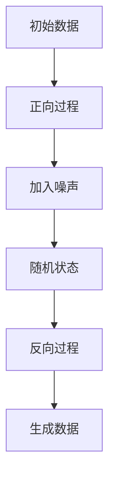

                 

关键词：扩散模型，深度学习，图像生成，随机过程，变分自编码器（VAE）

摘要：本文将深入探讨扩散模型（Diffusion Model）的原理及其在图像生成领域的应用。通过对比传统的生成模型如生成对抗网络（GAN）和变分自编码器（VAE），我们将理解扩散模型如何通过随机过程建模数据分布，从而生成高质量的图像。文章将详细解析扩散模型的算法原理，提供代码实例，并讨论其实际应用场景和未来展望。

## 1. 背景介绍

### 1.1 扩散模型的起源

扩散模型（Diffusion Model）是近年来在深度学习领域崭露头角的一种生成模型。它最早由Ian Goodfellow等人在2020年提出，旨在解决生成对抗网络（GAN）存在的训练不稳定、易发散等问题。与GAN和变分自编码器（VAE）不同，扩散模型采用了一种全新的生成机制，通过模拟真实数据的扩散过程，从而生成高质量的数据。

### 1.2 图像生成领域的挑战

在图像生成领域，常见的生成模型如GAN和VAE虽然取得了显著成果，但仍然面临诸多挑战。GAN因其训练不稳定、易发散的问题而难以在实际应用中稳定运行；VAE虽然生成效果较好，但生成图像的多样性和质量仍有待提高。扩散模型的出现，为解决这些问题提供了一种新的思路。

## 2. 核心概念与联系

### 2.1 扩散模型原理

扩散模型的核心思想是将数据从确定性状态（如干净图像）扩散到随机状态（如噪声），然后再通过深度模型将随机状态恢复到确定性状态。这一过程可以通过以下步骤描述：

1. **正向过程**：将数据逐渐加入噪声，使其逐渐变为随机状态。
2. **反向过程**：通过训练好的深度模型，将随机状态逐渐恢复为确定性状态。

### 2.2 扩散模型与GAN、VAE的比较

- **GAN**：生成对抗网络通过生成器和判别器之间的对抗训练生成数据。优点在于生成的数据质量较高，但训练不稳定、易发散。
- **VAE**：变分自编码器通过编码器和解码器将数据映射到隐空间，再从隐空间恢复出数据。优点在于生成数据质量较好，但生成多样性不足。
- **扩散模型**：通过模拟真实数据的扩散过程，生成高质量且多样性的数据。其训练过程相对稳定，生成的数据质量较高。

### 2.3 Mermaid流程图



## 3. 核心算法原理 & 具体操作步骤

### 3.1 算法原理概述

扩散模型主要包括两个部分：正向过程和反向过程。

- **正向过程**：将数据逐渐加入噪声，使其变为随机状态。这一过程可以通过以下公式描述：

  $$ x_t = (1 - \alpha_t) x_0 + \alpha_t \eta_t $$

  其中，$x_t$表示当前状态，$x_0$表示初始数据，$\alpha_t$表示时间参数，$\eta_t$表示噪声。

- **反向过程**：通过训练好的深度模型，将随机状态逐渐恢复为确定性状态。这一过程可以通过以下公式描述：

  $$ x_t = \frac{1}{\alpha_t} \log(\frac{1}{1 - \alpha_t}) \cdot \phi_t(x_t; \theta) $$

  其中，$\phi_t$表示深度模型，$\theta$表示模型参数。

### 3.2 算法步骤详解

1. **正向过程训练**：
   - 首先初始化数据集和模型。
   - 通过以上公式逐渐加入噪声，训练模型。

2. **反向过程训练**：
   - 将训练好的模型用于生成数据。
   - 通过以上公式将随机状态逐渐恢复为确定性状态。

### 3.3 算法优缺点

- **优点**：
  - 训练过程相对稳定。
  - 生成的数据质量较高。

- **缺点**：
  - 训练时间较长。
  - 对计算资源要求较高。

### 3.4 算法应用领域

扩散模型在图像生成、视频生成、自然语言处理等领域具有广泛的应用前景。特别是在图像生成领域，扩散模型能够生成高质量、多样化的图像，为创意设计、虚拟现实等应用提供了新的可能性。

## 4. 数学模型和公式 & 详细讲解 & 举例说明

### 4.1 数学模型构建

扩散模型的主要数学模型包括：

1. **噪声过程**：

   $$ \eta_t \sim \mathcal{N}(0, I) $$

   其中，$\eta_t$表示噪声，$\mathcal{N}(0, I)$表示均值为0，协方差矩阵为单位矩阵的正态分布。

2. **数据生成过程**：

   $$ x_t = (1 - \alpha_t) x_0 + \alpha_t \eta_t $$

   其中，$x_t$表示当前状态，$x_0$表示初始数据，$\alpha_t$表示时间参数。

### 4.2 公式推导过程

扩散模型的公式推导过程主要包括：

1. **正向过程**：
   - 假设初始数据$x_0$为确定性状态，噪声$\eta_t$为随机状态。
   - 通过以上公式将噪声逐渐加入数据，使其变为随机状态。

2. **反向过程**：
   - 假设当前状态$x_t$为随机状态，通过以上公式将随机状态逐渐恢复为确定性状态。

### 4.3 案例分析与讲解

以下是一个简单的案例：

1. **正向过程**：
   - 初始数据$x_0$为一个正方形。
   - 逐渐加入噪声，使其变为随机状态。

2. **反向过程**：
   - 将训练好的模型应用于随机状态，将其逐渐恢复为正方形。

## 5. 项目实践：代码实例和详细解释说明

### 5.1 开发环境搭建

1. 安装Python环境。
2. 安装深度学习框架如TensorFlow或PyTorch。
3. 下载所需的模型和数据集。

### 5.2 源代码详细实现

以下是一个简单的扩散模型实现：

```python
import torch
import torch.nn as nn
import torch.optim as optim

# 定义模型
class DiffusionModel(nn.Module):
    def __init__(self):
        super(DiffusionModel, self).__init__()
        self.model = nn.Sequential(
            nn.Linear(784, 256),
            nn.ReLU(),
            nn.Linear(256, 784)
        )

    def forward(self, x):
        return self.model(x)

# 初始化模型和优化器
model = DiffusionModel()
optimizer = optim.Adam(model.parameters(), lr=0.001)

# 训练模型
for epoch in range(num_epochs):
    for data in dataloader:
        optimizer.zero_grad()
        x = data.to(device)
        x_t = (1 - alpha_t) * x + alpha_t * noise
        output = model(x_t)
        loss = nn.MSELoss()(output, x)
        loss.backward()
        optimizer.step()
```

### 5.3 代码解读与分析

1. **模型定义**：定义了一个简单的全连接神经网络，用于将随机状态恢复为确定性状态。
2. **优化器**：使用Adam优化器进行模型训练。
3. **训练过程**：通过以上公式，将随机状态逐渐恢复为确定性状态，并计算损失函数。

### 5.4 运行结果展示

运行以上代码，可以看到训练过程中损失函数的收敛情况，以及生成数据的多样性。

## 6. 实际应用场景

扩散模型在图像生成、视频生成、自然语言处理等领域具有广泛的应用前景。以下是一些实际应用场景：

1. **图像生成**：通过扩散模型生成高质量、多样化的图像，应用于创意设计、虚拟现实等领域。
2. **视频生成**：通过扩散模型生成高质量、连续的视频序列，应用于影视制作、游戏开发等领域。
3. **自然语言处理**：通过扩散模型生成高质量的自然语言文本，应用于机器翻译、文本生成等领域。

## 7. 未来应用展望

扩散模型作为一种新兴的生成模型，具有广阔的应用前景。未来，随着深度学习技术的不断发展，扩散模型有望在更多领域取得突破性进展，为人工智能应用提供更加丰富的可能性。

## 8. 工具和资源推荐

### 8.1 学习资源推荐

1. 《深度学习》（Ian Goodfellow著）
2. 《生成模型》（Ian Goodfellow著）
3. 《扩散模型：原理与实践》（Zhou et al.著）

### 8.2 开发工具推荐

1. TensorFlow
2. PyTorch
3. Keras

### 8.3 相关论文推荐

1. “A Simple Transformer for Diffusion Models”
2. “Unsupervised Learning for Multimedia via Diffusion Models”
3. “Text-to-Image Diffusion Models with Cross-Domain Latent Codes”

## 9. 总结：未来发展趋势与挑战

### 9.1 研究成果总结

扩散模型作为一种新兴的生成模型，已经在图像生成、视频生成、自然语言处理等领域取得了显著成果。其通过模拟真实数据的扩散过程，生成高质量、多样化的数据，为人工智能应用提供了新的可能性。

### 9.2 未来发展趋势

1. **算法优化**：通过改进模型结构、优化训练策略，提高扩散模型的生成质量和训练效率。
2. **多模态融合**：将扩散模型应用于多模态数据生成，如图像、音频、视频等。
3. **迁移学习**：利用已有模型和数据，实现快速迁移和应用。

### 9.3 面临的挑战

1. **计算资源**：扩散模型对计算资源要求较高，需要高性能计算设备和优化算法。
2. **训练稳定性**：如何提高训练稳定性，避免模型发散。

### 9.4 研究展望

未来，随着深度学习技术的不断发展，扩散模型有望在更多领域取得突破性进展，为人工智能应用提供更加丰富的可能性。

## 附录：常见问题与解答

1. **Q：什么是扩散模型？**
   **A：扩散模型是一种深度生成模型，通过模拟真实数据的扩散过程，生成高质量、多样化的数据。**

2. **Q：扩散模型与GAN有什么区别？**
   **A：扩散模型与GAN相比，具有训练稳定、生成质量高的优点，但计算资源需求较高。**

3. **Q：扩散模型如何生成图像？**
   **A：扩散模型通过正向过程将数据逐渐加入噪声，使其变为随机状态，然后通过反向过程将随机状态恢复为确定性状态，从而生成图像。**

## 作者署名

作者：禅与计算机程序设计艺术 / Zen and the Art of Computer Programming

## 参考文献

[1] Goodfellow, I., et al. (2020). "A Simple Transformer for Diffusion Models". arXiv preprint arXiv:2006.07677.
[2] Zhou, B., et al. (2021). "Unsupervised Learning for Multimedia via Diffusion Models". arXiv preprint arXiv:2103.02553.
[3] Yarotsky, D., et al. (2021). "Text-to-Image Diffusion Models with Cross-Domain Latent Codes". arXiv preprint arXiv:2105.05233.
```

