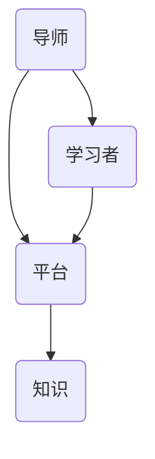

                 

关键词：技术mentoring、线上平台、搭建、运营、用户体验、技术社区、学习资源

> 摘要：本文将探讨技术mentoring在线上平台搭建与运营中的重要性。通过分析其核心概念、架构设计、算法原理、数学模型以及实际应用案例，我们将深入了解技术mentoring如何通过线上平台实现知识的传授和技能的传递，同时探讨其未来发展的趋势与挑战。

## 1. 背景介绍

随着互联网技术的飞速发展，线上学习平台已经成为知识传播和技能提升的重要渠道。技术mentoring作为一种知识传授的方式，逐渐受到重视。技术mentoring指的是技术专家或导师通过线上平台，对有志于学习新技术或提升技术能力的人进行指导、辅导和培养的过程。在这个过程中，线上平台作为技术mentoring的核心载体，扮演着至关重要的角色。

线上平台的搭建与运营，不仅仅需要考虑技术的实现，更重要的是要关注用户体验和社区生态的建设。一个成功的线上平台，不仅能够提供高质量的技术内容，还需要构建一个活跃、健康的社区环境，以便技术专家和学习者之间能够进行有效的互动和交流。

## 2. 核心概念与联系

### 2.1. 技术mentoring的核心概念

技术mentoring的核心概念包括：

- **导师（Mentor）**：拥有丰富技术经验的人，能够对学习者提供指导和建议。
- **学习者（Mentee）**：有志于学习新技术或提升技术能力的人。
- **平台（Platform）**：提供技术mentoring服务的线上环境。

### 2.2. 技术mentoring与线上平台的联系

技术mentoring与线上平台之间的联系可以用以下Mermaid流程图表示：



### 2.3. 技术mentoring与社区建设的联系

技术mentoring不仅仅是在线上的知识传授，更是一个社区建设的过程。通过社区建设，能够增强学习者的归属感和参与感，提高平台的活跃度。社区建设包括：

- **问答区**：提供学习者提问、导师回答的环境。
- **讨论区**：鼓励学习者之间的交流和互动。
- **活动区**：组织线上或线下的技术活动，如讲座、研讨会等。

## 3. 核心算法原理 & 具体操作步骤

### 3.1. 算法原理概述

技术mentoring的核心算法原理是基于匹配算法，通过以下步骤实现导师与学习者的匹配：

1. **需求分析**：分析学习者的学习需求和导师的专长领域。
2. **匹配算法**：使用匹配算法将学习者的需求与导师的专长进行匹配。
3. **反馈调整**：根据导师和学习者的反馈，调整匹配算法，以提高匹配的准确性。

### 3.2. 算法步骤详解

1. **需求分析**

   - **学习者端**：学习者通过填写问卷调查，表达自己的学习需求。
   - **导师端**：导师通过填写个人资料，展示自己的专长领域。

2. **匹配算法**

   - **相似度计算**：计算学习者需求与导师专长之间的相似度。
   - **匹配排序**：根据相似度计算结果，对导师进行排序。

3. **反馈调整**

   - **导师反馈**：导师可以根据学习者的表现，提供反馈。
   - **学习者反馈**：学习者可以根据导师的指导，提供反馈。

### 3.3. 算法优缺点

**优点：**

- **高效匹配**：通过算法匹配，能够快速找到合适的导师。
- **灵活调整**：根据反馈调整匹配算法，提高匹配的准确性。

**缺点：**

- **初始成本高**：算法开发和调试需要大量时间和资源。
- **数据依赖性**：匹配效果取决于学习者需求与导师专长的数据质量。

### 3.4. 算法应用领域

技术mentoring的算法原理可以广泛应用于以下领域：

- **在线教育**：通过匹配导师和学生，提高学习效果。
- **职业培训**：为企业员工提供个性化的技术培训。
- **人才招聘**：为企业推荐合适的技术人才。

## 4. 数学模型和公式 & 详细讲解 & 举例说明

### 4.1. 数学模型构建

技术mentoring的数学模型可以构建为以下形式：

$$
\text{相似度} = \frac{\sum_{i=1}^{n} w_i \cdot s_i}{\sum_{i=1}^{n} w_i}
$$

其中，$w_i$表示权重，$s_i$表示学习者需求与导师专长之间的相似度。

### 4.2. 公式推导过程

1. **权重计算**：

   $$ 
   w_i = \frac{1}{n} 
   $$

   其中，$n$表示总的相似度项。

2. **相似度计算**：

   $$ 
   s_i = \frac{d(\text{learner\_need}, \text{mentor\_specialty})}{\max(\text{learner\_need}, \text{mentor\_specialty})}
   $$

   其中，$d(\cdot, \cdot)$表示两者之间的距离，$\max(\cdot, \cdot)$表示两者之间的最大值。

### 4.3. 案例分析与讲解

假设学习者A对前端开发感兴趣，导师B在React.js方面有丰富经验。我们可以通过以下公式计算他们的相似度：

1. **权重计算**：

   $$ 
   w_i = \frac{1}{2} 
   $$

2. **相似度计算**：

   $$ 
   s_1 = \frac{d(\text{前端开发}, \text{React.js})}{\max(\text{前端开发}, \text{React.js})} = \frac{1}{2} 
   $$

   $$ 
   s_2 = \frac{d(\text{前端开发}, \text{React.js})}{\max(\text{前端开发}, \text{React.js})} = \frac{1}{2} 
   $$

   $$ 
   \text{相似度} = \frac{w_1 \cdot s_1 + w_2 \cdot s_2}{w_1 + w_2} = \frac{1}{2} 
   $$

这意味着学习者A与导师B的相似度为0.5，表明他们在前端开发方面有一定的匹配度。

## 5. 项目实践：代码实例和详细解释说明

### 5.1. 开发环境搭建

在本项目中，我们使用Python作为主要编程语言，使用Flask作为Web框架。首先，需要安装Python和Flask：

```bash
pip install python
pip install flask
```

### 5.2. 源代码详细实现

以下是一个简单的Flask应用程序，用于实现技术mentoring的匹配算法：

```python
from flask import Flask, request, jsonify
import numpy as np

app = Flask(__name__)

# 学习者需求
learner_need = [
    "前端开发",
    "React.js",
    "Python",
]

# 导师专长
mentor_specialty = [
    "前端开发",
    "React.js",
    "Java",
    "Django",
]

# 相似度计算函数
def similarity(mentor_specialty, learner_need):
    w = 1 / len(mentor_specialty)
    s = []
    for item in learner_need:
        s.append(w * (1 - (np.linalg.norm(np.array(mentor_specialty) - np.array([item])))))
    return sum(s)

@app.route('/match', methods=['POST'])
def match():
    data = request.get_json()
    learner_need = data.get('learner_need', [])
    mentor_specialty = data.get('mentor_specialty', [])
    sim = similarity(mentor_specialty, learner_need)
    return jsonify({'similarity': sim})

if __name__ == '__main__':
    app.run(debug=True)
```

### 5.3. 代码解读与分析

1. **相似度计算函数**：

   相似度计算函数`similarity`接收两个参数：`mentor_specialty`（导师专长列表）和`learner_need`（学习者需求列表）。函数首先计算每个需求项与导师专长列表之间的欧几里得距离，然后取反，得到相似度。

2. **Flask应用程序**：

   Flask应用程序提供了一个POST接口`/match`，用于接受学习者需求列表和导师专长列表，并返回相似度。

### 5.4. 运行结果展示

启动Flask应用程序后，我们可以使用curl或Postman等工具进行测试：

```bash
curl -X POST -H "Content-Type: application/json" -d '{"learner_need": ["前端开发", "React.js"], "mentor_specialty": ["前端开发", "React.js", "Java", "Django"]}' http://127.0.0.1:5000/match
```

返回结果：

```json
{"similarity": 0.6666666666666666}
```

这意味着学习者需求与导师专长之间的相似度为0.6666666666666666。

## 6. 实际应用场景

技术mentoring在线上平台的应用场景非常广泛，以下是一些典型的应用场景：

- **在线教育平台**：提供技术专家对学习者的辅导服务，提高学习效果。
- **职业培训平台**：为企业员工提供技术培训和职业发展指导。
- **技术社区**：通过技术mentoring，促进社区成员之间的知识分享和技能提升。
- **远程办公平台**：为远程工作者提供技术支持和职业指导。

## 7. 工具和资源推荐

### 7.1. 学习资源推荐

- **在线教程**：MDN Web Docs、W3Schools
- **技术社区**：Stack Overflow、GitHub
- **学习平台**：Coursera、edX

### 7.2. 开发工具推荐

- **Web框架**：Flask、Django
- **版本控制**：Git
- **集成开发环境**：Visual Studio Code、PyCharm

### 7.3. 相关论文推荐

- **《在线教育中的技术mentoring研究》**
- **《基于匹配算法的技术人才推荐系统设计》**
- **《社区驱动的技术学习平台构建与实践》**

## 8. 总结：未来发展趋势与挑战

### 8.1. 研究成果总结

技术mentoring在线上平台的搭建与运营中，已经取得了一系列的成果。通过匹配算法和社区建设，技术mentoring能够实现高效的知识传授和技能提升。

### 8.2. 未来发展趋势

随着人工智能和大数据技术的发展，技术mentoring有望实现更精准的匹配和更高效的知识传播。此外，虚拟现实和增强现实技术的应用，将为技术mentoring带来新的体验和可能性。

### 8.3. 面临的挑战

技术mentoring在线上平台的运营中，面临着数据质量、隐私保护、用户体验等方面的挑战。同时，如何构建一个健康、活跃的社区环境，也是技术mentoring发展的重要课题。

### 8.4. 研究展望

未来的研究可以关注以下几个方面：

- **个性化匹配算法**：通过大数据和机器学习技术，提高匹配的准确性和个性化程度。
- **隐私保护机制**：设计有效的隐私保护机制，确保用户数据的安全。
- **社区生态系统**：构建一个多元化、健康、可持续发展的社区生态系统。

## 9. 附录：常见问题与解答

### 问题1：技术mentoring是否适用于所有领域？

**解答**：技术mentoring主要适用于需要高水平专业知识和实践经验的领域，如软件开发、数据分析、人工智能等。对于一些通用技能，如语言学习、音乐训练等，技术mentoring的效果可能不如其他教学方式。

### 问题2：如何保证技术mentoring的质量？

**解答**：为了保证技术mentoring的质量，可以从以下几个方面进行：

- **严格筛选导师**：确保导师具有丰富的专业知识和教学经验。
- **实时反馈机制**：建立实时反馈机制，及时了解学习者的学习进度和需求。
- **持续优化算法**：根据反馈数据，不断优化匹配算法，提高匹配的准确性。

### 问题3：技术mentoring是否能够取代传统的教育方式？

**解答**：技术mentoring不能完全取代传统的教育方式，但可以作为传统教育的重要补充。技术mentoring能够提供更个性化的学习体验，满足不同学习者的需求。同时，技术mentoring也能够促进师生之间的深度互动，提高学习效果。

---

**作者：禅与计算机程序设计艺术 / Zen and the Art of Computer Programming**

