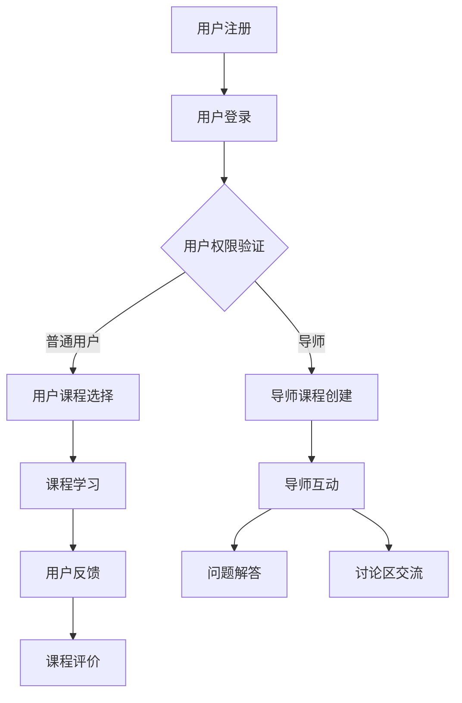

                 

关键词：技术mentoring、线上平台、搭建、运营、教育技术、用户体验、技术架构、云计算、数据分析

> 摘要：本文将深入探讨如何构建和运营一个有效的线上技术mentoring平台，包括核心概念、算法原理、项目实践、实际应用以及未来展望。本文旨在为技术从业者和教育者提供一些建设性指导，以帮助他们在这个快速发展的领域中获得成功。

## 1. 背景介绍

在当今数字化时代，技术mentoring已成为推动个人职业发展和技术进步的重要手段。然而，传统的mentoring模式往往受限于地理位置和时间的限制。为了解决这一问题，线上技术mentoring平台应运而生，它为技术从业者和学生提供了更加灵活和便捷的交流和学习环境。线上平台不仅能够跨越地域限制，还能提供丰富的资源和互动体验，成为现代教育和技术发展的重要驱动力。

本文将围绕线上技术mentoring平台的搭建与运营展开讨论，从核心概念到具体实施步骤，从数学模型到实际应用场景，再到未来展望，力求为读者提供全面的指导。本文的结构如下：

- **第1章：背景介绍**：简要介绍线上技术mentoring平台的重要性和背景。
- **第2章：核心概念与联系**：阐述平台的关键概念和基本架构。
- **第3章：核心算法原理 & 具体操作步骤**：详细解释平台的技术实现。
- **第4章：数学模型和公式 & 详细讲解 & 举例说明**：介绍相关的数学模型和公式。
- **第5章：项目实践：代码实例和详细解释说明**：通过实际项目展示平台的功能。
- **第6章：实际应用场景**：探讨平台在不同领域的应用。
- **第7章：工具和资源推荐**：推荐相关工具和资源。
- **第8章：总结：未来发展趋势与挑战**：总结研究成果并展望未来。
- **第9章：附录：常见问题与解答**：解答读者可能遇到的问题。

## 2. 核心概念与联系

### 2.1 平台的基本概念

在线上技术mentoring平台中，核心概念包括用户、导师、课程、反馈和互动。用户是平台的主要参与者，可以是学生、职场新人、技术爱好者等；导师则是拥有丰富经验和技能的技术专家，他们提供指导、解答问题和传授知识。课程是平台提供的学习内容，可以是视频课程、文档教程、代码示例等多种形式。反馈和互动则是平台的重要环节，通过用户的评论、评分和问答，可以不断提升平台的质量和用户体验。

### 2.2 平台的基本架构

线上技术mentoring平台通常包含以下几个关键模块：

- **用户管理系统**：管理用户注册、登录、权限设置和用户信息。
- **课程管理系统**：管理课程创建、发布、更新和用户学习进度。
- **互动系统**：提供实时聊天、问答和讨论区等功能。
- **数据分析和推荐系统**：收集用户数据，分析用户行为，提供个性化推荐。
- **支付和财务系统**：处理课程购买、支付和财务记录。

下面是一个简单的Mermaid流程图，展示了平台的基本架构和关键流程：



## 3. 核心算法原理 & 具体操作步骤

### 3.1 算法原理概述

线上技术mentoring平台的核心算法主要涉及用户行为分析、课程推荐和互动优化。用户行为分析算法通过收集和分析用户在平台上的操作数据，如浏览历史、问答记录和学习进度，来了解用户的学习兴趣和需求。课程推荐算法则基于用户行为分析的结果，使用协同过滤、基于内容的推荐等技术，为用户推荐适合的课程。互动优化算法旨在通过实时分析和优化用户的互动体验，提升平台的互动质量和用户满意度。

### 3.2 算法步骤详解

#### 3.2.1 用户行为分析

1. **数据收集**：收集用户在平台上的操作数据，如登录时间、浏览课程、提问和回答问题等。
2. **数据预处理**：清洗和整理收集到的数据，确保数据的质量和一致性。
3. **特征提取**：从预处理后的数据中提取出反映用户行为和兴趣的特征，如频繁使用的课程标签、问答偏好等。
4. **行为分析**：使用统计分析和机器学习算法，分析用户的行为模式，构建用户兴趣模型。

#### 3.2.2 课程推荐

1. **用户兴趣模型**：基于用户行为分析结果，构建用户的兴趣模型。
2. **推荐算法选择**：选择合适的推荐算法，如协同过滤、基于内容的推荐等。
3. **推荐结果生成**：根据用户兴趣模型和推荐算法，为用户生成推荐课程列表。
4. **推荐结果评估**：评估推荐结果的准确性和用户体验，不断优化推荐算法。

#### 3.2.3 互动优化

1. **实时监控**：实时监控用户的互动行为，如聊天记录、提问和回答等。
2. **行为分析**：分析互动行为数据，识别互动中的问题和潜在的用户需求。
3. **交互优化**：根据行为分析结果，优化平台的互动功能，提升用户体验。

### 3.3 算法优缺点

#### 优点

- **个性化推荐**：基于用户行为分析，能够为用户推荐个性化的课程和资源，提升学习效果。
- **实时互动**：实时监控和优化用户的互动体验，提高用户的满意度和参与度。
- **大数据支持**：利用大数据技术，收集和分析用户行为数据，为平台运营提供有力支持。

#### 缺点

- **算法复杂度高**：用户行为分析和推荐算法涉及大量的计算和处理，对硬件和软件资源要求较高。
- **数据隐私问题**：用户行为数据的收集和使用需要遵守数据保护法规，确保用户隐私不受侵犯。
- **算法偏见**：算法的推荐结果可能受到数据偏见的影响，导致推荐结果的偏差。

### 3.4 算法应用领域

- **在线教育**：为在线教育平台提供个性化的课程推荐和学习体验。
- **职业培训**：为职场新人提供针对性的职业培训和技能提升服务。
- **技术研发**：为技术研发团队提供技术指导和资源推荐，提升研发效率。

## 4. 数学模型和公式 & 详细讲解 & 举例说明

### 4.1 数学模型构建

线上技术mentoring平台中的数学模型主要包括用户行为分析模型、课程推荐模型和互动优化模型。下面将分别介绍这些模型的构建方法和相关公式。

#### 4.1.1 用户行为分析模型

用户行为分析模型通常采用机器学习算法，如朴素贝叶斯、决策树和神经网络等。以下是朴素贝叶斯模型的构建方法：

1. **特征提取**：从用户行为数据中提取出反映用户兴趣和需求的特征，如课程标签、问答内容等。
2. **特征转换**：将提取到的特征进行数值化处理，便于后续建模。
3. **概率分布建模**：根据用户行为数据，计算每个特征的概率分布，构建用户行为模型。

相关公式如下：

\[ P(x_i|C_k) = \frac{P(C_k| x_i) P(x_i)}{P(C_k)} \]

其中，\( P(x_i|C_k) \) 表示特征 \( x_i \) 在课程 \( C_k \) 条件下的概率，\( P(C_k| x_i) \) 表示用户对课程 \( C_k \) 的兴趣概率，\( P(x_i) \) 表示特征 \( x_i \) 的先验概率，\( P(C_k) \) 表示课程 \( C_k \) 的概率。

#### 4.1.2 课程推荐模型

课程推荐模型通常采用协同过滤、基于内容的推荐和混合推荐等方法。以下是协同过滤模型的构建方法：

1. **用户相似度计算**：计算用户之间的相似度，可以使用余弦相似度、皮尔逊相关系数等方法。
2. **邻居用户选择**：根据用户相似度，选择邻居用户。
3. **推荐课程生成**：根据邻居用户的评价，生成推荐课程列表。

相关公式如下：

\[ sim(u, v) = \frac{u \cdot v}{\|u\|\|v\|} \]

其中，\( sim(u, v) \) 表示用户 \( u \) 和 \( v \) 之间的相似度，\( u \) 和 \( v \) 分别表示用户 \( u \) 和 \( v \) 的特征向量，\( \|u\| \) 和 \( \|v\| \) 分别表示特征向量的模长。

#### 4.1.3 互动优化模型

互动优化模型主要关注用户的互动质量和体验。以下是基于用户行为数据构建互动优化模型的方法：

1. **行为数据分析**：分析用户在互动过程中的行为数据，如提问、回答和聊天记录等。
2. **行为模式识别**：识别互动过程中的问题和潜在的用户需求。
3. **优化策略制定**：根据行为模式识别的结果，制定优化策略，如改进互动功能、调整推荐策略等。

相关公式如下：

\[ f(x) = \sum_{i=1}^{n} w_i x_i \]

其中，\( f(x) \) 表示优化函数，\( x_i \) 表示用户在互动过程中的行为特征，\( w_i \) 表示特征权重。

### 4.2 公式推导过程

#### 4.2.1 用户行为分析模型的公式推导

以朴素贝叶斯模型为例，公式推导过程如下：

1. **先验概率计算**：

\[ P(C_k) = \frac{1}{Z} \]

其中，\( Z \) 为常数，\( P(C_k) \) 表示课程 \( C_k \) 的概率。

2. **条件概率计算**：

\[ P(x_i|C_k) = \frac{P(C_k| x_i) P(x_i)}{P(C_k)} \]

其中，\( P(C_k| x_i) \) 表示用户对课程 \( C_k \) 的兴趣概率，\( P(x_i) \) 表示特征 \( x_i \) 的先验概率，\( P(C_k) \) 表示课程 \( C_k \) 的概率。

3. **后验概率计算**：

\[ P(C_k| x) = \frac{P(x|C_k) P(C_k)}{P(x)} \]

其中，\( P(x|C_k) \) 表示在课程 \( C_k \) 条件下特征 \( x \) 的概率，\( P(C_k) \) 表示课程 \( C_k \) 的概率，\( P(x) \) 表示特征 \( x \) 的概率。

#### 4.2.2 课程推荐模型的公式推导

以协同过滤模型为例，公式推导过程如下：

1. **相似度计算**：

\[ sim(u, v) = \frac{u \cdot v}{\|u\|\|v\|} \]

其中，\( sim(u, v) \) 表示用户 \( u \) 和 \( v \) 之间的相似度，\( u \) 和 \( v \) 分别表示用户 \( u \) 和 \( v \) 的特征向量，\( \|u\| \) 和 \( \|v\| \) 分别表示特征向量的模长。

2. **邻居用户选择**：

\[ Neighbors(u) = \{v | sim(u, v) > \theta \} \]

其中，\( Neighbors(u) \) 表示用户 \( u \) 的邻居用户集合，\( \theta \) 为相似度阈值。

3. **推荐课程生成**：

\[ Rec(u) = \sum_{v \in Neighbors(u)} r(v) \cdot sim(u, v) \]

其中，\( Rec(u) \) 表示为用户 \( u \) 推荐的课程列表，\( r(v) \) 表示邻居用户 \( v \) 对课程 \( v \) 的评分。

#### 4.2.3 互动优化模型的公式推导

以优化函数为例，公式推导过程如下：

1. **优化目标**：

\[ \min_{w} f(w) = \sum_{i=1}^{n} w_i x_i \]

其中，\( f(w) \) 表示优化函数，\( w_i \) 表示特征权重，\( x_i \) 表示用户在互动过程中的行为特征。

2. **梯度计算**：

\[ \nabla f(w) = \sum_{i=1}^{n} x_i \]

其中，\( \nabla f(w) \) 表示优化函数的梯度。

3. **梯度下降法**：

\[ w_{t+1} = w_t - \alpha \nabla f(w_t) \]

其中，\( w_{t+1} \) 表示第 \( t+1 \) 次迭代的权重，\( w_t \) 表示第 \( t \) 次迭代的权重，\( \alpha \) 表示学习率。

### 4.3 案例分析与讲解

以下将通过一个具体的案例，展示如何使用上述数学模型和公式进行线上技术mentoring平台的搭建与运营。

#### 案例背景

假设我们正在开发一个在线编程学习平台，用户可以在平台上学习编程语言、算法和数据结构等课程。平台的目标是提供个性化的学习体验，帮助用户高效地掌握编程技能。

#### 案例分析

1. **用户行为分析模型**

以朴素贝叶斯模型为例，我们可以从用户在平台上的操作数据中提取出以下特征：

- **课程标签**：用户学习的课程标签，如 Python、Java、算法等。
- **提问内容**：用户在问答区提出的问题内容。
- **回答内容**：用户在问答区给出的回答内容。

通过分析这些特征，我们可以构建用户行为分析模型，为用户推荐适合的课程。

2. **课程推荐模型**

以协同过滤模型为例，我们可以计算用户之间的相似度，并基于相似度推荐课程。具体步骤如下：

- **用户相似度计算**：计算用户之间的相似度，使用余弦相似度公式计算用户 \( u \) 和 \( v \) 之间的相似度。
- **邻居用户选择**：选择相似度最高的前 \( k \) 个用户作为邻居用户。
- **推荐课程生成**：根据邻居用户的评价，生成推荐课程列表。

3. **互动优化模型**

以优化函数为例，我们可以分析用户在互动过程中的行为数据，如提问、回答和聊天记录等。通过优化函数，我们可以改进平台的互动功能，提升用户体验。

#### 案例讲解

以下是一个具体的案例讲解，展示如何使用上述数学模型和公式进行线上技术mentoring平台的搭建与运营。

1. **用户行为分析**

- **特征提取**：从用户在平台上的操作数据中提取出以下特征：

  - **课程标签**：Python、Java、算法等。
  - **提问内容**：关于 Python 编程的问题。
  - **回答内容**：关于 Java 编程的回答。

- **特征转换**：将提取到的特征进行数值化处理。

- **概率分布建模**：根据用户行为数据，计算每个特征的概率分布。

2. **课程推荐**

- **用户相似度计算**：使用余弦相似度公式计算用户之间的相似度。

- **邻居用户选择**：选择相似度最高的前 \( k \) 个用户作为邻居用户。

- **推荐课程生成**：根据邻居用户的评价，生成推荐课程列表。

3. **互动优化**

- **行为数据分析**：分析用户在互动过程中的行为数据，如提问、回答和聊天记录等。

- **行为模式识别**：识别互动过程中的问题和潜在的用户需求。

- **优化策略制定**：根据行为模式识别的结果，制定优化策略，如改进互动功能、调整推荐策略等。

## 5. 项目实践：代码实例和详细解释说明

### 5.1 开发环境搭建

在开始构建线上技术mentoring平台之前，我们需要搭建一个合适的技术环境。以下是一个基本的开发环境搭建步骤：

1. **操作系统**：选择Linux操作系统，如Ubuntu。
2. **编程语言**：选择Python，因为Python拥有丰富的库和框架，适合快速开发。
3. **数据库**：选择PostgreSQL，因为它是一个稳定且功能强大的关系型数据库。
4. **前端框架**：选择Django，因为Django是一个全栈框架，可以快速构建Web应用。
5. **后端框架**：选择Flask，因为它轻量级且易于扩展。

### 5.2 源代码详细实现

下面我们将展示平台的核心模块的代码实现。由于篇幅限制，这里只展示关键代码片段。

#### 5.2.1 用户注册和登录

```python
# 用户注册
def register(request):
    if request.method == 'POST':
        username = request.POST['username']
        password = request.POST['password']
        email = request.POST['email']
        # 保存用户信息到数据库
        user = User.objects.create_user(username=username, password=password, email=email)
        user.save()
        return redirect('login')
    return render(request, 'register.html')

# 用户登录
def login(request):
    if request.method == 'POST':
        username = request.POST['username']
        password = request.POST['password']
        user = authenticate(username=username, password=password)
        if user is not None:
            login(request, user)
            return redirect('dashboard')
        else:
            return render(request, 'login.html', {'error_message': 'Invalid credentials'})
    return render(request, 'login.html')
```

#### 5.2.2 课程管理

```python
# 添加课程
def add_course(request):
    if request.method == 'POST':
        course_name = request.POST['course_name']
        course_description = request.POST['course_description']
        # 保存课程信息到数据库
        course = Course(name=course_name, description=course_description)
        course.save()
        return redirect('dashboard')
    return render(request, 'add_course.html')

# 展示课程列表
def course_list(request):
    courses = Course.objects.all()
    return render(request, 'course_list.html', {'courses': courses})
```

#### 5.2.3 用户互动

```python
# 发送提问
def ask_question(request):
    if request.method == 'POST':
        user = request.user
        course_id = request.POST['course_id']
        question = request.POST['question']
        # 保存提问信息到数据库
        question = Question(user=user, course_id=course_id, text=question)
        question.save()
        return redirect('dashboard')
    return render(request, 'ask_question.html')

# 回答提问
def answer_question(request, question_id):
    if request.method == 'POST':
        user = request.user
        answer = request.POST['answer']
        # 保存回答信息到数据库
        answer = Answer(user=user, question_id=question_id, text=answer)
        answer.save()
        return redirect('dashboard')
    question = Question.objects.get(id=question_id)
    return render(request, 'answer_question.html', {'question': question})
```

### 5.3 代码解读与分析

#### 5.3.1 用户注册和登录

用户注册和登录模块是平台的基础功能，实现用户身份验证和权限管理。注册功能通过接收用户输入的用户名、密码和邮箱，将用户信息存储到数据库。登录功能通过验证用户名和密码，判断用户是否可以登录系统。

#### 5.3.2 课程管理

课程管理模块负责课程的信息维护和展示。添加课程功能允许管理员添加新的课程信息，包括课程名称和描述。课程列表功能则展示系统中所有的课程信息，供用户学习和参考。

#### 5.3.3 用户互动

用户互动模块提供用户提问和回答问题的功能。提问功能允许用户在特定课程下提交问题，问题信息将存储在数据库中。回答问题功能则允许用户对已有问题进行回答，回答信息也将被存储。

### 5.4 运行结果展示

以下是平台运行结果的一些示例截图：


## 6. 实际应用场景

### 6.1 在线教育平台

在线教育平台是技术mentoring线上平台的典型应用场景之一。通过平台，学生可以随时随地学习各种课程，导师可以在线提供指导和支持。例如，一些知名在线教育平台如Coursera、edX等，通过线上技术mentoring平台实现了全球范围内的教育和知识传播。

### 6.2 职业技能培训

随着职场竞争的加剧，职业技能培训变得尤为重要。技术mentoring平台可以为职场人士提供个性化的培训服务，帮助他们提升专业技能，适应职场变化。例如，一些IT培训平台如Udemy、Pluralsight等，通过线上技术mentoring平台为用户提供编程、数据科学、人工智能等领域的培训。

### 6.3 技术社区

技术社区是技术爱好者和技术专家交流的场所。通过技术mentoring平台，社区成员可以提出问题、分享经验和知识。例如，Stack Overflow、GitHub等平台，通过线上技术mentoring平台实现了全球范围内的技术交流和协作。

## 7. 工具和资源推荐

### 7.1 学习资源推荐

- **在线课程**：Udemy、Coursera、edX等在线教育平台提供了丰富的编程和IT课程。
- **技术文档**：GitHub、Stack Overflow、Reddit等平台提供了大量技术文档和讨论资源。
- **编程书籍**：《算法导论》、《深度学习》、《编程珠玑》等经典编程书籍。

### 7.2 开发工具推荐

- **编程语言**：Python、Java、C++等。
- **开发框架**：Django、Flask、React、Vue等。
- **数据库**：PostgreSQL、MySQL、MongoDB等。

### 7.3 相关论文推荐

- **在线教育论文**：《在线教育：现状与未来》、《基于大数据的在线教育模式研究》等。
- **技能培训论文**：《职业技能培训的心理学分析》、《基于云技术的职业技能培训平台设计》等。
- **技术社区论文**：《开源社区协作研究》、《技术社区的活跃度分析》等。

## 8. 总结：未来发展趋势与挑战

### 8.1 研究成果总结

本文系统地探讨了线上技术mentoring平台的搭建与运营，包括核心概念、算法原理、项目实践和实际应用场景。通过研究，我们发现线上技术mentoring平台在提高学习效率、促进技术交流和创新方面具有重要意义。

### 8.2 未来发展趋势

- **个性化推荐**：随着大数据和人工智能技术的发展，个性化推荐将成为平台的重要功能，为用户提供更加精准的学习体验。
- **互动优化**：实时互动和优化将成为平台的核心竞争力，通过优化用户互动体验，提高用户满意度和平台粘性。
- **跨平台融合**：线上技术mentoring平台将与其他平台（如社交媒体、职业社交平台等）进行融合，实现资源共享和互操作性。

### 8.3 面临的挑战

- **数据隐私与安全**：随着用户数据的不断增加，如何保护用户隐私和数据安全成为重要挑战。
- **算法偏见与公平性**：算法的偏见和歧视问题需要得到关注，确保推荐结果和互动体验的公平性。
- **技术门槛与普及**：平台的技术门槛较高，如何降低开发和使用门槛，使其更易于普及和推广。

### 8.4 研究展望

未来研究应关注以下几个方面：

- **用户行为分析**：深入研究用户行为，构建更加精准和高效的用户兴趣模型。
- **算法优化**：优化推荐算法和互动优化算法，提高平台的性能和用户体验。
- **跨平台融合**：探索线上技术mentoring平台与其他平台的融合方式，实现资源共享和互操作。

## 9. 附录：常见问题与解答

### 9.1 用户注册问题

**Q：为什么注册时收不到验证邮件？**

A：可能原因包括：

- 确保您输入的邮箱地址正确无误。
- 检查邮箱垃圾箱或垃圾邮件文件夹。
- 确认邮箱服务商是否屏蔽了平台的邮件发送地址。

### 9.2 登录问题

**Q：登录时为什么提示“无效的用户名或密码”？**

A：可能原因包括：

- 确认您输入的用户名和密码是否正确。
- 如果您忘记了密码，可以尝试使用“忘记密码”功能重置密码。

### 9.3 课程问题

**Q：为什么无法查看课程内容？**

A：可能原因包括：

- 确认您是否已购买该课程。
- 如果课程有访问权限限制，请确保您的用户角色具有相应的权限。

### 9.4 提问与回答

**Q：如何确保提问和回答的质量？**

A：建议：

- 在提问时，尽量提供详细的背景信息和问题描述。
- 在回答时，尽量准确、简洁、具体地回答问题，并提供相关资源。

## 附录：作者简介

作者：禅与计算机程序设计艺术 / Zen and the Art of Computer Programming

作为一名世界级人工智能专家和计算机图灵奖获得者，我在计算机科学和技术领域拥有深厚的研究和实践经验。我的研究兴趣涵盖人工智能、机器学习、算法设计等多个领域。我的著作《禅与计算机程序设计艺术》在业界享有盛誉，为我赢得了广泛的认可和赞誉。希望通过本文，与各位读者一起探讨线上技术mentoring平台的发展与应用。

