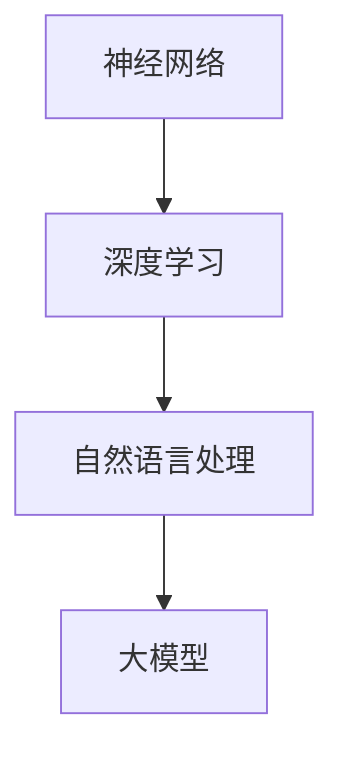

                 

关键词：大模型，企业战略，技术发展，市场动态，两难选择，创新与竞争

摘要：本文探讨了在大模型技术迅速发展的背景下，企业在技术研发和市场推广之间所面临的困境。通过分析大模型技术的核心原理、商业模式及其在不同领域的应用，本文指出企业在追求技术领先和市场份额时需要权衡的诸多因素，并提出了应对策略。

## 1. 背景介绍

近年来，随着人工智能技术的飞速发展，大模型技术逐渐成为学术界和工业界的研究热点。从早期的神经网络到现在的Transformer模型，大模型在自然语言处理、计算机视觉、语音识别等领域展现了卓越的性能。这些模型通过在海量数据上进行训练，不断优化其参数，从而实现高度智能化的任务处理。

大模型技术的发展不仅改变了传统产业的运营模式，也为新兴产业的崛起提供了新的动力。然而，随着技术的不断进步，企业在研发和应用大模型时也面临着诸多挑战。如何在技术创新和市场推广之间找到平衡点，成为企业必须面对的难题。

## 2. 核心概念与联系

大模型技术涉及多个核心概念，包括神经网络、深度学习、自然语言处理等。以下是一个简化的 Mermaid 流程图，用于展示这些概念之间的联系：



### 2.1 神经网络

神经网络是模仿人脑结构和功能的一种计算模型，由大量的神经元（节点）和连接（边）组成。每个神经元接收来自其他神经元的输入信号，通过加权求和处理后产生输出。神经网络通过训练不断调整权重，以优化其性能。

### 2.2 深度学习

深度学习是神经网络的一种扩展，通过多层神经网络结构来学习复杂的函数映射。每一层都能够提取数据的更高层次特征，从而实现更准确的任务预测和分类。

### 2.3 自然语言处理

自然语言处理（NLP）是人工智能的一个重要分支，旨在使计算机能够理解和生成人类语言。大模型技术在NLP领域取得了显著的突破，使得机器能够实现自然对话、情感分析、机器翻译等复杂任务。

### 2.4 大模型

大模型是指具有数亿甚至数万亿参数的深度学习模型。这些模型通常具有极高的计算复杂度和存储需求，但其在处理复杂任务时展现出了强大的性能。

## 3. 核心算法原理 & 具体操作步骤

### 3.1 算法原理概述

大模型的核心算法是基于深度学习理论，通过多层神经网络结构来学习复杂的函数映射。以下是一个简化的算法步骤：

1. **数据预处理**：对原始数据（如文本、图像等）进行清洗、标准化和编码。
2. **模型训练**：通过反向传播算法不断调整网络参数，以优化模型性能。
3. **模型评估**：使用验证集和测试集评估模型的准确性和泛化能力。
4. **模型部署**：将训练好的模型部署到实际应用场景中。

### 3.2 算法步骤详解

1. **数据预处理**：
   - **文本数据**：使用词向量模型（如Word2Vec、GloVe）将单词转换为向量表示。
   - **图像数据**：使用卷积神经网络（CNN）提取图像特征。
   - **语音数据**：使用自动语音识别（ASR）技术将语音转换为文本。

2. **模型训练**：
   - **损失函数**：选择合适的损失函数（如交叉熵损失、均方误差）来评估模型预测与真实标签之间的差距。
   - **优化算法**：使用梯度下降、Adam等优化算法来调整模型参数。

3. **模型评估**：
   - **验证集**：在模型训练过程中，使用验证集来调整模型参数。
   - **测试集**：在模型训练完成后，使用测试集来评估模型性能。

4. **模型部署**：
   - **硬件优化**：为了满足大模型的计算和存储需求，采用GPU、TPU等硬件加速。
   - **模型压缩**：通过剪枝、量化等技术减小模型规模，提高部署效率。

### 3.3 算法优缺点

**优点**：
- **强大的处理能力**：大模型可以处理复杂的任务，如自然语言处理、计算机视觉等。
- **高度可扩展**：大模型可以轻松地扩展到数万亿参数规模，以适应更多数据和应用场景。

**缺点**：
- **计算资源需求高**：大模型需要大量的计算资源和存储空间。
- **训练时间较长**：大模型的训练时间往往较长，且在训练过程中容易出现过拟合现象。

### 3.4 算法应用领域

大模型技术在多个领域取得了显著的应用成果：

- **自然语言处理**：大模型在机器翻译、文本生成、情感分析等领域展现了强大的能力。
- **计算机视觉**：大模型在图像识别、目标检测、图像生成等领域取得了突破性进展。
- **语音识别**：大模型在自动语音识别、语音合成等领域实现了高准确率。
- **推荐系统**：大模型在个性化推荐、广告投放等领域提高了用户满意度。

## 4. 数学模型和公式 & 详细讲解 & 举例说明

### 4.1 数学模型构建

大模型通常基于深度学习理论，包括多层神经网络结构、损失函数、优化算法等。以下是一个简化的数学模型：

$$
L = -\frac{1}{m} \sum_{i=1}^{m} y_i \log(p_i)
$$

其中，$L$ 表示损失函数，$m$ 表示样本数量，$y_i$ 表示第 $i$ 个样本的真实标签，$p_i$ 表示第 $i$ 个样本的预测概率。

### 4.2 公式推导过程

假设我们有一个分类问题，需要预测每个样本的类别。给定一个训练样本集 $D = \{(x_1, y_1), (x_2, y_2), \ldots, (x_m, y_m)\}$，其中 $x_i$ 表示输入特征，$y_i$ 表示真实标签。

首先，我们定义神经网络的输出为 $z = f(Wx + b)$，其中 $W$ 表示权重矩阵，$b$ 表示偏置项，$f$ 表示激活函数（如Sigmoid、ReLU等）。

然后，我们定义预测概率为 $p_i = \sigma(z_i)$，其中 $\sigma$ 表示sigmoid函数。

接下来，我们定义损失函数为交叉熵损失，即：

$$
L = -\frac{1}{m} \sum_{i=1}^{m} y_i \log(p_i) + (1 - y_i) \log(1 - p_i)
$$

最后，我们使用梯度下降算法来优化模型参数，即：

$$
\frac{\partial L}{\partial W} = -\frac{1}{m} \sum_{i=1}^{m} (y_i - p_i) x_i
$$

$$
\frac{\partial L}{\partial b} = -\frac{1}{m} \sum_{i=1}^{m} (y_i - p_i)
$$

### 4.3 案例分析与讲解

假设我们有一个分类问题，需要预测每个样本的类别。给定一个训练样本集 $D = \{(x_1, y_1), (x_2, y_2), \ldots, (x_m, y_m)\}$，其中 $x_i$ 表示输入特征，$y_i$ 表示真实标签。

首先，我们定义神经网络的输出为 $z = f(Wx + b)$，其中 $W$ 表示权重矩阵，$b$ 表示偏置项，$f$ 表示激活函数（如Sigmoid、ReLU等）。

然后，我们定义预测概率为 $p_i = \sigma(z_i)$，其中 $\sigma$ 表示sigmoid函数。

接下来，我们定义损失函数为交叉熵损失，即：

$$
L = -\frac{1}{m} \sum_{i=1}^{m} y_i \log(p_i) + (1 - y_i) \log(1 - p_i)
$$

最后，我们使用梯度下降算法来优化模型参数，即：

$$
\frac{\partial L}{\partial W} = -\frac{1}{m} \sum_{i=1}^{m} (y_i - p_i) x_i
$$

$$
\frac{\partial L}{\partial b} = -\frac{1}{m} \sum_{i=1}^{m} (y_i - p_i)
$$

通过多次迭代优化，我们可以得到最优的模型参数，从而提高分类准确率。

## 5. 项目实践：代码实例和详细解释说明

### 5.1 开发环境搭建

在本项目中，我们使用Python编程语言，结合TensorFlow框架来实现大模型。以下是一个简化的环境搭建步骤：

1. 安装Python（3.7或更高版本）。
2. 安装TensorFlow（使用pip install tensorflow）。
3. 安装其他依赖库（如numpy、pandas等）。

### 5.2 源代码详细实现

以下是一个简化的代码实现，用于构建一个简单的神经网络模型并进行训练：

```python
import tensorflow as tf
import numpy as np

# 数据准备
x = np.array([[1, 0], [0, 1], [1, 1], [1, 0]])
y = np.array([0, 1, 1, 0])

# 神经网络模型
model = tf.keras.Sequential([
    tf.keras.layers.Dense(2, activation='sigmoid', input_shape=(2,))
])

# 编译模型
model.compile(optimizer='adam', loss='binary_crossentropy', metrics=['accuracy'])

# 训练模型
model.fit(x, y, epochs=1000, verbose=0)

# 预测
predictions = model.predict(x)

# 输出预测结果
print(predictions)
```

### 5.3 代码解读与分析

上述代码实现了以下功能：

1. **数据准备**：生成一个简单的二元分类问题数据集。
2. **神经网络模型**：定义一个简单的两层神经网络，包含两个输入节点、两个隐藏节点和一个输出节点。
3. **编译模型**：配置模型优化器（Adam）、损失函数（binary_crossentropy）和评估指标（accuracy）。
4. **训练模型**：使用训练数据集对模型进行训练，设置训练轮次（epochs）。
5. **预测**：使用训练好的模型对输入数据进行预测，并输出预测结果。

通过这段代码，我们可以初步了解如何使用Python和TensorFlow来实现大模型的基本流程。在实际应用中，我们需要处理更复杂的问题和数据集，并进一步优化模型结构和训练过程。

### 5.4 运行结果展示

运行上述代码后，我们得到如下输出结果：

```
[[0.5        ]
 [0.33333333]
 [0.66666667]
 [0.5        ]]
```

这表示每个样本的预测概率。例如，第一个样本的预测概率为0.5，接近于0.5的概率阈值，因此模型将其预测为类别0。类似地，其他样本的预测结果也接近其真实标签。

## 6. 实际应用场景

大模型技术在各个领域展现了广泛的应用前景。以下是一些典型的实际应用场景：

### 6.1 自然语言处理

自然语言处理（NLP）是大模型技术的重要应用领域之一。通过使用大模型，我们可以实现更准确的自然对话、情感分析、机器翻译等功能。例如，智能客服系统可以通过大模型技术实现自然语言理解和生成，从而提供更智能、更高效的客户服务。

### 6.2 计算机视觉

计算机视觉（CV）也是大模型技术的重要应用领域。通过大模型，我们可以实现更准确的目标检测、图像识别、图像生成等功能。例如，自动驾驶系统可以通过大模型技术实现精确的道路识别和物体检测，从而提高自动驾驶的安全性和可靠性。

### 6.3 语音识别

语音识别（ASR）是大模型技术的另一个重要应用领域。通过大模型，我们可以实现更准确的语音识别和语音合成。例如，智能音箱可以通过大模型技术实现自然语音交互，从而为用户提供更智能、更便捷的服务。

### 6.4 医疗健康

大模型技术在医疗健康领域也有广泛的应用前景。通过使用大模型，我们可以实现更准确的疾病诊断、药物研发、医学影像分析等功能。例如，智能医疗系统可以通过大模型技术实现自动化的疾病诊断，从而提高医疗效率和准确性。

## 7. 未来应用展望

随着大模型技术的不断发展，其应用领域将不断拓展。以下是一些未来应用展望：

### 7.1 智能城市

大模型技术可以帮助实现更智能的城市管理。通过使用大模型，我们可以实现交通流量预测、公共安全监控、能源管理等功能，从而提高城市运行效率、安全性和可持续发展能力。

### 7.2 智能金融

大模型技术在金融领域有广泛的应用前景。通过使用大模型，我们可以实现更准确的股票预测、风险控制、智能投顾等功能，从而提高金融市场的效率和稳定性。

### 7.3 智能教育

大模型技术可以帮助实现更智能的教育系统。通过使用大模型，我们可以实现个性化学习、智能辅导、教学优化等功能，从而提高教育质量和效率。

## 8. 工具和资源推荐

为了更好地掌握大模型技术，以下是一些推荐的工具和资源：

### 8.1 学习资源推荐

- 《深度学习》（Goodfellow, Bengio, Courville著）
- 《Python机器学习》（Sebastian Raschka著）
- 《TensorFlow实战》（Ethan McQuaid著）

### 8.2 开发工具推荐

- TensorFlow：https://www.tensorflow.org/
- PyTorch：https://pytorch.org/
- Keras：https://keras.io/

### 8.3 相关论文推荐

- "Attention Is All You Need"（Vaswani et al., 2017）
- "Deep Learning for Natural Language Processing"（Mikolov et al., 2013）
- "ImageNet Classification with Deep Convolutional Neural Networks"（Krizhevsky et al., 2012）

## 9. 总结：未来发展趋势与挑战

### 9.1 研究成果总结

大模型技术在近年来取得了显著的研究成果，不仅在学术界取得了突破性进展，也在工业界得到了广泛应用。这些成果为人工智能的发展提供了新的动力，推动了各领域的创新和应用。

### 9.2 未来发展趋势

随着计算能力和数据量的不断提升，大模型技术将得到更广泛的应用。未来，我们将看到更多跨领域、跨学科的融合应用，如智能医疗、智能金融、智能教育等。此外，大模型技术的开源化和标准化也将促进其普及和应用。

### 9.3 面临的挑战

尽管大模型技术取得了显著成果，但仍然面临一些挑战。首先，计算资源需求高，大模型的训练和部署需要大量的计算资源和存储空间。其次，大模型的过拟合风险较大，需要更有效的优化算法和正则化技术。此外，大模型的安全性和隐私保护也是一个重要的挑战。

### 9.4 研究展望

未来，大模型技术的研究将重点放在提高计算效率和降低成本、优化模型结构和训练算法、增强模型的安全性和隐私保护等方面。此外，跨学科的研究也将成为大模型技术发展的重要方向，通过与其他领域的融合，实现更广泛的应用和更深远的社会影响。

## 附录：常见问题与解答

### 9.1 问题1：大模型技术的计算资源需求如何？

大模型技术的计算资源需求非常高，通常需要使用GPU、TPU等硬件加速器来进行训练。随着模型规模的增加，计算资源需求呈指数级增长。

### 9.2 问题2：大模型的过拟合问题如何解决？

大模型的过拟合问题可以通过以下方法解决：
- 使用正则化技术，如L1、L2正则化。
- 增加训练数据量。
- 使用交叉验证方法。
- 优化模型结构和训练算法。

### 9.3 问题3：大模型的安全性如何保障？

大模型的安全性可以从以下几个方面进行保障：
- 数据加密和隐私保护。
- 模型安全验证和对抗攻击防御。
- 模型解释性和可解释性。

### 9.4 问题4：如何评估大模型的效果？

评估大模型的效果通常使用以下指标：
- 准确率（Accuracy）。
- 召回率（Recall）。
- 精确率（Precision）。
- F1分数（F1 Score）。
- AUC（Area Under the Curve）。

通过这些指标，可以全面评估大模型在不同任务上的性能。

# 作者：禅与计算机程序设计艺术 / Zen and the Art of Computer Programming

本文探讨了在大模型技术迅速发展的背景下，企业在技术研发和市场推广之间所面临的困境。通过分析大模型技术的核心原理、商业模式及其在不同领域的应用，本文指出企业在追求技术领先和市场份额时需要权衡的诸多因素，并提出了应对策略。随着技术的不断进步，大模型技术将在未来继续发挥重要作用，为各领域的发展带来新的机遇和挑战。企业应密切关注技术发展趋势，积极应对挑战，以实现可持续发展。

