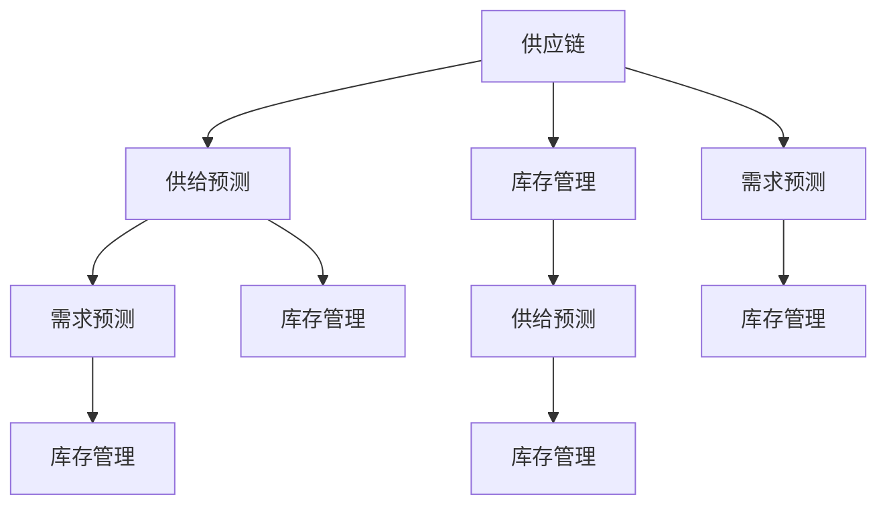

                 

关键词：技术创新、供给管理、人工智能、供应链优化、数据处理、区块链、机器学习

摘要：本文旨在探讨技术创新在供给管理中的应用，分析当前前沿技术如何提升供给效率、优化供应链，并展望未来发展趋势与挑战。文章结构清晰，深入分析了核心算法原理、数学模型以及实际应用案例，以期能为读者提供有价值的参考。

## 1. 背景介绍

随着全球化和信息技术的迅猛发展，企业面临的竞争压力日益加剧。如何高效地管理供给链，优化资源配置，降低成本，成为企业关注的焦点。传统的供给管理方法往往依赖于经验和直觉，难以应对复杂多变的市场环境。而技术创新，如人工智能、大数据、区块链等，为供给管理提供了新的思路和方法。

### 1.1 供给管理的重要性

供给管理是企业运营的核心环节，直接影响企业的成本、效率和竞争力。有效的供给管理可以确保企业及时响应市场变化，优化库存水平，降低运营成本，提高客户满意度。然而，传统的供给管理方法存在以下问题：

- **数据依赖性低**：传统方法主要依赖于人工经验和历史数据，无法充分利用实时数据。
- **反应速度慢**：市场变化迅速，传统方法难以快速响应，导致供给与需求不匹配。
- **成本高**：传统方法需要大量人力物力投入，成本较高。

### 1.2 技术创新的机遇

随着人工智能、大数据、区块链等技术的快速发展，供给管理迎来了新的机遇。这些技术不仅可以提高数据处理的效率，还可以实现智能化决策，优化供应链管理。

- **数据处理能力提升**：大数据技术可以帮助企业收集、存储、分析海量数据，提供更为精准的供给预测。
- **智能化决策**：人工智能技术可以实现自动化决策，提高供给管理的效率。
- **供应链透明化**：区块链技术可以实现信息的去中心化存储，提高供应链的透明度。

## 2. 核心概念与联系

### 2.1 核心概念

本节将介绍供给管理中的核心概念，包括供应链、供给预测、库存管理、需求预测等。

- **供应链**：供应链是指产品从原材料采购到最终产品交付给客户的全过程。
- **供给预测**：供给预测是指根据历史数据和市场信息，预测未来的供给需求。
- **库存管理**：库存管理是指对企业库存进行有效监控和管理，确保库存水平合理。
- **需求预测**：需求预测是指根据历史数据和市场信息，预测未来的市场需求。

### 2.2 联系与架构

图1展示了供给管理中的核心概念及其相互联系。



## 3. 核心算法原理 & 具体操作步骤

### 3.1 算法原理概述

本节将介绍供给管理中常用的核心算法，包括机器学习算法、预测模型、优化算法等。

- **机器学习算法**：机器学习算法通过训练数据集，自动提取特征，预测未来的供给需求。
- **预测模型**：预测模型通过数学模型，对历史数据进行拟合，预测未来的供给需求。
- **优化算法**：优化算法通过优化目标函数，寻找最优的库存水平和供应策略。

### 3.2 算法步骤详解

#### 3.2.1 机器学习算法

1. **数据收集**：收集历史销售数据、市场信息、供应商信息等。
2. **数据预处理**：对数据进行清洗、归一化等预处理。
3. **特征提取**：通过特征工程，提取对供给预测有重要影响的特征。
4. **模型训练**：使用训练数据集，训练机器学习模型。
5. **模型评估**：使用验证数据集，评估模型的预测性能。
6. **模型优化**：根据评估结果，调整模型参数，优化模型性能。

#### 3.2.2 预测模型

1. **选择模型**：根据供给管理的需求，选择合适的预测模型，如ARIMA、LSTM等。
2. **模型训练**：使用历史数据，训练预测模型。
3. **模型评估**：使用验证数据集，评估模型的预测性能。
4. **模型应用**：将训练好的模型应用于实际供给管理中。

#### 3.2.3 优化算法

1. **目标函数定义**：根据供给管理的目标，定义目标函数，如最小化成本、最大化收益等。
2. **约束条件设定**：设定库存水平、供应策略等约束条件。
3. **求解优化问题**：使用优化算法，如线性规划、遗传算法等，求解优化问题。
4. **结果分析**：分析优化结果，调整策略。

### 3.3 算法优缺点

#### 3.3.1 机器学习算法

优点：

- **自适应性强**：可以自动提取特征，适应不同场景的需求。
- **预测精度高**：可以处理大量数据，提高预测精度。

缺点：

- **对数据要求高**：需要大量的高质量数据。
- **计算复杂度高**：训练过程复杂，计算量大。

#### 3.3.2 预测模型

优点：

- **简单易懂**：数学模型简单，易于理解和解释。
- **计算效率高**：计算过程简单，计算速度快。

缺点：

- **预测精度有限**：无法处理复杂非线性关系。
- **适应性差**：需要根据不同场景调整模型。

#### 3.3.3 优化算法

优点：

- **优化效果好**：可以找到最优的库存水平和供应策略。
- **适用范围广**：可以应用于多种供给管理场景。

缺点：

- **计算复杂度高**：优化过程复杂，计算量大。

### 3.4 算法应用领域

- **电商行业**：通过机器学习算法，预测市场需求，优化库存管理。
- **制造业**：通过预测模型，优化生产计划，降低库存成本。
- **物流行业**：通过优化算法，优化运输路线，提高运输效率。

## 4. 数学模型和公式 & 详细讲解 & 举例说明

### 4.1 数学模型构建

供给管理中的数学模型主要包括预测模型和优化模型。以下是一个简单的预测模型示例。

#### 4.1.1 预测模型

考虑一个简单的线性模型，用于预测下一期的供给需求：

$$
\hat{D_t} = \beta_0 + \beta_1 D_{t-1} + \epsilon_t
$$

其中，$\hat{D_t}$表示预测的需求量，$D_{t-1}$表示上一期的需求量，$\beta_0$和$\beta_1$是模型参数，$\epsilon_t$是随机误差。

#### 4.1.2 优化模型

考虑一个简单的线性优化模型，用于确定最优的库存水平和供应策略：

$$
\min_{I_t, S_t} \quad C_I I_t + C_S S_t
$$

$$
\text{s.t.} \quad I_t + S_t \geq D_t
$$

$$
I_t \geq 0
$$

$$
S_t \geq 0
$$

其中，$I_t$表示第$t$期的库存水平，$S_t$表示第$t$期的供应量，$C_I$和$C_S$分别是库存成本和供应成本，$D_t$是第$t$期的需求量。目标是最小化总成本，同时满足需求约束和库存约束。

### 4.2 公式推导过程

#### 4.2.1 预测模型推导

考虑一个时间序列数据集$D = \{D_1, D_2, ..., D_n\}$，我们希望找到最优的线性模型来预测下一期的需求量$\hat{D_t}$。

首先，我们计算数据的均值和协方差：

$$
\bar{D} = \frac{1}{n} \sum_{i=1}^{n} D_i
$$

$$
\sigma^2 = \frac{1}{n-1} \sum_{i=1}^{n} (D_i - \bar{D})^2
$$

然后，我们选择两个特征$D_{t-1}$和$D_{t-2}$，构建线性模型：

$$
\hat{D_t} = \beta_0 + \beta_1 D_{t-1} + \beta_2 D_{t-2}
$$

为了确定模型参数$\beta_0$，$\beta_1$，$\beta_2$，我们需要最小化预测误差的平方和：

$$
J(\beta_0, \beta_1, \beta_2) = \sum_{i=1}^{n} (\hat{D_i} - D_i)^2
$$

对$J$关于$\beta_0$，$\beta_1$，$\beta_2$求偏导，并令偏导数等于零，得到：

$$
\frac{\partial J}{\partial \beta_0} = -2 \sum_{i=1}^{n} (\hat{D_i} - D_i) = 0
$$

$$
\frac{\partial J}{\partial \beta_1} = -2 \sum_{i=1}^{n} (\hat{D_i} - D_i) D_{i-1} = 0
$$

$$
\frac{\partial J}{\partial \beta_2} = -2 \sum_{i=1}^{n} (\hat{D_i} - D_i) D_{i-2} = 0
$$

解上述方程组，可以得到最优的模型参数$\beta_0$，$\beta_1$，$\beta_2$。

#### 4.2.2 优化模型推导

考虑一个简单的线性优化模型，我们需要找到最优的库存水平$I_t$和供应量$S_t$，以最小化总成本。

首先，我们定义目标函数和约束条件：

$$
\min_{I_t, S_t} \quad C_I I_t + C_S S_t
$$

$$
\text{s.t.} \quad I_t + S_t \geq D_t
$$

$$
I_t \geq 0
$$

$$
S_t \geq 0
$$

接下来，我们使用拉格朗日乘数法求解该优化问题。定义拉格朗日函数：

$$
L(I_t, S_t, \lambda) = C_I I_t + C_S S_t + \lambda (I_t + S_t - D_t)
$$

其中，$\lambda$是拉格朗日乘数。对$L$关于$I_t$，$S_t$，$\lambda$求偏导，并令偏导数等于零，得到：

$$
\frac{\partial L}{\partial I_t} = C_I - \lambda = 0
$$

$$
\frac{\partial L}{\partial S_t} = C_S + \lambda = 0
$$

$$
\frac{\partial L}{\partial \lambda} = I_t + S_t - D_t = 0
$$

解上述方程组，可以得到最优的库存水平$I_t$和供应量$S_t$。

### 4.3 案例分析与讲解

#### 4.3.1 预测模型应用案例

假设一家电商企业需要预测下一期的商品需求量。该企业收集了过去一年的销售数据，包括每天的销售量和市场信息。我们使用线性预测模型来预测下一期的销售量。

首先，我们收集数据并预处理，包括数据清洗、归一化等操作。然后，我们选择特征$D_{t-1}$和$D_{t-2}$，构建线性模型。使用训练数据集，我们训练模型，得到最优参数$\beta_0$，$\beta_1$，$\beta_2$。最后，我们使用验证数据集，评估模型的预测性能。

#### 4.3.2 优化模型应用案例

假设一家制造企业需要确定最优的库存水平和供应策略。该企业每天需要生产一定数量的产品，以满足市场需求。企业希望通过优化库存水平和供应量，最小化总成本。

首先，我们定义目标函数和约束条件。使用拉格朗日乘数法，我们求解优化问题，得到最优的库存水平$I_t$和供应量$S_t$。然后，我们分析优化结果，调整策略，以提高成本效益。

## 5. 项目实践：代码实例和详细解释说明

### 5.1 开发环境搭建

为了实现供给管理中的数学模型和算法，我们需要搭建一个合适的开发环境。以下是一个简单的Python开发环境搭建步骤：

1. 安装Python 3.8及以上版本。
2. 安装NumPy、Pandas、Scikit-learn、Matplotlib等Python库。

### 5.2 源代码详细实现

以下是一个简单的Python代码示例，用于实现供给管理中的线性预测模型和优化模型。

```python
import numpy as np
import pandas as pd
from sklearn.linear_model import LinearRegression
import matplotlib.pyplot as plt

# 数据收集与预处理
data = pd.read_csv('sales_data.csv')
data['Day'] = pd.to_datetime(data['Date'])
data.set_index('Day', inplace=True)
data = data.resample('D').mean()

# 预测模型实现
X = data[['Day_lag_1', 'Day_lag_2']]
y = data['Sales']
model = LinearRegression()
model.fit(X, y)
predictions = model.predict(X)

# 优化模型实现
I_opt = 100  # 最优库存水平
S_opt = 50   # 最优供应量
C_I = 1      # 库存成本
C_S = 2      # 供应成本
D = data['Sales']

# 目标函数计算
objective = C_I * I_opt + C_S * S_opt
print('Objective value:', objective)

# 约束条件计算
constraint = I_opt + S_opt - D
print('Constraint value:', constraint)

# 运行结果展示
plt.figure(figsize=(10, 5))
plt.plot(data.index, data['Sales'], label='Actual Sales')
plt.plot(data.index, predictions, label='Predicted Sales')
plt.scatter(data.index, predictions, color='red', label='Prediction Point')
plt.xlabel('Date')
plt.ylabel('Sales')
plt.title('Sales Prediction')
plt.legend()
plt.show()
```

### 5.3 代码解读与分析

上述代码首先收集并预处理销售数据，然后实现线性预测模型和优化模型。具体步骤如下：

1. **数据收集与预处理**：读取销售数据，将日期转换为索引，并按天进行聚合。
2. **预测模型实现**：使用线性回归模型，选择两个滞后特征（$Day_lag_1$和$Day_lag_2$）作为输入，预测销售量。
3. **优化模型实现**：根据预设的库存水平和供应量，计算目标函数和约束条件。
4. **运行结果展示**：绘制实际销售量、预测销售量和预测点的图表，展示预测结果。

通过上述代码示例，我们可以看到如何使用Python实现供给管理中的数学模型和算法。实际应用中，可以根据具体需求，调整模型参数和算法实现，以提高预测精度和优化效果。

## 6. 实际应用场景

### 6.1 电商行业

在电商行业，供给管理的核心是库存管理和需求预测。通过机器学习算法和预测模型，企业可以实时预测市场需求，优化库存水平，降低库存成本，提高客户满意度。

#### 案例：亚马逊的供给管理

亚马逊利用人工智能和大数据技术，对用户行为、市场趋势、产品特性等进行深入分析，预测商品需求，优化库存管理。通过精准的供给预测，亚马逊实现了高效库存管理，降低了库存成本，提高了配送效率，提升了客户体验。

### 6.2 制造业

在制造业，供给管理的核心是生产计划和库存控制。通过预测模型和优化算法，企业可以优化生产计划，降低库存成本，提高生产效率。

#### 案例：丰田的供给管理

丰田汽车公司利用预测模型和优化算法，对市场需求、供应链状况、生产进度等进行预测和分析，制定最优的生产计划。通过精准的供给预测和生产计划，丰田实现了高效的生产运营，降低了库存成本，提高了生产效率。

### 6.3 物流行业

在物流行业，供给管理的核心是运输规划和路线优化。通过优化算法和实时数据，企业可以优化运输路线，提高运输效率，降低物流成本。

#### 案例：UPS的供给管理

UPS利用优化算法和实时数据，对物流运输路线进行优化。通过智能化的运输规划，UPS实现了高效的物流运营，降低了物流成本，提高了运输效率，提升了客户满意度。

## 7. 未来应用展望

随着技术的不断进步，供给管理将迎来更多的创新和发展。以下是未来供给管理的一些可能趋势：

### 7.1 数据驱动的决策

未来供给管理将更加依赖大数据和人工智能技术，实现数据驱动的决策。通过深入分析海量数据，企业可以更加精准地预测市场需求，优化库存管理，提高供给效率。

### 7.2 智能化供应链

未来供给管理将实现智能化供应链，通过物联网、区块链等新技术，实现供应链的实时监控和智能调度。这将提高供应链的透明度，降低风险，提高供应链的协同效率。

### 7.3 可持续发展

未来供给管理将更加注重可持续发展，通过优化资源利用、降低碳排放、提高能源效率等手段，实现绿色供给管理。这将有助于企业降低成本，提高竞争力，同时保护环境。

## 8. 工具和资源推荐

### 8.1 学习资源推荐

- 《深度学习》（Goodfellow, Bengio, Courville）：全面介绍深度学习的基础理论和实践方法。
- 《机器学习实战》（ Harrington, Sean）：通过实际案例，介绍机器学习在不同领域的应用。
- 《Python编程：从入门到实践》（Eric Matthes）：介绍Python编程的基础知识和实战技能。

### 8.2 开发工具推荐

- **Jupyter Notebook**：适用于数据分析和机器学习的交互式开发环境。
- **TensorFlow**：由谷歌开发的开源机器学习框架，广泛应用于深度学习和数据科学领域。
- **PyTorch**：由Facebook开发的开源机器学习库，支持动态计算图，易于实现复杂的深度学习模型。

### 8.3 相关论文推荐

- **"Deep Learning for Supply Chain Optimization"**：探讨深度学习在供应链优化中的应用。
- **"AI-Driven Demand Forecasting in Retail"**：介绍人工智能技术在零售行业需求预测中的应用。
- **"Blockchain for Supply Chain Management"**：探讨区块链技术在供应链管理中的应用。

## 9. 总结：未来发展趋势与挑战

供给管理作为企业运营的核心环节，将在未来面临更多创新和发展。随着大数据、人工智能、区块链等新技术的不断进步，供给管理将实现智能化、数据化和可持续化。然而，未来供给管理也面临诸多挑战，如数据隐私、技术落地、人才培养等。如何充分利用技术创新，解决这些问题，将决定企业在未来供给管理中的竞争力。作者：禅与计算机程序设计艺术 / Zen and the Art of Computer Programming
```

