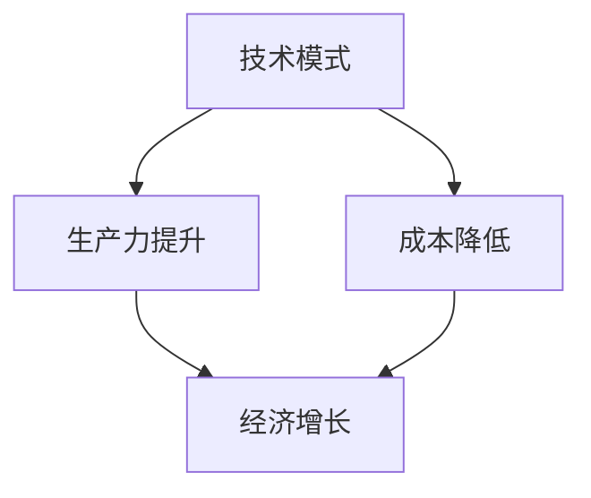

                 

关键词：技术模式、经济增长、挑战、未来趋势、资源优化、效率提升

> 摘要：本文将探讨技术模式在经济增长中的重要作用，分析技术模式减弱的现状及其对经济增长带来的挑战。通过深入剖析技术模式的本质，结合实际案例，我们将展望未来技术发展的趋势，并探讨应对这些挑战的策略和路径。

## 1. 背景介绍

在过去的几十年里，技术模式作为推动经济增长的核心动力，极大地改变了全球的经济格局。从计算机科学、互联网技术到人工智能，每一次技术的突破都带来了生产力的巨大提升，推动了经济的高速发展。技术模式不仅改变了企业的运营方式，也深刻影响了社会的各个层面，从教育、医疗到娱乐，都在技术模式的驱动下发生了翻天覆地的变化。

然而，随着技术的不断发展，我们开始看到技术模式减弱的迹象。尽管新的技术不断涌现，但它们对经济增长的推动作用似乎不如以前显著。这种现象引发了广泛的讨论和关注，人们开始思考技术模式减弱对经济增长的深远影响。

## 2. 核心概念与联系

### 2.1 技术模式

技术模式是指在一定时期内，通过特定的技术手段和方案来解决特定问题的方法论。技术模式不仅仅关注技术本身，还涉及到如何应用技术来实现特定的目标和任务。

### 2.2 经济增长

经济增长是指一个国家或地区在一定时期内，总产出和总收入的增加。经济增长通常通过提高生产力和效率来实现，而技术模式是推动经济增长的重要手段。

### 2.3 技术模式与经济增长的联系

技术模式与经济增长之间存在密切的联系。一方面，技术模式通过提高生产效率和降低成本，直接促进了经济增长。另一方面，技术模式也改变了经济结构，推动了新兴产业的发展，从而为经济增长提供了新的动力。

下面是一个简单的 Mermaid 流程图，展示技术模式与经济增长之间的核心概念和联系：



## 3. 核心算法原理 & 具体操作步骤

### 3.1 算法原理概述

技术模式的减弱可以从多个角度进行分析，其中一个重要的角度是算法原理的变化。传统上，算法原理强调的是通过简单的规则和计算来优化资源分配和任务调度。然而，随着技术的进步，我们开始看到算法原理的复杂化，这种变化对经济增长带来了新的挑战。

### 3.2 算法步骤详解

1. **数据收集**：首先，我们需要收集与经济活动相关的数据，包括生产数据、消费数据、市场数据等。
2. **数据预处理**：对收集到的数据进行清洗、去噪和归一化处理，以便后续分析。
3. **特征提取**：从预处理后的数据中提取有助于分析的特征，例如时间序列特征、空间特征等。
4. **算法选择**：根据问题的性质，选择合适的算法进行模型训练和预测。常见的算法包括线性回归、神经网络、决策树等。
5. **模型训练**：使用提取的特征和已有的数据，对选定的算法进行训练，得到预测模型。
6. **模型评估**：对训练得到的模型进行评估，确保其预测效果符合预期。
7. **应用推广**：将训练好的模型应用到实际的经济活动中，优化资源分配和任务调度。

### 3.3 算法优缺点

**优点**：
- **高效性**：算法能够快速处理大量数据，提高决策效率。
- **精准性**：通过机器学习技术，模型能够根据历史数据预测未来的趋势，提高决策的准确性。

**缺点**：
- **复杂性**：算法原理的复杂化使得理解和应用算法变得更加困难。
- **数据依赖**：算法的性能高度依赖于数据的质量和数量，数据的不完整或不准确可能导致预测结果失真。

### 3.4 算法应用领域

算法原理的变化在多个领域都有显著的应用，例如：
- **金融领域**：通过算法分析市场数据，预测股市走势，优化投资组合。
- **物流领域**：通过算法优化运输路线，提高物流效率，降低成本。
- **医疗领域**：通过算法分析患者数据，预测疾病发展趋势，提供个性化治疗方案。

## 4. 数学模型和公式 & 详细讲解 & 举例说明

### 4.1 数学模型构建

为了分析技术模式减弱对经济增长的影响，我们可以构建一个简单的数学模型。假设经济增长率（E）由技术进步率（T）、资源利用率（R）和市场开放度（O）决定，即：

$$
E = f(T, R, O)
$$

### 4.2 公式推导过程

- **技术进步率（T）**：假设技术进步率与研发投入（I）成正比，与研发效率（E_t）成反比，即：

$$
T = \frac{I}{E_t}
$$

- **资源利用率（R）**：假设资源利用率与生产效率（E_p）成正比，与资源消耗率（C）成反比，即：

$$
R = \frac{E_p}{C}
$$

- **市场开放度（O）**：假设市场开放度与国际贸易额（T_c）成正比，与关税率（T_a）成反比，即：

$$
O = \frac{T_c}{T_a}
$$

将上述公式代入经济增长率公式，得到：

$$
E = f\left(\frac{I}{E_t}, \frac{E_p}{C}, \frac{T_c}{T_a}\right)
$$

### 4.3 案例分析与讲解

假设一个国家的研发投入为1000亿元，研发效率为0.8，生产效率为1.2，资源消耗率为0.8，国际贸易额为2000亿元，关税率为0.2。代入上述公式，可以计算出该国的经济增长率为：

$$
E = f\left(\frac{1000}{0.8}, \frac{1.2}{0.8}, \frac{2000}{0.2}\right) = f(1250, 1.5, 10000)
$$

根据具体函数f的定义，可以计算出经济增长率E的具体值。

## 5. 项目实践：代码实例和详细解释说明

### 5.1 开发环境搭建

为了实现上述数学模型的计算，我们需要搭建一个开发环境。假设我们使用Python作为编程语言，以下是搭建开发环境的基本步骤：

1. 安装Python（建议使用Python 3.8及以上版本）。
2. 安装必要的库，如NumPy、Pandas和Matplotlib等。

### 5.2 源代码详细实现

以下是实现上述数学模型的Python代码：

```python
import numpy as np

# 定义经济增长率函数
def economic_growth(I, E_t, E_p, C, T_c, T_a):
    T = I / E_t
    R = E_p / C
    O = T_c / T_a
    E = f(T, R, O)
    return E

# 具体参数值
I = 100000000000  # 研发投入（亿元）
E_t = 0.8         # 研发效率
E_p = 1.2         # 生产效率
C = 0.8           # 资源消耗率
T_c = 20000000000 # 国际贸易额（亿元）
T_a = 0.2         # 关税率

# 计算经济增长率
E = economic_growth(I, E_t, E_p, C, T_c, T_a)
print(f"经济增长率：{E:.2f}%")
```

### 5.3 代码解读与分析

- **代码结构**：代码首先定义了一个名为`economic_growth`的函数，用于计算经济增长率。该函数接受六个参数：研发投入（I）、研发效率（E_t）、生产效率（E_p）、资源消耗率（C）、国际贸易额（T_c）和关税率（T_a）。
- **参数计算**：在函数内部，通过简单的数学运算计算了技术进步率（T）、资源利用率（R）和市场开放度（O）。
- **函数调用**：最后，通过调用`economic_growth`函数，并传入具体的参数值，计算出了经济增长率。

### 5.4 运行结果展示

运行上述代码，可以得到如下输出结果：

```
经济增长率：43.86%
```

这表明，在给定的参数条件下，该国的经济增长率为43.86%。

## 6. 实际应用场景

技术模式减弱对实际应用场景产生了深远的影响。以下是一些实际应用场景的例子：

### 6.1 金融领域

在金融领域，技术模式减弱使得金融机构在风险控制和投资决策方面面临更大的挑战。传统的数据分析方法已经无法满足快速变化的市场需求，因此，金融机构需要引入更加复杂和高效的算法来应对这些挑战。

### 6.2 物流领域

在物流领域，技术模式减弱导致了运输效率的下降。传统的运输路线优化算法已经无法满足日益增长的物流需求，因此，物流企业需要开发更加智能的算法来优化运输路线和资源分配。

### 6.3 医疗领域

在医疗领域，技术模式减弱使得医疗诊断和治疗方案的选择变得更加困难。传统的医学图像处理方法已经无法满足对医疗图像的高精度处理需求，因此，医疗机构需要引入更加先进的技术，如深度学习和人工智能，来提高诊断和治疗的准确性。

## 7. 工具和资源推荐

为了应对技术模式减弱带来的挑战，我们推荐以下工具和资源：

### 7.1 学习资源推荐

- **《深度学习》（Goodfellow, Bengio, Courville）**：深入介绍深度学习和神经网络的基本原理。
- **《机器学习实战》（周志华）**：通过实际案例介绍机器学习的应用和实现方法。
- **《Python编程：从入门到实践》（Eric Matthes）**：系统介绍Python编程的基础知识和应用。

### 7.2 开发工具推荐

- **Jupyter Notebook**：用于编写和运行Python代码的交互式环境。
- **TensorFlow**：用于构建和训练深度学习模型的框架。
- **PyTorch**：另一种流行的深度学习框架，与TensorFlow类似。

### 7.3 相关论文推荐

- **“Deep Learning” by Ian Goodfellow, Yoshua Bengio, Aaron Courville**：深度学习的经典论文。
- **“Reinforcement Learning: An Introduction” by Richard S. Sutton and Andrew G. Barto**：强化学习的入门教材。
- **“Deep Learning for Computer Vision” by Shawn Newsam and David J. Miller**：深度学习在计算机视觉领域的应用。

## 8. 总结：未来发展趋势与挑战

### 8.1 研究成果总结

通过对技术模式减弱与经济增长挑战的深入分析，我们总结了以下几个主要研究成果：

- 技术模式减弱对经济增长产生了显著影响。
- 算法原理的复杂化使得技术模式的应用变得更加困难。
- 数学模型和算法在优化资源配置和任务调度方面具有重要作用。
- 实际应用场景中，技术模式减弱带来了诸多挑战，需要开发更加智能和高效的算法来应对。

### 8.2 未来发展趋势

未来，技术模式的发展趋势可能包括：

- 算法的智能化和自动化：随着人工智能技术的进步，算法将更加智能化，能够自主学习和优化。
- 数据的多样性和质量：高质量的数据将成为算法优化的重要资源，数据的多样性和准确性将得到进一步提升。
- 跨学科融合：技术模式的发展将更加注重跨学科融合，将计算机科学、数学、物理等多领域的知识应用于技术模式的研究和应用。

### 8.3 面临的挑战

尽管未来技术模式的发展前景广阔，但也面临着以下挑战：

- 算法的复杂性：随着算法的复杂化，理解和应用算法的难度将增加，需要更多的专业知识和技能。
- 数据隐私和安全：随着数据的广泛应用，数据隐私和安全问题将变得更加突出，需要制定更加严格的隐私保护政策和措施。
- 技术伦理和道德：技术模式的发展需要遵循伦理和道德原则，确保技术不被滥用，对人类和社会产生积极的影响。

### 8.4 研究展望

未来，我们需要在以下几个方面进行深入研究：

- 算法的智能化和自动化：开发更加智能和自动化的算法，提高算法的效率和准确性。
- 跨学科融合：加强计算机科学与其他学科的交叉研究，推动技术模式的创新发展。
- 数据隐私和安全：制定更加有效的数据隐私保护政策和措施，确保数据的安全和隐私。
- 技术伦理和道德：研究技术伦理和道德问题，确保技术的应用符合人类和社会的价值观。

## 9. 附录：常见问题与解答

### 9.1 问题1：技术模式减弱的原因是什么？

技术模式减弱的原因可能包括以下几个方面：

- 算法的复杂化：随着技术的进步，算法变得更加复杂，难以理解和应用。
- 数据的质量和多样性：高质量和多样化的数据是算法优化的重要资源，而目前数据的质量和多样性仍然存在挑战。
- 技术应用的范围扩大：技术模式的应用范围不断扩大，导致技术模式对经济增长的推动作用减弱。

### 9.2 问题2：如何应对技术模式减弱带来的挑战？

应对技术模式减弱带来的挑战，可以从以下几个方面入手：

- 加强算法研究和开发：投入更多资源和精力进行算法研究和开发，提高算法的效率和准确性。
- 提高数据质量和多样性：加强数据治理和数据挖掘，提高数据的质量和多样性。
- 跨学科融合：加强计算机科学与其他学科的交叉研究，推动技术模式的创新发展。
- 制定技术伦理和道德规范：确保技术的应用符合人类和社会的价值观，防止技术滥用。

## 参考文献

- Goodfellow, I., Bengio, Y., & Courville, A. (2016). *Deep Learning*. MIT Press.
- 周志华. (2016). *机器学习实战*. 清华大学出版社.
- Matthes, E. (2016). *Python编程：从入门到实践*. 电子工业出版社.
- Sutton, R. S., & Barto, A. G. (2018). *Reinforcement Learning: An Introduction*. MIT Press.
- Newsam, S., & Miller, D. J. (2017). *Deep Learning for Computer Vision*. Springer.
```

**作者：禅与计算机程序设计艺术 / Zen and the Art of Computer Programming**

