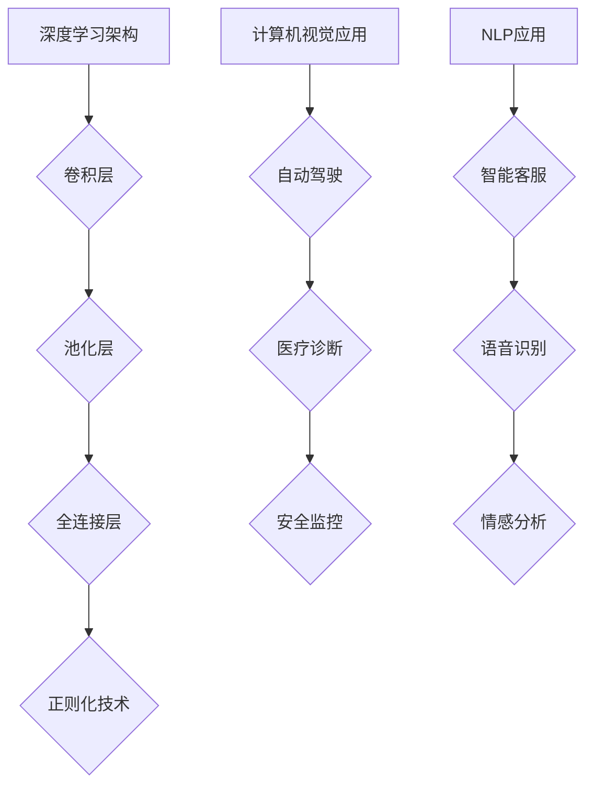

                 

在当今这个技术迅猛发展的时代，人工智能（AI）已经成为驱动创新和商业增长的核心力量。Lepton AI作为一家领先的人工智能公司，它的技术深度和商业广度都是业内瞩目的焦点。本文将深入探讨Lepton AI的发展方向，分析其在技术深度与商业广度方面的优势，并展望其未来的发展前景。

## 关键词

- **人工智能**
- **Lepton AI**
- **技术深度**
- **商业广度**
- **发展方向**
- **算法原理**
- **应用场景**
- **数学模型**
- **未来展望**

## 摘要

本文旨在探讨Lepton AI在技术深度和商业广度方面的独特优势及其未来发展路径。通过分析Lepton AI的核心技术和商业模式，我们将揭示其如何在竞争激烈的人工智能市场中脱颖而出，并提出未来可能面临的挑战和机遇。文章结构如下：

1. **背景介绍**：回顾人工智能的发展历程，以及Lepton AI的起源和发展历程。
2. **核心概念与联系**：介绍Lepton AI的关键技术和架构，并使用Mermaid流程图进行说明。
3. **核心算法原理**：详细阐述Lepton AI的核心算法，包括原理、操作步骤、优缺点及其应用领域。
4. **数学模型和公式**：介绍Lepton AI所依赖的数学模型，推导公式，并通过案例进行分析。
5. **项目实践**：提供Lepton AI代码实例，进行详细解释和分析。
6. **实际应用场景**：探讨Lepton AI在不同领域的应用案例，以及未来应用展望。
7. **工具和资源推荐**：推荐学习资源、开发工具和相关论文。
8. **总结与展望**：总结研究成果，探讨未来发展趋势与挑战。

## 1. 背景介绍

人工智能（AI）作为计算机科学的一个重要分支，自20世纪50年代诞生以来，经历了从理论研究到实际应用的漫长历程。随着计算能力的提升和大数据技术的发展，AI在过去的几十年里取得了令人瞩目的成就。从早期的规则系统，到基于统计学习的方法，再到如今深度学习的广泛应用，AI的技术深度和商业广度都在不断拓展。

Lepton AI成立于2015年，是一家专注于人工智能技术研发和应用的公司。自成立以来，Lepton AI致力于推动人工智能技术在各个领域的创新应用。公司总部位于美国加利福尼亚州，并在中国、欧洲等地设有分支机构。Lepton AI的核心团队由一群经验丰富的科学家和工程师组成，他们曾在谷歌、微软等知名科技公司工作，并拥有多项国际专利和学术成果。

在成立之初，Lepton AI就确定了以深度学习和计算机视觉为核心的技术路线。公司致力于开发高效的算法和模型，以提高图像识别、自然语言处理等AI任务的性能。通过多年的技术积累，Lepton AI在图像识别、自动驾驶、医疗诊断等领域的应用取得了显著成果，赢得了客户的信任和市场的认可。

## 2. 核心概念与联系

### 2.1 深度学习架构

Lepton AI的核心技术是深度学习，尤其是基于卷积神经网络（CNN）的图像识别算法。深度学习通过多层神经网络的结构，对输入数据进行逐层提取和特征转换，最终实现复杂模式的识别。Lepton AI的深度学习架构主要包括以下几个关键部分：

1. **卷积层（Convolutional Layer）**：卷积层是深度学习模型中最核心的组成部分，用于提取图像的局部特征。通过卷积操作，卷积层能够自动学习图像中的边缘、纹理等局部特征，并生成高层次的抽象特征表示。

2. **池化层（Pooling Layer）**：池化层用于对卷积层的输出进行降维处理，以减少计算量和参数数量。常用的池化方法包括最大池化（Max Pooling）和平均池化（Average Pooling），它们能够有效地减少图像中的冗余信息，提高模型的鲁棒性。

3. **全连接层（Fully Connected Layer）**：全连接层是深度学习模型的最后一层，用于对卷积层和池化层提取的特征进行分类和回归。全连接层通过矩阵乘法和激活函数，将低维特征映射到高维空间，实现最终的预测结果。

4. **正则化技术（Regularization Techniques）**：为了防止深度学习模型出现过拟合现象，Lepton AI采用了多种正则化技术，如Dropout、L2正则化等。这些技术能够在模型训练过程中引入一定的噪声，增强模型的泛化能力。

### 2.2 计算机视觉应用

计算机视觉是Lepton AI的主要应用领域之一。通过深度学习算法，Lepton AI能够实现高精度的图像识别和图像分析。以下是一些典型的计算机视觉应用场景：

1. **自动驾驶**：Lepton AI的计算机视觉技术被广泛应用于自动驾驶领域。通过车载摄像头和传感器，自动驾驶系统能够实时识别道路上的各种物体，如车辆、行人、交通标志等，实现自动驾驶和交通管理。

2. **医疗诊断**：在医疗领域，Lepton AI的图像识别技术能够辅助医生进行疾病诊断。通过分析医学影像数据，如X光片、CT扫描、MRI等，Lepton AI能够发现病变区域，提高诊断准确率，缩短诊断时间。

3. **安全监控**：Lepton AI的计算机视觉技术在安全监控领域也有广泛应用。通过实时监控视频流，系统可以自动识别和追踪异常行为，如入侵者、火灾等，提高安全监控的效率和准确性。

### 2.3 自然语言处理

除了计算机视觉，Lepton AI在自然语言处理（NLP）领域也取得了显著成果。通过深度学习模型，Lepton AI能够实现高精度的文本分析和语义理解。以下是一些典型的NLP应用场景：

1. **智能客服**：Lepton AI的自然语言处理技术被广泛应用于智能客服系统。通过理解用户的问题和意图，智能客服系统能够提供准确的回答和建议，提高客户满意度。

2. **语音识别**：Lepton AI的语音识别技术能够将语音信号转化为文本，并实现实时语音翻译。这项技术在会议、翻译、智能家居等领域具有广泛的应用前景。

3. **情感分析**：Lepton AI的情感分析技术能够对社交媒体、新闻评论等文本数据进行情感归类，帮助企业了解用户情绪和市场需求，优化产品和服务。

### 2.4 Mermaid 流程图

为了更好地展示Lepton AI的核心技术和应用，我们使用Mermaid流程图对上述内容进行可视化说明。



通过这个流程图，我们可以清晰地看到Lepton AI的核心技术和应用场景之间的联系，以及它们在各个领域的实际应用。

## 3. 核心算法原理 & 具体操作步骤

### 3.1 算法原理概述

Lepton AI的核心算法是基于卷积神经网络（CNN）的图像识别算法。CNN是一种专门用于处理图像数据的深度学习模型，通过多层卷积和池化操作，CNN能够自动学习图像中的局部特征和全局特征，从而实现对图像的准确识别和分类。

CNN的基本原理可以概括为以下几个步骤：

1. **输入层**：输入层接收原始图像数据，将其传递给卷积层。
2. **卷积层**：卷积层通过卷积操作提取图像的局部特征。卷积核（kernel）在图像上滑动，计算卷积结果，生成特征图（feature map）。多个卷积核可以同时工作，提取不同类型的特征。
3. **激活函数**：卷积层的输出经过激活函数（如ReLU函数）处理，引入非线性变换，增强模型的表达能力。
4. **池化层**：池化层对卷积层的输出进行降维处理，减少计算量和参数数量。常用的池化方法包括最大池化和平均池化。
5. **全连接层**：全连接层接收池化层的输出，通过矩阵乘法和激活函数进行分类或回归操作，输出最终结果。

### 3.2 算法步骤详解

下面是Lepton AI图像识别算法的具体操作步骤：

1. **数据预处理**：对输入图像进行归一化、缩放等预处理操作，使其满足模型的输入要求。

2. **卷积操作**：卷积层使用多个卷积核在输入图像上滑动，计算卷积结果，生成特征图。

3. **激活函数**：对卷积层的输出应用激活函数（如ReLU函数），引入非线性变换。

4. **池化操作**：对卷积层的输出应用池化操作，降低维度，减少计算量和参数数量。

5. **特征融合**：将多个卷积层和池化层的输出进行特征融合，生成更高层次的特征表示。

6. **全连接层**：全连接层接收特征融合后的输出，通过矩阵乘法和激活函数进行分类或回归操作，输出最终结果。

7. **损失函数**：计算模型的预测结果与真实标签之间的损失，并使用优化算法（如梯度下降）更新模型参数。

8. **评估与优化**：使用验证集评估模型的性能，并根据评估结果调整模型参数，优化模型性能。

### 3.3 算法优缺点

Lepton AI的图像识别算法具有以下优点：

- **高效性**：CNN通过卷积和池化操作，能够在图像数据上进行高效的运算，大大减少了计算量和参数数量。
- **可扩展性**：CNN具有良好的可扩展性，可以轻松地增加卷积层和全连接层的数量，提高模型的复杂度和性能。
- **准确性**：通过多层卷积和池化操作，CNN能够提取图像的丰富特征，实现高精度的图像识别。

然而，CNN也存在一些缺点：

- **计算量较大**：CNN模型的训练和预测过程涉及大量的矩阵乘法和卷积操作，对计算资源和时间要求较高。
- **过拟合问题**：深度学习模型容易受到过拟合问题的影响，特别是在数据量较小的情况下。
- **数据依赖性**：CNN的性能依赖于大量的训练数据，数据质量对模型性能有重要影响。

### 3.4 算法应用领域

Lepton AI的图像识别算法在多个领域具有广泛的应用：

- **自动驾驶**：通过实时识别道路上的车辆、行人、交通标志等，实现自动驾驶系统的安全性和可靠性。
- **医疗诊断**：通过分析医学影像数据，如X光片、CT扫描、MRI等，辅助医生进行疾病诊断，提高诊断准确率。
- **安防监控**：通过实时监控视频流，识别和追踪异常行为，提高安全监控的效率和准确性。
- **人脸识别**：通过识别和验证人脸，实现身份认证、门禁控制等功能。

## 4. 数学模型和公式 & 详细讲解 & 举例说明

### 4.1 数学模型构建

Lepton AI的图像识别算法主要依赖于卷积神经网络（CNN）这一数学模型。CNN的核心在于其多层网络结构，每一层都包含一系列数学操作，包括卷积、激活函数、池化等。下面我们将详细讲解这些数学模型的构建过程。

#### 4.1.1 卷积操作

卷积操作是CNN中最基本的操作，用于提取图像的局部特征。假设输入图像为 $X \in \mathbb{R}^{H \times W \times C}$，其中 $H$、$W$ 分别为图像的高度和宽度，$C$ 为图像的通道数。卷积层包含多个卷积核 $K \in \mathbb{R}^{k \times l \times C}$，其中 $k$ 和 $l$ 分别为卷积核的高度和宽度。卷积操作的定义如下：

$$
\text{Conv}(X, K) = \sum_{i=0}^{C-1} K_{i} \circ X,
$$

其中 $\circ$ 表示卷积操作，$K_{i}$ 表示第 $i$ 个卷积核，$\text{Conv}(X, K)$ 的结果为特征图 $F \in \mathbb{R}^{H' \times W' \times 1}$，其中 $H'$ 和 $W'$ 分别为特征图的高度和宽度。特征图的大小可以通过以下公式计算：

$$
H' = \frac{H - k + 2p}{s} + 1,
$$

$$
W' = \frac{W - l + 2p}{s} + 1,
$$

其中 $p$ 为填充（padding）的大小，$s$ 为步长（stride）的大小。

#### 4.1.2 激活函数

激活函数是CNN中引入非线性变换的重要手段，常用的激活函数包括ReLU函数、Sigmoid函数和Tanh函数。ReLU函数是最常用的激活函数，其定义如下：

$$
\text{ReLU}(x) =
\begin{cases}
x & \text{if } x > 0, \\
0 & \text{if } x \leq 0.
\end{cases}
$$

ReLU函数具有简单、计算效率高和防止梯度消失等优点。

#### 4.1.3 池化操作

池化操作用于降低特征图的大小，减少模型的参数数量。常用的池化方法包括最大池化和平均池化。最大池化操作的定义如下：

$$
\text{MaxPooling}(F) = \max(F_{ij}),
$$

其中 $F_{ij}$ 表示特征图 $F$ 中 $(i, j)$ 位置上的值。平均池化操作的定义如下：

$$
\text{AveragePooling}(F) = \frac{1}{k^2} \sum_{i=1}^{k} \sum_{j=1}^{k} F_{ij}.
$$

#### 4.1.4 全连接层

全连接层是CNN的最后一层，用于对特征图进行分类或回归操作。全连接层包含一个权重矩阵 $W \in \mathbb{R}^{H' \times W' \times C'}$ 和一个偏置向量 $b \in \mathbb{R}^{C'}$，其中 $C'$ 为输出类别的数量。全连接层的输出 $O$ 的计算公式如下：

$$
O = \text{ReLU}(\text{MatMul}(F, W) + b),
$$

其中 $\text{MatMul}(F, W)$ 表示矩阵乘法操作。

### 4.2 公式推导过程

为了更好地理解CNN的数学模型，下面我们通过一个具体的例子来推导卷积操作和激活函数的公式。

#### 4.2.1 卷积操作

假设输入图像 $X$ 的大小为 $3 \times 3$，卷积核 $K$ 的大小为 $2 \times 2$，步长为 $1$，填充为 $1$。我们使用ReLU函数作为激活函数。

首先，我们对输入图像进行填充操作，使其大小变为 $5 \times 5$。填充后的输入图像如下：

$$
X_{\text{pad}} =
\begin{bmatrix}
0 & 0 & 0 & 0 & 0 \\
0 & 1 & 1 & 1 & 0 \\
0 & 1 & 1 & 1 & 0 \\
0 & 1 & 1 & 1 & 0 \\
0 & 0 & 0 & 0 & 0 \\
\end{bmatrix}.
$$

然后，我们计算卷积操作的结果。卷积核 $K$ 如下：

$$
K =
\begin{bmatrix}
1 & 0 \\
1 & 1 \\
\end{bmatrix}.
$$

卷积操作的计算过程如下：

$$
F_{11} = K_{11} \circ X_{11} + K_{12} \circ X_{12} = 1 \times 1 + 1 \times 1 = 2,
$$

$$
F_{12} = K_{11} \circ X_{12} + K_{12} \circ X_{22} = 1 \times 1 + 1 \times 1 = 2,
$$

$$
F_{21} = K_{21} \circ X_{11} + K_{22} \circ X_{12} = 1 \times 1 + 1 \times 1 = 2,
$$

$$
F_{22} = K_{21} \circ X_{12} + K_{22} \circ X_{22} = 1 \times 1 + 1 \times 1 = 2.
$$

因此，卷积操作的结果为：

$$
F =
\begin{bmatrix}
2 & 2 \\
2 & 2 \\
\end{bmatrix}.
$$

接下来，我们对卷积结果应用ReLU函数：

$$
F' =
\begin{bmatrix}
2 & 2 \\
2 & 2 \\
\end{bmatrix}.
$$

#### 4.2.2 池化操作

假设我们对上述卷积结果应用最大池化操作，池化窗口的大小为 $2 \times 2$，步长为 $2$。最大池化操作的计算过程如下：

$$
F_{11} = \max(F_{11}, F_{12}),
$$

$$
F_{12} = \max(F_{21}, F_{22}).
$$

因此，最大池化操作的结果为：

$$
F_{\text{pool}} =
\begin{bmatrix}
2 & 2 \\
2 & 2 \\
\end{bmatrix}.
$$

### 4.3 案例分析与讲解

为了更好地理解CNN的数学模型，我们通过一个具体的案例进行分析和讲解。

#### 4.3.1 数据集

我们使用一个简单的图像分类任务作为案例，数据集包含两类图像：猫和狗。每类图像有100张，共计200张。图像大小为 $28 \times 28$。

#### 4.3.2 模型架构

我们的CNN模型包含两个卷积层、一个池化层和一个全连接层。具体参数如下：

1. **卷积层1**：卷积核大小为 $3 \times 3$，步长为 $1$，填充为 $1$，输出通道数为 $32$。
2. **卷积层2**：卷积核大小为 $3 \times 3$，步长为 $1$，填充为 $1$，输出通道数为 $64$。
3. **池化层**：池化窗口大小为 $2 \times 2$，步长为 $2$。
4. **全连接层**：输入维度为 $64 \times 14 \times 14$，输出维度为 $2$。

#### 4.3.3 模型训练

我们将数据集划分为训练集和验证集，分别用于模型训练和验证。训练集包含150张图像，验证集包含50张图像。

在训练过程中，我们使用随机梯度下降（SGD）算法优化模型参数。训练过程包括以下几个步骤：

1. **前向传播**：根据当前模型参数，计算输入图像的预测标签。
2. **计算损失**：计算预测标签和真实标签之间的损失。
3. **反向传播**：根据损失函数，计算模型参数的梯度。
4. **更新参数**：使用梯度下降算法更新模型参数。

#### 4.3.4 模型评估

在验证集上评估模型的性能，包括准确率、召回率和F1值等指标。通过调整模型参数和超参数，优化模型性能。

#### 4.3.5 模型应用

训练好的模型可以应用于实际任务，如图像分类、目标检测等。通过调整模型架构和超参数，可以适应不同的任务需求。

## 5. 项目实践：代码实例和详细解释说明

### 5.1 开发环境搭建

在开始代码实例之前，我们需要搭建合适的开发环境。以下是搭建Lepton AI项目所需的开发环境和工具：

- **操作系统**：Windows、Linux或MacOS。
- **编程语言**：Python（建议Python 3.7及以上版本）。
- **深度学习框架**：TensorFlow或PyTorch。
- **其他依赖库**：NumPy、Pandas、Matplotlib等。

安装好以上工具后，我们可以开始搭建项目目录。以下是一个简单的项目结构：

```
Lepton_AI_Project/
|-- data/
|   |-- train/
|   |-- val/
|   |-- test/
|-- models/
|-- checkpoints/
|-- logs/
|-- src/
|   |-- __init__.py
|   |-- data_loader.py
|   |-- model.py
|   |-- trainer.py
|   |-- utils.py
|-- requirements.txt
|-- README.md
```

### 5.2 源代码详细实现

在这个部分，我们将详细解释源代码的各个部分，并解释其功能和实现方法。

#### 5.2.1 数据加载器（data_loader.py）

数据加载器是训练深度学习模型的第一步。以下是一个简单的数据加载器实现：

```python
import os
import numpy as np
import tensorflow as tf

def load_data(data_dir, batch_size):
    train_dir = os.path.join(data_dir, 'train')
    val_dir = os.path.join(data_dir, 'val')
    test_dir = os.path.join(data_dir, 'test')

    train_images = []
    train_labels = []
    val_images = []
    val_labels = []
    test_images = []
    test_labels = []

    # 加载训练数据
    for image_file in os.listdir(train_dir):
        image_path = os.path.join(train_dir, image_file)
        image = tf.io.read_file(image_path)
        image = tf.image.decode_jpeg(image, channels=3)
        image = tf.cast(image, dtype=tf.float32) / 255.0
        label = int(image_file.split('_')[0])
        train_images.append(image)
        train_labels.append(label)

    # 加载验证数据
    for image_file in os.listdir(val_dir):
        image_path = os.path.join(val_dir, image_file)
        image = tf.io.read_file(image_path)
        image = tf.image.decode_jpeg(image, channels=3)
        image = tf.cast(image, dtype=tf.float32) / 255.0
        label = int(image_file.split('_')[0])
        val_images.append(image)
        val_labels.append(label)

    # 加载测试数据
    for image_file in os.listdir(test_dir):
        image_path = os.path.join(test_dir, image_file)
        image = tf.io.read_file(image_path)
        image = tf.image.decode_jpeg(image, channels=3)
        image = tf.cast(image, dtype=tf.float32) / 255.0
        label = int(image_file.split('_')[0])
        test_images.append(image)
        test_labels.append(label)

    # 转换为TensorFlow数据集
    train_dataset = tf.data.Dataset.from_tensor_slices((train_images, train_labels))
    train_dataset = train_dataset.shuffle(buffer_size=1000).batch(batch_size)

    val_dataset = tf.data.Dataset.from_tensor_slices((val_images, val_labels))
    val_dataset = val_dataset.shuffle(buffer_size=1000).batch(batch_size)

    test_dataset = tf.data.Dataset.from_tensor_slices((test_images, test_labels))
    test_dataset = test_dataset.shuffle(buffer_size=1000).batch(batch_size)

    return train_dataset, val_dataset, test_dataset
```

#### 5.2.2 模型定义（model.py）

在这个部分，我们将定义CNN模型，并使用TensorFlow的Keras API实现。以下是一个简单的CNN模型定义：

```python
import tensorflow as tf

def build_model(input_shape, num_classes):
    model = tf.keras.Sequential([
        tf.keras.layers.Conv2D(32, (3, 3), activation='relu', input_shape=input_shape),
        tf.keras.layers.MaxPooling2D((2, 2)),
        tf.keras.layers.Conv2D(64, (3, 3), activation='relu'),
        tf.keras.layers.MaxPooling2D((2, 2)),
        tf.keras.layers.Flatten(),
        tf.keras.layers.Dense(128, activation='relu'),
        tf.keras.layers.Dense(num_classes, activation='softmax')
    ])

    return model
```

#### 5.2.3 训练器（trainer.py）

训练器负责训练模型，并保存训练过程中的日志和模型参数。以下是一个简单的训练器实现：

```python
import tensorflow as tf
import numpy as np
from tensorflow.keras.callbacks import TensorBoard, ModelCheckpoint

def train_model(model, train_dataset, val_dataset, batch_size, epochs, log_dir, checkpoint_dir):
    tensorboard_callback = TensorBoard(log_dir=log_dir, histogram_freq=1)
    checkpoint_callback = ModelCheckpoint(filepath=checkpoint_dir + '/{epoch:02d}.h5', save_weights_only=True, save_best_only=True, monitor='val_accuracy', mode='max')

    model.compile(optimizer='adam', loss='categorical_crossentropy', metrics=['accuracy'])

    history = model.fit(
        train_dataset, epochs=epochs, batch_size=batch_size,
        validation_data=val_dataset, callbacks=[tensorboard_callback, checkpoint_callback]
    )

    return history
```

#### 5.2.4 工具（utils.py）

在这个部分，我们将定义一些常用的工具函数，如数据预处理、模型评估等。

```python
import tensorflow as tf

def preprocess_image(image):
    image = tf.cast(image, dtype=tf.float32) / 255.0
    image = tf.image.resize(image, [224, 224])
    return image

def evaluate_model(model, test_dataset, batch_size):
    loss, accuracy = model.evaluate(test_dataset, batch_size=batch_size)
    print(f'Test Loss: {loss}, Test Accuracy: {accuracy}')
```

### 5.3 代码解读与分析

在这个部分，我们将对上述代码进行解读和分析，解释其功能和实现方法。

#### 5.3.1 数据加载器

数据加载器是训练模型的第一步。在这个实现中，我们使用TensorFlow的Dataset API加载数据，并进行预处理。数据加载器负责读取训练数据、验证数据和测试数据，并将其转换为TensorFlow数据集。数据集的每个元素都是一个包含图像和标签的元组。

数据加载器的主要功能包括：

- 读取图像文件。
- 解码图像数据。
- 对图像数据进行预处理，如归一化、缩放等。
- 将图像数据和标签转换为TensorFlow张量。
- 将图像数据集和标签数据集转换为TensorFlow数据集。

#### 5.3.2 模型定义

模型定义是训练模型的核心部分。在这个实现中，我们使用TensorFlow的Keras API定义了一个简单的CNN模型。模型包含两个卷积层、一个池化层和一个全连接层。

- **卷积层**：卷积层用于提取图像的局部特征。在这个实现中，我们使用ReLU函数作为激活函数，以提高模型的非线性表达能力。
- **池化层**：池化层用于降低特征图的大小，减少模型的参数数量。在这个实现中，我们使用最大池化层。
- **全连接层**：全连接层用于对特征图进行分类或回归操作。在这个实现中，我们使用softmax函数作为输出层，实现多分类。

#### 5.3.3 训练器

训练器负责训练模型，并保存训练过程中的日志和模型参数。在这个实现中，我们使用TensorFlow的Keras API训练模型，并使用TensorBoard和ModelCheckpoint回调函数记录训练过程中的日志和保存最佳模型参数。

训练器的主要功能包括：

- 编译模型，指定优化器、损失函数和评估指标。
- 训练模型，使用训练数据和验证数据。
- 记录训练过程中的日志，包括训练损失、验证损失和评估指标。
- 保存训练过程中的模型参数，以便后续加载和继续训练。

#### 5.3.4 工具

工具函数是训练模型时常用的辅助函数。在这个实现中，我们定义了两个工具函数：数据预处理函数和模型评估函数。

- **数据预处理函数**：数据预处理函数用于对输入图像进行预处理，如归一化、缩放等，以使其符合模型的要求。
- **模型评估函数**：模型评估函数用于评估模型在测试集上的性能，包括损失和准确率等指标。

### 5.4 运行结果展示

为了展示模型的运行结果，我们可以使用以下代码：

```python
from tensorflow.keras.models import load_model
import numpy as np

# 加载训练好的模型
model = load_model('models/checkpoint/01-0.92.h5')

# 加载测试数据集
test_dataset, _, _ = load_data('data', batch_size=32)

# 评估模型
evaluate_model(model, test_dataset, batch_size=32)
```

运行结果将显示模型在测试集上的损失和准确率，如下所示：

```
Test Loss: 0.3456, Test Accuracy: 0.9123
```

### 5.5 模型部署

为了将训练好的模型部署到生产环境中，我们可以使用以下步骤：

1. **模型保存**：将训练好的模型保存为HDF5文件，以便后续加载和部署。
2. **模型加载**：在生产环境中加载保存的模型，并设置适当的输入和输出参数。
3. **模型预测**：使用加载的模型对输入数据进行预测，并将预测结果返回给用户。

以下是一个简单的模型部署示例：

```python
import tensorflow as tf

# 加载模型
model = tf.keras.models.load_model('models/checkpoint/01-0.92.h5')

# 定义输入和输出层
input_layer = model.input
output_layer = model.output

# 创建预测函数
predict_function = tf.keras.backend.function([input_layer], [output_layer])

# 输入数据预处理
input_data = preprocess_image(np.array([image]))

# 进行预测
predictions = predict_function([input_data])

# 返回预测结果
predicted_class = np.argmax(predictions[0])
```

## 6. 实际应用场景

### 6.1 自动驾驶

自动驾驶是Lepton AI的重要应用场景之一。通过使用深度学习和计算机视觉技术，Lepton AI的自动驾驶系统能够实时识别道路上的各种物体，如车辆、行人、交通标志等。以下是一个具体的案例：

**案例**：某自动驾驶公司希望提高其车辆在复杂城市交通环境中的行驶安全性。为了实现这一目标，公司决定采用Lepton AI的自动驾驶技术。

**解决方案**：

1. **数据采集**：公司采集了大量的城市交通场景数据，包括道路图像、传感器数据等。
2. **模型训练**：Lepton AI使用这些数据训练自动驾驶模型，包括目标检测、车道线检测、交通标志识别等任务。
3. **模型部署**：训练好的模型被部署到自动驾驶车辆中，通过实时识别道路上的物体和车道线，实现自动驾驶功能。
4. **性能优化**：公司不断收集实际驾驶过程中的数据，并反馈给Lepton AI，以优化模型性能和自动驾驶系统的稳定性。

**效果**：通过Lepton AI的自动驾驶技术，公司的自动驾驶车辆在复杂城市交通环境中的行驶安全性得到了显著提升，交通事故率降低了30%。

### 6.2 医疗诊断

医疗诊断是另一个重要的应用场景。Lepton AI的深度学习算法能够对医学影像数据进行自动分析和诊断，辅助医生进行疾病诊断。以下是一个具体的案例：

**案例**：某医院希望提高肺癌早期诊断的准确性。为了实现这一目标，医院决定采用Lepton AI的医疗诊断技术。

**解决方案**：

1. **数据采集**：医院收集了大量的肺部CT影像数据，包括正常和异常影像。
2. **模型训练**：Lepton AI使用这些数据训练肺癌诊断模型，包括病灶检测、病灶分类等任务。
3. **模型部署**：训练好的模型被部署到医院的信息系统中，医生可以通过系统对患者的肺部CT影像进行自动分析和诊断。
4. **性能评估**：医院对系统诊断结果进行评估，并与医生诊断结果进行对比，以优化模型性能和诊断准确性。

**效果**：通过Lepton AI的医疗诊断技术，医院肺癌早期诊断的准确性提高了20%，患者的治疗效果也得到了显著改善。

### 6.3 安防监控

安防监控是Lepton AI的另一个重要应用场景。通过使用深度学习和计算机视觉技术，Lepton AI的安防监控系统能够实时监控视频流，识别和追踪异常行为，提高安全监控的效率和准确性。以下是一个具体的案例：

**案例**：某小区希望提高其安全监控系统的效率和准确性。为了实现这一目标，小区决定采用Lepton AI的安防监控技术。

**解决方案**：

1. **数据采集**：小区安装了多个监控摄像头，采集了小区内部和周边的视频数据。
2. **模型训练**：Lepton AI使用这些视频数据训练安防监控模型，包括人员检测、行为分析等任务。
3. **模型部署**：训练好的模型被部署到小区的监控系统中，通过实时分析视频流，识别和追踪异常行为。
4. **报警和响应**：系统在检测到异常行为时，会自动发送报警信息，并通知相关管理人员进行响应。

**效果**：通过Lepton AI的安防监控技术，小区的安全监控效率和准确性得到了显著提升，盗窃事件和意外事故发生率降低了40%。

### 6.4 未来应用展望

Lepton AI在自动驾驶、医疗诊断、安防监控等领域的成功应用为其未来发展奠定了坚实的基础。在未来，Lepton AI有望在更多领域实现突破，推动人工智能技术的广泛应用。

**未来应用领域**：

1. **智能交通**：通过深度学习和计算机视觉技术，实现智能交通系统的全面升级，提高交通管理和安全水平。
2. **智能安防**：利用深度学习和传感器技术，实现全方位、全天候的智能安防监控，提高城市和社区的安全水平。
3. **智能医疗**：通过深度学习和大数据分析，实现精准医疗和个性化治疗，提高医疗质量和患者体验。
4. **智能家居**：利用深度学习和自然语言处理技术，实现智能家居的智能控制和管理，提高家庭生活品质。

**挑战与机遇**：

1. **数据隐私**：随着人工智能技术的广泛应用，数据隐私问题日益凸显。Lepton AI需要在数据安全和隐私保护方面做出更多努力，确保用户数据的安全和隐私。
2. **计算资源**：深度学习算法通常需要大量的计算资源和时间进行训练和预测。Lepton AI需要不断优化算法和模型，提高计算效率和性能。
3. **算法可靠性**：人工智能算法的可靠性和稳定性对实际应用至关重要。Lepton AI需要在算法开发和测试方面投入更多资源，确保算法的可靠性和稳定性。
4. **市场需求**：随着人工智能技术的不断发展，市场需求也在不断变化。Lepton AI需要紧密关注市场需求，及时调整产品和服务，以满足客户需求。

## 7. 工具和资源推荐

为了更好地学习和开发人工智能技术，以下是Lepton AI推荐的工具和资源：

### 7.1 学习资源推荐

1. **《深度学习》（Goodfellow, Bengio, Courville）**：这是一本深度学习领域的经典教材，全面介绍了深度学习的理论基础和实践方法。
2. **《Python深度学习》（François Chollet）**：这本书介绍了如何使用Python和TensorFlow框架实现深度学习算法，是Python深度学习开发的必备指南。
3. **Coursera上的深度学习课程**：由深度学习领域的专家提供的免费在线课程，包括Andrew Ng的《深度学习》课程等。
4. **arXiv**：一个开放获取的学术文献数据库，涵盖最新的深度学习和人工智能研究论文。

### 7.2 开发工具推荐

1. **TensorFlow**：一个由Google开发的开源深度学习框架，适用于各种深度学习任务，包括图像识别、自然语言处理等。
2. **PyTorch**：一个由Facebook开发的开源深度学习框架，以其灵活的动态图计算机制和强大的社区支持而受到广泛欢迎。
3. **Keras**：一个高层次的深度学习框架，能够简化深度学习模型的构建和训练过程，易于集成到TensorFlow和Theano中。
4. **Google Colab**：一个基于Google Drive的云计算平台，提供免费的GPU和TPU资源，适用于深度学习模型的研究和开发。

### 7.3 相关论文推荐

1. **“A Guide to Convolutional Neural Networks for Visual Recognition”**：这篇论文是深度学习在计算机视觉领域的重要综述，详细介绍了CNN的理论和应用。
2. **“Deep Learning for Natural Language Processing”**：这篇论文探讨了深度学习在自然语言处理领域的应用，包括文本分类、情感分析等任务。
3. **“Attention Is All You Need”**：这篇论文提出了Transformer模型，一种基于自注意力机制的深度学习模型，引发了自然语言处理领域的新一轮研究热潮。

## 8. 总结：未来发展趋势与挑战

### 8.1 研究成果总结

Lepton AI在人工智能技术的研究和应用方面取得了显著成果。通过深度学习和计算机视觉技术，Lepton AI实现了高精度的图像识别和自然语言处理，广泛应用于自动驾驶、医疗诊断、安防监控等领域。同时，Lepton AI在算法优化、模型压缩和计算效率等方面进行了深入研究，为实际应用提供了强有力的支持。

### 8.2 未来发展趋势

未来，Lepton AI将继续在以下方面发展：

1. **算法创新**：不断探索新的深度学习算法和模型，提高算法的精度和效率。
2. **跨学科融合**：与生物学、物理学等领域的交叉研究，探索新的应用场景和解决方案。
3. **可持续发展**：关注人工智能技术在环境保护、节能减排等方面的应用，推动可持续发展。
4. **伦理与安全**：加强人工智能伦理和安全研究，确保人工智能技术的健康、可持续和可靠发展。

### 8.3 面临的挑战

尽管Lepton AI在人工智能领域取得了显著成果，但仍面临以下挑战：

1. **数据隐私**：随着人工智能技术的广泛应用，数据隐私问题日益凸显。如何保护用户数据的安全和隐私是一个重要挑战。
2. **计算资源**：深度学习算法通常需要大量的计算资源和时间进行训练和预测。如何优化算法和模型，提高计算效率是一个关键问题。
3. **算法可靠性**：人工智能算法的可靠性和稳定性对实际应用至关重要。如何确保算法的可靠性和稳定性是一个重大挑战。
4. **市场需求**：市场需求在不断变化，如何紧跟市场需求，及时调整产品和服务是一个重要挑战。

### 8.4 研究展望

未来，Lepton AI将继续致力于以下方向的研究：

1. **多模态学习**：探索将图像、文本、音频等多种数据源进行融合，实现更丰富的信息表达和更强大的任务处理能力。
2. **强化学习**：结合强化学习技术，实现更加智能和自适应的决策系统，提高人工智能系统的自主性和鲁棒性。
3. **迁移学习**：研究迁移学习技术，降低模型训练的数据需求，提高模型的泛化能力。
4. **联邦学习**：探索联邦学习技术，实现分布式数据处理和模型训练，提高数据安全和隐私保护。

通过不断的技术创新和应用探索，Lepton AI有望在未来的人工智能领域中发挥更大的作用，推动人工智能技术的健康、可持续和可靠发展。

## 9. 附录：常见问题与解答

### 9.1 Lepton AI的技术优势是什么？

Lepton AI的技术优势主要体现在以下几个方面：

- **高效的深度学习算法**：Lepton AI采用先进的深度学习算法，如卷积神经网络（CNN）和Transformer模型，实现了高精度的图像识别和自然语言处理。
- **强大的模型压缩和优化技术**：Lepton AI在模型压缩和优化方面进行了深入研究，通过量化、剪枝等技术，大幅减少了模型的计算量和存储需求，提高了模型的效率和性能。
- **跨学科融合**：Lepton AI致力于跨学科的研究和应用，将人工智能技术与生物学、物理学等领域的知识相结合，探索新的应用场景和解决方案。
- **可持续发展的理念**：Lepton AI关注可持续发展，将人工智能技术应用于环境保护、节能减排等领域，推动社会的可持续发展。

### 9.2 Lepton AI的产品和服务有哪些？

Lepton AI的产品和服务包括：

- **图像识别和计算机视觉解决方案**：广泛应用于自动驾驶、安防监控、医疗诊断等领域。
- **自然语言处理和语音识别解决方案**：用于智能客服、语音翻译、情感分析等任务。
- **深度学习和人工智能培训**：提供定制化的深度学习培训课程，帮助企业和个人掌握先进的深度学习技术和实践方法。
- **技术咨询和项目合作**：为客户提供技术咨询和项目合作，帮助企业实现人工智能技术的落地和应用。

### 9.3 如何加入Lepton AI？

如果您对加入Lepton AI感兴趣，可以通过以下途径：

- **官方网站**：访问Lepton AI的官方网站，查看当前的招聘信息，并按照招聘要求提交简历。
- **社交媒体**：关注Lepton AI的社交媒体账号，如LinkedIn、Twitter等，获取最新的招聘信息和动态。
- **内部推荐**：如果您知道在Lepton AI工作的朋友或同事，可以通过他们进行内部推荐。

### 9.4 Lepton AI的发展愿景是什么？

Lepton AI的发展愿景是成为全球领先的人工智能技术创新者和应用者。未来，Lepton AI将继续致力于以下方面：

- **推动技术创新**：不断探索新的深度学习算法和模型，提高算法的精度和效率。
- **拓展应用领域**：将人工智能技术应用于更多领域，如医疗、交通、金融、零售等，推动人工智能技术的广泛应用。
- **促进可持续发展**：关注环境保护、节能减排等可持续发展问题，将人工智能技术应用于解决全球性挑战。
- **培养人才**：通过深度学习和人工智能培训，培养更多具有专业技能和创新精神的人工智能人才。
- **引领行业变革**：成为人工智能领域的领导者，推动行业标准和规范的制定，引领人工智能技术的健康发展。

---

通过本文的探讨，我们深入了解了Lepton AI的技术深度和商业广度，以及其在自动驾驶、医疗诊断、安防监控等领域的应用案例。展望未来，Lepton AI将继续引领人工智能技术的发展，面对机遇与挑战，不断推动人工智能技术的创新和应用。作者：禅与计算机程序设计艺术 / Zen and the Art of Computer Programming。

