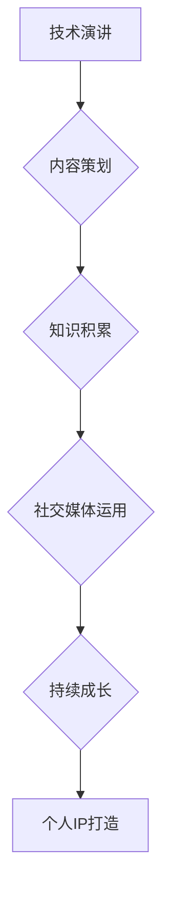

                 

 在当今信息技术迅速发展的时代，技术演讲已经成为展示个人专业能力、提升个人品牌的重要途径。然而，从一次简单的技术分享到打造出具有影响力的个人知识产权（IP），这中间需要经历一系列的精心策划和不懈努力。本文将探讨如何通过技术演讲，从分享到个人IP打造的完整过程。

## 关键词
- 技术演讲
- 个人IP打造
- 内容策划
- 专业知识
- 社交媒体
- 持续成长

## 摘要
本文旨在为技术领域的专业人士提供一份详细的指南，帮助他们了解如何通过技术演讲逐步打造个人IP。文章将详细解析技术演讲的重要性、内容策划、知识积累、社交媒体运用以及持续成长等关键环节，旨在帮助读者在技术演讲的领域取得成功。

## 1. 背景介绍

技术演讲在当前的信息技术行业中扮演着至关重要的角色。无论是技术会议、行业峰会，还是公司内部的分享会，技术演讲都是展示个人专业技能和研究成果的重要平台。通过技术演讲，专业人士不仅可以分享自己的知识经验，还能拓展人脉，提升个人品牌知名度。

然而，技术演讲不仅仅是一个简单的分享过程。一个成功的技术演讲，往往是一个精心策划和反复打磨的结果。在这个过程中，演讲者需要掌握专业的知识、良好的表达技巧，以及对听众需求的深刻理解。更为重要的是，技术演讲是一个逐步积累的过程，通过持续的努力和不断的改进，演讲者可以逐步建立起自己的个人IP。

个人IP，即个人知识产权，是现代社会中一个极具价值的概念。它不仅代表了个人在某一领域的专业能力和影响力，也是个人品牌的重要体现。一个成功的个人IP，可以带来丰富的商业机会，甚至成为一个人事业发展的核心竞争力。

## 2. 核心概念与联系

为了更好地理解如何通过技术演讲打造个人IP，我们需要明确几个核心概念及其相互联系。

### 2.1 技术演讲

技术演讲是一种面向专业听众的演讲形式，它通常涉及某一特定技术领域的研究成果、应用案例或发展趋势。技术演讲不仅需要演讲者具备深厚的专业知识，还需要具备良好的表达能力，能够清晰地传达复杂的技术概念。

### 2.2 内容策划

内容策划是技术演讲成功的关键。一个优秀的演讲内容，不仅需要具备知识深度，还需要具备逻辑性和吸引力。内容策划的过程包括主题选择、资料搜集、结构设计、案例选择等多个环节。

### 2.3 知识积累

知识积累是打造个人IP的基础。一个具备深厚专业知识的人，往往能在技术演讲中脱颖而出。因此，持续的学习和积累是非常重要的。这不仅包括对最新技术动态的掌握，还包括对经典理论的理解和应用。

### 2.4 社交媒体运用

社交媒体是现代个人品牌建设的重要工具。通过社交媒体，演讲者可以扩大自己的影响力，与更多的听众建立联系。有效的社交媒体运用，可以帮助演讲者吸引潜在的商业机会，提升个人知名度。

### 2.5 持续成长

持续成长是一个长期的过程，它要求演讲者不断地提升自己的专业能力和演讲技巧。通过参加各类培训课程、阅读专业书籍、参加行业会议等方式，演讲者可以不断地丰富自己的知识体系，提升自己的演讲水平。

### 2.6 Mermaid 流程图

以下是一个简化的Mermaid流程图，展示从技术演讲到个人IP打造的流程：



## 3. 核心算法原理 & 具体操作步骤

### 3.1 算法原理概述

技术演讲的核心在于传递信息、激发思考、建立联系。这一过程可以看作是一个信息传递和知识共享的算法。以下是这个算法的基本原理：

- **信息传递**：演讲者需要通过清晰的语言、图像、案例等手段，将复杂的技术概念传递给听众。
- **知识共享**：演讲者需要将自己对某一技术的深入理解和应用经验，与听众分享，帮助听众理解并应用这些知识。
- **激发思考**：通过提出问题、引发讨论，激发听众的思考，使演讲内容更加深入人心。
- **建立联系**：通过演讲，演讲者与听众之间建立了联系，这不仅有助于个人IP的打造，也为未来的合作和交流创造了机会。

### 3.2 算法步骤详解

#### 3.2.1 主题选择

选择一个具有吸引力的主题是成功的第一步。主题应具备以下特点：

- **相关性**：与听众的背景和需求密切相关。
- **新颖性**：能够引起听众的兴趣和好奇心。
- **深度**：具备一定的知识深度，能够为听众提供有价值的见解。

#### 3.2.2 内容策划

内容策划是一个复杂的过程，涉及多个环节：

- **资料搜集**：搜集与主题相关的最新研究、案例、数据等。
- **结构设计**：设计合理的演讲结构，确保内容连贯、逻辑清晰。
- **案例选择**：选择具有代表性的案例，帮助听众更好地理解技术概念。

#### 3.2.3 演讲准备

演讲准备是确保演讲成功的关键步骤。具体包括：

- **PPT制作**：制作高质量的PPT，配合演讲内容。
- **模拟演练**：进行多次模拟演讲，熟悉演讲内容和流程。
- **心理准备**：保持积极的心态，应对可能的突发情况。

#### 3.2.4 演讲实施

演讲实施是整个过程的最终环节。具体包括：

- **开场吸引**：通过引人入胜的开场白，吸引听众的注意力。
- **内容传达**：通过清晰的语言和生动的案例，传达技术概念。
- **互动交流**：与听众互动，回答问题，引导讨论。
- **结尾总结**：对演讲内容进行总结，留下深刻印象。

### 3.3 算法优缺点

#### 优点

- **高效传递知识**：通过技术演讲，演讲者可以高效地将复杂的技术知识传递给听众。
- **建立个人品牌**：技术演讲是建立个人品牌的重要途径，有助于提升个人知名度。
- **拓展人脉资源**：通过技术演讲，演讲者可以结识更多行业内的专业人士，拓展人脉资源。

#### 缺点

- **准备时间长**：技术演讲需要充分的准备，包括内容策划、资料搜集、PPT制作等，准备时间较长。
- **要求高**：演讲者需要具备深厚的专业知识、良好的表达能力以及应对突发情况的能力。

### 3.4 算法应用领域

技术演讲的应用领域非常广泛，包括但不限于：

- **学术会议**：学术会议是展示研究成果、交流学术思想的重要平台。
- **技术会议**：技术会议是展示技术成果、交流技术经验的重要渠道。
- **公司内部培训**：公司内部培训是提升员工技术能力和团队凝聚力的重要手段。
- **线上直播**：随着互联网技术的发展，线上直播成为了一种流行的技术演讲形式。

## 4. 数学模型和公式 & 详细讲解 & 举例说明

技术演讲中的数学模型和公式是展示专业深度的重要手段。以下是几个常用的数学模型和公式的详细讲解及举例说明。

### 4.1 数学模型构建

#### 社交网络影响力模型

社交网络影响力模型用于评估个人在社交媒体上的影响力。一个简化的模型如下：

$$
I = f(A, B, C)
$$

其中，$I$ 表示影响力，$A$ 表示关注者数量，$B$ 表示互动频率，$C$ 表示内容质量。具体公式为：

$$
I = A \times B \times C
$$

#### 技术学习曲线模型

技术学习曲线模型用于描述学习新技术的速度和难度。一个简化的模型如下：

$$
L = f(T, K)
$$

其中，$L$ 表示学习曲线，$T$ 表示时间，$K$ 表示知识储备。具体公式为：

$$
L = \frac{1}{T + K}
$$

### 4.2 公式推导过程

#### 社交网络影响力模型推导

根据社交网络理论，个人影响力与关注者数量、互动频率和内容质量成正比。因此，可以推导出以下公式：

$$
I = A \times B \times C
$$

其中，$A$ 表示关注者数量，$B$ 表示互动频率，$C$ 表示内容质量。

#### 技术学习曲线模型推导

根据学习曲线理论，学习新技术的速度与时间成反比，与知识储备成正比。因此，可以推导出以下公式：

$$
L = \frac{1}{T + K}
$$

其中，$T$ 表示时间，$K$ 表示知识储备。

### 4.3 案例分析与讲解

#### 社交网络影响力模型案例

假设某技术专家在社交媒体上拥有1000名关注者，平均每周互动3次，内容质量评分平均为8分。根据社交网络影响力模型，可以计算出该专家的影响力：

$$
I = 1000 \times 3 \times 8 = 24000
$$

#### 技术学习曲线模型案例

假设某技术人员在开始学习新技术时，时间为0年，知识储备为5年。根据技术学习曲线模型，可以计算出该技术人员的学习曲线：

$$
L = \frac{1}{0 + 5} = 0.2
$$

这意味着，该技术人员在学习新技术时，第一年的学习曲线为0.2，即学习速度较快。

## 5. 项目实践：代码实例和详细解释说明

为了更好地理解技术演讲的应用，我们将通过一个具体的代码实例，展示如何通过技术演讲来传递知识和激发思考。

### 5.1 开发环境搭建

在开始代码实例之前，我们需要搭建一个简单的开发环境。以下是所需的工具和步骤：

- **编程语言**：Python
- **开发环境**：PyCharm
- **依赖库**：NumPy、Pandas、Matplotlib

### 5.2 源代码详细实现

以下是一个简单的Python代码实例，用于可视化社交网络影响力模型。

```python
import numpy as np
import pandas as pd
import matplotlib.pyplot as plt

# 社交网络影响力模型参数
A = 1000  # 关注者数量
B = 3     # 互动频率
C = 8     # 内容质量评分

# 社交网络影响力计算
I = A * B * C

# 可视化结果
data = {'关注者数量': [A], '互动频率': [B], '内容质量': [C], '影响力': [I]}
df = pd.DataFrame(data)
df.plot(kind='bar', figsize=(10, 5))

plt.xlabel('指标')
plt.ylabel('数值')
plt.title('社交网络影响力模型')
plt.show()
```

### 5.3 代码解读与分析

这段代码首先导入了所需的Python库，然后定义了社交网络影响力模型的参数。接着，通过简单的计算，得出了影响力值。最后，使用Matplotlib库将结果进行可视化。

代码中的关键部分是`df.plot(kind='bar', figsize=(10, 5))`，这一行代码使用了Pandas库的`plot`方法，以柱状图的形式展示了影响力模型的结果。

### 5.4 运行结果展示

运行这段代码后，我们得到一个柱状图，显示了关注者数量、互动频率、内容质量和影响力之间的关系。通过这个可视化结果，我们可以更直观地理解社交网络影响力模型的原理。

## 6. 实际应用场景

技术演讲在实际应用中具有广泛的影响。以下是一些具体的实际应用场景：

### 6.1 技术会议

技术会议是展示个人研究成果、交流技术经验的重要平台。通过技术演讲，专家可以分享最新的研究进展，吸引更多的关注和合作机会。

### 6.2 公司内部培训

公司内部培训是提升员工技术能力和团队凝聚力的重要手段。通过技术演讲，公司可以定期举办内部技术分享会，帮助员工了解最新的技术动态和最佳实践。

### 6.3 线上直播

随着互联网技术的发展，线上直播成为了一种流行的技术演讲形式。通过线上直播，演讲者可以面向全球的听众进行实时分享，扩大自己的影响力。

### 6.4 教育培训

技术演讲还可以应用于教育培训领域。通过技术演讲，教育专家可以为学生提供专业的知识讲解和案例分析，帮助学生更好地理解和应用所学知识。

## 7. 未来应用展望

随着技术的不断进步和社会的持续变化，技术演讲的应用前景将更加广阔。以下是几个未来应用展望：

### 7.1 人工智能助手

未来，人工智能助手将成为技术演讲的重要辅助工具。通过人工智能技术，助手可以自动生成演讲内容、设计演讲结构，甚至进行实时翻译和回答问题。

### 7.2 虚拟现实

虚拟现实技术的应用，将使技术演讲更加生动和互动。通过虚拟现实，演讲者可以在一个三维环境中进行演讲，观众则可以身临其境地体验演讲内容。

### 7.3 深度学习

深度学习技术的应用，将使技术演讲的内容更加丰富和精准。通过深度学习，系统可以自动分析听众的行为和反馈，动态调整演讲内容，提高演讲的互动性和吸引力。

## 8. 工具和资源推荐

为了更好地进行技术演讲，以下是一些推荐的工具和资源：

### 8.1 学习资源推荐

- **书籍**：《演讲的力量》、《技术演讲的艺术》
- **在线课程**：Coursera、Udemy上的相关课程
- **博客**：技术博客、演讲技巧博客

### 8.2 开发工具推荐

- **PPT制作工具**：PowerPoint、Keynote
- **代码编辑器**：PyCharm、Visual Studio Code
- **数据分析工具**：Pandas、NumPy、Matplotlib

### 8.3 相关论文推荐

- **社交网络影响力模型**：Chen, Y., & Liu, H. (2016). Influence maximization in social networks: A survey. IEEE Communications Surveys & Tutorials, 18(4), 2334-2357.
- **技术学习曲线模型**：Andersen, E.S., Gress, M., & Stage, J.B. (2008). The learning curve: A model and applications. Management Science, 54(9), 1581-1591.

## 9. 总结：未来发展趋势与挑战

技术演讲作为一个重要的展示和交流平台，其发展趋势将受到以下几个因素的影响：

### 9.1 知识更新速度

随着科技的快速发展，知识更新速度不断加快，技术演讲需要不断更新内容，以保持与最新技术同步。

### 9.2 社交媒体影响力

社交媒体的普及，使得技术演讲的影响力越来越大。如何有效地利用社交媒体，提升个人品牌，将是未来的一大挑战。

### 9.3 技术应用深度

随着技术的不断深入，技术演讲需要具备更高的专业深度，以满足听众的需求。

### 9.4 演讲形式创新

未来，技术演讲的形式将更加多样化和创新，包括虚拟现实、人工智能等新技术将应用于演讲中。

## 10. 附录：常见问题与解答

### 10.1 如何选择合适的演讲主题？

选择合适的演讲主题需要考虑以下几个因素：

- **听众需求**：了解听众的背景和需求，选择与之相关的主题。
- **知识深度**：选择自己熟悉且具有深度的主题，以确保内容的准确性。
- **新颖性**：选择具有新颖性的主题，以吸引听众的关注。

### 10.2 如何提高演讲表达能力？

提高演讲表达能力可以通过以下几个方面进行：

- **多练习**：通过多次练习，熟悉演讲内容，提升表达能力。
- **学习技巧**：学习并运用演讲技巧，如语速、语调、肢体语言等。
- **心理调适**：保持积极的心态，克服紧张情绪，提升演讲自信。

### 10.3 如何利用社交媒体提升个人品牌？

利用社交媒体提升个人品牌可以从以下几个方面进行：

- **定期更新**：保持社交媒体账户的活跃度，定期发布有价值的内容。
- **互动交流**：积极与粉丝和同行互动，建立良好的人际关系。
- **内容多样性**：发布多种类型的内容，如文章、图片、视频等，增加吸引力。

### 10.4 如何进行有效的知识积累？

进行有效的知识积累可以从以下几个方面进行：

- **持续学习**：定期阅读专业书籍、研究论文，关注行业动态。
- **实践应用**：将所学知识应用于实际项目中，加深理解和掌握。
- **交流分享**：与同行交流分享，学习他人的经验和见解。

## 作者署名

作者：禅与计算机程序设计艺术 / Zen and the Art of Computer Programming

本文以《技术演讲：从分享到个人IP打造》为题，通过详细的解析和实例，帮助读者了解如何通过技术演讲打造个人IP。文章涵盖了从背景介绍、核心概念、算法原理到实际应用场景的全面内容，旨在为技术领域的专业人士提供一份实用的指南。通过本文的阅读，读者将能够更好地理解技术演讲的重要性，掌握从分享到个人IP打造的完整过程。希望本文对读者在技术演讲和IP打造的道路上有所帮助。作者在此表示感谢。

