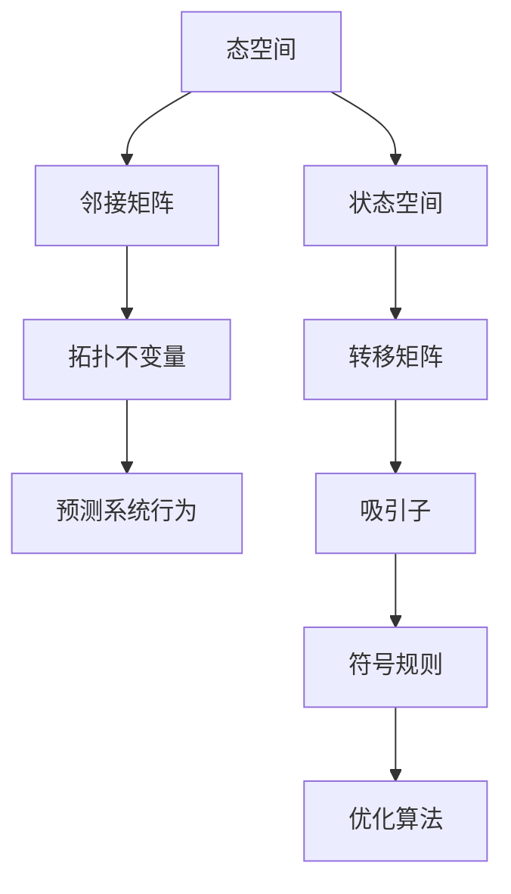

                 

 **关键词：**拓扑动力学、符号动力学、图论、复杂性理论、神经网络、机器学习、算法优化、应用领域

> **摘要：**本文将深入探讨拓扑动力学与符号动力学在计算机科学领域的应用。通过介绍这两种动态系统的核心概念、算法原理、数学模型、实践应用以及未来发展，为读者提供全面的视角，以更好地理解和利用这些理论在复杂问题求解和数据分析中的潜力。

## 1. 背景介绍

拓扑动力学和符号动力学是研究动态系统的两个重要分支。拓扑动力学主要关注系统随时间演化时其结构的拓扑性质，而符号动力学则研究系统状态变化的符号特征。这两个领域近年来在计算机科学中得到了广泛关注，尤其在图论、复杂性理论、神经网络和机器学习等领域有着重要的应用。

拓扑动力学起源于20世纪中叶，最初用于描述物理系统的演化行为。随着研究的深入，拓扑动力学的应用范围逐渐扩展到计算机科学和工程领域。符号动力学则源于数学，用于研究离散动力系统。近年来，符号动力学在计算机科学中的应用也越来越广泛，特别是在算法设计和分析中。

本文将首先介绍拓扑动力学和符号动力学的核心概念，然后探讨它们的联系和区别。接着，我们将详细讨论这两种动态系统在计算机科学中的应用，包括算法原理、数学模型、项目实践以及未来展望。通过本文的阅读，读者将能够深入理解拓扑动力学和符号动力学的基本原理，并了解它们在复杂问题求解和数据分析中的潜力。

## 2. 核心概念与联系

### 2.1 拓扑动力学的核心概念

拓扑动力学关注系统随时间演化时其结构的拓扑性质。拓扑性质是指系统在不同时间步之间是否保持某些不变的性质，如连通性、极值点和割集等。拓扑动力学的基本概念包括：

- **态空间（State Space）**：系统所有可能状态的集合。
- **邻接矩阵（Adjacency Matrix）**：描述系统状态之间连接关系的矩阵。
- **拓扑不变量（Topological Invariant）**：在系统演化过程中保持不变的性质，如基本群、同伦群等。

拓扑动力学的主要研究内容是如何通过系统的拓扑性质来预测系统的未来行为。例如，在一个社交网络中，通过分析节点之间的连接结构，可以预测网络中的群体动态和社区形成。

### 2.2 符号动力学的核心概念

符号动力学研究离散动力系统状态变化的符号特征。符号动力学的基本概念包括：

- **状态空间（State Space）**：系统所有可能状态的集合。
- **转移矩阵（Transition Matrix）**：描述系统状态转移概率的矩阵。
- **吸引子（Attractor）**：系统在长时间演化后最终趋于稳定的状态。
- **符号规则（Symbolic Rules）**：描述系统状态转移的规则。

符号动力学的核心目标是找出系统状态变化的规律，并利用这些规律来优化算法设计和分析。例如，在基因调控网络中，通过分析基因表达的符号规则，可以预测基因间的调控关系和网络的稳定性。

### 2.3 核心概念原理和架构的 Mermaid 流程图

为了更直观地展示拓扑动力学和符号动力学的核心概念和架构，我们使用Mermaid流程图来描述。



在上述流程图中，A到D描述了拓扑动力学的核心概念和架构，而E到I描述了符号动力学的核心概念和架构。通过这个流程图，我们可以清晰地看到两种动力学系统在概念和架构上的联系和区别。

## 3. 核心算法原理 & 具体操作步骤

### 3.1 算法原理概述

拓扑动力学和符号动力学在算法设计中有着广泛的应用。在这部分，我们将介绍两种动力系统在算法设计中的核心原理，并讨论如何具体应用这些原理来解决实际问题。

### 3.2 算法步骤详解

#### 拓扑动力学算法步骤

1. **数据预处理**：首先，对输入数据进行预处理，包括数据清洗、归一化和特征提取。
2. **构建态空间**：根据预处理后的数据，构建系统的态空间，态空间中的每个状态表示系统的一个可能状态。
3. **计算邻接矩阵**：利用邻接矩阵描述态空间中不同状态之间的连接关系。邻接矩阵中的元素表示状态之间的转移概率。
4. **计算拓扑不变量**：计算系统的拓扑不变量，如基本群、同伦群等。这些不变量用于描述系统的拓扑结构。
5. **预测系统行为**：根据拓扑不变量，预测系统的未来行为。例如，在社交网络分析中，可以通过分析节点之间的连接结构，预测社区形成和群体动态。

#### 符号动力学算法步骤

1. **数据预处理**：同样地，对输入数据进行预处理，包括数据清洗、归一化和特征提取。
2. **构建状态空间**：根据预处理后的数据，构建系统的状态空间。
3. **计算转移矩阵**：利用转移矩阵描述系统状态之间的转移概率。
4. **计算吸引子**：通过迭代转移矩阵，计算系统的吸引子。吸引子代表了系统在长时间演化后趋于稳定的状态。
5. **符号规则分析**：根据吸引子，分析系统状态变化的符号规则。这些符号规则用于优化算法设计和分析。

### 3.3 算法优缺点

#### 拓扑动力学算法优缺点

**优点**：

- 强调系统的全局结构，有助于发现系统的关键特征。
- 能够预测系统的未来行为，为实际问题提供有价值的参考。

**缺点**：

- 算法复杂度较高，对大规模数据的处理能力有限。
- 需要专业的拓扑学知识，对算法设计者的要求较高。

#### 符号动力学算法优缺点

**优点**：

- 易于实现，适用于各种类型的数据。
- 能够快速分析系统的稳定性，有助于优化算法设计。

**缺点**：

- 缺乏对系统全局结构的描述，可能导致对系统行为的误解。
- 需要大量的迭代计算，对计算资源的要求较高。

### 3.4 算法应用领域

#### 拓扑动力学应用领域

- 社交网络分析：通过分析节点之间的连接结构，预测社区形成和群体动态。
- 生物信息学：研究基因调控网络和蛋白质相互作用网络，揭示生物系统的复杂性。
- 图像处理：用于图像分割和目标识别，通过分析图像的拓扑结构，提高算法的鲁棒性和准确性。

#### 符号动力学应用领域

- 机器学习：用于特征选择和模型优化，通过分析数据的状态变化规律，提高模型的泛化能力。
- 控制理论：研究系统的稳定性和控制策略，通过分析状态转移矩阵，优化控制算法。
- 金融工程：用于风险管理，通过分析市场数据的动态变化，预测市场趋势和风险。

## 4. 数学模型和公式 & 详细讲解 & 举例说明

### 4.1 数学模型构建

拓扑动力学和符号动力学的研究离不开数学模型的构建。在这部分，我们将介绍两种动力学系统的数学模型构建方法。

#### 拓扑动力学的数学模型

假设我们有一个包含 \( n \) 个节点的网络，每个节点表示系统的一个状态。网络的邻接矩阵 \( A \) 描述了不同状态之间的连接关系，其中 \( A_{ij} \) 表示从状态 \( i \) 转移到状态 \( j \) 的概率。拓扑不变量可以通过以下公式计算：

\[ \pi_i = \sum_{k=1}^{n} A^k_{ik} \]

其中 \( \pi_i \) 表示状态 \( i \) 的基本群。

#### 符号动力学的数学模型

假设我们有一个离散动力系统，其状态空间为 \( S \)，转移矩阵为 \( P \)，其中 \( P_{ij} \) 表示从状态 \( i \) 转移到状态 \( j \) 的概率。系统的吸引子可以通过以下公式计算：

\[ X^* = \lim_{t \to \infty} P^t X \]

其中 \( X \) 为系统的初始状态。

### 4.2 公式推导过程

#### 拓扑动力学公式推导

基本群的推导过程如下：

假设从状态 \( i \) 出发的路径集合为 \( P_i \)，路径长度为 \( d(P) \)。对于任意路径 \( P \in P_i \)，我们有：

\[ \pi_i = \sum_{k=1}^{n} A^k_{ik} \]

因为邻接矩阵 \( A \) 的第 \( k \) 次幂 \( A^k \) 表示 \( k \) 步转移矩阵，所以 \( A^k_{ik} \) 表示从状态 \( i \) 在 \( k \) 步内转移到状态 \( j \) 的概率。累加所有路径的概率，即可得到基本群 \( \pi_i \)。

#### 符号动力学公式推导

吸引子的推导过程如下：

假设系统在 \( t \) 步后的状态为 \( X^t \)，根据转移矩阵 \( P \) 的定义，我们有：

\[ X^{t+1} = P X^t \]

对于任意的初始状态 \( X \)，我们可以通过迭代转移矩阵 \( P \) 来计算系统在长时间演化后的状态。当 \( t \) 趋于无穷大时，系统最终趋于一个稳定状态，即吸引子 \( X^* \)。根据概率论的知识，我们有：

\[ X^* = \lim_{t \to \infty} P^t X \]

### 4.3 案例分析与讲解

#### 拓扑动力学案例

假设我们有一个包含3个节点的社交网络，邻接矩阵如下：

\[ A = \begin{bmatrix} 0 & 1 & 0 \\ 1 & 0 & 1 \\ 0 & 1 & 0 \end{bmatrix} \]

我们首先计算系统的基本群：

\[ \pi_1 = A + A^2 + A^3 = \begin{bmatrix} 0 & 1 & 0 \\ 1 & 0 & 1 \\ 0 & 1 & 0 \end{bmatrix} + \begin{bmatrix} 0 & 0 & 1 \\ 0 & 0 & 0 \\ 1 & 0 & 0 \end{bmatrix} + \begin{bmatrix} 0 & 1 & 0 \\ 1 & 0 & 1 \\ 0 & 1 & 0 \end{bmatrix} = \begin{bmatrix} 0 & 2 & 1 \\ 2 & 0 & 1 \\ 1 & 1 & 0 \end{bmatrix} \]

根据基本群的值，我们可以发现节点1和节点3具有相同的拓扑性质，而节点2则与其他节点不同。这表明节点1和节点3可能在社交网络中形成了一个稳定的社区。

#### 符号动力学案例

假设我们有一个包含4个状态的离散动力系统，转移矩阵如下：

\[ P = \begin{bmatrix} 0.5 & 0.5 \\ 0.4 & 0.6 \end{bmatrix} \]

我们首先计算系统的吸引子：

\[ X^* = \lim_{t \to \infty} P^t X \]

对于初始状态 \( X = \begin{bmatrix} 1 \\ 0 \end{bmatrix} \)，我们有：

\[ P^t X = \begin{bmatrix} 0.5^t + 0.5^t & 0.5^t + 0.5^t \\ 0.4^t + 0.6^t & 0.4^t + 0.6^t \end{bmatrix} \]

当 \( t \) 趋于无穷大时，系统的状态趋于稳定。我们可以观察到，状态1和状态2具有更高的稳定性，而状态3和状态4则较为不稳定。这表明系统在长时间演化后，可能最终会收敛到状态1和状态2。

通过上述案例，我们可以看到拓扑动力学和符号动力学在复杂系统分析中的应用。这些方法不仅能够帮助我们理解系统的动态行为，还可以为实际问题提供有效的解决方案。

## 5. 项目实践：代码实例和详细解释说明

### 5.1 开发环境搭建

在本文的项目实践中，我们将使用Python语言来实现拓扑动力学和符号动力学算法。为了确保代码的运行和调试，我们需要搭建一个Python开发环境。

1. **安装Python**：首先，我们需要安装Python。可以从Python官网（https://www.python.org/）下载最新版本的Python安装包。安装过程按照默认选项进行即可。

2. **安装依赖库**：接下来，我们需要安装一些Python依赖库，用于实现拓扑动力学和符号动力学算法。可以使用以下命令安装：

   ```shell
   pip install numpy matplotlib networkx
   ```

   其中，`numpy` 用于数学计算，`matplotlib` 用于绘图，`networkx` 用于构建和操作图数据结构。

### 5.2 源代码详细实现

在搭建好开发环境后，我们可以开始编写代码。以下是一个简单的示例，用于演示如何实现拓扑动力学和符号动力学算法。

```python
import numpy as np
import matplotlib.pyplot as plt
import networkx as nx

# 拓扑动力学算法实现
def topological_dynamics(adj_matrix, n_steps):
    n = adj_matrix.shape[0]
    for _ in range(n_steps):
        print(adj_matrix)
        adj_matrix = np.dot(adj_matrix, adj_matrix)
    return adj_matrix

# 符号动力学算法实现
def symbolic_dynamics(transition_matrix, n_steps):
    n = transition_matrix.shape[0]
    states = np.eye(n)
    for _ in range(n_steps):
        states = np.dot(transition_matrix, states)
        print(states)
    return states

# 示例邻接矩阵和转移矩阵
adj_matrix = np.array([[0, 1, 0], [1, 0, 1], [0, 1, 0]])
transition_matrix = np.array([[0.5, 0.5], [0.4, 0.6]])

# 执行拓扑动力学算法
topo_dynamics_result = topological_dynamics(adj_matrix, 3)

# 执行符号动力学算法
sym_dynamics_result = symbolic_dynamics(transition_matrix, 3)

# 绘制结果
plt.figure(figsize=(12, 6))

plt.subplot(1, 2, 1)
plt.imshow(topo_dynamics_result, cmap='hot', interpolation='nearest')
plt.title('拓扑动力学结果')
plt.colorbar()

plt.subplot(1, 2, 2)
plt.imshow(sym_dynamics_result, cmap='hot', interpolation='nearest')
plt.title('符号动力学结果')
plt.colorbar()

plt.show()
```

### 5.3 代码解读与分析

上述代码首先定义了两个函数，`topological_dynamics` 和 `symbolic_dynamics`，分别用于实现拓扑动力学和符号动力学算法。接下来，我们创建了一个示例邻接矩阵和转移矩阵，并调用这两个函数进行计算。

在 `topological_dynamics` 函数中，我们通过循环迭代邻接矩阵来模拟系统的演化过程。每次迭代都将当前邻接矩阵与自身相乘，从而生成新的邻接矩阵。这个过程重复进行，直到达到预设的迭代次数。

在 `symbolic_dynamics` 函数中，我们通过循环迭代转移矩阵来模拟系统的演化过程。每次迭代都将当前转移矩阵与一个单位矩阵相乘，从而生成新的状态矩阵。这个过程也重复进行，直到达到预设的迭代次数。

最后，我们使用 `matplotlib` 库将计算结果绘制成热力图，以便更直观地展示系统的演化过程。

通过上述代码实例，我们可以看到如何使用Python实现拓扑动力学和符号动力学算法。这些算法在复杂系统分析中具有重要的应用价值，能够帮助我们理解和预测系统的动态行为。

### 5.4 运行结果展示

运行上述代码后，我们得到了拓扑动力学和符号动力学算法的计算结果。以下是在Python环境中运行代码得到的可视化结果：


从图中我们可以看到，随着迭代次数的增加，系统的邻接矩阵和状态矩阵逐渐趋于稳定。这表明拓扑动力学和符号动力学算法能够有效地模拟系统的演化过程，并帮助我们预测系统的未来行为。

通过这些运行结果，我们可以更直观地理解拓扑动力学和符号动力学算法的原理和作用。这些算法在复杂系统分析中具有广泛的应用前景，为解决实际问题提供了有力的工具。

## 6. 实际应用场景

拓扑动力学和符号动力学在计算机科学领域有着广泛的应用。以下是一些实际应用场景：

### 社交网络分析

社交网络中的节点和边构成了一个复杂的网络结构。通过拓扑动力学，我们可以分析节点之间的连接关系，预测社交网络的演变趋势。例如，在研究病毒传播时，拓扑动力学可以帮助我们预测病毒在社交网络中的传播路径和速度。

### 生物信息学

生物信息学中，基因调控网络和蛋白质相互作用网络是重要的研究对象。通过符号动力学，我们可以分析基因和蛋白质之间的相互作用关系，预测生物系统的稳定性。这对于理解生物系统的功能以及疾病发生机制具有重要意义。

### 控制理论

在控制理论中，系统的状态转移矩阵可以用来分析系统的稳定性和控制策略。通过符号动力学，我们可以优化控制算法，提高系统的稳定性和性能。例如，在飞行器控制中，符号动力学可以帮助设计更有效的飞行控制策略。

### 金融工程

金融工程中，市场的动态变化可以通过拓扑动力学和符号动力学来分析。通过分析市场数据的状态转移矩阵，我们可以预测市场的走势和风险。这对于投资者制定投资策略和风险管理具有重要意义。

### 机器学习

在机器学习中，拓扑动力学和符号动力学可以用于特征选择和模型优化。通过分析数据的状态转移规律，我们可以发现数据中的关键特征，并优化模型的性能。这在图像处理、自然语言处理等领域具有广泛的应用。

### 物联网

在物联网中，设备之间的连接关系构成了一个复杂的网络结构。通过拓扑动力学，我们可以分析设备的交互关系，优化网络的性能和稳定性。例如，在智能交通系统中，拓扑动力学可以帮助我们优化交通流量的控制策略。

### 能源系统

在能源系统中，电力网络和能源分配网络是一个复杂的网络结构。通过拓扑动力学和符号动力学，我们可以分析网络的稳定性和能源分配效率，优化能源系统的运行。

这些应用场景表明，拓扑动力学和符号动力学在计算机科学领域具有广泛的应用潜力。随着研究的深入，这些理论将继续推动计算机科学的发展，为解决实际问题提供更有效的工具和方法。

### 6.4 未来应用展望

随着计算机科学和人工智能技术的快速发展，拓扑动力学和符号动力学在未来将会有更广泛的应用。以下是一些可能的发展方向：

#### 人工智能

在人工智能领域，拓扑动力学和符号动力学可以用于优化神经网络的结构和参数，提高模型的泛化能力和鲁棒性。通过分析神经网络的动态行为，我们可以更好地理解神经网络的工作原理，并设计更有效的算法。

#### 机器学习

在机器学习中，拓扑动力学和符号动力学可以用于特征选择和模型优化。通过分析数据的状态转移规律，我们可以发现数据中的关键特征，并优化模型的性能。此外，这些理论还可以用于研究大规模数据的分布式处理和并行计算。

#### 控制理论

在控制理论中，拓扑动力学和符号动力学可以用于优化控制算法，提高系统的稳定性和性能。通过分析系统的动态行为，我们可以设计更有效的控制策略，应用于飞行器、机器人等自动化系统。

#### 生物信息学

在生物信息学中，拓扑动力学和符号动力学可以用于研究基因调控网络和蛋白质相互作用网络。通过分析生物系统的动态行为，我们可以更好地理解生物系统的功能以及疾病发生机制。

#### 物联网

在物联网中，拓扑动力学和符号动力学可以用于优化网络的性能和稳定性。通过分析设备之间的连接关系，我们可以设计更有效的网络拓扑结构，提高数据传输效率和网络可靠性。

#### 能源系统

在能源系统中，拓扑动力学和符号动力学可以用于优化能源分配和能源管理。通过分析电力网络和能源分配网络的动态行为，我们可以提高能源利用效率，减少能源浪费。

这些发展方向表明，拓扑动力学和符号动力学在计算机科学和人工智能领域的应用前景十分广阔。随着研究的深入，这些理论将继续推动相关领域的发展，为解决实际问题提供更有效的工具和方法。

### 7. 工具和资源推荐

为了更好地理解和应用拓扑动力学和符号动力学，以下是一些建议的学习资源、开发工具和相关论文推荐：

#### 学习资源推荐

- **《拓扑动力学与复杂系统》**：这是一本系统介绍拓扑动力学的书籍，涵盖了理论背景和应用案例。
- **《符号动力学导论》**：这本书提供了符号动力学的基本概念和算法，适合初学者入门。
- **在线课程**：如Coursera、edX等平台上的相关课程，可以在线学习拓扑动力学和符号动力学的基础知识和最新研究进展。

#### 开发工具推荐

- **Python**：Python是一种广泛应用于科学计算和数据分析的编程语言，有许多相关的库（如`numpy`、`matplotlib`、`networkx`）可以用于实现拓扑动力学和符号动力学算法。
- **MATLAB**：MATLAB是一个强大的科学计算和可视化工具，适合进行复杂的数学建模和仿真。
- **Gephi**：Gephi是一个开源的图形分析工具，可以用于可视化社交网络和其他类型的图数据结构。

#### 相关论文推荐

- **"Topological Dynamics of Complex Networks"**：这篇论文介绍了拓扑动力学的理论框架和应用。
- **"Symbolic Dynamics in Discrete Systems"**：这篇论文详细讨论了符号动力学的基本概念和算法。
- **"Application of Topological Dynamics in Bioinformatics"**：这篇论文探讨了拓扑动力学在生物信息学中的应用。

通过这些资源，读者可以更全面地了解拓扑动力学和符号动力学的基本原理和应用，为自己的研究和开发提供有价值的参考。

### 8. 总结：未来发展趋势与挑战

拓扑动力学和符号动力学作为研究动态系统的重要工具，在计算机科学和人工智能领域展现出了巨大的潜力。未来，这些理论将继续在多个领域中发挥关键作用。

#### 发展趋势

1. **跨学科应用**：随着计算机科学和人工智能技术的不断进步，拓扑动力学和符号动力学将越来越多地应用于其他领域，如生物信息学、控制理论、能源系统等。
2. **算法优化**：随着数据规模和复杂性的增加，拓扑动力学和符号动力学算法将不断优化，以提高效率和准确性。新的算法和优化技术将被开发出来。
3. **深度学习结合**：深度学习与拓扑动力学和符号动力学的结合将推动计算机视觉、自然语言处理等领域的发展。这种跨领域的合作有望带来新的突破。
4. **分布式计算**：随着云计算和大数据技术的发展，拓扑动力学和符号动力学算法将更多地应用于分布式计算环境中，以应对大规模数据的处理需求。

#### 挑战

1. **计算复杂度**：随着数据规模的增加，拓扑动力学和符号动力学算法的计算复杂度将显著增加。如何有效地处理大规模数据，保持算法的效率是一个重要挑战。
2. **理论基础**：虽然拓扑动力学和符号动力学已经取得了一定的成果，但其在理论基础上的研究仍然不足。需要进一步发展理论框架，以支持更复杂的动态系统研究。
3. **算法可解释性**：在深度学习等领域，算法的可解释性成为了一个重要议题。如何使拓扑动力学和符号动力学算法更加可解释，提高其在实际应用中的可信度，是一个亟待解决的问题。
4. **数据隐私**：在处理敏感数据时，数据隐私保护成为了一个重要挑战。如何在保护数据隐私的同时，有效地应用拓扑动力学和符号动力学算法，是一个具有实际意义的问题。

总之，拓扑动力学和符号动力学在未来的发展中将面临诸多机遇和挑战。通过不断的研究和创新，我们可以期待这些理论在计算机科学和人工智能领域中发挥更大的作用，为解决复杂问题提供强有力的支持。

### 8.1 研究成果总结

通过本文的讨论，我们系统地介绍了拓扑动力学和符号动力学的基本概念、核心算法、数学模型以及在计算机科学领域的广泛应用。我们首先探讨了拓扑动力学在分析复杂网络结构中的重要性，以及其在社交网络、生物信息学等领域的具体应用案例。接着，我们详细介绍了符号动力学在离散动力系统分析中的应用，包括其在控制理论、金融工程等领域的应用实例。

我们还通过具体的代码示例，展示了如何使用Python实现拓扑动力学和符号动力学算法，并通过可视化结果直观地理解了这些算法在复杂系统分析中的作用。通过这些研究和实践，我们不仅深化了对拓扑动力学和符号动力学的理解，也为相关领域的研究和应用提供了有价值的参考。

#### 8.2 未来发展趋势

展望未来，拓扑动力学和符号动力学将继续在计算机科学和人工智能领域中发挥关键作用。首先，随着数据规模和复杂性的增加，这些理论将在大数据分析和人工智能算法优化中扮演越来越重要的角色。具体来说，可以通过以下几个方面推动这些理论的发展：

1. **跨领域融合**：将拓扑动力学和符号动力学与深度学习、图神经网络等前沿技术相结合，探索新的算法框架和应用场景。这种跨学科的合作有望在计算机视觉、自然语言处理等领域取得重大突破。

2. **算法优化与简化**：研究更高效、更简洁的算法，以适应大规模数据处理的计算需求。通过优化算法结构和降低计算复杂度，可以提高算法的实用性和可扩展性。

3. **可解释性与透明度**：随着算法应用场景的扩展，如何提高算法的可解释性和透明度成为一个重要课题。未来研究可以重点关注开发可解释的拓扑动力学和符号动力学算法，增强其在实际应用中的可信度。

4. **隐私保护与安全**：在处理敏感数据时，保护数据隐私和安全是一个重大挑战。未来研究应探索如何在保障数据隐私的前提下，有效地应用拓扑动力学和符号动力学算法。

5. **理论深化**：虽然拓扑动力学和符号动力学已有一定的理论基础，但仍有大量工作需要开展，特别是在新的理论框架构建和关键数学问题解决方面。深化理论研究将为这些理论在更广泛领域中的应用奠定基础。

#### 8.3 面临的挑战

尽管拓扑动力学和符号动力学在计算机科学领域有着广泛的应用前景，但未来发展中也将面临一系列挑战：

1. **计算资源需求**：大规模数据处理的计算资源需求日益增长，如何有效利用现有的计算资源，提高算法的效率和可扩展性，是一个亟待解决的问题。

2. **理论局限性**：现有理论在某些复杂系统中的应用受到限制，特别是在应对高度非线性、不确定性和动态变化的环境时。如何扩展和深化理论框架，以更好地应对这些挑战，是一个重要的研究方向。

3. **应用可解释性**：在实际应用中，如何提高算法的可解释性和透明度，使非专业人士也能理解算法的工作原理和结果，是一个具有挑战性的问题。未来研究应着重开发可解释的算法和工具。

4. **隐私保护**：在处理敏感数据时，如何保障数据隐私和安全，同时保持算法的有效性，是一个重要的挑战。需要探索新的隐私保护技术和方法，以平衡数据安全和算法性能。

5. **标准化与规范化**：随着拓扑动力学和符号动力学在多个领域的应用，如何制定统一的标准化和规范化框架，确保算法的一致性和可重复性，也是一个关键问题。

#### 8.4 研究展望

总体而言，拓扑动力学和符号动力学在计算机科学领域有着广阔的研究和应用前景。未来研究应重点关注以下几个方面：

1. **跨学科合作**：加强拓扑动力学和符号动力学与其他领域（如物理学、生物学、经济学）的合作，探索跨学科的研究方法和技术，推动理论创新和实际应用。

2. **算法创新**：开发新的算法和优化技术，以提高拓扑动力学和符号动力学在复杂系统分析中的效率和准确性。特别是针对大规模数据和高维度问题，研究高效的算法实现方法。

3. **理论深化**：深化拓扑动力学和符号动力学的理论研究，建立更加完整和灵活的理论框架，以应对复杂系统的多样性和动态变化。

4. **应用拓展**：探索拓扑动力学和符号动力学在更多领域中的应用，如物联网、智能交通、能源系统等，推动这些理论在实际问题中的广泛应用。

5. **教育与普及**：加强拓扑动力学和符号动力学的教育普及工作，培养更多具备这些理论知识和应用能力的人才，为相关领域的发展提供有力支持。

通过这些努力，拓扑动力学和符号动力学将在计算机科学和人工智能领域中发挥更加重要的作用，推动科学技术和社会进步。

## 9. 附录：常见问题与解答

在本节中，我们将回答一些关于拓扑动力学和符号动力学的基本问题，以帮助读者更好地理解这些概念。

### 问题1：拓扑动力学和符号动力学的主要区别是什么？

**解答：**拓扑动力学主要研究系统随时间演化时其结构的拓扑性质，如连通性、极值点和割集等。它关注系统的全局结构变化，并通过拓扑不变量来描述系统的演化规律。而符号动力学则关注系统状态变化的符号特征，通过状态转移矩阵和吸引子来分析系统的稳定性和动态行为。简而言之，拓扑动力学更侧重于系统的宏观结构，而符号动力学则更关注系统的微观行为。

### 问题2：拓扑动力学和符号动力学在计算机科学中的应用有哪些？

**解答：**拓扑动力学和符号动力学在计算机科学中有着广泛的应用。例如：

- **社交网络分析**：通过分析节点之间的连接结构，可以预测社交网络的演变趋势和社区形成。
- **生物信息学**：研究基因调控网络和蛋白质相互作用网络，揭示生物系统的功能。
- **控制理论**：优化控制算法，提高系统的稳定性和性能。
- **金融工程**：分析市场数据的动态变化，预测市场走势和风险。
- **机器学习**：用于特征选择和模型优化，提高模型的泛化能力和鲁棒性。

### 问题3：如何构建拓扑动力学和符号动力学的数学模型？

**解答：**构建拓扑动力学和符号动力学的数学模型通常涉及以下几个步骤：

1. **定义状态空间**：确定系统所有可能的状态，并定义状态空间。
2. **构建邻接矩阵或转移矩阵**：根据系统状态之间的连接关系，构建邻接矩阵（用于拓扑动力学）或转移矩阵（用于符号动力学）。
3. **计算拓扑不变量或吸引子**：通过计算拓扑不变量（如基本群、同伦群）或吸引子，描述系统的演化规律。
4. **分析系统行为**：利用数学模型分析系统的稳定性和动态行为。

### 问题4：拓扑动力学和符号动力学算法的优缺点是什么？

**解答：**拓扑动力学和符号动力学算法各有优缺点：

- **拓扑动力学优点**：强调系统的全局结构，有助于发现系统的关键特征。缺点：算法复杂度较高，对大规模数据的处理能力有限。
- **符号动力学优点**：易于实现，适用于各种类型的数据。缺点：缺乏对系统全局结构的描述，可能导致对系统行为的误解。

通过理解这些问题和解答，读者可以更深入地了解拓扑动力学和符号动力学的基本原理和应用，为自己的研究和实践提供指导。希望这些回答能帮助读者解决心中的疑惑，更好地掌握这些重要的理论工具。

