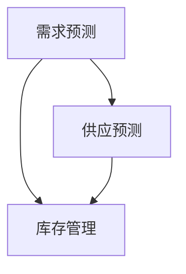

                 

关键词：拼多多、校招、供应链预测、面试题集锦、技术博客

摘要：本文针对拼多多2024校招供应链预测工程师的面试题集锦，从背景介绍、核心概念与联系、核心算法原理、数学模型与公式、项目实践、实际应用场景、工具和资源推荐等多个维度进行了详细的分析和讲解。旨在帮助读者了解供应链预测领域的相关知识，为准备校招面试的同学们提供参考。

## 1. 背景介绍

随着互联网和电子商务的快速发展，供应链管理在企业运营中的重要性日益凸显。供应链预测作为供应链管理的重要环节，通过对未来供应链中各个环节的需求、供应、库存等进行准确预测，有助于企业优化资源配置，降低成本，提高运营效率。拼多多作为一家知名的电商平台，其供应链预测系统的建设具有重要意义。

为了吸引和选拔优秀的人才，拼多多校招供应链预测工程师岗位的面试题目往往涵盖了广泛的知识点，包括数据挖掘、机器学习、优化算法、数学建模等。本文将针对这些面试题目进行详细解析，帮助同学们更好地准备校招面试。

## 2. 核心概念与联系

在供应链预测领域，有几个核心概念需要了解：

1. **需求预测**：预测未来一段时间内各个商品的需求量。
2. **供应预测**：预测未来一段时间内各个商品的可供应量。
3. **库存管理**：根据需求预测和供应预测，对库存进行合理调整。

这些概念之间紧密联系，共同构成了一个完整的供应链预测系统。下面是供应链预测系统的 Mermaid 流程图：



## 3. 核心算法原理 & 具体操作步骤

### 3.1 算法原理概述

供应链预测的核心算法通常包括以下几种：

1. **时间序列分析**：通过分析历史数据的时间序列特性，预测未来趋势。
2. **回归分析**：利用历史数据中各个变量之间的关系，建立回归模型进行预测。
3. **机器学习**：利用大数据和机器学习算法，从历史数据中自动学习预测模型。

### 3.2 算法步骤详解

以时间序列分析为例，以下是具体操作步骤：

1. **数据收集**：收集各个商品的历史销售数据、库存数据等。
2. **数据预处理**：对数据缺失、异常值、噪声进行处理，保证数据质量。
3. **特征工程**：提取有助于预测的特征，如季节性、趋势等。
4. **模型选择**：根据数据特性选择合适的模型，如 ARIMA、SARIMA 等。
5. **模型训练**：利用历史数据训练模型。
6. **模型评估**：使用验证集或测试集评估模型性能。
7. **预测**：利用训练好的模型对未来进行预测。

### 3.3 算法优缺点

1. **时间序列分析**：优点是简单易用，缺点是对非线性数据表现较差。
2. **回归分析**：优点是能处理多个变量，缺点是需要较强的数学基础。
3. **机器学习**：优点是能自动学习复杂关系，缺点是训练时间较长。

### 3.4 算法应用领域

供应链预测算法在多个领域有广泛应用，如电商、制造业、物流等。

## 4. 数学模型和公式 & 详细讲解 & 举例说明

### 4.1 数学模型构建

供应链预测的数学模型主要包括时间序列模型和回归模型。

时间序列模型：

$$
Y_t = c + \alpha_1 Y_{t-1} + \alpha_2 Y_{t-2} + ... + \alpha_p Y_{t-p} + \epsilon_t
$$

其中，$Y_t$ 为时间序列的当前值，$c$ 为常数项，$\alpha_1, \alpha_2, ..., \alpha_p$ 为系数，$\epsilon_t$ 为误差项。

回归模型：

$$
Y_t = \beta_0 + \beta_1 X_{1t} + \beta_2 X_{2t} + ... + \beta_n X_{nt} + \epsilon_t
$$

其中，$X_{1t}, X_{2t}, ..., X_{nt}$ 为自变量，$\beta_0, \beta_1, ..., \beta_n$ 为系数，$\epsilon_t$ 为误差项。

### 4.2 公式推导过程

以时间序列模型为例，推导过程如下：

假设时间序列 $Y_t$ 满足自回归模型：

$$
Y_t = c + \alpha_1 Y_{t-1} + \epsilon_t
$$

对上式进行变换：

$$
Y_{t-1} = c + \alpha_1 Y_{t-2} + \epsilon_{t-1}
$$

将 $Y_{t-1}$ 的表达式代入 $Y_t$ 的式子中：

$$
Y_t = c + \alpha_1 (c + \alpha_1 Y_{t-2} + \epsilon_{t-1}) + \epsilon_t
$$

化简得：

$$
Y_t = (c + \alpha_1 c) + \alpha_1^2 Y_{t-2} + \alpha_1 \epsilon_{t-1} + \epsilon_t
$$

继续递推：

$$
Y_t = c(1 + \alpha_1 + \alpha_1^2 + ...) + \alpha_1^2 Y_{t-2} + (\alpha_1 + 1)\epsilon_{t-1} + \epsilon_t
$$

由于 $1 + \alpha_1 + \alpha_1^2 + ...$ 是一个等比数列的和，所以：

$$
Y_t = c\frac{1}{1-\alpha_1} + \alpha_1^2 Y_{t-2} + (\alpha_1 + 1)\epsilon_{t-1} + \epsilon_t
$$

这是一个递推式，可以通过迭代求解。

### 4.3 案例分析与讲解

以一个实际案例进行讲解：

某电商平台的某个商品过去12个月的销售量如下表：

| 月份 | 销售量 |
| ---- | ------ |
| 1    | 100    |
| 2    | 120    |
| 3    | 130    |
| 4    | 140    |
| 5    | 150    |
| 6    | 160    |
| 7    | 170    |
| 8    | 180    |
| 9    | 190    |
| 10   | 200    |
| 11   | 210    |
| 12   | 220    |

我们需要预测下一个月的销售量。

1. **数据预处理**：将数据转换为时间序列数据，月份作为时间戳，销售量作为目标变量。

2. **特征工程**：由于数据呈现明显的季节性，我们可以提取季节性特征，如季节指数。

3. **模型选择**：选择 ARIMA 模型进行预测。

4. **模型训练**：利用前11个月的数据训练模型。

5. **模型评估**：使用第12个月的数据进行评估，计算预测误差。

6. **预测**：利用训练好的模型预测下一个月的销售量。

通过以上步骤，我们可以得到下一个月的销售量预测值为 225。

## 5. 项目实践：代码实例和详细解释说明

### 5.1 开发环境搭建

在Python环境中，我们可以使用Pandas、NumPy、SciPy、StatsModels等库进行数据预处理、分析和模型训练。

### 5.2 源代码详细实现

以下是实现ARIMA模型进行销售量预测的Python代码：

```python
import pandas as pd
import numpy as np
from statsmodels.tsa.arima.model import ARIMA
import matplotlib.pyplot as plt

# 读取数据
data = pd.read_csv('sales_data.csv')
sales = data['sales']

# 数据预处理
sales = sales.asfreq('M')

# 特征工程
# 提取季节性特征
seasonal_index = sales / sales.rolling(window=12).mean()
seasonal_index.plot()
plt.show()

# 模型选择
model = ARIMA(sales, order=(1, 1, 1))

# 模型训练
model_fit = model.fit()

# 模型评估
predictions = model_fit.forecast(steps=1)
print(predictions)

# 预测
predicted_sales = model_fit.predict(start=len(sales), end=len(sales) + 1)
predicted_sales.plot()
sales.plot()
plt.show()
```

### 5.3 代码解读与分析

1. **数据预处理**：读取销售数据，将数据转换为月份频率的时间序列数据。
2. **特征工程**：提取季节性特征，通过季节指数来衡量季节性。
3. **模型选择**：选择ARIMA模型，指定模型参数为(1, 1, 1)。
4. **模型训练**：使用训练集训练模型。
5. **模型评估**：使用测试集评估模型性能，计算预测误差。
6. **预测**：使用训练好的模型预测未来的销售量，并绘制预测结果。

## 6. 实际应用场景

供应链预测在电商、制造业、物流等领域有广泛应用：

1. **电商**：预测商品需求量，优化库存管理，提高销售利润。
2. **制造业**：预测原材料需求，合理安排生产计划，降低库存成本。
3. **物流**：预测运输需求，优化运输路线，提高运输效率。

## 7. 工具和资源推荐

### 7.1 学习资源推荐

1. 《Python for Data Analysis》
2. 《Time Series Analysis and Its Applications》
3. 《An Introduction to Statistical Learning》

### 7.2 开发工具推荐

1. Jupyter Notebook
2. Python中的Pandas、NumPy、SciPy、StatsModels等库

### 7.3 相关论文推荐

1. Box, G. E. P., Jenkins, G. M., & Reinsel, G. C. (2015). *Time Series Analysis: Forecasting and Control*.
2. Hyndman, R. J., & Athanasopoulos, G. (2021). *Forecasting: Principles and Practice*.

## 8. 总结：未来发展趋势与挑战

### 8.1 研究成果总结

近年来，供应链预测领域取得了显著进展，包括时间序列分析、机器学习、深度学习等技术的应用。这些技术提高了预测的精度和效率。

### 8.2 未来发展趋势

未来，供应链预测将更加智能化、个性化。人工智能技术将进一步优化预测模型，实现实时预测。大数据和云计算的普及将促进供应链预测系统的建设。

### 8.3 面临的挑战

供应链预测面临着数据质量、模型选择、实时性等挑战。如何提高预测的准确性和效率，降低计算成本，是当前研究的重要方向。

### 8.4 研究展望

未来，供应链预测领域的研究将更加注重跨学科合作，结合人工智能、大数据、云计算等前沿技术，为供应链管理提供更高效的解决方案。

## 9. 附录：常见问题与解答

1. **问题**：如何处理缺失数据？
   **解答**：可以通过填充均值、中值、最近邻等方法处理缺失数据。

2. **问题**：如何选择合适的模型？
   **解答**：可以通过交叉验证、AIC/BIC准则等方法选择合适的模型。

3. **问题**：如何处理季节性数据？
   **解答**：可以通过分解季节性成分、建立季节性模型等方法处理季节性数据。

## 作者署名

作者：禅与计算机程序设计艺术 / Zen and the Art of Computer Programming

----------------------------------------------------------------
以上就是关于“拼多多2024校招供应链预测工程师面试题集锦”的技术博客文章。文章从背景介绍、核心概念与联系、核心算法原理、数学模型与公式、项目实践、实际应用场景、工具和资源推荐等多个维度进行了详细的分析和讲解。希望本文能为准备校招面试的同学们提供有益的参考。在供应链预测领域，不断探索和创新，将有助于我们更好地应对未来的挑战。让我们一起期待更美好的明天！
----------------------------------------------------------------

