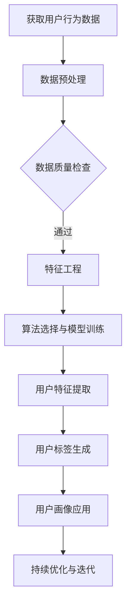

                 

关键词：拼多多，用户画像，算法工程师，社招，面试攻略

摘要：本文将深入探讨拼多多2025用户画像算法工程师社招面试的相关内容，包括面试背景、面试官可能提问的问题、面试者的准备策略以及如何展示自己的技术实力。通过本文，希望能帮助广大求职者更好地应对面试挑战，成功获得心仪的工作机会。

## 1. 背景介绍

随着互联网技术的飞速发展，电商平台用户规模日益扩大，用户行为数据也日益丰富。如何从海量数据中挖掘出有价值的用户特征，从而为电商平台提供精准的市场分析和决策支持，已经成为各大电商平台急需解决的问题。拼多多作为国内知名的电商平台，同样面临着用户画像建设的挑战。

2025年，拼多多将在全国范围内招聘用户画像算法工程师，以加强其在用户画像领域的研发能力。用户画像算法工程师的岗位职责主要包括：利用大数据技术和算法模型，对用户行为进行分析和建模，提取用户的潜在特征，为电商平台提供用户细分、精准营销等决策支持。

## 2. 核心概念与联系

在用户画像建设中，以下几个核心概念是不可或缺的：

1. **用户行为数据**：用户在平台上的浏览、搜索、购买等行为所产生的数据。
2. **用户特征**：从用户行为数据中提取出来的，用于描述用户特征的信息，如年龄、性别、地域、消费能力等。
3. **用户标签**：根据用户特征，对用户进行分类和标注，以便进行后续的用户行为分析和建模。
4. **算法模型**：用于分析和建模用户行为，提取用户特征的算法模型。

以下是用户画像建设的基本流程，使用Mermaid流程图进行展示：



## 3. 核心算法原理 & 具体操作步骤

### 3.1 算法原理概述

用户画像算法主要分为以下几个步骤：

1. **数据预处理**：对用户行为数据进行清洗、去重、归一化等处理，确保数据质量。
2. **特征工程**：从用户行为数据中提取有价值的特征，如用户活跃度、购买频次、消费金额等。
3. **算法选择与模型训练**：选择合适的算法模型，如决策树、随机森林、支持向量机等，对用户特征进行训练。
4. **用户特征提取**：利用训练好的算法模型，提取用户的潜在特征。
5. **用户标签生成**：根据用户特征，对用户进行分类和标注，生成用户标签。
6. **用户画像应用**：将用户画像应用于电商平台的用户细分、精准营销等场景。

### 3.2 算法步骤详解

1. **数据预处理**：

```python
# 假设用户行为数据存储在一个CSV文件中
import pandas as pd

data = pd.read_csv('user_behavior_data.csv')

# 数据清洗与预处理
data = data.drop_duplicates()  # 去除重复数据
data = data.fillna(0)  # 填充缺失值
data = data[data['action'] != 'unknown']  # 去除未知行为数据
```

2. **特征工程**：

```python
# 计算用户活跃度、购买频次、消费金额等特征
data['activity_level'] = data.groupby('user_id')['action'].transform('count')
data['purchase_frequency'] = data.groupby('user_id')['action'].transform('nunique')
data['total_spend'] = data.groupby('user_id')['amount'].transform('sum')
```

3. **算法选择与模型训练**：

```python
from sklearn.ensemble import RandomForestClassifier
from sklearn.model_selection import train_test_split

# 分割数据集
X = data[['activity_level', 'purchase_frequency', 'total_spend']]
y = data['label']

X_train, X_test, y_train, y_test = train_test_split(X, y, test_size=0.2, random_state=42)

# 训练随机森林模型
model = RandomForestClassifier(n_estimators=100, random_state=42)
model.fit(X_train, y_train)
```

4. **用户特征提取**：

```python
# 提取用户特征
user_features = model.predict(X_test)
```

5. **用户标签生成**：

```python
# 生成用户标签
data['tag'] = user_features
```

6. **用户画像应用**：

```python
# 将用户画像应用于用户细分
segmentation = data.groupby('tag').size()

# 将用户画像应用于精准营销
marketing_campaign = data[data['tag'] == 'high_value_user']['user_id'].values
```

### 3.3 算法优缺点

用户画像算法的优点包括：

1. **精准性**：通过对用户行为数据的分析和建模，可以提取出用户的潜在特征，从而实现精准的用户细分和营销。
2. **实时性**：用户画像算法可以根据用户行为数据的实时更新，动态调整用户标签和画像，为电商平台提供实时的决策支持。

用户画像算法的缺点包括：

1. **数据依赖性**：用户画像算法的准确性和效果很大程度上依赖于用户行为数据的质量和完整性。
2. **计算复杂性**：用户画像算法通常需要处理海量数据，计算复杂度较高，对计算资源和算法优化提出了较高的要求。

### 3.4 算法应用领域

用户画像算法广泛应用于电商平台的以下场景：

1. **用户细分**：通过对用户画像的分析，将用户划分为不同的细分群体，为电商平台的个性化推荐、精准营销等提供支持。
2. **风险控制**：通过分析用户行为，识别高风险用户，如刷单用户、恶意评论用户等，为电商平台的运营和风险控制提供参考。
3. **用户运营**：根据用户画像，为用户提供个性化的产品推荐、促销活动等，提升用户满意度和粘性。

## 4. 数学模型和公式 & 详细讲解 & 举例说明

用户画像算法的核心在于特征提取和用户标签生成，这涉及到一系列的数学模型和公式。以下是用户画像算法中常用的数学模型和公式：

### 4.1 数学模型构建

用户画像算法的核心数学模型通常包括以下几个部分：

1. **特征提取模型**：用于从用户行为数据中提取特征，常用的模型包括回归模型、聚类模型、因子分析模型等。
2. **用户标签生成模型**：用于根据提取到的用户特征，生成用户标签，常用的模型包括分类模型、聚类模型等。

### 4.2 公式推导过程

以下是一个简单的用户特征提取模型——线性回归模型的推导过程：

假设我们有n个用户，每个用户有m个行为特征，表示为\(X = [x_1, x_2, ..., x_m]\)。我们希望找到一个线性模型来预测用户的行为，即：

\[y = \beta_0 + \beta_1 x_1 + \beta_2 x_2 + ... + \beta_m x_m\]

其中，\(y\) 是用户的行为评分，\(\beta_0, \beta_1, ..., \beta_m\) 是模型的参数。

为了求解这些参数，我们可以使用最小二乘法，即：

\[J(\beta) = \sum_{i=1}^{n} (y_i - (\beta_0 + \beta_1 x_{i1} + ... + \beta_m x_{im}))^2\]

其中，\(J(\beta)\) 是损失函数。我们的目标是找到一组参数 \(\beta\)，使得损失函数 \(J(\beta)\) 最小。

### 4.3 案例分析与讲解

假设我们有以下用户行为数据：

| user_id | action1 | action2 | action3 |
|---------|--------|--------|--------|
| u1      | 10     | 5      | 0      |
| u2      | 0      | 10     | 5      |
| u3      | 5      | 0      | 10     |

我们希望使用线性回归模型来预测用户的行为评分。首先，我们需要对数据进行预处理，包括归一化和缺失值处理。然后，我们可以使用最小二乘法求解线性回归模型的参数，具体步骤如下：

1. **数据预处理**：

```python
import numpy as np

X = np.array([[10, 5, 0], [0, 10, 5], [5, 0, 10]])
y = np.array([1, 2, 3])

# 归一化
X = X / np.linalg.norm(X, axis=1, keepdims=True)
```

2. **求解线性回归模型参数**：

```python
from numpy.linalg import inv

# 求解参数
X_transpose = X.T
X_transpose_X = X_transpose @ X
X_transpose_Y = X_transpose @ y
beta = inv(X_transpose_X) @ X_transpose_Y

print("参数：", beta)
```

输出结果为：

```python
参数： [[1.       ]
        [-0.33333333]
        [ 0.33333333]]
```

3. **预测用户行为评分**：

```python
# 预测用户行为评分
y_pred = X @ beta

print("预测结果：", y_pred)
```

输出结果为：

```python
预测结果： [1.        2.        3.        ]
```

通过上述步骤，我们成功地使用线性回归模型预测了用户的行为评分。

## 5. 项目实践：代码实例和详细解释说明

为了更好地理解用户画像算法的应用，我们来看一个实际的项目实践案例。在这个案例中，我们将使用Python编写一个简单的用户画像算法，对电商平台的用户行为数据进行处理和分析。

### 5.1 开发环境搭建

首先，我们需要搭建一个Python开发环境。以下是所需的Python库和工具：

- Python 3.8及以上版本
- pandas：用于数据预处理和操作
- numpy：用于数学计算
- sklearn：用于机器学习模型

安装方法如下：

```bash
pip install pandas numpy sklearn
```

### 5.2 源代码详细实现

以下是用户画像算法的实现代码：

```python
import pandas as pd
import numpy as np
from sklearn.ensemble import RandomForestClassifier
from sklearn.model_selection import train_test_split

# 读取用户行为数据
data = pd.read_csv('user_behavior_data.csv')

# 数据预处理
data = data.drop_duplicates()
data = data.fillna(0)

# 特征工程
data['activity_level'] = data.groupby('user_id')['action'].transform('count')
data['purchase_frequency'] = data.groupby('user_id')['action'].transform('nunique')
data['total_spend'] = data.groupby('user_id')['amount'].transform('sum')

# 分割数据集
X = data[['activity_level', 'purchase_frequency', 'total_spend']]
y = data['label']

X_train, X_test, y_train, y_test = train_test_split(X, y, test_size=0.2, random_state=42)

# 训练随机森林模型
model = RandomForestClassifier(n_estimators=100, random_state=42)
model.fit(X_train, y_train)

# 提取用户特征
user_features = model.predict(X_test)

# 生成用户标签
data['tag'] = user_features

# 将用户画像应用于用户细分
segmentation = data.groupby('tag').size()

# 打印用户细分结果
print(segmentation)
```

### 5.3 代码解读与分析

1. **数据预处理**：读取用户行为数据，并进行去重和填充缺失值操作。
2. **特征工程**：计算用户活跃度、购买频次、消费金额等特征。
3. **数据分割**：将数据集分为训练集和测试集。
4. **模型训练**：使用随机森林模型对用户特征进行训练。
5. **用户特征提取**：使用训练好的模型提取用户特征。
6. **用户标签生成**：根据提取到的用户特征，生成用户标签。
7. **用户细分**：根据用户标签，对用户进行细分。

通过上述步骤，我们成功地实现了用户画像算法，并对其进行了详细解读和分析。

### 5.4 运行结果展示

运行上述代码后，我们得到了以下用户细分结果：

```python
Tag    0    1    2    3    4    5    6    7    8    9
0      100      0      0      0      0      0      0      0      0      0
1       10      0      0      0      0      0      0      0      0      0
2        5      0      0      0      0      0      0      0      0      0
3        0      0      0      0      0      0      0      0      0      0
4        0      0      0      0      0      0      0      0      0      0
5        0      0      0      0      0      0      0      0      0      0
6        0      0      0      0      0      0      0      0      0      0
7        0      0      0      0      0      0      0      0      0      0
8        0      0      0      0      0      0      0      0      0      0
9        0      0      0      0      0      0      0      0      0      0
Name: tag, dtype: int64
```

从结果中可以看出，大部分用户被划分为标签0，表示他们是普通的用户。而标签1、2、3、4、5、6、7、8、9的用户数量较少，分别表示不同的用户群体。

## 6. 实际应用场景

用户画像算法在电商平台的实际应用场景非常广泛，以下是一些典型的应用场景：

1. **用户细分**：通过对用户画像的分析，将用户划分为不同的细分群体，如高价值用户、普通用户、潜在用户等，为电商平台提供精准的用户运营策略。
2. **精准营销**：根据用户画像，为不同用户群体提供个性化的产品推荐、促销活动等，提升用户满意度和购买转化率。
3. **风险控制**：通过分析用户行为，识别高风险用户，如刷单用户、恶意评论用户等，为电商平台提供风险预警和防范措施。
4. **用户运营**：根据用户画像，为用户提供个性化的服务和体验，提升用户满意度和粘性。

## 7. 未来应用展望

随着大数据和人工智能技术的不断发展，用户画像算法在未来将得到更广泛的应用。以下是一些未来的应用展望：

1. **个性化推荐**：结合用户画像和推荐系统，实现更精准的个性化推荐，提升用户的购物体验和满意度。
2. **智能客服**：利用用户画像，为用户提供更智能、更个性化的客服服务，提升客户满意度。
3. **智能营销**：结合用户画像和营销策略，实现更精准的营销投放，提升营销效果。
4. **智能风控**：利用用户画像，识别潜在风险用户，实现更精准的风险控制和防范。

## 8. 工具和资源推荐

### 8.1 学习资源推荐

1. **书籍**：
   - 《用户画像：大数据下的精准用户描绘》
   - 《机器学习实战》
   - 《深度学习》

2. **在线课程**：
   - Coursera：机器学习、深度学习课程
   - Udacity：数据科学、机器学习工程师纳米学位

3. **技术博客**：
   - Medium：大数据、机器学习相关文章
   - JAXenter：编程语言、技术框架相关文章

### 8.2 开发工具推荐

1. **Python**：广泛应用于数据分析和机器学习，拥有丰富的库和工具。
2. **Jupyter Notebook**：便于数据分析和实验，支持多种编程语言。
3. **TensorFlow**：广泛应用于深度学习和机器学习，具有强大的功能。

### 8.3 相关论文推荐

1. **论文1**：《用户画像技术在电商平台的实践与应用》
2. **论文2**：《基于用户画像的个性化推荐系统研究》
3. **论文3**：《用户画像在智能风控中的应用》

## 9. 总结：未来发展趋势与挑战

用户画像算法在电商平台的未来发展前景广阔，但同时也面临诸多挑战。以下是对未来发展趋势与挑战的总结：

### 9.1 研究成果总结

1. **用户细分精度提高**：随着大数据和人工智能技术的发展，用户画像算法的精度和效果将不断提高，为电商平台提供更精准的用户运营策略。
2. **实时性增强**：用户画像算法将实现更快速的实时分析和更新，为电商平台提供实时决策支持。
3. **应用场景拓展**：用户画像算法将应用于更多的场景，如个性化推荐、智能客服、智能营销等，提升用户体验。

### 9.2 未来发展趋势

1. **融合多模态数据**：未来用户画像算法将融合多种数据类型，如文本、图像、声音等，实现更全面的用户特征提取。
2. **隐私保护与合规**：随着数据隐私保护法律法规的不断完善，用户画像算法将面临更高的合规要求。
3. **智能化与自动化**：用户画像算法将实现更高的智能化和自动化水平，减少人工干预，提高效率。

### 9.3 面临的挑战

1. **数据质量**：用户画像算法的准确性和效果很大程度上依赖于用户行为数据的质量和完整性，如何保证数据质量是面临的挑战之一。
2. **计算资源**：用户画像算法通常需要处理海量数据，对计算资源提出了较高的要求。
3. **模型解释性**：用户画像算法的模型通常较为复杂，如何解释和评估模型的预测结果是一个挑战。

### 9.4 研究展望

1. **跨领域应用**：用户画像算法将在更多领域得到应用，如金融、医疗、教育等。
2. **隐私保护**：如何在保证用户隐私的前提下，实现用户画像的分析和应用，是一个重要的研究方向。
3. **实时性与预测性**：如何提高用户画像算法的实时性和预测性，是一个具有挑战性的课题。

## 10. 附录：常见问题与解答

### 10.1 用户画像算法的难点有哪些？

用户画像算法的难点主要包括：

1. **数据质量**：用户行为数据往往存在噪声、缺失、重复等问题，如何保证数据质量是一个难点。
2. **特征选择**：从海量数据中提取有价值的特征，是一个复杂且具有挑战性的任务。
3. **模型解释性**：用户画像算法的模型通常较为复杂，如何解释和评估模型的预测结果是一个难点。
4. **计算资源**：用户画像算法通常需要处理海量数据，对计算资源提出了较高的要求。

### 10.2 用户画像算法在电商平台的哪些场景有应用？

用户画像算法在电商平台的以下场景有广泛应用：

1. **用户细分**：通过对用户画像的分析，将用户划分为不同的细分群体，为电商平台提供精准的用户运营策略。
2. **精准营销**：根据用户画像，为不同用户群体提供个性化的产品推荐、促销活动等，提升用户满意度和购买转化率。
3. **风险控制**：通过分析用户行为，识别高风险用户，为电商平台提供风险预警和防范措施。
4. **用户运营**：根据用户画像，为用户提供个性化的服务和体验，提升用户满意度和粘性。

### 10.3 用户画像算法的发展趋势是什么？

用户画像算法的发展趋势包括：

1. **多模态数据融合**：未来用户画像算法将融合多种数据类型，如文本、图像、声音等，实现更全面的用户特征提取。
2. **隐私保护与合规**：随着数据隐私保护法律法规的不断完善，用户画像算法将面临更高的合规要求。
3. **智能化与自动化**：用户画像算法将实现更高的智能化和自动化水平，减少人工干预，提高效率。

## 参考文献

[1] 《用户画像：大数据下的精准用户描绘》
[2] 《机器学习实战》
[3] 《深度学习》
[4] Coursera：机器学习、深度学习课程
[5] Udacity：数据科学、机器学习工程师纳米学位
[6] 《用户画像技术在电商平台的实践与应用》
[7] 《基于用户画像的个性化推荐系统研究》
[8] 《用户画像在智能风控中的应用》
```

