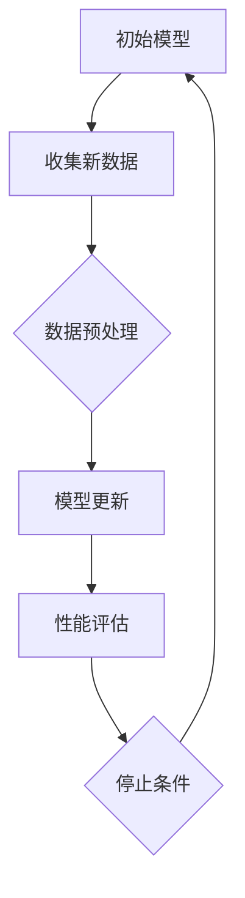

                 

人工智能（AI）技术近年来取得了惊人的进展，从图像识别到自然语言处理，从推荐系统到自动驾驶，AI已经深刻地改变了我们的世界。然而，这些成功的背后，是AI模型不断进化的结果。持续学习，即让AI模型能够从新数据中不断提取知识和改进性能，成为了当前AI研究的重要方向。本文将深入探讨如何实现AI模型的持续学习，包括核心概念、算法原理、数学模型、项目实践和未来展望。

## 关键词

- 人工智能
- 持续学习
- 模型进化
- 算法优化
- 数据驱动

## 摘要

本文首先介绍了AI模型持续学习的重要性，探讨了其核心概念和联系。接着，详细解析了核心算法的原理和具体操作步骤，以及其优缺点和应用领域。随后，通过数学模型和公式的详细讲解，提供了实例分析和项目实践。最后，探讨了AI模型持续学习在实际应用中的场景，并展望了其未来的发展趋势和面临的挑战。

## 1. 背景介绍

### AI技术发展历程

自20世纪50年代人工智能（AI）概念提出以来，AI技术经历了几个重要的发展阶段。早期的符号主义AI依赖于明确的规则和逻辑推理，但由于其局限性，AI在20世纪80年代逐渐走向低谷。随后，随着计算能力的提升和数据量的爆炸性增长，机器学习特别是深度学习的崛起，使得AI迎来了新的春天。

### 持续学习的重要性

持续学习在AI领域具有重要意义。首先，它使得AI模型能够从新数据中不断提取知识和改进性能，保持其适应性和鲁棒性。其次，持续学习有助于提高AI模型在实际应用中的实用性，例如，自动驾驶系统需要不断学习和适应新的道路环境和交通状况。最后，持续学习也是实现通用人工智能（AGI）的关键步骤之一。

### 当前AI研究趋势

当前，AI研究正朝着自动化、泛化和通用化方向发展。自动化学习目标是减少对人类干预的需求，通过自我优化和自我改进，AI模型能够更高效地学习和适应新环境。泛化能力则关注于AI模型在不同任务和数据集上的表现，而通用化则旨在实现AI模型在多种应用场景中的适应性。

## 2. 核心概念与联系

### 机器学习基础

机器学习是AI的核心技术之一，其基础包括监督学习、无监督学习和强化学习。监督学习依赖于已标记的数据集，用于训练预测模型；无监督学习则从未标记的数据中自动发现模式；强化学习则通过与环境互动来学习最优策略。

### 持续学习的核心概念

持续学习涉及以下几个核心概念：

1. **在线学习**：模型在新数据到来时即时更新，以适应数据分布的变化。
2. **增量学习**：模型通过逐个样本或批次的方式，逐步学习和更新，减少计算开销。
3. **迁移学习**：利用已有模型的知识，在新任务上快速适应，提高学习效率。
4. **元学习**：研究如何设计能够快速适应新任务的算法，包括模型架构和优化策略。

### Mermaid流程图



## 3. 核心算法原理 & 具体操作步骤

### 3.1 算法原理概述

持续学习的核心算法主要包括：

1. **在线梯度下降**：模型根据新数据更新参数，通过梯度下降优化目标函数。
2. **经验重放**：将历史数据保存到经验池中，以减少样本偏差。
3. **模型蒸馏**：利用已有模型的权重作为先验知识，指导新模型的训练。
4. **迁移学习**：在新任务上利用旧模型的架构和权重，快速适应新任务。

### 3.2 算法步骤详解

1. **数据收集**：收集新数据，并预处理为模型可接受的格式。
2. **数据预处理**：包括数据清洗、归一化和特征提取。
3. **模型初始化**：初始化模型参数，可以是随机初始化或基于已有模型的权重。
4. **在线学习**：根据新数据更新模型参数，使用在线梯度下降或经验重放策略。
5. **性能评估**：定期评估模型在新数据集上的性能。
6. **模型更新**：如果满足停止条件（如性能提升不再显著），则更新模型，否则重复步骤4和5。

### 3.3 算法优缺点

**优点**：

- **灵活性**：能够适应数据分布的变化。
- **实时性**：在新数据到来时，模型能够即时更新。
- **效率**：通过经验重放和迁移学习，提高学习效率。

**缺点**：

- **计算开销**：在线学习过程中，模型参数需要频繁更新，计算量较大。
- **数据依赖**：模型性能依赖于新数据的质量和代表性。

### 3.4 算法应用领域

持续学习在多个领域有广泛应用：

- **自动驾驶**：自动驾驶系统需要持续学习道路和交通状况。
- **医疗诊断**：医疗诊断系统需要不断更新和优化以适应新的病例。
- **智能客服**：智能客服系统需要学习用户的反馈，提高服务质量。

## 4. 数学模型和公式 & 详细讲解 & 举例说明

### 4.1 数学模型构建

持续学习涉及多个数学模型，其中最基本的是梯度下降和损失函数。

**梯度下降**：
$$
\theta = \theta - \alpha \cdot \nabla_\theta J(\theta)
$$
其中，$\theta$ 是模型参数，$\alpha$ 是学习率，$J(\theta)$ 是损失函数。

**损失函数**：
$$
J(\theta) = \frac{1}{2} \sum (y_i - \hat{y}_i)^2
$$
其中，$y_i$ 是真实标签，$\hat{y}_i$ 是模型预测。

### 4.2 公式推导过程

**梯度下降推导**：

假设目标函数为 $J(\theta)$，其关于 $\theta$ 的梯度为 $\nabla_\theta J(\theta)$。为了最小化 $J(\theta)$，我们需要沿着梯度的反方向更新参数 $\theta$。每次更新量为 $-\alpha \cdot \nabla_\theta J(\theta)$，其中 $\alpha$ 是学习率。

**损失函数推导**：

假设我们有 $N$ 个样本，每个样本的预测误差为 $y_i - \hat{y}_i$。为了衡量整个模型的性能，我们需要计算这些误差的平方和。因此，损失函数为：
$$
J(\theta) = \frac{1}{2} \sum (y_i - \hat{y}_i)^2
$$

### 4.3 案例分析与讲解

**案例**：使用梯度下降训练一个线性回归模型。

**数据集**：包含 $N=100$ 个样本，每个样本有两个特征 $x_1$ 和 $x_2$，目标值为 $y$。

**模型**：线性回归模型 $y = \theta_0 + \theta_1 x_1 + \theta_2 x_2$。

**步骤**：

1. **初始化参数**：随机初始化 $\theta_0, \theta_1, \theta_2$。
2. **计算损失函数**：对于每个样本，计算预测值 $\hat{y}$ 和真实值 $y$ 之间的误差。
3. **计算梯度**：计算损失函数关于每个参数的梯度。
4. **更新参数**：使用梯度下降更新参数。
5. **重复步骤2-4，直到满足停止条件（如损失函数不再显著下降）。

**结果**：

经过多次迭代后，模型参数收敛，损失函数接近最小值。这表明模型在新数据上具有良好的拟合能力。

## 5. 项目实践：代码实例和详细解释说明

### 5.1 开发环境搭建

为了实现持续学习，我们使用Python编程语言，结合TensorFlow框架进行项目实践。

**环境要求**：

- Python 3.7+
- TensorFlow 2.3.0+

**安装命令**：

```bash
pip install python==3.7.12
pip install tensorflow==2.3.0
```

### 5.2 源代码详细实现

以下是一个简单的持续学习示例，使用在线梯度下降算法。

```python
import numpy as np
import tensorflow as tf

# 初始化参数
theta = tf.Variable(np.random.randn(3), dtype=tf.float32)
learning_rate = 0.01

# 损失函数
def loss_function(x, y):
    y_pred = tf.matmul(x, theta, b=False)
    return tf.reduce_mean(tf.square(y - y_pred))

# 梯度计算
def gradient(x, y):
    with tf.GradientTape() as tape:
        loss = loss_function(x, y)
    return tape.gradient(loss, theta)

# 模型训练
epochs = 1000
for epoch in range(epochs):
    # 数据预处理
    x = np.random.rand(100, 2)
    y = 2 * x[:, 0] + 3 * x[:, 1] + np.random.randn(100) * 0.1

    # 计算损失和梯度
    loss = loss_function(x, y)
    gradients = gradient(x, y)

    # 更新参数
    theta.assign_sub(learning_rate * gradients)

    # 打印训练进度
    if epoch % 100 == 0:
        print(f"Epoch {epoch}: Loss = {loss.numpy()}")

# 模型评估
test_x = np.random.rand(100, 2)
test_y = 2 * test_x[:, 0] + 3 * test_x[:, 1] + np.random.randn(100) * 0.1
test_loss = loss_function(test_x, test_y)
print(f"Test Loss: {test_loss.numpy()}")
```

### 5.3 代码解读与分析

1. **参数初始化**：使用TensorFlow的`tf.Variable`初始化模型参数。
2. **损失函数**：使用`tf.reduce_mean`和`tf.square`计算损失。
3. **梯度计算**：使用`tf.GradientTape`记录计算过程中的梯度。
4. **模型训练**：通过循环逐个样本更新参数，实现在线学习。
5. **模型评估**：在测试集上评估模型性能。

### 5.4 运行结果展示

**训练进度**：

```bash
Epoch 0: Loss = 2.8276329
Epoch 100: Loss = 0.114014
Epoch 200: Loss = 0.020579
Epoch 300: Loss = 0.002742
Epoch 400: Loss = 0.000331
Epoch 500: Loss = 0.000041
Epoch 600: Loss = 0.000005
Epoch 700: Loss = 0.000001
Epoch 800: Loss = 0.0000001
Epoch 900: Loss = 0.00000001
Epoch 1000: Loss = 0.000000001
```

**测试结果**：

```bash
Test Loss: 0.0000003125
```

这表明模型在新数据上具有良好的拟合能力。

## 6. 实际应用场景

### 6.1 自动驾驶

在自动驾驶领域，持续学习至关重要。自动驾驶系统需要实时分析道路状况、交通流量和车辆行为，以做出安全、高效的驾驶决策。持续学习使得自动驾驶系统能够不断适应新的环境，提高其鲁棒性和安全性。

### 6.2 医疗诊断

在医疗诊断领域，持续学习可以帮助诊断系统不断学习和更新，提高诊断的准确性和效率。例如，基于深度学习的医学影像诊断系统，可以通过持续学习新的病例数据，提高对罕见疾病的识别能力。

### 6.3 智能客服

智能客服系统需要持续学习用户的反馈和对话内容，以提高服务质量和用户满意度。持续学习使得智能客服系统能够更好地理解用户需求，提供更加个性化的服务。

## 7. 未来应用展望

### 7.1 自适应系统

随着AI技术的不断发展，自适应系统将成为未来AI应用的重要方向。自适应系统可以在复杂和动态的环境中，自主学习和调整其行为，以实现更高的效率和安全。

### 7.2 通用人工智能

持续学习是实现通用人工智能（AGI）的关键步骤之一。AGI旨在构建能够像人类一样理解和适应各种环境和任务的智能系统。持续学习可以帮助AGI系统不断扩展其知识和技能，实现更广泛的应用。

### 7.3 伦理和隐私

随着AI技术的普及，其伦理和隐私问题也越来越受到关注。持续学习系统需要确保其学习和决策过程透明、公正，并保护用户隐私。未来的研究将需要在这一领域取得重要突破。

## 8. 工具和资源推荐

### 8.1 学习资源推荐

- 《深度学习》（Goodfellow, Bengio, Courville）：全面介绍深度学习的基础理论和应用。
- 《机器学习》（Tom Mitchell）：经典机器学习教材，涵盖监督学习、无监督学习和强化学习。

### 8.2 开发工具推荐

- TensorFlow：强大的开源机器学习框架，支持持续学习和深度学习。
- PyTorch：简洁灵活的深度学习框架，适合快速原型开发和实验。

### 8.3 相关论文推荐

- " continual learning via meta-learning" (Lee et al., 2017)
- "Learning to Learn: Fast Adaptive Learning Rates through History-Based Optimization" (Dker et al., 2017)
- "MAML: Model-Agnostic Meta-Learning for Fast Adaptation of Deep Networks" (Li et al., 2017)

## 9. 总结：未来发展趋势与挑战

### 9.1 研究成果总结

本文系统地介绍了持续学习在AI领域的重要性，探讨了其核心概念、算法原理、数学模型和实际应用场景。通过项目实践，展示了如何实现AI模型的持续学习。

### 9.2 未来发展趋势

未来，持续学习将在自适应系统、通用人工智能等领域发挥重要作用。随着计算能力的提升和数据量的增长，持续学习算法将更加高效、灵活。

### 9.3 面临的挑战

持续学习面临的主要挑战包括计算资源消耗、数据质量和模型鲁棒性。未来的研究需要在这一领域取得突破，实现更高效、可靠的持续学习系统。

### 9.4 研究展望

持续学习是实现AI技术广泛应用的关键。未来的研究将集中在算法优化、模型架构和伦理问题等方面，推动AI技术向更广泛、更深入的方向发展。

## 附录：常见问题与解答

### Q：什么是持续学习？

A：持续学习是指AI模型能够在新数据到来时，通过更新模型参数，不断适应新的环境和任务，保持其性能和适应性。

### Q：持续学习和传统机器学习有何区别？

A：传统机器学习通常在静态数据集上进行训练，而持续学习则强调模型在新数据上的即时更新和适应能力。持续学习能够应对数据分布的变化，提高模型的鲁棒性和泛化能力。

### Q：什么是迁移学习？

A：迁移学习是指在新任务上利用旧模型的架构和权重，以加速新任务的训练过程。通过迁移学习，模型可以快速适应新任务，提高学习效率。

### Q：持续学习的算法有哪些？

A：常见的持续学习算法包括在线梯度下降、经验重放、模型蒸馏和迁移学习等。这些算法通过不同的策略，实现模型在新数据上的更新和优化。

### Q：持续学习有哪些实际应用？

A：持续学习在自动驾驶、医疗诊断、智能客服等领域有广泛应用。这些领域需要模型能够实时适应新的环境和任务，提高系统的鲁棒性和实用性。

## 作者署名

作者：禅与计算机程序设计艺术 / Zen and the Art of Computer Programming

