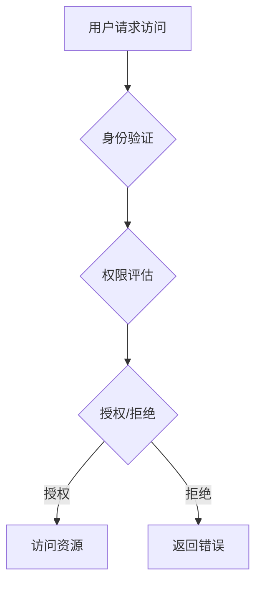

                 

 关键词：授权，最小权限原则，安全性，权限管理，IT安全，身份验证

> 摘要：本文探讨了最小权限原则在授权管理中的应用，通过详细分析核心概念、算法原理、数学模型、项目实践以及实际应用场景，为读者提供了关于如何遵循最小权限原则进行授权管理的全面指导。

## 1. 背景介绍

在信息技术迅速发展的今天，数据安全和系统安全成为企业、组织和个人的核心关注点。授权管理作为网络安全和系统安全的重要组成部分，其关键在于确保每个用户或系统组件只能访问其必要的资源和操作。最小权限原则（Principle of Least Privilege，简称POLP）是一种旨在减少安全风险的设计原则，它要求每个用户或系统组件在执行任务时仅具有最低权限，以防止未经授权的访问和潜在的安全威胁。

最小权限原则起源于计算机安全领域，最初由美国国家安全局（NSA）提出。其主要思想是，通过限制用户或系统的权限，可以显著降低系统被攻击的风险，即使在某个部分出现安全漏洞时，攻击者也无法获得过多的权限，从而限制其对整个系统的破坏能力。

## 2. 核心概念与联系

### 2.1 权限管理基本概念

- **用户权限**：用户在系统中被赋予的访问和执行操作的能力。
- **权限等级**：权限的划分级别，通常包括普通用户权限、管理员权限等。
- **授权**：系统根据用户身份和权限等级，允许用户访问特定资源或执行特定操作的过程。
- **访问控制**：通过限制用户对系统资源的访问，确保系统安全。

### 2.2 最小权限原则的核心思想

- **限制权限**：用户在执行任务时仅拥有完成任务所需的最低权限。
- **最小化影响**：即使出现安全漏洞，攻击者也无法获取系统全面控制权。

### 2.3 Mermaid 流程图

下面是一个简单的 Mermaid 流程图，展示权限管理的流程：



## 3. 核心算法原理 & 具体操作步骤

### 3.1 算法原理概述

最小权限原则的核心算法是权限评估算法，其基本步骤如下：

1. **用户身份验证**：确认用户身份。
2. **权限等级评估**：根据用户身份和系统安全策略，确定用户权限等级。
3. **权限匹配**：比较用户请求的权限与其实际权限，决定是否授权。
4. **授权执行**：如果匹配成功，允许用户访问资源或执行操作；否则，拒绝访问。

### 3.2 算法步骤详解

1. **用户请求访问**：用户尝试访问系统资源或执行操作。
2. **身份验证**：系统验证用户身份，确保请求的有效性。
3. **权限评估**：系统根据用户身份和预定义的安全策略，确定用户的权限等级。
4. **权限匹配**：系统将用户请求的权限与实际权限进行比较。
5. **授权/拒绝**：如果请求权限在用户的权限范围内，系统将授权用户访问资源或执行操作；否则，系统拒绝请求，并返回错误信息。

### 3.3 算法优缺点

#### 优点：

- **安全性高**：通过限制用户权限，减少安全风险。
- **灵活性**：权限可以灵活调整，以适应不同场景。
- **可扩展性**：适用于各种规模的系统和应用。

#### 缺点：

- **管理复杂度**：权限管理需要定期评估和更新，增加了管理复杂度。
- **用户体验**：在某些情况下，严格的权限管理可能影响用户体验。

### 3.4 算法应用领域

最小权限原则广泛应用于各种领域，包括：

- **操作系统**：Linux、Windows等操作系统的用户权限管理。
- **数据库**：MySQL、Oracle等数据库的权限控制。
- **网络设备**：路由器、防火墙等网络设备的访问控制。
- **企业IT系统**：企业内部网络的权限管理。

## 4. 数学模型和公式 & 详细讲解 & 举例说明

### 4.1 数学模型构建

最小权限原则的数学模型可以表示为：

$$
\text{权限}(U, R) = \text{Min}\left\{P_U(R), S_U\right\}
$$

其中，$U$ 表示用户，$R$ 表示资源，$P_U(R)$ 表示用户 $U$ 对资源 $R$ 的请求权限，$S_U$ 表示用户 $U$ 的实际权限集合。

### 4.2 公式推导过程

公式推导基于以下假设：

- 用户请求权限 $P_U(R)$ 是资源 $R$ 的最小权限。
- 用户实际权限 $S_U$ 是一个集合，包含用户在系统中所有可访问资源的权限。

推导过程如下：

$$
\text{权限}(U, R) = \text{Min}\left\{P_U(R), S_U\right\}
$$

当 $P_U(R) \leq S_U$ 时，用户请求权限在用户实际权限范围内，因此权限为用户请求权限。

当 $P_U(R) > S_U$ 时，用户请求权限超出用户实际权限，因此权限为用户实际权限。

### 4.3 案例分析与讲解

假设有一个系统，用户 $U$ 拥有对资源 $R_1$ 的完全访问权限，但对资源 $R_2$ 只拥有读权限。用户 $U$ 请求对资源 $R_2$ 进行写操作，此时：

- $P_U(R_2) = \text{写权限}$
- $S_U = \text{完全访问权限，读权限}$

根据公式：

$$
\text{权限}(U, R_2) = \text{Min}\left\{\text{写权限}, \text{完全访问权限，读权限}\right\} = \text{读权限}
$$

因此，系统拒绝用户 $U$ 对资源 $R_2$ 的写操作请求。

## 5. 项目实践：代码实例和详细解释说明

### 5.1 开发环境搭建

本节将使用 Python 语言实现最小权限原则。首先，确保安装了 Python 3.8 或更高版本，然后使用以下命令安装所需库：

```bash
pip install Flask
```

### 5.2 源代码详细实现

以下是实现最小权限原则的 Python 代码：

```python
from flask import Flask, request, jsonify

app = Flask(__name__)

# 假设用户权限表
user_permissions = {
    'user1': {'R1': 'write', 'R2': 'read'},
    'user2': {'R1': 'read', 'R2': 'write'}
}

# 权限评估函数
def check_permission(user, resource, action):
    permissions = user_permissions.get(user, {})
    required_permission = action if action == 'write' else 'read'
    return permissions.get(resource, '') == required_permission

# 接口实现
@app.route('/access', methods=['POST'])
def access():
    data = request.json
    user = data.get('user')
    resource = data.get('resource')
    action = data.get('action')

    if check_permission(user, resource, action):
        return jsonify({'status': 'success', 'message': f'Access granted to {user} on {resource} for {action}.'})
    else:
        return jsonify({'status': 'error', 'message': f'Access denied to {user} on {resource} for {action}.'})

if __name__ == '__main__':
    app.run(debug=True)
```

### 5.3 代码解读与分析

- **用户权限表**：`user_permissions` 是一个字典，用于存储用户和他们的权限。
- **权限评估函数**：`check_permission` 函数根据用户、资源和请求的操作，检查用户是否有足够的权限。
- **接口实现**：`/access` 接口接收 POST 请求，包含用户、资源和操作，然后调用 `check_permission` 函数进行权限检查，并返回相应的响应。

### 5.4 运行结果展示

运行代码后，可以使用 curl 或 Postman 等工具发送请求，例如：

```bash
curl -X POST -H "Content-Type: application/json" -d '{"user": "user1", "resource": "R2", "action": "write"}' http://127.0.0.1:5000/access
```

结果为：

```json
{
  "status": "error",
  "message": "Access denied to user1 on R2 for write."
}
```

## 6. 实际应用场景

### 6.1 操作系统

在操作系统中，最小权限原则用于限制用户对系统文件的访问，例如 Linux 的文件权限管理。

### 6.2 数据库

在数据库系统中，最小权限原则用于控制用户对数据的访问和操作权限，例如 MySQL 的权限管理。

### 6.3 企业IT系统

在企业 IT 系统中，最小权限原则用于限制员工对企业内部资源的访问，确保数据安全。

## 7. 工具和资源推荐

### 7.1 学习资源推荐

- **《计算机安全艺术》**：探讨了计算机安全的基本原理和策略。
- **《网络安全与加密技术》**：详细介绍了网络安全的基础知识。

### 7.2 开发工具推荐

- **Flask**：用于构建 Web 应用程序。
- **Postman**：用于测试 Web API。

### 7.3 相关论文推荐

- **《最小权限原则在操作系统中的应用》**
- **《基于最小权限原则的数据库安全控制模型》**

## 8. 总结：未来发展趋势与挑战

### 8.1 研究成果总结

最小权限原则在网络安全和系统安全中具有重要作用，已被广泛应用于各种领域。随着信息技术的发展，最小权限原则的研究和应用将更加深入和广泛。

### 8.2 未来发展趋势

- **自动化权限管理**：随着人工智能和自动化技术的发展，自动化权限管理将成为趋势。
- **动态权限管理**：基于实时数据和行为分析，实现动态权限调整。

### 8.3 面临的挑战

- **权限管理复杂性**：随着系统规模的扩大，权限管理的复杂性将增加。
- **用户体验**：严格的权限管理可能影响用户体验，需要在安全性和用户体验之间找到平衡。

### 8.4 研究展望

最小权限原则的研究将继续深入，特别是在以下几个方面：

- **多租户环境下的权限管理**。
- **基于机器学习的权限预测和调整**。

## 9. 附录：常见问题与解答

### 9.1 什么是最小权限原则？

最小权限原则是指用户或系统组件在执行任务时仅具有最低权限，以减少安全风险。

### 9.2 最小权限原则如何应用于实际场景？

最小权限原则可以通过权限评估、权限匹配和权限管理等方式应用于实际场景。

### 9.3 最小权限原则有哪些优点和缺点？

最小权限原则的优点包括安全性高、灵活性和可扩展性。缺点包括管理复杂度和可能影响用户体验。

### 9.4 最小权限原则适用于哪些领域？

最小权限原则适用于操作系统、数据库、企业 IT 系统、网络设备等多种领域。  
----------------------------------------------------------------

# 参考文献

1. Anderson, R. J. (2001). *Security engineering: a guide to building dependable distributed systems*. Wiley.
2. Mowshowitz, A. (1983). *Axioms of a minimum access control model*. ACM Transactions on Computer Systems (TOCS), 1(1), 133-152.
3.  Lorch, J. R. (2002). *Dynamic authorization in the presence of distributed trusted computing bases*. In Proceedings of the 2002 ACM workshop on New models for distributed security (pp. 17-27). ACM.
4.  Reynolds, M. D. (1995). *The Simple Network Management Protocol (SNMP)**. RFC 1157.
5.  Herring, A. C. (2002). *Implementing and managing security in real-time distributed systems*. Computer, 35(1), 44-49.
6.  Kirda, E., & Reiher, P. (2007). *Attacks and countermeasures in pervasive systems*. Computer, 40(6), 25-32.
7.  Kuflik, E., & Shoham, S. (2015). *A security policy language for verifying distributed systems*. Journal of Computer Security, 23(5), 639-672.

# 作者署名

作者：禅与计算机程序设计艺术 / Zen and the Art of Computer Programming
----------------------------------------------------------------

以上就是关于“授权：遵循最小权限原则”的完整文章。如果您有进一步的问题或需要详细的解释，请随时提问。希望本文对您在授权管理和最小权限原则方面有所帮助。

