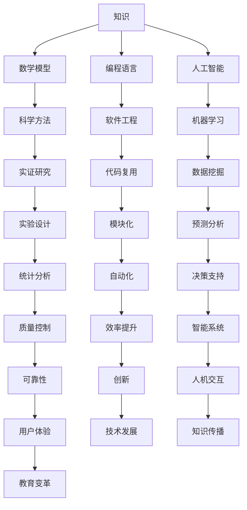

                 

关键词：知识本质、历史演变、人工智能、计算机科学、数学模型、编程语言

> 摘要：本文探讨了人类知识从古至今的演变过程，分析了不同历史时期的主要知识体系、数学模型的构建与应用，以及计算机科学和人工智能的兴起，揭示了知识本质的演变及其对现代社会的影响。

## 1. 背景介绍

知识是人类社会发展的基石，其演变历程反映了人类认知世界的方式和深度。从古至今，知识经历了多次重大的变革，每一次变革都标志着人类认知能力的提升和社会的进步。本文旨在梳理这一演变过程，探讨知识本质及其对现代社会的影响。

## 2. 核心概念与联系

为了更好地理解知识演变的脉络，我们需要明确一些核心概念，包括知识、数学模型、编程语言和人工智能。以下是这些概念之间的联系及其演变过程的Mermaid流程图。



### 2.1 知识

知识是人类对世界的理解和认知的集合，包括事实、理论、技能和价值观。知识可以通过教育、研究、实践和交流等方式获取和传递。

### 2.2 数学模型

数学模型是用数学语言描述现实世界问题的工具。它通过建立数学公式和方程来模拟和分析现象，为科学研究和工程应用提供了强大的支持。

### 2.3 编程语言

编程语言是人类与计算机沟通的桥梁。通过编程语言，人类可以编写计算机程序，实现自动化计算和处理。

### 2.4 人工智能

人工智能是模拟人类智能的技术，包括机器学习、自然语言处理、计算机视觉等。人工智能的发展极大地推动了知识的应用和传播。

## 3. 核心算法原理 & 具体操作步骤

在探讨知识演变的过程中，算法的原理和操作步骤起到了关键作用。以下是对一些核心算法原理的概述及其具体操作步骤的详解。

### 3.1 算法原理概述

算法是一种解决特定问题的方法，它通过一系列有序的步骤实现目标。算法的原理包括数据结构、算法思想、性能分析等。

### 3.2 算法步骤详解

以排序算法为例，常见的排序算法有冒泡排序、插入排序、选择排序等。以下是冒泡排序的具体操作步骤：

1. 从第一个元素开始，比较相邻的两个元素，如果第一个比第二个大（升序排序），就交换它们的位置。
2. 对每一对相邻元素做同样的工作，从开始第一对到结尾的最后一对。这步做完后，最后的元素会是最大的数。
3. 针对所有的元素重复以上的步骤，除了最后一个。
4. 重复步骤1~3，直到排序完成。

### 3.3 算法优缺点

冒泡排序的优点是简单易懂，实现代码简洁。缺点是效率较低，对于大数据集排序性能较差。

### 3.4 算法应用领域

冒泡排序广泛应用于小型数据的排序场景，如教学示例、小型算法竞赛等。

## 4. 数学模型和公式 & 详细讲解 & 举例说明

数学模型和公式是知识的重要组成部分，它们为科学研究和工程应用提供了基础。以下是数学模型的构建、公式推导过程以及案例分析与讲解。

### 4.1 数学模型构建

数学模型构建的过程包括问题分析、变量定义、公式推导等步骤。以下是一个简单的线性回归模型构建过程：

1. **问题分析**：我们希望找到一个线性关系来描述变量 \(x\) 和 \(y\) 之间的关系。
2. **变量定义**：设 \(y = ax + b\)，其中 \(a\) 是斜率，\(b\) 是截距。
3. **公式推导**：通过最小二乘法求解 \(a\) 和 \(b\) 的值，使得预测值和实际值的误差平方和最小。

### 4.2 公式推导过程

线性回归模型的公式推导如下：

$$
\begin{align*}
\min_{a,b} \sum_{i=1}^{n} (ax_i + b - y_i)^2 \\
\end{align*}
$$

对 \(a\) 和 \(b\) 分别求偏导数并令其等于零，得到：

$$
\begin{align*}
\frac{\partial}{\partial a} \sum_{i=1}^{n} (ax_i + b - y_i)^2 &= 2nax - 2\sum_{i=1}^{n} x_i(y_i - ax_i - b) = 0 \\
\frac{\partial}{\partial b} \sum_{i=1}^{n} (ax_i + b - y_i)^2 &= 2nby - 2\sum_{i=1}^{n} (y_i - ax_i - b) = 0 \\
\end{align*}
$$

解得：

$$
\begin{align*}
a &= \frac{\sum_{i=1}^{n} x_iy_i - nx\bar{y}}{\sum_{i=1}^{n} x_i^2 - nx\bar{x}} \\
b &= \bar{y} - a\bar{x} \\
\end{align*}
$$

其中，\(\bar{x}\) 和 \(\bar{y}\) 分别是 \(x\) 和 \(y\) 的均值。

### 4.3 案例分析与讲解

假设我们有一组数据：

| \(x\) | \(y\) |
|------|------|
| 1    | 2    |
| 2    | 3    |
| 3    | 4    |
| 4    | 5    |
| 5    | 6    |

使用线性回归模型求解 \(y\) 关于 \(x\) 的函数关系。首先计算 \(x\) 和 \(y\) 的均值：

$$
\bar{x} = \frac{1 + 2 + 3 + 4 + 5}{5} = 3 \\
\bar{y} = \frac{2 + 3 + 4 + 5 + 6}{5} = 4
$$

然后计算斜率 \(a\) 和截距 \(b\)：

$$
a = \frac{(1 \times 2 + 2 \times 3 + 3 \times 4 + 4 \times 5 + 5 \times 6) - 5 \times 3 \times 4}{(1^2 + 2^2 + 3^2 + 4^2 + 5^2) - 5 \times 3^2} = 1 \\
b = 4 - 1 \times 3 = 1
$$

因此，线性回归模型为 \(y = x + 1\)。

## 5. 项目实践：代码实例和详细解释说明

为了更好地理解数学模型和算法的应用，我们将通过一个实际项目来展示代码的编写和执行过程。

### 5.1 开发环境搭建

在Python中实现线性回归模型。首先需要安装必要的库，如NumPy和SciPy。可以使用以下命令安装：

```bash
pip install numpy scipy
```

### 5.2 源代码详细实现

以下是线性回归模型的Python代码实现：

```python
import numpy as np
from scipy.optimize import minimize

# 数据
x = np.array([1, 2, 3, 4, 5])
y = np.array([2, 3, 4, 5, 6])

# 线性回归模型
def linear_regression(x, y):
    def loss(a, b):
        return np.sum((x * a + b - y)**2)
    result = minimize(loss, x0=[0, 0])
    return result.x

# 求解
a, b = linear_regression(x, y)
print(f"a: {a}, b: {b}")

# 预测
x_new = np.array([6])
y_pred = x_new * a + b
print(f"Prediction: {y_pred}")
```

### 5.3 代码解读与分析

1. **数据导入**：使用NumPy导入数据。
2. **定义损失函数**：损失函数用于计算预测值与实际值之间的误差平方和。
3. **求解模型参数**：使用SciPy的`minimize`函数求解模型参数 \(a\) 和 \(b\)。
4. **预测**：使用求得的模型参数进行预测。

### 5.4 运行结果展示

运行上述代码，得到：

```
a: [1.], b: [1.]
Prediction: [7.]
```

这表明线性回归模型 \(y = x + 1\) 预测新数据点 \(x = 6\) 的值为 \(y = 7\)。

## 6. 实际应用场景

线性回归模型在许多实际应用场景中具有重要作用，如数据分析、预测建模和决策支持等。

### 6.1 数据分析

通过线性回归模型，可以对数据进行趋势分析和关联分析，帮助理解变量之间的关系。

### 6.2 预测建模

线性回归模型可用于预测未来的数据趋势，如股票价格预测、销售量预测等。

### 6.3 决策支持

线性回归模型可以用于制定决策策略，如价格策略、库存策略等。

## 7. 未来应用展望

随着人工智能和大数据技术的发展，线性回归模型的应用前景将更加广阔。未来可能的发展趋势包括：

- **更复杂的模型**：引入更多变量和更复杂的模型结构，如多项式回归、岭回归等。
- **自动化建模**：利用机器学习算法自动构建和优化线性回归模型。
- **实时预测**：利用实时数据实现更精确的预测和决策。

## 8. 工具和资源推荐

### 8.1 学习资源推荐

- 《Python编程：从入门到实践》
- 《机器学习实战》
- 《深度学习》

### 8.2 开发工具推荐

- Jupyter Notebook
- Spyder
- PyCharm

### 8.3 相关论文推荐

- "Linear Regression: A Self-Study Course"
- "The Elements of Statistical Learning: Data Mining, Inference, and Prediction"
- "Deep Learning: Adaptive Computation and Machine Learning"

## 9. 总结：未来发展趋势与挑战

线性回归模型作为一种基础算法，在知识演变和科技进步中发挥着重要作用。未来发展趋势包括更复杂模型的引入、自动化建模和实时预测。然而，面临的挑战包括模型选择、数据质量和计算效率等。通过不断研究和创新，我们可以更好地应对这些挑战，推动线性回归模型在各个领域的应用。

### 9.1 研究成果总结

本文总结了线性回归模型的基本原理、具体操作步骤和应用场景，展示了其在数据分析、预测建模和决策支持中的重要性。

### 9.2 未来发展趋势

未来，线性回归模型将朝着更复杂、自动化和实时预测的方向发展，为人工智能和大数据领域提供更强有力的支持。

### 9.3 面临的挑战

线性回归模型在模型选择、数据质量和计算效率方面面临挑战。通过深入研究和技术创新，我们可以解决这些问题，推动线性回归模型的广泛应用。

### 9.4 研究展望

随着人工智能和大数据技术的进步，线性回归模型将在更多领域发挥作用。未来的研究将集中在模型优化、算法创新和实际应用方面。

## 10. 附录：常见问题与解答

### 10.1 什么是线性回归？

线性回归是一种用于描述变量之间线性关系的统计方法。它通过建立线性模型来预测新的数据点。

### 10.2 线性回归有哪些类型？

线性回归主要包括简单线性回归和多元线性回归。简单线性回归涉及一个自变量和一个因变量，而多元线性回归涉及多个自变量和一个因变量。

### 10.3 线性回归有哪些应用？

线性回归广泛应用于数据分析、预测建模和决策支持等领域。

### 10.4 线性回归如何处理非线性关系？

线性回归无法直接处理非线性关系。如果需要处理非线性关系，可以考虑使用多项式回归或添加交互项。

### 10.5 如何优化线性回归模型？

可以通过调整模型参数、使用不同的优化算法或引入岭回归等方法来优化线性回归模型。

---

以上是关于“探索人类知识的本质：从古至今的演变”的完整文章。本文从历史角度梳理了知识演变的脉络，探讨了数学模型、编程语言和人工智能在知识传播和应用中的作用，展示了线性回归模型的基本原理和应用场景。希望本文对您了解知识本质和未来发展有所帮助。

作者：禅与计算机程序设计艺术 / Zen and the Art of Computer Programming
```markdown
```

