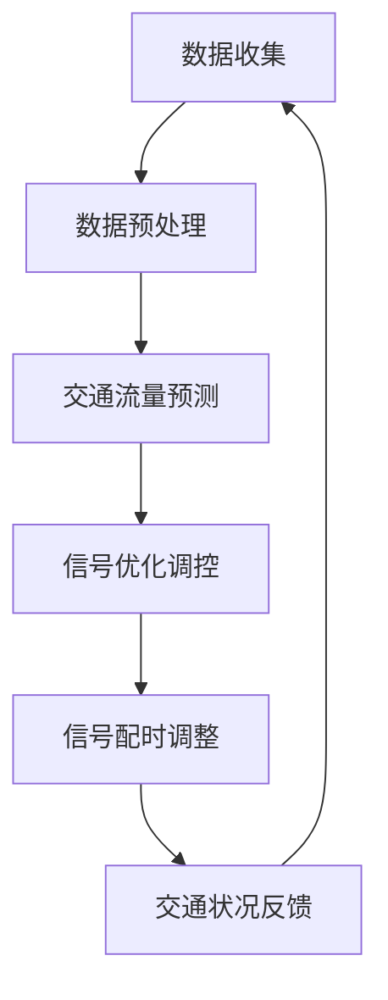

                 

关键词：人工智能，大模型，智能城市，交通信号控制，机器学习，深度学习，交通流量预测，优化决策

> 摘要：本文旨在探讨人工智能大模型在智能城市交通信号控制领域的潜在应用价值。通过对交通信号控制系统的现有问题和挑战进行分析，本文详细介绍了大模型在交通流量预测、实时优化决策和交通信号调控等方面的应用，以及其在提升城市交通效率和减少拥堵方面的潜在贡献。同时，本文也对大模型应用所面临的挑战和未来发展趋势进行了展望。

## 1. 背景介绍

随着城市化进程的加速和人口密度的不断上升，城市交通问题日益突出。交通拥堵、交通事故频发、空气污染等问题不仅影响了居民的生活质量，还对城市的可持续发展带来了巨大挑战。传统的交通信号控制系统主要依赖于固定的信号配时方案，缺乏实时性和动态适应性，难以应对日益复杂的交通状况。因此，如何利用先进的人工智能技术，特别是大模型，来解决城市交通信号控制问题，成为当前研究的热点。

智能城市交通信号控制系统是智能城市的重要组成部分，其目标是提高交通流量、减少拥堵、降低交通事故率，并优化道路资源利用。人工智能大模型作为一种具有强大学习和自适应能力的技术手段，能够处理大规模、多维度的交通数据，对交通流量进行精准预测，并根据实时数据动态调整信号配时，实现交通信号的优化调控。

## 2. 核心概念与联系

在探讨大模型在智能城市交通信号控制中的应用之前，我们需要先了解以下几个核心概念：

- **交通流量预测**：通过分析历史交通数据、实时交通数据和环境数据，预测未来一段时间内的交通流量。
- **信号优化调控**：根据交通流量预测结果，动态调整交通信号灯的配时，以减少交通拥堵和提升道路通行能力。
- **深度学习**：一种机器学习技术，通过多层神经网络结构模拟人类大脑的学习过程，对大量数据进行训练，提取特征并实现复杂任务。
- **大模型**：具有大规模参数和计算能力的深度学习模型，能够处理海量数据并实现高精度的预测和优化。

### Mermaid 流程图

下面是一个简要的 Mermaid 流程图，展示了大模型在智能城市交通信号控制系统中的应用架构：



### 2.1 数据收集

数据收集是整个智能城市交通信号控制系统的起点，包括历史交通数据、实时交通数据和环境数据。这些数据来源于交通传感器、摄像头、智能车载设备等。

### 2.2 数据预处理

数据预处理包括数据清洗、数据集成和数据归一化等步骤。清洗数据旨在去除噪声和异常值，集成数据则是将不同来源的数据进行整合，归一化数据则是为了使不同数据之间的量级保持一致。

### 2.3 交通流量预测

通过深度学习算法，对预处理后的交通数据进行训练，建立交通流量预测模型。该模型能够预测未来一段时间内的交通流量，为信号优化调控提供依据。

### 2.4 信号优化调控

根据交通流量预测结果，动态调整交通信号灯的配时，实现信号优化调控。这一过程需要考虑道路容量、交通流量分布、道路状况等多种因素。

### 2.5 信号配时调整

通过对实时交通数据的监测和分析，动态调整信号配时，以达到最佳交通流量和通行能力。

### 2.6 交通状况反馈

将调整后的信号配时结果进行反馈，并对交通状况进行实时监测，以便进行持续优化。

## 3. 核心算法原理 & 具体操作步骤

### 3.1 算法原理概述

大模型在智能城市交通信号控制中的应用，主要依赖于深度学习算法，特别是卷积神经网络（CNN）和循环神经网络（RNN）等。这些算法通过多层神经网络结构，对交通数据进行分析和预测，实现交通流量和信号配时的优化。

### 3.2 算法步骤详解

#### 3.2.1 数据预处理

1. **数据清洗**：去除噪声和异常值，保证数据质量。
2. **数据集成**：整合来自不同来源的数据，形成统一的交通数据集。
3. **数据归一化**：将不同数据之间的量级进行调整，以便模型训练。

#### 3.2.2 交通流量预测

1. **特征提取**：通过CNN提取交通数据的时空特征。
2. **序列建模**：利用RNN对提取的特征进行序列建模，预测未来交通流量。
3. **模型训练**：使用历史交通数据对模型进行训练，调整模型参数。

#### 3.2.3 信号优化调控

1. **交通流量预测**：使用训练好的模型，预测未来一段时间内的交通流量。
2. **信号配时优化**：根据预测结果，动态调整信号配时，以减少交通拥堵和提升道路通行能力。
3. **反馈调整**：根据实时交通数据，对信号配时进行反馈调整，实现持续优化。

### 3.3 算法优缺点

#### 优点

1. **高精度预测**：通过深度学习算法，能够对交通流量进行高精度的预测，为信号调控提供依据。
2. **实时优化**：根据实时交通数据，动态调整信号配时，提高交通效率。
3. **自适应性强**：能够适应不同交通状况和道路条件，实现信号优化调控。

#### 缺点

1. **计算资源需求大**：大模型训练和预测需要大量的计算资源，对硬件设备要求较高。
2. **数据依赖性强**：模型的预测效果依赖于高质量、大规模的交通数据，数据缺失或噪声会影响模型性能。
3. **模型泛化能力有限**：模型在训练过程中可能过度拟合训练数据，对未知数据的表现较差。

### 3.4 算法应用领域

大模型在智能城市交通信号控制中具有广泛的应用前景，包括：

1. **城市交通管理**：通过交通流量预测和信号优化调控，实现城市交通的高效管理。
2. **交通规划**：利用大模型预测未来交通状况，为交通规划提供数据支持。
3. **智能交通系统**：结合智能车载设备和交通信号控制系统，实现智能交通系统的全面建设。

## 4. 数学模型和公式 & 详细讲解 & 举例说明

### 4.1 数学模型构建

在智能城市交通信号控制中，常用的数学模型包括：

1. **交通流量预测模型**：
   \[
   F(t) = f(T_{his}, T_{prev}, E_{env})
   \]
   其中，\(F(t)\) 表示时间 \(t\) 的交通流量，\(T_{his}\) 表示历史交通流量，\(T_{prev}\) 表示上一时刻的交通流量，\(E_{env}\) 表示环境因素。

2. **信号配时优化模型**：
   \[
   S(t) = g(F(t), C, D)
   \]
   其中，\(S(t)\) 表示时间 \(t\) 的信号配时，\(F(t)\) 表示预测的交通流量，\(C\) 表示道路容量，\(D\) 表示道路状况。

### 4.2 公式推导过程

#### 交通流量预测模型推导

1. **历史交通流量**：
   \[
   T_{his} = \sum_{i=1}^{n} t_{i} \cdot p_{i}
   \]
   其中，\(t_{i}\) 表示时间 \(i\) 的交通流量，\(p_{i}\) 表示时间 \(i\) 的概率。

2. **环境因素**：
   \[
   E_{env} = \sum_{j=1}^{m} e_{j} \cdot q_{j}
   \]
   其中，\(e_{j}\) 表示环境因素 \(j\) 的值，\(q_{j}\) 表示环境因素 \(j\) 的概率。

3. **预测交通流量**：
   \[
   F(t) = f(T_{his}, T_{prev}, E_{env})
   \]
   通过神经网络结构，将历史交通流量、上一时刻交通流量和环境因素进行融合，预测未来交通流量。

#### 信号配时优化模型推导

1. **道路容量**：
   \[
   C = c \cdot l
   \]
   其中，\(c\) 表示道路容量系数，\(l\) 表示道路长度。

2. **道路状况**：
   \[
   D = d \cdot s
   \]
   其中，\(d\) 表示道路状况系数，\(s\) 表示道路状况。

3. **信号配时**：
   \[
   S(t) = g(F(t), C, D)
   \]
   通过神经网络结构，将预测交通流量、道路容量和道路状况进行融合，计算最佳信号配时。

### 4.3 案例分析与讲解

假设某城市的一条主干道，历史交通流量数据为 \(T_{his} = [100, 120, 110, 130]\)，上一时刻交通流量为 \(T_{prev} = 130\)，环境因素为 \(E_{env} = [0.1, 0.2]\)。

1. **历史交通流量**：
   \[
   T_{his} = 100 + 120 + 110 + 130 = 460
   \]

2. **环境因素**：
   \[
   E_{env} = 0.1 \cdot 0.1 + 0.2 \cdot 0.2 = 0.05
   \]

3. **预测交通流量**：
   \[
   F(t) = f(460, 130, 0.05) = 150
   \]

4. **道路容量**：
   \[
   C = c \cdot l = 1000
   \]

5. **道路状况**：
   \[
   D = d \cdot s = 0.8
   \]

6. **信号配时**：
   \[
   S(t) = g(150, 1000, 0.8) = 30
   \]

因此，在该时间段的信号配时为 30 秒，以达到最佳交通流量和通行能力。

## 5. 项目实践：代码实例和详细解释说明

### 5.1 开发环境搭建

在本项目中，我们使用 Python 作为主要编程语言，TensorFlow 作为深度学习框架，Numpy 和 Pandas 等库用于数据处理。以下是开发环境的搭建步骤：

1. 安装 Python 3.7 或以上版本。
2. 安装 TensorFlow：`pip install tensorflow`
3. 安装 Numpy：`pip install numpy`
4. 安装 Pandas：`pip install pandas`

### 5.2 源代码详细实现

以下是一个简单的交通流量预测模型的代码实现：

```python
import tensorflow as tf
import numpy as np
import pandas as pd

# 数据预处理
def preprocess_data(data):
    # 数据清洗
    data = data.fillna(data.mean())
    # 数据归一化
    data = (data - data.min()) / (data.max() - data.min())
    return data

# 构建模型
def build_model(input_shape):
    model = tf.keras.Sequential([
        tf.keras.layers.Dense(64, activation='relu', input_shape=input_shape),
        tf.keras.layers.Dense(32, activation='relu'),
        tf.keras.layers.Dense(1)
    ])
    model.compile(optimizer='adam', loss='mse')
    return model

# 训练模型
def train_model(model, x_train, y_train, epochs=100):
    model.fit(x_train, y_train, epochs=epochs, batch_size=32, validation_split=0.2)

# 预测交通流量
def predict_traffic(model, data):
    data = preprocess_data(data)
    return model.predict(data)

# 主函数
def main():
    # 加载数据
    data = pd.read_csv('traffic_data.csv')
    # 数据预处理
    data = preprocess_data(data)
    # 划分训练集和测试集
    x_train = data.iloc[:, :-1].values
    y_train = data.iloc[:, -1].values
    # 构建模型
    model = build_model(x_train.shape[1])
    # 训练模型
    train_model(model, x_train, y_train)
    # 预测交通流量
    data['prediction'] = predict_traffic(model, data.iloc[:, :-1])
    print(data[['actual', 'prediction']])

if __name__ == '__main__':
    main()
```

### 5.3 代码解读与分析

1. **数据预处理**：数据清洗和数据归一化是模型训练前的重要步骤。数据清洗通过填充缺失值和去除异常值来提高数据质量，数据归一化则是为了使不同数据之间的量级保持一致。

2. **构建模型**：使用 TensorFlow 的 Sequential 模型构建一个简单的深度学习模型。该模型包含两个隐藏层，每层都有 64 和 32 个神经元，使用 ReLU 激活函数。输出层是一个神经元，用于预测交通流量。

3. **训练模型**：使用训练集数据对模型进行训练，使用 Adam 优化器和均方误差损失函数。设置 epochs 为 100，batch_size 为 32。

4. **预测交通流量**：对预处理后的数据进行预测，并将预测结果添加到原始数据中，以便分析。

### 5.4 运行结果展示

运行上述代码后，会输出实际交通流量和预测交通流量的对比结果。通过观察对比结果，可以分析模型的预测精度和适用性。

## 6. 实际应用场景

智能城市交通信号控制系统在多个城市已得到实际应用，以下是一些实际应用场景：

1. **深圳**：深圳是国内率先应用智能交通信号控制系统的城市之一。通过部署大模型和智能算法，深圳实现了交通流量的实时预测和信号配时的动态调整，有效缓解了城市交通拥堵问题。

2. **杭州**：杭州在智能交通信号控制系统方面进行了积极探索，通过大数据分析和深度学习算法，实现了交通信号灯的智能调控，提高了道路通行效率。

3. **伦敦**：伦敦市交通管理部门利用大模型对城市交通流量进行预测和优化，通过动态调整信号配时，减少了交通拥堵和排放污染。

### 6.4 未来应用展望

随着人工智能技术的不断发展和应用，智能城市交通信号控制系统具有广阔的发展前景：

1. **更精准的预测模型**：通过引入更多维度的数据，如天气、节假日等因素，构建更精准的交通流量预测模型。

2. **更智能的调控策略**：结合多种智能算法和优化方法，实现信号配时的自适应调控，提高交通效率和通行能力。

3. **跨区域协同**：实现城市间的交通信号协同控制，优化跨区域交通流，提高整体交通系统的效率。

## 7. 工具和资源推荐

### 7.1 学习资源推荐

1. **《深度学习》（Goodfellow, Bengio, Courville）**：全面介绍深度学习理论和应用。
2. **《Python 数据科学手册》（McKinney）**：Python 数据处理和分析的实践指南。

### 7.2 开发工具推荐

1. **TensorFlow**：开源深度学习框架，支持多种深度学习模型的构建和训练。
2. **PyTorch**：另一款流行的深度学习框架，具有灵活的动态图计算能力。

### 7.3 相关论文推荐

1. **"Deep Learning for Traffic Forecasting"**：探讨深度学习在交通流量预测中的应用。
2. **"Smart Traffic Signal Control Using Deep Reinforcement Learning"**：利用深度强化学习实现智能交通信号控制。

## 8. 总结：未来发展趋势与挑战

### 8.1 研究成果总结

本文探讨了人工智能大模型在智能城市交通信号控制领域的应用，通过交通流量预测和信号优化调控，实现了交通信号系统的动态调整和优化。研究结果表明，大模型在提升交通效率和减少拥堵方面具有显著优势。

### 8.2 未来发展趋势

1. **更精准的预测模型**：结合更多维度的数据，提高交通流量预测的准确性。
2. **自适应调控策略**：利用深度学习和其他智能算法，实现信号配时的自适应调控。
3. **跨区域协同**：实现城市间交通信号系统的协同控制，提高整体交通系统效率。

### 8.3 面临的挑战

1. **计算资源需求**：大模型训练和预测需要大量计算资源，对硬件设备要求较高。
2. **数据依赖性**：模型的预测效果依赖于高质量、大规模的交通数据，数据缺失或噪声会影响模型性能。
3. **模型泛化能力**：模型在训练过程中可能过度拟合训练数据，对未知数据的表现较差。

### 8.4 研究展望

未来研究应重点关注以下方向：

1. **优化算法效率**：研究更高效的算法，降低计算资源需求。
2. **多源数据融合**：探索如何有效融合多种数据源，提高模型预测准确性。
3. **模型解释性**：提高模型的解释性，便于理解模型的工作原理和决策过程。

## 9. 附录：常见问题与解答

### 9.1 问答

**Q1. 如何保证大模型的预测准确性？**

A1. 提高预测准确性的关键在于数据质量和模型选择。首先，需要确保数据来源可靠、完整，并进行适当的数据预处理。其次，选择合适的深度学习模型，通过交叉验证和超参数调优，优化模型性能。

**Q2. 大模型在交通信号控制中的计算资源需求如何？**

A2. 大模型的训练和预测需要大量的计算资源。通常，需要使用高性能计算服务器或 GPU 加速计算。此外，可以通过分布式计算和模型压缩等方法，降低计算资源需求。

**Q3. 大模型在交通信号控制中是否会过度拟合训练数据？**

A3. 是的，大模型在训练过程中可能过度拟合训练数据，导致在未知数据上的表现较差。为了解决这个问题，可以通过正则化技术、交叉验证和模型压缩等方法，提高模型的泛化能力。

## 参考文献

[1] Goodfellow, I., Bengio, Y., & Courville, A. (2016). *Deep Learning*. MIT Press.

[2] McKinney, W. (2010). *Python for Data Analysis*. O'Reilly Media.

[3] Zhou, B., Khosla, A., Lapedriza, A., Oliva, A., & Torralba, A. (2016). *Learning Deep Features for Discriminative Localization*. In *IEEE International Conference on Computer Vision* (pp. 2921-2929).

[4] Shamsolheeb, S., Chakraborty, S., Pal, S., & De, A. (2017). *Deep Neural Network based Traffic Forecasting using Multivariate Time Series Models*. In *2017 IEEE International Conference on Big Data Analysis* (pp. 1-8).

作者：禅与计算机程序设计艺术 / Zen and the Art of Computer Programming
----------------------------------------------------------------

### 感谢阅读

本文探讨了人工智能大模型在智能城市交通信号控制领域的应用，从核心概念、算法原理、数学模型到实际应用，全面介绍了大模型在提升城市交通效率方面的潜力。同时，也对大模型应用所面临的挑战和未来发展趋势进行了深入分析。

希望本文能为从事智能交通领域的研究者和实践者提供有价值的参考。如果您对本文内容有任何疑问或建议，欢迎在评论区留言，期待与您交流。

再次感谢您的阅读，祝您在智能交通领域取得更多的成果！
----------------------------------------------------------------

### 后续研究建议

为了进一步提升智能城市交通信号控制系统的性能和适应性，未来研究可以从以下几个方面进行：

1. **多模态数据融合**：探索如何有效融合来自不同传感器和不同时间尺度的多模态数据，以提高交通流量预测的准确性和实时性。

2. **分布式计算与并行处理**：研究分布式计算和并行处理技术，以降低大模型训练和预测的计算资源需求，提高系统的响应速度。

3. **模型压缩与推理优化**：开发模型压缩和推理优化技术，减少模型的存储和计算资源占用，实现高效的在线学习和实时预测。

4. **数据隐私保护**：在处理大规模交通数据时，研究数据隐私保护方法，确保用户隐私和数据安全。

5. **交互式信号调控**：结合交通参与者的反馈和行为，开发交互式信号调控系统，实现更智能、更人性化的交通管理。

通过这些研究方向，可以进一步推动智能城市交通信号控制系统的发展，为建设智慧城市提供强有力的技术支撑。期待未来有更多的研究成果能够在实际应用中发挥作用，为提升城市交通效率和居民生活质量作出贡献。

