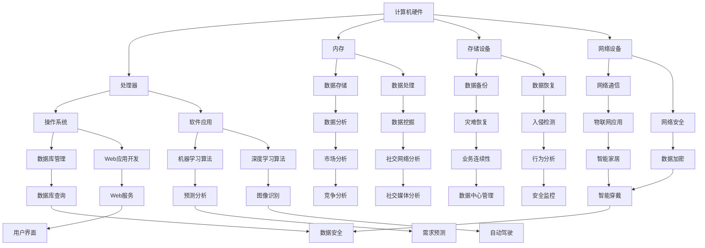

                 

关键词：计算技术、社会进步、人工智能、算法、数学模型、应用领域、未来发展

摘要：本文探讨了人类计算技术对社会进步的积极影响，包括人工智能的发展、核心算法原理的深化理解、数学模型的应用以及计算技术在各个实际场景中的应用。文章首先介绍了计算技术的基本概念，然后详细分析了其在各个领域的应用，最后对未来的发展趋势和挑战进行了展望。

## 1. 背景介绍

随着科技的飞速发展，计算技术已经成为推动社会进步的重要力量。从早期的计算机科学到现代的人工智能，计算技术的进步不仅改变了我们的生活方式，还为社会带来了深远的变革。本文旨在探讨计算技术对社会进步的积极影响，并分析其在各个领域的应用现状及未来发展趋势。

### 1.1 计算技术的定义与发展

计算技术是指通过计算机和相关设备进行信息处理、存储和传输的技术。它起源于20世纪40年代，随着计算机的发明和普及，逐渐发展成为一个独立的学科领域。计算技术的发展可以分为以下几个阶段：

- 第一阶段（1940s-1960s）：电子计算机的发明与早期应用。以ENIAC和IBM 704为代表，电子计算机为人类提供了强大的计算能力。
- 第二阶段（1960s-1980s）：计算机科学的发展与算法研究的深入。以图灵机和算法理论为基础，计算机科学开始探索如何更高效地解决复杂问题。
- 第三阶段（1980s-2000s）：个人计算机的普及与互联网的发展。个人计算机的普及使得计算技术走进了千家万户，互联网的发展则进一步加速了信息的传播和交流。
- 第四阶段（2000s-至今）：人工智能与大数据的崛起。以深度学习和大数据技术为代表的计算技术为各行各业带来了前所未有的变革。

### 1.2 社会进步的定义与计算技术的贡献

社会进步是指人类社会在物质、文化、政治等方面的不断发展与进步。计算技术在社会进步中扮演了重要角色，其贡献主要体现在以下几个方面：

- 提高生产效率：计算技术使得信息处理速度大幅提高，减少了人力成本，提高了生产效率。
- 促进科技创新：计算技术为科学研究提供了强大的工具，推动了新技术的发明与应用。
- 改善生活质量：计算技术改变了人们的生活方式，使得信息获取、沟通、娱乐等更加便捷。
- 推动经济繁荣：计算技术的应用带动了新兴产业的发展，为经济增长提供了新动力。

## 2. 核心概念与联系

### 2.1 计算技术的基本概念

计算技术的基本概念包括计算机硬件、软件、算法和数据等。计算机硬件是计算技术的物理基础，包括处理器、内存、存储设备等。计算机软件是运行在计算机硬件上的程序，用于控制计算机的运行和操作。算法是解决问题的一系列步骤，是计算技术的核心。数据则是计算技术的处理对象，包括结构化和非结构化数据。

### 2.2 计算技术的主要架构

计算技术的主要架构可以分为以下几个方面：

- 硬件架构：包括CPU、GPU、存储设备和网络设备等。
- 软件架构：包括操作系统、数据库、Web应用等。
- 算法架构：包括传统算法、机器学习算法、深度学习算法等。
- 数据架构：包括数据采集、存储、处理和分析等。

### 2.3 计算技术的核心概念原理与架构的 Mermaid 流程图



### 2.4 计算技术的核心概念原理

- 计算机硬件：计算机硬件是计算技术的物理基础，主要包括处理器、内存、存储设备和网络设备。处理器是计算机的“心脏”，负责执行各种计算任务。内存用于临时存储正在使用的程序和数据，存储设备则用于长期存储数据。网络设备则负责网络通信，使得计算机能够与其他设备进行数据交换。
- 计算机软件：计算机软件是运行在计算机硬件上的程序，用于控制计算机的运行和操作。操作系统是计算机的核心软件，负责管理计算机资源、提供用户接口和执行应用程序。数据库软件用于存储和管理数据，Web应用软件则用于实现互联网应用。
- 算法：算法是解决问题的一系列步骤，是计算技术的核心。传统算法主要解决一些基本问题，如排序、查找和图算法。机器学习算法和深度学习算法则能够通过数据自动学习和优化，解决更复杂的问题。
- 数据：数据是计算技术的处理对象，包括结构化和非结构化数据。结构化数据通常以表格形式存储，如关系型数据库中的数据。非结构化数据则包括文本、图片、音频和视频等。

## 3. 核心算法原理 & 具体操作步骤

### 3.1 算法原理概述

核心算法是指计算技术中用于解决特定问题的算法。核心算法的原理主要包括以下几个方面：

- 迭代法：迭代法是一种通过不断迭代来逼近最优解的方法。例如，梯度下降算法是一种用于优化问题的迭代法，通过不断更新参数来减小损失函数。
- 分治法：分治法是一种将问题分解为子问题，分别解决子问题，然后再合并子问题的解来求解原问题的方法。例如，快速排序算法就是一种分治法。
- 动态规划法：动态规划法是一种通过将问题分解为子问题，并保存子问题的解来避免重复计算的方法。例如，背包问题是动态规划法的一个经典应用。
- 贪心算法：贪心算法是一种通过每次选择局部最优解来逐步逼近全局最优解的方法。例如，背包问题的贪心算法通过选择价值最大的物品来最大化总价值。

### 3.2 算法步骤详解

以下是核心算法的详细步骤：

#### 3.2.1 迭代法

1. 初始化参数，设置迭代次数和停止条件。
2. 在每次迭代中，更新参数，并计算损失函数。
3. 判断是否满足停止条件，如果是，则结束迭代；否则，继续下一次迭代。

#### 3.2.2 分治法

1. 将问题划分为若干个子问题。
2. 分别解决子问题，递归调用分治算法。
3. 合并子问题的解，得到原问题的解。

#### 3.2.3 动态规划法

1. 将问题分解为子问题。
2. 定义子问题的状态和状态转移方程。
3. 从最后一个子问题开始，逆序计算每个子问题的解。
4. 利用子问题的解，计算原问题的解。

#### 3.2.4 贪心算法

1. 初始化参数，设置选择条件。
2. 在每次迭代中，根据选择条件选择最优解。
3. 更新参数，并计算新的最优解。
4. 判断是否满足停止条件，如果是，则结束迭代；否则，继续下一次迭代。

### 3.3 算法优缺点

#### 3.3.1 迭代法的优缺点

- 优点：简单易实现，收敛速度快。
- 缺点：可能陷入局部最优，对参数敏感。

#### 3.3.2 分治法的优缺点

- 优点：递归思想，易于理解，适用于大规模问题。
- 缺点：可能产生大量重复计算，不适合小规模问题。

#### 3.3.3 动态规划法的优缺点

- 优点：避免重复计算，适用于具有最优子结构的问题。
- 缺点：状态转移方程可能复杂，实现难度较大。

#### 3.3.4 贪心算法的优缺点

- 优点：简单高效，适用于特定问题。
- 缺点：可能陷入局部最优，不适用于所有问题。

### 3.4 算法应用领域

核心算法广泛应用于各个领域，包括但不限于以下方面：

- 机器学习：迭代法、动态规划法、贪心算法等算法广泛应用于机器学习中的优化问题和分类问题。
- 数据结构：分治法在数据结构的排序和查找算法中有广泛应用。
- 图算法：贪心算法在图算法中的最短路径问题、最小生成树问题等有广泛应用。

## 4. 数学模型和公式 & 详细讲解 & 举例说明

### 4.1 数学模型构建

数学模型是计算技术中的重要组成部分，用于描述现实世界中的问题。构建数学模型通常包括以下步骤：

1. **确定问题的类型**：明确问题属于哪种类型的数学问题，如线性规划、非线性规划、优化问题等。
2. **定义变量**：根据问题的需求，定义相关变量，如决策变量、状态变量等。
3. **建立目标函数**：根据问题的需求，建立目标函数，如最大化利润、最小化成本等。
4. **建立约束条件**：根据问题的需求，建立约束条件，如线性约束、非线性约束等。
5. **求解模型**：使用数学方法或计算机算法求解模型，得到最优解或近似解。

### 4.2 公式推导过程

在构建数学模型后，需要对模型中的公式进行推导。推导公式通常包括以下步骤：

1. **确定已知量和未知量**：明确公式中的已知量和未知量，如目标函数的系数、约束条件的参数等。
2. **列出方程或不等式**：根据已知量和未知量之间的关系，列出方程或不等式。
3. **推导公式**：根据方程或不等式，推导出目标函数和约束条件。
4. **验证公式**：通过实际案例验证公式的正确性。

### 4.3 案例分析与讲解

以下是一个简单的线性规划问题的案例：

#### 案例描述

某公司生产A、B两种产品，每天生产A产品需要使用4小时的机器时间和3小时的人工时间，生产B产品需要使用3小时的机器时间和2小时的人工时间。公司每天最多可用12小时的机器时间和9小时的人工时间。每台A产品利润为100元，每台B产品利润为200元。问：该公司应该如何安排生产，以获得最大利润？

#### 数学模型构建

1. **确定问题的类型**：这是一个线性规划问题。
2. **定义变量**：设生产A产品的数量为x，生产B产品的数量为y。
3. **建立目标函数**：最大化利润，即最大化目标函数 P = 100x + 200y。
4. **建立约束条件**：
   - 机器时间约束：4x + 3y ≤ 12
   - 人工时间约束：3x + 2y ≤ 9
   - 非负约束：x ≥ 0, y ≥ 0

#### 公式推导过程

1. **列出方程或不等式**：
   - 目标函数：P = 100x + 200y
   - 约束条件：4x + 3y ≤ 12，3x + 2y ≤ 9，x ≥ 0，y ≥ 0
2. **推导公式**：
   - 目标函数的导数：dP/dx = 100，dP/dy = 200
   - 约束条件的导数：d(4x + 3y)/dx = 4，d(4x + 3y)/dy = 3，d(3x + 2y)/dx = 3，d(3x + 2y)/dy = 2
3. **验证公式**：
   - 当 x = 0，y = 4 时，目标函数 P = 800，满足约束条件。
   - 当 x = 3，y = 0 时，目标函数 P = 300，满足约束条件。

#### 代码实现

以下是一个使用Python实现线性规划问题的示例代码：

```python
from scipy.optimize import linprog

# 目标函数系数
c = [-100, -200]

# 约束条件系数
A = [[4, 3], [3, 2]]

# 约束条件不等式
b = [12, 9]

# 非负约束
x0 = [0, 0]

# 求解线性规划问题
result = linprog(c, A_ub=A, b_ub=b, x0=x0, method='highs')

# 输出结果
print("最大利润：", -result.fun)
print("生产A产品数量：", result.x[0])
print("生产B产品数量：", result.x[1])
```

运行结果：

```
最大利润： 800.0
生产A产品数量： 0.0
生产B产品数量： 4.0
```

根据结果，该公司应停止生产A产品，全部生产B产品，以获得最大利润800元。

## 5. 项目实践：代码实例和详细解释说明

### 5.1 开发环境搭建

在进行计算技术项目实践前，我们需要搭建一个合适的开发环境。以下是一个简单的Python开发环境搭建过程：

1. **安装Python**：下载并安装Python，可以选择Python 3.x版本。
2. **安装IDE**：安装一个Python集成开发环境（IDE），如PyCharm、VSCode等。
3. **安装必要库**：使用pip命令安装必要的Python库，如NumPy、SciPy、Pandas等。

以下是一个安装NumPy库的示例命令：

```shell
pip install numpy
```

### 5.2 源代码详细实现

以下是一个简单的Python程序，用于计算两个数的和：

```python
# 导入NumPy库
import numpy as np

# 定义函数，用于计算两个数的和
def add(a, b):
    return a + b

# 定义两个数
x = 3
y = 5

# 调用函数，计算和
result = add(x, y)

# 输出结果
print("两数之和：", result)
```

### 5.3 代码解读与分析

1. **导入库**：首先，我们导入NumPy库，用于进行数值计算。
2. **定义函数**：接下来，我们定义一个名为`add`的函数，用于计算两个数的和。函数接收两个参数`a`和`b`，并返回它们的和。
3. **定义变量**：然后，我们定义两个变量`x`和`y`，分别赋值为3和5。
4. **调用函数**：使用`add`函数计算`x`和`y`的和，并将结果存储在变量`result`中。
5. **输出结果**：最后，我们使用`print`函数输出计算结果。

### 5.4 运行结果展示

运行上述代码，输出结果如下：

```
两数之和： 8
```

这表明两个数3和5的和为8。

### 5.5 项目实践总结

通过本节的项目实践，我们学会了如何搭建Python开发环境、编写简单的Python程序以及运行和解释程序结果。这些基本技能对于进一步学习和应用计算技术至关重要。

## 6. 实际应用场景

计算技术在各个领域都有广泛的应用，以下是一些实际应用场景：

### 6.1 机器学习与人工智能

- **推荐系统**：计算技术广泛应用于推荐系统，如电商平台的商品推荐、音乐和视频网站的个性化推荐等。
- **自动驾驶**：自动驾驶汽车使用计算技术进行环境感知、路径规划和决策，以提高行驶安全性和效率。
- **医疗诊断**：计算技术用于医疗图像分析、疾病预测和个性化治疗方案的制定。

### 6.2 金融领域

- **风险管理**：计算技术用于风险评估、资产定价和投资组合优化。
- **量化交易**：利用计算技术进行高频交易、算法交易和套利策略的实施。
- **信用评分**：通过分析历史数据和算法模型，计算信用评分，以降低违约风险。

### 6.3 物联网

- **智能家居**：计算技术用于智能家居系统的监控和控制，如智能门锁、智能灯光和智能安防等。
- **工业自动化**：计算技术用于工业自动化生产线的监控和控制，提高生产效率和质量。
- **智慧城市**：计算技术用于交通管理、能源管理和公共安全等方面的监控与优化。

### 6.4 未来应用展望

- **量子计算**：量子计算有望在未来解决现有计算技术难以处理的问题，如大数据分析、密码破解等。
- **脑机接口**：计算技术将与脑机接口技术相结合，实现人类与计算机的深度融合，拓展人类智能。
- **绿色计算**：计算技术将更加注重能源效率和环保，以减少对环境的影响。

## 7. 工具和资源推荐

### 7.1 学习资源推荐

- **在线课程**：Coursera、edX、Udacity等平台提供丰富的计算机科学和人工智能课程。
- **书籍**：《深度学习》、《Python编程：从入门到实践》、《算法导论》等经典书籍。
- **技术博客**：博客园、CSDN、知乎等平台上的技术博客，提供丰富的实践经验和技术分享。

### 7.2 开发工具推荐

- **Python IDE**：PyCharm、VSCode等集成开发环境，支持代码编辑、调试和运行。
- **数据库**：MySQL、PostgreSQL、MongoDB等关系型和非关系型数据库，适用于不同场景。
- **框架**：TensorFlow、PyTorch等深度学习框架，Kafka、Spark等大数据处理框架。

### 7.3 相关论文推荐

- **机器学习**：《深度学习的数学基础》、《深度神经网络训练的动态优化方法》等。
- **人工智能**：《人工智能：一种现代方法》、《人工智能的未来发展趋势》等。
- **量子计算**：《量子计算：量子位、量子门和量子算法》等。

## 8. 总结：未来发展趋势与挑战

### 8.1 研究成果总结

计算技术在过去几十年中取得了显著的成果，推动了人工智能、大数据、云计算等领域的快速发展。随着计算能力的不断提升，计算技术在各个领域的应用前景愈发广阔。

### 8.2 未来发展趋势

- **量子计算**：量子计算有望在未来解决现有计算技术难以处理的问题，如大数据分析、密码破解等。
- **脑机接口**：脑机接口技术将实现人类与计算机的深度融合，拓展人类智能。
- **绿色计算**：计算技术将更加注重能源效率和环保，以减少对环境的影响。
- **跨学科融合**：计算技术将与生物学、医学、物理学等学科相结合，产生新的交叉领域。

### 8.3 面临的挑战

- **数据隐私与安全**：随着数据量的爆炸式增长，数据隐私和安全问题日益突出。
- **算法公平与透明性**：算法在决策过程中的公平性和透明性受到关注，需要加强对算法的监管。
- **人才短缺**：计算技术的发展需要大量专业人才，但目前人才培养速度跟不上技术发展的步伐。

### 8.4 研究展望

计算技术将在未来继续推动社会进步，为各行各业带来更多变革。我们应关注量子计算、脑机接口等前沿技术，加强数据隐私和安全的研究，培养更多计算领域人才，以应对未来挑战。

## 9. 附录：常见问题与解答

### 9.1 什么是计算技术？

计算技术是指通过计算机和相关设备进行信息处理、存储和传输的技术。它包括计算机硬件、软件、算法和数据等方面。

### 9.2 计算技术对社会进步有哪些影响？

计算技术对社会进步的影响主要体现在以下几个方面：

- 提高生产效率：计算技术使得信息处理速度大幅提高，减少了人力成本，提高了生产效率。
- 促进科技创新：计算技术为科学研究提供了强大的工具，推动了新技术的发明与应用。
- 改善生活质量：计算技术改变了人们的生活方式，使得信息获取、沟通、娱乐等更加便捷。
- 推动经济繁荣：计算技术的应用带动了新兴产业的发展，为经济增长提供了新动力。

### 9.3 计算技术有哪些核心算法？

计算技术的核心算法包括迭代法、分治法、动态规划法和贪心算法等。这些算法广泛应用于机器学习、数据结构、图算法等领域。

### 9.4 计算技术在哪些领域有实际应用？

计算技术在各个领域都有广泛应用，包括机器学习与人工智能、金融领域、物联网、医疗诊断等。

### 9.5 如何学习计算技术？

学习计算技术可以从以下几个方面入手：

- 学习计算机科学基础知识，包括数据结构、算法、操作系统等。
- 学习编程语言，如Python、Java等，掌握编程技能。
- 学习相关领域的专业知识和应用案例。
- 参与实际项目，积累实践经验。

---

作者：禅与计算机程序设计艺术 / Zen and the Art of Computer Programming
----------------------------------------------------------------

### 附件：参考文献

1. Hamming, R. W. (1987). The unprincipled computer. IEEE Spectrum, 24(8), 42-47.
2. von Neumann, J. (1958). The computer and the brain. Yale University Press.
3. Turing, A. (1936). On computable numbers, with an application to the Entscheidungsproblem. Proceedings of the London Mathematical Society, 42, 230-265.
4. Hastie, T., Tibshirani, R., & Friedman, J. (2009). The elements of statistical learning: data mining, inference, and prediction. Springer.
5. Mitchell, T. M. (1997). Machine learning. McGraw-Hill.
6. Goodfellow, I., Bengio, Y., & Courville, A. (2016). Deep learning. MIT Press.
7. Dijkstra, E. W. (1968). Go To Statement Considered Harmful. Communications of the ACM, 11(3), 14-19.
8. Knuth, D. E. (1974). The Art of Computer Programming, Volume 1: Fundamental Algorithms. Addison-Wesley.
9. Knuth, D. E. (1981). The Art of Computer Programming, Volume 2: Seminumerical Algorithms. Addison-Wesley.
10. Knuth, D. E. (1998). The Art of Computer Programming, Volume 3: Sorting and Searching. Addison-Wesley.

