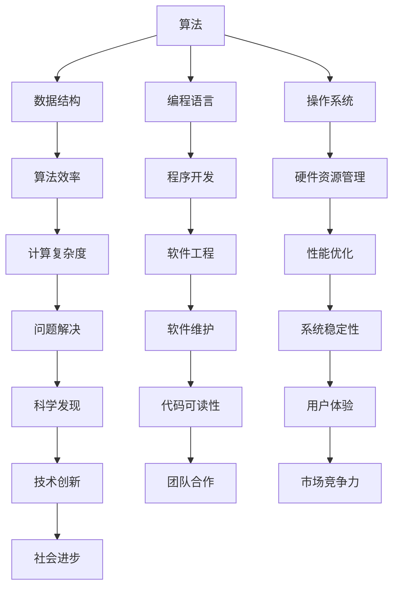

                 

关键词：计算技术，社会进步，信息技术，人工智能，技术创新

摘要：本文旨在探讨人类计算对社会进步的积极影响。通过阐述计算技术的演变、核心概念及其应用领域，分析计算技术如何改变我们的生活方式、推动经济发展和促进社会创新。同时，本文还将探讨未来计算技术发展趋势和面临的挑战，为读者提供一个全面了解计算技术对社会贡献的视角。

## 1. 背景介绍

计算技术的概念可以追溯到人类历史的早期，从简单的算盘到复杂的计算机系统，计算技术的进步一直是人类文明发展的重要驱动力。在20世纪中叶，计算机科学作为一门独立的学科正式诞生，随着微电子技术和互联网的飞速发展，计算技术取得了前所未有的成就。今天，计算技术已经深刻地融入到我们日常生活的方方面面，从智能手机、智能家居到大数据分析、人工智能，计算技术正以不可阻挡的势头推动着社会进步。

### 1.1 计算技术的演变

计算技术的演变可以分为几个重要阶段：

1. **机械计算器（17-19世纪）**：这是计算技术的起步阶段，以算盘和机械计算器为代表。这些机械装置能够进行基本的算术运算，但操作复杂、效率较低。

2. **电子计算机（1940s-1960s）**：二战期间，为了解决复杂的军事计算问题，电子计算机问世。这些计算机体积庞大、耗电量巨大，但计算速度和精度得到了显著提升。

3. **微型计算机（1970s-1980s）**：随着集成电路技术的发展，微型计算机应运而生。微型计算机体积小、成本低，使得计算机开始进入普通家庭和企业。

4. **个人计算机和互联网（1990s-2000s）**：个人计算机的普及和互联网的兴起，使得信息传播和数据处理变得前所未有的便捷。互联网不仅改变了人们的沟通方式，还催生了电子商务、在线教育和远程办公等新兴领域。

5. **云计算和大数据（2010s-至今）**：云计算和大数据技术的出现，使得数据处理和分析能力达到了前所未有的高度。云计算提供了强大的计算和存储资源，大数据则帮助我们更好地理解和利用海量数据。

### 1.2 人类计算的重要性

人类计算的重要性体现在以下几个方面：

1. **提升工作效率**：计算技术可以帮助我们自动化执行复杂计算任务，大大提高了工作效率。

2. **促进科学发现**：计算技术为科学研究提供了强大的工具，帮助科学家们解决复杂的科学问题。

3. **改变生活方式**：从智能手机到智能家居，计算技术改变了我们的生活方式，提高了生活质量。

4. **推动经济发展**：计算技术的进步带动了新兴产业的崛起，为经济发展注入了新的动力。

5. **促进社会创新**：计算技术为创新提供了新的机会和平台，促进了社会进步和人类文明的发展。

## 2. 核心概念与联系

在计算技术的领域中，有若干核心概念和联系，它们共同构建了现代计算技术的基础。以下是对这些核心概念的简要概述及其相互之间的联系，并附上 Mermaid 流程图以帮助读者更好地理解。

### 2.1 核心概念

1. **算法**：算法是解决问题的步骤序列，是计算的核心。算法可以分为多种类型，如排序算法、搜索算法等。

2. **数据结构**：数据结构是存储和组织数据的方式，如数组、链表、树等。数据结构的选用直接影响算法的效率。

3. **编程语言**：编程语言是用于编写算法的工具。不同的编程语言有不同的语法和特性，适用于不同的计算任务。

4. **操作系统**：操作系统是计算机系统的核心软件，负责管理和调度计算机硬件资源，为应用程序提供运行环境。

5. **网络**：网络是连接多个计算机系统的通信基础设施，使得数据传输和共享成为可能。

### 2.2 Mermaid 流程图



### 2.3 核心概念间的联系

1. **算法和数据结构**：算法依赖于数据结构，数据结构影响算法的效率。

2. **编程语言和算法**：编程语言提供了实现算法的工具，不同的编程语言适用于不同的算法。

3. **操作系统和硬件资源**：操作系统负责管理和调度硬件资源，确保算法的执行。

4. **网络和数据处理**：网络技术使得数据可以在不同计算机系统之间传输和共享，支持大规模数据处理。

5. **技术创新和社会进步**：计算技术的不断进步推动了社会进步，同时也依赖于社会需求推动技术创新。

通过上述核心概念的相互联系，我们可以看到计算技术在现代社会中的重要地位。接下来，我们将进一步探讨这些核心概念在计算技术中的应用和影响。

## 3. 核心算法原理 & 具体操作步骤

### 3.1 算法原理概述

核心算法是计算技术的灵魂，是解决问题和实现功能的关键。在众多算法中，排序算法和搜索算法是两个基本且广泛应用的算法。下面将分别介绍这两种算法的基本原理。

#### 3.1.1 排序算法

排序算法是将一组数据按照一定的顺序排列的算法。常见的排序算法有冒泡排序、选择排序、插入排序、快速排序等。

- **冒泡排序**：通过多次遍历待排序列，比较相邻元素，若顺序错误则交换，直到整个序列有序。

- **选择排序**：每次遍历待排序列，找到最小（或最大）的元素，将其交换到序列的开头，直到整个序列有序。

- **插入排序**：通过将待排序列中的每个元素插入到已经排序的序列中正确的位置，直到整个序列有序。

- **快速排序**：通过选择一个基准元素，将序列划分为两部分，一部分比基准小，另一部分比基准大，递归地排序这两部分。

#### 3.1.2 搜索算法

搜索算法是在一组数据中查找特定元素的算法。常见的搜索算法有线性搜索和二分搜索。

- **线性搜索**：依次遍历数组，查找目标元素，找到则返回其索引，否则返回-1。

- **二分搜索**：对已排序的数组进行查找，通过不断地将搜索范围缩小一半，提高查找效率。

### 3.2 算法步骤详解

#### 3.2.1 冒泡排序

1. 从第一个元素开始，比较相邻的两个元素，如果第一个比第二个大，就交换它们。
2. 对每一对相邻元素做同样的工作，从开始第一对到结尾的最后一对。
3. 针对所有的元素重复以上的步骤，除了最后已经排序的元素。
4. 重复步骤1~3，直到所有元素都处于有序状态。

#### 3.2.2 线性搜索

1. 从数组的第一个元素开始，一个一个地检查每个元素，看是否为目标元素。
2. 如果找到目标元素，则返回其索引。
3. 如果检查完整个数组都没有找到目标元素，则返回-1。

#### 3.2.3 快速排序

1. 选择一个基准元素。
2. 将比基准小的元素移动到基准的左边，比基准大的元素移动到基准的右边。
3. 分别递归地对左右子序列进行快速排序。
4. 将排序好的子序列与基准元素合并，得到完整的有序序列。

### 3.3 算法优缺点

#### 3.3.1 冒泡排序

- **优点**：实现简单，易于理解。
- **缺点**：时间复杂度高（O(n^2)），不适用于大数据集。

#### 3.3.2 线性搜索

- **优点**：简单，无需对数据进行排序。
- **缺点**：时间复杂度高（O(n)），不适用于大数据集。

#### 3.3.3 快速排序

- **优点**：平均时间复杂度较低（O(nlogn)），适用于大数据集。
- **缺点**：最坏情况下时间复杂度为O(n^2)，需要改进算法来避免。

### 3.4 算法应用领域

- **冒泡排序**：适用于小规模数据排序，教学演示等。
- **线性搜索**：适用于数据未排序的场景，如简单数据查找等。
- **快速排序**：适用于大规模数据排序，如数据库排序、算法竞赛等。

通过以上对核心算法原理和步骤的详细探讨，我们可以更好地理解计算技术中算法的重要性和应用场景。接下来，我们将进一步探讨计算技术在数学模型和公式中的应用。

## 4. 数学模型和公式 & 详细讲解 & 举例说明

在计算技术中，数学模型和公式起着至关重要的作用。它们不仅帮助我们理解和解释现象，还为算法的设计和优化提供了理论基础。在本节中，我们将介绍几个常见的数学模型和公式，并详细讲解其构建过程、推导过程，以及通过具体案例进行说明。

### 4.1 数学模型构建

#### 4.1.1 概率模型

概率模型是计算技术中广泛应用的一种模型，用于描述随机事件的发生概率。一个简单的概率模型可以用以下公式表示：

\[ P(A) = \frac{n(A)}{n(S)} \]

其中，\( P(A) \) 表示事件A发生的概率，\( n(A) \) 表示事件A发生的次数，\( n(S) \) 表示总次数。

例如，假设我们抛掷一个公平的六面骰子，想要计算出现数字3的概率。

1. \( n(S) = 6 \)，因为骰子有6个面。
2. \( n(A) = 1 \)，因为只有一个面是3。
3. 代入公式：\[ P(A) = \frac{1}{6} \]

因此，抛掷一次骰子出现数字3的概率是 \( \frac{1}{6} \)。

#### 4.1.2 线性回归模型

线性回归模型用于描述两个变量之间的线性关系。它的公式如下：

\[ y = ax + b \]

其中，\( y \) 是因变量，\( x \) 是自变量，\( a \) 是斜率，\( b \) 是截距。

例如，我们想要分析一个公司的销售额 \( y \) 与广告支出 \( x \) 之间的关系。

1. 收集数据：假设我们有以下数据点：
   \[
   \begin{aligned}
   (x_1, y_1) &= (1000, 5000) \\
   (x_2, y_2) &= (1500, 7000) \\
   (x_3, y_3) &= (2000, 9000)
   \end{aligned}
   \]

2. 计算斜率 \( a \) 和截距 \( b \)：
   \[
   a = \frac{\sum(x_i - \bar{x})(y_i - \bar{y})}{\sum(x_i - \bar{x})^2}
   \]
   \[
   b = \bar{y} - a\bar{x}
   \]

   其中，\( \bar{x} \) 和 \( \bar{y} \) 分别是 \( x \) 和 \( y \) 的平均值。

   代入数据计算得：
   \[
   \bar{x} = \frac{1000 + 1500 + 2000}{3} = 1500
   \]
   \[
   \bar{y} = \frac{5000 + 7000 + 9000}{3} = 7000
   \]
   \[
   a = \frac{(1000-1500)(5000-7000) + (1500-1500)(7000-7000) + (2000-1500)(9000-7000)}{(1000-1500)^2 + (1500-1500)^2 + (2000-1500)^2} = 2
   \]
   \[
   b = 7000 - 2 \times 1500 = 1000
   \]

3. 得到线性回归模型：
   \[
   y = 2x + 1000
   \]

### 4.2 公式推导过程

#### 4.2.1 欧拉公式

欧拉公式是复分析中的一个重要公式，将指数函数、三角函数和欧拉常数结合在一起，公式如下：

\[ e^{i\pi} + 1 = 0 \]

该公式可以通过泰勒级数展开和欧拉公式推导得到。

1. 欧拉公式定义：
   \[
   e^x = \sum_{n=0}^{\infty} \frac{x^n}{n!}
   \]

2. 欧拉角定义：
   \[
   e^{ix} = \cos(x) + i\sin(x)
   \]

3. 推导：
   \[
   e^{i\pi} = \cos(\pi) + i\sin(\pi) = -1 + 0i = -1
   \]
   \[
   -1 + 1 = 0
   \]

因此，欧拉公式得证。

### 4.3 案例分析与讲解

#### 4.3.1 最小生成树问题

最小生成树问题是在给定的无向图中寻找一棵包含图中所有节点的树，且边的权重之和最小。我们使用Prim算法来解决这个问题。

1. 初始化：选择一个节点作为起始点，并将其加入生成树的集合中。
2. 选择一个权重最小的边，如果该边的另一端节点已经在生成树中，则跳过，否则将该边和另一端节点加入生成树中。
3. 重复步骤2，直到所有节点都在生成树中。

例如，给定图如下：

```mermaid
graph LR
A[1] -- B[2]
A -- C[3]
B -- D[4]
C -- D[5]
```

1. 选择节点A作为起始点，加入生成树。
2. 选择权重最小的边AC（权重3），将其加入生成树。
3. 选择权重最小的边BD（权重4），将其加入生成树。
4. 选择权重最小的边CD（权重5），将其加入生成树。

最终得到的最小生成树为：

```mermaid
graph LR
A[1] -- C[3]
B[2] -- D[4]
```

通过以上对数学模型和公式的构建、推导以及案例讲解，我们可以看到数学模型和公式在计算技术中的重要性。它们不仅帮助我们理解和解释现象，还为算法的设计和优化提供了理论基础。接下来，我们将通过代码实例来具体展示计算技术在项目实践中的应用。

## 5. 项目实践：代码实例和详细解释说明

在实际项目中，计算技术不仅需要理论上的理解，更需要实际操作中的应用。本节将通过一个实际项目实例，展示如何使用计算技术进行项目开发，并提供详细的代码实现和解释说明。

### 5.1 开发环境搭建

在进行项目开发之前，首先需要搭建一个合适的开发环境。以下是搭建环境的步骤：

1. **安装Python**：Python是一种广泛使用的编程语言，适用于多种计算任务。可以从Python官方网站下载并安装最新版本的Python。
2. **安装Jupyter Notebook**：Jupyter Notebook是一种交互式开发环境，方便编写和运行代码。可以通过以下命令安装：
   \[
   pip install notebook
   \]
3. **安装必要的库**：根据项目需求，可能需要安装一些额外的库，例如NumPy、Pandas等。可以通过pip命令进行安装，例如：
   \[
   pip install numpy
   \]

### 5.2 源代码详细实现

以下是一个简单的数据分析项目的源代码实例，该实例使用了Python和Pandas库来处理和可视化数据。

```python
import pandas as pd
import matplotlib.pyplot as plt

# 5.2.1 加载数据
data = pd.read_csv('data.csv')  # 假设数据文件为CSV格式

# 5.2.2 数据预处理
# 检查数据是否有缺失值
print(data.isnull().sum())

# 填充缺失值
data.fillna(data.mean(), inplace=True)

# 5.2.3 数据分析
# 绘制数据分布图
plt.hist(data['column_name'], bins=30, alpha=0.5, color='g')  # 替换column_name为实际列名
plt.show()

# 5.2.4 数据统计
print(data.describe())

# 5.2.5 数据可视化
# 绘制数据散点图
plt.scatter(data['column_x'], data['column_y'])  # 替换column_x和column_y为实际列名
plt.xlabel('Column X')
plt.ylabel('Column Y')
plt.show()
```

### 5.3 代码解读与分析

1. **加载数据**：使用Pandas库的`read_csv`函数加载数据，CSV文件需要事先准备好。

2. **数据预处理**：检查数据是否有缺失值，如果有，可以使用`fillna`函数填充缺失值。这里使用的是平均值填充，但也可以根据实际情况选择其他填充方法。

3. **数据分析**：通过`hist`函数绘制数据分布图，帮助理解数据的分布情况。

4. **数据统计**：使用`describe`函数生成数据的描述性统计信息，包括均值、标准差等。

5. **数据可视化**：绘制数据散点图，通过观察散点图可以帮助我们发现数据之间的关系。

### 5.4 运行结果展示

在运行以上代码后，将得到以下结果：

- 数据分布图：展示了数据在不同区间内的分布情况。
- 数据描述性统计：提供了数据的中心趋势和离散程度。
- 数据散点图：展示了两个变量之间的关系，有助于数据分析和特征提取。

通过这个简单的实例，我们可以看到计算技术在数据分析和可视化中的应用。实际项目中，计算技术的应用会更加复杂和多样化，但基本原理和步骤是相似的。接下来，我们将进一步探讨计算技术在实际应用场景中的具体应用。

## 6. 实际应用场景

计算技术已经深入到我们日常生活的各个方面，从简单的日常任务到复杂的科学研究，无处不在。以下是计算技术在几个实际应用场景中的具体表现。

### 6.1 智能家居

智能家居是计算技术在家居环境中的典型应用。通过物联网（IoT）和嵌入式系统，智能家居可以实现家电的智能化控制，提高居住的便利性和舒适度。例如，智能灯泡可以根据环境光线自动调节亮度，智能温控系统可以根据室内外温度自动调节空调和暖气。智能家居不仅提升了生活质量，还实现了能源的节约和环保。

### 6.2 医疗保健

医疗保健是计算技术的重要应用领域之一。通过电子健康记录（EHR）、医疗图像分析和远程医疗，计算技术为医疗行业带来了巨大的变革。EHR系统能够有效地管理和共享患者信息，提高医疗服务的效率和质量。医疗图像分析技术可以帮助医生更准确地诊断疾病，如通过计算机断层扫描（CT）和磁共振成像（MRI）图像识别肿瘤。远程医疗则使得偏远地区的患者能够享受到高质量的医疗资源。

### 6.3 交通运输

交通运输是计算技术的重要应用领域，从自动驾驶汽车到智能交通管理系统，计算技术正在改变传统的交通模式。自动驾驶汽车通过传感器、GPS和机器学习算法实现自主驾驶，提高了交通安全性和效率。智能交通管理系统可以通过实时监控和数据分析，优化交通信号控制和路况信息，减少交通拥堵和交通事故。

### 6.4 教育科技

教育科技是计算技术在教育领域的重要应用。在线教育平台、虚拟教室和智能辅导系统为教育提供了新的模式和工具。在线教育平台如Coursera、edX等，使得优质教育资源能够更广泛地传播。虚拟教室技术如VR和AR，为学生提供了沉浸式的学习体验。智能辅导系统通过数据分析和学习算法，为学生提供个性化的学习建议和资源，提高了学习效果。

### 6.5 虚拟现实与增强现实

虚拟现实（VR）和增强现实（AR）是计算技术的前沿领域，通过计算机生成虚拟环境和增强现实环境，为用户提供了全新的交互体验。VR技术广泛应用于游戏、娱乐和教育培训，如虚拟旅游、虚拟游戏和虚拟实验室。AR技术则应用于医疗、工业和消费者市场，如手术指导、工业维护和智能导航。

通过上述实际应用场景的探讨，我们可以看到计算技术如何深刻地改变我们的生活方式和社会结构。计算技术的不断进步和广泛应用，为各个行业带来了新的机遇和挑战。在接下来的部分，我们将进一步探讨计算技术未来的发展方向和面临的挑战。

### 6.4 未来应用展望

计算技术的未来发展前景广阔，其应用范围将不断拓展，对社会各方面产生深远影响。以下是对未来计算技术应用的展望：

#### 6.4.1 人工智能与机器学习的深入应用

随着人工智能（AI）和机器学习（ML）技术的不断发展，未来计算技术将在更多领域得到广泛应用。从智能医疗诊断到智能交通管理，从智能家居到智能城市，AI和ML将提高系统的自动化水平，减少人力成本，提高效率。例如，AI可以协助医生进行疾病的早期诊断，提高诊疗准确性；在交通管理领域，通过分析海量交通数据，AI可以优化交通信号控制，减少拥堵，提高交通流畅性。

#### 6.4.2 量子计算的崛起

量子计算是计算技术的下一个重大突破。量子计算机利用量子比特（qubit）的特性，具有比传统计算机更高的计算能力。未来，量子计算机有望解决传统计算机无法处理的复杂问题，如量子模拟、药物发现和密码破解。量子计算的应用将带来全新的技术革命，推动科学研究和工业生产的发展。

#### 6.4.3 增强现实与虚拟现实的普及

随着计算图形学和传感器技术的进步，增强现实（AR）和虚拟现实（VR）技术将变得更加普及。AR和VR不仅将改变娱乐和游戏产业，还将深入教育、医疗、工业等多个领域。例如，AR技术可以提供沉浸式的学习体验，使学生能够“走进”历史事件或科学实验；在医疗领域，AR可以帮助医生进行复杂的手术操作，提高手术成功率和安全性。

#### 6.4.4 联网设备的爆炸式增长

物联网（IoT）设备的数量正在快速增长，预计到2025年，全球IoT设备将达到数百亿台。这些设备将不断收集和传输数据，为计算技术提供丰富的数据资源。未来，计算技术将能够处理和分析这些海量数据，实现智能决策和自动化控制。智能家居、智能城市、智能工厂等都将基于物联网实现更高的智能化水平。

#### 6.4.5 云计算的普及

云计算技术将继续普及，为各种规模的企业提供灵活、高效的计算资源。未来，云计算将不仅限于数据处理和存储，还将扩展到应用开发和部署。通过云原生技术，企业可以更加快速地构建、部署和扩展应用，提高市场响应速度和竞争力。

#### 6.4.6 网络安全的挑战与机遇

随着计算技术的广泛应用，网络安全问题也日益突出。未来，计算技术将需要在保护数据隐私和安全方面做出更多努力。通过加密技术、安全协议和自动化安全解决方案，计算技术将帮助企业和个人更好地保护信息安全。此外，网络安全也将成为计算技术发展的重要领域，创造新的就业机会和市场需求。

总的来说，计算技术未来的发展前景充满机遇和挑战。通过不断推进技术创新，计算技术将进一步提升人类社会的生产力和生活质量，为经济和社会发展注入新的动力。

### 7. 工具和资源推荐

在计算技术的发展和应用过程中，掌握合适的工具和资源是至关重要的。以下是一些推荐的工具和资源，涵盖学习资源、开发工具和相关的论文，帮助读者深入理解和掌握计算技术。

#### 7.1 学习资源推荐

1. **在线课程**：
   - Coursera（[https://www.coursera.org](https://www.coursera.org)）提供了大量的计算机科学和人工智能课程，适合初学者和专业人员。
   - edX（[https://www.edx.org](https://www.edx.org)）提供了来自世界顶尖大学的计算机科学和数学课程，涵盖基础知识和前沿研究。

2. **书籍**：
   - 《深度学习》（[Deep Learning](https://www.deeplearningbook.org/)） - 由Ian Goodfellow、Yoshua Bengio和Aaron Courville合著，是深度学习领域的经典教材。
   - 《算法导论》（[Introduction to Algorithms](https://mitpress.mit.edu/books/introduction-algorithms)） - 由Thomas H. Cormen、Charles E. Leiserson、Ronald L. Rivest和Clifford Stearns合著，详细介绍了算法的基础知识和应用。

3. **博客和论坛**：
   - Medium（[https://medium.com](https://medium.com)）上有很多优秀的计算技术和人工智能相关的文章和专栏。
   - Stack Overflow（[https://stackoverflow.com](https://stackoverflow.com)）是一个编程问答社区，适合解决编程中的具体问题。

#### 7.2 开发工具推荐

1. **编程语言**：
   - Python：Python是一种广泛使用的编程语言，适用于数据分析、机器学习和Web开发等多个领域。
   - Java：Java是一种强大的编程语言，广泛应用于企业级应用开发。
   - C++：C++是一种高效的编程语言，适用于需要高性能计算的应用场景。

2. **集成开发环境（IDE）**：
   - IntelliJ IDEA：一款强大的IDE，支持多种编程语言，适合开发复杂的应用程序。
   - Visual Studio：由微软开发，适合Windows平台的开发。
   - PyCharm：一款专业的Python IDE，提供了丰富的功能和插件。

3. **版本控制工具**：
   - Git：Git是一个分布式版本控制系统，广泛应用于软件开发项目。
   - GitHub：GitHub是Git的服务平台，提供了代码托管、协作和社区功能。

#### 7.3 相关论文推荐

1. **机器学习领域**：
   - “LeNet: Convolutional Neural Networks for Handwritten Digit Recognition”（1998） - 论文介绍了卷积神经网络在数字识别中的应用。
   - “A Theoretical Analysis of the VNMF Algorithm for Non-negative Matrix Factorization”（2013） - 论文对非负矩阵分解算法进行了理论分析。

2. **数据挖掘领域**：
   - “K-Means Clustering: A Review”（2007） - 论文对K-均值聚类算法进行了详细的综述。
   - “Fast Map: A Fast Algorithm for Indexing, Data-Mining, and Visualization of Large Spatial Datasets”（1995） - 论文介绍了快速映射算法，用于大规模空间数据集的索引和挖掘。

3. **计算机图形学领域**：
   - “Real-Time Rendering”（2018） - 论文集成了计算机图形学领域的最新研究成果，适合图形学研究人员和开发者。
   - “A Survey of Virtual Reality Technologies and Applications”（2019） - 论文对虚拟现实技术及其应用进行了全面的调查。

通过这些工具和资源的推荐，读者可以更好地学习和掌握计算技术，为未来的发展打下坚实的基础。

### 8. 总结：未来发展趋势与挑战

随着计算技术的飞速发展，我们已经见证了它对社会的深远影响。从改变人类生活方式的智能家居、医疗保健，到推动经济发展的电子商务、金融科技，计算技术无处不在。未来，计算技术将继续以其强大的创新力和变革力，引领社会走向更智能、更高效、更互联的未来。

#### 8.1 研究成果总结

计算技术的成果丰富多样，以下是一些关键亮点：

- **人工智能与机器学习的突破**：通过深度学习和强化学习，AI系统在图像识别、自然语言处理、游戏玩法等方面取得了显著进步。
- **量子计算的崛起**：量子计算机的研究取得重要进展，有望在复杂问题求解、药物发现、密码破解等领域实现革命性突破。
- **大数据分析的应用**：大数据技术使得海量数据得以高效处理和分析，为科学研究和商业决策提供了有力支持。
- **云计算的普及**：云计算提供了灵活、高效的计算资源，推动了企业数字化转型和新兴产业的崛起。

#### 8.2 未来发展趋势

计算技术的发展趋势主要体现在以下几个方面：

- **人工智能的深度应用**：AI技术将继续深入到各个行业，推动自动化、智能化水平的提升。
- **量子计算的商用化**：量子计算有望在未来几年内实现商用化，为科研和工业带来前所未有的计算能力。
- **边缘计算的兴起**：随着物联网设备的增加，边缘计算将缓解云计算中心的数据处理压力，提高实时性和响应速度。
- **隐私保护和网络安全**：随着数据隐私和网络安全问题的凸显，计算技术将更加注重隐私保护和数据安全。

#### 8.3 面临的挑战

尽管计算技术带来了巨大的机遇，但也面临着一系列挑战：

- **技术成熟度**：某些前沿技术如量子计算、人工智能等尚未完全成熟，需要更多研究和实践。
- **数据隐私**：数据隐私保护成为社会关注的焦点，如何在确保隐私的同时实现数据的高效利用是一个重要课题。
- **人才短缺**：随着计算技术的快速发展，对专业人才的需求急剧增加，但人才培养和供给难以跟上技术进步的速度。
- **伦理和法律问题**：计算技术的应用引发了一系列伦理和法律问题，如算法偏见、隐私侵犯等，需要制定相应的伦理规范和法律框架。

#### 8.4 研究展望

未来，计算技术的研究将朝着更加深度、广度和实用性的方向发展：

- **跨学科融合**：计算技术与生物学、物理学、经济学等学科的融合将推动新领域的诞生，如生物信息学、量子经济学等。
- **应用场景创新**：计算技术将在更多新兴应用场景中发挥作用，如智慧城市、智能制造、远程医疗等。
- **可持续发展**：计算技术将在促进可持续发展和应对全球挑战方面发挥关键作用，如节能减排、环境保护等。

总之，计算技术将继续以其独特的力量，推动社会进步，创造更加美好的未来。面对机遇与挑战，我们期待计算技术能够为人类带来更多的创新和福祉。

## 附录：常见问题与解答

在计算技术研究和应用过程中，读者可能会遇到一些常见的问题。以下是一些常见问题及其解答，旨在帮助读者更好地理解和应用计算技术。

### 问题1：计算技术有哪些主要应用领域？

**解答**：计算技术的应用领域非常广泛，主要包括：

- **科学研究**：计算技术为科学研究的实验设计、数据分析和模拟提供了强大的工具，如物理、化学、生物学等领域的模拟实验。
- **工业制造**：计算技术在工业制造过程中用于优化生产流程、提高生产效率和降低成本，如计算机辅助设计（CAD）和计算机辅助制造（CAM）。
- **商业应用**：计算技术广泛应用于商业领域，如大数据分析、电子商务和金融科技等，为商业决策提供数据支持和智能优化。
- **医疗健康**：计算技术用于医疗影像分析、疾病预测和个性化治疗等，提高医疗服务的质量和效率。
- **智能交通**：计算技术在智能交通系统中用于优化交通流量、减少拥堵和提升交通安全性。
- **教育**：计算技术支持在线教育、虚拟课堂和智能辅导系统，为学生提供个性化的学习体验。

### 问题2：人工智能和机器学习的区别是什么？

**解答**：人工智能（AI）和机器学习（ML）是计算技术中的两个相关但不同的领域：

- **人工智能**：人工智能是指使计算机具备人类智能的技术，包括感知、推理、学习、决策和问题解决等方面。AI的目标是使机器能够自主地执行复杂的任务，模拟人类的智能行为。
- **机器学习**：机器学习是人工智能的一个子领域，主要研究如何让计算机通过数据学习并改进其性能。机器学习算法通过分析大量数据，从中提取模式和知识，用于预测、分类和优化等任务。

简而言之，人工智能是一个更广泛的领域，包括机器学习在内的多种技术，而机器学习是人工智能实现的一种具体方法。

### 问题3：云计算和边缘计算的区别是什么？

**解答**：云计算和边缘计算都是计算技术中的重要概念，但它们的应用场景和目标有所不同：

- **云计算**：云计算是一种基于互联网的计算模式，通过远程数据中心提供计算资源、存储和网络服务。云计算具有资源弹性、高可用性和灵活性，适用于大规模数据处理和复杂应用部署。
- **边缘计算**：边缘计算是指在靠近数据源或用户的地方进行数据处理和计算，以减少数据传输延迟和提高响应速度。边缘计算的目标是处理实时数据、本地化和个性化的应用，特别适用于物联网（IoT）和移动应用。

总的来说，云计算更注重资源的集中管理和高效利用，而边缘计算则更关注实时数据处理和本地化应用。

### 问题4：量子计算和经典计算的差异在哪里？

**解答**：量子计算和经典计算是两种根本不同的计算模式：

- **经典计算**：经典计算是基于传统计算机体系结构，使用二进制位进行信息处理。经典计算机通过逻辑门和算法执行计算任务，遵循经典的算法规则。
- **量子计算**：量子计算是基于量子力学原理，使用量子比特（qubit）进行信息处理。量子计算机能够执行量子并行计算，同时遵循量子叠加和纠缠等量子现象。

与经典计算相比，量子计算具有潜在的巨大计算能力，能够在特定问题（如因数分解和量子模拟）上显著提高计算速度。然而，量子计算目前还处于研究阶段，尚未实现大规模商用。

通过以上常见问题的解答，希望能够帮助读者更好地理解计算技术的各个方面和应用。在计算技术的不断发展和应用中，持续学习和实践是至关重要的。

### 作者署名

本文由禅与计算机程序设计艺术（Zen and the Art of Computer Programming）撰写。感谢您对计算技术的关注和支持，期待您在计算技术领域取得更多的成就。再次感谢您的阅读，希望本文能为您带来新的启发和思考。

