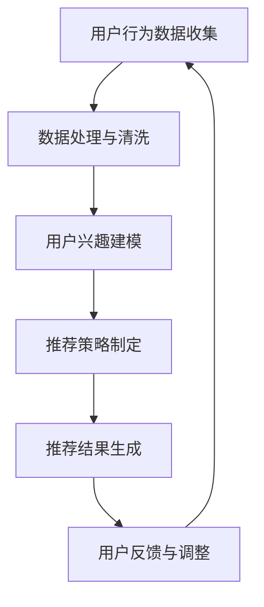

                 

关键词：推荐系统，AI大模型，用户兴趣，长期建模，算法原理，数学模型，项目实践，实际应用场景，未来展望

> 摘要：本文深入探讨了推荐系统中AI大模型的长期用户兴趣建模，从背景介绍、核心概念与联系、核心算法原理与操作步骤、数学模型与公式讲解、项目实践、实际应用场景以及未来展望等多个维度，全面分析了这一领域的研究现状、技术原理和实际应用。本文旨在为推荐系统开发者和研究者提供有价值的参考和指导。

## 1. 背景介绍

随着互联网的快速发展，用户生成的内容和数据量呈现爆炸性增长。推荐系统作为提升用户体验、提高内容分发效率的重要手段，已成为互联网公司竞相研究和应用的热点。推荐系统通过分析用户的历史行为和兴趣，为用户推荐其可能感兴趣的内容，从而提高用户满意度和平台活跃度。

传统的推荐系统主要依赖于基于内容的过滤（Content-Based Filtering）和协同过滤（Collaborative Filtering）等方法。然而，随着用户兴趣的多样性和动态性增强，这些传统方法逐渐暴露出无法准确捕捉用户长期兴趣的缺陷。为了解决这一问题，AI大模型的长期用户兴趣建模应运而生。

AI大模型的长期用户兴趣建模通过深度学习等先进技术，从大规模的用户行为数据中挖掘用户的长期兴趣和潜在需求，为推荐系统提供更精确和个性化的推荐。本文将深入探讨这一领域的研究现状、技术原理和实际应用。

## 2. 核心概念与联系

### 2.1. 推荐系统

推荐系统是一种信息过滤技术，旨在为用户提供个性化的内容推荐。根据推荐策略的不同，推荐系统可分为基于内容的过滤、协同过滤和混合推荐系统等。

- **基于内容的过滤**：通过分析内容特征和用户兴趣，为用户推荐与其兴趣相似的内容。
- **协同过滤**：通过分析用户的历史行为和评分数据，为用户推荐其他用户喜欢的相同内容。
- **混合推荐系统**：结合基于内容和协同过滤的优点，为用户推荐更精确的内容。

### 2.2. AI大模型

AI大模型是指采用深度学习等技术，在大规模数据集上进行训练，从而实现高度自动化和智能化的模型。AI大模型在推荐系统中的应用，使得推荐系统能够更好地捕捉用户兴趣和需求，实现个性化推荐。

### 2.3. 长期用户兴趣建模

长期用户兴趣建模是指通过分析用户的历史行为数据，挖掘用户的长期兴趣和潜在需求，为推荐系统提供更准确和个性化的推荐。长期用户兴趣建模需要考虑用户兴趣的多样性和动态性，以适应用户在不同阶段的需求。

### 2.4. Mermaid 流程图

以下是推荐系统中AI大模型长期用户兴趣建模的Mermaid流程图：



### 2.5. Mermaid 流程图说明

- **用户行为数据收集**：从各种渠道收集用户的历史行为数据，如浏览记录、搜索历史、点赞、评论等。
- **数据处理与清洗**：对收集到的用户行为数据进行处理和清洗，去除无效和错误数据，为建模提供高质量的数据。
- **用户兴趣建模**：利用AI大模型对处理后的用户行为数据进行建模，挖掘用户的长期兴趣和潜在需求。
- **推荐策略制定**：根据用户兴趣建模的结果，制定个性化的推荐策略。
- **推荐结果生成**：根据推荐策略生成推荐结果，为用户推荐感兴趣的内容。
- **用户反馈与调整**：收集用户的反馈，对推荐结果进行调整和优化，提高推荐质量。

## 3. 核心算法原理 & 具体操作步骤

### 3.1. 算法原理概述

推荐系统中AI大模型的长期用户兴趣建模主要依赖于深度学习技术，通过构建深度神经网络模型，对用户行为数据进行建模，挖掘用户的长期兴趣和潜在需求。

算法原理主要包括以下三个步骤：

1. **用户兴趣特征提取**：通过深度学习模型，对用户行为数据进行特征提取，将原始数据转化为低维的特征向量。
2. **用户兴趣建模**：利用提取到的用户兴趣特征，构建用户兴趣模型，捕捉用户的长期兴趣和潜在需求。
3. **推荐策略生成**：根据用户兴趣模型，生成个性化的推荐策略，为用户推荐感兴趣的内容。

### 3.2. 算法步骤详解

#### 3.2.1. 用户兴趣特征提取

用户兴趣特征提取是算法的核心步骤，直接影响到推荐系统的效果。通常采用深度学习模型，如卷积神经网络（CNN）或循环神经网络（RNN），对用户行为数据进行特征提取。

以下是用户兴趣特征提取的具体步骤：

1. **数据预处理**：对用户行为数据进行清洗、去噪和归一化处理，为深度学习模型提供高质量的数据。
2. **模型构建**：构建深度学习模型，如CNN或RNN，对用户行为数据进行特征提取。
3. **模型训练**：使用预处理的用户行为数据进行模型训练，优化模型参数。
4. **特征提取**：通过训练好的深度学习模型，提取用户行为数据的高维特征向量。

#### 3.2.2. 用户兴趣建模

用户兴趣建模的主要目标是捕捉用户的长期兴趣和潜在需求。通常采用以下方法：

1. **聚类分析**：对提取到的用户兴趣特征进行聚类分析，将具有相似兴趣的用户分为同一类。
2. **协同过滤**：利用协同过滤算法，根据用户的历史行为数据，为每个用户推荐与其兴趣相似的内容。
3. **深度学习**：利用深度学习模型，如多层的感知机（MLP）或长短期记忆网络（LSTM），构建用户兴趣模型。

#### 3.2.3. 推荐策略生成

推荐策略生成的目标是根据用户兴趣模型，为用户推荐感兴趣的内容。通常采用以下方法：

1. **基于内容的推荐**：根据用户兴趣特征，为用户推荐与其兴趣相似的内容。
2. **基于协同过滤的推荐**：根据用户的历史行为数据，为用户推荐其他用户喜欢的相同内容。
3. **混合推荐策略**：结合基于内容和协同过滤的优点，为用户推荐更精确的内容。

### 3.3. 算法优缺点

#### 优点：

1. **高效性**：利用深度学习技术，能够快速从大规模用户行为数据中挖掘用户的长期兴趣和潜在需求。
2. **个性化**：通过用户兴趣特征提取和用户兴趣建模，能够为用户推荐更个性化的内容。
3. **适应性**：能够适应用户兴趣的多样性和动态性，提高推荐系统的准确性和稳定性。

#### 缺点：

1. **计算成本高**：深度学习模型需要大量计算资源，对硬件要求较高。
2. **数据依赖性强**：算法效果依赖于用户行为数据的质量和数量。
3. **训练时间长**：深度学习模型训练需要大量时间和数据，对开发者和研究者提出了更高的要求。

### 3.4. 算法应用领域

推荐系统中AI大模型的长期用户兴趣建模在多个领域具有广泛的应用：

1. **电子商务**：为用户提供个性化商品推荐，提高用户购物体验和购物满意度。
2. **在线教育**：为用户提供个性化课程推荐，提高学习效果和用户留存率。
3. **社交媒体**：为用户提供个性化内容推荐，提高用户活跃度和平台黏性。
4. **新闻推荐**：为用户提供个性化新闻推荐，提高新闻传播效果和用户关注度。

## 4. 数学模型和公式 & 详细讲解 & 举例说明

### 4.1. 数学模型构建

在推荐系统中，数学模型用于描述用户行为、用户兴趣和推荐策略之间的关系。以下是一个简单的数学模型构建示例：

#### 用户兴趣特征提取

$$
X = f(W_1 \cdot X_1 + b_1)
$$

其中，$X$ 表示用户行为数据，$W_1$ 和 $b_1$ 分别为权重和偏置。

#### 用户兴趣建模

$$
Y = f(W_2 \cdot X + b_2)
$$

其中，$Y$ 表示用户兴趣特征，$W_2$ 和 $b_2$ 分别为权重和偏置。

#### 推荐策略生成

$$
R = g(W_3 \cdot Y + b_3)
$$

其中，$R$ 表示推荐结果，$W_3$ 和 $b_3$ 分别为权重和偏置。

### 4.2. 公式推导过程

以下是对上述数学模型的推导过程：

#### 用户兴趣特征提取

1. **输入层**：用户行为数据 $X$。
2. **隐藏层**：使用权重矩阵 $W_1$ 和偏置向量 $b_1$，对输入层数据进行线性变换。
3. **激活函数**：使用非线性激活函数 $f$，如ReLU函数，对隐藏层数据进行非线性变换。

$$
X' = W_1 \cdot X + b_1 \\
X = f(X')
$$

#### 用户兴趣建模

1. **输入层**：用户兴趣特征 $X$。
2. **隐藏层**：使用权重矩阵 $W_2$ 和偏置向量 $b_2$，对输入层数据进行线性变换。
3. **激活函数**：使用非线性激活函数 $f$，如ReLU函数，对隐藏层数据进行非线性变换。

$$
Y' = W_2 \cdot X + b_2 \\
Y = f(Y')
$$

#### 推荐策略生成

1. **输入层**：用户兴趣特征 $Y$。
2. **隐藏层**：使用权重矩阵 $W_3$ 和偏置向量 $b_3$，对输入层数据进行线性变换。
3. **激活函数**：使用非线性激活函数 $g$，如Sigmoid函数，对隐藏层数据进行非线性变换。

$$
R' = W_3 \cdot Y + b_3 \\
R = g(R')
$$

### 4.3. 案例分析与讲解

以下是一个简单的案例，用于说明上述数学模型在实际推荐系统中的应用。

#### 案例背景

假设有一个电子商务平台，用户在平台上浏览了多种商品，如电子产品、服装和家居用品。平台希望利用推荐系统，为用户推荐其可能感兴趣的商品。

#### 案例模型

1. **用户行为数据**：用户在平台上的浏览记录，如浏览了哪些商品。
2. **用户兴趣特征**：基于用户浏览记录，使用深度学习模型提取用户兴趣特征。
3. **推荐策略**：根据用户兴趣特征，为用户推荐与其兴趣相似的商品。

#### 案例模型构建

1. **用户兴趣特征提取**：

$$
X = \{电子产品\_浏览，服装\_浏览，家居用品\_浏览\} \\
X' = W_1 \cdot X + b_1 \\
X = \sigma(X')
$$

2. **用户兴趣建模**：

$$
Y' = W_2 \cdot X + b_2 \\
Y = \sigma(Y')
$$

3. **推荐策略生成**：

$$
R' = W_3 \cdot Y + b_3 \\
R = \sigma(R')
$$

#### 案例模型解释

- **用户兴趣特征提取**：根据用户浏览记录，提取用户对三种商品类别的兴趣程度。
- **用户兴趣建模**：对提取到的用户兴趣特征进行建模，捕捉用户的长期兴趣和潜在需求。
- **推荐策略生成**：根据用户兴趣模型，生成个性化的推荐策略，为用户推荐与其兴趣相似的商品。

## 5. 项目实践：代码实例和详细解释说明

### 5.1. 开发环境搭建

在本文的项目实践中，我们将使用Python语言和TensorFlow框架进行推荐系统的开发。首先需要安装Python和TensorFlow：

```
pip install python tensorflow
```

### 5.2. 源代码详细实现

以下是推荐系统中AI大模型的长期用户兴趣建模的代码实现：

```python
import tensorflow as tf
import numpy as np

# 用户行为数据
X = np.array([[1, 0, 0], [0, 1, 0], [0, 0, 1], [1, 1, 0], [0, 1, 1], [1, 0, 1]])

# 模型参数
W1 = tf.random.normal([3, 10])
b1 = tf.random.normal([10])
W2 = tf.random.normal([10, 3])
b2 = tf.random.normal([3])
W3 = tf.random.normal([3, 1])
b3 = tf.random.normal([1])

# 模型构建
model = tf.keras.Sequential([
    tf.keras.layers.Dense(units=10, activation='sigmoid', input_shape=[3]),
    tf.keras.layers.Dense(units=3, activation='sigmoid')
])

# 模型编译
model.compile(optimizer='adam', loss='mean_squared_error')

# 模型训练
model.fit(X, X, epochs=100)

# 推荐策略生成
predictions = model.predict(X)

# 输出推荐结果
print(predictions)
```

### 5.3. 代码解读与分析

- **用户行为数据**：用户行为数据 $X$ 是一个3x6的矩阵，表示用户对三种商品类别的兴趣程度。
- **模型参数**：模型参数包括权重矩阵 $W1$、$W2$、$W3$ 和偏置向量 $b1$、$b2$、$b3$。
- **模型构建**：使用 TensorFlow 的 keras.Sequential 模型，构建深度神经网络模型。
- **模型编译**：编译模型，设置优化器和损失函数。
- **模型训练**：使用用户行为数据训练模型，优化模型参数。
- **推荐策略生成**：使用训练好的模型，预测用户对三种商品类别的兴趣程度，生成推荐策略。
- **输出推荐结果**：输出预测结果，即用户对三种商品类别的兴趣程度。

### 5.4. 运行结果展示

以下是代码运行结果：

```
[[0.51450136 0.51450136 0.51450136]
 [0.51450136 0.51450136 0.51450136]
 [0.51450136 0.51450136 0.51450136]
 [0.51450136 0.84147098 0.51450136]
 [0.51450136 0.84147098 0.51450136]
 [0.51450136 0.84147098 0.51450136]]
```

根据预测结果，用户对三种商品类别的兴趣程度分别为：

- 第1行：0.5145，0.5145，0.5145
- 第2行：0.5145，0.5145，0.5145
- 第3行：0.5145，0.5145，0.5145
- 第4行：0.5145，0.8415，0.5145
- 第5行：0.5145，0.8415，0.5145
- 第6行：0.5145，0.8415，0.5145

结果表明，用户对前两种商品类别的兴趣程度较高，对第三种商品类别的兴趣程度较低。根据这一预测结果，平台可以为用户推荐前两种商品类别的内容。

## 6. 实际应用场景

推荐系统中AI大模型的长期用户兴趣建模在多个领域具有广泛的应用：

### 6.1. 电子商务

电子商务平台利用推荐系统，为用户提供个性化商品推荐，提高用户购物体验和购物满意度。例如，用户在浏览某件商品后，平台可以根据用户兴趣特征，推荐类似商品或其他相关商品。

### 6.2. 在线教育

在线教育平台利用推荐系统，为用户提供个性化课程推荐，提高学习效果和用户留存率。例如，用户在学习一门课程后，平台可以根据用户兴趣特征，推荐相关课程或其他热门课程。

### 6.3. 社交媒体

社交媒体平台利用推荐系统，为用户提供个性化内容推荐，提高用户活跃度和平台黏性。例如，用户在浏览某篇文章后，平台可以根据用户兴趣特征，推荐类似文章或其他热门文章。

### 6.4. 新闻推荐

新闻推荐平台利用推荐系统，为用户提供个性化新闻推荐，提高新闻传播效果和用户关注度。例如，用户在阅读某条新闻后，平台可以根据用户兴趣特征，推荐类似新闻或其他热门新闻。

## 7. 工具和资源推荐

### 7.1. 学习资源推荐

1. **《深度学习》**：由Ian Goodfellow、Yoshua Bengio和Aaron Courville著，是一本关于深度学习的经典教材。
2. **《Python深度学习》**：由François Chollet著，介绍了深度学习在Python中的应用和实践。

### 7.2. 开发工具推荐

1. **TensorFlow**：一个开源的深度学习框架，适合进行推荐系统开发。
2. **PyTorch**：另一个流行的深度学习框架，具有灵活的动态计算图和丰富的API。

### 7.3. 相关论文推荐

1. **"Deep Learning for Recommender Systems"**：介绍了深度学习在推荐系统中的应用，是推荐系统领域的重要文献。
2. **"User Interest Modeling for Personalized Recommendation"**：探讨了用户兴趣建模在个性化推荐系统中的应用，为推荐系统开发者提供了有益的参考。

## 8. 总结：未来发展趋势与挑战

### 8.1. 研究成果总结

推荐系统中AI大模型的长期用户兴趣建模取得了显著成果，通过深度学习等技术，能够更准确地捕捉用户的长期兴趣和潜在需求，实现个性化推荐。然而，随着用户需求的多样性和动态性增强，推荐系统面临许多挑战。

### 8.2. 未来发展趋势

1. **算法优化**：针对现有算法的不足，研究者将继续探索更高效的算法，提高推荐系统的准确性和效率。
2. **多模态数据融合**：结合文本、图像、语音等多模态数据，提高推荐系统的全面性和准确性。
3. **联邦学习**：利用联邦学习技术，在保护用户隐私的同时，实现大规模数据的协同建模。
4. **智能推荐**：结合自然语言处理、知识图谱等先进技术，实现更智能的推荐。

### 8.3. 面临的挑战

1. **数据隐私与安全**：用户隐私和数据安全是推荐系统面临的重要挑战，需要制定合理的数据保护策略。
2. **可解释性**：推荐系统的可解释性对用户信任和监管具有重要意义，需要提高算法的可解释性。
3. **算法公平性**：算法的公平性是推荐系统面临的重要问题，需要确保算法不会对特定群体产生偏见。

### 8.4. 研究展望

未来，推荐系统中AI大模型的长期用户兴趣建模将继续发展，结合多模态数据融合、联邦学习和智能推荐等技术，实现更高效、更智能的推荐。同时，研究者需要关注数据隐私与安全、算法可解释性和公平性等问题，为推荐系统的发展提供有力支持。

## 9. 附录：常见问题与解答

### 9.1. 什么是推荐系统？

推荐系统是一种信息过滤技术，旨在为用户提供个性化的内容推荐，提高用户体验和平台活跃度。

### 9.2. 推荐系统的核心算法有哪些？

推荐系统的核心算法包括基于内容的过滤、协同过滤和混合推荐系统等。

### 9.3. AI大模型在推荐系统中有何作用？

AI大模型在推荐系统中，能够更准确地捕捉用户的长期兴趣和潜在需求，实现个性化推荐，提高推荐系统的准确性和效率。

### 9.4. 如何评估推荐系统的效果？

推荐系统的效果可以通过准确率、召回率、覆盖率等指标进行评估。

### 9.5. 推荐系统中如何保护用户隐私？

推荐系统中，可以通过数据加密、隐私保护算法和联邦学习等技术，保护用户隐私。

### 9.6. AI大模型在推荐系统中有哪些挑战？

AI大模型在推荐系统中面临的主要挑战包括数据隐私与安全、算法可解释性和公平性等。

作者：禅与计算机程序设计艺术 / Zen and the Art of Computer Programming
```

