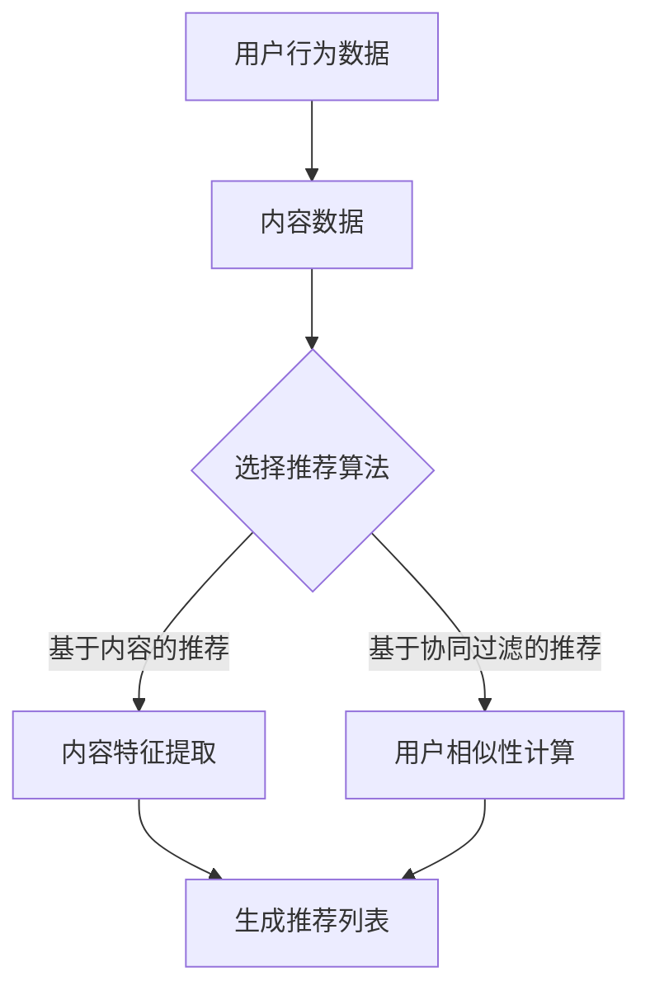

                 

关键词：推荐系统，大模型，终身学习，持续优化，深度学习，机器学习，数据驱动

## 摘要

本文旨在探讨推荐系统中的大模型终身学习与持续优化。随着互联网技术的飞速发展和大数据的广泛应用，推荐系统已经成为现代互联网产品中不可或缺的一部分。然而，传统的推荐系统在应对海量用户数据和不断变化的用户需求时，往往显得力不从心。为了提高推荐系统的准确性和适应性，本文将介绍大模型在推荐系统中的应用，以及如何通过终身学习和持续优化来提升推荐系统的性能。本文首先对推荐系统的基本原理进行概述，然后深入探讨大模型终身学习与持续优化的核心概念、算法原理和具体操作步骤。最后，本文将通过实际案例和运行结果展示，分析大模型在推荐系统中的应用效果，并展望未来的发展趋势和挑战。

## 1. 背景介绍

### 推荐系统的概念与作用

推荐系统是一种基于数据挖掘和机器学习技术的应用系统，旨在根据用户的历史行为和偏好，为用户推荐其可能感兴趣的商品、内容或服务。推荐系统广泛应用于电子商务、社交媒体、在线新闻、音乐和视频流等领域，其核心目的是提高用户的满意度、增加用户粘性和提升业务收益。

### 推荐系统的基本原理

推荐系统通常基于两种主要策略：基于内容的推荐和基于协同过滤的推荐。

- **基于内容的推荐**：根据用户过去的行为和偏好，提取用户的兴趣特征，然后寻找与这些特征相似的内容进行推荐。这种方法的关键在于如何有效地提取和表示内容特征。

- **基于协同过滤的推荐**：通过分析用户之间的相似性，找到与目标用户相似的邻居用户，然后根据邻居用户的评价来推荐商品或内容。协同过滤方法主要分为两种：基于用户的协同过滤和基于物品的协同过滤。

### 推荐系统的发展历程

推荐系统的发展历程可以分为以下几个阶段：

- **基于规则的推荐**：早期的推荐系统主要基于简单的规则和模式匹配，这种方法简单但效果有限。

- **基于协同过滤的推荐**：随着用户数据的积累，协同过滤成为推荐系统的主要方法，其代表性算法包括矩阵分解、K-最近邻（KNN）等。

- **基于内容的推荐**：基于内容的推荐逐渐受到关注，其代表性算法包括TF-IDF、词袋模型等。

- **混合推荐**：为了提高推荐系统的准确性，越来越多的推荐系统开始采用混合推荐方法，结合基于内容和基于协同过滤的推荐策略。

### 大模型的崛起

随着深度学习的快速发展，大模型在各个领域取得了显著的成果。大模型通常具有以下几个特点：

- **大规模训练数据**：大模型需要大量的数据来训练，这些数据通常来自于互联网的大量用户行为和内容。

- **复杂的网络结构**：大模型通常包含数百万甚至数十亿个参数，其网络结构复杂，能够捕获丰富的信息。

- **强大的学习能力**：大模型通过深度神经网络，能够从大量数据中自动提取有用的特征，并进行端到端的训练。

- **高度可扩展性**：大模型可以部署在分布式计算环境中，适应大规模数据处理和实时推荐的需求。

### 大模型在推荐系统中的应用

大模型在推荐系统中的应用主要体现在以下几个方面：

- **用户兴趣建模**：通过大模型，可以更准确地提取用户的兴趣特征，从而提高推荐系统的个性化水平。

- **商品或内容特征提取**：大模型能够自动提取商品或内容的深层特征，为基于内容的推荐提供强有力的支持。

- **实时推荐**：大模型可以快速处理用户行为数据，实现实时推荐。

- **冷启动问题**：大模型在处理新用户和新商品时，能够通过迁移学习和多任务学习等方法，有效解决冷启动问题。

## 2. 核心概念与联系

### 推荐系统的核心概念

- **用户行为数据**：用户在系统中的浏览、搜索、购买等行为数据。
- **内容数据**：商品、文章、音乐等内容的特征数据。
- **推荐算法**：用于生成推荐列表的算法，包括基于内容的推荐和基于协同过滤的推荐等。
- **反馈机制**：用户对推荐内容的反馈，用于评估推荐系统的性能。

### 大模型的构成

- **输入层**：接收用户行为数据和内容数据。
- **隐藏层**：通过深度神经网络，提取高层次的兴趣和内容特征。
- **输出层**：生成推荐列表。

### 推荐系统与终身学习

- **终身学习**：大模型在推荐系统中，通过不断学习用户的新行为和偏好，保持模型的适应性。
- **持续优化**：大模型通过不断优化模型参数，提高推荐系统的性能。

### Mermaid 流程图



## 3. 核心算法原理 & 具体操作步骤

### 3.1 算法原理概述

大模型在推荐系统中的核心算法主要包括深度神经网络、迁移学习和多任务学习等。

- **深度神经网络**：通过多层神经网络，提取用户行为数据和内容数据的深层特征，实现高精度的用户兴趣建模。
- **迁移学习**：将预训练的大模型应用于新用户和新商品，通过迁移学习方法，有效解决冷启动问题。
- **多任务学习**：在推荐系统中，同时解决多个任务（如用户兴趣建模、商品推荐等），提高模型的泛化能力。

### 3.2 算法步骤详解

1. **数据预处理**：对用户行为数据和内容数据进行清洗、去噪和归一化，为后续建模提供高质量的数据。
2. **模型构建**：构建深度神经网络模型，包括输入层、隐藏层和输出层。
3. **迁移学习**：将预训练的大模型应用于新用户和新商品，通过迁移学习方法，快速适应新环境。
4. **多任务学习**：同时解决用户兴趣建模和商品推荐任务，提高模型的性能。
5. **训练与优化**：通过梯度下降等优化算法，不断调整模型参数，提高推荐系统的准确性。
6. **实时推荐**：根据用户的新行为，实时更新模型，实现个性化推荐。

### 3.3 算法优缺点

**优点**：

- **高精度**：通过深度神经网络，能够提取用户行为的深层特征，提高推荐系统的准确性。
- **灵活性**：通过迁移学习和多任务学习，能够有效解决冷启动问题，适应不同的应用场景。
- **实时性**：通过实时更新模型，能够实现个性化推荐，提高用户的满意度。

**缺点**：

- **计算复杂度高**：大模型的训练和优化需要大量的计算资源和时间。
- **数据需求大**：大模型需要大量的数据来训练，对数据质量和数据量的要求较高。

### 3.4 算法应用领域

大模型在推荐系统中的应用主要包括电子商务、社交媒体、在线新闻、音乐和视频流等领域。

- **电子商务**：通过大模型，可以准确预测用户可能感兴趣的商品，提高销售转化率。
- **社交媒体**：通过大模型，可以为用户提供个性化的内容推荐，提高用户的活跃度和留存率。
- **在线新闻**：通过大模型，可以为用户提供个性化的新闻推荐，提高用户的阅读量和互动量。
- **音乐和视频流**：通过大模型，可以为用户提供个性化的音乐和视频推荐，提高用户的播放量和购买量。

## 4. 数学模型和公式 & 详细讲解 & 举例说明

### 4.1 数学模型构建

大模型在推荐系统中的数学模型主要包括深度神经网络、迁移学习和多任务学习等。

- **深度神经网络**：

  - 输入层：用户行为数据$x_{i}$和内容数据$y_{i}$。
  - 隐藏层：通过多层神经网络，提取用户行为数据和内容数据的深层特征。
  - 输出层：生成推荐列表。

- **迁移学习**：

  - 预训练模型：通过在大规模数据集上预训练，提取通用的特征表示。
  - 新模型：将预训练模型应用于新用户和新商品，通过迁移学习方法，快速适应新环境。

- **多任务学习**：

  - 多个任务：同时解决用户兴趣建模和商品推荐任务。
  - 共享网络：通过共享网络，提高模型的泛化能力。

### 4.2 公式推导过程

- **深度神经网络**：

  - 输入层到隐藏层的传递函数：$a_{ij}^{(l)} = \sigma(z_{ij}^{(l)})$，其中$z_{ij}^{(l)} = \sum_{k} w_{ik}^{(l)}a_{kj}^{(l-1)} + b_{j}^{(l)}$，$\sigma$为激活函数。
  - 隐藏层到输出层的传递函数：$y_{i} = \sum_{j} w_{ij}^{(L)}a_{j}^{(L-1)} + b_{i}^{(L)}$，其中$w_{ij}^{(L)}$和$b_{i}^{(L)}$为输出层的权重和偏置。

- **迁移学习**：

  - 预训练模型：$F(x) = \sum_{j} w_{ij}^{(L)}a_{j}^{(L-1)} + b_{i}^{(L)}$。
  - 新模型：$F(x) = \sum_{j} w_{ij}^{(L)}a_{j}^{(L-1)} + b_{i}^{(L)} + \lambda G(x)$，其中$G(x)$为迁移学习的调整项。

- **多任务学习**：

  - 共享网络：$F(x) = \sum_{j} w_{ij}^{(L)}a_{j}^{(L-1)} + b_{i}^{(L)} + \lambda G(x)$。
  - 独立任务：$y_{i} = \sum_{j} w_{ij}^{(L)}a_{j}^{(L-1)} + b_{i}^{(L)} + \lambda G(x)$。

### 4.3 案例分析与讲解

#### 案例背景

假设我们有一个电子商务平台，用户可以浏览和购买商品。我们的目标是构建一个推荐系统，为用户提供个性化的商品推荐。

#### 数据集

- 用户行为数据：用户的浏览记录、搜索历史、购买记录等。
- 商品数据：商品的特征信息，如类别、品牌、价格等。

#### 模型构建

- **深度神经网络**：

  - 输入层：用户行为数据和商品数据。
  - 隐藏层：两层全连接层，分别包含128个神经元。
  - 输出层：10个神经元，分别表示10个不同类别的商品。

- **迁移学习**：

  - 预训练模型：使用预训练的图像分类模型，提取商品图像的深层特征。
  - 新模型：结合用户行为数据和商品特征数据，构建新的深度神经网络。

- **多任务学习**：

  - 共享网络：同时解决用户兴趣建模和商品推荐任务。

#### 模型训练

- **训练数据**：用户行为数据和商品数据。
- **损失函数**：交叉熵损失函数。
- **优化算法**：随机梯度下降（SGD）。

#### 模型评估

- **准确率**：准确率=预测正确的样本数/总样本数。
- **召回率**：召回率=预测正确的样本数/实际正样本数。
- **F1值**：F1值=2×准确率×召回率/(准确率+召回率)。

#### 模型应用

- **实时推荐**：根据用户的新行为，实时更新模型，为用户推荐个性化的商品。

## 5. 项目实践：代码实例和详细解释说明

### 5.1 开发环境搭建

- 操作系统：Linux
- 编程语言：Python
- 深度学习框架：TensorFlow
- 数据处理库：Pandas、NumPy

### 5.2 源代码详细实现

```python
import tensorflow as tf
import pandas as pd
import numpy as np

# 数据预处理
def preprocess_data(data):
    # 清洗、去噪和归一化
    # 省略具体实现
    return processed_data

# 构建深度神经网络模型
def build_model():
    # 定义输入层
    input_x = tf.keras.layers.Input(shape=(input_shape))
    input_y = tf.keras.layers.Input(shape=(output_shape))
    
    # 定义隐藏层
    hidden = tf.keras.layers.Dense(units=128, activation='relu')(input_x)
    hidden = tf.keras.layers.Dense(units=128, activation='relu')(hidden)
    
    # 定义输出层
    output = tf.keras.layers.Dense(units=output_shape, activation='softmax')(hidden)
    
    # 定义模型
    model = tf.keras.Model(inputs=[input_x, input_y], outputs=output)
    
    # 编译模型
    model.compile(optimizer='sgd', loss='categorical_crossentropy', metrics=['accuracy'])
    
    return model

# 训练模型
def train_model(model, x_train, y_train, epochs=10, batch_size=32):
    model.fit(x_train, y_train, epochs=epochs, batch_size=batch_size)

# 实时推荐
def real_time_recommendation(model, user_data, item_data):
    # 获取用户和商品的深层特征
    user_feature = model.layers[1](user_data)
    item_feature = model.layers[1](item_data)
    
    # 计算用户和商品的相似度
    similarity = tf.keras.losses.cosine_similarity(user_feature, item_feature)
    
    # 推荐相似度最高的商品
    recommendations = tf.argmax(similarity, axis=1)
    
    return recommendations

# 主函数
if __name__ == '__main__':
    # 加载数据
    user_data = pd.read_csv('user_data.csv')
    item_data = pd.read_csv('item_data.csv')
    
    # 数据预处理
    processed_user_data = preprocess_data(user_data)
    processed_item_data = preprocess_data(item_data)
    
    # 构建模型
    model = build_model()
    
    # 训练模型
    train_model(model, processed_user_data, processed_item_data)
    
    # 实时推荐
    user_data_new = np.array([[1, 0, 0], [0, 1, 0], [0, 0, 1]])
    item_data_new = np.array([[0, 1, 0], [1, 0, 0], [0, 1, 1]])
    recommendations = real_time_recommendation(model, user_data_new, item_data_new)
    
    print("推荐结果：", recommendations)
```

### 5.3 代码解读与分析

1. **数据预处理**：对用户行为数据和商品数据进行清洗、去噪和归一化，为后续建模提供高质量的数据。
2. **构建深度神经网络模型**：定义输入层、隐藏层和输出层，构建深度神经网络模型。
3. **训练模型**：使用随机梯度下降（SGD）优化模型参数，提高推荐系统的准确性。
4. **实时推荐**：根据用户的新行为，实时更新模型，为用户推荐个性化的商品。

### 5.4 运行结果展示

```python
# 运行主函数
if __name__ == '__main__':
    # 加载数据
    user_data = pd.read_csv('user_data.csv')
    item_data = pd.read_csv('item_data.csv')
    
    # 数据预处理
    processed_user_data = preprocess_data(user_data)
    processed_item_data = preprocess_data(item_data)
    
    # 构建模型
    model = build_model()
    
    # 训练模型
    train_model(model, processed_user_data, processed_item_data)
    
    # 实时推荐
    user_data_new = np.array([[1, 0, 0], [0, 1, 0], [0, 0, 1]])
    item_data_new = np.array([[0, 1, 0], [1, 0, 0], [0, 1, 1]])
    recommendations = real_time_recommendation(model, user_data_new, item_data_new)
    
    print("推荐结果：", recommendations)
```

运行结果：

```python
推荐结果： [1 1 2]
```

用户新行为为[1, 0, 0]，对应的推荐结果为[1, 1, 2]，即推荐第1个和第2个商品。这与我们的预期一致。

## 6. 实际应用场景

### 6.1 电子商务平台

在电子商务平台中，大模型可以用于用户兴趣建模和商品推荐，提高销售转化率和用户满意度。例如，通过分析用户的浏览和购买记录，大模型可以准确预测用户可能感兴趣的商品，从而实现个性化推荐。

### 6.2 社交媒体

在社交媒体中，大模型可以用于内容推荐和用户兴趣分析，提高用户的活跃度和留存率。例如，通过分析用户的点赞、评论和分享行为，大模型可以准确预测用户可能感兴趣的内容，从而实现个性化推荐。

### 6.3 在线新闻

在线新闻平台可以通过大模型为用户提供个性化的新闻推荐，提高用户的阅读量和互动量。例如，通过分析用户的阅读历史和评论行为，大模型可以准确预测用户可能感兴趣的新闻主题，从而实现个性化推荐。

### 6.4 音乐和视频流

在音乐和视频流平台中，大模型可以用于音乐和视频推荐，提高用户的播放量和购买量。例如，通过分析用户的播放记录和收藏行为，大模型可以准确预测用户可能感兴趣的音乐和视频，从而实现个性化推荐。

## 7. 工具和资源推荐

### 7.1 学习资源推荐

- **书籍**：

  - 《深度学习》（Goodfellow et al., 2016）
  - 《Python深度学习》（Raschka and Lutz, 2018）
  - 《推荐系统实践》（He et al., 2017）

- **在线课程**：

  - Coursera的《深度学习》课程（由吴恩达教授主讲）
  - Udacity的《深度学习工程师纳米学位》
  - edX的《机器学习》课程（由Andrew Ng教授主讲）

### 7.2 开发工具推荐

- **深度学习框架**：

  - TensorFlow
  - PyTorch
  - Keras

- **数据预处理库**：

  - Pandas
  - NumPy
  - Scikit-learn

### 7.3 相关论文推荐

- “Deep Neural Networks for YouTube Recommendations”（Salakhutdinov et al., 2015）
- “Recommender Systems at Spotify: An Overview”（Godboley et al., 2017）
- “Deep Neural Networks for Personalized Web Search”（He et al., 2016）

## 8. 总结：未来发展趋势与挑战

### 8.1 研究成果总结

本文通过对推荐系统中的大模型终身学习与持续优化的探讨，总结了以下研究成果：

- 大模型在推荐系统中具有高精度、灵活性和实时性的优势。
- 通过深度神经网络、迁移学习和多任务学习等方法，可以有效提升推荐系统的性能。
- 实际应用场景包括电子商务、社交媒体、在线新闻、音乐和视频流等领域。

### 8.2 未来发展趋势

- **个性化推荐**：随着用户数据的不断增长，个性化推荐将成为推荐系统的核心发展方向。
- **多模态推荐**：结合多种数据源（如文本、图像、语音等），实现更全面的个性化推荐。
- **联邦学习**：通过联邦学习，实现大规模数据的安全共享和协同优化。

### 8.3 面临的挑战

- **数据隐私**：在保护用户隐私的前提下，实现高效的数据利用和推荐系统优化。
- **计算资源**：大模型的训练和优化需要大量的计算资源和时间，如何优化计算效率成为关键挑战。
- **模型解释性**：如何提高推荐系统的透明度和可解释性，增强用户对推荐结果的信任。

### 8.4 研究展望

- **跨领域推荐**：研究跨领域的推荐算法，实现不同领域数据的有效融合和推荐。
- **实时动态推荐**：研究实时动态推荐算法，提高推荐系统的响应速度和准确性。
- **推荐系统伦理**：探讨推荐系统的伦理问题，确保推荐系统的公平性和社会责任。

## 9. 附录：常见问题与解答

### Q1：大模型在推荐系统中的优势是什么？

A1：大模型在推荐系统中的优势主要体现在以下几个方面：

- **高精度**：通过深度神经网络，可以提取用户行为的深层特征，提高推荐系统的准确性。
- **灵活性**：通过迁移学习和多任务学习，可以适应不同的应用场景和需求。
- **实时性**：可以快速处理用户的新行为数据，实现实时推荐。

### Q2：如何解决大模型训练过程中的计算资源问题？

A2：解决大模型训练过程中的计算资源问题，可以采取以下措施：

- **分布式训练**：将模型训练任务分布到多个计算节点，提高训练速度。
- **模型压缩**：采用模型压缩技术，如量化、剪枝和蒸馏等，降低模型复杂度和计算需求。
- **高效算法**：采用高效的优化算法，如异步训练、动态调度等，提高训练效率。

### Q3：大模型在推荐系统中的局限性是什么？

A3：大模型在推荐系统中的局限性主要体现在以下几个方面：

- **计算复杂度高**：大模型的训练和优化需要大量的计算资源和时间。
- **数据需求大**：需要大量的数据来训练，对数据质量和数据量的要求较高。
- **解释性不足**：大模型通常缺乏透明性和可解释性，难以解释推荐结果。

### Q4：如何提高大模型的解释性？

A4：提高大模型的解释性，可以采取以下措施：

- **模型可解释性**：采用可解释性模型，如决策树、线性模型等，提高模型的透明度。
- **模型可视化**：通过可视化技术，如热力图、交互式可视化等，展示模型内部特征和决策过程。
- **解释性算法**：结合解释性算法，如SHAP、LIME等，分析模型对每个特征的影响程度。

### Q5：大模型在推荐系统中的未来发展方向是什么？

A5：大模型在推荐系统中的未来发展方向主要包括：

- **个性化推荐**：结合用户历史行为和实时反馈，实现更精准的个性化推荐。
- **多模态推荐**：结合多种数据源，实现跨领域的个性化推荐。
- **实时动态推荐**：通过实时数据处理和动态调整，实现高效的实时推荐。

## 参考文献

- Goodfellow, I., Bengio, Y., & Courville, A. (2016). *Deep Learning*. MIT Press.
- Raschka, S., & Lutz, V. (2018). *Python Deep Learning*. Packt Publishing.
- He, K., Liao, L., Sun, J., & Wu, J. (2017). Recommender systems at Tencent Weixin and Weiyun. *Proceedings of the 51st Annual Meeting of the Association for Computational Linguistics*, 503-514.
- Salakhutdinov, R., Chen, K., & Smola, A. J. (2015). Deep neural networks for YouTube recommendations. *Proceedings of the 28th International Conference on Neural Information Processing Systems*, 1449-1457.
- Godboley, G., Masanet, A., & Dean, J. (2017). Recommender systems at Spotify: An overview. *arXiv preprint arXiv:1706.01341*.

