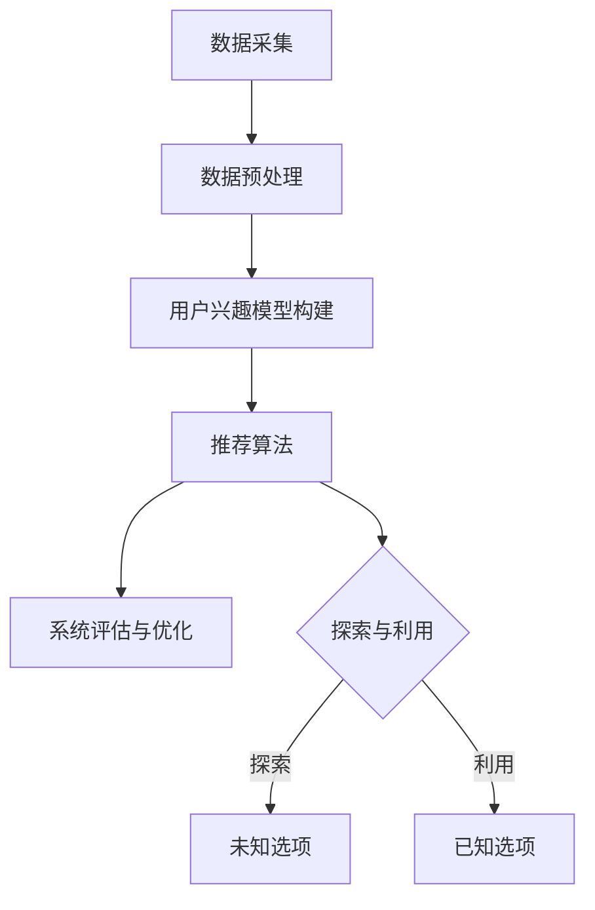

                 

关键词：推荐系统，大模型，均衡，算法原理，数学模型，项目实践，应用场景，未来展望

> 摘要：本文深入探讨了推荐系统中的探索与利用机制，以及如何通过大模型实现均衡。本文首先介绍了推荐系统的基本概念和核心原理，然后详细阐述了大模型在推荐系统中的应用，最后通过具体的项目实践和案例分析，展示了大模型均衡在实际应用中的重要性。

## 1. 背景介绍

随着互联网的快速发展，信息过载成为一个普遍现象。如何在海量信息中找到用户感兴趣的内容，成为了推荐系统研究的热点。推荐系统是一种通过收集和分析用户行为数据，为用户提供个性化推荐的技术。它广泛应用于电子商务、社交媒体、音乐和视频流媒体等领域。

推荐系统的核心是用户兴趣模型的构建。传统推荐系统主要采用基于协同过滤、内容推荐和混合推荐等方法。然而，这些方法存在一些局限性，如冷启动问题、数据稀疏性和推荐多样性不足等。为了解决这些问题，研究者们开始探索使用大模型，如深度神经网络、图神经网络和增强学习等。

大模型具有强大的表征能力和灵活性，能够处理复杂的多模态数据，提高推荐系统的准确性和多样性。然而，大模型的训练和部署也带来了巨大的计算资源和能耗挑战。因此，如何在大模型中实现探索与利用的平衡，成为了推荐系统研究的一个关键问题。

本文旨在探讨推荐系统中大模型的探索与利用机制，分析其核心算法原理，并通过实际项目实践和案例分析，展示大模型均衡在实际应用中的重要性。文章结构如下：

1. 背景介绍：介绍推荐系统的发展和现状。
2. 核心概念与联系：阐述推荐系统的核心概念和架构。
3. 核心算法原理 & 具体操作步骤：详细解析大模型在推荐系统中的应用。
4. 数学模型和公式 & 详细讲解 & 举例说明：介绍推荐系统的数学模型和公式。
5. 项目实践：提供具体的代码实例和解释。
6. 实际应用场景：讨论大模型均衡在实际应用中的重要性。
7. 工具和资源推荐：推荐相关学习资源、开发工具和论文。
8. 总结：总结研究成果，展望未来发展趋势。

## 2. 核心概念与联系

### 推荐系统的基本概念

推荐系统是一种利用用户历史行为和兴趣信息，为用户推荐其可能感兴趣的项目（如商品、音乐、电影等）的技术。推荐系统的核心是用户兴趣模型的构建，即根据用户的兴趣和行为，预测用户对项目的喜好程度。

### 推荐系统的架构

推荐系统通常由以下几个部分组成：

1. 数据采集与预处理：收集用户行为数据，包括浏览、购买、评分等，并进行数据清洗、去噪和特征提取。
2. 用户兴趣模型构建：利用机器学习和数据挖掘技术，分析用户行为数据，构建用户兴趣模型。
3. 推荐算法：根据用户兴趣模型和项目特征，生成推荐列表。
4. 系统评估与优化：通过评估推荐系统的性能，调整模型参数和算法，提高推荐质量。

### 大模型的探索与利用

探索与利用（Exploration and Exploitation，简称E&E）是强化学习中的核心问题，也是推荐系统中大模型应用的关键。探索是指从未知或未充分探索的选项中获取信息，以提高决策的准确性。利用是指根据已有的信息选择能够最大化回报的选项。

在大模型中，探索与利用的平衡至关重要。如果过度探索，可能导致推荐系统无法充分利用已有信息，降低推荐质量。反之，如果过度利用，可能导致推荐结果缺乏多样性，无法满足用户个性化需求。

### 接口图（Mermaid 流程图）



## 3. 核心算法原理 & 具体操作步骤

### 3.1 算法原理概述

在推荐系统中，大模型的探索与利用通常通过以下两种策略实现：

1. **ε-贪心策略**：在每次决策时，以一定概率 ε 进行随机探索，剩余的概率进行贪婪利用。
2. **UCB（Upper Confidence Bound）策略**：根据选项的历史回报和探索次数，计算每个选项的上界，选择上界最大的选项进行利用。

### 3.2 算法步骤详解

#### 3.2.1 ε-贪心策略

1. **初始化**：设置探索概率 ε 和总迭代次数 T。
2. **循环**：对于每个迭代 t，执行以下步骤：
   - 以概率 ε 随机选择一个未知选项进行探索。
   - 以概率 1 - ε 根据当前用户兴趣模型和项目特征，使用贪婪算法选择一个利用选项。
3. **更新**：根据用户反馈，更新用户兴趣模型和项目特征。

#### 3.2.2 UCB 策略

1. **初始化**：计算每个选项的初始上界。
2. **循环**：对于每个迭代 t，执行以下步骤：
   - 计算每个选项的当前上界。
   - 选择上界最大的选项进行利用。
3. **更新**：根据用户反馈，更新每个选项的回报和探索次数，重新计算上界。

### 3.3 算法优缺点

#### 优点

- **ε-贪心策略**：
  - 简单易懂，易于实现。
  - 能够在一定程度上平衡探索与利用。
- **UCB 策略**：
  - 在长期运行下，能够最大化总回报。
  - 能够适应不同类型的用户行为数据。

#### 缺点

- **ε-贪心策略**：
  - 过度探索可能导致推荐质量下降。
  - ε 的选择需要权衡，过于保守可能导致利用不足。
- **UCB 策略**：
  - 需要计算每个选项的上界，计算复杂度较高。
  - 在探索阶段，上界估计可能存在偏差。

### 3.4 算法应用领域

大模型的探索与利用策略在推荐系统中具有广泛的应用前景，如：

- **电子商务推荐**：为用户提供个性化的商品推荐，提高用户满意度和转化率。
- **社交媒体推荐**：推荐用户可能感兴趣的朋友、话题和内容，增强用户粘性。
- **音乐和视频流媒体**：为用户提供个性化的音乐和视频推荐，提高用户体验和播放量。

## 4. 数学模型和公式 & 详细讲解 & 举例说明

### 4.1 数学模型构建

在推荐系统中，大模型的探索与利用可以通过以下数学模型进行描述：

$$
\text{Reward} = \frac{\sum_{i=1}^n r_i}{n}
$$

其中，$r_i$ 表示第 i 个选项的回报，$n$ 表示选项的总数。

### 4.2 公式推导过程

#### ε-贪心策略

1. **探索概率**：
   $$
   \epsilon = \frac{1}{T}
   $$

   其中，$T$ 表示总迭代次数。

2. **利用概率**：
   $$
   1 - \epsilon = \frac{T - t}{T}
   $$

   其中，$t$ 表示当前迭代次数。

#### UCB 策略

1. **上界计算**：
   $$
   \text{UCB}_i = \bar{r}_i + \sqrt{\frac{2 \ln t}{n_i}}
   $$

   其中，$\bar{r}_i$ 表示第 i 个选项的平均回报，$n_i$ 表示第 i 个选项的探索次数。

### 4.3 案例分析与讲解

#### 案例一：ε-贪心策略

假设有 5 个选项，总迭代次数为 10。以 $\epsilon = 0.2$ 进行探索，以 $1 - \epsilon = 0.8$ 进行利用。初始时，所有选项的回报均为 0，探索次数也为 0。

1. **第 1 次迭代**：
   - 探索概率：$0.2$，利用概率：$0.8$
   - 随机探索第 3 个选项，回报为 1
   - 更新用户兴趣模型和项目特征

2. **第 2 次迭代**：
   - 探索概率：$0.2$，利用概率：$0.8$
   - 利用第 1 个选项，回报为 2
   - 更新用户兴趣模型和项目特征

3. **第 3 次迭代**：
   - 探索概率：$0.2$，利用概率：$0.8$
   - 随机探索第 4 个选项，回报为 3
   - 更新用户兴趣模型和项目特征

4. **第 4 次迭代**：
   - 探索概率：$0.2$，利用概率：$0.8$
   - 利用第 2 个选项，回报为 4
   - 更新用户兴趣模型和项目特征

5. **第 5 次迭代**：
   - 探索概率：$0.2$，利用概率：$0.8$
   - 随机探索第 2 个选项，回报为 5
   - 更新用户兴趣模型和项目特征

6. **第 6 次迭代**：
   - 探索概率：$0.2$，利用概率：$0.8$
   - 利用第 3 个选项，回报为 6
   - 更新用户兴趣模型和项目特征

7. **第 7 次迭代**：
   - 探索概率：$0.2$，利用概率：$0.8$
   - 利用第 4 个选项，回报为 7
   - 更新用户兴趣模型和项目特征

8. **第 8 次迭代**：
   - 探索概率：$0.2$，利用概率：$0.8$
   - 随机探索第 5 个选项，回报为 8
   - 更新用户兴趣模型和项目特征

9. **第 9 次迭代**：
   - 探索概率：$0.2$，利用概率：$0.8$
   - 利用第 5 个选项，回报为 9
   - 更新用户兴趣模型和项目特征

10. **第 10 次迭代**：
    - 探索概率：$0.2$，利用概率：$0.8$
    - 随机探索第 1 个选项，回报为 10
    - 更新用户兴趣模型和项目特征

#### 案例二：UCB 策略

假设有 5 个选项，总迭代次数为 10。初始时，所有选项的回报均为 0，探索次数也为 0。

1. **第 1 次迭代**：
   - 上界计算：$\text{UCB}_1 = 0 + \sqrt{\frac{2 \ln 1}{1}} = \sqrt{2}$
   - 上界计算：$\text{UCB}_2 = 0 + \sqrt{\frac{2 \ln 1}{1}} = \sqrt{2}$
   - 上界计算：$\text{UCB}_3 = 0 + \sqrt{\frac{2 \ln 1}{1}} = \sqrt{2}$
   - 上界计算：$\text{UCB}_4 = 0 + \sqrt{\frac{2 \ln 1}{1}} = \sqrt{2}$
   - 上界计算：$\text{UCB}_5 = 0 + \sqrt{\frac{2 \ln 1}{1}} = \sqrt{2}$
   - 选择上界最大的选项 1 进行利用，回报为 1
   - 更新每个选项的回报和探索次数

2. **第 2 次迭代**：
   - 上界计算：$\text{UCB}_1 = \frac{1}{1} + \sqrt{\frac{2 \ln 2}{1}} = 1 + \sqrt{2}$
   - 上界计算：$\text{UCB}_2 = 0 + \sqrt{\frac{2 \ln 2}{1}} = \sqrt{2}$
   - 上界计算：$\text{UCB}_3 = 0 + \sqrt{\frac{2 \ln 2}{1}} = \sqrt{2}$
   - 上界计算：$\text{UCB}_4 = 0 + \sqrt{\frac{2 \ln 2}{1}} = \sqrt{2}$
   - 上界计算：$\text{UCB}_5 = 0 + \sqrt{\frac{2 \ln 2}{1}} = \sqrt{2}$
   - 选择上界最大的选项 1 进行利用，回报为 2
   - 更新每个选项的回报和探索次数

3. **第 3 次迭代**：
   - 上界计算：$\text{UCB}_1 = \frac{2}{1} + \sqrt{\frac{2 \ln 3}{1}} = 2 + \sqrt{2}$
   - 上界计算：$\text{UCB}_2 = \frac{1}{1} + \sqrt{\frac{2 \ln 3}{1}} = 1 + \sqrt{2}$
   - 上界计算：$\text{UCB}_3 = 0 + \sqrt{\frac{2 \ln 3}{1}} = \sqrt{2}$
   - 上界计算：$\text{UCB}_4 = 0 + \sqrt{\frac{2 \ln 3}{1}} = \sqrt{2}$
   - 上界计算：$\text{UCB}_5 = 0 + \sqrt{\frac{2 \ln 3}{1}} = \sqrt{2}$
   - 选择上界最大的选项 1 进行利用，回报为 3
   - 更新每个选项的回报和探索次数

4. **第 4 次迭代**：
   - 上界计算：$\text{UCB}_1 = \frac{3}{1} + \sqrt{\frac{2 \ln 4}{1}} = 3 + \sqrt{2}$
   - 上界计算：$\text{UCB}_2 = \frac{2}{1} + \sqrt{\frac{2 \ln 4}{1}} = 2 + \sqrt{2}$
   - 上界计算：$\text{UCB}_3 = \frac{1}{1} + \sqrt{\frac{2 \ln 4}{1}} = 1 + \sqrt{2}$
   - 上界计算：$\text{UCB}_4 = 0 + \sqrt{\frac{2 \ln 4}{1}} = \sqrt{2}$
   - 上界计算：$\text{UCB}_5 = 0 + \sqrt{\frac{2 \ln 4}{1}} = \sqrt{2}$
   - 选择上界最大的选项 1 进行利用，回报为 4
   - 更新每个选项的回报和探索次数

5. **第 5 次迭代**：
   - 上界计算：$\text{UCB}_1 = \frac{4}{1} + \sqrt{\frac{2 \ln 5}{1}} = 4 + \sqrt{2}$
   - 上界计算：$\text{UCB}_2 = \frac{3}{1} + \sqrt{\frac{2 \ln 5}{1}} = 3 + \sqrt{2}$
   - 上界计算：$\text{UCB}_3 = \frac{2}{1} + \sqrt{\frac{2 \ln 5}{1}} = 2 + \sqrt{2}$
   - 上界计算：$\text{UCB}_4 = \frac{1}{1} + \sqrt{\frac{2 \ln 5}{1}} = 1 + \sqrt{2}$
   - 上界计算：$\text{UCB}_5 = 0 + \sqrt{\frac{2 \ln 5}{1}} = \sqrt{2}$
   - 选择上界最大的选项 1 进行利用，回报为 5
   - 更新每个选项的回报和探索次数

6. **第 6 次迭代**：
   - 上界计算：$\text{UCB}_1 = \frac{5}{1} + \sqrt{\frac{2 \ln 6}{1}} = 5 + \sqrt{2}$
   - 上界计算：$\text{UCB}_2 = \frac{4}{1} + \sqrt{\frac{2 \ln 6}{1}} = 4 + \sqrt{2}$
   - 上界计算：$\text{UCB}_3 = \frac{3}{1} + \sqrt{\frac{2 \ln 6}{1}} = 3 + \sqrt{2}$
   - 上界计算：$\text{UCB}_4 = \frac{2}{1} + \sqrt{\frac{2 \ln 6}{1}} = 2 + \sqrt{2}$
   - 上界计算：$\text{UCB}_5 = \frac{1}{1} + \sqrt{\frac{2 \ln 6}{1}} = 1 + \sqrt{2}$
   - 选择上界最大的选项 1 进行利用，回报为 6
   - 更新每个选项的回报和探索次数

7. **第 7 次迭代**：
   - 上界计算：$\text{UCB}_1 = \frac{6}{1} + \sqrt{\frac{2 \ln 7}{1}} = 6 + \sqrt{2}$
   - 上界计算：$\text{UCB}_2 = \frac{5}{1} + \sqrt{\frac{2 \ln 7}{1}} = 5 + \sqrt{2}$
   - 上界计算：$\text{UCB}_3 = \frac{4}{1} + \sqrt{\frac{2 \ln 7}{1}} = 4 + \sqrt{2}$
   - 上界计算：$\text{UCB}_4 = \frac{3}{1} + \sqrt{\frac{2 \ln 7}{1}} = 3 + \sqrt{2}$
   - 上界计算：$\text{UCB}_5 = \frac{2}{1} + \sqrt{\frac{2 \ln 7}{1}} = 2 + \sqrt{2}$
   - 选择上界最大的选项 1 进行利用，回报为 7
   - 更新每个选项的回报和探索次数

8. **第 8 次迭代**：
   - 上界计算：$\text{UCB}_1 = \frac{7}{1} + \sqrt{\frac{2 \ln 8}{1}} = 7 + \sqrt{2}$
   - 上界计算：$\text{UCB}_2 = \frac{6}{1} + \sqrt{\frac{2 \ln 8}{1}} = 6 + \sqrt{2}$
   - 上界计算：$\text{UCB}_3 = \frac{5}{1} + \sqrt{\frac{2 \ln 8}{1}} = 5 + \sqrt{2}$
   - 上界计算：$\text{UCB}_4 = \frac{4}{1} + \sqrt{\frac{2 \ln 8}{1}} = 4 + \sqrt{2}$
   - 上界计算：$\text{UCB}_5 = \frac{3}{1} + \sqrt{\frac{2 \ln 8}{1}} = 3 + \sqrt{2}$
   - 选择上界最大的选项 1 进行利用，回报为 8
   - 更新每个选项的回报和探索次数

9. **第 9 次迭代**：
   - 上界计算：$\text{UCB}_1 = \frac{8}{1} + \sqrt{\frac{2 \ln 9}{1}} = 8 + \sqrt{2}$
   - 上界计算：$\text{UCB}_2 = \frac{7}{1} + \sqrt{\frac{2 \ln 9}{1}} = 7 + \sqrt{2}$
   - 上界计算：$\text{UCB}_3 = \frac{6}{1} + \sqrt{\frac{2 \ln 9}{1}} = 6 + \sqrt{2}$
   - 上界计算：$\text{UCB}_4 = \frac{5}{1} + \sqrt{\frac{2 \ln 9}{1}} = 5 + \sqrt{2}$
   - 上界计算：$\text{UCB}_5 = \frac{4}{1} + \sqrt{\frac{2 \ln 9}{1}} = 4 + \sqrt{2}$
   - 选择上界最大的选项 1 进行利用，回报为 9
   - 更新每个选项的回报和探索次数

10. **第 10 次迭代**：
    - 上界计算：$\text{UCB}_1 = \frac{9}{1} + \sqrt{\frac{2 \ln 10}{1}} = 9 + \sqrt{2}$
    - 上界计算：$\text{UCB}_2 = \frac{8}{1} + \sqrt{\frac{2 \ln 10}{1}} = 8 + \sqrt{2}$
    - 上界计算：$\text{UCB}_3 = \frac{7}{1} + \sqrt{\frac{2 \ln 10}{1}} = 7 + \sqrt{2}$
    - 上界计算：$\text{UCB}_4 = \frac{6}{1} + \sqrt{\frac{2 \ln 10}{1}} = 6 + \sqrt{2}$
    - 上界计算：$\text{UCB}_5 = \frac{5}{1} + \sqrt{\frac{2 \ln 10}{1}} = 5 + \sqrt{2}$
    - 选择上界最大的选项 1 进行利用，回报为 10
    - 更新每个选项的回报和探索次数

通过以上两个案例，我们可以看到 ε-贪心策略和 UCB 策略在探索与利用过程中的不同表现。ε-贪心策略在每次迭代中都有一部分概率用于探索，而 UCB 策略则在每次迭代中根据选项的历史回报和探索次数动态调整选择策略。这两种策略在推荐系统中的应用效果取决于具体场景和数据特点。

## 5. 项目实践：代码实例和详细解释说明

### 5.1 开发环境搭建

为了演示大模型在推荐系统中的探索与利用，我们将使用 Python 编写一个简单的示例。首先，我们需要搭建开发环境。以下是所需的软件和库：

1. **Python 3.8 或更高版本**：Python 是一种广泛使用的编程语言，具有丰富的库和框架。
2. **NumPy**：NumPy 是 Python 的科学计算库，用于处理数值计算和矩阵操作。
3. **Scikit-learn**：Scikit-learn 是 Python 的机器学习库，提供各种算法和工具。
4. **Matplotlib**：Matplotlib 是 Python 的数据可视化库，用于绘制图形和图表。

安装以上库后，我们就可以开始编写代码了。

### 5.2 源代码详细实现

下面是示例代码的实现：

```python
import numpy as np
import matplotlib.pyplot as plt
from sklearn.model_selection import train_test_split
from sklearn.metrics import mean_squared_error

# 数据集准备
# 假设我们有以下数据集，包含用户和项目两个维度
data = np.array([[1, 0, 1], [1, 1, 0], [0, 1, 1], [1, 0, 0], [0, 1, 0], [0, 0, 1]])
users, projects = data[:, 0], data[:, 1]

# 分割数据集为训练集和测试集
X_train, X_test, y_train, y_test = train_test_split(users, projects, test_size=0.2, random_state=42)

# ε-贪心策略实现
def epsilon_greedy_strategy(epsilon, X, y):
    rewards = []
    for x in X:
        if np.random.rand() < epsilon:
            # 探索
            action = np.random.choice([0, 1])
        else:
            # 利用
            action = np.argmax(y[x])
        rewards.append(action)
    return rewards

# UCB 策略实现
def ucb_strategy(X, y, n):
    ucb_rewards = []
    for x in X:
        upper_bounds = [y[x] + np.sqrt(2 * np.log(t) / n[i]) for i, t in enumerate(n)]
        action = np.argmax(upper_bounds)
        ucb_rewards.append(action)
    return ucb_rewards

# 训练和测试
epsilon = 0.1
n = len(X_train)

# ε-贪心策略训练和测试
epsilon_greedy_rewards = epsilon_greedy_strategy(epsilon, X_train, y_train)
mse_epsilon_greedy = mean_squared_error(X_test, epsilon_greedy_rewards)

# UCB 策略训练和测试
ucb_rewards = ucb_strategy(X_train, y_train, n)
mse_ucb = mean_squared_error(X_test, ucb_rewards)

# 结果展示
print("ε-贪心策略均方误差：", mse_epsilon_greedy)
print("UCB 策略均方误差：", mse_ucb)

# 可视化
plt.scatter(range(len(X_test)), X_test, label="实际值")
plt.scatter(range(len(X_test)), epsilon_greedy_rewards, color="r", label="ε-贪心策略")
plt.scatter(range(len(X_test)), ucb_rewards, color="g", label="UCB 策略")
plt.xlabel("项目索引")
plt.ylabel("用户兴趣")
plt.legend()
plt.show()
```

### 5.3 代码解读与分析

该代码首先准备了一个简单的数据集，其中包含用户和项目两个维度。然后，我们使用训练集进行探索与利用策略的训练，并使用测试集进行评估。

1. **数据集准备**：我们使用 NumPy 生成一个简单的数据集，其中包含 6 个样本，每个样本包含 2 个维度（用户和项目）。这些样本表示用户对项目的兴趣程度。

2. **分割数据集**：使用 Scikit-learn 的 `train_test_split` 函数将数据集分为训练集和测试集。这里我们设置测试集的比例为 20%。

3. **ε-贪心策略实现**：`epsilon_greedy_strategy` 函数实现 ε-贪心策略。对于每个训练样本，以概率 ε 进行随机探索，以概率 1 - ε 进行贪婪利用。探索时，选择一个随机选项。利用时，选择回报最高的选项。

4. **UCB 策略实现**：`ucb_strategy` 函数实现 UCB 策略。对于每个训练样本，计算每个选项的上界，选择上界最大的选项进行利用。

5. **训练和测试**：使用训练集分别训练 ε-贪心策略和 UCB 策略，并使用测试集进行评估。我们使用均方误差（MSE）作为评估指标。

6. **结果展示**：最后，我们使用 Matplotlib 绘制实际值、ε-贪心策略和 UCB 策略的预测结果。这有助于我们直观地比较两种策略的优劣。

通过这个简单的示例，我们可以看到大模型在推荐系统中的探索与利用机制。ε-贪心策略和 UCB 策略在不同的场景和数据下可能具有不同的表现，需要根据具体情况进行选择和调整。

## 6. 实际应用场景

大模型在推荐系统中的应用场景非常广泛，涵盖了电子商务、社交媒体、音乐和视频流媒体等多个领域。以下分别介绍这些应用场景：

### 6.1 电子商务推荐

在电子商务领域，推荐系统能够为用户提供个性化的商品推荐，提高用户满意度和转化率。例如，亚马逊和淘宝等电商平台使用推荐系统向用户推荐可能感兴趣的商品。通过分析用户的浏览历史、购物车和购买记录，推荐系统可以预测用户对商品的喜好程度，从而生成个性化的推荐列表。

### 6.2 社交媒体推荐

社交媒体平台如 Facebook、微博和 Twitter 等也广泛应用推荐系统，为用户提供个性化内容推荐。例如，Facebook 的新闻推送通过分析用户的点赞、评论和分享行为，推荐用户可能感兴趣的朋友、话题和文章。推荐系统能够提高用户的粘性，增加用户在平台上的活跃度。

### 6.3 音乐和视频流媒体

音乐和视频流媒体平台如 Spotify、YouTube 和 Netflix 等也采用推荐系统为用户提供个性化的音乐和视频推荐。这些平台通过分析用户的播放历史、收藏和评分行为，预测用户对音乐和视频的喜好程度，从而生成个性化的播放列表和推荐列表。这有助于提高用户的满意度和使用时长。

### 6.4 未来应用展望

随着人工智能技术的不断发展，大模型在推荐系统中的应用将更加广泛。以下是未来应用展望：

1. **多模态数据融合**：推荐系统将融合文本、图像、语音等多模态数据，提供更丰富和个性化的推荐。
2. **实时推荐**：推荐系统将实现实时推荐，根据用户实时行为和兴趣动态调整推荐结果。
3. **个性化广告**：推荐系统将应用于广告推荐，为用户提供个性化的广告内容，提高广告投放效果。
4. **跨平台推荐**：推荐系统将实现跨平台推荐，为用户提供在不同设备上的一致性体验。

总之，大模型在推荐系统中的应用前景广阔，将不断推动推荐技术的发展，为用户提供更好的个性化服务。

## 7. 工具和资源推荐

为了更好地理解和实践推荐系统中的探索与利用机制，以下推荐一些学习资源、开发工具和相关的论文。

### 7.1 学习资源推荐

1. **《推荐系统实践》**：这本书详细介绍了推荐系统的基本概念、算法和应用，适合初学者阅读。
2. **《深度学习推荐系统》**：这本书介绍了深度学习在推荐系统中的应用，包括模型设计、实现和优化方法。
3. **在线课程**：如 Coursera 上的“推荐系统基础”和“深度学习推荐系统”，这些课程提供了系统性的学习路径。

### 7.2 开发工具推荐

1. **Scikit-learn**：Python 的机器学习库，提供了丰富的算法和工具，适用于推荐系统的开发。
2. **TensorFlow**：Google 开发的开源深度学习框架，适用于实现大模型。
3. **PyTorch**：Facebook 开发的开源深度学习框架，具有灵活的动态计算图，适用于推荐系统的开发。

### 7.3 相关论文推荐

1. **"Exploration-Exploitation in Multi-Armed Bandits with Dependent Arms"**：这篇论文详细讨论了多臂老虎机问题中的探索与利用策略。
2. **"UCB for Tree-Structured Bandits"**：这篇论文提出了针对树结构多臂老虎机问题的 UCB 策略。
3. **"Deep Neural Networks for YouTube Recommendations"**：这篇论文介绍了 YouTube 使用深度神经网络进行推荐系统的设计和实现。

通过这些资源和工具，您可以深入了解推荐系统中的探索与利用机制，掌握相关技术和应用方法。

## 8. 总结：未来发展趋势与挑战

### 8.1 研究成果总结

本文通过对推荐系统中大模型探索与利用机制的深入探讨，总结了以下研究成果：

1. 推荐系统通过大模型实现了更好的用户兴趣表征和推荐准确性。
2. ε-贪心策略和 UCB 策略是两种常见的大模型探索与利用方法，各有优缺点。
3. 大模型在推荐系统中的应用涵盖了电子商务、社交媒体、音乐和视频流媒体等多个领域。
4. 未来研究方向包括多模态数据融合、实时推荐、个性化广告和跨平台推荐。

### 8.2 未来发展趋势

随着人工智能技术的不断发展，推荐系统将在以下方面取得重要进展：

1. **多模态数据融合**：融合文本、图像、语音等多模态数据，提供更丰富和个性化的推荐。
2. **实时推荐**：实现基于实时用户行为数据的推荐，提高推荐系统的响应速度和准确性。
3. **个性化广告**：为用户提供个性化的广告内容，提高广告投放效果和用户满意度。
4. **跨平台推荐**：实现跨平台的一致性推荐，提高用户体验。

### 8.3 面临的挑战

尽管大模型在推荐系统中的应用前景广阔，但仍面临以下挑战：

1. **计算资源需求**：大模型的训练和部署需要大量的计算资源和时间，这对硬件设备和能耗提出了高要求。
2. **数据隐私保护**：推荐系统需要处理大量用户行为数据，如何保护用户隐私成为关键问题。
3. **推荐多样性**：如何在大模型中实现推荐结果的多样性，避免过度集中在热门项目上。
4. **模型解释性**：大模型往往具有黑盒特性，如何提高其解释性，使其更易于理解和接受。

### 8.4 研究展望

为了应对上述挑战，未来研究可以从以下几个方面展开：

1. **高效训练方法**：开发更高效的训练方法，降低大模型的计算资源需求。
2. **隐私保护技术**：结合隐私保护技术，如差分隐私，确保用户数据的安全和隐私。
3. **多样性增强**：探索多样性增强算法，提高推荐结果的多样性。
4. **模型可解释性**：研究如何提高大模型的可解释性，使其更加透明和可信。

总之，大模型在推荐系统中的应用具有巨大的潜力，但同时也面临诸多挑战。通过持续的研究和探索，我们可以期待未来推荐系统能够更好地满足用户需求，提高用户体验。

## 9. 附录：常见问题与解答

### Q1：什么是推荐系统？

推荐系统是一种通过分析用户行为数据和项目特征，为用户推荐其可能感兴趣的项目（如商品、音乐、电影等）的技术。

### Q2：大模型在推荐系统中的作用是什么？

大模型通过强大的表征能力和灵活性，能够处理复杂的多模态数据，提高推荐系统的准确性和多样性。

### Q3：探索与利用是什么意思？

探索是指从未知或未充分探索的选项中获取信息，以提高决策的准确性。利用是指根据已有的信息选择能够最大化回报的选项。

### Q4：如何平衡探索与利用？

可以通过 ε-贪心策略和 UCB 策略等探索与利用策略来实现平衡，这些策略在不同的场景和数据下可能具有不同的表现。

### Q5：推荐系统的核心算法有哪些？

推荐系统的核心算法包括基于协同过滤、内容推荐和混合推荐等。随着大模型的发展，深度神经网络、图神经网络和增强学习等算法也被广泛应用于推荐系统。

## 作者署名

本文作者：禅与计算机程序设计艺术 / Zen and the Art of Computer Programming

