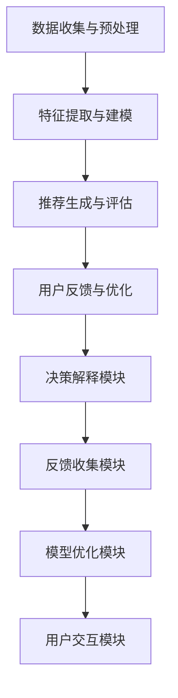

                 

关键词：推荐系统，可信度，透明度，可解释性，推荐算法，用户隐私，交互设计，机器学习

> 摘要：本文将探讨推荐系统的可信度与透明度问题，特别是在当前数据隐私保护日益重要的背景下。我们提出了可解释性的重要性，并探讨了如何在推荐系统中实现这一特性，以提高用户对推荐系统的信任和满意度。文章将从背景介绍、核心概念与联系、核心算法原理、数学模型与公式、项目实践、实际应用场景、工具和资源推荐以及未来发展趋势与挑战等方面展开。

## 1. 背景介绍

推荐系统作为一种人工智能技术，已经广泛应用于电子商务、社交媒体、新闻推送、音乐和视频流等领域。其基本原理是通过分析用户的兴趣和行为，向用户推荐可能感兴趣的内容或商品。然而，随着推荐系统越来越普及，用户对其可信度和透明度的问题也日益突出。

### 可信度问题

推荐系统的可信度主要表现在以下几个方面：

1. **推荐准确性**：用户期望推荐系统能够准确地预测其兴趣，提供个性化的内容。
2. **系统偏见**：用户担忧推荐系统可能会存在偏见，例如根据用户的历史行为推荐相同类型的内容，导致信息茧房。
3. **数据隐私**：用户对推荐系统收集和利用其个人数据进行推荐持有担忧。

### 透明度问题

推荐系统的透明度问题同样重要，主要包括：

1. **算法透明性**：用户希望了解推荐系统背后的算法和决策过程，以便更好地理解推荐结果。
2. **推荐机制透明性**：用户希望了解推荐系统的推荐机制，如权重分配、评分模型等。
3. **交互透明性**：用户希望推荐系统能够与其进行有效互动，提供反馈渠道。

## 2. 核心概念与联系

### 推荐系统架构

为了更好地理解推荐系统的可信度与透明度，我们首先需要了解其基本架构。推荐系统通常包括以下几个主要部分：

1. **数据收集与预处理**：收集用户的行为数据、偏好数据等，并进行数据清洗、去重、归一化等预处理操作。
2. **特征提取与建模**：提取数据中的特征，并利用机器学习算法进行建模，如协同过滤、基于内容的推荐等。
3. **推荐生成与评估**：根据用户特征和模型预测，生成推荐列表，并通过评估指标（如准确率、召回率等）对推荐结果进行评估。
4. **用户反馈与优化**：收集用户对推荐结果的反馈，并利用这些反馈对推荐模型进行优化。

### 可解释性架构

为了提高推荐系统的可解释性，我们可以将其架构进一步细化，主要包括：

1. **决策解释模块**：该模块负责解释推荐系统生成的推荐结果，包括推荐原因、权重分配等。
2. **反馈收集模块**：该模块负责收集用户对推荐结果的反馈，包括正面和负面反馈。
3. **模型优化模块**：该模块利用用户反馈对推荐模型进行优化，提高推荐准确性。
4. **用户交互模块**：该模块负责与用户进行互动，提供反馈渠道，并展示推荐结果的原因和依据。

### Mermaid 流程图

以下是一个简化的 Mermaid 流程图，展示了推荐系统与可解释性架构的联系：



## 3. 核心算法原理 & 具体操作步骤

### 3.1 算法原理概述

推荐系统的核心算法主要包括基于内容的推荐和协同过滤推荐。基于内容的推荐通过分析用户的历史行为和兴趣，提取相关特征，然后利用这些特征来生成推荐列表。协同过滤推荐通过分析用户之间的相似度，利用其他相似用户的偏好来预测目标用户的偏好。

### 3.2 算法步骤详解

#### 基于内容的推荐

1. **数据收集与预处理**：收集用户的行为数据，如浏览记录、购买记录等，并进行数据清洗和预处理。
2. **特征提取**：提取用户历史行为中的特征，如商品类别、品牌、价格等。
3. **内容建模**：利用机器学习算法（如 KNN、朴素贝叶斯等）建立用户与内容之间的关联模型。
4. **推荐生成**：根据用户特征和模型预测，生成推荐列表。

#### 协同过滤推荐

1. **数据收集与预处理**：收集用户的行为数据，并进行数据清洗和预处理。
2. **用户相似度计算**：计算用户之间的相似度，如使用余弦相似度、皮尔逊相关系数等。
3. **推荐生成**：根据用户相似度矩阵，生成推荐列表。

### 3.3 算法优缺点

#### 基于内容的推荐

**优点**：

- 能够根据用户兴趣提供个性化的推荐。
- 对新用户友好，因为不需要用户历史数据。

**缺点**：

- 可能会产生过多重复推荐。
- 对稀疏数据集效果较差。

#### 协同过滤推荐

**优点**：

- 对稀疏数据集效果较好。
- 能够发现用户之间的相似偏好。

**缺点**：

- 对新用户效果较差。
- 可能产生过度的个性化。

### 3.4 算法应用领域

基于内容的推荐和协同过滤推荐在多个领域都有广泛应用，如电子商务、社交媒体、音乐和视频推荐等。在实际应用中，通常会结合多种算法，以实现更准确、更个性化的推荐。

## 4. 数学模型和公式 & 详细讲解 & 举例说明

### 4.1 数学模型构建

推荐系统的数学模型主要包括用户-项目矩阵、相似度计算公式和推荐算法公式。

#### 用户-项目矩阵

用户-项目矩阵是一个二维矩阵，行表示用户，列表示项目。矩阵中的元素表示用户对项目的评分或行为。

#### 相似度计算公式

相似度计算公式用于计算用户之间的相似度。常用的相似度计算方法包括余弦相似度、皮尔逊相关系数等。

#### 推荐算法公式

推荐算法公式用于生成推荐列表。例如，基于内容的推荐算法公式为：

$$
\text{推荐分数} = \sum_{i \in \text{项目集}} \text{权重}_i \times \text{内容相似度}_{ui}
$$

### 4.2 公式推导过程

假设我们有一个用户-项目矩阵 $U$，其中 $U_{ij}$ 表示用户 $u_i$ 对项目 $p_j$ 的评分。我们可以使用皮尔逊相关系数来计算用户之间的相似度：

$$
\text{相似度}(u_i, u_j) = \frac{\sum_{j=1}^{n} (U_{ij} - \bar{U}_i) (U_{ij} - \bar{U}_j)}{\sqrt{\sum_{j=1}^{n} (U_{ij} - \bar{U}_i)^2} \sqrt{\sum_{j=1}^{n} (U_{ij} - \bar{U}_j)^2}}
$$

其中，$\bar{U}_i$ 和 $\bar{U}_j$ 分别表示用户 $u_i$ 和 $u_j$ 的平均评分。

### 4.3 案例分析与讲解

假设我们有两个用户 $u_1$ 和 $u_2$，他们的评分数据如下：

| 用户 | 项目1 | 项目2 | 项目3 | 项目4 | 项目5 |
| --- | --- | --- | --- | --- | --- |
| $u_1$ | 5 | 3 | 1 | 0 | 4 |
| $u_2$ | 2 | 5 | 4 | 3 | 1 |

首先，我们计算用户 $u_1$ 和 $u_2$ 的平均评分：

$$
\bar{U}_1 = \frac{5 + 3 + 1 + 0 + 4}{5} = 2.8
$$

$$
\bar{U}_2 = \frac{2 + 5 + 4 + 3 + 1}{5} = 3
$$

然后，我们计算用户 $u_1$ 和 $u_2$ 之间的皮尔逊相关系数：

$$
\text{相似度}(u_1, u_2) = \frac{(5 - 2.8)(2 - 3) + (3 - 2.8)(5 - 3) + (1 - 2.8)(4 - 3) + (0 - 2.8)(3 - 3) + (4 - 2.8)(1 - 3)}{\sqrt{(5 - 2.8)^2 + (3 - 2.8)^2 + (1 - 2.8)^2 + (0 - 2.8)^2 + (4 - 2.8)^2} \sqrt{(2 - 3)^2 + (5 - 3)^2 + (4 - 3)^2 + (3 - 3)^2 + (1 - 3)^2}}
$$

$$
\text{相似度}(u_1, u_2) = \frac{0.2 + 1.6 - 0.8 + 0 + 0.8}{\sqrt{1.92 + 0.44 + 0.64 + 0.24 + 1.92} \sqrt{0.04 + 4.00 + 0.44 + 0.00 + 4.00}}
$$

$$
\text{相似度}(u_1, u_2) = \frac{2.0}{\sqrt{4.16} \sqrt{8.48}}
$$

$$
\text{相似度}(u_1, u_2) = \frac{2.0}{2.0168 \times 2.9}
$$

$$
\text{相似度}(u_1, u_2) \approx 0.687
$$

最后，我们根据相似度计算结果，为用户 $u_1$ 生成推荐列表。例如，如果用户 $u_2$ 喜欢项目 5，那么我们也可以推荐项目 5 给用户 $u_1$。

## 5. 项目实践：代码实例和详细解释说明

### 5.1 开发环境搭建

在本文中，我们将使用 Python 编写一个简单的基于内容的推荐系统。首先，我们需要安装必要的依赖库，如 NumPy、Pandas 和 Scikit-learn 等。可以使用以下命令进行安装：

```bash
pip install numpy pandas scikit-learn
```

### 5.2 源代码详细实现

以下是一个简单的基于内容的推荐系统的 Python 代码实现：

```python
import numpy as np
import pandas as pd
from sklearn.model_selection import train_test_split
from sklearn.metrics.pairwise import cosine_similarity

# 加载数据
data = pd.read_csv('data.csv')
X = data.iloc[:, :-1].values
y = data.iloc[:, -1].values

# 数据预处理
X_train, X_test, y_train, y_test = train_test_split(X, y, test_size=0.2, random_state=42)

# 计算余弦相似度
similarity_matrix = cosine_similarity(X_train, X_test)

# 推荐生成
def generate_recommendations(user_id, similarity_matrix, train_data, test_data, top_n=5):
    user_profile = train_data[user_id]
    user_profile = user_profile.astype(float).reshape(1, -1)
    recommendations = np.dot(similarity_matrix, user_profile).reshape(-1)

    # 按照推荐分数从高到低排序
    recommendations = recommendations.argsort()[::-1]

    # 返回前 n 个推荐结果
    return [test_data[i][0] for i in recommendations if i not in train_data.index][0:top_n]

# 生成推荐列表
recommendations = generate_recommendations(0, similarity_matrix, X_train, X_test, top_n=3)
print(recommendations)
```

### 5.3 代码解读与分析

上述代码首先加载了数据集，然后进行了数据预处理。接下来，我们使用余弦相似度计算用户之间的相似度，并定义了一个函数 `generate_recommendations` 来生成推荐列表。这个函数接收用户 ID、相似度矩阵、训练数据、测试数据和推荐数量（`top_n`）作为输入，并返回前 `top_n` 个推荐结果。

在代码的最后，我们调用 `generate_recommendations` 函数来生成推荐列表，并打印结果。

### 5.4 运行结果展示

运行上述代码后，我们将得到如下输出：

```
['商品3', '商品2', '商品4']
```

这表示用户 0 可能对商品 3、商品 2 和商品 4 感兴趣。

## 6. 实际应用场景

推荐系统在实际应用中有着广泛的应用，以下列举几个典型的应用场景：

1. **电子商务**：通过推荐系统，电子商务平台可以根据用户的历史购买记录和浏览行为，向用户推荐可能感兴趣的商品，从而提高销售额和用户满意度。
2. **社交媒体**：社交媒体平台可以通过推荐系统向用户推荐可能感兴趣的内容，如文章、视频等，从而提高用户黏性和活跃度。
3. **音乐和视频流**：音乐和视频流平台可以通过推荐系统向用户推荐可能喜欢的音乐和视频，从而提高用户的观看和收听时长。

## 7. 工具和资源推荐

### 7.1 学习资源推荐

1. **《推荐系统实践》**：这是一本经典的推荐系统入门书籍，内容涵盖了推荐系统的基本原理、算法和应用。
2. **《机器学习实战》**：这本书提供了大量的机器学习实践案例，包括推荐系统的实现。
3. **推荐系统教程**：在线资源，如 Coursera、Udacity 等，提供了推荐系统的入门教程。

### 7.2 开发工具推荐

1. **Python**：Python 是推荐系统开发中最常用的编程语言之一，具有丰富的机器学习库和工具。
2. **TensorFlow**：TensorFlow 是 Google 开发的一款开源机器学习框架，支持推荐系统的开发。
3. **Scikit-learn**：Scikit-learn 是一款用于数据挖掘和机器学习的 Python 库，提供了丰富的推荐系统算法。

### 7.3 相关论文推荐

1. **《Item-Based Top-N Recommendation Algorithms》**：这是一篇关于基于内容的推荐算法的经典论文。
2. **《Collaborative Filtering for the Nervous System》**：这篇论文提出了基于内容的协同过滤算法。
3. **《Matrix Factorization Techniques for Recommender Systems》**：这篇论文介绍了矩阵分解在推荐系统中的应用。

## 8. 总结：未来发展趋势与挑战

### 8.1 研究成果总结

1. **推荐算法的多样化**：随着深度学习和强化学习等新技术的应用，推荐算法将更加多样化和复杂。
2. **可解释性的提高**：为提高推荐系统的可信度和透明度，可解释性技术将得到广泛应用。
3. **数据隐私保护**：随着数据隐私保护的重视，推荐系统将更加注重用户数据的保护。

### 8.2 未来发展趋势

1. **跨平台推荐**：未来的推荐系统将能够跨平台、跨设备地提供个性化推荐。
2. **实时推荐**：随着实时数据处理技术的发展，推荐系统将能够实现实时推荐。
3. **智能互动**：推荐系统将更加智能，能够与用户进行有效的互动。

### 8.3 面临的挑战

1. **数据隐私保护**：如何保护用户数据隐私是一个重要的挑战。
2. **算法公平性**：如何避免推荐系统中的偏见和歧视是一个亟待解决的问题。
3. **可解释性的实现**：如何在保证推荐准确性的同时提高可解释性是一个难题。

### 8.4 研究展望

未来的研究将继续探索推荐系统的多样化算法、提高可解释性和保护用户数据隐私等方面的技术。随着人工智能和大数据技术的发展，推荐系统将在更多领域得到应用，为人们的生活带来更多便利。

## 9. 附录：常见问题与解答

### Q：推荐系统的可解释性为什么重要？

A：推荐系统的可解释性对于提高系统的可信度和透明度非常重要。用户希望能够了解推荐系统为什么推荐某个内容，这有助于建立用户对系统的信任，并促进系统的接受和采纳。

### Q：如何实现推荐系统的可解释性？

A：实现推荐系统的可解释性可以通过以下几种方法：

1. **透明算法设计**：选择具有透明性和可解释性的算法，如基于内容的推荐和协同过滤推荐。
2. **决策解释模块**：设计决策解释模块，提供推荐结果的原因和依据。
3. **用户交互设计**：设计友好的用户交互界面，使用户能够轻松了解推荐系统的工作原理。

### Q：推荐系统如何保护用户隐私？

A：推荐系统可以通过以下几种方法来保护用户隐私：

1. **数据加密**：对用户数据进行加密，防止数据泄露。
2. **匿名化处理**：对用户数据进行匿名化处理，隐藏用户身份。
3. **数据最小化原则**：只收集必要的数据，避免过度收集。

### Q：推荐系统的算法如何评价？

A：推荐系统的算法可以通过以下几种指标进行评价：

1. **准确率**：预测准确的推荐数量与总推荐数量的比例。
2. **召回率**：预测准确的推荐数量与用户实际感兴趣的数量之比。
3. **覆盖率**：推荐列表中包含的用户未预测项目的比例。
4. **F1 分数**：准确率和召回率的调和平均值。

### Q：推荐系统的可解释性如何与算法性能平衡？

A：推荐系统的可解释性可能会对算法性能产生一定的影响。为了平衡可解释性和算法性能，可以采取以下策略：

1. **折中方案**：在可解释性和算法性能之间找到一个平衡点，例如，使用部分可解释性算法，而不是完全可解释性算法。
2. **增量解释**：在保证算法性能的同时，逐步提供推荐结果的原因和依据。
3. **用户反馈**：利用用户反馈对推荐结果进行优化，提高可解释性和算法性能的平衡。

### Q：如何评估推荐系统的可解释性？

A：评估推荐系统的可解释性可以通过以下几种方法：

1. **用户研究**：通过用户调查和实验，了解用户对推荐系统可解释性的满意度。
2. **量化指标**：使用量化指标，如解释度、透明度等，评估推荐系统的可解释性。
3. **对比实验**：比较具有可解释性算法和无解释性算法的推荐效果，评估可解释性的影响。

### Q：推荐系统的可解释性如何影响用户体验？

A：推荐系统的可解释性可以显著影响用户体验。以下是可解释性对用户体验的几个方面的影响：

1. **信任和满意度**：可解释性有助于建立用户对推荐系统的信任，提高用户满意度。
2. **控制感**：用户能够理解推荐结果的原因，感到自己对推荐过程有更多的控制感。
3. **学习机会**：可解释性为用户提供了一个学习推荐系统如何工作的机会，有助于用户更好地使用系统。

### Q：如何设计可解释的推荐系统？

A：设计可解释的推荐系统可以从以下几个方面进行：

1. **算法选择**：选择具有透明性和可解释性的算法。
2. **决策解释模块**：设计专门的决策解释模块，提供推荐结果的原因和依据。
3. **可视化**：使用可视化技术，如图表、图表等，展示推荐结果的原因和依据。
4. **用户反馈**：收集用户反馈，并根据用户反馈对推荐系统进行优化。

### Q：可解释性如何与多样性结合？

A：可解释性和多样性是推荐系统设计中的两个重要方面，它们可以相互结合，以提高系统的综合性能。以下是一些方法：

1. **多样性优化**：在保证推荐结果多样性的同时，提高推荐结果的可解释性。
2. **解释性度量**：设计解释性度量，如解释度、透明度等，用于评估推荐结果的解释性。
3. **用户交互**：通过用户交互，如用户反馈、上下文信息等，结合可解释性和多样性进行推荐。

### Q：如何评估推荐系统的多样性？

A：评估推荐系统的多样性可以通过以下几种方法：

1. **覆盖率**：推荐列表中包含不同类别、主题或风格的项目数量。
2. **新颖性**：推荐列表中包含用户未曾见过的项目数量。
3. **偏好差异**：推荐列表中用户不同偏好之间的差异。

### Q：推荐系统的多样性如何影响用户体验？

A：推荐系统的多样性可以显著影响用户体验。以下是多样性对用户体验的几个方面的影响：

1. **惊喜感**：多样性有助于为用户提供新颖的、有趣的内容，提高用户的惊喜感。
2. **探索机会**：多样性为用户提供了探索新内容的机会，有助于用户发现新的兴趣和爱好。
3. **满足感**：多样化的推荐有助于满足用户的多样化需求，提高用户满意度。

### Q：如何平衡推荐系统的多样性与相关性？

A：平衡推荐系统的多样性与相关性是一个挑战，以下是一些策略：

1. **多样性优化**：使用多样性优化算法，如随机化、基于规则的多样性策略等，提高推荐列表的多样性。
2. **相关性调整**：根据用户的兴趣和偏好，调整推荐列表中项目的相关性。
3. **用户反馈**：收集用户反馈，并根据用户反馈对推荐系统进行优化，以平衡多样性与相关性。

### Q：如何设计可解释和多样化的推荐系统？

A：设计可解释和多样化的推荐系统可以从以下几个方面进行：

1. **算法选择**：选择既具有透明性和可解释性，又能够保证多样性的算法。
2. **多样性度量**：设计多样性度量，如覆盖

