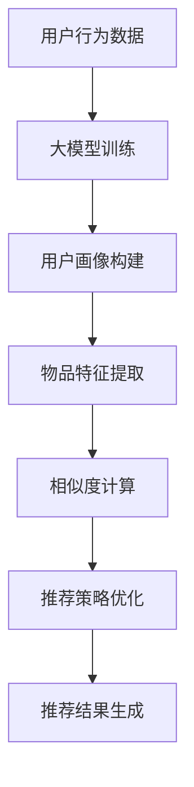

                 

关键词：推荐系统、大模型、人工智能、机器学习、主流化趋势、算法优化

> 摘要：本文从推荐系统的起源和发展历程入手，深入探讨了其在人工智能和机器学习领域的应用现状。重点分析了大模型在推荐系统中的重要性及其主流化趋势，并对其面临的挑战和未来发展方向进行了展望。

## 1. 背景介绍

推荐系统作为人工智能和机器学习领域的重要应用之一，自上世纪90年代以来逐渐成为学术界和工业界的研究热点。其核心目的是为用户提供个性化的推荐服务，提高用户满意度和平台粘性。随着互联网和大数据技术的发展，推荐系统在电子商务、社交媒体、新闻推送、音乐和视频平台等领域得到了广泛应用。

推荐系统主要分为基于内容的推荐和协同过滤推荐两大类。基于内容的推荐通过分析用户的历史行为和兴趣标签，将相似的内容推送给用户。协同过滤推荐则通过分析用户之间的行为模式，找出相似的群体，然后将这些群体喜欢的物品推荐给新用户。

近年来，随着深度学习技术的不断发展，大模型在推荐系统中的应用越来越广泛。大模型具有强大的表达能力和建模能力，可以处理海量数据，提供更精准的推荐结果。本文将重点关注大模型在推荐系统中的主流化趋势及其面临的挑战和未来发展方向。

## 2. 核心概念与联系

### 2.1 大模型的概念

大模型是指具有大规模参数和复杂结构的深度学习模型。常见的有Transformer、BERT、GPT等。这些模型在图像、语音、自然语言处理等领域的表现都非常突出。

### 2.2 推荐系统的架构

推荐系统一般由用户画像、物品特征、算法和推荐策略四个部分组成。用户画像和物品特征用于描述用户和物品的属性，算法用于计算用户和物品之间的相似度，推荐策略用于生成推荐结果。

### 2.3 大模型在推荐系统中的应用

大模型在推荐系统中的应用主要体现在以下几个方面：

1. **用户画像构建**：大模型可以通过对用户的历史行为数据进行深度学习，提取出用户的潜在兴趣和偏好，从而构建更精准的用户画像。
2. **物品特征提取**：大模型可以自动学习物品的抽象特征，提高物品描述的准确性。
3. **相似度计算**：大模型可以计算用户和物品之间的相似度，提供更准确的推荐结果。
4. **推荐策略优化**：大模型可以自动优化推荐策略，提高推荐效果。

### 2.4 Mermaid 流程图



## 3. 核心算法原理 & 具体操作步骤

### 3.1 算法原理概述

大模型在推荐系统中的应用主要基于深度学习技术，其核心算法原理如下：

1. **自动编码器**：用于提取用户和物品的潜在特征。
2. **相似度计算**：使用余弦相似度、皮尔逊相关系数等算法计算用户和物品之间的相似度。
3. **推荐策略**：根据用户和物品的相似度，采用协同过滤、矩阵分解等方法生成推荐结果。

### 3.2 算法步骤详解

1. **数据预处理**：收集用户行为数据和物品特征数据，进行数据清洗和预处理。
2. **模型训练**：使用自动编码器对用户和物品特征进行建模，训练得到用户和物品的潜在特征。
3. **相似度计算**：计算用户和物品之间的相似度，选择合适的相似度度量方法。
4. **推荐结果生成**：根据相似度计算结果，采用协同过滤等方法生成推荐结果。

### 3.3 算法优缺点

**优点**：

1. **强大的表达能力**：大模型可以自动学习复杂的用户和物品特征，提高推荐效果。
2. **处理海量数据**：大模型可以处理大规模数据，适应互联网时代的数据量需求。

**缺点**：

1. **计算资源消耗大**：大模型训练和推理需要大量的计算资源，对硬件设备要求较高。
2. **过拟合风险**：大模型可能会出现过拟合现象，降低推荐效果。

### 3.4 算法应用领域

大模型在推荐系统的应用领域非常广泛，主要包括：

1. **电子商务**：为用户提供个性化的商品推荐，提高销售转化率。
2. **社交媒体**：为用户提供感兴趣的内容推荐，增加用户活跃度和留存率。
3. **音乐和视频平台**：为用户提供个性化的音乐和视频推荐，提升用户体验。

## 4. 数学模型和公式 & 详细讲解 & 举例说明

### 4.1 数学模型构建

在推荐系统中，常用的数学模型包括自动编码器和相似度计算模型。以下是两个模型的数学公式：

**自动编码器模型**：

输入：用户行为数据 $X \in \mathbb{R}^{n \times d}$，物品特征数据 $Y \in \mathbb{R}^{m \times d}$

编码器：$z = \sigma(W_1X + b_1)$

解码器：$y' = \sigma(W_2z + b_2)$

损失函数：$L = \frac{1}{n}\sum_{i=1}^{n}\sum_{j=1}^{m}(\sigma(W_1X^{(i)} + b_1) - Y^{(j)})^2$

**相似度计算模型**：

相似度度量：$S(X, Y) = \frac{X \cdot Y}{\|X\|_2 \|Y\|_2}$

其中，$X$ 和 $Y$ 分别表示用户和物品的潜在特征向量。

### 4.2 公式推导过程

**自动编码器模型推导**：

1. **编码器推导**：

假设输入数据 $X$ 的维度为 $n \times d$，编码器参数为 $W_1$ 和 $b_1$。首先，对输入数据进行线性变换，然后通过激活函数 $\sigma$ 进行非线性变换。

$z = W_1X + b_1$

其中，$z$ 表示编码后的潜在特征。

2. **解码器推导**：

对编码后的潜在特征进行线性变换和激活函数变换，得到重构的物品特征 $y'$。

$y' = W_2z + b_2$

3. **损失函数推导**：

损失函数用于衡量编码器和解码器的性能，采用均方误差（MSE）损失函数。

$L = \frac{1}{n}\sum_{i=1}^{n}\sum_{j=1}^{m}(\sigma(W_1X^{(i)} + b_1) - Y^{(j)})^2$

其中，$X^{(i)}$ 和 $Y^{(j)}$ 分别表示第 $i$ 个用户和第 $j$ 个物品的特征。

**相似度计算模型推导**：

相似度度量公式表示用户和物品之间的相似程度，采用余弦相似度计算。

$S(X, Y) = \frac{X \cdot Y}{\|X\|_2 \|Y\|_2}$

其中，$X \cdot Y$ 表示用户和物品的欧氏距离，$\|X\|_2$ 和 $\|Y\|_2$ 分别表示用户和物品的特征向量模长。

### 4.3 案例分析与讲解

**案例**：某电商平台的用户和商品推荐系统

1. **用户画像构建**：

收集用户的历史购买数据，使用自动编码器模型提取用户的潜在兴趣和偏好。

2. **物品特征提取**：

收集商品的相关信息，如类别、品牌、价格等，使用自动编码器模型提取商品的潜在特征。

3. **相似度计算**：

计算用户和商品之间的相似度，选择相似度最高的商品进行推荐。

4. **推荐结果生成**：

根据相似度计算结果，采用协同过滤方法生成推荐结果。

## 5. 项目实践：代码实例和详细解释说明

### 5.1 开发环境搭建

1. **安装 Python**：版本要求 3.7 以上。
2. **安装 PyTorch**：版本要求 1.8 以上。
3. **安装 NumPy、Pandas 等常用库**。

### 5.2 源代码详细实现

以下是一个简单的自动编码器模型实现，用于构建用户画像和物品特征：

```python
import torch
import torch.nn as nn
import torch.optim as optim

# 定义自动编码器模型
class AutoEncoder(nn.Module):
    def __init__(self, input_dim, hidden_dim):
        super(AutoEncoder, self).__init__()
        self.encoder = nn.Linear(input_dim, hidden_dim)
        self.decoder = nn.Linear(hidden_dim, input_dim)
    
    def forward(self, x):
        z = self.encoder(x)
        y_prime = self.decoder(z)
        return y_prime

# 设置模型参数
input_dim = 100
hidden_dim = 50

# 实例化模型
model = AutoEncoder(input_dim, hidden_dim)

# 定义损失函数和优化器
criterion = nn.MSELoss()
optimizer = optim.Adam(model.parameters(), lr=0.001)

# 加载数据
# ...

# 模型训练
for epoch in range(100):
    for inputs in data_loader:
        optimizer.zero_grad()
        outputs = model(inputs)
        loss = criterion(outputs, inputs)
        loss.backward()
        optimizer.step()
    print(f"Epoch {epoch + 1}, Loss: {loss.item()}")

# 保存模型参数
torch.save(model.state_dict(), "auto_encoder.pth")

# 5.3 代码解读与分析

在上述代码中，我们定义了一个简单的自动编码器模型，包括编码器和解码器两部分。编码器用于提取用户和物品的潜在特征，解码器用于重构用户和物品的特征。

在模型训练过程中，我们使用均方误差（MSE）损失函数来衡量编码器和解码器的性能。通过反向传播和优化器更新模型参数，逐步减小损失函数值，提高模型性能。

在代码实现中，我们还需要加载数据、设置模型参数、定义损失函数和优化器等步骤。在实际项目中，这些步骤可以根据具体需求进行调整。

## 6. 实际应用场景

### 6.1 电子商务

在电子商务领域，推荐系统可以用于为用户提供个性化的商品推荐，提高用户购买意愿和转化率。通过大模型的辅助，可以更精准地提取用户和商品的潜在特征，提高推荐效果。

### 6.2 社交媒体

在社交媒体领域，推荐系统可以用于为用户推荐感兴趣的内容，增加用户活跃度和留存率。通过大模型分析用户的历史行为和兴趣，可以更准确地预测用户喜好，提供个性化的内容推荐。

### 6.3 音乐和视频平台

在音乐和视频平台，推荐系统可以用于为用户提供个性化的音乐和视频推荐，提升用户体验。通过大模型分析用户的行为和偏好，可以推荐符合用户口味的音乐和视频。

## 7. 未来应用展望

### 7.1 智能家居

随着智能家居的普及，推荐系统可以用于为用户提供个性化的家电推荐，提高生活质量。通过大模型分析用户的家庭环境和需求，可以为用户提供合适的家电产品。

### 7.2 健康医疗

在健康医疗领域，推荐系统可以用于为用户提供个性化的健康咨询和治疗方案。通过大模型分析用户的健康数据和医疗记录，可以为用户提供个性化的健康建议。

### 7.3 教育培训

在教育培训领域，推荐系统可以用于为用户提供个性化的学习课程和教材推荐，提高学习效果。通过大模型分析用户的学习习惯和知识水平，可以为用户提供合适的学习资源。

## 8. 工具和资源推荐

### 8.1 学习资源推荐

1. 《深度学习》（Goodfellow, Bengio, Courville著）：深度学习领域的经典教材，适合初学者和进阶者。
2. 《Python深度学习》（François Chollet著）：介绍如何使用Python和TensorFlow实现深度学习的实战指南。

### 8.2 开发工具推荐

1. PyTorch：开源的深度学习框架，适用于推荐系统开发。
2. TensorFlow：开源的深度学习框架，适用于推荐系统开发。

### 8.3 相关论文推荐

1. "Attention Is All You Need"：介绍了Transformer模型在自然语言处理领域的应用。
2. "BERT: Pre-training of Deep Neural Networks for Language Understanding"：介绍了BERT模型在自然语言处理领域的应用。

## 9. 总结：未来发展趋势与挑战

### 9.1 研究成果总结

近年来，推荐系统在大模型的支持下取得了显著的成果，提高了推荐效果和用户满意度。大模型在用户画像构建、物品特征提取、相似度计算和推荐策略优化等方面发挥了重要作用。

### 9.2 未来发展趋势

1. **多模态推荐**：结合文本、图像、语音等多模态数据，提供更丰富的推荐服务。
2. **实时推荐**：提高推荐系统的实时性，满足用户实时需求。
3. **可解释性**：提升推荐系统的可解释性，增强用户信任。

### 9.3 面临的挑战

1. **计算资源消耗**：大模型训练和推理需要大量的计算资源，对硬件设备要求较高。
2. **数据隐私**：保护用户隐私，确保推荐系统的公平性和公正性。

### 9.4 研究展望

未来，推荐系统将朝着更加智能化、实时化和可解释性的方向发展。在大模型的助力下，推荐系统将为用户提供更个性化的服务，提高用户体验和满意度。

## 10. 附录：常见问题与解答

### 10.1 问题1：大模型在推荐系统中的优势是什么？

**解答**：大模型在推荐系统中的优势主要体现在以下几个方面：

1. **强大的表达能力**：大模型可以自动学习复杂的用户和物品特征，提高推荐效果。
2. **处理海量数据**：大模型可以处理大规模数据，适应互联网时代的数据量需求。
3. **实时性**：大模型可以在短时间内完成推荐计算，提供实时推荐服务。

### 10.2 问题2：大模型在推荐系统中的主要应用场景是什么？

**解答**：大模型在推荐系统中的主要应用场景包括：

1. **电子商务**：为用户提供个性化的商品推荐，提高销售转化率。
2. **社交媒体**：为用户提供感兴趣的内容推荐，增加用户活跃度和留存率。
3. **音乐和视频平台**：为用户提供个性化的音乐和视频推荐，提升用户体验。

### 10.3 问题3：大模型在推荐系统中面临的挑战有哪些？

**解答**：大模型在推荐系统中面临的挑战主要包括：

1. **计算资源消耗**：大模型训练和推理需要大量的计算资源，对硬件设备要求较高。
2. **数据隐私**：保护用户隐私，确保推荐系统的公平性和公正性。
3. **过拟合风险**：大模型可能会出现过拟合现象，降低推荐效果。

----------------------------------------------------------------
作者：禅与计算机程序设计艺术 / Zen and the Art of Computer Programming

