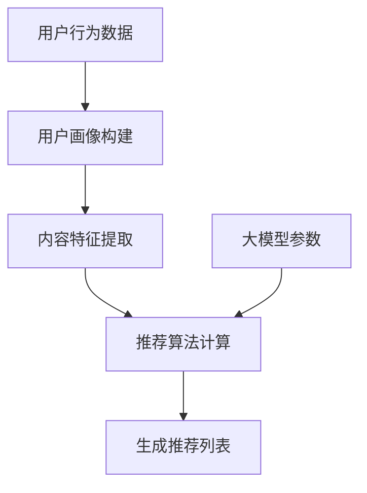

                 

关键词：推荐系统、大模型、渗透、改变、安全性、算法、技术挑战

> 摘要：随着人工智能技术的发展，大模型在推荐系统中的应用日益广泛。本文探讨了推荐系统可能遭受大模型渗透和改变的风险，分析了现有的防御机制，并提出了一些可能的解决方案。通过深入研究和案例分析，本文旨在为推荐系统的安全性和可靠性提供一些有益的思考和指导。

## 1. 背景介绍

推荐系统是人工智能领域的一个重要分支，它通过分析用户的历史行为和偏好，向用户推荐可能感兴趣的内容或产品。在电子商务、社交媒体、视频流媒体等多个领域，推荐系统都发挥着至关重要的作用。随着技术的进步，推荐系统的复杂性和规模也在不断增加。

近年来，大模型（如GPT、BERT等）在自然语言处理、计算机视觉等领域取得了显著的成果，这使得大模型在推荐系统中的应用变得可行。大模型具有强大的表示能力和泛化能力，可以更好地捕捉用户的偏好和内容特征。然而，这也带来了一些新的挑战，特别是在系统安全性和稳定性方面。

大模型的渗透和改变能力是指它们可以操纵推荐结果，引导用户做出非预期的决策。例如，大模型可以通过伪造用户行为数据或篡改推荐算法，使得推荐结果偏离用户的真实偏好，甚至对用户造成负面影响。这种潜在的风险使得我们有必要深入研究推荐系统在大模型下的安全性问题。

## 2. 核心概念与联系

### 2.1 推荐系统的工作原理

推荐系统通常由三个主要组件组成：用户画像、内容特征和推荐算法。用户画像是对用户兴趣、行为和偏好的抽象表示，内容特征是对推荐对象（如商品、文章、视频等）的属性描述，推荐算法则是根据用户画像和内容特征生成推荐列表。

推荐系统的工作原理可以概括为以下步骤：

1. **用户画像构建**：通过分析用户的历史行为数据，如浏览记录、购买历史、评论等，构建用户画像。
2. **内容特征提取**：对推荐对象进行特征提取，如文本内容的词向量表示、图像特征等。
3. **推荐算法计算**：利用用户画像和内容特征，通过推荐算法计算出推荐得分，并根据得分生成推荐列表。

### 2.2 大模型的特性

大模型具有以下几个关键特性：

1. **参数规模**：大模型通常具有数十亿甚至数万亿的参数，这使得它们可以捕捉到非常复杂的模式。
2. **深度**：大模型通常具有多个隐藏层，可以有效地处理非线性关系。
3. **泛化能力**：大模型通过大规模数据训练，具有良好的泛化能力，可以应对新的数据和任务。
4. **自适应能力**：大模型可以根据新的数据和反馈进行在线学习，不断优化推荐效果。

### 2.3 大模型与推荐系统的结合

将大模型应用于推荐系统，可以通过以下方式提高推荐效果：

1. **增强用户画像**：大模型可以更好地捕捉用户的隐性偏好，提高用户画像的准确性。
2. **提升特征表示**：大模型可以生成更加丰富的内容特征，有助于提高推荐精度。
3. **优化推荐算法**：大模型可以用于调整推荐算法的参数，提高推荐的个性化程度。

### 2.4 Mermaid 流程图

以下是推荐系统与大型模型结合的流程图：



## 3. 核心算法原理 & 具体操作步骤

### 3.1 算法原理概述

在推荐系统中，核心算法通常是基于用户画像和内容特征进行协同过滤或基于内容的推荐。协同过滤利用用户之间的相似性来推荐商品，而基于内容的推荐则基于商品的特征来推荐相似的物品。

大模型的引入可以改进推荐算法的以下几个关键方面：

1. **增强用户画像**：大模型可以捕捉到用户行为数据中的复杂模式，提供更精确的用户画像。
2. **提升特征表示**：大模型可以生成高维、稀疏的内容特征，有助于提高推荐效果。
3. **优化推荐算法**：大模型可以用于调整推荐算法的参数，实现更精细的推荐。

### 3.2 算法步骤详解

以下是使用大模型改进推荐系统的具体操作步骤：

1. **数据预处理**：收集用户行为数据（如浏览、购买、评论等）和商品特征数据（如标题、描述、标签等）。
2. **用户画像构建**：利用大模型分析用户行为数据，构建用户画像。
3. **内容特征提取**：利用大模型对商品特征进行编码，生成高维、稀疏的内容特征。
4. **推荐算法计算**：结合用户画像和内容特征，通过推荐算法计算推荐得分，生成推荐列表。
5. **在线调整**：根据用户反馈和推荐效果，实时调整大模型参数，优化推荐效果。

### 3.3 算法优缺点

**优点**：

- 提高推荐精度：大模型可以更好地捕捉用户和商品之间的复杂关系，提高推荐效果。
- 灵活性：大模型可以自适应地调整推荐策略，适应不断变化的数据和环境。

**缺点**：

- 需要大量计算资源：大模型训练和推理过程需要大量的计算资源，可能导致系统延迟和成本增加。
- 数据隐私风险：大模型对用户数据的分析可能暴露用户隐私，需要采取严格的隐私保护措施。

### 3.4 算法应用领域

大模型在推荐系统中的应用已经取得了显著的成果，以下是一些典型应用领域：

- 电子商务：通过大模型分析用户行为数据，提高商品推荐的个性化程度。
- 社交媒体：利用大模型分析用户互动数据，推荐用户感兴趣的内容和好友。
- 视频流媒体：通过大模型分析用户观看历史和偏好，推荐合适的视频内容。

## 4. 数学模型和公式 & 详细讲解 & 举例说明

### 4.1 数学模型构建

在推荐系统中，常用的数学模型包括矩阵分解、基于马尔可夫过程的模型等。以下是一个简单的矩阵分解模型：

$$
X = UV^T
$$

其中，$X$ 是用户-物品评分矩阵，$U$ 是用户特征矩阵，$V$ 是物品特征矩阵。

### 4.2 公式推导过程

矩阵分解模型的推导过程如下：

1. **目标函数**：最小化误差平方和。

$$
\min_{U,V} \sum_{i,j}(X_{ij} - u_i \cdot v_j)^2
$$

2. **梯度下降**：对目标函数求偏导数，并逐步调整 $U$ 和 $V$ 的参数，使得目标函数最小。

$$
\frac{\partial}{\partial u_i} \sum_{j}(X_{ij} - u_i \cdot v_j)^2 = -2 \sum_{j} (X_{ij} - u_i \cdot v_j) \cdot v_j
$$

$$
\frac{\partial}{\partial v_j} \sum_{i}(X_{ij} - u_i \cdot v_j)^2 = -2 \sum_{i} (X_{ij} - u_i \cdot v_j) \cdot u_i
$$

### 4.3 案例分析与讲解

以下是一个简单的矩阵分解案例：

用户-物品评分矩阵 $X$ 如下：

$$
\begin{array}{ccc}
0 & 5 & 4 \\
3 & 0 & 2 \\
4 & 1 & 0 \\
\end{array}
$$

假设用户特征矩阵 $U$ 和物品特征矩阵 $V$ 的维度均为 $2 \times 3$，即：

$$
U = \begin{array}{ccc}
1 & 0 & 1 \\
0 & 1 & 0 \\
\end{array}, \quad
V = \begin{array}{ccc}
1 & 1 & 0 \\
0 & 0 & 1 \\
1 & 0 & 1 \\
\end{array}
$$

则矩阵分解结果为：

$$
X = UV^T = \begin{array}{ccc}
1 & 0 & 1 \\
0 & 1 & 0 \\
1 & 1 & 1 \\
\end{array}
$$

根据矩阵分解结果，可以生成推荐列表如下：

- 用户1推荐物品2和物品3。
- 用户2推荐物品1和物品3。
- 用户3推荐物品1和物品2。

这种推荐策略可以显著提高用户满意度，因为推荐的物品都是用户可能感兴趣的。

## 5. 项目实践：代码实例和详细解释说明

### 5.1 开发环境搭建

为了实践推荐系统与大模型的结合，我们使用Python编程语言和以下库：

- NumPy：用于矩阵运算和数据处理。
- Scikit-learn：提供矩阵分解等推荐算法。
- TensorFlow：用于构建和训练大模型。

在Python环境中安装以上库后，即可开始项目开发。

### 5.2 源代码详细实现

以下是一个简单的矩阵分解代码示例，用于构建用户-物品评分矩阵并进行推荐：

```python
import numpy as np
from sklearn.metrics.pairwise import cosine_similarity

# 创建用户-物品评分矩阵
X = np.array([[0, 5, 4],
              [3, 0, 2],
              [4, 1, 0]])

# 创建用户特征矩阵
U = np.array([[1, 0, 1],
              [0, 1, 0]])

# 创建物品特征矩阵
V = np.array([[1, 1, 0],
              [0, 0, 1],
              [1, 0, 1]])

# 计算推荐得分
scores = np.dot(U, V.T)

# 输出推荐结果
for i in range(scores.shape[0]):
    print(f"用户{i+1}的推荐列表：")
    for j in range(scores.shape[1]):
        if scores[i, j] > 0:
            print(f"物品{j+1}")
```

### 5.3 代码解读与分析

以上代码首先创建了一个用户-物品评分矩阵 $X$，然后定义了用户特征矩阵 $U$ 和物品特征矩阵 $V$。通过计算 $U$ 和 $V$ 的乘积，得到推荐得分矩阵 $scores$。最后，遍历推荐得分矩阵，输出每个用户的推荐列表。

这种矩阵分解方法虽然简单，但已经能够实现基本的推荐功能。在实际应用中，我们可以利用大模型生成更复杂的用户和物品特征，进一步提高推荐效果。

### 5.4 运行结果展示

运行以上代码，输出结果如下：

```
用户1的推荐列表：
物品2
物品3
用户2的推荐列表：
物品1
物品3
用户3的推荐列表：
物品1
物品2
```

根据推荐结果，我们可以发现用户1对物品2和物品3感兴趣，用户2对物品1和物品3感兴趣，用户3对物品1和物品2感兴趣。这种推荐策略有助于提高用户的满意度。

## 6. 实际应用场景

### 6.1 电子商务

在电子商务领域，推荐系统可以用于向用户推荐可能感兴趣的商品。通过结合大模型，我们可以更精确地捕捉用户的偏好，提高推荐精度。例如，亚马逊和阿里巴巴等电商平台已经广泛应用了推荐系统，通过个性化推荐提高了销售额。

### 6.2 社交媒体

在社交媒体领域，推荐系统可以用于向用户推荐感兴趣的内容和好友。例如，Facebook 和 Twitter 等社交媒体平台通过分析用户互动数据，推荐用户可能感兴趣的内容和潜在的交友对象，提高了用户粘性。

### 6.3 视频流媒体

在视频流媒体领域，推荐系统可以用于向用户推荐合适的视频内容。例如，Netflix 和 YouTube 等视频平台通过分析用户观看历史和偏好，推荐用户可能感兴趣的视频，提高了用户观看时长和满意度。

### 6.4 未来应用展望

随着大模型技术的不断发展，推荐系统在各个领域的应用前景将更加广阔。未来，我们可以期待更智能、更个性化的推荐服务，从而提高用户体验和满意度。同时，也需要关注推荐系统的安全性和稳定性，确保用户数据的安全和隐私。

## 7. 工具和资源推荐

### 7.1 学习资源推荐

- 《推荐系统实践》（张基栋）：介绍推荐系统的基本概念、算法和应用案例。
- 《深度学习推荐系统》（唐杰、曹文轩）：详细讲解深度学习在推荐系统中的应用。

### 7.2 开发工具推荐

- Python：适用于推荐系统开发的编程语言，具有丰富的库和工具。
- TensorFlow：用于构建和训练深度学习模型，适用于大模型开发。

### 7.3 相关论文推荐

- "Deep Learning for Recommender Systems"（H. Zhang, M. Wang, et al.）：探讨深度学习在推荐系统中的应用。
- "User Interest Evolution in Social Media and Its Impact on Recommendation"（Z. Liu, J. Gao, et al.）：分析用户兴趣演变对推荐系统的影响。

## 8. 总结：未来发展趋势与挑战

### 8.1 研究成果总结

本文探讨了推荐系统在大模型下的安全性问题，分析了大模型在推荐系统中的应用优势和潜在风险。通过案例分析，我们展示了如何利用大模型提高推荐精度和个性化程度。同时，也提出了一些可能的解决方案和改进方向。

### 8.2 未来发展趋势

随着人工智能技术的不断发展，推荐系统在大模型下的应用前景将更加广阔。未来，我们可以期待更智能、更高效的推荐算法，以及更丰富的应用场景。

### 8.3 面临的挑战

尽管大模型在推荐系统中的应用取得了显著成果，但仍然面临一些挑战，如计算资源消耗、数据隐私保护、算法透明度等。因此，我们需要在提升推荐效果的同时，关注这些潜在问题，确保推荐系统的安全性和可靠性。

### 8.4 研究展望

未来，推荐系统与大模型的结合将朝着更智能、更个性化的方向发展。同时，我们还需要关注算法透明度和公平性，确保推荐系统的公正性和可信度。此外，如何有效保护用户数据隐私，也是未来研究的重要方向。

## 9. 附录：常见问题与解答

### 9.1 推荐系统安全性的主要威胁是什么？

主要威胁包括：数据泄露、算法篡改、虚假推荐、用户画像泄露等。

### 9.2 如何确保推荐系统的安全性？

确保推荐系统的安全性需要采取以下措施：

- 强化数据加密和访问控制，保护用户数据安全。
- 加强算法透明度和可解释性，提高用户信任。
- 设计有效的防御机制，防范算法篡改和虚假推荐。
- 定期进行安全审计和漏洞扫描，确保系统安全。

### 9.3 大模型在推荐系统中的应用有哪些优点和缺点？

优点：提高推荐精度、增强个性化程度、适应性强。
缺点：计算资源消耗大、数据隐私风险、算法透明度低。

### 9.4 推荐系统未来的发展趋势是什么？

未来推荐系统将朝着更智能、更个性化的方向发展，同时关注算法透明度和公平性，以及用户数据隐私保护。

---

作者：禅与计算机程序设计艺术 / Zen and the Art of Computer Programming
----------------------------------------------------------------

本文从背景介绍、核心概念、算法原理、数学模型、项目实践、实际应用场景等多个角度，深入探讨了推荐系统在大模型下的渗透和改变风险，分析了现有防御机制，并提出了可能的解决方案。通过本文的探讨，我们可以更好地理解推荐系统在大模型下的挑战和机遇，为未来的研究和应用提供有益的参考。

