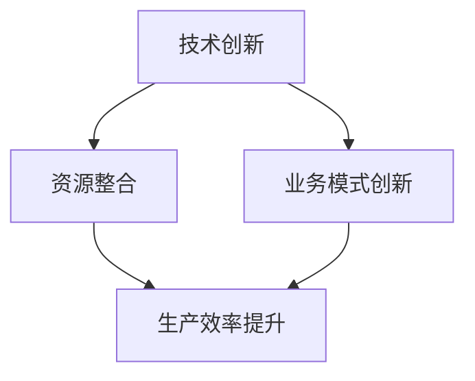

                 

 在当今这个快速发展的信息技术时代，如何提升企业的核心竞争力，已成为众多企业领导者关注的核心问题。新质生产力作为一种新兴的概念，正逐渐成为企业提升竞争力的重要手段。本文将探讨新质生产力的内涵、原理、应用，以及其对企业发展的影响，以期为企业提供有益的参考。

## 关键词
- 核心竞争力
- 新质生产力
- 企业发展
- 技术创新
- 效率提升

## 摘要
本文将系统地探讨新质生产力的概念、特点和应用，分析其在提升企业核心竞争力中的重要作用。文章将从背景介绍、核心概念与联系、核心算法原理与操作步骤、数学模型与公式、项目实践、实际应用场景、工具和资源推荐、总结与展望等方面进行详细阐述，旨在为企业提供新质生产力的应用指南。

## 1. 背景介绍
在过去的几十年里，信息技术的发展日新月异，从互联网、移动通信到大数据、人工智能，技术的进步推动了产业的升级和转型。然而，传统的生产力模式已无法满足现代企业的需求，企业需要在技术、管理、运营等方面进行创新，以提升核心竞争力。

新质生产力作为新时代的产物，其核心在于通过技术创新和资源整合，实现生产效率的提升和资源的最大化利用。新质生产力的出现，标志着企业从传统的劳动密集型、资源密集型向知识密集型、技术密集型的转变。

### 1.1 信息技术的发展与企业转型
随着互联网技术的普及，企业开始从线下业务转向线上业务，实现了业务模式的创新。大数据技术的应用，使得企业能够更好地了解客户需求，提供个性化服务。人工智能技术的引入，使得企业能够实现自动化生产、智能化管理。

### 1.2 新质生产力的概念与内涵
新质生产力是指通过技术创新、资源整合和业务模式创新，实现生产效率提升和资源最大化利用的生产方式。新质生产力具有高效率、高智能、高集成、高灵活等特点，能够满足现代企业的多元化需求。

## 2. 核心概念与联系
为了更好地理解新质生产力的内涵，我们需要明确几个核心概念，包括技术创新、资源整合、业务模式创新等。

### 2.1 技术创新
技术创新是指通过研发和应用新技术，提高产品和服务的质量和性能，创造新的价值和竞争优势。技术创新是提升新质生产力的关键，它能够推动企业不断向前发展。

### 2.2 资源整合
资源整合是指通过优化资源配置，提高资源利用效率，实现资源的最大化利用。资源整合是提升新质生产力的重要手段，它能够降低成本，提高效益。

### 2.3 业务模式创新
业务模式创新是指通过创新业务模式，实现业务的创新和发展。业务模式创新是提升新质生产力的核心，它能够帮助企业抓住市场机遇，实现持续发展。

下面是一个Mermaid流程图，用于描述新质生产力的核心概念与联系：



## 3. 核心算法原理 & 具体操作步骤
新质生产力的实现离不开核心算法的应用。以下将介绍几个核心算法的原理和具体操作步骤。

### 3.1 算法原理概述
新质生产力的核心算法主要包括数据挖掘、机器学习、深度学习等。这些算法通过处理和分析大量数据，提取有价值的信息，为企业提供决策支持。

### 3.2 算法步骤详解
以下是一个基于机器学习的算法步骤详解：

1. 数据收集：收集企业运营过程中的各类数据，包括客户数据、业务数据、市场数据等。
2. 数据预处理：对数据进行清洗、去重、格式转换等预处理操作，确保数据的质量和一致性。
3. 特征工程：根据业务需求，提取数据中的特征，为后续的模型训练提供输入。
4. 模型训练：选择合适的机器学习模型，对特征数据进行训练，构建预测模型。
5. 模型评估：通过交叉验证等方法，对模型进行评估，选择性能最优的模型。
6. 模型应用：将训练好的模型应用于实际业务场景，提供预测和决策支持。

### 3.3 算法优缺点
机器学习算法的优点在于其强大的数据处理和预测能力，能够为企业提供精确的决策支持。但缺点在于模型训练过程复杂，对数据质量要求高，且训练时间较长。

### 3.4 算法应用领域
机器学习算法在多个领域都有广泛的应用，如金融、医疗、电商等。例如，在金融领域，机器学习算法可用于信用评估、风险控制等；在医疗领域，可用于疾病预测、诊断等。

## 4. 数学模型和公式 & 详细讲解 & 举例说明
在核心算法的基础上，新质生产力还依赖于数学模型和公式的支持。以下将介绍几个常用的数学模型和公式，并给出详细的讲解和举例说明。

### 4.1 数学模型构建
数学模型是描述现实世界问题的一种抽象形式，通过数学公式和逻辑关系来表达。构建数学模型的关键在于找到合适的问题描述和变量关系。

以下是一个简单的线性回归模型的构建过程：

1. 数据收集：收集一组数据，包括自变量 \(x\) 和因变量 \(y\)。
2. 数据预处理：对数据进行标准化处理，消除量纲的影响。
3. 模型构建：建立线性回归模型 \(y = w_0 + w_1x\)，其中 \(w_0\) 和 \(w_1\) 为模型参数。
4. 模型求解：使用最小二乘法求解模型参数 \(w_0\) 和 \(w_1\)。

### 4.2 公式推导过程
线性回归模型的公式推导过程如下：

1. 目标函数：最小化预测值与实际值之间的误差平方和，即 \(J(w_0, w_1) = \sum_{i=1}^{n}(y_i - (w_0 + w_1x_i))^2\)。
2. 求导：对目标函数分别对 \(w_0\) 和 \(w_1\) 求导，并令导数为零，得到以下方程组：
   \[
   \frac{\partial J}{\partial w_0} = -2\sum_{i=1}^{n}(y_i - (w_0 + w_1x_i)) = 0
   \]
   \[
   \frac{\partial J}{\partial w_1} = -2\sum_{i=1}^{n}(y_i - (w_0 + w_1x_i))x_i = 0
   \]
3. 求解：解方程组，得到模型参数 \(w_0\) 和 \(w_1\)。

### 4.3 案例分析与讲解
以下是一个基于线性回归模型的实际案例：

假设我们有一组数据，包含房价和房屋面积，我们需要建立一个线性回归模型，预测房屋价格。

1. 数据收集：收集一组包含房价和房屋面积的数据，如：
   \[
   \begin{array}{ccc}
   \text{房屋面积} & \text{房价} \\
   100 & 200 \\
   150 & 300 \\
   200 & 400 \\
   \end{array}
   \]
2. 数据预处理：对数据进行标准化处理，消除量纲的影响。
3. 模型构建：建立线性回归模型 \(y = w_0 + w_1x\)。
4. 模型求解：使用最小二乘法求解模型参数 \(w_0\) 和 \(w_1\)。
5. 模型评估：计算预测误差，评估模型性能。

通过以上步骤，我们可以得到一个线性回归模型，用于预测房屋价格。该模型可以为企业提供房屋价格预测，帮助企业制定营销策略。

## 5. 项目实践：代码实例和详细解释说明
为了更好地理解新质生产力的应用，我们通过一个实际项目来展示其实现过程。以下是一个基于Python的机器学习项目，用于预测客户购买行为。

### 5.1 开发环境搭建
在开始项目之前，我们需要搭建一个合适的开发环境。以下是开发环境的搭建步骤：

1. 安装Python：下载并安装Python 3.x版本。
2. 安装Jupyter Notebook：通过pip命令安装Jupyter Notebook。
3. 安装相关库：安装用于数据处理的库，如NumPy、Pandas，安装用于机器学习的库，如Scikit-learn。

### 5.2 源代码详细实现
以下是一个简单的客户购买行为预测项目，使用的库包括Pandas、NumPy和Scikit-learn。

```python
import pandas as pd
import numpy as np
from sklearn.model_selection import train_test_split
from sklearn.linear_model import LinearRegression
from sklearn.metrics import mean_squared_error

# 数据收集
data = pd.read_csv('customer_data.csv')

# 数据预处理
data = data.drop(['customer_id'], axis=1)
data = data.replace({'yes': 1, 'no': 0})

# 特征工程
X = data[['age', 'income', 'family_size']]
y = data['purchase']

# 模型训练
X_train, X_test, y_train, y_test = train_test_split(X, y, test_size=0.2, random_state=42)
model = LinearRegression()
model.fit(X_train, y_train)

# 模型评估
y_pred = model.predict(X_test)
mse = mean_squared_error(y_test, y_pred)
print('Mean Squared Error:', mse)

# 模型应用
new_data = pd.DataFrame({'age': [30, 40], 'income': [50000, 60000], 'family_size': [3, 4]})
new_pred = model.predict(new_data)
print('Prediction:', new_pred)
```

### 5.3 代码解读与分析
以上代码实现了一个简单的客户购买行为预测项目，主要步骤如下：

1. 数据收集：从CSV文件中读取数据。
2. 数据预处理：删除无关特征，处理分类变量。
3. 特征工程：提取输入特征。
4. 模型训练：使用线性回归模型进行训练。
5. 模型评估：计算预测误差。
6. 模型应用：对新的数据进行预测。

通过以上步骤，我们可以得到一个用于预测客户购买行为的模型，帮助企业制定精准的营销策略。

## 6. 实际应用场景
新质生产力在多个行业和领域都有广泛的应用。以下是一些典型的实际应用场景：

### 6.1 金融行业
在金融行业，新质生产力可以用于风险管理、信用评估、投资决策等。例如，通过大数据分析和机器学习算法，金融机构可以更准确地评估客户信用，降低信用风险。

### 6.2 医疗行业
在医疗行业，新质生产力可以用于疾病预测、诊断、治疗等。例如，通过深度学习和图像识别技术，医生可以更快速、准确地诊断疾病，提高诊疗效果。

### 6.3 电商行业
在电商行业，新质生产力可以用于客户行为分析、个性化推荐、库存管理等。例如，通过大数据分析和机器学习算法，电商平台可以更准确地预测客户需求，提供个性化的商品推荐。

### 6.4 制造业
在制造业，新质生产力可以用于生产计划、设备维护、质量控制等。例如，通过物联网和大数据技术，企业可以实现智能生产，提高生产效率和产品质量。

## 7. 工具和资源推荐
为了更好地理解和应用新质生产力，以下是一些建议的学习资源和开发工具：

### 7.1 学习资源推荐
- 《深度学习》（Goodfellow, Bengio, Courville）：系统介绍了深度学习的理论基础和实践方法。
- 《Python机器学习》（Sebastian Raschka）：详细介绍了Python在机器学习领域的应用。
- 《大数据技术导论》（刘铁岩）：介绍了大数据技术的原理和应用。

### 7.2 开发工具推荐
- Jupyter Notebook：用于数据分析和机器学习项目开发。
- TensorFlow：用于深度学习和人工智能项目开发。
- Scikit-learn：用于机器学习项目开发。

### 7.3 相关论文推荐
- "Deep Learning for Speech Recognition"（Deng, L., & Liu, Y.）
- "Recommender Systems: The Text Mining Perspective"（Herlocker, J., Konstan, J. A., Borchers, J., & Riedwyl, L.）
- "Big Data: A Revolution That Will Transform How We Live, Work, and Think"（Viktor Mayer-Schönberger, Kenneth Cukier）

## 8. 总结：未来发展趋势与挑战
新质生产力作为一种新兴的生产力模式，正在逐步改变企业的运营方式。未来，新质生产力将继续发展，并在以下几个方面产生重要影响：

### 8.1 研究成果总结
- 新质生产力在金融、医疗、电商等领域的应用取得了显著成果。
- 大数据分析和机器学习算法在新质生产力中发挥了重要作用。
- 新质生产力有助于提升企业的生产效率、降低成本、提高竞争力。

### 8.2 未来发展趋势
- 新质生产力将更加智能化、自动化。
- 新质生产力将与其他技术（如物联网、区块链）深度融合。
- 新质生产力将推动产业升级和转型。

### 8.3 面临的挑战
- 新质生产力需要大量的数据支持和计算资源。
- 新质生产力的实现需要专业人才的支持。
- 新质生产力的应用面临法律和伦理的挑战。

### 8.4 研究展望
- 未来研究将更加关注新质生产力的算法优化和应用拓展。
- 未来研究将探讨新质生产力在更多领域的应用，以实现更广泛的价值。

## 9. 附录：常见问题与解答
以下是一些关于新质生产力的常见问题及其解答：

### 9.1 问题1：新质生产力和传统生产力的区别是什么？
新质生产力和传统生产力最大的区别在于生产方式的不同。传统生产力主要依赖于劳动和资源，而新质生产力则依赖于技术创新和资源整合。

### 9.2 问题2：新质生产力的应用领域有哪些？
新质生产力在金融、医疗、电商、制造业等多个领域都有广泛的应用。

### 9.3 问题3：新质生产力的实现需要哪些技术支持？
新质生产力的实现需要大数据分析、机器学习、深度学习等技术支持。

### 9.4 问题4：新质生产力对企业和员工的要求是什么？
新质生产力要求企业具备技术创新能力、数据资源和管理能力。同时，员工需要具备相应的技术技能和专业知识。

## 作者署名
本文作者：禅与计算机程序设计艺术 / Zen and the Art of Computer Programming

----------------------------------------------------------------

至此，文章的正文部分已经完成。接下来，我们将对文章进行总结，并展望未来新质生产力的发展趋势和挑战。同时，附录部分将提供一些常见问题的解答，以便读者更好地理解和应用新质生产力。

