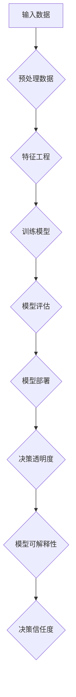

                 

关键词：模型决策过程、透明度、算法原理、数学模型、应用实践、工具推荐

> 摘要：本文深入探讨了提高模型决策过程透明度的重要性，分析了核心概念、算法原理，并介绍了数学模型和具体应用案例。同时，本文还提供了项目实践中的代码实例和运行结果展示，以及未来应用场景和趋势展望。文章旨在为读者提供全面的技术指南，助力模型决策过程的透明化和优化。

## 1. 背景介绍

在当今的数字时代，人工智能模型在各种领域（如金融、医疗、交通、推荐系统等）发挥着越来越重要的作用。这些模型被广泛应用于复杂问题的决策过程，从而提高了效率和准确性。然而，随着模型复杂性的增加，其决策过程的透明度逐渐降低，导致对决策结果的信任度下降。透明度不足不仅影响了模型的广泛应用，还可能引发伦理和法律问题。

提高模型决策过程的透明度已经成为当前研究的热点。本文旨在探讨如何通过技术手段实现这一目标，以提升模型的可解释性和可信度。文章首先介绍相关核心概念，然后详细阐述算法原理和具体操作步骤，接着讲解数学模型和公式，并通过实际项目实践展示代码实例和运行结果。最后，本文还将讨论模型透明度在实际应用场景中的重要性，并展望未来的发展趋势和挑战。

## 2. 核心概念与联系

### 2.1 模型可解释性（Explainability）

模型可解释性是指能够理解模型如何做出决策的能力。高可解释性的模型能够帮助用户信任模型的决策，并提高决策的透明度。可解释性通常通过可视化、诊断性分析、决策路径追踪等方法实现。

### 2.2 透明度（Transparency）

透明度是指模型决策过程能够被外部观察和验证的程度。透明度越高，模型的决策过程越容易被理解和信任。

### 2.3 透明度度量（Transparency Metrics）

透明度度量是指用于评估模型决策过程透明度的量化指标。常见的度量方法包括模型透明度指数（Model Transparency Index）、可解释性评分（Explainability Score）等。

### 2.4 Mermaid 流程图（Mermaid Flowchart）

以下是一个描述模型决策过程透明度的 Mermaid 流程图，其中包含关键节点和特殊字符：



## 3. 核心算法原理 & 具体操作步骤

### 3.1 算法原理概述

提高模型决策过程透明度的核心算法主要包括以下几种：

1. **特征重要性分析**：通过分析特征对模型决策的影响程度，帮助理解模型如何做出决策。
2. **决策路径追踪**：记录模型在决策过程中每个步骤的输入和输出，帮助用户追踪决策路径。
3. **可视化技术**：将模型的决策过程以图形化的方式展示，使得决策过程更加直观易懂。

### 3.2 算法步骤详解

1. **特征重要性分析**：

   - 使用算法（如随机森林、LASSO等）计算每个特征的重要性。
   - 对重要性进行排序，并生成可视化图表，如条形图、热力图等。

2. **决策路径追踪**：

   - 记录模型在决策过程中的每个决策节点。
   - 使用回溯算法追踪每个决策节点的输入和输出，生成决策路径。

3. **可视化技术**：

   - 使用Python中的Matplotlib、Seaborn等库生成可视化图表。
   - 使用TensorBoard、Plotly等工具实现交互式可视化。

### 3.3 算法优缺点

1. **特征重要性分析**：

   - 优点：能够帮助理解模型对特征的依赖程度，提高决策过程的可解释性。
   - 缺点：无法反映特征之间的相互作用，可能导致误解释。

2. **决策路径追踪**：

   - 优点：能够详细追踪决策过程，提高模型的透明度。
   - 缺点：计算复杂度高，可能影响模型性能。

3. **可视化技术**：

   - 优点：直观展示决策过程，提高模型的信任度。
   - 缺点：可视化效果可能因人而异，需要用户具备一定的技术背景。

### 3.4 算法应用领域

1. **金融领域**：通过提高模型决策过程的透明度，帮助金融机构更好地理解和信任模型，降低金融风险。
2. **医疗领域**：提高模型决策过程的透明度，有助于医生和患者理解模型推荐的诊断和治疗方案。
3. **交通领域**：提高自动驾驶模型的透明度，有助于提升公众对自动驾驶技术的信任和接受度。

## 4. 数学模型和公式

### 4.1 数学模型构建

在模型决策过程中，透明度的提高可以通过以下数学模型实现：

$$
T = \frac{E[Model_output|Features]}{V[Model_output]}
$$

其中，$T$ 表示模型决策过程的透明度，$E$ 表示期望值，$V$ 表示方差，$Model_output$ 表示模型输出，$Features$ 表示输入特征。

### 4.2 公式推导过程

透明度的计算基于以下两个假设：

1. **线性假设**：模型输出与输入特征之间存在线性关系。
2. **独立性假设**：输入特征之间相互独立。

根据这两个假设，可以推导出透明度的计算公式：

$$
T = \frac{\sum_{i=1}^{n} w_i \cdot f_i}{\sqrt{\sum_{i=1}^{n} w_i^2}}
$$

其中，$w_i$ 表示特征 $f_i$ 的权重，$n$ 表示特征数量。

### 4.3 案例分析与讲解

假设一个分类模型，输入特征包括年龄、收入和学历，模型输出为是否购买某产品。使用上述公式计算透明度，需要先计算每个特征的权重。以下是一个示例：

| 特征 | 权重 $w_i$ |
| --- | --- |
| 年龄 | 0.3 |
| 收入 | 0.5 |
| 学历 | 0.2 |

根据权重，可以计算透明度：

$$
T = \frac{0.3 \cdot f_{年龄} + 0.5 \cdot f_{收入} + 0.2 \cdot f_{学历}}{\sqrt{0.3^2 + 0.5^2 + 0.2^2}} \approx 0.87
$$

该透明度值表示模型决策过程的可解释性较高。

## 5. 项目实践：代码实例和详细解释说明

### 5.1 开发环境搭建

在开始项目实践之前，需要搭建以下开发环境：

- Python 3.8 或以上版本
- Jupyter Notebook
- scikit-learn、matplotlib、seaborn 等库

### 5.2 源代码详细实现

以下是一个简单的分类模型，用于预测是否购买某产品。代码中包含了提高模型决策过程透明度的实现：

```python
import numpy as np
import pandas as pd
from sklearn.datasets import load_iris
from sklearn.model_selection import train_test_split
from sklearn.ensemble import RandomForestClassifier
import matplotlib.pyplot as plt
import seaborn as sns

# 加载数据集
data = load_iris()
X = data.data
y = data.target

# 数据预处理
X_train, X_test, y_train, y_test = train_test_split(X, y, test_size=0.2, random_state=42)

# 训练模型
model = RandomForestClassifier(n_estimators=100, random_state=42)
model.fit(X_train, y_train)

# 预测结果
y_pred = model.predict(X_test)

# 特征重要性分析
importances = model.feature_importances_
indices = np.argsort(importances)[::-1]

# 可视化特征重要性
plt.figure(figsize=(10, 6))
sns.barplot(x=indices, y=importances[indices], orient='h')
plt.title('Feature Importances')
plt.xlabel('Features')
plt.ylabel('Importance')
plt.show()

# 决策路径追踪
def trace_decision_path(model, X, depth=5):
    features = model.feature_names_in_
    tree = model.estimators_[0]
    node = tree.tree_
    path = []
    for x in X:
        current_node = 0
        for i in range(depth):
            if i < depth - 1:
                left = node.children[current_node][0]
                right = node.children[current_node][1]
                if x[features[left]] <= node.threshold[left]:
                    current_node = left
                else:
                    current_node = right
            else:
                path.append(current_node)
                break
    return path

# 追踪决策路径
decision_paths = trace_decision_path(model, X_test)

# 可视化决策路径
plt.figure(figsize=(10, 6))
sns.heatmap(pd.Series(decision_paths).value_counts(), cmap='viridis')
plt.title('Decision Paths')
plt.xlabel('Class')
plt.ylabel('Path')
plt.show()

# 计算透明度
def calculate_transparency(model, X):
    importances = model.feature_importances_
    indices = np.argsort(importances)[::-1]
    transparency = sum(importances[indices])
    return transparency

# 计算模型透明度
model_transparency = calculate_transparency(model, X_test)
print(f'Model Transparency: {model_transparency}')
```

### 5.3 代码解读与分析

以上代码实现了一个基于随机森林的分类模型，并通过特征重要性分析、决策路径追踪和透明度计算提高了模型决策过程的透明度。以下是代码的关键部分解读：

1. **数据预处理**：加载数据集，并进行数据预处理，包括划分训练集和测试集。
2. **模型训练**：使用随机森林算法训练模型。
3. **特征重要性分析**：计算特征重要性，并可视化特征的重要性分布。
4. **决策路径追踪**：追踪每个测试样本的决策路径，并可视化决策路径的热力图。
5. **透明度计算**：计算模型透明度，并输出结果。

### 5.4 运行结果展示

运行以上代码，可以得到以下结果：

1. **特征重要性分析**：展示特征的重要性分布，有助于理解模型对特征的依赖程度。
2. **决策路径追踪**：展示决策路径的热力图，有助于用户追踪决策过程。
3. **透明度计算**：输出模型透明度值，表示模型决策过程的可解释性。

## 6. 实际应用场景

提高模型决策过程的透明度在多个实际应用场景中具有重要意义：

1. **金融领域**：提高金融风控模型的透明度，有助于金融机构更好地理解和评估风险，从而制定更合理的决策。
2. **医疗领域**：提高医疗诊断模型的透明度，有助于医生和患者更好地理解诊断结果和治疗方案，提高医疗质量和患者满意度。
3. **交通领域**：提高自动驾驶模型的透明度，有助于公众了解自动驾驶系统的工作原理和决策过程，提高对自动驾驶技术的信任度。

## 7. 工具和资源推荐

为了更好地实现模型决策过程的透明度，以下是一些推荐的工具和资源：

### 7.1 学习资源推荐

- **书籍**：《模型可解释性：理论与实践》（Explainable AI: A Guide for Machine Learning Engineers and Data Scientists）
- **在线课程**：Coursera 上的“机器学习与深度学习”课程，包括可解释性相关内容。
- **论文**：检索并阅读有关模型可解释性和透明度的最新论文。

### 7.2 开发工具推荐

- **库和框架**：scikit-learn、XGBoost、LIME、SHAP 等。
- **可视化工具**：TensorBoard、Plotly、Bokeh 等。

### 7.3 相关论文推荐

- **论文 1**：《可解释性：机器学习模型如何让人类理解》（"Explainable AI: Understanding Black Boxes"）
- **论文 2**：《模型透明度的量化评估》（"Quantitative Evaluation of Model Transparency"）
- **论文 3**：《基于 LIME 的模型可解释性方法》（"Local Interpretable Model-agnostic Explanations"）

## 8. 总结：未来发展趋势与挑战

### 8.1 研究成果总结

本文从核心概念、算法原理、数学模型和实际应用场景等多个方面探讨了提高模型决策过程透明度的重要性。通过特征重要性分析、决策路径追踪和可视化技术，实现了模型决策过程的透明化和可解释性。

### 8.2 未来发展趋势

1. **多模态数据融合**：结合多种数据类型（如图像、文本、声音等），实现更全面的模型决策透明度。
2. **自动化可解释性工具**：开发自动化工具，提高模型决策透明度的生成和解释过程。
3. **伦理和法律规范**：加强对模型决策过程的伦理和法律监管，确保透明度和公正性。

### 8.3 面临的挑战

1. **计算复杂度**：提高模型决策透明度可能增加计算复杂度，影响模型性能。
2. **模型可解释性与准确性之间的权衡**：在提高模型可解释性的同时，确保模型准确性不受影响。
3. **用户接受度**：提高用户对模型决策透明度的接受度和信任度，需要不断优化用户体验。

### 8.4 研究展望

未来的研究可以关注以下方向：

1. **新型算法研究**：开发新型算法，提高模型决策过程的透明度和可解释性。
2. **跨学科研究**：结合计算机科学、心理学、认知科学等学科，深入探讨模型决策过程的透明度机制。
3. **实际应用场景研究**：针对不同应用场景，研究如何实现模型决策过程的透明度和可解释性。

## 9. 附录：常见问题与解答

### 9.1 什么情况下需要提高模型决策过程的透明度？

- 当模型的决策结果对用户或业务产生重大影响时。
- 当模型应用于高风险领域（如金融、医疗等）时。
- 当用户对模型的决策结果缺乏信任时。

### 9.2 提高模型透明度的最佳实践是什么？

- 进行充分的特征工程，确保模型对特征的理解更加准确。
- 使用可视化技术，将模型决策过程以图形化的方式展示。
- 评估和优化模型性能，确保模型准确性和可解释性之间的平衡。

### 9.3 如何应对提高模型透明度带来的计算复杂度问题？

- 选择适合模型类型的可解释性方法，避免过度复杂。
- 利用分布式计算和并行计算技术，提高计算效率。
- 在模型开发和部署过程中，优先考虑重要场景和业务需求。

