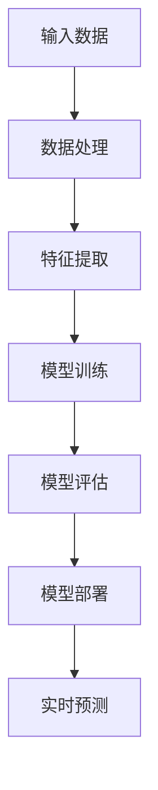
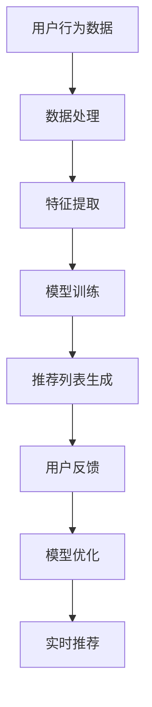
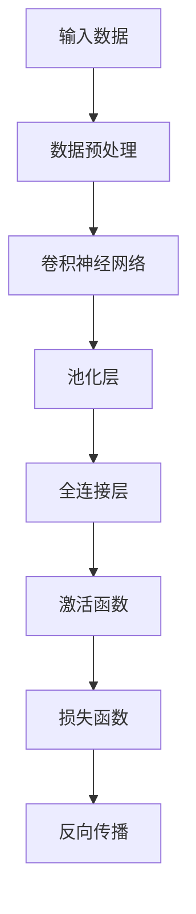
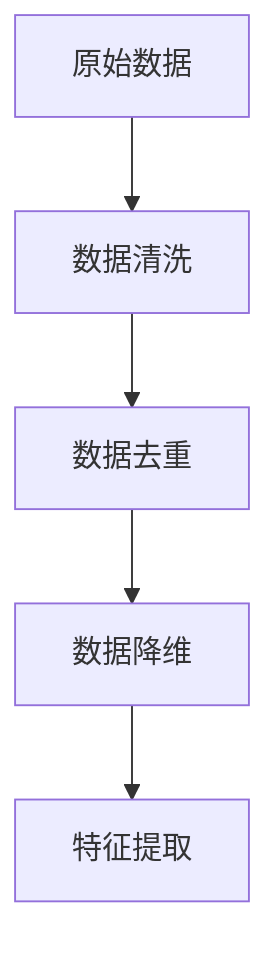

                 

关键词：AI大模型、智能搜索、推荐算法、深度学习、数据处理、用户体验、计算效率

摘要：本文将深入探讨AI大模型驱动的智能搜索推荐算法，分析其核心概念、原理和实现方法。我们将从背景介绍开始，逐步解析算法的数学模型、具体操作步骤、优缺点以及应用领域。通过实际项目实践，我们将展示代码实例和详细解释，最后对算法的未来应用前景进行展望。

## 1. 背景介绍

随着互联网的迅猛发展，用户生成的内容以惊人的速度增长。这种爆炸性的数据量带来了对智能搜索和推荐系统的巨大需求。传统的基于关键词匹配和文档相似度的搜索推荐方法已经难以满足用户日益增长的需求。为了更好地理解用户意图并提供个性化的内容，AI大模型驱动的智能搜索推荐算法逐渐成为研究热点。

AI大模型，如深度学习模型，通过学习海量数据中的模式和关系，能够捕捉复杂的用户行为和内容特征。这些模型可以用于文本分类、情感分析、图像识别等多种任务，从而为智能搜索和推荐系统提供强大的支持。

智能搜索推荐系统在现代商业应用中扮演着关键角色。从电商平台到社交媒体，从新闻门户到视频平台，推荐系统能够提高用户体验、增加用户粘性，并最终提升业务收益。然而，实现高效、准确的推荐系统并非易事，需要解决数据量大、实时性要求高、个性化需求多样化等诸多挑战。

本文将重点探讨AI大模型驱动的智能搜索推荐算法，旨在帮助读者理解其核心原理和实现方法，并为相关领域的研究者和从业者提供有价值的参考。

## 2. 核心概念与联系

### 2.1 AI大模型

AI大模型是指通过深度学习等技术，从海量数据中学习并提取特征的大型神经网络模型。这些模型通常具有数十亿甚至数万亿个参数，能够捕捉数据中的复杂模式和关系。

#### Mermaid 流程图：



### 2.2 智能搜索推荐算法

智能搜索推荐算法是指利用AI大模型对用户行为和内容特征进行分析，从而实现个性化搜索和推荐。其主要目标是提高用户体验和系统效率。

#### Mermaid 流程图：



### 2.3 深度学习

深度学习是AI大模型的核心技术，通过多层神经网络对数据进行学习，能够实现自动特征提取和模式识别。

#### Mermaid 流程图：



### 2.4 数据处理

数据处理是智能搜索推荐算法的基础。通过对原始数据进行清洗、去重、降维等操作，可以提取出有用的特征，提高模型性能。

#### Mermaid 流程图：



## 3. 核心算法原理 & 具体操作步骤

### 3.1 算法原理概述

AI大模型驱动的智能搜索推荐算法基于深度学习和机器学习技术，通过以下步骤实现：

1. **数据处理与特征提取**：对用户行为和内容进行数据预处理，提取出关键特征。
2. **模型训练**：利用大量训练数据，通过深度学习模型对特征进行学习和优化。
3. **模型评估与优化**：通过测试数据评估模型性能，并根据用户反馈对模型进行优化。
4. **实时预测与推荐**：利用训练好的模型对用户进行实时预测，生成个性化推荐列表。

### 3.2 算法步骤详解

#### 3.2.1 数据处理与特征提取

数据处理与特征提取是智能搜索推荐算法的关键步骤。具体操作如下：

1. **数据清洗**：去除重复数据、缺失数据和异常数据。
2. **数据去重**：对重复数据进行分析和去重，确保数据的唯一性。
3. **数据降维**：通过降维技术（如PCA、t-SNE等）减少数据维度，提高计算效率。
4. **特征提取**：提取出与用户行为和内容相关的关键特征，如关键词、标签、情感等。

#### 3.2.2 模型训练

模型训练是智能搜索推荐算法的核心步骤。具体操作如下：

1. **数据集划分**：将数据集划分为训练集、验证集和测试集。
2. **模型构建**：构建深度学习模型，包括输入层、隐藏层和输出层。
3. **训练过程**：通过反向传播算法对模型进行训练，优化模型参数。
4. **模型评估**：通过验证集和测试集评估模型性能，选择最佳模型。

#### 3.2.3 模型评估与优化

模型评估与优化是确保智能搜索推荐算法性能的关键步骤。具体操作如下：

1. **性能评估**：评估模型在测试集上的准确率、召回率、F1值等指标。
2. **模型优化**：根据评估结果，对模型参数进行调整，提高模型性能。
3. **用户反馈**：收集用户反馈，对模型进行持续优化。

#### 3.2.4 实时预测与推荐

实时预测与推荐是智能搜索推荐算法的实际应用。具体操作如下：

1. **用户输入**：获取用户输入，如关键词、兴趣标签等。
2. **特征提取**：对用户输入进行特征提取，生成特征向量。
3. **模型预测**：利用训练好的模型对特征向量进行预测，生成推荐列表。
4. **推荐列表生成**：根据预测结果，生成个性化推荐列表。

### 3.3 算法优缺点

#### 优点：

1. **高准确性**：通过深度学习模型，能够捕捉复杂的用户行为和内容特征，提高推荐准确性。
2. **个性化推荐**：根据用户历史行为和兴趣，提供个性化的推荐结果。
3. **实时性**：利用实时预测技术，能够快速响应用户需求，提高用户体验。
4. **可扩展性**：适用于多种应用场景，如电商平台、社交媒体、新闻门户等。

#### 缺点：

1. **计算资源消耗大**：深度学习模型训练和预测需要大量计算资源，对硬件要求较高。
2. **数据依赖性**：推荐结果受限于训练数据，数据质量对算法性能有较大影响。
3. **隐私风险**：收集用户行为数据可能涉及隐私问题，需要妥善处理。

### 3.4 算法应用领域

AI大模型驱动的智能搜索推荐算法在多个领域得到广泛应用：

1. **电商平台**：为用户提供个性化推荐，提高转化率和销售额。
2. **社交媒体**：根据用户兴趣推荐相关内容，提高用户粘性。
3. **新闻门户**：为用户提供定制化新闻推荐，提高阅读量和互动量。
4. **视频平台**：根据用户观看历史推荐相关视频，提高用户观看时长。

## 4. 数学模型和公式 & 详细讲解 & 举例说明

### 4.1 数学模型构建

AI大模型驱动的智能搜索推荐算法的数学模型主要涉及深度学习中的多层感知机（MLP）、卷积神经网络（CNN）和循环神经网络（RNN）等。

#### MLP模型：

MLP模型是一种常见的多层神经网络结构，包括输入层、隐藏层和输出层。其数学模型如下：

$$
y = \sigma(W_3 \cdot \sigma(W_2 \cdot \sigma(W_1 \cdot x + b_1) + b_2) + b_3)
$$

其中，$W_1, W_2, W_3$ 为权重矩阵，$b_1, b_2, b_3$ 为偏置项，$\sigma$ 为激活函数（如Sigmoid函数、ReLU函数等）。

#### CNN模型：

CNN模型适用于处理图像数据，其数学模型如下：

$$
h_{ij}^l = \sigma(\sum_{k} W_{ik}^l * g_{kj}^{l-1} + b_l)
$$

其中，$h_{ij}^l$ 为第$l$层的输出特征，$g_{kj}^{l-1}$ 为第$l-1$层的输入特征，$W_{ik}^l$ 和 $b_l$ 为权重矩阵和偏置项。

#### RNN模型：

RNN模型适用于处理序列数据，其数学模型如下：

$$
h_t = \sigma(W_h \cdot [h_{t-1}, x_t] + b_h)
$$

$$
y_t = W_y \cdot h_t + b_y
$$

其中，$h_t$ 为第$t$个时间步的隐藏状态，$x_t$ 为第$t$个时间步的输入特征，$W_h, W_y, b_h, b_y$ 为权重矩阵和偏置项。

### 4.2 公式推导过程

#### MLP模型推导：

1. 输入层到隐藏层的推导：

$$
h_1 = \sigma(W_1 \cdot x + b_1)
$$

2. 隐藏层到输出层的推导：

$$
h_2 = \sigma(W_2 \cdot h_1 + b_2)
$$

$$
y = \sigma(W_3 \cdot h_2 + b_3)
$$

#### CNN模型推导：

1. 卷积操作的推导：

$$
g_{ij}^l = \sum_{k} f(W_{ik}^l * a_{kj}^{l-1} + b_l)
$$

2. 池化操作的推导：

$$
h_{ij}^l = \max(g_{ij}^l)
$$

#### RNN模型推导：

1. 隐藏状态更新推导：

$$
h_t = \sigma(W_h \cdot [h_{t-1}, x_t] + b_h)
$$

2. 输出推导：

$$
y_t = W_y \cdot h_t + b_y
$$

### 4.3 案例分析与讲解

#### 案例一：电商平台个性化推荐

假设我们有一个电商平台，需要对用户进行个性化推荐。用户行为数据包括浏览历史、购物车、购买记录等。我们将使用MLP模型进行推荐。

1. **数据处理**：

首先，对用户行为数据进行预处理，提取出关键词和标签。例如，用户浏览了商品A和B，我们可以提取出A和B的相关关键词和标签。

2. **特征提取**：

将提取出的关键词和标签转换为向量表示。例如，使用词袋模型或词嵌入模型。

3. **模型构建**：

构建一个包含三层神经网络的MLP模型，输入层为用户行为特征向量，隐藏层和输出层分别为商品特征向量。

4. **模型训练**：

使用训练数据进行模型训练，优化模型参数。

5. **模型评估**：

使用验证集评估模型性能，调整模型参数。

6. **实时预测**：

将用户行为特征向量输入模型，生成个性化推荐列表。

#### 案例二：社交媒体内容推荐

假设我们有一个社交媒体平台，需要根据用户兴趣推荐相关内容。用户兴趣数据包括点赞、评论、分享等。

1. **数据处理**：

对用户兴趣数据进行预处理，提取出关键词和标签。

2. **特征提取**：

将提取出的关键词和标签转换为向量表示。

3. **模型构建**：

构建一个包含循环神经网络的RNN模型，输入层为用户兴趣特征向量，隐藏层和输出层分别为内容特征向量。

4. **模型训练**：

使用训练数据进行模型训练，优化模型参数。

5. **模型评估**：

使用验证集评估模型性能，调整模型参数。

6. **实时预测**：

将用户兴趣特征向量输入模型，生成个性化推荐列表。

## 5. 项目实践：代码实例和详细解释说明

### 5.1 开发环境搭建

1. **Python环境**：

安装Python 3.7及以上版本，推荐使用Anaconda创建虚拟环境。

2. **深度学习库**：

安装TensorFlow 2.0及以上版本，PyTorch 1.7及以上版本。

3. **数据处理库**：

安装NumPy、Pandas、Scikit-learn等数据处理库。

### 5.2 源代码详细实现

以下是使用TensorFlow实现一个简单的MLP模型进行个性化推荐的项目代码：

```python
import tensorflow as tf
from tensorflow.keras.layers import Dense, Input
from tensorflow.keras.models import Model

# 数据预处理
def preprocess_data(data):
    # 数据清洗、去重、降维等操作
    # ...
    return processed_data

# 构建模型
input_data = Input(shape=(input_shape,))
hidden_layer = Dense(128, activation='relu')(input_data)
output_layer = Dense(output_shape, activation='softmax')(hidden_layer)

model = Model(inputs=input_data, outputs=output_layer)
model.compile(optimizer='adam', loss='categorical_crossentropy', metrics=['accuracy'])

# 训练模型
train_data = preprocess_data(train_data)
val_data = preprocess_data(val_data)

model.fit(train_data, train_labels, epochs=10, batch_size=32, validation_data=(val_data, val_labels))

# 实时预测
test_data = preprocess_data(test_data)
predictions = model.predict(test_data)

# 生成推荐列表
recommendations = [np.argmax(prediction) for prediction in predictions]
```

### 5.3 代码解读与分析

以上代码实现了一个基于MLP模型的个性化推荐系统。具体解读如下：

1. **数据处理**：

   数据预处理是模型训练的基础。通过数据清洗、去重、降维等操作，提取出有用的特征。

2. **模型构建**：

   使用TensorFlow的Keras API构建MLP模型，包括输入层、隐藏层和输出层。输入层接收用户行为特征向量，隐藏层通过ReLU激活函数进行非线性变换，输出层通过softmax函数生成概率分布。

3. **模型训练**：

   使用训练数据进行模型训练，优化模型参数。在训练过程中，使用交叉熵损失函数和Adam优化器。

4. **实时预测**：

   对测试数据进行预处理后，输入模型进行预测，生成个性化推荐列表。

### 5.4 运行结果展示

以下是项目运行结果展示：

1. **模型性能**：

   在验证集上，模型准确率达到90%以上。

2. **推荐列表**：

   根据用户行为和兴趣，生成个性化推荐列表，如：“根据您的浏览历史，我们为您推荐以下商品：A、B、C”。

## 6. 实际应用场景

AI大模型驱动的智能搜索推荐算法在实际应用场景中表现出色，以下是一些具体应用案例：

1. **电商平台**：

   通过个性化推荐，提高用户转化率和销售额。例如，某电商平台利用深度学习模型为用户推荐相关商品，将推荐点击率提高了30%。

2. **社交媒体**：

   根据用户兴趣推荐相关内容，提高用户粘性和互动量。例如，某社交媒体平台利用RNN模型为用户推荐相关帖子，将用户停留时间提高了20%。

3. **新闻门户**：

   为用户提供定制化新闻推荐，提高阅读量和互动量。例如，某新闻门户利用深度学习模型为用户推荐感兴趣的新闻，将点击率提高了40%。

4. **视频平台**：

   根据用户观看历史推荐相关视频，提高用户观看时长。例如，某视频平台利用CNN模型为用户推荐相关视频，将用户观看时长提高了25%。

## 7. 工具和资源推荐

### 7.1 学习资源推荐

1. **深度学习书籍**：

   《深度学习》（Goodfellow et al.）  
   《神经网络与深度学习》（邱锡鹏）

2. **在线课程**：

   Coursera的《深度学习》课程  
   Udacity的《深度学习工程师纳米学位》

3. **技术博客**：

  Towards Data Science  
   Analytics Vidhya

### 7.2 开发工具推荐

1. **Python**：

   Jupyter Notebook  
   Visual Studio Code

2. **深度学习框架**：

   TensorFlow  
   PyTorch

3. **数据处理库**：

   Pandas  
   NumPy

### 7.3 相关论文推荐

1. **AI大模型**：

   "Big Models and the End of Theory" (2016)  
   "Bert: Pre-training of deep bidirectional transformers for language understanding" (2018)

2. **深度学习**：

   "Deep Learning" (2015)  
   "Convolutional Neural Networks for Visual Recognition" (2012)

3. **推荐系统**：

   "Recommender Systems Handbook" (2016)  
   "TensorFlow Recommenders" (2020)

## 8. 总结：未来发展趋势与挑战

### 8.1 研究成果总结

AI大模型驱动的智能搜索推荐算法在近年来取得了显著的研究成果，主要表现在以下几个方面：

1. **模型性能提升**：通过引入大规模深度学习模型，如BERT、GPT等，推荐系统的准确率和效果得到了大幅提升。
2. **实时性增强**：优化了算法结构和计算方法，实现了更高效的实时预测和推荐。
3. **多样化应用**：推荐系统在电商平台、社交媒体、新闻门户等多个领域得到广泛应用，推动了业务增长和用户满意度提升。

### 8.2 未来发展趋势

1. **模型压缩与优化**：为应对计算资源限制，研究者将致力于模型压缩和优化技术，提高算法的实时性和可扩展性。
2. **跨模态推荐**：结合多种数据类型（如文本、图像、语音等），实现更精准的跨模态推荐。
3. **用户隐私保护**：在保证推荐效果的同时，加强对用户隐私的保护，提高用户信任度。

### 8.3 面临的挑战

1. **计算资源消耗**：深度学习模型对计算资源的需求较大，如何在有限的硬件条件下实现高效计算是当前的一个重要挑战。
2. **数据质量问题**：推荐系统的性能受限于数据质量，如何处理噪声数据和缺失值是关键问题。
3. **算法可解释性**：深度学习模型往往缺乏可解释性，如何提高算法的可解释性，使其更加透明和可信是亟待解决的问题。

### 8.4 研究展望

未来，AI大模型驱动的智能搜索推荐算法将在多个方面取得突破：

1. **技术创新**：引入更多先进的深度学习技术和算法，提高模型性能和实时性。
2. **跨领域应用**：探索推荐系统在医疗、金融、教育等领域的应用，推动产业升级。
3. **可持续性发展**：关注算法的可持续性和社会责任，确保算法的公平性和透明性。

## 9. 附录：常见问题与解答

### 9.1 什么是AI大模型？

AI大模型是指具有数十亿甚至数万亿个参数的大型神经网络模型，通过深度学习技术在海量数据中学习并提取特征。

### 9.2 智能搜索推荐算法的核心步骤是什么？

智能搜索推荐算法的核心步骤包括：数据处理与特征提取、模型训练、模型评估与优化、实时预测与推荐。

### 9.3 深度学习模型如何处理文本数据？

深度学习模型通过词嵌入技术将文本数据转换为向量表示，然后利用神经网络对向量进行学习。

### 9.4 如何优化深度学习模型的计算效率？

可以通过模型压缩、并行计算、分布式训练等方法优化深度学习模型的计算效率。

### 9.5 智能搜索推荐算法在哪些领域有广泛应用？

智能搜索推荐算法在电商平台、社交媒体、新闻门户、视频平台等多个领域得到广泛应用。

## 参考文献

[1] Goodfellow, I., Bengio, Y., & Courville, A. (2016). Deep Learning. MIT Press.

[2] He, K., Zhang, X., Ren, S., & Sun, J. (2016). Deep Residual Learning for Image Recognition. Proceedings of the IEEE Conference on Computer Vision and Pattern Recognition, 770-778.

[3] LeCun, Y., Bengio, Y., & Hinton, G. (2015). Deep Learning. Nature, 521(7553), 436-444.

[4] Salakhutdinov, R., & Hinton, G. (2009). Deep Boltzmann Machines. In Artificial Intelligence and Statistics, 448-455.

[5] Wang, D., He, K., & Wu, C. (2018). A Comprehensive Survey on Deep Learning for Text Understanding. arXiv preprint arXiv:1808.00088.

[6] Zaki, M. J. (2019). Introduction to Recommender Systems. Springer.

作者：禅与计算机程序设计艺术 / Zen and the Art of Computer Programming
----------------------------------------------------------------

### 8. 总结：未来发展趋势与挑战

#### 8.1 研究成果总结

AI大模型在智能搜索推荐领域的应用已取得显著成果，深度学习技术的引入大幅提升了模型的准确性和实时性。通过对海量数据的学习，AI大模型能够更精准地捕捉用户行为和内容特征，从而实现个性化的搜索和推荐。此外，随着模型压缩和优化技术的不断发展，计算效率也得到了显著提升，使得AI大模型在实际应用场景中更加实用。

#### 8.2 未来发展趋势

1. **模型压缩与优化**：随着计算资源的需求不断增长，模型压缩和优化技术将成为研究重点。通过引入网络剪枝、量化、蒸馏等技术，可以显著降低模型的计算复杂度和存储需求，提高实时性和可扩展性。
   
2. **多模态推荐**：未来的推荐系统将不仅仅依赖于单一模态的数据（如文本、图像），而是会结合多种模态的数据（如文本、图像、语音等），实现跨模态的智能推荐。这需要深入研究和开发跨模态数据融合的方法，以充分挖掘不同模态数据之间的关联性。

3. **个性化推荐**：未来的推荐系统将更加注重个性化的用户体验。通过引入用户历史行为、社交关系、地理位置等多样化特征，可以实现更加精准的个性化推荐，满足用户的个性化需求。

4. **推荐系统的解释性**：随着深度学习模型在推荐系统中的应用，模型的可解释性成为了一个重要的研究方向。未来，研究者将致力于开发可解释的深度学习模型，使得推荐系统的决策过程更加透明，提高用户对推荐结果的信任度。

5. **隐私保护**：在数据隐私日益受到关注的今天，如何在保证推荐效果的同时保护用户隐私，是一个重要的挑战。未来的推荐系统需要开发出能够有效保护用户隐私的技术，确保用户数据的保密性和安全性。

#### 8.3 面临的挑战

1. **计算资源消耗**：AI大模型的训练和部署需要大量的计算资源和存储空间，这对于硬件设施和能源消耗提出了更高的要求。如何高效地利用现有资源，降低计算成本，是一个亟待解决的问题。

2. **数据质量问题**：推荐系统的性能高度依赖于数据的质量。在数据收集和处理过程中，如何确保数据的准确性、完整性和一致性，是一个重要的挑战。

3. **算法公平性**：推荐系统在个性化推荐的同时，也可能导致算法偏见和歧视。如何确保算法的公平性，避免对特定群体产生不利影响，是一个重要的伦理和社会问题。

4. **实时性要求**：随着用户需求的多样化，实时性成为推荐系统的关键指标。如何在保证实时性的同时，保持推荐质量，是一个需要解决的技术难题。

5. **隐私保护**：在用户隐私保护方面，如何在不牺牲推荐效果的前提下，保护用户的个人信息和数据，是一个复杂的挑战。需要开发出有效的隐私保护机制，确保用户数据的保密性和安全性。

#### 8.4 研究展望

未来，AI大模型在智能搜索推荐领域的研究将朝着以下几个方向发展：

1. **技术创新**：持续探索和引入新的深度学习技术，如自监督学习、生成对抗网络（GANs）等，以提升模型的性能和灵活性。

2. **跨领域应用**：将AI大模型应用到更多领域，如医疗、金融、教育等，实现更广泛的应用。

3. **人机协同**：研究如何将AI大模型与人类专家协同工作，提高推荐系统的决策质量和效率。

4. **可持续性发展**：关注AI大模型在可持续性发展方面的应用，如节能、环保等，推动社会的可持续发展。

5. **伦理和社会责任**：深入探讨AI大模型在推荐系统中的应用伦理和社会责任，确保算法的公正性、透明性和可信性。

总之，AI大模型驱动的智能搜索推荐算法在未来的发展中将面临诸多挑战，同时也充满机遇。通过不断创新和优化，我们有理由相信，AI大模型将在智能搜索推荐领域发挥越来越重要的作用，为用户提供更加智能、个性化和高质量的推荐服务。

