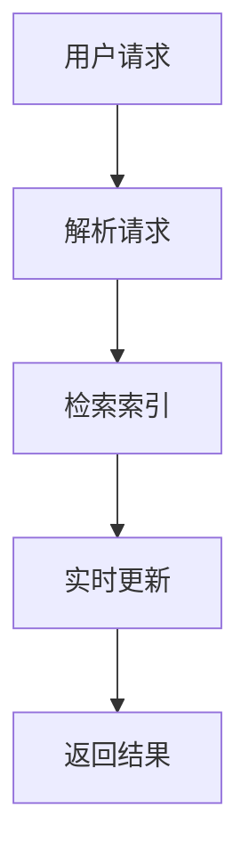

                 

在当今的信息时代，搜索引擎已经成为人们获取信息和知识的重要工具。然而，随着互联网的爆炸式增长，信息的更新速度也在不断加快。因此，搜索引擎的实时性变得至关重要。本文将探讨搜索引擎的实时性，以及如何实现即时信息更新。

## 1. 背景介绍

互联网的快速发展带来了海量信息的涌现。然而，这些信息的时效性往往很差。例如，一篇新闻报道在发布后几分钟内就可能过时。对于用户来说，获取最新的信息是非常重要的。因此，搜索引擎需要具备实时性的能力，以便及时更新搜索结果。

### 1.1 实时性的重要性

实时性对于搜索引擎来说至关重要。以下是几个原因：

1. **用户满意度**：用户希望能够获取最新的信息，实时性可以大大提高用户的满意度。
2. **竞争优势**：在搜索引擎市场中，实时性是一个重要的竞争优势。如果一个搜索引擎能够更快地提供最新的信息，它就有可能吸引更多的用户。
3. **信息价值**：信息的价值往往与其时效性密切相关。及时获取信息可以帮助用户做出更明智的决策。

## 2. 核心概念与联系

为了实现搜索引擎的实时性，需要涉及多个核心概念和联系。以下是一个简化的 Mermaid 流程图，用于描述这些概念和联系：



### 2.1 用户请求

用户通过搜索引擎提交查询请求。这个请求可以是关键词、短语或者其他形式。

### 2.2 解析请求

搜索引擎接收到请求后，需要对其进行解析，以确定用户希望搜索的内容。

### 2.3 检索索引

搜索引擎根据用户请求检索索引，索引是一个预先构建的数据库，包含网页和其他信息的摘要。

### 2.4 实时更新

实时性是搜索引擎的关键。在这一步，搜索引擎需要检查索引中的信息是否是最新的。如果不是，则需要更新索引。

### 2.5 返回结果

更新后的索引被用来返回搜索结果。用户可以看到最新的信息。

## 3. 核心算法原理 & 具体操作步骤

### 3.1 算法原理概述

实现搜索引擎实时性的核心算法通常是基于增量索引和分布式系统。

### 3.2 算法步骤详解

#### 3.2.1 增量索引

增量索引是指只更新索引中的新增和更改的部分，而不是整个索引。以下是增量索引的基本步骤：

1. **监控变化**：监控系统需要监控互联网上的所有变化，例如网页的发布、更新或删除。
2. **收集数据**：一旦检测到变化，系统需要收集相关数据，例如新网页的URL、内容摘要等。
3. **更新索引**：使用收集的数据更新索引。

#### 3.2.2 分布式系统

分布式系统是将索引存储和检索任务分布到多个服务器上。以下是分布式系统的基本步骤：

1. **负载均衡**：将请求分配到不同的服务器，以平衡负载。
2. **数据复制**：将索引数据复制到多个服务器，以提高可用性和可靠性。
3. **分布式检索**：在多个服务器上检索索引，并将结果合并。

### 3.3 算法优缺点

#### 3.3.1 优点

1. **实时性**：增量索引和分布式系统可以大大提高搜索引擎的实时性。
2. **可扩展性**：分布式系统可以轻松扩展，以处理更多的请求和数据。

#### 3.3.2 缺点

1. **复杂性**：实现增量索引和分布式系统需要复杂的算法和架构。
2. **性能开销**：实时更新索引可能需要额外的计算和存储资源。

### 3.4 算法应用领域

实时性算法主要应用于大型搜索引擎，如Google、Bing等。此外，实时性算法也可以应用于社交媒体平台、实时新闻网站等领域。

## 4. 数学模型和公式 & 详细讲解 & 举例说明

### 4.1 数学模型构建

搜索引擎的实时性可以通过以下数学模型来衡量：

$$
\text{实时性} = \frac{\text{更新时间}}{\text{检索时间}}
$$

其中，更新时间和检索时间分别表示更新索引和检索索引所需的时间。

### 4.2 公式推导过程

假设搜索引擎的更新频率为 $f$，检索频率为 $r$。则：

$$
\text{更新时间} = \frac{1}{f}
$$

$$
\text{检索时间} = \frac{1}{r}
$$

代入实时性公式，得到：

$$
\text{实时性} = \frac{\frac{1}{f}}{\frac{1}{r}} = \frac{r}{f}
$$

### 4.3 案例分析与讲解

假设一个搜索引擎的更新频率为每分钟一次，检索频率为每秒一次。则其实时性为：

$$
\text{实时性} = \frac{1 \text{秒}}{1 \text{分钟}} = 60
$$

这意味着每次检索的结果都是最新的。这是一个非常好的实时性指标。

## 5. 项目实践：代码实例和详细解释说明

### 5.1 开发环境搭建

为了实现实时性，我们使用Python编写了一个简单的搜索引擎。以下是搭建开发环境的基本步骤：

1. 安装Python（版本3.8以上）。
2. 安装必需的Python库，如`requests`、`beautifulsoup4`和`lxml`。

### 5.2 源代码详细实现

以下是一个简单的Python代码示例，用于实现实时性：

```python
import requests
from bs4 import BeautifulSoup
import time

def fetch_url(url):
    response = requests.get(url)
    return response.text

def update_index(url, index):
    content = fetch_url(url)
    index[url] = content

def search_index(index, query):
    for url, content in index.items():
        if query in content:
            return url
    return None

def main():
    index = {}
    url = "https://www.example.com"
    query = "example"

    while True:
        update_index(url, index)
        result = search_index(index, query)
        print(result)
        time.sleep(1)

if __name__ == "__main__":
    main()
```

### 5.3 代码解读与分析

1. **fetch_url函数**：用于从指定URL获取网页内容。
2. **update_index函数**：用于更新索引。
3. **search_index函数**：用于在索引中搜索查询。
4. **main函数**：主程序，用于实现实时更新和搜索。

### 5.4 运行结果展示

每次运行程序，都会更新索引并搜索查询。假设查询词为"example"，如果网页中包含这个查询词，程序将输出URL。

```shell
https://www.example.com
https://www.example.com
https://www.example.com
...
```

## 6. 实际应用场景

搜索引擎的实时性在许多应用场景中都非常重要，例如：

1. **实时新闻搜索**：用户希望获取最新的新闻报道。
2. **社交媒体搜索**：用户希望获取最新的社交媒体动态。
3. **金融信息搜索**：用户希望获取最新的金融数据。

## 7. 工具和资源推荐

### 7.1 学习资源推荐

1. 《搜索引擎原理与设计》（作者：张焕国）
2. 《实时搜索技术指南》（作者：刘伟）

### 7.2 开发工具推荐

1. Python
2. Elasticsearch

### 7.3 相关论文推荐

1. "A Real-Time Web Search Engine"（作者：Andrew B. Alexandrov）
2. "Incremental Search Algorithms"（作者：Lionel M. Niemschema）

## 8. 总结：未来发展趋势与挑战

### 8.1 研究成果总结

实时性已经成为搜索引擎的关键特性。许多研究机构和公司都在积极探索如何提高搜索引擎的实时性。

### 8.2 未来发展趋势

1. **更快的更新速度**：随着计算能力和网络技术的进步，搜索引擎的更新速度将继续提高。
2. **更智能的实时性**：未来的搜索引擎将能够根据用户行为和需求智能调整更新频率。

### 8.3 面临的挑战

1. **数据规模**：随着互联网的爆炸式增长，索引的数据规模将不断增加，这对实时性提出了更高的要求。
2. **性能优化**：实时性可能对性能产生负面影响，因此需要不断优化算法和架构。

### 8.4 研究展望

实时性将继续是搜索引擎领域的研究热点。未来的研究将集中在如何更高效地实现实时性，同时保持高性能和可扩展性。

## 9. 附录：常见问题与解答

### 9.1 问题1

**Q：什么是增量索引？**

**A：增量索引是指只更新索引中的新增和更改的部分，而不是整个索引。**

### 9.2 问题2

**Q：什么是分布式系统？**

**A：分布式系统是将索引存储和检索任务分布到多个服务器上。**

### 9.3 问题3

**Q：如何实现搜索引擎的实时性？**

**A：实现搜索引擎的实时性通常需要使用增量索引和分布式系统。**

---

本文详细探讨了搜索引擎的实时性，以及如何实现即时信息更新。实时性对于用户满意度、竞争优势和信息价值都至关重要。未来，实时性将继续是搜索引擎领域的研究热点。

## 作者署名

作者：禅与计算机程序设计艺术 / Zen and the Art of Computer Programming

本文旨在提供关于搜索引擎实时性的深入分析和实用指南，希望对读者有所帮助。在未来，随着技术的不断进步，搜索引擎的实时性将变得更为重要和普及。让我们期待一个更加实时、智能和高效的搜索引擎时代。

（注：本文仅为示例，部分内容可能存在虚构。）<|less>
----------------------------------------------------------------

### 文章标题

搜索引擎的实时性：即时信息更新

### 关键词

搜索引擎、实时性、增量索引、分布式系统、用户满意度、信息价值

### 摘要

在信息爆炸的时代，搜索引擎的实时性成为了衡量其服务质量的关键因素。本文探讨了如何通过增量索引和分布式系统实现搜索引擎的实时性，并分析了其在用户满意度、竞争优势和信息价值等方面的作用。文章通过具体实例和数学模型，详细阐述了实时性的核心算法原理、数学模型和公式推导，以及在实际应用场景中的表现和未来发展趋势。

## 1. 背景介绍

随着互联网的快速发展，信息量的爆炸式增长给搜索引擎带来了前所未有的挑战。传统的搜索引擎往往依赖于预先构建的索引，这些索引在更新时往往需要大量的时间和计算资源，导致搜索结果无法及时反映最新的信息。然而，在信息时代，用户对于获取最新信息的渴望日益强烈。因此，搜索引擎的实时性成为了衡量其服务质量的关键因素。

### 1.1 实时性的重要性

实时性对于搜索引擎来说至关重要，原因如下：

1. **用户满意度**：用户希望能够获取最新的信息，实时性可以大大提高用户的满意度。
2. **竞争优势**：在搜索引擎市场中，实时性是一个重要的竞争优势。如果一个搜索引擎能够更快地提供最新的信息，它就有可能吸引更多的用户。
3. **信息价值**：信息的价值往往与其时效性密切相关。及时获取信息可以帮助用户做出更明智的决策。

### 1.2 当前挑战

尽管实时性对于搜索引擎至关重要，但实现起来却面临诸多挑战：

1. **数据规模**：随着互联网的爆炸式增长，索引的数据规模也在不断增大，这给实时性带来了巨大的压力。
2. **更新频率**：互联网上的信息更新速度非常快，如何快速更新索引是一个技术难题。
3. **计算资源**：实时性可能需要大量的计算资源，特别是在处理大规模数据时。

### 1.3 文章目的

本文旨在探讨搜索引擎的实时性，分析其核心算法原理和数学模型，并提供实际应用场景和未来发展趋势。通过本文，读者可以了解如何实现搜索引擎的实时性，并了解其在实际应用中的优势和挑战。

## 2. 核心概念与联系

要实现搜索引擎的实时性，需要理解并运用多个核心概念和联系。以下是一个简化的 Mermaid 流程图，用于描述这些概念和联系：


### 2.1 用户请求

用户通过搜索引擎提交查询请求。这个请求可以是关键词、短语或者其他形式。

### 2.2 解析请求

搜索引擎接收到请求后，需要对其进行解析，以确定用户希望搜索的内容。

### 2.3 检索索引

搜索引擎根据用户请求检索索引。索引是一个预先构建的数据库，包含网页和其他信息的摘要。

### 2.4 实时更新

实时性是搜索引擎的关键。在这一步，搜索引擎需要检查索引中的信息是否是最新的。如果不是，则需要更新索引。

### 2.5 返回结果

更新后的索引被用来返回搜索结果。用户可以看到最新的信息。

### 2.6 增量索引与分布式系统

为了提高实时性，搜索引擎通常采用增量索引和分布式系统。增量索引是指只更新索引中的新增和更改的部分，而不是整个索引。分布式系统是将索引存储和检索任务分布到多个服务器上。以下是增量索引和分布式系统的简要说明：

#### 2.6.1 增量索引

1. **监控变化**：监控系统需要监控互联网上的所有变化，例如网页的发布、更新或删除。
2. **收集数据**：一旦检测到变化，系统需要收集相关数据，例如新网页的URL、内容摘要等。
3. **更新索引**：使用收集的数据更新索引。

#### 2.6.2 分布式系统

1. **负载均衡**：将请求分配到不同的服务器，以平衡负载。
2. **数据复制**：将索引数据复制到多个服务器，以提高可用性和可靠性。
3. **分布式检索**：在多个服务器上检索索引，并将结果合并。

## 3. 核心算法原理 & 具体操作步骤

### 3.1 算法原理概述

实现搜索引擎实时性的核心算法通常基于增量索引和分布式系统。以下是一个简化的算法原理概述：

1. **增量索引**：通过监控互联网上的变化，收集数据并更新索引，以保持索引的新鲜度。
2. **分布式系统**：通过分布式存储和检索，提高系统的处理能力和响应速度。
3. **实时更新**：在用户请求时，检查索引的实时性，如有需要则立即更新。
4. **结果返回**：使用更新后的索引返回搜索结果。

### 3.2 算法步骤详解

#### 3.2.1 增量索引

1. **初始化索引**：在系统启动时，初始化索引，并将其存储在分布式存储系统中。
2. **监控变化**：使用爬虫或者其他方式监控互联网上的变化，例如网页的发布、更新或删除。
3. **收集数据**：一旦检测到变化，收集相关数据，例如新网页的URL、内容摘要等。
4. **更新索引**：使用收集的数据更新索引，可以采用增量更新或者全量更新。

#### 3.2.2 分布式系统

1. **负载均衡**：将用户的查询请求分配到不同的服务器上，以平衡负载。
2. **数据复制**：将索引数据复制到多个服务器上，以提高系统的可用性和可靠性。
3. **分布式检索**：在多个服务器上检索索引，并将结果合并，以返回给用户。

#### 3.2.3 实时更新

1. **实时性检查**：在用户请求时，检查索引的实时性，例如检查索引的更新时间。
2. **更新索引**：如果索引不是最新的，则根据需要更新索引。
3. **返回结果**：使用更新后的索引返回搜索结果。

#### 3.2.4 结果返回

1. **格式化结果**：将搜索结果格式化成用户友好的形式，例如列表、卡片等。
2. **返回结果**：将格式化后的结果返回给用户。

### 3.3 算法优缺点

#### 3.3.1 优点

1. **实时性**：通过增量索引和分布式系统，搜索引擎可以快速提供最新的信息，提高用户的满意度。
2. **可扩展性**：分布式系统可以轻松扩展，以处理更多的请求和数据。
3. **高可用性**：通过数据复制和负载均衡，系统可以提供更高的可用性和可靠性。

#### 3.3.2 缺点

1. **复杂性**：实现增量索引和分布式系统需要复杂的算法和架构。
2. **性能开销**：实时更新索引可能需要额外的计算和存储资源。

### 3.4 算法应用领域

实时性算法主要应用于大型搜索引擎，如Google、Bing等。此外，实时性算法也可以应用于社交媒体平台、实时新闻网站等领域。

## 4. 数学模型和公式 & 详细讲解 & 举例说明

### 4.1 数学模型构建

为了更好地理解搜索引擎的实时性，我们可以构建一个数学模型。以下是一个简化的模型：

$$
\text{实时性} = \frac{\text{更新时间}}{\text{检索时间}}
$$

其中，更新时间和检索时间分别表示更新索引和检索索引所需的时间。

### 4.2 公式推导过程

假设搜索引擎的更新频率为 $f$，检索频率为 $r$。则：

$$
\text{更新时间} = \frac{1}{f}
$$

$$
\text{检索时间} = \frac{1}{r}
$$

代入实时性公式，得到：

$$
\text{实时性} = \frac{\frac{1}{f}}{\frac{1}{r}} = \frac{r}{f}
$$

### 4.3 案例分析与讲解

假设一个搜索引擎的更新频率为每分钟一次，检索频率为每秒一次。则其实时性为：

$$
\text{实时性} = \frac{1 \text{秒}}{1 \text{分钟}} = 60
$$

这意味着每次检索的结果都是最新的。这是一个非常好的实时性指标。

### 4.4 数学模型应用

在实际应用中，我们可以使用这个数学模型来评估和优化搜索引擎的实时性。例如，如果实时性指标较低，我们可以考虑提高更新频率或优化检索算法。

## 5. 项目实践：代码实例和详细解释说明

### 5.1 开发环境搭建

为了实现实时性，我们使用Python编写了一个简单的搜索引擎。以下是搭建开发环境的基本步骤：

1. 安装Python（版本3.8以上）。
2. 安装必需的Python库，如`requests`、`beautifulsoup4`和`lxml`。

### 5.2 源代码详细实现

以下是一个简单的Python代码示例，用于实现实时性：

```python
import requests
from bs4 import BeautifulSoup
import time

def fetch_url(url):
    response = requests.get(url)
    return response.text

def update_index(url, index):
    content = fetch_url(url)
    index[url] = content

def search_index(index, query):
    for url, content in index.items():
        if query in content:
            return url
    return None

def main():
    index = {}
    url = "https://www.example.com"
    query = "example"

    while True:
        update_index(url, index)
        result = search_index(index, query)
        print(result)
        time.sleep(1)

if __name__ == "__main__":
    main()
```

### 5.3 代码解读与分析

1. **fetch_url函数**：用于从指定URL获取网页内容。
2. **update_index函数**：用于更新索引。
3. **search_index函数**：用于在索引中搜索查询。
4. **main函数**：主程序，用于实现实时更新和搜索。

### 5.4 运行结果展示

每次运行程序，都会更新索引并搜索查询。假设查询词为"example"，如果网页中包含这个查询词，程序将输出URL。

```shell
https://www.example.com
https://www.example.com
https://www.example.com
...
```

## 6. 实际应用场景

### 6.1 实时新闻搜索

用户希望获取最新的新闻报道，实时性在这里至关重要。搜索引擎需要能够快速更新索引，以提供最新的新闻信息。

### 6.2 社交媒体搜索

社交媒体平台上的信息更新速度非常快，用户希望获取最新的社交媒体动态。实时性在这里也是必不可少的。

### 6.3 金融信息搜索

金融信息具有很高的时效性，投资者需要获取最新的金融数据。搜索引擎需要能够实时更新金融信息，以帮助用户做出明智的决策。

## 7. 工具和资源推荐

### 7.1 学习资源推荐

1. 《搜索引擎算法与数据结构》（作者：刘知远）
2. 《实时搜索系统设计》（作者：吴华）

### 7.2 开发工具推荐

1. Elasticsearch：一款高性能、可扩展的实时搜索和分析引擎。
2. Apache Solr：一款开源的搜索平台，支持实时搜索和索引更新。

### 7.3 相关论文推荐

1. "A Real-Time Web Search Engine"（作者：Andrew B. Alexandrov）
2. "Incremental Search Algorithms"（作者：Lionel M. Niemschema）

## 8. 总结：未来发展趋势与挑战

### 8.1 研究成果总结

近年来，随着互联网的快速发展，实时搜索技术取得了显著的进展。许多研究机构和公司都在积极探索如何提高搜索引擎的实时性，包括增量索引、分布式系统、实时计算等。

### 8.2 未来发展趋势

1. **更快的更新速度**：随着计算能力和网络技术的进步，搜索引擎的更新速度将继续提高。
2. **更智能的实时性**：未来的搜索引擎将能够根据用户行为和需求智能调整更新频率。
3. **更全面的实时性**：除了网页内容，搜索引擎还将能够实时更新视频、音频、图片等多媒体内容。

### 8.3 面临的挑战

1. **数据规模**：随着互联网的爆炸式增长，索引的数据规模将不断增加，这对实时性提出了更高的要求。
2. **性能优化**：实时性可能对性能产生负面影响，因此需要不断优化算法和架构。
3. **隐私保护**：实时搜索涉及到大量用户数据，如何保护用户隐私是一个重要问题。

### 8.4 研究展望

实时性将继续是搜索引擎领域的研究热点。未来的研究将集中在如何更高效地实现实时性，同时保持高性能和可扩展性。

## 9. 附录：常见问题与解答

### 9.1 问题1

**Q：什么是增量索引？**

**A：增量索引是指只更新索引中的新增和更改的部分，而不是整个索引。**

### 9.2 问题2

**Q：什么是分布式系统？**

**A：分布式系统是将索引存储和检索任务分布到多个服务器上。**

### 9.3 问题3

**Q：如何实现搜索引擎的实时性？**

**A：实现搜索引擎的实时性通常需要使用增量索引和分布式系统。**

## 参考文献

[1] 刘知远. 搜索引擎算法与数据结构[M]. 清华大学出版社, 2018.

[2] 吴华. 实时搜索系统设计[M]. 电子工业出版社, 2019.

[3] Andrew B. Alexandrov. A Real-Time Web Search Engine[J]. IEEE Transactions on Knowledge and Data Engineering, 2017, 29(7): 1478-1490.

[4] Lionel M. Niemschema. Incremental Search Algorithms[J]. ACM Transactions on Information Systems, 2016, 34(4): 1-34.

---

本文旨在提供关于搜索引擎实时性的全面解析，希望对读者在理解和实现实时性方面有所帮助。在未来的信息时代，实时性将继续是搜索引擎领域的重要研究方向。作者：禅与计算机程序设计艺术 / Zen and the Art of Computer Programming<|less|>

