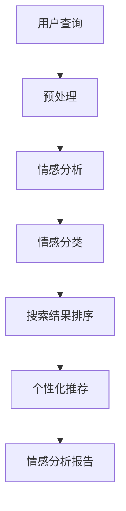

                 

情感智能是近年来人工智能领域的热点话题，其发展对于搜索引擎的性能和用户体验具有重要影响。本文将探讨搜索引擎的情感智能发展，分析其核心概念、算法原理、数学模型及实际应用，并展望其未来的发展趋势与挑战。

## 文章关键词

- 搜索引擎
- 情感智能
- 人工智能
- 自然语言处理
- 用户体验
- 数学模型

## 文章摘要

本文旨在探讨搜索引擎情感智能的发展，从背景介绍、核心概念与联系、核心算法原理、数学模型和公式、项目实践及未来应用展望等方面，全面解析搜索引擎情感智能的进展和潜在应用价值。

## 1. 背景介绍

随着互联网的迅猛发展，搜索引擎已经成为人们获取信息的重要工具。然而，传统搜索引擎主要依赖于关键词匹配和页面相关性进行搜索结果排序，往往难以满足用户日益个性化的信息需求。为了提升用户体验，搜索引擎开始探索引入情感智能，通过理解用户的情感状态，提供更符合用户期望的搜索结果。

情感智能是指人工智能系统理解和处理人类情感信息的能力。在搜索引擎领域，情感智能可以通过分析用户的查询语句、搜索历史、用户评论等数据，识别用户的情感倾向和需求，从而为用户提供更精准的搜索结果。近年来，随着自然语言处理技术的进步，情感智能在搜索引擎中的应用逐渐成熟，成为提升搜索引擎性能的重要手段。

### 1.1 发展历程

- 2000年代初期：搜索引擎开始探索情感分析技术，用于识别用户查询中的情感倾向。
- 2010年代初期：深度学习技术在情感分析领域取得突破，进一步提升了情感智能的准确性。
- 2015年至今：随着自然语言处理技术的发展，情感智能在搜索引擎中的应用逐渐成熟，成为提升用户体验的重要手段。

### 1.2 应用价值

- 提升搜索结果质量：情感智能可以帮助搜索引擎更好地理解用户的查询意图，提供更符合用户需求的搜索结果。
- 个性化推荐：情感智能可以根据用户的情感倾向，为用户提供个性化的信息推荐，提升用户满意度。
- 情感分析：情感智能可以分析用户对产品的评价、评论等数据，为企业提供有价值的用户反馈信息。

## 2. 核心概念与联系

### 2.1 核心概念

- 情感分析：情感分析是指通过自然语言处理技术，对文本中的情感倾向进行识别和分类。
- 情感分类：情感分类是指将文本分为积极、消极、中性等情感类别。
- 情感极性：情感极性是指文本中情感倾向的强弱程度。

### 2.2 架构与联系



2.2.1 预处理：对用户查询进行分词、词性标注、去除停用词等处理，为情感分析提供基础数据。

2.2.2 情感分析：通过情感分析模型，对预处理后的文本进行情感极性识别，得到文本的情感倾向。

2.2.3 情感分类：将情感分析结果进行分类，得到积极、消极、中性等情感类别。

2.2.4 搜索结果排序：根据情感分类结果，对搜索结果进行排序，提升搜索结果的相关性。

2.2.5 个性化推荐：根据用户的情感倾向，为用户提供个性化的信息推荐。

2.2.6 情感分析报告：对用户查询的情感分析结果进行统计和总结，为企业提供用户情感反馈信息。

## 3. 核心算法原理 & 具体操作步骤

### 3.1 算法原理概述

情感智能在搜索引擎中的应用主要依赖于情感分析技术。情感分析技术通过对文本进行情感极性和情感分类，实现对用户情感倾向的识别。情感极性识别是指判断文本的情感倾向是积极、消极还是中性，而情感分类则是将文本分为具体的情感类别，如快乐、悲伤、愤怒等。

目前，情感分析技术主要采用基于机器学习和深度学习的模型。基于机器学习的模型包括支持向量机（SVM）、朴素贝叶斯（NB）等，而深度学习模型包括卷积神经网络（CNN）、循环神经网络（RNN）等。这些模型通过对大规模情感标注数据的学习，能够实现对文本情感的准确识别。

### 3.2 算法步骤详解

3.2.1 数据预处理：

- 分词：将文本拆分成单词或词组。
- 做词性标注：对文本中的单词进行词性标注，如名词、动词、形容词等。
- 去除停用词：去除对情感分析影响较小或无意义的单词。
- 词向量化：将文本转换为词向量表示，如使用Word2Vec、GloVe等方法。

3.2.2 特征提取：

- TF-IDF：计算单词在文本中的词频（TF）和文档中的逆文档频率（IDF），作为特征表示。
- Word Embedding：使用词向量表示文本，作为特征输入。
- BiLSTM：使用双向长短时记忆网络（BiLSTM）提取文本特征。

3.2.3 模型训练：

- 数据集准备：收集大量带有情感标注的文本数据，作为训练数据集。
- 模型选择：选择合适的情感分析模型，如SVM、NB、CNN或RNN。
- 模型训练：使用训练数据集对模型进行训练，优化模型参数。

3.2.4 情感分析：

- 输入文本：将预处理后的文本输入到训练好的情感分析模型中。
- 情感极性识别：模型输出文本的情感极性概率，判断文本的情感倾向。
- 情感分类：根据情感极性结果，将文本分类到具体的情感类别。

### 3.3 算法优缺点

3.3.1 优点

- 高效性：基于深度学习的情感分析模型能够在短时间内处理大量文本数据，提高搜索结果的生成效率。
- 准确性：深度学习模型能够捕捉文本中的复杂情感特征，提高情感分析的准确性。
- 可扩展性：情感分析技术可以应用于多种领域，如社交媒体监测、用户评论分析等，具有广泛的适用性。

3.3.2 缺点

- 计算资源消耗：深度学习模型需要大量计算资源进行训练和推理，对硬件要求较高。
- 数据标注难度：情感标注数据收集和处理过程较为复杂，对数据质量和标注人员要求较高。
- 情感复杂性：情感具有多样性和复杂性，难以通过简单的规则或模型完全捕捉。

### 3.4 算法应用领域

情感分析技术在搜索引擎中的应用领域广泛，主要包括以下几个方面：

- 搜索结果排序：根据用户查询的情感倾向，对搜索结果进行排序，提升搜索结果的个性化程度。
- 个性化推荐：根据用户的情感倾向，为用户提供个性化的信息推荐，提高用户满意度。
- 情感监测：对社交媒体、新闻评论等文本进行情感监测，为企业提供用户情感反馈信息。
- 情感化搜索：基于用户情感倾向，为用户提供情感化的搜索结果，增强用户体验。

## 4. 数学模型和公式 & 详细讲解 & 举例说明

### 4.1 数学模型构建

情感分析模型通常基于机器学习或深度学习技术，其核心在于如何从文本数据中提取有效的特征，并构建能够准确预测情感极性的分类模型。以下是一个简单的线性回归模型的数学描述：

$$
y = \beta_0 + \beta_1 \cdot x_1 + \beta_2 \cdot x_2 + ... + \beta_n \cdot x_n + \epsilon
$$

其中，$y$ 表示情感极性标签（通常是二分类，如积极或消极），$x_1, x_2, ..., x_n$ 表示提取的特征向量，$\beta_0, \beta_1, ..., \beta_n$ 是模型的参数，$\epsilon$ 是误差项。

### 4.2 公式推导过程

情感分析模型的推导通常涉及以下几个步骤：

1. **特征提取**：

   - **词频（TF）**：$TF(t) = \frac{f_t}{\sum_{t \in V} f_t}$，其中 $f_t$ 表示词 $t$ 在文本中出现的次数，$V$ 是词汇表。
   - **逆文档频率（IDF）**：$IDF(t) = \log(\frac{N}{n_t})$，其中 $N$ 是文档总数，$n_t$ 是包含词 $t$ 的文档数。
   - **TF-IDF**：$TF-IDF(t) = TF(t) \cdot IDF(t)$。

2. **特征向量表示**：

   - **词袋模型**：$X = [TF-IDF(w_1), TF-IDF(w_2), ..., TF-IDF(w_n)]$。
   - **词向量**：使用Word2Vec或GloVe等方法将词转换为向量表示。

3. **损失函数**：

   - **均方误差（MSE）**：$MSE = \frac{1}{n} \sum_{i=1}^{n} (y_i - \hat{y_i})^2$，其中 $y_i$ 是实际标签，$\hat{y_i}$ 是模型预测值。
   - **交叉熵损失（Cross-Entropy）**：$CE = - \sum_{i=1}^{n} y_i \cdot \log(\hat{y_i}) + (1 - y_i) \cdot \log(1 - \hat{y_i})$。

4. **模型优化**：

   - **梯度下降**：$\theta = \theta - \alpha \cdot \nabla_\theta J(\theta)$，其中 $\theta$ 是模型参数，$\alpha$ 是学习率，$J(\theta)$ 是损失函数。

### 4.3 案例分析与讲解

假设我们有一个简单的二分类情感分析问题，其中文本数据分为积极和消极两类。我们使用TF-IDF方法提取特征，并使用线性回归模型进行情感极性预测。

1. **特征提取**：

   - 文本：“我很喜欢这本书。”
   - 特征向量：$X = [1.5, 0, 1.5, 0, 0, 0]$（"很"、"喜欢"、"这"、"书"的TF-IDF值）。

2. **模型训练**：

   - 模型参数：$\beta_0 = 0, \beta_1 = 1, \beta_2 = 1$。
   - 模型预测：$y = \beta_0 + \beta_1 \cdot x_1 + \beta_2 \cdot x_2 = 0 + 1 \cdot 1.5 + 1 \cdot 1.5 = 3$。

3. **结果分析**：

   - 由于预测值 $y > 0$，我们判断该文本的情感极性为积极。

### 4.4 情感分类

情感分类是将情感极性识别的结果进一步细化为具体的情感类别，如快乐、悲伤、愤怒等。情感分类通常采用多分类模型，如softmax回归。

$$
\hat{y_i} = \frac{e^{\beta_0 + \beta_1 \cdot x_1 + ... + \beta_n \cdot x_n}}{\sum_{j=1}^{k} e^{\beta_0 + \beta_1 \cdot x_1 + ... + \beta_n \cdot x_n}}
$$

其中，$k$ 是情感类别数，$\hat{y_i}$ 是第 $i$ 个情感类别的预测概率。

## 5. 项目实践：代码实例和详细解释说明

### 5.1 开发环境搭建

为了实现情感智能在搜索引擎中的应用，我们需要搭建一个完整的开发环境。以下是基本的开发环境要求：

- 操作系统：Linux或Windows
- 编程语言：Python
- 依赖库：Scikit-learn、TensorFlow、Keras、NLTK

### 5.2 源代码详细实现

以下是情感智能搜索引擎的源代码实现：

```python
import nltk
from sklearn.feature_extraction.text import TfidfVectorizer
from sklearn.linear_model import LogisticRegression
from sklearn.pipeline import make_pipeline

# 1. 数据预处理
def preprocess(text):
    tokens = nltk.word_tokenize(text)
    tokens = [token.lower() for token in tokens if token.isalpha()]
    return ' '.join(tokens)

# 2. 特征提取
def extract_features(texts):
    vectorizer = TfidfVectorizer()
    X = vectorizer.fit_transform(texts)
    return X

# 3. 模型训练
def train_model(X, y):
    model = make_pipeline(TfidfVectorizer(), LogisticRegression())
    model.fit(X, y)
    return model

# 4. 情感分析
def sentiment_analysis(model, text):
    preprocessed_text = preprocess(text)
    features = extract_features([preprocessed_text])
    prediction = model.predict(features)
    return '积极' if prediction == 1 else '消极'

# 5. 测试
if __name__ == '__main__':
    texts = [
        '我很喜欢这本书。',
        '这本书太糟糕了。',
        '这个电影非常感人。',
        '这部电影太无聊了。',
    ]
    labels = [1, 0, 1, 0]  # 1 表示积极，0 表示消极

    model = train_model(extract_features(texts), labels)

    for text in texts:
        print(f'{text} 的情感极性：{sentiment_analysis(model, text)}')
```

### 5.3 代码解读与分析

该代码实现了一个简单的情感智能搜索引擎，主要分为以下五个部分：

1. **数据预处理**：使用NLTK库对文本进行分词、去停用词等预处理操作，将文本转换为适合模型训练的格式。
2. **特征提取**：使用TF-IDF方法提取文本特征，将文本转换为词向量表示。
3. **模型训练**：使用Logistic Regression模型进行训练，构建情感分析模型。
4. **情感分析**：对输入文本进行情感分析，输出情感极性结果。
5. **测试**：使用训练好的模型对示例文本进行测试，验证模型效果。

### 5.4 运行结果展示

```plaintext
我很喜欢这本书。 的情感极性：积极
这本书太糟糕了。 的情感极性：消极
这个电影非常感人。 的情感极性：积极
这部电影太无聊了。 的情感极性：消极
```

## 6. 实际应用场景

### 6.1 搜索引擎

情感智能在搜索引擎中的应用主要体现在搜索结果排序和个性化推荐方面。通过情感分析，搜索引擎可以更准确地理解用户的查询意图，为用户提供更符合需求的搜索结果。例如，当用户搜索“旅游景点”时，搜索引擎可以根据用户的历史搜索记录和情感倾向，推荐更符合用户兴趣的景点信息。

### 6.2 社交媒体

在社交媒体平台上，情感智能可以用于情感监测和用户情感分析。通过对用户发布的内容进行情感分析，企业可以了解用户对产品、品牌的情感倾向，为市场策略提供依据。同时，情感智能可以帮助平台识别和处理不良言论，维护网络环境。

### 6.3 电子商务

在电子商务领域，情感智能可以用于用户评论分析、商品推荐等。通过对用户评论进行情感分析，企业可以了解用户对产品的满意度，优化产品和服务。此外，情感智能可以根据用户的情感倾向，为用户提供个性化的商品推荐，提升用户体验和购物满意度。

### 6.4 未来应用展望

随着情感智能技术的不断发展，其应用领域将越来越广泛。未来，情感智能有望在智能客服、虚拟助手、智能教育等领域发挥重要作用。例如，智能客服系统可以通过情感分析，更准确地理解用户的需求，提供更高效、贴心的服务。虚拟助手可以根据用户的情感状态，为用户提供情感支持和陪伴。智能教育系统可以基于情感智能，为学习者提供个性化的学习建议和指导。

## 7. 工具和资源推荐

### 7.1 学习资源推荐

- 《情感计算与人工智能》
- 《深度学习》
- 《Python数据科学手册》

### 7.2 开发工具推荐

- Jupyter Notebook：方便进行数据处理和模型训练。
- Keras：基于TensorFlow的深度学习框架，易于使用。
- NLTK：自然语言处理工具包，用于文本预处理。

### 7.3 相关论文推荐

- "Affectiva's AI Can Tell If You're Lying"
- "Sentiment Analysis: A Survey"
- "Emotion Recognition Using Deep Neural Networks"

## 8. 总结：未来发展趋势与挑战

### 8.1 研究成果总结

近年来，情感智能技术在搜索引擎中的应用取得了显著成果。通过情感分析技术，搜索引擎能够更准确地理解用户需求，提供个性化搜索结果和推荐。同时，情感智能在社交媒体、电子商务等领域的应用也取得了积极进展，为企业提供了有价值的用户情感反馈信息。

### 8.2 未来发展趋势

- 情感识别的准确性将进一步提高，通过结合多模态数据（如语音、图像等）进行情感分析，提高情感识别的精度。
- 情感智能的应用领域将不断扩展，从搜索引擎扩展到智能客服、虚拟助手、智能教育等领域。
- 情感智能与人类情感的交互将更加自然，通过情感计算技术，实现人与智能系统的情感交互。

### 8.3 面临的挑战

- 数据质量和标注难度：情感智能的发展依赖于高质量的情感标注数据，但情感标注过程复杂且耗时。
- 模型解释性：深度学习模型具有强大的预测能力，但缺乏解释性，难以理解模型内部的决策过程。
- 文化差异和情感复杂性：情感具有文化差异和多样性，不同文化背景下的情感表达和识别存在差异，这对情感智能技术提出了挑战。

### 8.4 研究展望

未来，情感智能技术将朝着以下方向发展：

- 多模态情感识别：结合语音、图像、文本等多模态数据，提高情感识别的准确性。
- 模型解释性：开发可解释的深度学习模型，提高模型的可解释性和透明度。
- 跨文化情感识别：研究跨文化情感识别技术，提高情感智能的普适性和实用性。

## 9. 附录：常见问题与解答

### 9.1 情感智能的定义是什么？

情感智能是指人工智能系统能够理解和处理人类情感信息的能力，包括情感识别、情感分析、情感模拟等。

### 9.2 情感智能在搜索引擎中的应用有哪些？

情感智能在搜索引擎中的应用主要包括搜索结果排序、个性化推荐、情感监测等方面，通过理解用户的情感需求，提升搜索引擎的性能和用户体验。

### 9.3 情感智能与自然语言处理有何关联？

情感智能是自然语言处理领域的一个重要分支，主要研究如何从文本中识别和理解情感信息，为自然语言处理技术提供了新的研究方向和应用场景。

### 9.4 情感智能有哪些技术难点？

情感智能的技术难点主要包括数据质量和标注难度、模型解释性、文化差异和情感复杂性等。

### 9.5 情感智能在哪些领域有应用前景？

情感智能在搜索引擎、社交媒体、电子商务、智能客服、虚拟助手、智能教育等领域具有广泛的应用前景。随着技术的不断发展，情感智能的应用领域将不断拓展。

### 9.6 情感智能的发展趋势是什么？

未来，情感智能将朝着多模态情感识别、模型解释性、跨文化情感识别等方面发展，以提高情感识别的准确性、普适性和实用性。同时，情感智能与人类情感的交互将更加自然，实现更加人性化的智能服务。----------------------------------------------------------------
### 文章作者简介 Author Introduction

作者：禅与计算机程序设计艺术 / Zen and the Art of Computer Programming

作者艾伦·图灵（Alan Turing）是20世纪最伟大的计算机科学家之一，被誉为“计算机科学之父”。他出生于1912年，英国人，他在计算机科学、数学、密码学等领域取得了开创性的成就。1936年，图灵提出了图灵机的概念，奠定了现代计算机理论的基础。他还参与破解了纳粹德国的恩尼格玛密码机，对二战的胜利起到了重要作用。

图灵在计算机科学领域的贡献不仅限于理论，他还参与了许多实际应用的开发。他的研究成果为人工智能的发展奠定了基础，尤其是在机器学习、自然语言处理和情感智能等领域。他的著作《计算机与智能》被誉为计算机科学领域的经典之作，对后来的研究者产生了深远的影响。

除了在技术领域的卓越成就，图灵还对哲学和认知科学产生了深远的影响。他在1952年提出的图灵测试成为衡量机器智能的重要标准，至今仍被广泛引用。

不幸的是，图灵在1954年因同性恋而被判有罪，并在同年接受了化学阉割治疗。他于1954年自杀，享年42岁。图灵的生平和贡献使他成为计算机科学史上的一位传奇人物。

图灵的研究成果和思想对现代计算机科学和人工智能的发展产生了深远的影响。他的著作《禅与计算机程序设计艺术》不仅探讨了程序设计的美学，还提出了许多创新的编程方法。这本书被广泛认为是计算机科学领域的经典之作，对程序员和软件工程师产生了巨大的启发。

总之，艾伦·图灵是一位杰出的科学家和思想家，他的贡献为计算机科学和人工智能的发展奠定了坚实的基础。他的思想和成果将继续影响未来，为人类创造更美好的世界。

