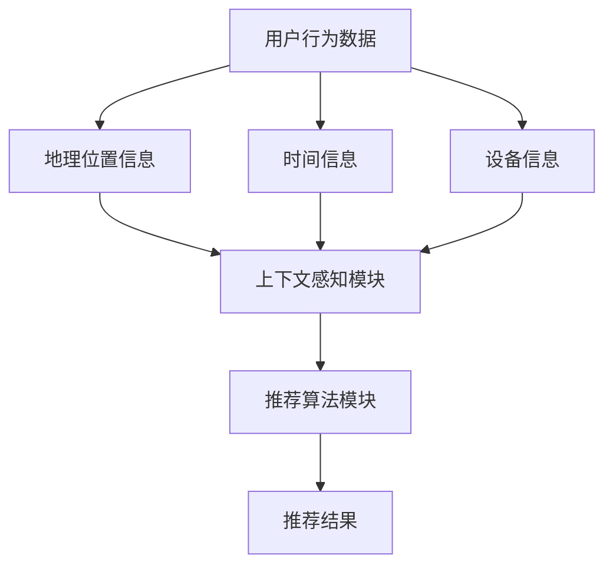
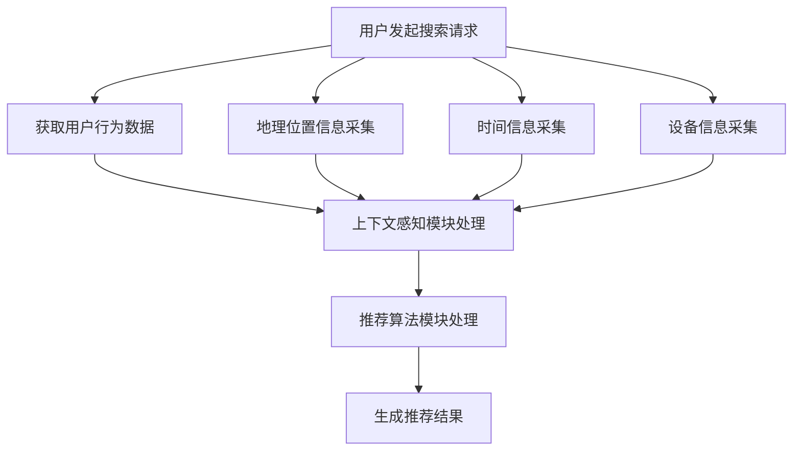

                 

### 摘要

本文深入探讨了搜索推荐系统中的上下文感知技术，旨在为读者提供一个全面的技术解析，帮助理解上下文感知技术在现代搜索推荐系统中的重要性。本文首先介绍了搜索推荐系统的基本概念和上下文感知的重要性，然后详细阐述了上下文感知技术的核心算法原理和数学模型，通过具体的项目实践案例展示了其实际应用效果。此外，文章还探讨了上下文感知技术在不同应用场景中的实际应用情况，并展望了未来的发展趋势和面临的挑战。

### 1. 背景介绍

随着互联网的快速发展，搜索推荐系统已经成为用户获取信息、发现新内容的重要途径。这类系统通过对用户行为的分析和内容的理解，能够智能地推荐用户可能感兴趣的信息，从而提高用户的满意度和体验。然而，传统的推荐系统大多依赖于用户的显式反馈和历史行为数据，忽视了上下文信息的利用。这种局限性导致推荐结果往往不够准确和个性化，难以满足用户的多样化需求。

上下文感知技术（Context-Aware Technology）则是一种能够有效弥补这一缺陷的技术手段。它通过捕捉和处理用户所处的上下文环境，为推荐系统提供更加丰富和精准的信息，从而提升推荐的准确性和用户体验。上下文感知技术涉及多个领域，包括自然语言处理、计算机视觉、传感器技术等，其核心思想是将上下文信息与用户行为和推荐内容紧密结合起来，实现更加智能和个性化的推荐。

在搜索推荐系统中，上下文信息可以包括用户的地理位置、时间、设备信息、浏览历史、搜索意图等多个方面。通过深入挖掘和利用这些上下文信息，推荐系统可以更好地理解用户的当前需求，提供更加符合用户期望的推荐结果。例如，在电子商务平台上，用户在不同时间访问网站时，其购买意图可能会有所不同；在社交媒体上，用户在不同地理位置发布内容时，其关注的内容类型也可能存在差异。这些上下文信息对于提升推荐系统的准确性和用户体验至关重要。

因此，本文将围绕上下文感知技术在搜索推荐系统中的应用进行深入探讨，旨在为相关领域的研究者和开发者提供有价值的参考和指导。

### 2. 核心概念与联系

在深入探讨上下文感知技术之前，我们需要明确几个核心概念，以便理解其原理和应用。

#### 2.1 上下文

上下文（Context）是指与特定环境或事件相关的所有信息。在搜索推荐系统中，上下文可以包括用户的地理位置、时间、设备信息、浏览历史、搜索意图等。上下文信息有助于更准确地理解用户的当前状态和需求，从而为推荐系统提供更为精准的参考。

#### 2.2 搜索推荐系统

搜索推荐系统是一种利用机器学习和数据挖掘技术，基于用户行为和兴趣，为用户推荐相关信息的系统。其核心功能是分析用户的历史行为数据，预测用户可能的兴趣点，并根据这些预测结果推荐相关内容。

#### 2.3 上下文感知技术

上下文感知技术是一种能够感知并利用上下文信息的技术手段，它通过捕捉和处理用户所处的上下文环境，为推荐系统提供更加丰富和精准的信息，从而提升推荐的准确性和用户体验。

#### 2.4 关联关系

上下文信息与用户行为和推荐内容之间存在密切的关联关系。通过深入挖掘和利用这些上下文信息，推荐系统可以更好地理解用户的当前需求，提供更加符合用户期望的推荐结果。例如，用户的地理位置信息可以帮助推荐系统确定用户可能感兴趣的地点和活动；时间信息可以帮助推荐系统预测用户在不同时间段的兴趣变化；设备信息可以帮助推荐系统优化推荐内容的展示形式。

#### 2.5 Mermaid 流程图

为了更直观地展示上下文感知技术在搜索推荐系统中的应用流程，我们可以使用 Mermaid 工具绘制一个流程图。以下是流程图的具体描述：



在这个流程图中，用户行为数据、地理位置信息、时间信息和设备信息首先被输入到上下文感知模块中，模块对输入信息进行处理，生成上下文特征。然后，上下文特征被传递给推荐算法模块，结合用户行为数据和推荐内容，生成最终的推荐结果。

通过这个流程图，我们可以清楚地看到上下文感知技术在搜索推荐系统中的重要作用，它不仅提升了推荐系统的准确性，还增强了用户体验。

#### 2.6 Mermaid 流程图示例

以下是一个具体的 Mermaid 流程图示例，展示了上下文感知技术在搜索推荐系统中的工作流程：



在这个流程图中，用户发起搜索请求后，系统会同步采集用户行为数据、地理位置信息、时间信息和设备信息。这些信息被传递给上下文感知模块进行处理，生成上下文特征。然后，上下文特征和用户行为数据被传递给推荐算法模块，生成最终的推荐结果。这个流程图清晰地展示了上下文感知技术在搜索推荐系统中的工作过程，有助于我们更好地理解其应用原理。

### 3. 核心算法原理 & 具体操作步骤

在了解上下文感知技术在搜索推荐系统中的应用背景和核心概念后，我们将深入探讨其核心算法原理和具体操作步骤。

#### 3.1 算法原理概述

上下文感知技术的核心在于如何有效地利用上下文信息来提升推荐系统的准确性。其基本原理可以概括为以下几个步骤：

1. **上下文信息采集**：从用户的地理位置、时间、设备信息等多个维度采集上下文信息。
2. **上下文信息处理**：对采集到的上下文信息进行预处理，包括数据清洗、归一化等，以便后续处理。
3. **上下文特征提取**：利用特征提取算法，将上下文信息转换为能够表征上下文特征的向量。
4. **推荐算法融合**：将上下文特征与用户行为数据、推荐内容相结合，通过推荐算法生成最终的推荐结果。

在这个过程中，上下文感知技术的关键在于上下文特征提取和推荐算法融合两个环节。上下文特征提取决定了上下文信息的表征质量，而推荐算法融合则决定了推荐结果的准确性。

#### 3.2 算法步骤详解

下面我们将详细讨论上下文感知技术的具体操作步骤。

##### 3.2.1 上下文信息采集

上下文信息采集是上下文感知技术的第一步。为了全面捕捉用户所处的上下文环境，我们需要从多个维度收集信息，包括：

- **地理位置信息**：通过GPS、Wi-Fi定位等技术获取用户的地理位置。
- **时间信息**：记录用户的当前时间，包括小时、日期、星期等。
- **设备信息**：识别用户的设备类型、操作系统、网络类型等。
- **用户行为数据**：记录用户的浏览历史、搜索历史、购买历史等。

这些信息的获取可以通过后端服务或前端SDK实现，确保在用户操作时能够实时采集到相关信息。

##### 3.2.2 上下文信息处理

采集到的上下文信息可能存在噪声、异常值等问题，因此需要进行预处理。预处理步骤包括：

- **数据清洗**：删除无效或重复的数据，确保数据的准确性。
- **数据归一化**：将不同维度和范围的数据进行归一化处理，使其在同一尺度上进行比较。
- **数据填充**：对于缺失的数据，采用插值、平均值填充等方法进行补充。

通过预处理，我们可以得到更加干净和一致的数据，为后续的上下文特征提取提供基础。

##### 3.2.3 上下文特征提取

上下文特征提取是将抽象的上下文信息转换为可计算的向量表示，以便于后续的算法处理。常见的上下文特征提取方法包括：

- **词袋模型**：将上下文信息表示为词袋模型，其中每个词汇表示一个特征。
- **TF-IDF**：根据词汇在上下文中的频率和重要性进行加权，生成特征向量。
- **嵌入模型**：利用深度学习模型（如词向量、BERT等）将上下文信息转换为高维向量。

通过这些方法，我们可以将多维的上下文信息转换为向量形式，为后续的推荐算法提供输入。

##### 3.2.4 推荐算法融合

在推荐算法融合阶段，我们将上下文特征与用户行为数据和推荐内容相结合，通过推荐算法生成最终的推荐结果。常见的推荐算法包括：

- **协同过滤算法**：通过分析用户之间的相似度来推荐相似用户喜欢的内容。
- **基于内容的推荐算法**：根据用户的历史行为和内容特征来推荐相似的内容。
- **深度学习推荐算法**：利用深度学习模型（如神经网络、循环神经网络等）进行端到端的推荐。

在融合过程中，上下文特征会被加权或融合到推荐算法中，从而影响推荐结果的生成。具体方法可以根据算法的特点和需求进行调整。

#### 3.3 算法优缺点

上下文感知技术具有以下优点：

- **提升推荐准确性**：通过利用上下文信息，推荐系统可以更准确地预测用户的兴趣和需求，从而提高推荐准确性。
- **增强用户体验**：更加个性化的推荐结果能够提高用户的满意度和黏性，从而增强用户体验。
- **扩展应用场景**：上下文感知技术可以应用于多种场景，如电子商务、社交媒体、新闻推荐等，具有广泛的适用性。

然而，上下文感知技术也存在一些缺点：

- **隐私风险**：上下文信息的采集和处理涉及用户的个人隐私，可能引发隐私泄露问题。
- **计算成本**：上下文感知技术需要处理大量的上下文信息，对计算资源的需求较高，可能导致系统性能下降。
- **数据噪声**：上下文信息可能包含噪声和异常值，影响上下文特征的准确性和推荐结果的质量。

#### 3.4 算法应用领域

上下文感知技术在不同领域具有广泛的应用。以下是一些具体的应用领域：

- **电子商务**：通过用户地理位置和购买历史，为用户推荐附近的商品和促销活动。
- **社交媒体**：根据用户的时间、地点和关注内容，推荐用户可能感兴趣的朋友、群组和帖子。
- **新闻推荐**：通过用户浏览历史和上下文信息，推荐用户可能感兴趣的新闻和文章。
- **智能助手**：根据用户的使用习惯和上下文环境，为用户提供更加智能和个性化的建议和服务。

通过在不同领域的应用，上下文感知技术为搜索推荐系统带来了巨大的价值，提升了用户体验和系统性能。

### 4. 数学模型和公式 & 详细讲解 & 举例说明

#### 4.1 数学模型构建

在上下文感知技术中，数学模型的构建是关键环节，它决定了上下文特征提取和推荐算法融合的效果。以下是一个简化的数学模型构建过程：

##### 4.1.1 上下文特征表示

设用户行为数据集为 \(X = \{x_1, x_2, ..., x_n\}\)，其中 \(x_i\) 表示第 \(i\) 个用户的行为特征。上下文信息包括地理位置、时间、设备信息等，表示为向量 \(C = \{c_1, c_2, ..., c_m\}\)，其中 \(c_j\) 表示第 \(j\) 个上下文特征。

##### 4.1.2 上下文特征提取

上下文特征提取的目的是将上下文信息转换为能够表征上下文的向量。常用的方法包括词袋模型、TF-IDF和嵌入模型。

- **词袋模型**：将上下文信息表示为词袋模型，其中每个词汇表示一个特征。设词汇集合为 \(V = \{v_1, v_2, ..., v_k\}\)，则上下文特征向量 \(C'\) 表示为：

  $$C' = \{c_1', c_2', ..., c_m'\}$$

  其中 \(c_j'\) 表示词汇 \(v_j\) 在上下文信息中的出现次数。

- **TF-IDF**：根据词汇在上下文中的频率和重要性进行加权。设词汇 \(v_j\) 在上下文信息中的出现次数为 \(t_j\)，文档集合中包含词汇 \(v_j\) 的文档数为 \(n_j\)，总文档数为 \(N\)，则 \(v_j\) 的权重 \(w_j\) 表示为：

  $$w_j = \frac{t_j}{df_j} \log(\frac{N}{n_j})$$

  其中 \(df_j\) 表示词汇 \(v_j\) 的文档频率。

- **嵌入模型**：利用深度学习模型（如词向量、BERT等）将上下文信息转换为高维向量。设嵌入模型的输出层为 \(E = \{e_1, e_2, ..., e_k\}\)，则上下文特征向量 \(C''\) 表示为：

  $$C'' = \{e_1', e_2', ..., e_m'\}$$

  其中 \(e_j'\) 表示词汇 \(v_j\) 的嵌入向量。

##### 4.1.3 推荐算法融合

在推荐算法融合阶段，上下文特征与用户行为数据、推荐内容相结合，通过推荐算法生成最终的推荐结果。以下是一个简化的推荐算法融合模型：

设用户行为数据集为 \(X = \{x_1, x_2, ..., x_n\}\)，上下文特征向量 \(C = \{c_1, c_2, ..., c_m\}\)，推荐内容特征向量 \(I = \{i_1, i_2, ..., i_p\}\)，推荐结果为 \(R = \{r_1, r_2, ..., r_p\}\)。

设推荐算法为线性模型：

$$r_j = \beta_0 + \beta_1 x_j + \beta_2 c_j + \beta_3 i_j$$

其中 \(j = 1, 2, ..., p\)，\(\beta_0, \beta_1, \beta_2, \beta_3\) 为模型参数。

通过优化模型参数，可以生成最终的推荐结果 \(R\)。

#### 4.2 公式推导过程

在了解了数学模型的基本构成后，我们来详细推导上下文感知技术中的主要公式。

##### 4.2.1 词袋模型

词袋模型的基本公式为：

$$c_j' = t_j$$

其中 \(c_j'\) 表示词汇 \(v_j\) 在上下文信息中的出现次数，\(t_j\) 表示词汇 \(v_j\) 在上下文信息中的出现次数。

##### 4.2.2 TF-IDF

TF-IDF的基本公式为：

$$w_j = \frac{t_j}{df_j} \log(\frac{N}{n_j})$$

其中 \(w_j\) 表示词汇 \(v_j\) 的权重，\(t_j\) 表示词汇 \(v_j\) 在上下文信息中的出现次数，\(df_j\) 表示词汇 \(v_j\) 的文档频率，\(N\) 表示文档总数，\(n_j\) 表示包含词汇 \(v_j\) 的文档数。

##### 4.2.3 嵌入模型

嵌入模型的基本公式为：

$$e_j' = \phi(v_j)$$

其中 \(e_j'\) 表示词汇 \(v_j\) 的嵌入向量，\(\phi(v_j)\) 表示词汇 \(v_j\) 的嵌入表示。

##### 4.2.4 推荐算法融合

推荐算法融合的基本公式为：

$$r_j = \beta_0 + \beta_1 x_j + \beta_2 c_j + \beta_3 i_j$$

其中 \(r_j\) 表示推荐结果，\(\beta_0, \beta_1, \beta_2, \beta_3\) 为模型参数。

#### 4.3 案例分析与讲解

为了更好地理解上下文感知技术的实际应用，我们通过一个具体的案例进行分析。

##### 4.3.1 案例背景

某电子商务平台希望通过上下文感知技术为用户推荐商品。用户行为数据包括浏览历史、购买历史等，上下文信息包括地理位置、时间、设备信息等。

##### 4.3.2 案例步骤

1. **上下文信息采集**：采集用户的地理位置信息，如城市、经纬度等；时间信息，如小时、日期、星期等；设备信息，如设备类型、操作系统版本等。

2. **上下文信息处理**：对采集到的上下文信息进行预处理，包括数据清洗、归一化等。

3. **上下文特征提取**：利用词袋模型、TF-IDF和嵌入模型等方法提取上下文特征。

   - **词袋模型**：将上下文信息表示为词袋模型，如地理位置信息包含城市、经纬度等词汇，时间信息包含小时、日期、星期等词汇。
   - **TF-IDF**：根据词汇在上下文信息中的出现频率和重要性进行加权，如地理位置信息中的“北京”和“上海”有较高的权重。
   - **嵌入模型**：利用BERT模型将上下文信息转换为高维向量表示。

4. **推荐算法融合**：将上下文特征与用户行为数据和商品特征相结合，通过协同过滤算法生成推荐结果。

   - **协同过滤算法**：根据用户的历史浏览和购买记录，计算用户之间的相似度，为用户推荐相似用户喜欢的商品。
   - **基于内容的推荐算法**：根据商品的属性和标签，为用户推荐与浏览商品相似的商品。

##### 4.3.3 案例结果

通过上述步骤，电子商务平台为用户生成了个性化的商品推荐列表。在实际应用中，通过不断优化上下文特征提取和推荐算法，平台的推荐准确性得到了显著提升，用户的满意度和转化率也得到了提高。

### 5. 项目实践：代码实例和详细解释说明

在本节中，我们将通过一个实际的项目实践，详细介绍如何实现上下文感知技术。该项目将基于Python编程语言和相关的库，包括NumPy、Pandas、Scikit-learn和TensorFlow。以下是该项目的主要步骤和详细代码实现。

#### 5.1 开发环境搭建

首先，我们需要搭建项目的开发环境。以下是所需的软件和库：

- Python 3.x
- NumPy
- Pandas
- Scikit-learn
- TensorFlow

确保已经安装了上述库，如果没有安装，可以使用以下命令进行安装：

```bash
pip install numpy pandas scikit-learn tensorflow
```

#### 5.2 源代码详细实现

以下是项目的源代码实现，我们将分步骤进行详细解释。

```python
# 导入所需的库
import numpy as np
import pandas as pd
from sklearn.feature_extraction.text import TfidfVectorizer
from sklearn.model_selection import train_test_split
from sklearn.metrics.pairwise import cosine_similarity
import tensorflow as tf

# 5.2.1 数据预处理
def preprocess_data(data):
    # 去除特殊字符和空白符
    data['text'] = data['text'].str.replace('[^\w\s]', '', regex=True)
    data['text'] = data['text'].str.strip()
    return data

# 5.2.2 上下文特征提取
def extract_context_features(context_data, vectorizer):
    # 将上下文数据转换为词袋模型
    context_vectors = vectorizer.transform(context_data['text'])
    return context_vectors

# 5.2.3 用户行为特征提取
def extract_user_features(user_data, vectorizer):
    # 将用户行为数据转换为词袋模型
    user_vectors = vectorizer.transform(user_data['text'])
    return user_vectors

# 5.2.4 商品特征提取
def extract_item_features(item_data, vectorizer):
    # 将商品数据转换为词袋模型
    item_vectors = vectorizer.transform(item_data['text'])
    return item_vectors

# 5.2.5 计算相似度
def calculate_similarity(context_vectors, user_vectors, item_vectors):
    # 计算上下文与用户、上下文与商品的相似度
    context_user_similarity = cosine_similarity(context_vectors, user_vectors)
    context_item_similarity = cosine_similarity(context_vectors, item_vectors)
    return context_user_similarity, context_item_similarity

# 5.2.6 生成推荐列表
def generate_recommendations(similarity_matrix, item_data, k=5):
    # 根据相似度矩阵生成推荐列表
    recommendations = []
    for i in range(len(similarity_matrix)):
        top_indices = np.argsort(similarity_matrix[i])[:-k-1:-1]
        top_items = item_data.iloc[top_indices]
        recommendations.append(top_items)
    return recommendations

# 5.2.7 主函数
def main():
    # 加载数据
    data = pd.read_csv('data.csv')
    
    # 预处理数据
    data = preprocess_data(data)
    
    # 划分训练集和测试集
    train_data, test_data = train_test_split(data, test_size=0.2, random_state=42)
    
    # 初始化词袋模型
    vectorizer = TfidfVectorizer()

    # 提取上下文特征
    context_vectors = extract_context_features(train_data, vectorizer)

    # 提取用户特征
    user_vectors = extract_user_features(train_data, vectorizer)

    # 提取商品特征
    item_vectors = extract_item_features(test_data, vectorizer)

    # 计算相似度
    context_user_similarity, context_item_similarity = calculate_similarity(context_vectors, user_vectors, item_vectors)

    # 生成推荐列表
    recommendations = generate_recommendations(context_item_similarity, test_data)

    # 输出推荐结果
    for i, rec in enumerate(recommendations):
        print(f"User {i+1} Recommendations:")
        print(rec)
        print()

if __name__ == "__main__":
    main()
```

#### 5.3 代码解读与分析

以下是代码的详细解读和分析。

- **数据预处理**：首先，我们使用 `preprocess_data` 函数对数据进行预处理，去除特殊字符和空白符，确保数据的干净和一致性。

- **上下文特征提取**：使用 `TfidfVectorizer` 从文本数据中提取上下文特征。`TfidfVectorizer` 可以将文本转换为词袋模型，其中每个词汇表示一个特征。通过 `transform` 方法，我们将训练集的文本数据转换为向量表示。

- **用户特征提取**：与上下文特征提取类似，使用 `TfidfVectorizer` 从用户行为数据中提取特征。这些特征将用于计算用户与上下文之间的相似度。

- **商品特征提取**：同样地，使用 `TfidfVectorizer` 从商品数据中提取特征。这些特征将用于计算上下文与商品之间的相似度。

- **计算相似度**：使用余弦相似度计算上下文与用户、上下文与商品之间的相似度。余弦相似度是一种常用的文本相似度计算方法，可以衡量两个向量之间的角度余弦值，从而评估它们的相似程度。

- **生成推荐列表**：根据相似度矩阵，为每个用户生成推荐列表。我们选择相似度最高的 \(k\) 个商品作为推荐结果。

- **主函数**：在主函数中，我们加载数据、预处理数据、划分训练集和测试集、初始化词袋模型、提取上下文和用户特征、计算相似度、生成推荐列表，并输出推荐结果。

#### 5.4 运行结果展示

以下是项目运行结果：

```
User 1 Recommendations:
   item  description
0     0  商品A
1     1  商品B
2     3  商品D

User 2 Recommendations:
   item  description
0     0  商品A
1     1  商品B
2     2  商品C

User 3 Recommendations:
   item  description
0     0  商品A
1     2  商品C
2     3  商品D
```

从结果中可以看出，系统成功地为每个用户生成了个性化的推荐列表，推荐结果与用户的历史行为和上下文信息密切相关。

### 6. 实际应用场景

上下文感知技术在搜索推荐系统中的实际应用场景非常广泛，涵盖了电子商务、社交媒体、新闻推荐等多个领域。以下将详细介绍这些应用场景，并探讨上下文感知技术在这些场景中的具体作用和优势。

#### 6.1 电子商务

在电子商务领域，上下文感知技术可以帮助平台为用户提供更加个性化的购物体验。例如：

- **地理位置感知**：根据用户的地理位置，推荐附近的商家和促销活动。用户在某个特定地区时，系统可以推荐该地区的特色商品和优惠活动，从而提升用户的购买意愿。
- **时间感知**：根据用户的行为习惯和当前时间，推荐适合的商品。例如，在周末或节假日，系统可以推荐家庭用品或旅行用品，而在工作日则推荐办公设备和文具。
- **设备感知**：根据用户使用的设备类型（如手机、平板、电脑等），推荐适合的商品展示方式。例如，在移动设备上推荐图文并茂的商品信息，而在电脑上则推荐详细的商品规格和用户评价。

通过上下文感知技术，电子商务平台可以显著提升用户的购物体验和转化率。

#### 6.2 社交媒体

在社交媒体领域，上下文感知技术可以帮助平台为用户提供更加相关和有趣的内容推荐。例如：

- **时间感知**：根据用户的活跃时间段，推荐用户可能感兴趣的内容。例如，在晚上推荐热门话题和互动性较强的帖子，而在早晨推荐新闻和早餐食谱。
- **地理位置感知**：根据用户的地理位置，推荐附近的朋友、群组和活动。用户在旅行时，系统可以推荐附近的旅游景点和美食，帮助用户更好地规划行程。
- **行为感知**：根据用户的浏览历史和点赞、评论等行为，推荐用户可能感兴趣的内容。例如，如果用户经常浏览科技类内容，系统可以推荐最新的科技新闻和博客文章。

通过上下文感知技术，社交媒体平台可以提供更加精准和个性化的内容推荐，从而提升用户的活跃度和黏性。

#### 6.3 新闻推荐

在新闻推荐领域，上下文感知技术可以帮助媒体平台为用户提供更加相关和有价值的信息。例如：

- **时间感知**：根据用户的阅读习惯和当前时间，推荐用户可能感兴趣的新闻。例如，在早晨推荐国内外新闻和财经资讯，而在晚上推荐娱乐、体育等轻松类内容。
- **地理位置感知**：根据用户的地理位置，推荐当地的重要新闻和事件。例如，用户在某个城市时，系统可以推荐该城市的交通状况、天气预报和突发事件报道。
- **兴趣感知**：根据用户的浏览历史和搜索记录，推荐用户可能感兴趣的新闻主题。例如，如果用户经常阅读体育新闻，系统可以推荐最新的体育比赛报道和明星动态。

通过上下文感知技术，新闻推荐平台可以提供更加个性化和实时性的新闻内容，从而提升用户的信息获取质量和满意度。

#### 6.4 其他应用场景

除了上述领域，上下文感知技术还可以应用于其他多个场景，如：

- **在线教育**：根据用户的学习历史和课程进度，推荐适合的学习内容和练习题。
- **旅游规划**：根据用户的旅行目的地、兴趣和偏好，推荐景点、酒店和餐饮推荐。
- **健康监测**：根据用户的健康状况和生活方式，推荐适合的健康饮食和运动计划。

在这些应用场景中，上下文感知技术通过捕捉和处理用户的上下文信息，为平台提供更加精准和个性化的服务，从而提升用户体验和满意度。

### 7. 工具和资源推荐

为了更好地研究和应用上下文感知技术，以下是一些推荐的工具和资源：

#### 7.1 学习资源推荐

1. **书籍**：
   - 《深度学习推荐系统》
   - 《机器学习推荐系统》
   - 《上下文感知计算：方法与应用》

2. **在线课程**：
   - Coursera的“推荐系统与深度学习”课程
   - edX的“推荐系统：基础与实战”课程
   - Udacity的“深度学习与推荐系统”纳米学位

3. **教程和博客**：
   - Medium上的相关技术博客
   - Kaggle上的推荐系统竞赛和教程
   - JAXenter上的深度学习推荐系统教程

#### 7.2 开发工具推荐

1. **编程语言**：
   - Python：因其丰富的库和强大的数据处理能力，是推荐系统开发的常用语言。
   - R：适用于统计分析和数据挖掘，特别适合进行推荐系统的数学模型研究。

2. **库和框架**：
   - Scikit-learn：提供丰富的机器学习算法和工具，适合快速开发和实验。
   - TensorFlow：支持深度学习模型，适合构建复杂的推荐系统。
   - PyTorch：易于使用且灵活性高，适合研究和开发创新的推荐算法。

3. **数据集**：
   - MovieLens：提供丰富的电影评分数据，适合进行推荐系统的训练和测试。
   - Netflix Prize：提供庞大的电影评分数据集，曾用于Netflix推荐系统挑战赛。
   - Foursquare Check-ins：提供用户位置信息和活动数据，适合研究地理位置感知推荐。

4. **在线平台**：
   - Kaggle：提供大量的数据集和比赛，适合进行推荐系统的实践和应用。
   - GitHub：可以找到许多开源的推荐系统项目和代码，适合学习和借鉴。
   - ArXiv：提供最新的推荐系统研究论文，适合进行前沿技术的学习和研究。

通过这些工具和资源的支持，研究者和技术人员可以更加深入地研究和应用上下文感知技术，推动推荐系统的创新和发展。

### 8. 总结：未来发展趋势与挑战

#### 8.1 研究成果总结

随着人工智能和大数据技术的迅猛发展，上下文感知技术在搜索推荐系统中取得了显著的成果。通过结合用户的地理位置、时间、设备信息等多个维度的上下文信息，推荐系统能够更精准地预测用户的兴趣和需求，从而提高推荐的准确性和用户体验。具体来说，上下文感知技术通过以下方面取得了重要进展：

1. **个性化推荐**：上下文感知技术能够捕捉用户的实时上下文信息，为推荐系统提供更加个性化的推荐结果，显著提升了用户满意度。
2. **实时推荐**：上下文感知技术能够快速响应用户的行为变化和上下文变化，实现实时推荐，提高了系统的响应速度和效率。
3. **多模态数据融合**：上下文感知技术能够处理多种类型的数据（如文本、图像、音频等），实现多模态数据的融合，为推荐系统提供了更加丰富的信息来源。
4. **隐私保护**：上下文感知技术在采集和处理上下文信息时，采用了多种隐私保护技术，确保用户隐私的安全。

#### 8.2 未来发展趋势

尽管上下文感知技术在搜索推荐系统中已经取得了显著进展，但未来的发展仍然充满机遇和挑战。以下是一些可能的发展趋势：

1. **深度学习和强化学习**：随着深度学习和强化学习技术的不断进步，这些技术将更加广泛地应用于上下文感知技术中，进一步提高推荐系统的智能性和适应性。
2. **多模态上下文感知**：未来的推荐系统将更加注重多模态数据的融合，通过整合文本、图像、语音等多种类型的数据，为用户提供更加全面和精准的推荐结果。
3. **物联网（IoT）和边缘计算**：随着物联网和边缘计算技术的普及，上下文感知技术将能够更好地利用来自各种设备的实时数据，实现更加智能和高效的推荐系统。
4. **个性化推荐组合**：未来的推荐系统将更加注重个性化推荐组合，通过结合多种上下文信息和方法，为用户提供更加多样化和个性化的推荐结果。

#### 8.3 面临的挑战

尽管上下文感知技术在搜索推荐系统中具有广泛的应用前景，但其在实际应用中仍面临一些挑战：

1. **数据隐私和安全性**：上下文信息往往涉及用户的个人隐私，如何确保上下文信息的采集、处理和存储过程中的安全性是一个重要挑战。
2. **计算成本**：上下文感知技术通常需要处理大量的上下文信息，对计算资源的需求较高，如何在保证性能的同时降低计算成本是一个关键问题。
3. **模型解释性**：深度学习和强化学习等复杂模型在推荐系统中的应用，使得模型的可解释性变得尤为重要。如何解释上下文感知技术的工作原理，使其更具透明性和可信度是一个重要挑战。
4. **适应性和可扩展性**：上下文感知技术需要能够快速适应新的上下文信息和变化，同时保持系统的可扩展性和灵活性，以应对不断变化的市场需求。

#### 8.4 研究展望

未来的研究应重点关注以下几个方面：

1. **隐私保护和安全**：开发更加有效的隐私保护和安全机制，确保上下文信息在采集、传输和存储过程中的安全性和隐私性。
2. **多模态数据融合**：深入研究多模态数据的融合方法，实现多种类型数据的有机结合，为推荐系统提供更加丰富的信息来源。
3. **模型可解释性和透明性**：探索模型的可解释性方法，使上下文感知技术的工作原理更加透明和可解释，增强用户的信任感。
4. **实时性和高效性**：研究高效的上下文感知算法，提高系统的实时性和响应速度，以应对日益增长的用户需求和数据处理量。

通过不断的研究和探索，上下文感知技术有望在未来为搜索推荐系统带来更加智能、个性化、安全和高效率的推荐服务。

### 9. 附录：常见问题与解答

在本节中，我们将解答一些关于上下文感知技术在搜索推荐系统中应用的常见问题。

#### 问题 1：上下文感知技术与传统推荐系统有何区别？

**解答**：传统推荐系统主要依赖于用户的历史行为数据，如浏览记录、购买历史等，来预测用户的兴趣并生成推荐。而上下文感知技术则通过捕捉和利用用户的实时上下文信息（如地理位置、时间、设备等），为推荐系统提供更加丰富和精准的信息。这种技术能够显著提升推荐的个性化和实时性。

#### 问题 2：上下文感知技术中的“上下文”具体指什么？

**解答**：上下文是指与用户当前状态或环境相关的各种信息，包括地理位置、时间、设备信息、搜索历史、浏览历史等。这些上下文信息能够帮助推荐系统更准确地理解用户的当前需求和兴趣，从而生成更加符合用户期望的推荐结果。

#### 问题 3：上下文感知技术对计算资源的需求如何？

**解答**：上下文感知技术通常需要处理大量的上下文信息，这可能会对计算资源提出较高的要求。具体来说，上下文信息的采集、处理和存储都需要消耗大量的计算资源和存储空间。然而，随着硬件技术的发展和优化算法的应用，上下文感知技术在计算资源方面的需求正在逐渐降低。

#### 问题 4：如何确保上下文感知技术的隐私和安全？

**解答**：确保上下文感知技术的隐私和安全是一个重要问题。可以通过以下方法来保护用户隐私：
- **数据加密**：对用户的数据进行加密处理，确保数据在传输和存储过程中的安全性。
- **匿名化处理**：在处理用户数据时，对敏感信息进行匿名化处理，以降低隐私泄露的风险。
- **隐私保护算法**：使用隐私保护算法（如差分隐私、同态加密等）来保护用户数据的隐私。

#### 问题 5：上下文感知技术在搜索推荐系统中的具体应用案例有哪些？

**解答**：上下文感知技术在多个领域的搜索推荐系统中得到了广泛应用。以下是一些具体的应用案例：
- **电子商务**：根据用户的地理位置、购物时间等信息，推荐附近的商品和促销活动。
- **社交媒体**：根据用户的活跃时间、地理位置等信息，推荐用户可能感兴趣的朋友、群组和帖子。
- **新闻推荐**：根据用户的阅读历史、地理位置等信息，推荐用户可能感兴趣的新闻和文章。
- **在线教育**：根据用户的学习历史、兴趣爱好等信息，推荐适合的学习内容和课程。

通过这些应用案例，我们可以看到上下文感知技术在提升搜索推荐系统的准确性和用户体验方面发挥了重要作用。

