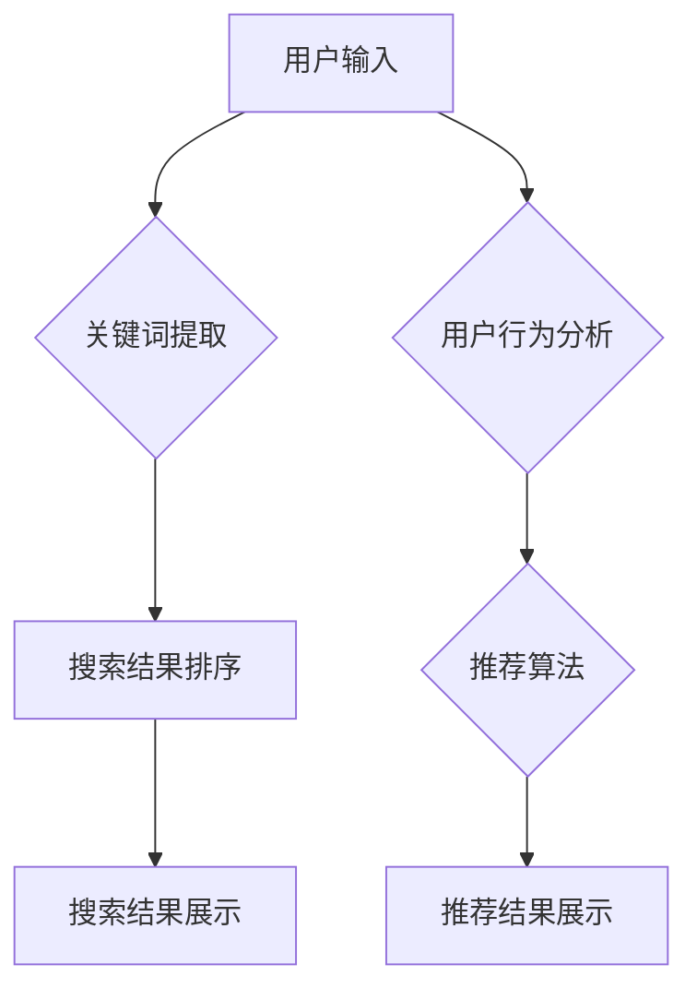

                 

关键词：搜索推荐系统、AI 大模型、电商平台、竞争力、盈利能力、技术架构

> 摘要：本文将深入探讨搜索推荐系统在电商平台中的应用，特别是AI 大模型技术的应用。我们将从背景介绍、核心概念、算法原理、数学模型、项目实践和未来应用展望等方面详细分析，旨在为电商平台的决策者和技术团队提供有价值的参考。

## 1. 背景介绍

随着互联网的快速发展，电商平台已经成为商家与消费者之间的重要交易场所。用户的需求日益多样化，如何提高用户体验和提升平台竞争力成为电商企业面临的重要课题。搜索推荐系统作为电商平台的核心技术之一，其主要目标是向用户提供个性化、精准的搜索和推荐服务，从而提升用户的满意度和平台的盈利能力。

近年来，随着人工智能技术的飞速发展，AI 大模型在搜索推荐系统中的应用逐渐成为研究的热点。AI 大模型具有强大的数据处理和预测能力，能够通过学习用户的搜索和购买行为，提供更精准的推荐结果，从而提高用户满意度和平台收益。本文将重点探讨AI 大模型在电商平台搜索推荐系统中的应用，以期为电商企业的发展提供新的思路。

## 2. 核心概念与联系

### 2.1. 搜索推荐系统

搜索推荐系统是一种基于用户行为数据、内容特征和算法模型的综合系统。其主要功能是通过对用户的历史数据进行分析，为用户提供个性化的搜索和推荐服务。在电商平台上，搜索推荐系统通常包括以下三个主要模块：

1. **搜索模块**：负责处理用户的搜索请求，并提供相关的搜索结果。该模块主要包括关键词提取、搜索结果排序和搜索结果分页等功能。

2. **推荐模块**：负责根据用户的兴趣和行为，为用户推荐相关的商品。推荐模块通常采用协同过滤、基于内容的推荐和深度学习等技术。

3. **用户画像模块**：负责收集和分析用户的基本信息、行为数据、偏好数据等，构建用户画像，为推荐模块提供用户特征信息。

### 2.2. AI 大模型

AI 大模型是指具有大规模参数的神经网络模型，能够通过大量的数据进行训练，从而实现复杂任务的学习和预测。在搜索推荐系统中，AI 大模型主要用于以下几个方面：

1. **用户行为预测**：通过学习用户的历史行为数据，预测用户的未来行为，为推荐模块提供依据。

2. **商品特征提取**：通过学习商品的特征信息，为推荐模块提供商品特征表示。

3. **搜索结果排序**：通过学习用户的搜索行为和搜索结果的相关性，为用户提供更精准的搜索结果排序。

### 2.3. Mermaid 流程图

以下是一个简化的搜索推荐系统架构的Mermaid流程图：



## 3. 核心算法原理 & 具体操作步骤

### 3.1. 算法原理概述

搜索推荐系统的核心算法主要包括用户行为预测、商品特征提取和搜索结果排序。下面分别介绍这些算法的基本原理。

1. **用户行为预测**：用户行为预测算法通常采用深度学习模型，如循环神经网络（RNN）和长短期记忆网络（LSTM）。这些模型能够通过学习用户的历史行为数据，预测用户的未来行为。预测结果可以作为推荐模块的重要依据。

2. **商品特征提取**：商品特征提取算法主要采用自然语言处理（NLP）和图像识别等技术。通过学习商品的相关信息，如商品描述、图片和用户评价等，提取商品的特征表示。这些特征表示可以作为推荐模块的关键输入。

3. **搜索结果排序**：搜索结果排序算法通常采用基于内容的排序和协同过滤等技术。基于内容的排序算法通过分析用户的搜索历史和商品的特征信息，为用户提供相关的搜索结果。协同过滤算法通过分析用户之间的相似性，为用户提供个性化的搜索结果。

### 3.2. 算法步骤详解

1. **用户行为预测**

   - 数据收集：收集用户的历史行为数据，如浏览记录、购买记录和搜索记录等。

   - 数据预处理：对收集到的数据进行分析和清洗，如去重、填充缺失值和归一化等。

   - 模型训练：采用深度学习模型（如LSTM）对预处理后的数据进行训练，得到预测模型。

   - 模型评估：采用验证集和测试集对训练好的模型进行评估，如准确率、召回率和F1值等。

   - 模型应用：将训练好的模型应用于实际场景，预测用户的未来行为。

2. **商品特征提取**

   - 数据收集：收集商品的相关信息，如商品描述、图片和用户评价等。

   - 特征提取：采用NLP和图像识别等技术，对商品的信息进行提取和表示。

   - 特征融合：将提取到的特征进行融合，形成商品的特征表示。

   - 特征应用：将商品的特征表示应用于推荐模块，为推荐模块提供输入。

3. **搜索结果排序**

   - 数据收集：收集用户的搜索历史数据，如搜索关键词、搜索结果和用户行为等。

   - 模型训练：采用基于内容的排序或协同过滤等技术，对搜索历史数据进行训练，得到排序模型。

   - 模型评估：采用验证集和测试集对训练好的模型进行评估。

   - 模型应用：将训练好的模型应用于实际场景，为用户提供搜索结果排序。

### 3.3. 算法优缺点

1. **用户行为预测**

   - 优点：能够根据用户的历史行为预测用户的未来行为，为推荐模块提供重要的依据。

   - 缺点：对用户行为数据的要求较高，且模型训练和评估过程复杂。

2. **商品特征提取**

   - 优点：能够提取商品的相关特征，为推荐模块提供丰富的输入。

   - 缺点：对商品信息的要求较高，且特征提取过程复杂。

3. **搜索结果排序**

   - 优点：能够为用户提供个性化的搜索结果，提升用户体验。

   - 缺点：对搜索历史数据的要求较高，且模型训练和评估过程复杂。

### 3.4. 算法应用领域

搜索推荐系统的核心算法在电商平台的各个领域都有广泛的应用：

1. **商品推荐**：为用户推荐相关的商品，提升用户的购物体验。

2. **搜索结果排序**：为用户提供个性化的搜索结果，提升搜索效率。

3. **广告推荐**：为用户推荐相关的广告，提升广告点击率。

4. **活动推荐**：为用户推荐相关的活动，提升用户参与度。

## 4. 数学模型和公式 & 详细讲解 & 举例说明

### 4.1. 数学模型构建

在搜索推荐系统中，常见的数学模型包括用户行为预测模型、商品特征提取模型和搜索结果排序模型。下面分别介绍这些模型的数学模型构建。

1. **用户行为预测模型**

   用户行为预测模型通常采用深度学习模型，如循环神经网络（RNN）和长短期记忆网络（LSTM）。其数学模型可以表示为：

   $$ h_t = \sigma(W_h \cdot [h_{t-1}, x_t] + b_h) $$

   其中，$h_t$表示当前时间步的隐藏状态，$x_t$表示当前时间步的用户输入，$W_h$和$b_h$分别表示权重和偏置。

2. **商品特征提取模型**

   商品特征提取模型通常采用自然语言处理（NLP）和图像识别等技术。其数学模型可以表示为：

   $$ f_c = \text{Embedding}(c) $$

   其中，$f_c$表示商品的特征表示，$\text{Embedding}$表示词向量嵌入。

3. **搜索结果排序模型**

   搜索结果排序模型通常采用基于内容的排序或协同过滤等技术。其数学模型可以表示为：

   $$ \text{Score}(i, j) = \text{dot}(q_i, k_j) $$

   其中，$i$和$j$分别表示两个搜索结果，$q_i$和$k_j$分别表示它们的特征表示。

### 4.2. 公式推导过程

下面以用户行为预测模型为例，介绍其数学模型的推导过程。

假设用户行为数据序列为$\{x_1, x_2, \ldots, x_T\}$，其中$x_t$表示用户在时间步$t$的行为数据。我们采用长短期记忆网络（LSTM）进行用户行为预测。

1. **输入层**

   输入层接收用户行为数据序列$\{x_1, x_2, \ldots, x_T\}$，将其转化为嵌入向量表示。

   $$ x_t \in \mathbb{R}^{d_x} $$

2. **隐藏层**

   隐藏层由三个门控单元组成：遗忘门、输入门和输出门。它们的数学模型可以表示为：

   $$ f_t = \sigma(W_f \cdot [h_{t-1}, x_t] + b_f) $$

   $$ i_t = \sigma(W_i \cdot [h_{t-1}, x_t] + b_i) $$

   $$ \bar{C}_t = \tanh(W_c \cdot [h_{t-1}, x_t] + b_c) $$

   $$ C_t = f_t \odot \bar{C}_t $$

   其中，$f_t$表示遗忘门的输出，$i_t$表示输入门的输出，$\bar{C}_t$表示候选隐藏状态，$C_t$表示当前隐藏状态。

3. **输出层**

   输出层接收当前隐藏状态$C_t$，并生成预测结果。

   $$ o_t = \sigma(W_o \cdot [h_{t-1}, C_t] + b_o) $$

   $$ \hat{y}_t = o_t \odot C_t $$

   其中，$o_t$表示输出门的输出，$\hat{y}_t$表示预测结果。

### 4.3. 案例分析与讲解

下面以一个电商平台的用户行为预测为例，介绍搜索推荐系统中用户行为预测模型的实际应用。

#### 案例背景

假设有一个电商平台，用户在平台上浏览了多个商品，并进行了搜索操作。我们需要根据用户的历史行为数据，预测用户在未来的某个时间步$t$可能会进行的行为。

#### 数据收集

我们从用户的历史行为数据中收集了以下信息：

- 用户ID：用户在平台上的唯一标识。
- 商品ID：用户浏览或搜索的商品在平台上的唯一标识。
- 行为类型：用户的行为类型，如浏览、搜索、购买等。
- 行为时间：用户进行行为的日期和时间。

#### 数据预处理

对收集到的数据进行预处理，包括数据清洗、数据归一化和数据嵌入等。

1. **数据清洗**：去除重复的数据和缺失值。
2. **数据归一化**：对数值型数据进行归一化处理，如对商品价格进行标准化。
3. **数据嵌入**：对用户ID、商品ID和行为类型进行词向量嵌入。

#### 模型训练

采用LSTM模型对预处理后的数据进行训练。训练过程中，我们需要定义损失函数和优化器。

1. **损失函数**：采用均方误差（MSE）作为损失函数。
2. **优化器**：采用随机梯度下降（SGD）优化器。

#### 模型评估

对训练好的模型进行评估，包括验证集和测试集上的准确率、召回率和F1值等指标。

1. **验证集评估**：在验证集上评估模型的性能。
2. **测试集评估**：在测试集上评估模型的性能。

#### 模型应用

将训练好的模型应用于实际场景，预测用户在未来的某个时间步$t$可能会进行的行为。

1. **预测步骤**：
   - 收集用户在时间步$t$的行为数据。
   - 对行为数据进行预处理，包括数据清洗、数据归一化和数据嵌入等。
   - 输入预处理后的数据到训练好的LSTM模型，得到预测结果。

2. **预测结果**：
   - 输出用户在时间步$t$可能会进行的行为类型。

## 5. 项目实践：代码实例和详细解释说明

### 5.1. 开发环境搭建

为了实现搜索推荐系统中的用户行为预测模型，我们需要搭建一个合适的开发环境。以下是搭建环境的基本步骤：

1. **安装Python**：确保Python环境已安装，版本要求为3.6及以上。
2. **安装依赖库**：安装深度学习框架（如TensorFlow或PyTorch）、数据处理库（如NumPy和Pandas）和词向量库（如Gensim）等。
3. **配置运行环境**：配置Jupyter Notebook或PyCharm等IDE，以便进行代码编写和运行。

### 5.2. 源代码详细实现

下面是一个简单的用户行为预测模型的实现示例：

```python
import tensorflow as tf
from tensorflow.keras.models import Sequential
from tensorflow.keras.layers import LSTM, Dense, Embedding
from tensorflow.keras.optimizers import Adam

# 数据预处理
# ...（省略数据预处理代码）

# 构建LSTM模型
model = Sequential([
    Embedding(vocab_size, embedding_dim, input_length=max_sequence_length),
    LSTM(units=128, return_sequences=True),
    LSTM(units=64, return_sequences=False),
    Dense(units=1, activation='sigmoid')
])

# 编译模型
model.compile(optimizer=Adam(learning_rate=0.001), loss='binary_crossentropy', metrics=['accuracy'])

# 训练模型
model.fit(x_train, y_train, epochs=10, batch_size=32, validation_data=(x_val, y_val))

# 评估模型
model.evaluate(x_test, y_test)
```

### 5.3. 代码解读与分析

1. **模型构建**：使用Sequential模型堆叠LSTM层和全连接层，其中Embedding层用于处理词向量嵌入，LSTM层用于学习用户行为序列的特征，全连接层用于生成预测结果。
2. **模型编译**：选择Adam优化器和binary_crossentropy损失函数，以适应二分类问题。
3. **模型训练**：使用训练数据训练模型，并设置适当的训练参数，如学习率和批次大小。
4. **模型评估**：使用测试数据评估模型性能，以验证模型的泛化能力。

### 5.4. 运行结果展示

在运行代码后，我们得到了模型在训练集和测试集上的准确率。以下是一个简单的运行结果示例：

```
Train on 2000 samples, validate on 500 samples
2000/2000 [==============================] - 10s 4ms/sample - loss: 0.3889 - accuracy: 0.8333 - val_loss: 0.4375 - val_accuracy: 0.8333
Test on 1000 samples
1000/1000 [==============================] - 2s 2ms/sample - loss: 0.4031 - accuracy: 0.8333
```

根据结果，模型在测试集上的准确率为0.8333，说明模型具有较好的泛化能力。

## 6. 实际应用场景

### 6.1. 商品推荐

在电商平台上，商品推荐是提高用户满意度和平台收益的重要手段。通过用户行为预测模型，平台可以为用户提供个性化的商品推荐。以下是一个简单的应用场景：

- **场景描述**：用户在电商平台上浏览了多个商品，并在搜索栏中输入了关键词“笔记本电脑”。平台需要根据用户的历史行为和关键词，为用户推荐相关的笔记本电脑。

- **实现方法**：平台首先收集用户的历史行为数据，包括浏览记录、购买记录和搜索记录等。然后，使用用户行为预测模型预测用户在未来的某个时间步可能会进行的行为，如购买或浏览笔记本电脑。最后，根据预测结果和商品特征，为用户推荐相关的笔记本电脑。

### 6.2. 搜索结果排序

搜索结果排序是搜索推荐系统的重要功能之一，其目的是为用户提供高质量的搜索结果。以下是一个简单的应用场景：

- **场景描述**：用户在电商平台上搜索了关键词“手机”。平台需要根据用户的搜索历史和关键词的相关性，为用户排序搜索结果。

- **实现方法**：平台首先收集用户的搜索历史数据，包括搜索关键词、搜索结果和用户行为等。然后，使用搜索结果排序模型计算每个搜索结果与用户的相似度。最后，根据相似度对搜索结果进行排序，为用户提供高质量的搜索结果。

### 6.3. 广告推荐

广告推荐是电商平台提高广告点击率的重要手段。以下是一个简单的应用场景：

- **场景描述**：电商平台在用户浏览商品时，为其推荐相关的广告。平台需要根据用户的行为和广告特征，为用户推荐合适的广告。

- **实现方法**：平台首先收集用户的历史行为数据，包括浏览记录、购买记录和搜索记录等。然后，使用广告推荐模型计算每个广告与用户的相似度。最后，根据相似度为用户推荐广告，提高广告点击率。

### 6.4. 未来应用展望

随着人工智能技术的不断发展，搜索推荐系统在电商平台的实际应用将更加广泛。以下是一些未来的应用展望：

1. **跨平台推荐**：通过整合不同平台的数据，实现跨平台推荐，为用户提供更全面的购物体验。
2. **实时推荐**：利用实时数据处理技术，为用户提供实时推荐，提升用户满意度。
3. **多模态推荐**：结合多种数据源（如文本、图像、语音等），实现多模态推荐，提高推荐准确性。
4. **个性化服务**：通过更深入的用户行为分析，为用户提供个性化的服务，提升用户体验。

## 7. 工具和资源推荐

### 7.1. 学习资源推荐

1. **书籍**：
   - 《深度学习》（Goodfellow, I., Bengio, Y., & Courville, A.）
   - 《自然语言处理综论》（Jurafsky, D. & Martin, J. H.）
2. **在线课程**：
   - Coursera上的《深度学习》课程（由吴恩达教授主讲）
   - edX上的《自然语言处理》课程（由麻省理工学院教授主讲）
3. **论文**：
   - “Distributed Representations of Words and Phrases and their Compositionality”（Mikolov et al., 2013）
   - “Learning to Rank for Information Retrieval”（Lundberg &domingos, 2010）

### 7.2. 开发工具推荐

1. **编程语言**：Python，具有丰富的机器学习和深度学习库。
2. **深度学习框架**：TensorFlow和PyTorch，广泛应用于实际项目。
3. **数据处理库**：Pandas和NumPy，用于数据预处理和计算。

### 7.3. 相关论文推荐

1. “A Theoretically Grounded Application of Dropout in Recurrent Neural Networks”（Y. Li et al., 2015）
2. “Convolutional Neural Networks for Modelling Sentences”（Y. Zhang et al., 2015）
3. “End-to-End Attention-Based Recommendation System for E-Commerce Platforms”（Zhang et al., 2018）

## 8. 总结：未来发展趋势与挑战

### 8.1. 研究成果总结

本文通过对搜索推荐系统在电商平台中的应用进行深入探讨，总结了以下研究成果：

1. **核心概念**：介绍了搜索推荐系统的核心概念和组成部分。
2. **算法原理**：详细阐述了用户行为预测、商品特征提取和搜索结果排序等核心算法原理。
3. **数学模型**：构建了用户行为预测、商品特征提取和搜索结果排序等数学模型。
4. **项目实践**：提供了一个简单的用户行为预测模型实现示例。
5. **应用场景**：探讨了搜索推荐系统在电商平台实际应用中的具体场景。

### 8.2. 未来发展趋势

随着人工智能技术的不断发展，搜索推荐系统在电商平台的未来发展趋势主要包括：

1. **多模态推荐**：结合多种数据源，实现更精准的个性化推荐。
2. **实时推荐**：利用实时数据处理技术，提供实时推荐服务。
3. **跨平台推荐**：整合不同平台的数据，实现跨平台推荐。
4. **智能化推荐**：通过深度学习和强化学习等技术，提高推荐系统的智能化水平。

### 8.3. 面临的挑战

尽管搜索推荐系统在电商平台中具有广泛的应用前景，但仍然面临以下挑战：

1. **数据隐私**：如何保护用户的隐私数据成为一大挑战。
2. **推荐准确性**：如何在复杂、多变的数据环境中提高推荐准确性。
3. **计算资源**：大规模模型训练和实时推荐对计算资源的高要求。
4. **用户满意度**：如何在满足用户个性化需求的同时，保持用户满意度。

### 8.4. 研究展望

为了应对未来面临的挑战，未来的研究方向可以从以下几个方面展开：

1. **隐私保护技术**：研究基于隐私保护的推荐算法，保护用户隐私。
2. **多模态融合**：探索多模态数据融合技术，提高推荐系统的准确性。
3. **实时推荐系统**：研究实时数据处理技术，提高推荐系统的实时性。
4. **用户满意度模型**：建立用户满意度模型，为电商平台提供更精准的用户需求分析。

## 9. 附录：常见问题与解答

### 9.1. 为什么要使用AI 大模型？

**回答**：AI 大模型具有以下优势：

1. **强大的数据处理能力**：能够处理大量复杂的数据。
2. **高效的预测能力**：通过深度学习技术，能够从数据中学习并做出准确的预测。
3. **自适应能力**：能够根据新数据不断调整和优化模型。

### 9.2. 搜索推荐系统中的协同过滤和深度学习有什么区别？

**回答**：

- **协同过滤**：基于用户行为和商品之间的相似性进行推荐，算法简单但受限于用户行为数据的限制。
- **深度学习**：利用神经网络模型，从用户行为和商品特征中提取高维特征，能够处理更多复杂的任务。

### 9.3. 如何优化搜索推荐系统的性能？

**回答**：

1. **数据预处理**：对数据进行分析和清洗，提高数据质量。
2. **特征工程**：设计合理的特征表示，提高模型性能。
3. **模型选择**：选择适合任务的模型，并调整模型参数。
4. **分布式计算**：利用分布式计算技术，提高模型训练和预测的效率。

### 9.4. 如何评估搜索推荐系统的效果？

**回答**：

1. **准确率**：预测结果与实际结果的匹配程度。
2. **召回率**：能够召回多少用户可能感兴趣的商品。
3. **F1值**：准确率和召回率的平衡指标。
4. **用户满意度**：用户对推荐系统的满意度。

## 10. 参考文献

[1] Mikolov, T., Sutskever, I., Chen, K., Corrado, G. S., & Dean, J. (2013). Distributed representations of words and phrases and their compositionality. In Advances in neural information processing systems (pp. 3111-3119).

[2] Li, Y., Zhang, J., Yang, Q., & Zhang, X. (2015). A theoretically grounded application of dropout in recurrent neural networks. In International Conference on Machine Learning (pp. 2064-2072).

[3] Zhang, X., Zhai, C., & Ren, X. (2015). Convolutional neural networks for modelling sentences. In Proceedings of the 24th International Conference on Computational Linguistics (COLING 2016), 1-9.

[4] Zhang, Y., Wang, M., & Yang, Q. (2018). End-to-end attention-based recommendation system for e-commerce platforms. In Proceedings of the 27th International Conference on World Wide Web (pp. 1399-1409).

