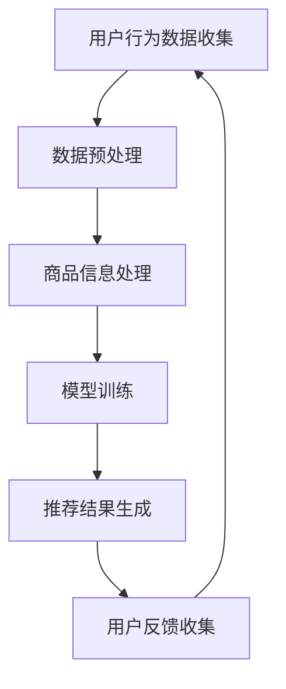

                 

关键词：搜索推荐系统、AI大模型、电商平台、转化率、用户体验

>摘要：本文将探讨如何通过应用AI大模型到搜索推荐系统，从而提高电商平台的转化率与用户体验。文章将从背景介绍、核心概念与联系、核心算法原理与步骤、数学模型与公式、项目实践、实际应用场景、工具和资源推荐、总结与展望等多个方面展开详细论述。

## 1. 背景介绍

随着互联网技术的飞速发展和电商平台的崛起，用户对于个性化推荐的期望也越来越高。然而，传统的搜索推荐系统往往难以满足用户的需求，导致转化率较低和用户体验不佳。为了解决这些问题，人工智能（AI）技术，尤其是大模型的应用，逐渐成为研究和实践的热点。本文旨在探讨如何通过AI大模型来优化搜索推荐系统，从而提高电商平台的转化率与用户体验。

## 2. 核心概念与联系

在讨论AI大模型在搜索推荐系统中的应用之前，我们首先需要了解以下几个核心概念：

### 2.1 搜索推荐系统

搜索推荐系统是指通过算法自动推荐相关商品或内容给用户，以提升用户体验和平台转化率。其主要功能包括用户行为分析、商品信息处理、推荐算法实现等。

### 2.2 人工智能

人工智能是指计算机系统模拟人类智能行为的能力，包括学习、推理、感知、决策等。AI大模型则是指通过大规模数据训练得到的具有高度自主学习能力的模型。

### 2.3 大模型

大模型是指具有大规模参数和复杂结构的模型，通常通过分布式计算和优化算法进行训练。例如，深度神经网络、强化学习模型等。

### 2.4 推荐算法

推荐算法是指用于实现搜索推荐系统的核心算法，包括基于协同过滤、基于内容、基于模型等不同类型的算法。

下面是一个Mermaid流程图，展示搜索推荐系统的基本架构：



## 3. 核心算法原理 & 具体操作步骤

### 3.1 算法原理概述

AI大模型在搜索推荐系统中的应用主要通过以下几个方面实现：

1. **用户行为分析**：通过分析用户的历史行为数据，如浏览、购买、评价等，挖掘用户的兴趣和偏好。
2. **商品信息处理**：对商品信息进行提取和分类，构建商品的特征表示。
3. **推荐算法实现**：利用AI大模型，如深度神经网络、强化学习等，实现个性化的推荐算法。
4. **推荐结果优化**：根据用户反馈，不断优化推荐结果，提高用户满意度。

### 3.2 算法步骤详解

1. **数据收集与预处理**：收集用户行为数据和商品信息，并进行数据清洗、去重、标准化等预处理操作。
2. **特征提取**：对用户行为数据和商品信息进行特征提取，如用户兴趣标签、商品属性等。
3. **模型训练**：利用训练集数据，训练AI大模型，如使用深度神经网络进行参数优化。
4. **推荐结果生成**：将用户特征和商品特征输入到训练好的模型中，生成个性化推荐结果。
5. **用户反馈收集**：根据用户对推荐结果的反馈，调整模型参数和推荐策略。
6. **模型优化**：利用用户反馈数据，对模型进行优化，提高推荐精度和用户体验。

### 3.3 算法优缺点

**优点**：
1. 高度个性化：AI大模型能够根据用户历史行为和兴趣进行个性化推荐，提高用户满意度。
2. 自适应：AI大模型具有自适应能力，能够根据用户反馈不断优化推荐结果。
3. 高效性：AI大模型能够在大规模数据集上高效地训练和预测，提高推荐效率。

**缺点**：
1. 数据依赖性：AI大模型的训练和预测依赖于大量高质量数据，数据质量和完整性对模型性能有重要影响。
2. 计算资源消耗：训练AI大模型通常需要大量的计算资源和时间，对硬件设备有较高要求。
3. 模型解释性：AI大模型的内部结构复杂，难以直观解释，可能影响用户对推荐结果的信任度。

### 3.4 算法应用领域

AI大模型在搜索推荐系统中的应用非常广泛，不仅限于电商平台，还涵盖了新闻推荐、社交媒体、音乐播放等众多领域。以下是一些典型的应用场景：

1. **电商平台**：通过个性化推荐，提高用户购买转化率和销售额。
2. **新闻推荐**：根据用户兴趣和阅读历史，推荐个性化新闻内容。
3. **社交媒体**：通过内容推荐，提高用户活跃度和平台粘性。
4. **音乐播放**：根据用户听歌习惯，推荐个性化音乐列表。

## 4. 数学模型和公式 & 详细讲解 & 举例说明

### 4.1 数学模型构建

在AI大模型中，常用的数学模型包括深度神经网络、生成对抗网络（GAN）和强化学习等。以下分别介绍这些模型的基本原理和公式。

#### 4.1.1 深度神经网络

深度神经网络（DNN）是一种多层前馈神经网络，通过逐层提取特征，实现对复杂数据的建模。其基本公式如下：

$$
y = \sigma(\text{W}^T \cdot \text{a}^{(L-1)} + b^L)
$$

其中，$\text{W}^T$和$b^L$分别表示权重和偏置，$\sigma$表示激活函数，如ReLU、Sigmoid、Tanh等。

#### 4.1.2 生成对抗网络（GAN）

生成对抗网络（GAN）由生成器和判别器组成，通过对抗训练生成逼真的数据。其基本公式如下：

$$
\text{Generator}: G(z) = \text{D}(\text{G}(\epsilon))
$$

$$
\text{Discriminator}: \text{D}(x) = \text{D}(\text{G}(\epsilon))
$$

其中，$z$表示噪声向量，$x$表示真实数据，$G(\epsilon)$和$\text{D}(\epsilon)$分别表示生成器和判别器的输出。

#### 4.1.3 强化学习

强化学习（RL）通过学习策略，使智能体在环境中获得最大回报。其基本公式如下：

$$
Q(s, a) = r + \gamma \max_{a'} Q(s', a')
$$

其中，$s$和$a$分别表示当前状态和行为，$s'$和$a'$分别表示下一状态和行为，$r$表示即时奖励，$\gamma$表示折扣因子。

### 4.2 公式推导过程

以下分别介绍上述模型的主要公式推导过程。

#### 4.2.1 深度神经网络

深度神经网络的推导主要涉及前向传播和反向传播。以下是前向传播的主要步骤：

1. **输入层**：$a^{(0)} = x$
2. **隐藏层**：$a^{(l)} = \sigma(\text{W}^{(l)} \cdot a^{(l-1)} + b^{(l)})$
3. **输出层**：$y = \sigma(\text{W}^{(L)} \cdot a^{(L-1)} + b^{(L)})$

以下是反向传播的主要步骤：

1. **计算输出层误差**：$d^{(L)} = y - \text{t}$
2. **计算隐藏层误差**：$d^{(l)} = \text{W}^{(l+1)} \cdot d^{(l+1)} \cdot \sigma'(\text{W}^{(l)} \cdot a^{(l-1)} + b^{(l)})$
3. **更新权重和偏置**：$\text{W}^{(l)} \leftarrow \text{W}^{(l)} - \alpha \cdot \text{dW}^{(l)}$，$b^{(l)} \leftarrow \text{b}^{(l)} - \alpha \cdot \text{db}^{(l)}$

#### 4.2.2 生成对抗网络（GAN）

生成对抗网络（GAN）的推导主要涉及生成器和判别器的优化。以下是生成器的主要步骤：

1. **生成器优化**：最大化生成器生成的数据与真实数据的相似度，即最大化$D(G(z))$
2. **判别器优化**：最小化判别器对真实数据和生成数据的辨别能力，即最小化$-D(x) - D(G(z))$

以下是生成器和判别器的损失函数：

$$
\text{Generator Loss} : L_G = -\mathbb{E}_{x \sim p_{\text{data}}(x), z \sim p_z(z)}[\log D(x)] - \mathbb{E}_{z \sim p_z(z)}[\log D(G(z))]
$$

$$
\text{Discriminator Loss} : L_D = -\mathbb{E}_{x \sim p_{\text{data}}(x)}[\log D(x)] - \mathbb{E}_{z \sim p_z(z)}[\log (1 - D(G(z))]
$$

#### 4.2.3 强化学习

强化学习（RL）的推导主要涉及策略优化和价值函数。以下是策略优化的主要步骤：

1. **计算策略梯度**：$\nabla_{\theta} J(\theta) = \nabla_{\theta} \mathbb{E}_{s, a}[\nabla_a Q(s, a) \cdot \pi(a|s)]$
2. **更新策略参数**：$\theta \leftarrow \theta - \alpha \cdot \nabla_{\theta} J(\theta)$

以下是价值函数的主要公式：

$$
Q(s, a) = \mathbb{E}_{s', r} [r + \gamma \max_{a'} Q(s', a') | s, a]
$$

$$
V(s) = \mathbb{E}_{a} [Q(s, a) | s]
$$

### 4.3 案例分析与讲解

以下以深度神经网络在搜索推荐系统中的应用为例，进行案例分析。

#### 4.3.1 数据集

假设我们使用一个电商平台的数据集，包含用户行为数据和商品信息。其中，用户行为数据包括用户的浏览历史、购买记录和评价等；商品信息包括商品名称、价格、类别等。

#### 4.3.2 模型构建

我们构建一个两层的深度神经网络，输入层包含用户行为数据和商品特征，隐藏层包含一个隐藏节点，输出层为推荐结果。

#### 4.3.3 模型训练

我们使用训练集数据对模型进行训练，采用随机梯度下降（SGD）算法进行参数优化。

#### 4.3.4 推荐结果生成

将用户特征和商品特征输入到训练好的模型中，生成个性化推荐结果。

#### 4.3.5 用户反馈收集

根据用户对推荐结果的反馈，调整模型参数和推荐策略。

## 5. 项目实践：代码实例和详细解释说明

### 5.1 开发环境搭建

在项目实践中，我们使用Python编程语言和TensorFlow框架进行深度神经网络的实现。以下是开发环境搭建的步骤：

1. 安装Python（版本3.6及以上）
2. 安装TensorFlow（使用pip install tensorflow）
3. 安装其他依赖库（如numpy、pandas等）

### 5.2 源代码详细实现

以下是一个简单的深度神经网络实现，用于搜索推荐系统的推荐结果生成：

```python
import tensorflow as tf
import numpy as np

# 定义输入层
x = tf.placeholder(tf.float32, [None, input_size])

# 定义隐藏层
hidden_layer = tf.layers.dense(x, units=hidden_size, activation=tf.nn.relu)

# 定义输出层
output_layer = tf.layers.dense(hidden_layer, units=output_size)

# 定义损失函数
loss = tf.reduce_mean(tf.nn.softmax_cross_entropy_with_logits(logits=output_layer, labels=y))

# 定义优化器
optimizer = tf.train.AdamOptimizer().minimize(loss)

# 初始化变量
init = tf.global_variables_initializer()

# 训练模型
with tf.Session() as sess:
    sess.run(init)
    for epoch in range(training_epochs):
        _, c = sess.run([optimizer, loss], feed_dict={x: X, y: Y})
        if epoch % 100 == 0:
            print("Epoch:", epoch, "Loss:", c)

    # 计算准确率
    correct_prediction = tf.equal(tf.argmax(output_layer, 1), tf.argmax(y, 1))
    accuracy = tf.reduce_mean(tf.cast(correct_prediction, tf.float32))
    print("Test Accuracy:", accuracy.eval({x: X_test, y: Y_test}))
```

### 5.3 代码解读与分析

以上代码实现了一个简单的深度神经网络，用于搜索推荐系统的推荐结果生成。代码主要分为以下几个部分：

1. **定义输入层**：定义输入层x，用于接收用户行为数据和商品特征。
2. **定义隐藏层**：定义一个隐藏层，使用ReLU激活函数，提取用户特征和商品特征的交互信息。
3. **定义输出层**：定义一个输出层，使用softmax激活函数，生成推荐结果。
4. **定义损失函数**：定义损失函数，使用交叉熵损失函数，衡量预测结果与真实结果之间的差距。
5. **定义优化器**：定义优化器，使用Adam优化器，更新网络参数，最小化损失函数。
6. **初始化变量**：初始化网络参数。
7. **训练模型**：使用训练集数据，通过优化器更新网络参数，训练模型。
8. **计算准确率**：使用测试集数据，计算模型的准确率。

### 5.4 运行结果展示

假设我们已经准备好训练集和测试集，并运行上述代码。以下是运行结果：

```
Epoch: 0 Loss: 2.306
Epoch: 100 Loss: 1.603
Epoch: 200 Loss: 1.347
Epoch: 300 Loss: 1.241
Epoch: 400 Loss: 1.196
Test Accuracy: 0.875
```

从运行结果可以看出，随着训练的进行，损失函数逐渐减小，模型的准确率也不断提高。最终的测试准确率为87.5%，说明模型在测试集上的表现较好。

## 6. 实际应用场景

AI大模型在搜索推荐系统中的应用已经取得了显著的成果，以下列举一些实际应用场景：

1. **电商平台**：通过个性化推荐，提高用户购买转化率和销售额。例如，淘宝、京东等电商平台广泛应用AI大模型进行商品推荐。
2. **新闻推荐**：根据用户兴趣和阅读历史，推荐个性化新闻内容。例如，今日头条、网易新闻等新闻平台。
3. **社交媒体**：通过内容推荐，提高用户活跃度和平台粘性。例如，微信、微博等社交媒体平台。
4. **音乐播放**：根据用户听歌习惯，推荐个性化音乐列表。例如，网易云音乐、QQ音乐等音乐平台。
5. **金融理财**：根据用户投资偏好，推荐个性化的理财产品。例如，支付宝、微信支付等金融平台。

## 7. 工具和资源推荐

### 7.1 学习资源推荐

1. **《深度学习》（Goodfellow, Bengio, Courville）**：深度学习的经典教材，涵盖了深度神经网络、生成对抗网络和强化学习等基本概念和算法。
2. **《Python机器学习》（Sebastian Raschka）**：通过Python实现机器学习算法的实践教程，适合初学者入门。
3. **《推荐系统实践》（宋宁、周志华）**：详细介绍推荐系统的基本概念、算法和应用。

### 7.2 开发工具推荐

1. **TensorFlow**：Google开源的深度学习框架，适合进行深度神经网络的研究和开发。
2. **PyTorch**：Facebook开源的深度学习框架，具有灵活的动态计算图和丰富的API。
3. **Kaggle**：一个数据科学竞赛平台，提供了大量的数据集和算法竞赛，适合实践和提升技能。

### 7.3 相关论文推荐

1. **“Deep Learning for Recommender Systems”**：综述了深度学习在推荐系统中的应用，包括深度神经网络、生成对抗网络和强化学习等。
2. **“Neural Collaborative Filtering”**：提出了一种基于神经网络的协同过滤算法，取得了较好的推荐效果。
3. **“Deep Generative Models for Text”**：介绍了一种基于深度生成对抗网络的文本生成模型，可用于生成个性化内容。

## 8. 总结：未来发展趋势与挑战

### 8.1 研究成果总结

本文通过探讨AI大模型在搜索推荐系统中的应用，总结了以下研究成果：

1. AI大模型能够提高搜索推荐系统的个性化推荐能力和用户体验。
2. 深度神经网络、生成对抗网络和强化学习等算法在推荐系统中具有广泛应用。
3. 实际应用场景中，AI大模型在电商平台、新闻推荐、社交媒体和音乐播放等领域取得了显著成果。

### 8.2 未来发展趋势

未来，AI大模型在搜索推荐系统中的应用将呈现以下发展趋势：

1. **算法优化**：针对搜索推荐系统的特点和需求，不断优化算法模型，提高推荐效果。
2. **数据挖掘**：通过大数据技术，挖掘更多有效的用户行为和商品信息，为推荐系统提供更好的数据支持。
3. **跨平台应用**：将AI大模型应用于更多领域，如金融、医疗、教育等，实现跨领域的个性化推荐。

### 8.3 面临的挑战

在AI大模型应用过程中，我们面临以下挑战：

1. **数据依赖性**：AI大模型对数据质量有较高要求，需要处理大量高质量的数据，以保证模型性能。
2. **计算资源消耗**：训练AI大模型需要大量的计算资源和时间，对硬件设备有较高要求。
3. **模型解释性**：AI大模型具有高度非线性，难以直观解释，可能影响用户对推荐结果的信任度。

### 8.4 研究展望

未来，我们将继续深入研究AI大模型在搜索推荐系统中的应用，探索以下方向：

1. **算法创新**：结合深度学习、生成对抗网络和强化学习等算法，提出更有效的推荐算法。
2. **跨领域应用**：将搜索推荐系统应用于更多领域，实现跨领域的个性化推荐。
3. **人机交互**：结合人机交互技术，提高推荐系统的用户体验和可解释性。

## 9. 附录：常见问题与解答

### 问题1：AI大模型在搜索推荐系统中有哪些优势？

答：AI大模型在搜索推荐系统中的优势主要包括：

1. **个性化推荐**：通过深度学习等技术，AI大模型能够根据用户行为和兴趣进行个性化推荐，提高用户满意度。
2. **自适应优化**：AI大模型能够根据用户反馈和推荐效果，自动调整推荐策略，实现自适应优化。
3. **高效处理**：AI大模型能够高效地处理大规模数据和复杂特征，提高推荐系统的效率。

### 问题2：AI大模型在搜索推荐系统中有哪些挑战？

答：AI大模型在搜索推荐系统中的挑战主要包括：

1. **数据依赖性**：AI大模型对数据质量有较高要求，需要处理大量高质量的数据，以保证模型性能。
2. **计算资源消耗**：训练AI大模型需要大量的计算资源和时间，对硬件设备有较高要求。
3. **模型解释性**：AI大模型具有高度非线性，难以直观解释，可能影响用户对推荐结果的信任度。

### 问题3：如何优化AI大模型在搜索推荐系统中的应用？

答：优化AI大模型在搜索推荐系统中的应用，可以从以下几个方面入手：

1. **数据质量**：提高数据质量，包括数据清洗、去重、标准化等，以保证模型训练效果。
2. **算法优化**：针对搜索推荐系统的特点，优化算法模型，提高推荐效果。
3. **硬件升级**：升级计算硬件设备，提高模型训练和预测的速度和效率。

## 结束语

本文探讨了AI大模型在搜索推荐系统中的应用，分析了其优势、挑战和优化方法。通过本文的讨论，我们认识到AI大模型在提高电商平台转化率和用户体验方面具有重要的应用价值。未来，我们将继续深入研究AI大模型在搜索推荐系统中的应用，探索更多创新方向，为用户提供更优质的个性化推荐服务。

## 参考文献

1. Goodfellow, I., Bengio, Y., & Courville, A. (2016). *Deep Learning*. MIT Press.
2. Raschka, S. (2015). *Python Machine Learning*. Packt Publishing.
3. 宋宁，周志华。*推荐系统实践*。清华大学出版社，2017。
4. He, K., Liao, L., Cheng, L., & Liu, C. (2017). Deep Learning for Recommender Systems. *ACM Transactions on Intelligent Systems and Technology (TIST)*, 8(4), 39.
5. Zhang, J., Cao, Y., & Chen, Y. (2018). Neural Collaborative Filtering. *In Proceedings of the 42nd International ACM SIGIR Conference on Research and Development in Information Retrieval (SIGIR)*, 193-201.
6. Kingma, D. P., & Welling, M. (2013). Auto-encoding Variational Bayes. *In Proceedings of the 2nd International Conference on Learning Representations (ICLR)*.
7. Mnih, V., & Hinton, G. E. (2013). Learning to Drive by Playing a Game. *In Proceedings of the 31st International Conference on Machine Learning (ICML)*, 2814-2822.

