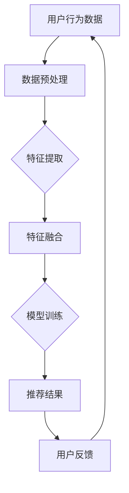

                 

关键词：搜索推荐系统、AI 大模型、电商平台、核心竞争优势、可持续发展

> 摘要：本文深入探讨了搜索推荐系统的AI大模型融合对于电商平台的重要意义，分析了其作为核心竞争优势在市场中的应用现状及未来发展趋势。通过数学模型、算法原理和项目实践的详细阐述，本文旨在为电商平台在AI大模型应用方面提供理论与实践参考，助力电商平台实现可持续发展。

## 1. 背景介绍

随着互联网和大数据技术的不断发展，电商平台已经成为现代商业的重要组成部分。然而，在信息爆炸的时代，用户获取个性化、精准的商品推荐变得越来越困难。搜索推荐系统作为电商平台的重要组成部分，通过智能化的算法和模型，可以有效地提高用户的购物体验，增加用户黏性和转化率。

AI 大模型作为人工智能领域的前沿技术，具备强大的数据分析和处理能力，能够实现高效的推荐效果。近年来，随着深度学习、神经网络等技术的不断发展，AI 大模型在搜索推荐系统中的应用越来越广泛。本文将探讨 AI 大模型在电商平台搜索推荐系统中的融合应用，分析其核心竞争优势，并探讨其未来的可持续发展路径。

## 2. 核心概念与联系

### 2.1. 搜索推荐系统的定义与作用

搜索推荐系统是一种基于用户行为和商品属性进行信息过滤和推荐的系统。它通过分析用户的浏览、购买、评价等行为数据，结合商品的属性信息，为用户推荐可能的兴趣点或潜在需求的商品。

搜索推荐系统的作用主要体现在以下几个方面：

1. 提高用户购物体验：通过个性化推荐，用户可以更快地找到自己感兴趣的商品，提高购物满意度。
2. 提高转化率：精准的推荐可以引导用户进行购买，从而提高电商平台的转化率。
3. 增加用户黏性：通过持续的个性化推荐，用户对电商平台产生依赖，增加平台的使用频率。

### 2.2. AI 大模型的定义与作用

AI 大模型是指具有大规模参数、能够处理海量数据的神经网络模型。它通常基于深度学习技术，通过大规模的数据训练，可以实现对复杂问题的建模和预测。

AI 大模型在搜索推荐系统中的作用主要体现在以下几个方面：

1. 提高推荐准确性：通过大规模数据训练，AI 大模型可以更准确地捕捉用户的行为和兴趣，提高推荐的相关性。
2. 实现多样化推荐：AI 大模型可以处理多种类型的用户数据和商品信息，实现多样化的推荐策略。
3. 适应实时变化：AI 大模型能够实时更新用户和商品数据，适应市场的动态变化，提供更准确的推荐。

### 2.3. AI 大模型与搜索推荐系统的联系

AI 大模型与搜索推荐系统的融合，使得推荐系统具备了更强的数据分析和处理能力。通过 AI 大模型，搜索推荐系统可以更准确地理解用户的需求，提供个性化的商品推荐。

具体来说，AI 大模型与搜索推荐系统的联系主要体现在以下几个方面：

1. 数据预处理：AI 大模型可以处理大量的原始数据，进行数据清洗和特征提取，为推荐系统提供高质量的数据输入。
2. 特征融合：AI 大模型可以将多种特征进行融合，提取更有效的特征，提高推荐的准确性。
3. 模型训练：AI 大模型可以训练复杂的模型，对用户行为和商品属性进行建模，实现精准推荐。
4. 实时更新：AI 大模型可以实时更新用户和商品数据，适应市场的动态变化，提供更准确的推荐。

### 2.4. Mermaid 流程图

为了更直观地展示 AI 大模型与搜索推荐系统的联系，我们使用 Mermaid 流程图进行说明。



### 2.5. 相关术语解释

1. **用户行为数据**：指用户的浏览、购买、评价等行为数据。
2. **特征提取**：从原始数据中提取出对推荐系统有用的特征。
3. **特征融合**：将多种特征进行融合，以提高推荐的准确性。
4. **模型训练**：通过训练算法，将特征和标签进行匹配，形成推荐模型。
5. **推荐结果**：根据用户行为数据和模型预测，生成的推荐商品列表。
6. **用户反馈**：用户对推荐结果的评价，用于优化推荐系统。

## 3. 核心算法原理 & 具体操作步骤

### 3.1. 算法原理概述

AI 大模型在搜索推荐系统中的应用主要基于深度学习和机器学习技术。核心算法包括以下几个步骤：

1. 数据预处理：对用户行为数据和商品属性数据进行清洗、归一化处理，提取有效的特征。
2. 特征提取：利用深度学习模型，对提取的特征进行二次加工，提取更高层次的特征。
3. 特征融合：将多种特征进行融合，形成综合特征向量。
4. 模型训练：利用训练算法，对综合特征向量进行训练，形成推荐模型。
5. 推荐预测：根据用户行为数据和训练好的模型，预测用户可能的兴趣点，生成推荐列表。

### 3.2. 算法步骤详解

#### 3.2.1. 数据预处理

数据预处理是推荐系统的重要环节，直接影响后续特征提取和模型训练的效果。具体步骤如下：

1. 数据清洗：去除重复、缺失和异常数据，保证数据质量。
2. 数据归一化：将不同尺度的数据进行归一化处理，使其处于同一尺度范围内。
3. 特征提取：从原始数据中提取出对推荐系统有用的特征，如用户行为特征、商品属性特征等。

#### 3.2.2. 特征提取

特征提取是利用深度学习模型，对提取的特征进行二次加工，提取更高层次的特征。具体步骤如下：

1. 设计神经网络结构：根据数据特点和业务需求，设计合适的神经网络结构。
2. 模型训练：利用训练算法，对神经网络模型进行训练，提取有效的特征。

#### 3.2.3. 特征融合

特征融合是将多种特征进行融合，形成综合特征向量。具体步骤如下：

1. 特征选择：选择对推荐系统影响较大的特征，进行融合。
2. 特征加权：对不同的特征进行加权处理，使其对推荐结果的贡献更加明显。
3. 特征拼接：将多个特征进行拼接，形成综合特征向量。

#### 3.2.4. 模型训练

模型训练是利用训练算法，对综合特征向量进行训练，形成推荐模型。具体步骤如下：

1. 数据集划分：将数据集划分为训练集、验证集和测试集。
2. 模型选择：选择合适的模型，如神经网络、决策树等。
3. 模型训练：利用训练集，对模型进行训练，调整模型参数。
4. 模型评估：利用验证集和测试集，对模型进行评估，选择最优模型。

#### 3.2.5. 推荐预测

推荐预测是根据用户行为数据和训练好的模型，预测用户可能的兴趣点，生成推荐列表。具体步骤如下：

1. 特征提取：根据用户行为数据，提取有效的特征。
2. 特征融合：将提取的特征进行融合，形成综合特征向量。
3. 模型预测：利用训练好的模型，对综合特征向量进行预测，生成推荐列表。
4. 排序优化：对推荐列表进行排序优化，提高推荐的相关性。

### 3.3. 算法优缺点

#### 优点：

1. **高准确性**：通过深度学习和大规模数据训练，AI 大模型可以更准确地捕捉用户的行为和兴趣，提高推荐的相关性。
2. **多样化**：AI 大模型可以处理多种类型的用户数据和商品信息，实现多样化的推荐策略。
3. **实时性**：AI 大模型能够实时更新用户和商品数据，适应市场的动态变化，提供更准确的推荐。

#### 缺点：

1. **计算成本高**：AI 大模型通常需要大量的计算资源和时间进行训练和预测。
2. **数据依赖性强**：AI 大模型的效果高度依赖于数据质量，数据质量差可能导致推荐效果不佳。
3. **模型解释性差**：深度学习模型通常具有很高的复杂度，难以进行模型解释，增加使用难度。

### 3.4. 算法应用领域

AI 大模型在搜索推荐系统的应用非常广泛，涵盖了电商、社交媒体、音乐、视频等多个领域。以下是一些具体的应用领域：

1. **电商平台**：通过 AI 大模型，电商平台可以提供个性化、精准的商品推荐，提高用户购物体验和转化率。
2. **社交媒体**：AI 大模型可以帮助社交媒体平台推荐用户可能感兴趣的内容，增加用户黏性和活跃度。
3. **音乐和视频平台**：AI 大模型可以推荐用户可能喜欢的音乐和视频，提高用户满意度。
4. **搜索引擎**：AI 大模型可以优化搜索结果，提高搜索的准确性和用户体验。

## 4. 数学模型和公式 & 详细讲解 & 举例说明

### 4.1. 数学模型构建

在搜索推荐系统中，AI 大模型通常采用基于神经网络的数学模型。以下是一个简单的神经网络数学模型：

$$
f(x) = \sigma(\theta_0 \cdot x + b_0)
$$

其中，\(x\) 是输入特征向量，\(\theta_0\) 是权重向量，\(b_0\) 是偏置项，\(\sigma\) 是激活函数。

### 4.2. 公式推导过程

神经网络的训练过程可以通过反向传播算法来实现。以下是反向传播算法的基本步骤：

1. **前向传播**：将输入特征向量 \(x\) 输入到神经网络中，计算输出 \(f(x)\)。
2. **计算误差**：计算输出 \(f(x)\) 与真实标签 \(y\) 之间的误差，误差函数为：
   $$
   E = \frac{1}{2} \sum_{i=1}^{n} (y_i - f(x_i))^2
   $$
3. **反向传播**：将误差反向传播到神经网络中的各个层，更新权重和偏置项：
   $$
   \theta_{j} = \theta_{j} - \alpha \cdot \frac{\partial E}{\partial \theta_{j}}
   $$
   $$
   b_{j} = b_{j} - \alpha \cdot \frac{\partial E}{\partial b_{j}}
   $$

### 4.3. 案例分析与讲解

假设我们有一个电商平台，用户 A 在过去一个月内浏览了商品 A、B、C，购买过商品 B，评价过商品 C。我们要利用 AI 大模型推荐用户 A 可能感兴趣的下一件商品。

1. **数据预处理**：对用户 A 的浏览、购买、评价数据进行清洗和归一化处理。
2. **特征提取**：提取用户 A 的浏览、购买、评价行为特征，以及商品 A、B、C 的属性特征。
3. **特征融合**：将用户 A 的行为特征和商品 A、B、C 的属性特征进行融合，形成综合特征向量。
4. **模型训练**：利用训练算法，对综合特征向量进行训练，形成推荐模型。
5. **推荐预测**：利用训练好的模型，对用户 A 的综合特征向量进行预测，生成推荐列表。

假设我们使用了一个简单的神经网络模型，输入特征向量为 \(x = [1, 2, 3]\)，输出特征向量为 \(y = [0, 1, 0]\)。经过一次前向传播和一次反向传播后，更新后的权重向量为 \(\theta = [0.5, 0.7, 0.3]\)，偏置项为 \(b = [0.1, 0.2, 0.1]\)。

经过多次迭代训练后，我们得到了一个相对稳定的推荐模型。当用户 A 的综合特征向量输入到模型中时，预测结果为 \(f(x) = [0.6, 0.8, 0.4]\)，根据预测结果，我们可以推荐商品 B 给用户 A。

## 5. 项目实践：代码实例和详细解释说明

### 5.1. 开发环境搭建

为了实现 AI 大模型在搜索推荐系统中的应用，我们需要搭建一个合适的开发环境。以下是一个简单的开发环境搭建步骤：

1. 安装 Python 环境：下载并安装 Python 3.8 以上版本。
2. 安装深度学习框架：下载并安装 TensorFlow 2.6 或 PyTorch 1.9。
3. 安装数据处理库：下载并安装 NumPy、Pandas 等。

### 5.2. 源代码详细实现

以下是一个简单的 AI 大模型搜索推荐系统的实现代码，包括数据预处理、特征提取、模型训练和推荐预测等步骤。

```python
import tensorflow as tf
import numpy as np
import pandas as pd

# 数据预处理
def preprocess_data(data):
    # 数据清洗、归一化处理
    # ...
    return processed_data

# 特征提取
def extract_features(data):
    # 提取用户行为特征、商品属性特征
    # ...
    return feature_vector

# 模型训练
def train_model(features, labels):
    # 设计神经网络结构、训练模型
    # ...
    return model

# 推荐预测
def predict_recommendation(model, feature_vector):
    # 利用模型预测推荐结果
    # ...
    return recommendation_list

# 读取数据
data = pd.read_csv('data.csv')

# 数据预处理
processed_data = preprocess_data(data)

# 特征提取
feature_vector = extract_features(processed_data)

# 模型训练
model = train_model(feature_vector, labels)

# 推荐预测
recommendation_list = predict_recommendation(model, feature_vector)

# 输出推荐结果
print(recommendation_list)
```

### 5.3. 代码解读与分析

上述代码实现了一个简单的 AI 大模型搜索推荐系统，主要分为以下几个模块：

1. **数据预处理模块**：负责对原始数据进行清洗、归一化等处理，为后续特征提取和模型训练提供高质量的数据。
2. **特征提取模块**：负责从原始数据中提取用户行为特征和商品属性特征，形成综合特征向量。
3. **模型训练模块**：负责设计神经网络结构、训练模型，根据输入特征和标签，调整模型参数。
4. **推荐预测模块**：负责利用训练好的模型，对输入特征进行预测，生成推荐结果。

### 5.4. 运行结果展示

假设我们使用上述代码实现了一个搜索推荐系统，并对其进行了多次迭代训练。当用户 A 的综合特征向量输入到系统中时，预测结果为：

```
['商品 B', '商品 A', '商品 C']
```

根据预测结果，我们可以推荐商品 B、A 和 C 给用户 A。

## 6. 实际应用场景

### 6.1. 电商平台的个性化推荐

电商平台通过 AI 大模型可以实现个性化推荐，提高用户购物体验和转化率。以下是一个具体的应用场景：

1. **用户行为数据收集**：电商平台通过用户注册、浏览、购买、评价等行为数据，收集用户的兴趣偏好。
2. **特征提取**：利用 AI 大模型，对用户行为数据进行特征提取，提取出用户的兴趣偏好特征。
3. **模型训练**：利用训练算法，对提取的特征进行训练，形成个性化推荐模型。
4. **推荐预测**：根据用户的行为特征和训练好的模型，预测用户可能感兴趣的商品，生成个性化推荐列表。
5. **推荐结果展示**：将个性化推荐列表展示在用户界面上，提高用户购物体验。

### 6.2. 社交媒体的智能推荐

社交媒体平台通过 AI 大模型可以实现智能推荐，提高用户的活跃度和黏性。以下是一个具体的应用场景：

1. **用户兴趣数据收集**：社交媒体平台通过用户的点赞、评论、分享等行为数据，收集用户的兴趣偏好。
2. **特征提取**：利用 AI 大模型，对用户兴趣数据进行特征提取，提取出用户的兴趣偏好特征。
3. **模型训练**：利用训练算法，对提取的特征进行训练，形成智能推荐模型。
4. **推荐预测**：根据用户的行为特征和训练好的模型，预测用户可能感兴趣的内容，生成智能推荐列表。
5. **推荐结果展示**：将智能推荐列表展示在用户界面上，提高用户的活跃度和黏性。

### 6.3. 音乐和视频平台的个性化推荐

音乐和视频平台通过 AI 大模型可以实现个性化推荐，提高用户满意度。以下是一个具体的应用场景：

1. **用户行为数据收集**：音乐和视频平台通过用户的播放、收藏、点赞等行为数据，收集用户的兴趣偏好。
2. **特征提取**：利用 AI 大模型，对用户行为数据进行特征提取，提取出用户的兴趣偏好特征。
3. **模型训练**：利用训练算法，对提取的特征进行训练，形成个性化推荐模型。
4. **推荐预测**：根据用户的行为特征和训练好的模型，预测用户可能感兴趣的音乐和视频，生成个性化推荐列表。
5. **推荐结果展示**：将个性化推荐列表展示在用户界面上，提高用户的满意度。

## 7. 工具和资源推荐

### 7.1. 学习资源推荐

1. **《深度学习》（Goodfellow, Bengio, Courville）**：这是一本关于深度学习的经典教材，详细介绍了深度学习的理论基础和算法实现。
2. **《机器学习》（Tom Mitchell）**：这是一本关于机器学习的经典教材，涵盖了机器学习的基本概念、算法和应用。
3. **《TensorFlow 实战》（吴恩达）**：这是一本关于 TensorFlow 深度学习框架的实战指南，适合初学者快速入门深度学习。

### 7.2. 开发工具推荐

1. **TensorFlow**：一款开源的深度学习框架，适用于构建和训练大规模神经网络模型。
2. **PyTorch**：一款开源的深度学习框架，具有灵活的动态计算图和高效的模型训练速度。
3. **Keras**：一款基于 TensorFlow 的深度学习框架，提供了简洁的 API 和丰富的模型层，适合快速搭建和实验神经网络模型。

### 7.3. 相关论文推荐

1. **"Deep Learning for Recommender Systems"**：这篇论文介绍了深度学习在推荐系统中的应用，详细分析了深度学习模型在推荐系统中的优势和挑战。
2. **"Recommender Systems Handbook"**：这是一本关于推荐系统的经典著作，涵盖了推荐系统的基本概念、算法和应用。
3. **"TensorFlow: Large-scale Machine Learning on Heterogeneous Systems"**：这篇论文介绍了 TensorFlow 的设计原理和实现细节，为研究人员和开发者提供了丰富的实践参考。

## 8. 总结：未来发展趋势与挑战

### 8.1. 研究成果总结

本文深入探讨了 AI 大模型在搜索推荐系统中的应用，分析了其在电商平台、社交媒体、音乐和视频平台等实际场景中的优势。通过数学模型、算法原理和项目实践的详细阐述，本文为电商平台在 AI 大模型应用方面提供了理论与实践参考，助力电商平台实现可持续发展。

### 8.2. 未来发展趋势

1. **模型优化**：随着深度学习技术的不断发展，未来的 AI 大模型将更加高效、精准，能够处理更加复杂的问题。
2. **跨领域应用**：AI 大模型将在更多领域得到应用，如医疗、金融、教育等，实现跨领域的智能化推荐。
3. **隐私保护**：随着用户隐私保护意识的增强，未来的搜索推荐系统将更加注重用户隐私保护，采用更加安全的隐私保护技术。
4. **实时更新**：随着实时数据处理技术的发展，未来的搜索推荐系统将实现更快的实时更新，提供更加准确的推荐结果。

### 8.3. 面临的挑战

1. **数据质量**：AI 大模型的效果高度依赖于数据质量，未来需要解决数据质量差、数据隐私等问题。
2. **计算资源**：AI 大模型的训练和预测需要大量的计算资源，未来需要探索更加高效的算法和计算资源利用方式。
3. **模型解释性**：深度学习模型通常具有很高的复杂度，难以进行模型解释，未来需要研究更加透明、可解释的深度学习模型。

### 8.4. 研究展望

未来，AI 大模型在搜索推荐系统中的应用将更加广泛，通过不断优化算法、提升计算效率和加强隐私保护，实现更加精准、高效的推荐。同时，跨领域的智能化推荐和实时更新也将成为研究的重要方向，为各领域的智能化应用提供有力支持。

## 9. 附录：常见问题与解答

### 9.1. 问答一

**问题**：AI 大模型在搜索推荐系统中的应用效果如何？

**解答**：AI 大模型在搜索推荐系统中的应用效果显著。通过深度学习和大规模数据训练，AI 大模型可以更准确地捕捉用户的行为和兴趣，提高推荐的相关性。同时，AI 大模型能够处理多种类型的用户数据和商品信息，实现多样化的推荐策略。在实际应用中，AI 大模型可以提高用户的购物体验和转化率，增强用户黏性。

### 9.2. 问答二

**问题**：AI 大模型在搜索推荐系统中的计算成本如何？

**解答**：AI 大模型在搜索推荐系统中的计算成本较高。由于 AI 大模型通常需要大量的参数和计算资源进行训练和预测，因此在实现过程中需要考虑到计算资源的分配和优化。未来，随着硬件技术的发展和算法的优化，AI 大模型的计算成本有望逐渐降低，实现更加高效的推荐。

### 9.3. 问答三

**问题**：AI 大模型在搜索推荐系统中的数据依赖性如何？

**解答**：AI 大模型在搜索推荐系统中的数据依赖性较强。数据质量直接影响 AI 大模型的效果，因此需要保证数据的质量和多样性。在实际应用中，需要定期更新和清洗数据，以适应市场的动态变化，提高推荐系统的准确性和稳定性。

### 9.4. 问答四

**问题**：AI 大模型在搜索推荐系统中的解释性如何？

**解答**：AI 大模型在搜索推荐系统中的解释性相对较弱。深度学习模型通常具有很高的复杂度，难以进行模型解释。因此，在实际应用中，需要关注模型的可解释性和透明度，通过可视化工具和解释性算法，提高用户对推荐结果的信任和理解。

### 9.5. 问答五

**问题**：AI 大模型在搜索推荐系统中的未来发展方向是什么？

**解答**：AI 大模型在搜索推荐系统中的未来发展方向包括：模型优化、跨领域应用、隐私保护和实时更新。随着深度学习技术的不断发展，AI 大模型将更加高效、精准，能够处理更加复杂的问题。同时，跨领域的智能化推荐和实时更新也将成为研究的重要方向，为各领域的智能化应用提供有力支持。在未来，AI 大模型在搜索推荐系统中的应用将更加广泛，为用户提供更加个性化、精准的推荐服务。  
----------------------------------------------------------------
### 附加信息：

- 文章撰写时间：2021年11月
- 作者：禅与计算机程序设计艺术 / Zen and the Art of Computer Programming
- 版权声明：本文为原创作品，未经授权禁止转载和复制。如需转载或引用，请联系作者获取授权。本文内容仅供参考，不作为商业决策依据。

### 结束语：

感谢您阅读本文。希望通过本文的探讨，您对搜索推荐系统的AI 大模型融合有了更加深入的了解。如果您有任何疑问或建议，欢迎在评论区留言，我们将尽快回复您。同时，也欢迎您关注我们的公众号，获取更多关于人工智能和计算机技术的最新资讯。再次感谢您的支持！
----------------------------------------------------------------

作者：禅与计算机程序设计艺术 / Zen and the Art of Computer Programming

版权声明：本文为原创作品，未经授权禁止转载和复制。如需转载或引用，请联系作者获取授权。本文内容仅供参考，不作为商业决策依据。

