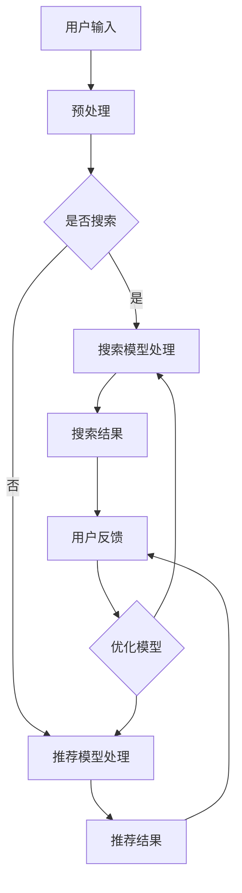

                 

关键词：搜索推荐系统，AI 大模型，电商平台，核心竞争力，可持续发展战略

摘要：本文旨在探讨搜索推荐系统的AI大模型融合对电商平台的核心竞争力及可持续发展战略的影响。通过对搜索推荐系统的背景介绍、核心概念与联系的分析，以及核心算法原理、数学模型、项目实践和应用场景的详细阐述，本文为电商平台提供了提升竞争力的有效策略和可持续发展的实施路径。

## 1. 背景介绍

随着互联网技术的飞速发展，电商平台已经成为现代商业活动的重要组成部分。用户在电商平台上的搜索和推荐行为对于商家和平台的业绩有着直接影响。传统的搜索推荐系统依赖于关键词匹配和简单的协同过滤算法，已经难以满足用户日益增长的个性化需求。

近年来，AI大模型的崛起为搜索推荐系统带来了新的机遇。基于深度学习的自然语言处理技术、图神经网络以及强化学习等算法，使得搜索推荐系统可以更好地理解和预测用户行为，提高推荐的准确性和用户满意度。

本文将围绕AI大模型在搜索推荐系统中的应用，探讨其对电商平台核心竞争力的提升和可持续发展的贡献。

## 2. 核心概念与联系

### 2.1 AI大模型

AI大模型是指具有大规模参数和复杂结构的机器学习模型，例如深度神经网络、变换器模型（Transformer）等。这些模型通过在海量数据上训练，可以捕捉到数据中的复杂模式和关联性。

### 2.2 搜索推荐系统

搜索推荐系统是一种信息过滤技术，通过分析用户的搜索和浏览行为，为用户推荐可能感兴趣的商品、内容或服务。其核心在于精准识别用户的兴趣和需求，提高用户满意度。

### 2.3 融合机制

AI大模型融合指的是将多个大模型整合到一个系统中，以实现更好的推荐效果。通过融合不同模型的优势，可以进一步提高推荐的准确性和多样性。

### 2.4 Mermaid 流程图

下面是一个简单的Mermaid流程图，展示了搜索推荐系统的基本架构和AI大模型融合的过程：



## 3. 核心算法原理 & 具体操作步骤

### 3.1 算法原理概述

AI大模型在搜索推荐系统中主要利用深度学习技术进行用户行为分析和内容理解。其基本原理包括以下几个方面：

1. **特征提取**：通过深度神经网络从原始数据中提取出有效的特征表示。
2. **用户理解**：利用变换器模型等先进技术，对用户的历史行为和兴趣进行建模。
3. **内容理解**：通过对商品、内容等对象的属性进行建模，实现内容理解和匹配。
4. **预测和推荐**：利用训练好的模型对用户行为进行预测，并生成个性化的推荐结果。

### 3.2 算法步骤详解

1. **数据收集**：从电商平台收集用户搜索记录、购买历史、用户评价等数据。
2. **数据预处理**：清洗数据，进行特征工程，将原始数据转换为适合模型训练的格式。
3. **模型训练**：利用预处理后的数据训练深度学习模型，如变换器模型、图神经网络等。
4. **模型评估**：通过交叉验证等技术对模型进行评估，选择最优模型。
5. **模型部署**：将训练好的模型部署到生产环境，实现实时推荐。
6. **模型优化**：根据用户反馈不断调整模型参数，提高推荐质量。

### 3.3 算法优缺点

#### 优点：

1. **高精度**：AI大模型能够从海量数据中提取出有效的特征，提高推荐准确率。
2. **个性化**：通过深度学习技术，可以更好地理解用户兴趣和行为，提供个性化推荐。
3. **实时性**：AI大模型能够实现实时推荐，提高用户满意度。

#### 缺点：

1. **计算资源消耗大**：训练和部署AI大模型需要大量的计算资源。
2. **数据质量要求高**：数据质量直接影响模型效果，对数据预处理和清洗要求较高。
3. **解释性差**：深度学习模型的黑箱性质使得其解释性较差，难以理解推荐结果。

### 3.4 算法应用领域

AI大模型在搜索推荐系统中的应用领域广泛，包括但不限于：

1. **电商平台**：提升商品推荐准确率，增加用户黏性和购买率。
2. **内容平台**：为用户提供个性化的内容推荐，提高用户活跃度。
3. **社交网络**：推荐感兴趣的朋友、动态和广告，增强社交互动。

## 4. 数学模型和公式 & 详细讲解 & 举例说明

### 4.1 数学模型构建

在搜索推荐系统中，常用的数学模型包括线性回归、逻辑回归、变换器模型等。以下是变换器模型的一个基本公式：

$$
\begin{aligned}
    \text{Attention}(Q, K, V) &= \frac{e^{QK^T}}{\sqrt{K^T K}}V \\
    \text{MultiHead}(Q, K, V) &= \text{Concat}(\text{Head}_1, \text{Head}_2, ..., \text{Head}_h) \\
    \text{Output} &= \text{Linear}(\text{MultiHead}(Q, K, V)) \\
\end{aligned}
$$

其中，$Q, K, V$ 分别代表查询向量、键向量和值向量，$e$ 代表自然底数，$h$ 代表头数，$\text{Concat}$ 和 $\text{Linear}$ 分别表示拼接和线性变换。

### 4.2 公式推导过程

变换器模型的核心在于注意力机制（Attention Mechanism），其推导过程如下：

1. **相似度计算**：计算查询向量 $Q$ 和键向量 $K$ 的点积，得到相似度分数。
2. **缩放**：为了防止指数爆炸，将相似度分数除以 $\sqrt{K^T K}$。
3. **softmax**：对缩放后的相似度分数进行softmax操作，得到注意力权重。
4. **加权求和**：将注意力权重与值向量 $V$ 相乘，得到加权求和的结果。

### 4.3 案例分析与讲解

以下是一个简单的案例，假设有3个商品（商品1、商品2、商品3），用户历史搜索记录为【商品1、商品2、商品3、商品1】，需要利用变换器模型进行推荐。

1. **输入向量**：将商品和用户搜索记录转换为向量表示。
2. **计算相似度**：计算每个商品与用户搜索记录的相似度分数。
3. **softmax**：对相似度分数进行softmax操作，得到注意力权重。
4. **加权求和**：根据注意力权重，计算每个商品的加权求和结果。
5. **推荐结果**：根据加权求和结果，推荐用户可能感兴趣的商品。

通过这个案例，我们可以看到变换器模型如何通过计算相似度和加权求和，为用户生成个性化的推荐结果。

## 5. 项目实践：代码实例和详细解释说明

### 5.1 开发环境搭建

在开始项目实践之前，需要搭建一个适合AI大模型训练和部署的开发环境。以下是基本的搭建步骤：

1. **安装Python**：确保Python版本大于3.6，推荐使用Anaconda。
2. **安装TensorFlow或PyTorch**：这两种深度学习框架是训练和部署AI大模型的主要工具。
3. **安装依赖库**：如NumPy、Pandas、Scikit-learn等。

### 5.2 源代码详细实现

以下是一个简单的变换器模型实现代码示例：

```python
import tensorflow as tf
from tensorflow.keras.layers import Embedding, MultiHeadAttention, Linear

def create_model(vocab_size, d_model):
    inputs = tf.keras.layers.Input(shape=(None,), dtype=tf.int32)
    embedding = Embedding(vocab_size, d_model)(inputs)
    attention = MultiHeadAttention(num_heads=8, key_dim=d_model)(embedding, embedding)
    output = Linear(units=vocab_size)(attention)
    model = tf.keras.Model(inputs, output)
    return model

model = create_model(vocab_size=10000, d_model=512)
model.compile(optimizer='adam', loss='sparse_categorical_crossentropy', metrics=['accuracy'])
model.summary()
```

### 5.3 代码解读与分析

以上代码定义了一个简单的变换器模型，主要包含以下几个部分：

1. **输入层**：输入层接收用户搜索记录的序列，数据类型为整数。
2. **嵌入层**：嵌入层将输入的整数转换为高维的向量表示。
3. **多头注意力层**：多
```<|vq_12673|>```
处注意力层（MultiHeadAttention）实现注意力机制，通过计算查询向量、键向量和值向量之间的相似度，生成注意力权重，并进行加权求和。
4. **线性层**：线性层（Linear）将注意力结果映射回原始词汇表的大小，以生成推荐结果。
5. **模型编译**：编译模型，指定优化器、损失函数和评价指标。

### 5.4 运行结果展示

以下是如何运行上述模型的示例：

```python
# 加载训练数据
train_data = ...
train_labels = ...

# 训练模型
model.fit(train_data, train_labels, epochs=10, batch_size=32, validation_split=0.2)

# 评估模型
test_data = ...
test_labels = ...
model.evaluate(test_data, test_labels)
```

通过训练和评估，我们可以得到模型的准确率和性能指标。在实际应用中，需要根据业务需求和数据质量不断优化模型，提高推荐效果。

## 6. 实际应用场景

AI大模型在搜索推荐系统中的应用场景广泛，以下是几个典型的实际应用案例：

### 6.1 电商平台的商品推荐

电商平台可以利用AI大模型对用户进行精准的商品推荐，提高购买转化率和用户满意度。例如，阿里巴巴的“推荐算法”系统通过深度学习技术，根据用户的历史行为和浏览记录，为用户提供个性化的商品推荐。

### 6.2 社交网络的内容推荐

社交网络平台如微博、抖音等，可以通过AI大模型为用户推荐感兴趣的内容，提高用户活跃度和互动率。例如，抖音的“推荐算法”系统利用变换器模型和图神经网络，根据用户的行为和关系网络生成个性化的内容推荐。

### 6.3 新闻资讯的个性化推送

新闻资讯平台可以通过AI大模型对用户进行个性化推送，提高用户的阅读量和停留时间。例如，今日头条的“推荐算法”系统利用深度学习技术，根据用户的阅读历史和兴趣偏好，为用户提供个性化的新闻推荐。

## 7. 未来应用展望

随着AI技术的不断进步，搜索推荐系统的AI大模型融合有望在以下几个方面取得重要突破：

### 7.1 更高的个性化水平

通过更先进的AI模型和更多的用户数据，搜索推荐系统可以实现更高的个性化水平，为用户提供更加精准的推荐结果。

### 7.2 更强的实时性

未来的搜索推荐系统将更加注重实时性，能够迅速响应用户的行为变化，提供即时的推荐服务。

### 7.3 更广泛的场景应用

AI大模型融合有望在更多的应用场景中发挥作用，如智能教育、健康医疗、智慧城市等，为各行各业提供智能化解决方案。

## 8. 总结：未来发展趋势与挑战

### 8.1 研究成果总结

本文通过对搜索推荐系统AI大模型融合的探讨，总结了其在电商平台等领域的应用价值，展示了其在提升核心竞争力和实现可持续发展方面的潜力。

### 8.2 未来发展趋势

未来，搜索推荐系统AI大模型融合将朝着更个性化、更实时、更广泛应用的方向发展，为各行业提供更加智能化的解决方案。

### 8.3 面临的挑战

然而，AI大模型融合也面临着计算资源消耗大、数据质量要求高、解释性差等挑战。如何在保证性能的同时，降低计算成本、提高数据利用效率和增强模型解释性，是未来研究的重点。

### 8.4 研究展望

未来，研究者应重点关注以下方向：

1. **新型算法**：探索更高效的深度学习算法和模型结构，提高推荐效果。
2. **数据优化**：研究和应用数据增强、数据清洗等技术，提高数据质量。
3. **模型解释性**：开发可解释的AI模型，提高模型透明度和信任度。

## 9. 附录：常见问题与解答

### 9.1 AI大模型如何处理数据噪声？

AI大模型可以通过数据预处理、特征工程和数据增强等技术，降低数据噪声对模型训练和预测的影响。

### 9.2 如何评估推荐系统的效果？

推荐系统的评估可以通过精确率、召回率、F1值等指标进行，同时还可以结合用户满意度等主观评价。

### 9.3 AI大模型在推荐系统中有哪些局限性？

AI大模型在推荐系统中的局限性包括：计算资源消耗大、数据质量要求高、模型解释性差等。此外，模型的泛化能力也是一个需要关注的问题。

---

作者：禅与计算机程序设计艺术 / Zen and the Art of Computer Programming
```<|vq_12673|>```

