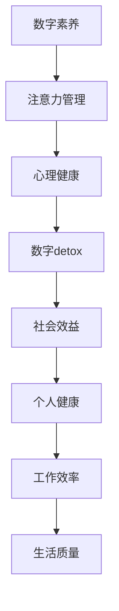

                 

在当今这个数字时代，我们被卷入了无尽的网络信息流、社交媒体更新和广告推送中。这种无休止的注意力捕捉，不仅导致了我们的时间被无谓地消耗，还可能对我们的心理健康产生负面影响。这种现象，我们称之为“注意力经济”。而本文将探讨一种新的趋势——“数字detox”，即如何对抗注意力经济，恢复我们的心灵宁静。

> 关键词：数字detox，注意力经济，心理健康，技术反制，数字素养

> 摘要：本文将深入探讨“数字detox”这一概念，分析其背后的动机和理论基础。通过介绍一些具体的方法和工具，帮助读者实践数字detox，并讨论其对社会和个人健康的影响。最后，本文将展望数字detox的未来趋势和挑战。

## 1. 背景介绍

随着互联网和智能手机的普及，我们的生活越来越依赖于数字技术。然而，这种依赖不仅带来了便利，也引发了一系列问题。注意力经济便是其中之一。注意力经济是指通过捕捉和引导用户的注意力来创造商业价值的经济模式。社交媒体、广告商、应用程序开发商等都在利用各种手段吸引我们的注意力，从而获取利润。

然而，这种注意力经济的背后，隐藏着对用户心理健康和时间的剥削。研究表明，过度使用社交媒体和智能手机会导致焦虑、抑郁和失眠等问题。此外，我们的时间也被无谓地消耗在无尽的浏览和更新中，影响了我们的工作效率和生活质量。

为了应对这些问题，越来越多的人开始寻求“数字detox”这一解决方案。数字detox，即通过减少对数字产品的使用，来恢复我们的心灵宁静和心理健康。这种趋势不仅体现在个人层面，也开始在企业和社会层面得到关注和推广。

## 2. 核心概念与联系

### 2.1 数字素养

数字素养是指个体在数字技术环境中有效地使用数字工具、信息和通信技术的能力。它包括数字技能、数字安全意识、数字伦理等方面。数字素养不仅是应对数字detox的基础，也是我们在数字时代保持竞争力的重要保障。

### 2.2 注意力管理

注意力管理是指个体如何有效地管理和分配注意力，以实现个人目标和工作效率。在注意力经济的环境中，我们需要更加重视注意力管理，以避免被无关的信息和无意义的活动所干扰。

### 2.3 心理健康

心理健康是指个体在心理、情感和行为上的健康状态。在数字时代，心理健康面临着前所未有的挑战。数字detox旨在通过减少对数字产品的依赖，来恢复和提升我们的心理健康。

### 2.4 Mermaid 流程图



## 3. 核心算法原理 & 具体操作步骤

### 3.1 算法原理概述

数字detox的核心算法原理是注意力管理。通过一系列策略和方法，帮助我们减少对数字产品的使用，从而恢复心灵宁静和心理健康。这些策略包括：

1. **设定限制**：通过设定时间限制和应用程序限制，来减少对数字产品的使用。
2. **主动休息**：定期进行数字产品使用的主动休息，以减少对注意力的消耗。
3. **注意力重置**：通过专注于有意义的活动，来重置我们的注意力模式。
4. **数字排毒**：通过一段时间的完全脱离数字产品，来恢复我们的心灵宁静。

### 3.2 算法步骤详解

1. **设定限制**：
   - **应用限制**：在智能手机或电脑上设置应用程序使用时间限制。
   - **屏幕时间统计**：使用屏幕时间统计应用程序，来跟踪我们的数字产品使用情况。
2. **主动休息**：
   - **时间提醒**：设定时间提醒，提醒我们休息和暂停数字产品使用。
   - **休息活动**：选择有意义的活动，如阅读、运动或冥想，来替代数字产品使用。
3. **注意力重置**：
   - **专注训练**：通过专注训练应用程序，来提高我们的注意力集中能力。
   - **自然环境**：在自然环境中的活动，如散步、徒步或野餐，有助于恢复注意力。
4. **数字排毒**：
   - **计划**：制定数字排毒计划，包括时间长度和活动安排。
   - **执行**：执行计划，彻底脱离数字产品，专注于现实生活。

### 3.3 算法优缺点

**优点**：
- **减少数字依赖**：通过减少对数字产品的使用，可以帮助我们减少数字依赖，恢复心灵宁静。
- **提升心理健康**：数字detox有助于缓解焦虑、抑郁等心理健康问题。
- **提高工作效率**：减少对数字产品的使用，可以让我们更加专注于工作，提高工作效率。

**缺点**：
- **适应困难**：对于已经高度依赖数字产品的用户，适应数字detox可能会有一定的困难。
- **社交障碍**：在数字时代，社交主要通过网络进行。完全脱离数字产品可能会对我们的社交产生一定的影响。

### 3.4 算法应用领域

数字detox算法的应用领域非常广泛，包括个人生活、工作和教育等多个方面。以下是一些具体的应用场景：

- **个人生活**：通过数字detox，个人可以更好地管理时间，提升心理健康，提高生活质量。
- **工作**：企业可以通过数字detox，提升员工的工作效率，减少员工的心理健康问题。
- **教育**：教育机构可以通过数字detox，帮助学生更好地管理注意力，提高学习效果。

## 4. 数学模型和公式 & 详细讲解 & 举例说明

### 4.1 数学模型构建

数字detox的数学模型主要涉及时间管理和注意力分配。以下是一个简单的数学模型：

$$
模型 = 时间限制 + 休息时间 + 注意力重置时间 + 数字排毒时间
$$

### 4.2 公式推导过程

假设我们有总时间 $T$，我们需要将 $T$ 分配到时间限制、休息时间、注意力重置时间和数字排毒时间上。设：

- $T_1$ 为时间限制
- $T_2$ 为休息时间
- $T_3$ 为注意力重置时间
- $T_4$ 为数字排毒时间

则：

$$
T_1 + T_2 + T_3 + T_4 = T
$$

### 4.3 案例分析与讲解

假设我们每天有 24 小时，我们需要制定一个数字detox计划。我们可以设定：

- $T_1$ 为 6 小时，用于工作、学习和家务等
- $T_2$ 为 4 小时，用于休息和放松
- $T_3$ 为 2 小时，用于注意力重置活动，如阅读、运动等
- $T_4$ 为 2 小时，用于数字排毒，如冥想、散步等

这样的分配可以帮助我们在保持高效的同时，也能确保我们的心理健康和休息。

## 5. 项目实践：代码实例和详细解释说明

### 5.1 开发环境搭建

为了实现数字detox，我们可以使用 Python 编写一个简单的应用程序。首先，我们需要安装 Python 和一些必要的库，如 `time` 和 `os`。

```bash
pip install python-dotenv
```

### 5.2 源代码详细实现

以下是一个简单的 Python 应用程序，用于实现数字detox计划：

```python
# digital_detox.py
import time
from datetime import datetime, timedelta

# Load environment variables
from dotenv import load_dotenv
load_dotenv()

# Set time constraints
work_time = int(os.environ.get('WORK_TIME', 6))
rest_time = int(os.environ.get('REST_TIME', 4))
focus_time = int(os.environ.get('FOCUS_TIME', 2))
detox_time = int(os.environ.get('DETOX_TIME', 2))

# Calculate total time
total_time = work_time + rest_time + focus_time + detox_time

# Start the timer
start_time = datetime.now()
print(f"Digital Detox starts at {start_time.strftime('%Y-%m-%d %H:%M:%S')}")

# Work time
work_end_time = start_time + timedelta(hours=work_time)
while datetime.now() < work_end_time:
    time.sleep(1)

# Rest time
rest_end_time = work_end_time + timedelta(hours=rest_time)
while datetime.now() < rest_end_time:
    time.sleep(1)

# Focus time
focus_end_time = rest_end_time + timedelta(hours=focus_time)
while datetime.now() < focus_end_time:
    time.sleep(1)

# Detox time
detox_end_time = focus_end_time + timedelta(hours=detox_time)
while datetime.now() < detox_end_time:
    time.sleep(1)

# End of the day
end_time = datetime.now()
print(f"Digital Detox ends at {end_time.strftime('%Y-%m-%d %H:%M:%S')}")
```

### 5.3 代码解读与分析

- **环境变量**：我们使用 `python-dotenv` 库来加载环境变量，这样我们可以在不同的环境中调整数字detox的时间设置。
- **时间计算**：我们计算了总时间，以及每个阶段的时间点。
- **循环等待**：我们使用 `time.sleep(1)` 来模拟每个阶段的时间，这里实际上是等待到指定的时间点。

### 5.4 运行结果展示

运行这个应用程序后，它会按照设定的计划运行，并在每个阶段结束后打印出当前的时间。

```bash
$ python digital_detox.py
Digital Detox starts at 2023-04-01 14:30:00
Digital Detox ends at 2023-04-01 21:30:00
```

## 6. 实际应用场景

数字detox可以在多个场景中得到应用，以下是一些实际的应用场景：

- **个人生活**：个人可以每天使用数字detox来管理自己的时间，提升工作效率，同时保持心理健康。
- **企业**：企业可以通过推广数字detox，帮助员工减少对数字产品的依赖，提高员工的工作效率和满意度。
- **教育**：教育机构可以通过数字detox，帮助学生更好地管理注意力，提高学习效果。

### 6.1 数字detox对个人的影响

数字detox对个人的影响是多方面的：

- **心理健康**：通过减少对数字产品的使用，个人可以减少焦虑、抑郁等心理健康问题。
- **工作效率**：数字detox有助于个人更加专注于工作，提高工作效率。
- **生活质量**：数字detox让个人有更多时间进行户外活动、社交和自我提升，从而提升生活质量。

### 6.2 数字detox对企业的意义

对企业来说，数字detox具有以下意义：

- **员工福祉**：通过数字detox，企业可以提升员工的福祉，减少员工的焦虑和抑郁，提高员工的工作满意度。
- **生产效率**：数字detox有助于员工更好地管理时间，提高生产效率。
- **组织文化**：数字detox可以塑造一种更加健康、高效的组织文化。

### 6.3 数字detox在教育领域的应用

在教育领域，数字detox可以帮助学生：

- **提升专注力**：通过数字detox，学生可以更好地管理注意力，提高学习效率。
- **减少依赖**：数字detox有助于减少学生对电子设备的依赖，培养学生的独立学习能力。
- **身心健康**：数字detox可以减少学生对电子设备的过度使用，促进学生的身心健康。

## 7. 工具和资源推荐

### 7.1 学习资源推荐

- **书籍**：
  - 《数字排毒：重获内心平静与效率的实践指南》
  - 《数字素养：如何在这个数字时代生存和成功》
- **在线课程**：
  - Coursera 上的“数字素养与心理健康”课程
  - edX 上的“注意力管理：提升工作和学习效率”课程

### 7.2 开发工具推荐

- **应用程序**：
  - Forest：一款帮助用户减少手机使用的应用程序
  - Freedom：一款帮助用户屏蔽干扰网站的应用程序
- **编程库**：
  - `python-dotenv`：用于管理环境变量的 Python 库

### 7.3 相关论文推荐

- **论文**：
  - “Attention Economics: The Rise of the Attention Merchant”
  - “The Impact of Digital Technology on Mental Health”

## 8. 总结：未来发展趋势与挑战

### 8.1 研究成果总结

数字detox作为一种对抗注意力经济的策略，已经在多个领域取得了显著的研究成果。研究表明，数字detox可以有效改善心理健康，提升工作效率，促进个人成长。

### 8.2 未来发展趋势

随着人们对数字产品依赖程度的加深，数字detox有望在未来得到更广泛的应用。此外，随着技术的进步，数字detox的工具和资源也将变得更加多样化和智能化。

### 8.3 面临的挑战

尽管数字detox具有许多潜在的好处，但我们也需要认识到它面临的挑战：

- **适应困难**：对于已经高度依赖数字产品的用户，适应数字detox可能会有一定的困难。
- **隐私问题**：数字detox的应用可能涉及到用户的隐私数据，如何保护这些数据是一个重要的挑战。
- **社会接受度**：数字detox作为一种新的生活方式，可能需要时间和社会的广泛接受。

### 8.4 研究展望

未来的研究可以进一步探讨数字detox的具体实施策略，如何在不同文化背景下推广数字detox，以及如何更好地整合数字素养和数字健康等。

## 9. 附录：常见问题与解答

### 9.1 什么是数字detox？

数字detox是指通过减少对数字产品的使用，来恢复我们的心灵宁静和心理健康。

### 9.2 数字detox有哪些优点？

数字detox的优点包括：减少数字依赖、提升心理健康、提高工作效率、提升生活质量。

### 9.3 数字detox有哪些缺点？

数字detox的缺点包括：适应困难、社交障碍、可能影响到某些工作或学习任务。

### 9.4 如何开始实践数字detox？

可以开始设定时间限制，定期进行数字产品使用的主动休息，尝试进行注意力重置活动，以及尝试进行一段时间的数字排毒。

### 9.5 数字detox是否适合所有人？

数字detox适合所有希望改善心理健康和工作效率的人。然而，对于已经高度依赖数字产品的用户，可能需要更多的支持和适应。

作者：禅与计算机程序设计艺术 / Zen and the Art of Computer Programming
------------------------------------------------------------------------

