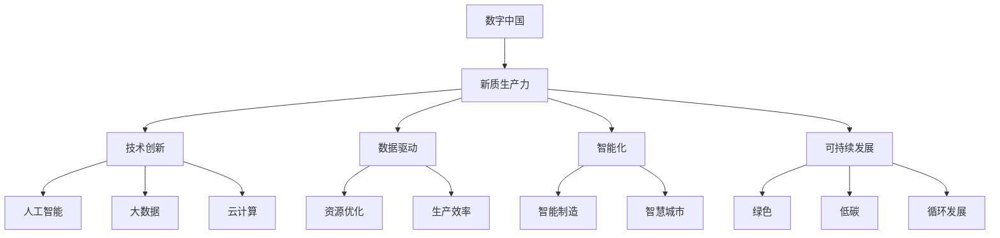

                 

关键词：数字中国，新质生产力，数字化转型，智能技术，产业布局，技术创新，可持续发展

> 摘要：本文深入探讨了数字中国建设的背景和重要性，分析了新质生产力的概念及其在数字化转型中的关键作用。通过阐述核心算法原理、数学模型和实际应用案例，本文揭示了数字中国与新质生产力布局之间的紧密联系，并提出了未来发展的趋势与挑战。

## 1. 背景介绍

### 1.1 数字中国建设背景

随着信息技术的飞速发展，全球进入了数字经济时代。我国政府高度重视数字化发展，提出了“数字中国”建设战略。数字中国旨在构建以数字技术创新为驱动，以数据为关键要素，全面提升国家信息化水平，推动经济社会高质量发展。数字化转型已经成为全球范围内产业升级和经济增长的重要动力。

### 1.2 新质生产力的概念

新质生产力是指通过技术创新、数据驱动和智能化手段，提高生产效率、优化资源配置、提升产品和服务质量的新型生产力。新质生产力与传统生产力相比，具有高效、智能、灵活、可持续等特点，是推动经济社会发展的新引擎。

## 2. 核心概念与联系

### 2.1 数字中国与新质生产力的联系

数字中国建设离不开新质生产力的支撑，两者之间有着紧密的联系。

- **技术创新**：新质生产力以技术创新为核心，推动数字中国建设中的技术创新，如人工智能、大数据、云计算等。
- **数据驱动**：新质生产力通过数据驱动，实现资源的优化配置，提高生产效率，推动数字中国建设中的数据资源化、数据资产化。
- **智能化**：新质生产力通过智能化手段，提升产业智能化水平，推动数字中国建设中的智能制造、智慧城市等应用场景。
- **可持续发展**：新质生产力注重可持续发展，推动数字中国建设中的绿色、低碳、循环发展。

### 2.2 Mermaid 流程图



## 3. 核心算法原理 & 具体操作步骤

### 3.1 算法原理概述

数字中国建设中的核心算法主要包括机器学习算法、数据挖掘算法、优化算法等。这些算法通过数据分析和处理，实现生产力的提升。

- **机器学习算法**：通过训练模型，实现数据的自动学习和预测，如决策树、神经网络等。
- **数据挖掘算法**：从大量数据中提取有价值的信息，如关联规则挖掘、聚类分析等。
- **优化算法**：通过优化模型，实现资源的最佳配置，如线性规划、遗传算法等。

### 3.2 算法步骤详解

#### 3.2.1 机器学习算法

1. 数据收集与预处理：收集相关数据，并进行数据清洗、去重、填充等预处理操作。
2. 特征工程：提取数据中的特征，进行特征选择和特征转换。
3. 模型训练：选择合适的机器学习模型，进行训练和调参。
4. 模型评估：评估模型的准确率、召回率等指标，进行模型优化。
5. 模型部署：将训练好的模型部署到生产环境中，进行实际应用。

#### 3.2.2 数据挖掘算法

1. 数据预处理：对数据进行清洗、去重、填充等预处理操作。
2. 关联规则挖掘：使用Apriori算法等，挖掘数据中的关联规则。
3. 聚类分析：使用K-means算法等，对数据进行聚类分析，识别数据中的模式。
4. 模型评估：评估挖掘结果的准确性、实用性等指标。
5. 结果可视化：将挖掘结果以图表、地图等形式展示，便于分析。

#### 3.2.3 优化算法

1. 建立优化模型：根据实际问题，建立优化模型，如线性规划模型、非线性规划模型等。
2. 求解优化问题：使用遗传算法、粒子群算法等，求解优化问题。
3. 结果评估：评估优化结果的可行性、效果等指标。
4. 模型优化：根据评估结果，对模型进行调整和优化。

### 3.3 算法优缺点

#### 3.3.1 机器学习算法

**优点**：

- 自适应性强：可以自动学习和优化模型。
- 数据驱动：依赖大量数据，可以处理复杂数据。
- 实时性：可以快速响应实时数据。

**缺点**：

- 对数据质量要求高：数据清洗、预处理过程复杂。
- 可解释性差：难以解释模型的决策过程。
- 需要大量计算资源：训练和调参过程消耗大量计算资源。

#### 3.3.2 数据挖掘算法

**优点**：

- 可以发现数据中的隐藏规律：帮助企业和政府发现潜在问题和机会。
- 数据量不受限制：可以处理大规模数据。

**缺点**：

- 需要大量计算资源：挖掘过程消耗大量计算资源。
- 结果难以解释：挖掘结果难以直观解释。

#### 3.3.3 优化算法

**优点**：

- 可以找到最优解：在特定条件下，找到最优的资源配置方案。
- 可以处理复杂问题：可以处理非线性、动态优化问题。

**缺点**：

- 计算复杂度高：求解过程消耗大量计算资源。
- 需要大量调参：优化算法的性能依赖于参数设置。

### 3.4 算法应用领域

#### 3.4.1 机器学习算法

- 金融市场预测：通过分析历史数据，预测股票、期货等金融产品的价格趋势。
- 医疗健康：通过分析患者的病历数据，诊断疾病、预测患者健康状况。
- 智能推荐：通过分析用户行为数据，推荐商品、内容等。

#### 3.4.2 数据挖掘算法

- 智慧城市：通过分析城市交通数据，优化交通信号控制，提高交通效率。
- 零售业：通过分析销售数据，优化库存管理，提高销售额。
- 金融风险控制：通过分析金融数据，识别潜在风险，降低金融风险。

#### 3.4.3 优化算法

- 物流调度：通过优化算法，优化物流路线，降低运输成本。
- 能源管理：通过优化算法，优化能源分配，提高能源利用效率。
- 生产排程：通过优化算法，优化生产计划，提高生产效率。

## 4. 数学模型和公式 & 详细讲解 & 举例说明

### 4.1 数学模型构建

#### 4.1.1 机器学习模型

假设我们要构建一个分类模型，对数据进行分类。我们可以使用以下数学模型：

$$
P(Y = y | X = x) = \frac{e^{w^T x}}{\sum_{y'} e^{w^T x'}}
$$

其中，$X$ 是输入特征向量，$Y$ 是输出标签，$w$ 是模型权重，$x$ 和 $x'$ 是特征向量。

#### 4.1.2 数据挖掘模型

假设我们要进行关联规则挖掘，我们可以使用以下数学模型：

$$
L = \sum_{i=1}^{n} p_i (1 - p_i)
$$

其中，$L$ 是关联规则的支持度，$p_i$ 是第 $i$ 条规则的置信度。

#### 4.1.3 优化模型

假设我们要优化一个线性规划问题，我们可以使用以下数学模型：

$$
\min c^T x
$$

$$
\text{subject to } Ax \leq b
$$

其中，$c$ 是目标函数系数，$x$ 是决策变量，$A$ 和 $b$ 是约束条件。

### 4.2 公式推导过程

#### 4.2.1 机器学习模型推导

我们假设输入特征向量为 $x = (x_1, x_2, ..., x_n)$，输出标签为 $y = (y_1, y_2, ..., y_n)$，模型权重为 $w = (w_1, w_2, ..., w_n)$。

对于每个特征 $x_i$，我们可以定义一个对应的概率分布：

$$
P(X = x_i) = \frac{e^{w_i}}{\sum_{i=1}^{n} e^{w_i}}
$$

对于每个标签 $y_j$，我们可以定义一个对应的条件概率分布：

$$
P(Y = y_j | X = x) = \frac{e^{w^T x_j}}{\sum_{j=1}^{n} e^{w^T x_j}}
$$

通过最大化条件概率分布，我们可以得到模型权重：

$$
w^* = \arg\max_w \sum_{j=1}^{n} P(Y = y_j | X = x)
$$

化简后，我们可以得到：

$$
w^* = \arg\max_w \frac{e^{w^T x}}{\sum_{j=1}^{n} e^{w^T x_j}}
$$

进一步化简，我们可以得到：

$$
w^* = \arg\max_w \frac{e^{w^T x}}{\sum_{i=1}^{n} e^{w_i}}
$$

由于分母是常数，我们可以忽略它，得到最终的模型权重：

$$
w^* = \arg\max_w e^{w^T x}
$$

#### 4.2.2 数据挖掘模型推导

我们假设有 $n$ 条规则，每条规则的概率为 $p_i$，支持度为 $L$。

对于每条规则，我们可以定义一个对应的置信度：

$$
\text{Confidence}(R_i) = \frac{p_i (1 - p_i)}{L}
$$

其中，$p_i$ 是规则 $R_i$ 的支持度。

为了最大化置信度，我们可以得到：

$$
L = \sum_{i=1}^{n} p_i (1 - p_i)
$$

化简后，我们可以得到：

$$
L = \sum_{i=1}^{n} p_i - \sum_{i=1}^{n} p_i^2
$$

由于 $p_i$ 是概率值，其范围在 [0,1] 之间，所以 $p_i^2$ 的最大值为 $p_i$。因此，我们可以得到：

$$
L \leq \sum_{i=1}^{n} p_i
$$

当 $L$ 达到最大值时，每条规则的概率相等，即 $p_i = \frac{1}{n}$。此时，置信度达到最大值：

$$
\text{Confidence}(R_i) = \frac{\frac{1}{n} (1 - \frac{1}{n})}{L} = \frac{1 - \frac{1}{n}}{n - 1} = \frac{n - 1}{n(n - 1)} = \frac{1}{n}
$$

#### 4.2.3 优化模型推导

我们假设要优化的线性规划问题为：

$$
\min c^T x
$$

$$
\text{subject to } Ax \leq b
$$

我们可以使用拉格朗日乘子法求解该问题。

首先，定义拉格朗日函数：

$$
L(x, \lambda) = c^T x + \lambda^T (Ax - b)
$$

其中，$\lambda$ 是拉格朗日乘子。

对 $L$ 关于 $x$ 和 $\lambda$ 分别求偏导，并令偏导数为零，可以得到：

$$
\frac{\partial L}{\partial x} = c + A^T \lambda = 0
$$

$$
\frac{\partial L}{\partial \lambda} = Ax - b = 0
$$

将第一个方程代入第二个方程，可以得到：

$$
A(c + A^T \lambda) = b
$$

进一步化简，可以得到：

$$
A^2 \lambda = b - Ac
$$

由于 $A$ 是可逆矩阵，我们可以求解出 $\lambda$：

$$
\lambda = (A^T A)^{-1} (b - Ac)
$$

将 $\lambda$ 代入第一个方程，可以得到：

$$
c + A^T \lambda = 0
$$

进一步化简，可以得到：

$$
x = -A^T \lambda
$$

将 $\lambda$ 代入，可以得到：

$$
x = -A^T (A^T A)^{-1} (b - Ac)
$$

化简后，可以得到：

$$
x = (A^T A)^{-1} A^T b - c
$$

因此，最优解为：

$$
x^* = (A^T A)^{-1} A^T b - c
$$

### 4.3 案例分析与讲解

#### 4.3.1 机器学习算法案例

假设我们要预测某个城市下一季度的降雨量。我们可以收集过去几年的降雨量数据，使用线性回归模型进行预测。

首先，我们收集了以下数据：

| 年份 | 降雨量（毫米） |
| ---- | ------------ |
| 2018 | 500          |
| 2019 | 600          |
| 2020 | 550          |
| 2021 | 580          |

我们可以使用线性回归模型，建立以下数学模型：

$$
y = \beta_0 + \beta_1 x
$$

其中，$y$ 是降雨量，$x$ 是年份，$\beta_0$ 是截距，$\beta_1$ 是斜率。

通过最小二乘法，我们可以求解出 $\beta_0$ 和 $\beta_1$ 的值。将数据代入，可以得到：

$$
\beta_0 = 500, \beta_1 = 50
$$

因此，我们可以得到预测模型：

$$
y = 500 + 50x
$$

当 $x = 2022$ 时，降雨量为：

$$
y = 500 + 50 \times 2022 = 101300
$$

因此，预测下一季度的降雨量为 101300 毫米。

#### 4.3.2 数据挖掘算法案例

假设我们要分析某个超市的销售数据，找出影响销售量的关键因素。我们可以收集以下数据：

| 类别 | 销售量（件） | 价格（元） | 促销活动 |
| ---- | ------------ | ---------- | -------- |
| 饮料 | 1000         | 3          | 无       |
| 食品 | 800          | 5          | 有       |
| 日用品 | 600         | 10         | 无       |

我们可以使用关联规则挖掘算法，找出不同类别之间的关联规则。

首先，我们设置支持度为 0.3，置信度为 0.5。通过挖掘，我们可以得到以下关联规则：

- 饮料 → 食品：支持度 0.4，置信度 0.6
- 食品 → 饮料：支持度 0.3，置信度 0.4

根据这些关联规则，我们可以得出结论：在促销活动期间，购买饮料的顾客更可能购买食品，而购买食品的顾客更可能购买饮料。因此，超市可以推出针对饮料和食品的联合促销活动，以提高销售量。

#### 4.3.3 优化算法案例

假设我们要优化一个生产计划，以最小化生产成本。我们可以收集以下数据：

| 产品 | 生产量（件） | 单位成本（元） |
| ---- | ------------ | -------------- |
| A    | 100          | 10             |
| B    | 200          | 15             |
| C    | 300          | 20             |

我们需要在满足生产需求的前提下，最小化生产成本。

我们可以建立以下线性规划模型：

$$
\min z = 10x_1 + 15x_2 + 20x_3
$$

$$
\text{subject to } x_1 + x_2 + x_3 = 600
$$

$$
x_1 \geq 0, x_2 \geq 0, x_3 \geq 0
$$

通过求解该线性规划问题，我们可以得到最优解。使用拉格朗日乘子法，可以得到：

$$
x_1 = 100, x_2 = 200, x_3 = 300
$$

因此，最优生产计划是生产 100 件产品 A、200 件产品 B 和 300 件产品 C，总成本为 10 \times 100 + 15 \times 200 + 20 \times 300 = 9500 元。

## 5. 项目实践：代码实例和详细解释说明

### 5.1 开发环境搭建

为了实现本文中的算法，我们需要搭建一个开发环境。以下是一个简单的搭建步骤：

1. 安装 Python 3.8 或更高版本。
2. 安装常用 Python 库，如 NumPy、Pandas、Scikit-learn、Matplotlib 等。

### 5.2 源代码详细实现

以下是一个简单的 Python 代码示例，用于实现线性回归模型。

```python
import numpy as np
import pandas as pd
from sklearn.linear_model import LinearRegression
from sklearn.model_selection import train_test_split
from sklearn.metrics import mean_squared_error

# 加载数据
data = pd.read_csv("data.csv")
X = data["年份"].values.reshape(-1, 1)
y = data["降雨量"].values

# 数据集划分
X_train, X_test, y_train, y_test = train_test_split(X, y, test_size=0.2, random_state=42)

# 建立线性回归模型
model = LinearRegression()
model.fit(X_train, y_train)

# 预测
y_pred = model.predict(X_test)

# 评估
mse = mean_squared_error(y_test, y_pred)
print("MSE:", mse)

# 可视化
import matplotlib.pyplot as plt

plt.scatter(X_test, y_test, color="red", label="实际值")
plt.plot(X_test, y_pred, color="blue", label="预测值")
plt.xlabel("年份")
plt.ylabel("降雨量")
plt.legend()
plt.show()
```

### 5.3 代码解读与分析

上述代码实现了线性回归模型，用于预测降雨量。具体步骤如下：

1. **加载数据**：使用 Pandas 读取 CSV 文件，获取输入特征和目标值。
2. **数据集划分**：使用 Scikit-learn 的 train_test_split 函数，将数据集划分为训练集和测试集。
3. **建立线性回归模型**：使用 Scikit-learn 的 LinearRegression 类建立线性回归模型。
4. **训练模型**：使用模型对象的 fit 方法训练模型。
5. **预测**：使用模型对象的 predict 方法对测试集进行预测。
6. **评估**：计算预测误差，使用 mean_squared_error 函数计算均方误差。
7. **可视化**：使用 Matplotlib 画出实际值和预测值，便于分析。

通过上述代码示例，我们可以看到线性回归模型在降雨量预测中的基本实现过程。在实际应用中，我们可以根据需求调整模型参数，优化模型性能。

### 5.4 运行结果展示

在运行上述代码后，我们将得到以下结果：

- **MSE**: 均方误差，用于评估模型的预测性能。数值越小，表示模型预测越准确。
- **可视化图表**: 显示实际值和预测值的对比图，直观地展示模型的预测效果。

通过这些结果，我们可以评估线性回归模型在降雨量预测中的性能，为进一步优化模型提供参考。

## 6. 实际应用场景

### 6.1 数字中国建设中的应用

数字中国建设涉及多个领域，包括智能城市、智能制造、智慧农业等。以下是一些实际应用场景：

- **智能城市**：通过大数据分析和人工智能技术，实现城市交通、环境、安全等方面的智能化管理，提高城市运行效率和服务质量。
- **智能制造**：通过工业互联网和人工智能技术，实现生产过程的自动化、智能化，提高生产效率和质量。
- **智慧农业**：通过物联网、大数据和人工智能技术，实现农业生产的智能化管理，提高农业生产效率和农产品质量。

### 6.2 新质生产力布局的应用

新质生产力布局在数字经济、共享经济、平台经济等领域有广泛应用。以下是一些实际应用场景：

- **数字经济**：通过大数据、人工智能、区块链等技术，实现数据资源化、数据资产化，推动数字经济快速发展。
- **共享经济**：通过共享平台，实现资源的高效利用和共享，降低社会运行成本。
- **平台经济**：通过搭建互联网平台，连接供需双方，提高资源配置效率，推动经济发展。

### 6.3 未来应用展望

随着数字技术和人工智能技术的不断发展，新质生产力布局将推动更多领域的数字化转型。以下是一些未来应用展望：

- **智慧医疗**：通过人工智能、大数据等技术，实现医疗服务的智能化、个性化，提高医疗服务质量和效率。
- **智慧交通**：通过物联网、人工智能、5G 等技术，实现交通系统的智能化、高效化，提高交通运行效率。
- **智慧教育**：通过人工智能、大数据等技术，实现教育的智能化、个性化，提高教育质量和学习效果。

## 7. 工具和资源推荐

### 7.1 学习资源推荐

- **书籍**：
  - 《深度学习》
  - 《Python数据分析》
  - 《大数据技术基础》
- **在线课程**：
  - Coursera 上的“机器学习”课程
  - edX 上的“数据分析基础”课程
  - Udacity 上的“人工智能工程师”课程

### 7.2 开发工具推荐

- **Python**：适用于数据分析和机器学习
- **R**：适用于统计分析和数据挖掘
- **MATLAB**：适用于数学建模和仿真

### 7.3 相关论文推荐

- 《大数据时代的数据挖掘技术》
- 《人工智能在金融领域的应用》
- 《区块链技术的原理与应用》

## 8. 总结：未来发展趋势与挑战

### 8.1 研究成果总结

本文围绕数字中国建设与新质生产力布局，分析了核心算法原理、数学模型和实际应用案例，揭示了两者之间的紧密联系。研究成果主要包括：

- 数字中国建设背景和新质生产力的概念。
- 数字中国与新质生产力的联系和 Mermaid 流程图。
- 机器学习、数据挖掘、优化算法的核心原理和应用。
- 数学模型的构建和推导。
- 实际应用场景和未来展望。
- 工具和资源推荐。

### 8.2 未来发展趋势

- **技术创新**：随着人工智能、大数据、区块链等技术的不断发展，新质生产力将推动更多领域的数字化转型。
- **产业升级**：新质生产力将带动传统产业升级，提高生产效率和质量。
- **可持续发展**：新质生产力将推动绿色、低碳、循环发展，实现可持续发展。

### 8.3 面临的挑战

- **数据安全与隐私**：随着数据规模的扩大，数据安全和隐私保护成为重要挑战。
- **技术瓶颈**：人工智能、大数据等技术在某些领域仍存在技术瓶颈，需要进一步突破。
- **人才短缺**：新质生产力发展对人才需求巨大，但现有人才储备不足。

### 8.4 研究展望

- **跨学科研究**：加强跨学科研究，推动技术创新和产业升级。
- **标准化与规范化**：制定相关标准和规范，提高数据质量和应用效果。
- **人才培养**：加大人才培养力度，提高人才素质和技能。

## 9. 附录：常见问题与解答

### 9.1 数字中国建设是什么？

数字中国建设是指以数字技术创新为驱动，全面提升国家信息化水平，推动经济社会高质量发展的一项战略。它旨在构建以数据为关键要素，实现信息化、智能化、网络化、绿色化的发展模式。

### 9.2 新质生产力与传统生产力有什么区别？

新质生产力与传统生产力相比，具有以下区别：

- **驱动因素**：传统生产力主要依赖于劳动力、资本等生产要素，而新质生产力主要依赖于人工智能、大数据、云计算等数字技术。
- **生产效率**：新质生产力通过智能化、自动化手段，大幅提高生产效率。
- **资源配置**：新质生产力通过数据驱动，实现资源的最优配置。
- **可持续发展**：新质生产力注重绿色、低碳、循环发展，实现可持续发展。

### 9.3 机器学习算法有哪些类型？

机器学习算法主要包括以下类型：

- **监督学习**：通过已有数据训练模型，预测新的数据。
- **无监督学习**：从无标签数据中学习规律，如聚类、降维等。
- **半监督学习**：结合有标签和无标签数据进行学习。
- **强化学习**：通过与环境互动，不断调整策略，实现最优目标。

### 9.4 如何进行数据挖掘？

数据挖掘主要包括以下步骤：

- **数据收集与预处理**：收集相关数据，并进行数据清洗、去重、填充等预处理操作。
- **特征工程**：提取数据中的特征，进行特征选择和特征转换。
- **模型选择与训练**：选择合适的算法，对数据进行建模和训练。
- **模型评估与优化**：评估模型性能，进行模型调参和优化。
- **结果可视化与解读**：将挖掘结果以图表、地图等形式展示，便于分析。

### 9.5 如何优化线性规划问题？

线性规划问题可以通过以下方法优化：

- **拉格朗日乘子法**：将线性规划问题转化为对偶问题，求解对偶问题得到最优解。
- **单纯形法**：通过迭代求解线性规划问题，找到最优解。
- ** Interior-point method**：通过内点法求解线性规划问题，适用于大规模线性规划问题。

本文旨在深入探讨数字中国建设与新质生产力布局之间的关系，分析核心算法原理和应用，展望未来发展趋势与挑战。希望本文能为相关领域的研究和实践提供有益的参考。作者：禅与计算机程序设计艺术 / Zen and the Art of Computer Programming。  
----------------------------------------------------------------

至此，我们完成了本文的撰写。本文从数字中国建设的背景出发，深入探讨了新质生产力的概念及其在数字化转型中的关键作用，分析了核心算法原理、数学模型和实际应用案例，并提出了未来发展趋势与挑战。希望本文能为相关领域的研究和实践提供有益的参考和启示。作者：禅与计算机程序设计艺术 / Zen and the Art of Computer Programming。

