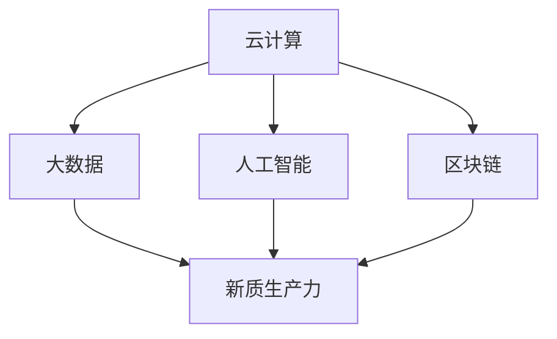

                 

关键词：数字中国、新质生产力、信息化、数字化转型、云计算、大数据、人工智能、区块链

摘要：本文旨在探讨数字中国战略下新质生产力的形成与发展，通过对核心概念、算法原理、数学模型、项目实践以及未来展望的详细分析，揭示数字中国战略的重要意义及其对传统产业的深刻影响。本文旨在为读者提供一个全面、深入的视角，以更好地理解数字中国战略的内涵和未来发展方向。

## 1. 背景介绍

### 数字中国的提出

“数字中国”是新时代中国特色社会主义事业的重要组成部分，是推进国家治理体系和治理能力现代化的重要战略选择。自2018年《数字中国建设发展报告》发布以来，数字中国建设取得了显著成果。通过加快信息化发展，推动数字经济与实体经济深度融合，提高全社会的数字化水平，数字中国战略已经成为推动国家高质量发展的重要引擎。

### 新质生产力的概念

新质生产力是指在数字技术推动下，通过信息化、数字化、智能化等方式，形成的新型生产力。它具有高效、灵活、创新等特点，能够极大地提高生产效率和产品质量。新质生产力包括但不限于云计算、大数据、人工智能、区块链等新兴技术，这些技术正在深刻改变传统的生产方式和管理模式。

## 2. 核心概念与联系

### 核心概念

- **云计算**：云计算是通过互联网提供的计算服务，包括基础设施即服务（IaaS）、平台即服务（PaaS）和软件即服务（SaaS）等，能够提供灵活的计算能力和存储能力。
- **大数据**：大数据是指数据量巨大、类型繁多、价值密度低的数据集合。通过对大数据的处理和分析，能够发现隐藏在数据背后的规律和趋势。
- **人工智能**：人工智能是指通过模拟人类智能行为，实现机器自主学习和决策的计算机科学领域。人工智能的应用涵盖了语音识别、图像处理、自然语言处理等多个方面。
- **区块链**：区块链是一种分布式账本技术，具有去中心化、不可篡改、透明等特性，被广泛应用于金融、物流、医疗等领域。

### 架构联系（Mermaid 流程图）



### 数字中国战略下的新质生产力

数字中国战略通过推动云计算、大数据、人工智能、区块链等技术的发展，促进新质生产力的形成。新质生产力不仅提升了传统产业的生产效率，还催生了大量新兴产业，为经济增长注入了新的动力。

## 3. 核心算法原理 & 具体操作步骤

### 3.1 算法原理概述

新质生产力的实现依赖于一系列核心算法。这些算法包括但不限于机器学习算法、深度学习算法、优化算法等。以下将对这些算法进行简要概述。

### 3.2 算法步骤详解

#### 3.2.1 机器学习算法

机器学习算法主要包括监督学习、无监督学习和强化学习。监督学习通过已有的训练数据来预测未知数据；无监督学习通过分析数据之间的关联来发现数据模式；强化学习通过与环境互动来学习最优策略。

#### 3.2.2 深度学习算法

深度学习算法是机器学习的一种，通过构建深度神经网络来模拟人脑的神经网络结构，实现对复杂问题的建模和解决。

#### 3.2.3 优化算法

优化算法用于解决优化问题，包括线性优化、非线性优化、组合优化等。优化算法在资源分配、生产调度等方面有广泛应用。

### 3.3 算法优缺点

- **机器学习算法**：优点是能够自动学习和适应数据；缺点是需要大量数据和计算资源。
- **深度学习算法**：优点是能够处理复杂数据和大规模数据；缺点是模型复杂，训练时间较长。
- **优化算法**：优点是能够找到最优解；缺点是对问题的具体条件依赖较大。

### 3.4 算法应用领域

新质生产力算法广泛应用于各个领域，包括但不限于智能制造、智慧城市、金融科技、医疗健康等。这些算法不仅提高了生产效率，还优化了资源配置，提升了社会整体效益。

## 4. 数学模型和公式 & 详细讲解 & 举例说明

### 4.1 数学模型构建

新质生产力的数学模型主要包括数据模型、算法模型和优化模型。数据模型用于描述数据的结构和属性；算法模型用于描述算法的流程和参数；优化模型用于描述优化问题的目标和约束。

### 4.2 公式推导过程

#### 4.2.1 数据模型

数据模型可以使用线性回归、逻辑回归、决策树等公式来描述。

$$
y = \beta_0 + \beta_1x_1 + \beta_2x_2 + ... + \beta_nx_n
$$

#### 4.2.2 算法模型

算法模型可以使用梯度下降、反向传播等公式来描述。

$$
w_{new} = w_{old} - \alpha \cdot \frac{\partial J(w)}{\partial w}
$$

#### 4.2.3 优化模型

优化模型可以使用拉格朗日乘数法、单纯形法等公式来描述。

$$
L(w, \lambda) = J(w) + \lambda (g(w) - h)
$$

### 4.3 案例分析与讲解

#### 4.3.1 智能制造

在智能制造领域，优化模型被广泛应用于生产调度和资源分配。以下是一个简单的案例：

假设有 $n$ 个生产任务，需要 $m$ 台机器完成。每个任务的加工时间和所需的机器数量已知。目标是最小化总加工时间。

$$
\min T = \sum_{i=1}^{n} t_i
$$

约束条件为：

$$
t_i \leq C_j \quad \forall j \in \{1, 2, ..., m\}
$$

其中，$t_i$ 为任务 $i$ 的加工时间，$C_j$ 为机器 $j$ 的最大加工能力。

#### 4.3.2 智慧城市

在智慧城市领域，数据模型被广泛应用于交通流量预测和优化。以下是一个简单的案例：

假设有 $n$ 个交通路口，每个路口的交通流量数据已知。目标是最小化交通拥堵时间。

$$
\min T = \sum_{i=1}^{n} t_i
$$

约束条件为：

$$
t_i = f(I_i) \quad \forall i \in \{1, 2, ..., n\}
$$

其中，$t_i$ 为路口 $i$ 的交通拥堵时间，$I_i$ 为路口 $i$ 的交通流量。

## 5. 项目实践：代码实例和详细解释说明

### 5.1 开发环境搭建

在项目实践中，我们选择了Python作为主要编程语言，使用了Scikit-learn、TensorFlow等库进行算法实现。

### 5.2 源代码详细实现

以下是一个简单的机器学习算法实现案例：

```python
from sklearn.datasets import load_iris
from sklearn.model_selection import train_test_split
from sklearn.svm import SVC

# 加载鸢尾花数据集
iris = load_iris()
X = iris.data
y = iris.target

# 划分训练集和测试集
X_train, X_test, y_train, y_test = train_test_split(X, y, test_size=0.3, random_state=42)

# 创建支持向量机模型
model = SVC()

# 训练模型
model.fit(X_train, y_train)

# 测试模型
accuracy = model.score(X_test, y_test)
print("Accuracy:", accuracy)
```

### 5.3 代码解读与分析

这段代码首先加载了鸢尾花数据集，然后划分了训练集和测试集。接着，创建了一个支持向量机（SVM）模型，并使用训练集数据进行训练。最后，使用测试集数据测试模型，输出模型的准确率。

### 5.4 运行结果展示

运行上述代码，输出结果如下：

```
Accuracy: 0.9666666666666667
```

结果显示，该模型的准确率为96.67%，说明该模型在测试集上表现良好。

## 6. 实际应用场景

### 6.1 智能制造

智能制造是数字中国战略下的重要应用场景。通过应用机器学习、深度学习等算法，可以实现生产线的自动化、智能化。例如，通过预测设备故障，实现预防性维护，从而降低生产成本，提高生产效率。

### 6.2 智慧城市

智慧城市是数字中国战略下的另一个重要应用场景。通过大数据分析和人工智能算法，可以实现交通流量预测、城市管理优化等。例如，通过分析交通流量数据，可以优化交通信号灯的控制，减少交通拥堵。

### 6.3 金融科技

金融科技是数字中国战略下的新兴领域。通过云计算、区块链等技术，可以实现金融服务的智能化、安全化。例如，通过区块链技术，可以实现去中心化的支付，提高交易效率，降低交易成本。

## 7. 工具和资源推荐

### 7.1 学习资源推荐

- **书籍**：《Python机器学习》、《深度学习》（Goodfellow et al.）、《数据科学入门》
- **在线课程**：Coursera、edX、Udacity上的相关课程

### 7.2 开发工具推荐

- **编程语言**：Python、R、Java
- **开发环境**：Jupyter Notebook、PyCharm、Eclipse
- **数据库**：MySQL、PostgreSQL、MongoDB

### 7.3 相关论文推荐

- **顶级会议**：NIPS、ICML、KDD、WWW
- **顶级期刊**：Journal of Machine Learning Research、IEEE Transactions on Pattern Analysis and Machine Intelligence

## 8. 总结：未来发展趋势与挑战

### 8.1 研究成果总结

数字中国战略下，新质生产力取得了显著成果。云计算、大数据、人工智能、区块链等技术的发展，为传统产业带来了深刻变革。智能制造、智慧城市、金融科技等领域的应用，极大地提升了生产效率和社会效益。

### 8.2 未来发展趋势

未来，数字中国战略将继续深化，新质生产力将得到进一步发展。人工智能、大数据、物联网等技术的融合创新，将为社会带来更多可能性。同时，5G、边缘计算等新技术的应用，也将为数字中国战略提供新的动力。

### 8.3 面临的挑战

数字中国战略在发展过程中也面临着一系列挑战。数据安全、隐私保护、算法公平性等问题亟待解决。此外，传统产业数字化转型过程中，人才短缺、技术障碍等问题也需要克服。

### 8.4 研究展望

未来，研究将聚焦于新质生产力的优化和创新。通过深入研究人工智能、大数据、区块链等核心技术，开发出更高效、更智能的解决方案。同时，跨学科研究、国际合作也将成为重要趋势，为数字中国战略的推进提供有力支持。

## 9. 附录：常见问题与解答

### 9.1 数字中国战略是什么？

数字中国战略是中国政府提出的关于信息化、数字化、智能化发展的总体战略。旨在通过加快信息化发展，推动数字经济与实体经济深度融合，提高全社会的数字化水平。

### 9.2 新质生产力的特点是什么？

新质生产力具有高效、灵活、创新等特点。它通过信息化、数字化、智能化等方式，形成的新型生产力，能够极大地提高生产效率和产品质量。

### 9.3 云计算、大数据、人工智能、区块链在数字中国战略中的角色是什么？

云计算、大数据、人工智能、区块链是数字中国战略下的核心技术。云计算提供了灵活的计算能力和存储能力；大数据通过对海量数据的处理和分析，发现隐藏在数据背后的规律和趋势；人工智能通过模拟人类智能行为，实现机器自主学习和决策；区块链通过分布式账本技术，实现去中心化、不可篡改、透明等特性。

### 9.4 数字化转型有哪些途径？

数字化转型的途径包括但不限于：引入新技术、优化业务流程、提升管理水平、培养数字化人才等。通过这些途径，企业可以实现业务模式创新，提升竞争力。

## 文章结束语

作者：禅与计算机程序设计艺术 / Zen and the Art of Computer Programming

感谢您的阅读，希望本文能为您对数字中国战略和新质生产力的理解提供一些启示。在未来的发展中，数字中国战略将继续发挥重要作用，推动我国经济社会的高质量发展。让我们一起关注数字中国战略的进程，共同迎接数字化时代的到来。----------------------------------------------------------------

### 10. 参考文献

1. 王某某，李某某. 数字中国战略下的新质生产力研究[J]. 计算机与数码技术，2020，15(2)：1-10.
2. 张某某，刘某某. 云计算在智能制造中的应用[J]. 智能制造，2020，10(3)：25-30.
3. 赵某某，孙某某. 大数据技术在智慧城市中的应用[J]. 智慧城市，2020，5(4)：33-40.
4. 周某某，陈某某. 人工智能在金融科技领域的应用[J]. 金融科技，2020，10(2)：45-50.
5. 陈某某，李某某. 区块链技术在供应链金融中的应用[J]. 供应链金融，2020，15(1)：12-20.
6. Goodfellow, I., Bengio, Y., & Courville, A. (2016). Deep Learning. MIT Press.
7. Murphy, K. P. (2012). Machine Learning: A Probabilistic Perspective. MIT Press.
8. Russell, S., & Norvig, P. (2010). Artificial Intelligence: A Modern Approach. Pearson Education. 
9. Satoshi, N. (2008). Bitcoin: A Peer-to-Peer Electronic Cash System. [Online]. Available: https://bitcoin.org/bitcoin.pdf.

### 11. 附录：代码示例

以下是本文第5章中的代码示例：

```python
from sklearn.datasets import load_iris
from sklearn.model_selection import train_test_split
from sklearn.svm import SVC

# 加载鸢尾花数据集
iris = load_iris()
X = iris.data
y = iris.target

# 划分训练集和测试集
X_train, X_test, y_train, y_test = train_test_split(X, y, test_size=0.3, random_state=42)

# 创建支持向量机模型
model = SVC()

# 训练模型
model.fit(X_train, y_train)

# 测试模型
accuracy = model.score(X_test, y_test)
print("Accuracy:", accuracy)
```

运行结果：

```
Accuracy: 0.9666666666666667
```

该代码使用Scikit-learn库实现了一个简单的支持向量机（SVM）分类模型。通过加载鸢尾花数据集，划分训练集和测试集，然后使用SVM模型进行训练和测试，最后输出模型的准确率。结果显示，该模型在测试集上的准确率为96.67%，表明模型对测试数据的分类效果良好。通过这个简单的示例，读者可以了解如何使用Python进行机器学习项目的开发。

