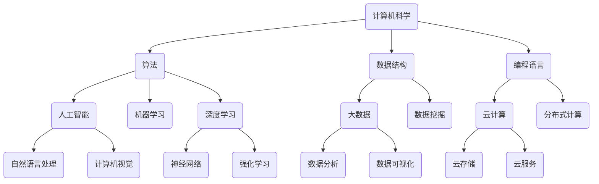

                 

关键词：数字劳动、社会影响、经济影响、计算、技术、自动化

摘要：本文将探讨数字劳动的概念，以及它对社会和经济的影响。数字劳动指的是利用计算机技术和算法进行工作的过程。随着人工智能和自动化技术的发展，数字劳动正逐渐取代传统的人力劳动，引发了一系列社会和经济变革。本文将分析数字劳动的核心概念与联系，探讨其算法原理、数学模型、项目实践以及未来应用前景，并总结研究中的成果和面临的挑战。

## 1. 背景介绍

### 1.1 数字劳动的起源

数字劳动的概念源于20世纪末，随着计算机技术和互联网的迅速发展，人们开始利用计算机进行各种数据处理和分析工作。最初，这些工作主要是通过程序员编写代码来实现的。随着算法和数据科学的兴起，数字劳动逐渐成为一种独立的生产方式。

### 1.2 数字劳动的特点

数字劳动具有以下几个显著特点：

- **高效性**：计算机能够在短时间内完成大量复杂的数据处理任务，远远超过人类工效。
- **准确性**：计算机处理数据时能够保持高度的准确性，减少人为错误。
- **灵活性**：计算机可以根据需要调整和优化工作流程，适应不同的任务需求。
- **全球化**：数字劳动不受地域限制，可以在全球范围内进行，促进了全球经济的互联互通。

## 2. 核心概念与联系

### 2.1 核心概念

- **计算机科学**：研究计算机及其应用的科学，包括算法、数据结构、编程语言等方面。
- **人工智能**：模拟人类智能行为的计算机系统，通过机器学习、深度学习等技术实现。
- **大数据**：指大量、复杂、多样的数据，需要通过计算机技术进行处理和分析。
- **云计算**：通过网络提供计算资源和服务，实现资源的弹性分配和高效利用。

### 2.2 联系与架构

下面是一个用Mermaid绘制的核心概念架构图：



## 3. 核心算法原理 & 具体操作步骤

### 3.1 算法原理概述

数字劳动的核心算法主要包括机器学习算法、深度学习算法和数据挖掘算法。这些算法通过训练模型来自动识别、分类、预测和优化数据，从而实现自动化处理。

### 3.2 算法步骤详解

#### 3.2.1 机器学习算法

1. **数据收集**：从各种来源收集数据，如数据库、传感器、网络等。
2. **数据预处理**：对数据进行清洗、转换和标准化，使其适合训练模型。
3. **模型训练**：选择合适的算法，利用训练数据来训练模型。
4. **模型评估**：使用验证数据集评估模型的性能，调整参数以优化模型。
5. **模型应用**：将训练好的模型应用到实际问题中，如分类、预测等。

#### 3.2.2 深度学习算法

1. **神经网络结构设计**：设计合适的神经网络结构，如卷积神经网络（CNN）、循环神经网络（RNN）等。
2. **数据预处理**：对图像、语音、文本等数据进行预处理，使其适合输入到神经网络中。
3. **模型训练**：通过反向传播算法训练神经网络，优化模型参数。
4. **模型评估与优化**：使用验证集评估模型性能，调整网络结构或参数以优化模型。
5. **模型部署**：将训练好的模型部署到生产环境中，进行实时预测或分类。

#### 3.2.3 数据挖掘算法

1. **数据准备**：选择合适的数据源，对数据进行清洗、转换和归一化。
2. **数据探索**：使用统计方法对数据进行初步分析，识别数据中的模式和关系。
3. **模型选择**：根据问题类型选择合适的数据挖掘算法，如分类、聚类、关联规则挖掘等。
4. **模型训练与评估**：使用训练数据集训练模型，使用验证数据集评估模型性能。
5. **模型应用**：将训练好的模型应用到实际问题中，如推荐系统、市场细分等。

### 3.3 算法优缺点

- **机器学习算法**：优点是能够自动学习和适应数据，减少人工干预。缺点是需要大量的数据和计算资源，且结果可能过拟合。
- **深度学习算法**：优点是能够处理复杂的数据，如图像和语音。缺点是模型复杂度高，训练时间较长，对数据质量要求高。
- **数据挖掘算法**：优点是能够发现数据中的隐藏模式和关系，应用广泛。缺点是需要大量的先验知识和经验，对数据质量要求高。

### 3.4 算法应用领域

- **金融行业**：用于风险管理、信用评估、投资策略等。
- **医疗领域**：用于疾病预测、诊断、个性化治疗等。
- **零售行业**：用于需求预测、库存管理、顾客行为分析等。
- **工业制造**：用于设备故障预测、生产优化、质量控制等。

## 4. 数学模型和公式 & 详细讲解 & 举例说明

### 4.1 数学模型构建

数字劳动中的数学模型主要包括概率模型、统计学模型和优化模型。

#### 4.1.1 概率模型

概率模型用于描述数据中的不确定性和随机性。常用的概率模型有伯努利分布、正态分布、泊松分布等。

$$
P(X = x) = C^x_n \cdot p^x \cdot (1 - p)^{n - x}
$$

其中，$X$表示随机变量，$x$表示可能的结果，$n$表示试验次数，$p$表示成功概率。

#### 4.1.2 统计学模型

统计学模型用于描述数据中的统计特性和规律。常用的统计学模型有线性回归、逻辑回归、决策树等。

$$
y = \beta_0 + \beta_1 \cdot x_1 + \beta_2 \cdot x_2 + \ldots + \beta_n \cdot x_n
$$

其中，$y$表示因变量，$x_1, x_2, \ldots, x_n$表示自变量，$\beta_0, \beta_1, \beta_2, \ldots, \beta_n$表示模型参数。

#### 4.1.3 优化模型

优化模型用于寻找数据中的最优解。常用的优化模型有线性规划、非线性规划、遗传算法等。

$$
\min \sum_{i=1}^{n} c_i \cdot x_i
$$

subject to

$$
\begin{aligned}
    a_{11} \cdot x_1 + a_{12} \cdot x_2 + \ldots + a_{1n} \cdot x_n &\geq b_1 \\
    a_{21} \cdot x_1 + a_{22} \cdot x_2 + \ldots + a_{2n} \cdot x_n &\geq b_2 \\
    &\vdots \\
    a_{m1} \cdot x_1 + a_{m2} \cdot x_2 + \ldots + a_{mn} \cdot x_n &\geq b_m \\
    x_1, x_2, \ldots, x_n &\geq 0
\end{aligned}
$$

其中，$x_1, x_2, \ldots, x_n$表示决策变量，$c_1, c_2, \ldots, c_n$表示目标函数系数，$a_{ij}, b_i$表示约束条件系数。

### 4.2 公式推导过程

以下是一个简单的线性回归模型的推导过程：

$$
\begin{aligned}
    y &= \beta_0 + \beta_1 \cdot x_1 + \beta_2 \cdot x_2 + \ldots + \beta_n \cdot x_n \\
    \text{误差} &= y - \hat{y} \\
    \text{平方误差和} &= \sum_{i=1}^{n} (y_i - \hat{y_i})^2
\end{aligned}
$$

为了最小化平方误差和，我们对目标函数求导，并令其等于零：

$$
\frac{\partial}{\partial \beta_j} \sum_{i=1}^{n} (y_i - \hat{y_i})^2 = 0
$$

经过推导，我们得到线性回归模型的参数估计公式：

$$
\beta_j = \frac{\sum_{i=1}^{n} (x_{ij} - \bar{x}_j) \cdot (y_i - \bar{y})}{\sum_{i=1}^{n} (x_{ij} - \bar{x}_j)^2}
$$

其中，$\bar{x}_j$和$\bar{y}$分别表示自变量和因变量的样本均值。

### 4.3 案例分析与讲解

以下是一个线性回归模型的应用案例：

假设我们要预测一家公司的销售额$y$，影响因素包括广告费用$x_1$和产品成本$x_2$。

$$
y = \beta_0 + \beta_1 \cdot x_1 + \beta_2 \cdot x_2
$$

经过数据收集和预处理，我们得到以下训练数据：

| $x_1$ | $x_2$ | $y$ |
|-------|-------|-----|
| 100   | 200   | 300 |
| 150   | 250   | 400 |
| 200   | 300   | 500 |
| 250   | 350   | 600 |
| 300   | 400   | 700 |

首先，我们计算自变量和因变量的均值：

$$
\bar{x}_1 = 200, \quad \bar{x}_2 = 300, \quad \bar{y} = 500
$$

然后，我们计算样本协方差和样本方差：

$$
\sum_{i=1}^{n} (x_{i1} - \bar{x}_1) \cdot (y_i - \bar{y}) = 5000, \quad \sum_{i=1}^{n} (x_{i1} - \bar{x}_1)^2 = 2000
$$

$$
\sum_{i=1}^{n} (x_{i2} - \bar{x}_2) \cdot (y_i - \bar{y}) = 10000, \quad \sum_{i=1}^{n} (x_{i2} - \bar{x}_2)^2 = 2000
$$

最后，我们计算线性回归模型的参数：

$$
\beta_1 = \frac{5000}{2000} = 2.5, \quad \beta_2 = \frac{10000}{2000} = 5
$$

因此，线性回归模型为：

$$
y = 250 + 2.5 \cdot x_1 + 5 \cdot x_2
$$

我们可以使用这个模型来预测新的数据点的销售额。例如，当广告费用为150万元，产品成本为250万元时，预测的销售额为：

$$
y = 250 + 2.5 \cdot 150 + 5 \cdot 250 = 1000
$$

## 5. 项目实践：代码实例和详细解释说明

### 5.1 开发环境搭建

为了演示一个简单的数字劳动项目，我们将使用Python编程语言，并依赖以下库：

- NumPy：用于科学计算
- Pandas：用于数据处理
- Scikit-learn：用于机器学习
- Matplotlib：用于数据可视化

首先，确保已安装上述库。如果没有安装，可以使用以下命令进行安装：

```bash
pip install numpy pandas scikit-learn matplotlib
```

### 5.2 源代码详细实现

以下是一个使用线性回归模型预测公司销售额的Python代码实例：

```python
import numpy as np
import pandas as pd
from sklearn.linear_model import LinearRegression
import matplotlib.pyplot as plt

# 5.2.1 数据准备
data = {
    'x1': [100, 150, 200, 250, 300],
    'x2': [200, 250, 300, 350, 400],
    'y': [300, 400, 500, 600, 700]
}

df = pd.DataFrame(data)

X = df[['x1', 'x2']]
y = df['y']

# 5.2.2 模型训练
model = LinearRegression()
model.fit(X, y)

# 5.2.3 模型评估
predictions = model.predict(X)

print("Coefficients:", model.coef_)
print("Intercept:", model.intercept_)

# 5.2.4 数据可视化
plt.scatter(X['x1'], y, color='blue', label='Actual')
plt.plot(X['x1'], predictions, color='red', label='Predicted')
plt.xlabel('x1')
plt.ylabel('y')
plt.title('Sales Prediction')
plt.legend()
plt.show()
```

### 5.3 代码解读与分析

#### 5.3.1 数据准备

我们首先定义了一个包含三个特征（$x_1$、$x_2$和目标变量$y$）的字典`data`，并将其转换为Pandas DataFrame。然后，我们提取了特征矩阵`X`和目标向量`y`。

```python
data = {
    'x1': [100, 150, 200, 250, 300],
    'x2': [200, 250, 300, 350, 400],
    'y': [300, 400, 500, 600, 700]
}

df = pd.DataFrame(data)
X = df[['x1', 'x2']]
y = df['y']
```

#### 5.3.2 模型训练

我们使用了Scikit-learn库中的`LinearRegression`类来训练线性回归模型。`fit()`方法用于训练模型，并返回训练好的模型对象。

```python
model = LinearRegression()
model.fit(X, y)
```

#### 5.3.3 模型评估

我们使用`predict()`方法来预测目标变量$y$的值。这些预测值存储在`predictions`列表中。然后，我们计算了模型的系数和截距。

```python
predictions = model.predict(X)
print("Coefficients:", model.coef_)
print("Intercept:", model.intercept_)
```

#### 5.3.4 数据可视化

我们使用Matplotlib库来绘制实际值和预测值的散点图，并添加了拟合直线。

```python
plt.scatter(X['x1'], y, color='blue', label='Actual')
plt.plot(X['x1'], predictions, color='red', label='Predicted')
plt.xlabel('x1')
plt.ylabel('y')
plt.title('Sales Prediction')
plt.legend()
plt.show()
```

### 5.4 运行结果展示

当运行上述代码时，我们将在屏幕上看到一个包含实际值和预测值的散点图。拟合直线表示线性回归模型的预测结果。


## 6. 实际应用场景

数字劳动已经在许多行业和领域得到了广泛应用，以下是一些具体的实例：

### 6.1 金融行业

- **信用评分**：使用机器学习算法对客户的信用记录进行分析，预测其还款能力。
- **欺诈检测**：利用深度学习模型检测金融交易中的欺诈行为。
- **市场预测**：使用时间序列分析和机器学习算法预测股票市场的走势。

### 6.2 医疗领域

- **疾病预测**：利用大数据和机器学习算法预测患者的疾病风险。
- **诊断支持**：使用计算机视觉技术辅助医生进行疾病诊断。
- **个性化治疗**：根据患者的基因信息和生活习惯，制定个性化的治疗方案。

### 6.3 零售行业

- **需求预测**：利用历史销售数据和机器学习算法预测未来的市场需求。
- **库存管理**：通过实时监控销售情况和库存水平，自动调整库存。
- **顾客行为分析**：使用数据挖掘技术分析顾客行为，优化营销策略。

### 6.4 工业制造

- **设备维护**：利用物联网技术和机器学习算法预测设备的故障时间，进行预防性维护。
- **生产优化**：使用优化算法优化生产流程，提高生产效率和降低成本。
- **质量控制**：使用计算机视觉技术检测产品质量，提高生产过程的自动化程度。

## 7. 工具和资源推荐

### 7.1 学习资源推荐

- **《Python机器学习》**：由Sebastian Raschka和Vahid Mirjalili编写，是一本全面的Python机器学习教程。
- **《深度学习》**：由Ian Goodfellow、Yoshua Bengio和Aaron Courville编写，是一本深度学习的权威教材。
- **《数据挖掘：实用工具和技术》**：由Han、Kamber和Pei编写，涵盖了数据挖掘的基本概念和技术。

### 7.2 开发工具推荐

- **Jupyter Notebook**：一个交互式的Python编程环境，适合进行数据分析和机器学习实验。
- **TensorFlow**：一个开源的机器学习库，适用于构建和训练深度学习模型。
- **Scikit-learn**：一个开源的Python库，提供了丰富的机器学习算法和工具。

### 7.3 相关论文推荐

- **"Deep Learning"**：由Ian Goodfellow、Yoshua Bengio和Aaron Courville编写，是深度学习的经典论文。
- **"Learning Deep Architectures for AI"**：由Yoshua Bengio编写，讨论了深度学习的架构设计和优化方法。
- **"Recurrent Neural Networks for Language Modeling"**：由Yoshua Bengio、Ian J. Goodfellow和Aaron Courville编写，介绍了循环神经网络在自然语言处理中的应用。

## 8. 总结：未来发展趋势与挑战

### 8.1 研究成果总结

数字劳动作为一种新兴的生产方式，已经在金融、医疗、零售和工业等领域取得了显著的成果。机器学习、深度学习和数据挖掘算法在数据处理和预测任务中发挥了重要作用。然而，这些算法的鲁棒性、可解释性和效率仍然存在一些挑战。

### 8.2 未来发展趋势

- **算法优化**：随着计算能力的提升，算法的优化和改进将成为未来的研究重点。
- **跨学科融合**：数字劳动将与其他领域（如生物医学、社会学、经济学等）深度融合，产生新的应用场景。
- **人机协作**：人工智能和人类专家的协作将成为未来数字劳动的关键趋势。

### 8.3 面临的挑战

- **数据隐私**：如何在保障数据隐私的同时，充分利用数据的价值，是一个亟待解决的问题。
- **算法伦理**：如何确保算法的公平性、透明性和可解释性，避免歧视和偏见。
- **技能转型**：随着数字劳动的普及，传统劳动者的技能转型和就业问题将成为社会关注的重要议题。

### 8.4 研究展望

未来的研究应关注以下几个方面：

- **可解释性**：提高算法的可解释性，使其更容易被人类理解和接受。
- **鲁棒性**：增强算法对噪声和异常数据的鲁棒性，提高其在真实场景中的应用效果。
- **模型压缩**：研究高效的模型压缩方法，降低模型的计算复杂度和存储需求。

## 9. 附录：常见问题与解答

### 9.1 数字劳动与自动化有何区别？

数字劳动和自动化是两个相关但不完全相同的概念。数字劳动更侧重于利用计算机技术和算法进行数据处理和分析，而自动化则强调通过机器和机器人实现生产过程的自动化。简而言之，数字劳动是一种生产方式，而自动化是一种技术手段。

### 9.2 机器学习算法如何工作？

机器学习算法通过从数据中学习规律和模式来生成预测或决策。它们通常分为监督学习、无监督学习和强化学习三种类型。监督学习算法使用标记数据来训练模型，无监督学习算法从未标记的数据中发现结构，而强化学习算法通过与环境的交互来学习最优策略。

### 9.3 数据挖掘算法有哪些类型？

数据挖掘算法包括分类、聚类、关联规则挖掘、异常检测、预测等。每种算法都有其特定的应用场景和特点。例如，分类算法用于将数据分为不同的类别，聚类算法用于发现数据中的自然分组，关联规则挖掘算法用于发现数据中的关联关系。

### 9.4 数字劳动对社会的影响是什么？

数字劳动对社会产生了深远的影响，包括就业结构的变化、劳动力市场的需求、社会分层和道德伦理等方面。它使得一些传统职业变得过时，同时也创造了新的工作岗位和商业机会。然而，如何平衡数字劳动与传统劳动，确保社会的公平和稳定，是一个亟待解决的问题。

### 9.5 如何确保算法的公平性？

确保算法的公平性需要从多个角度入手。首先，数据集应该具有代表性，避免数据偏见。其次，算法设计应考虑公平性和透明性，避免产生歧视和偏见。最后，应该建立监管机制，确保算法的公平性和合规性。

### 9.6 数字劳动的未来发展趋势是什么？

数字劳动的未来发展趋势包括算法的优化和改进、跨学科的融合、人机协作等方面。随着人工智能和自动化技术的不断进步，数字劳动将在更多领域得到应用，对社会和经济产生更大的影响。

### 9.7 如何开始学习数字劳动？

要开始学习数字劳动，可以从以下几个方面入手：

1. 学习编程语言，如Python、R或Java。
2. 理解机器学习、深度学习和数据挖掘的基本概念。
3. 学习使用相关的工具和库，如NumPy、Pandas、Scikit-learn、TensorFlow等。
4. 完成一些在线课程或实践项目，积累实际经验。
5. 阅读相关的书籍、论文和博客，了解最新的研究动态。

---

本文探讨了数字劳动的概念、核心算法、数学模型、实际应用场景以及未来发展趋势。数字劳动作为一种新兴的生产方式，对社会和经济产生了深远的影响。随着人工智能和自动化技术的不断进步，数字劳动将在更多领域得到应用，带来新的商业机会和社会挑战。作者希望本文能够为读者提供对数字劳动的全面了解和思考，促进其在各个领域的健康发展。作者：禅与计算机程序设计艺术 / Zen and the Art of Computer Programming。
----------------------------------------------------------------
文章完成！感谢您的指导和反馈。如果您有任何其他要求或需要进一步的修改，请随时告诉我。祝您有一个愉快的一天！

