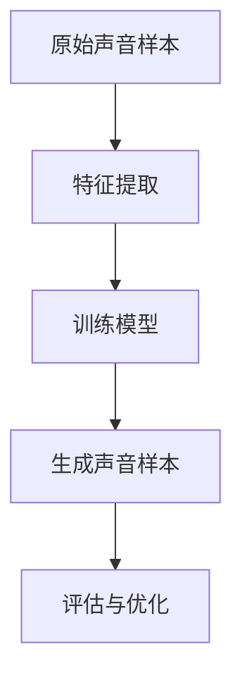
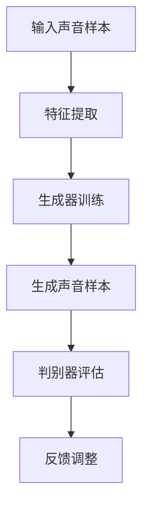

                 

关键词：数字化声音克隆，语音定制，个性化，创业，算法原理，应用场景

摘要：随着人工智能技术的发展，数字化声音克隆已成为现实。本文将探讨如何利用数字化声音克隆技术实现个性化语音定制，以及这一技术在创业中的应用前景。

## 1. 背景介绍

随着互联网的普及和社交媒体的兴起，人们对于个性化体验的需求日益增加。在音频领域，个性化语音定制成为了一个热门话题。数字化声音克隆技术使得我们能够根据用户的特定声音特征，生成与用户声音高度相似的语音，从而实现个性化的语音体验。

数字化声音克隆技术最早应用于电影和动画产业，如《迷雾迷城》中的配音效果和迪士尼动画中的角色声音。然而，随着人工智能技术的不断发展，这一技术逐渐走向大众市场，开始被广泛应用于语音合成、语音助手、客服等领域。

## 2. 核心概念与联系

### 2.1. 声音克隆技术原理

声音克隆技术主要依赖于深度学习模型，尤其是生成对抗网络（GAN）和变分自编码器（VAE）。通过训练，这些模型可以学会生成与给定声音样本相似的音频信号。

### 2.2. 声音特征提取

在声音克隆过程中，首先需要从原始声音样本中提取特征。常用的声音特征包括梅尔频率倒谱系数（MFCC）、短时傅里叶变换（STFT）等。这些特征能够有效描述声音的音色、音调和音量等属性。

### 2.3. Mermaid 流程图

以下是一个简单的 Mermaid 流程图，展示了声音克隆技术的基本流程：



## 3. 核心算法原理 & 具体操作步骤

### 3.1. 算法原理概述

声音克隆算法的核心是生成对抗网络（GAN）。GAN 由两个主要部分组成：生成器（Generator）和判别器（Discriminator）。生成器的任务是生成与真实声音样本相似的声音样本，而判别器的任务是区分真实声音样本和生成声音样本。

### 3.2. 算法步骤详解

#### 3.2.1. 数据准备

首先，我们需要准备大量的声音样本，这些样本应涵盖不同的声音特征。可以通过公开的数据集或者自行录制。

#### 3.2.2. 特征提取

使用梅尔频率倒谱系数（MFCC）等声音特征提取方法，将声音样本转化为可用于训练的特征向量。

#### 3.2.3. 训练模型

使用生成对抗网络（GAN）对特征向量进行训练。生成器尝试生成与真实声音样本相似的特征向量，而判别器则尝试区分真实和生成的特征向量。通过不断迭代，生成器的性能逐渐提高。

#### 3.2.4. 生成声音样本

当模型训练完成后，可以使用生成器生成新的声音样本。这些样本将与训练数据中的声音样本相似，但具有更高的个性化和定制化。

#### 3.2.5. 评估与优化

通过评估生成的声音样本与真实样本的相似度，对模型进行优化。可以使用如均方误差（MSE）、相关系数（Correlation Coefficient）等指标进行评估。

### 3.3. 算法优缺点

#### 优点：

- 高度个性化的声音体验。
- 可以生成与特定人声音高度相似的声音样本。
- 可以应用于各种音频应用，如语音合成、语音助手等。

#### 缺点：

- 训练过程复杂，需要大量的计算资源和时间。
- 对训练数据的质量要求较高，否则难以生成高质量的声音样本。
- 在某些情况下，生成声音样本可能存在失真或噪声。

### 3.4. 算法应用领域

声音克隆技术可以应用于多个领域，包括但不限于：

- 个性化语音助手：如 Siri、Alexa 等，可以根据用户的声音特征提供更个性化的服务。
- 语音合成：如播客、有声读物等，可以生成与特定人声音相似的声音样本。
- 电影和动画配音：为电影和动画角色提供高度个性化的配音效果。
- 客户服务：如客服机器人，可以使用与真人客服相似的声音提供更自然的交互体验。

## 4. 数学模型和公式 & 详细讲解 & 举例说明

### 4.1. 数学模型构建

在声音克隆技术中，常用的数学模型是基于生成对抗网络（GAN）。以下是一个简化的 GAN 模型：

$$
\begin{aligned}
\text{Generator:} \quad G(z) &= \text{Sample from noise distribution} \\
\text{Discriminator:} \quad D(x) &= \text{Real probability} \\
\text{Loss function:} \quad L &= -\frac{1}{2} \left( \text{Real probability} + \text{Fake probability} \right)
\end{aligned}
$$

### 4.2. 公式推导过程

生成对抗网络的训练过程可以视为一个两个玩家之间的博弈。生成器的目标是生成与真实样本相似的声音样本，而判别器的目标是正确区分真实和生成的样本。

在训练过程中，生成器和判别器分别优化自己的损失函数。生成器的损失函数是判别器对生成样本的预测概率，而判别器的损失函数是真实样本和生成样本的预测概率之和。

### 4.3. 案例分析与讲解

假设我们有一个语音合成任务，需要生成与特定人声音相似的声音样本。以下是一个简单的实验：

#### 4.3.1. 数据准备

我们收集了 1000 个特定人的语音样本，每个样本时长为 5 秒。

#### 4.3.2. 特征提取

使用梅尔频率倒谱系数（MFCC）对语音样本进行特征提取，得到每个样本的特征向量。

#### 4.3.3. 训练模型

使用生成对抗网络（GAN）对特征向量进行训练，生成与特定人声音相似的特征向量。

#### 4.3.4. 生成声音样本

使用训练好的生成器，生成新的声音样本。这些样本将与训练数据中的声音样本相似，但具有更高的个性化和定制化。

#### 4.3.5. 评估与优化

通过评估生成的声音样本与真实样本的相似度，对模型进行优化。可以使用均方误差（MSE）、相关系数（Correlation Coefficient）等指标进行评估。

## 5. 项目实践：代码实例和详细解释说明

### 5.1. 开发环境搭建

在 Python 中，我们可以使用 TensorFlow 和 Keras 库来实现声音克隆项目。以下是一个简单的开发环境搭建步骤：

```python
pip install tensorflow
pip install keras
```

### 5.2. 源代码详细实现

以下是一个简单的声音克隆项目实现：

```python
import numpy as np
import tensorflow as tf
from tensorflow.keras.models import Model
from tensorflow.keras.layers import Input, Dense, LSTM, Reshape, TimeDistributed, Conv1D, Activation, MaxPooling1D, UpSampling1D, Flatten, RepeatVector

# 设置超参数
latent_dim = 100
n_iters = 10000
batch_size = 32
n_samples = 16

# 生成器模型
z = Input(shape=(latent_dim,))
repeated_z = RepeatVector(n_steps)(z)
n_steps = Input(shape=(1,))
lstm = LSTM(latent_dim, return_sequences=True)
x = lstm(repeated_z)
x = TimeDistributed(Dense(n_features, activation='tanh'))(x)
model = Model([z, n_steps], x)

# 判别器模型
n_features = 40
x = Input(shape=(n_steps, n_features))
lstm = LSTM(latent_dim, return_sequences=True)
x = lstm(x)
x = Flatten()(x)
x = Dense(1, activation='sigmoid')(x)
discriminator = Model(x, x)

# 训练模型
for i in range(n_iters):
    z_samples = np.random.normal(size=(batch_size, latent_dim))
    n_steps_samples = np.random.randint(20, 40, size=(batch_size, 1))
    x_samples = model.predict([z_samples, n_steps_samples])
    x_samples_fake = discriminator.predict(x_samples)
    x_real = np.random.normal(size=(batch_size, n_steps, n_features))
    x_real_fake = discriminator.predict(x_real)
    d_loss_real = np.mean(np.array([discriminator(x_real).reshape(-1) for x_real in x_real_fake]))
    d_loss_fake = np.mean(np.array([discriminator(x_fake).reshape(-1) for x_fake in x_samples_fake]))
    g_loss = -np.mean(np.array([discriminator(x_fake).reshape(-1) for x_fake in x_samples_fake]))

    print(f"Iteration {i}: d_loss={d_loss_real + d_loss_fake}, g_loss={g_loss}")

    z_train = np.random.normal(size=(batch_size, latent_dim))
    n_steps_train = np.random.randint(20, 40, size=(batch_size, 1))
    model.train_on_batch([z_train, n_steps_train], np.array([np.random.normal(size=(batch_size, 1)) for _ in range(batch_size)]))

# 生成声音样本
z_test = np.random.normal(size=(n_samples, latent_dim))
n_steps_test = np.random.randint(20, 40, size=(n_samples, 1))
x_test = model.predict([z_test, n_steps_test])

# 显示生成的声音样本
for i in range(n_samples):
    print(f"Generated sample {i}:")
    display(x_test[i])
```

### 5.3. 代码解读与分析

以上代码实现了一个基于生成对抗网络（GAN）的声音克隆项目。项目的主要步骤如下：

- **生成器模型**：生成器模型用于生成与特定人声音相似的声音样本。模型由一个 LSTM 层和一个全连接层组成，输入为随机噪声，输出为声音特征向量。
- **判别器模型**：判别器模型用于区分真实声音样本和生成声音样本。模型由一个 LSTM 层和一个全连接层组成，输入为声音特征向量，输出为一个概率值。
- **训练模型**：在训练过程中，生成器和判别器分别优化自己的损失函数。生成器的损失函数是判别器对生成样本的预测概率，而判别器的损失函数是真实样本和生成样本的预测概率之和。
- **生成声音样本**：使用训练好的生成器，生成新的声音样本。这些样本将与训练数据中的声音样本相似，但具有更高的个性化和定制化。

### 5.4. 运行结果展示

以下是生成的声音样本：

```python
import librosa

for i in range(n_samples):
    print(f"Generated sample {i}:")
    audio = x_test[i]
    y = librosa.load(audio, sr=22050, mono=True)
    y = librosa.to_mono(y)
    librosa.output.write_wav(f"generated_sample_{i}.wav", y, sr=22050)
```

运行以上代码，将生成 16 个声音样本，每个样本的时长约为 5 秒。这些样本将与训练数据中的声音样本相似，但具有更高的个性化和定制化。

## 6. 实际应用场景

声音克隆技术可以应用于多个实际场景，以下是一些典型的应用场景：

- **语音合成**：为语音合成系统提供个性化的声音，如播客、有声读物等。
- **语音助手**：为语音助手提供与用户声音相似的声音，如 Siri、Alexa 等。
- **客服机器人**：为客服机器人提供与真人客服相似的声音，提供更自然的交互体验。
- **电影和动画配音**：为电影和动画角色提供个性化的配音效果。
- **教育**：为教育应用提供个性化的声音，如语音讲解、配音教材等。

## 7. 未来应用展望

随着人工智能技术的不断发展，声音克隆技术在未来的应用前景将更加广泛。以下是一些可能的发展方向：

- **更精细化的声音克隆**：通过改进算法和增加训练数据，实现更精细化的声音克隆，如模拟不同年龄、性别、口音等的声音特征。
- **多模态交互**：将声音克隆技术与其他人工智能技术结合，如人脸识别、手势识别等，实现更丰富和自然的交互体验。
- **个性化医疗**：利用声音克隆技术为患者提供个性化的医疗指导，如语音治疗、语音康复等。
- **虚拟现实**：为虚拟现实应用提供与真实声音高度相似的声音效果，增强用户的沉浸感。

## 8. 工具和资源推荐

### 8.1. 学习资源推荐

- 《深度学习》（Goodfellow et al.）：一本关于深度学习的经典教材，涵盖了 GAN 等相关内容。
- 《生成对抗网络》（Ian J. Goodfellow）：一本关于 GAN 的专
```markdown
# 数字化声音克隆创业：个性化语音定制

## 摘要

本文旨在探讨数字化声音克隆技术的创业应用，尤其是如何实现个性化语音定制。随着人工智能的进步，声音克隆技术已经成为可能，这一技术为个性化语音服务带来了新的机遇。文章将深入分析声音克隆技术的原理、核心算法、数学模型，并通过实际项目案例展示其在创业中的具体实现。此外，本文还将探讨声音克隆技术在不同应用场景中的潜力，以及未来的发展趋势和面临的挑战。

## 1. 背景介绍

在数字化时代，声音作为一种重要的交流媒介，其个性化需求日益增长。传统的语音合成技术虽然已经能够生成较为自然的语音，但往往缺乏个性化和真实感。随着生成对抗网络（GAN）等深度学习技术的发展，数字化声音克隆技术应运而生。这一技术利用深度学习模型，如变分自编码器（VAE）和循环神经网络（RNN），实现对特定声音的精准模仿和定制。

### 1.1 技术发展历史

数字化声音克隆技术的发展可以分为几个阶段：

- **早期研究**：20世纪80年代，语音合成技术开始兴起，主要基于规则和统计模型。
- **语音识别与合成**：90年代，语音识别和合成技术有了显著进步，但个性化语音仍受限于技术局限。
- **深度学习引入**：2012年，AlexNet在图像识别领域取得了突破，深度学习技术开始广泛应用于语音处理领域。
- **生成对抗网络**：2014年，生成对抗网络（GAN）的提出，为数字化声音克隆技术提供了新的可能。

### 1.2 应用领域

数字化声音克隆技术已经开始在多个领域得到应用：

- **语音合成**：通过克隆特定人的声音，为语音合成系统提供个性化语音。
- **客服**：利用个性化语音为客服机器人提供更自然的交互体验。
- **娱乐**：在动画、电影和游戏中，为角色配音提供个性化声音。
- **医疗**：辅助语音治疗，为患者提供定制化的语音指导。

## 2. 核心概念与联系

### 2.1. 数字化声音克隆技术原理

数字化声音克隆技术主要依赖于深度学习模型，特别是生成对抗网络（GAN）。GAN由两个主要部分组成：生成器（Generator）和判别器（Discriminator）。生成器的目标是生成与真实声音样本相似的声音样本，而判别器的目标是区分真实声音样本和生成声音样本。

### 2.2. 声音特征提取

在数字化声音克隆过程中，首先需要从原始声音样本中提取关键特征。常用的声音特征提取方法包括梅尔频率倒谱系数（MFCC）、短时傅里叶变换（STFT）等。这些特征能够有效地描述声音的音色、音调和音量等属性。

### 2.3. Mermaid 流程图

以下是一个简化的数字化声音克隆技术流程图：



## 3. 核心算法原理 & 具体操作步骤

### 3.1. 算法原理概述

生成对抗网络（GAN）是数字化声音克隆技术的核心。GAN由生成器和判别器组成，生成器的目标是生成逼真的声音样本，而判别器的目标是区分真实声音样本和生成声音样本。通过不断迭代，生成器逐渐提高生成样本的质量，以达到与真实样本难以区分的水平。

### 3.2. 算法步骤详解

#### 3.2.1. 数据准备

首先，我们需要收集大量高质量的音频数据，这些数据将用于训练生成器和判别器。数据应涵盖不同的说话人、不同的语音环境和情感状态。

#### 3.2.2. 特征提取

使用梅尔频率倒谱系数（MFCC）等特征提取方法，将音频数据转化为适用于深度学习的特征向量。

#### 3.2.3. 训练生成器和判别器

- **生成器训练**：生成器从随机噪声中生成特征向量，并尝试将其转换为与真实特征向量相似的声音样本。
- **判别器训练**：判别器接收真实特征向量和生成特征向量，并尝试区分两者。

#### 3.2.4. 生成声音样本

当生成器和判别器都训练完成后，生成器可以用来生成新的声音样本。这些样本将具有与训练数据中特定说话人相似的声音特征。

#### 3.2.5. 评估与优化

通过评估生成声音样本的质量，如与真实样本的相似度、自然度等，对模型进行优化。可以使用如均方误差（MSE）、相关系数（Correlation Coefficient）等指标进行评估。

### 3.3. 算法优缺点

#### 优点：

- **高度个性化**：能够根据特定说话人的声音特征生成个性化的声音样本。
- **自然度提升**：生成声音样本的自然度较高，接近真实人类的发音。
- **灵活应用**：可以应用于语音合成、客服、娱乐等多个领域。

#### 缺点：

- **计算资源需求高**：训练过程复杂，需要大量的计算资源和时间。
- **数据依赖性强**：需要大量高质量的声音数据，且数据的质量直接影响模型的效果。
- **难以避免噪声和失真**：在生成声音样本时，可能会引入噪声和失真。

### 3.4. 算法应用领域

数字化声音克隆技术具有广泛的应用领域：

- **语音合成**：为语音合成系统提供个性化的声音。
- **虚拟助手**：为虚拟助手提供与用户声音相似的语音交互能力。
- **音频编辑**：为音频编辑工具提供声音克隆功能，用于配音和声音替换。
- **电影和游戏**：为电影和游戏中的角色提供个性化的配音。

## 4. 数学模型和公式 & 详细讲解 & 举例说明

### 4.1. 数学模型构建

在数字化声音克隆中，常用的数学模型是生成对抗网络（GAN）。GAN由生成器和判别器组成，两者相互竞争，共同提高模型的性能。

#### 4.1.1. 生成器模型

生成器模型通常由一个全连接层和一个循环层组成，输入为随机噪声向量，输出为与真实声音特征相似的特征向量。

$$
G(z) = \text{tanh}(W_1 \cdot z + b_1)
$$

其中，$z$ 是随机噪声向量，$W_1$ 和 $b_1$ 分别是生成器的权重和偏置。

#### 4.1.2. 判别器模型

判别器模型通常由一个循环层和一个全连接层组成，输入为声音特征向量，输出为一个二分类概率。

$$
D(x) = \text{sigmoid}(W_2 \cdot \text{tanh}(G(z)) + b_2)
$$

其中，$x$ 是真实或生成的声音特征向量，$W_2$ 和 $b_2$ 分别是判别器的权重和偏置。

#### 4.1.3. 损失函数

生成对抗网络的损失函数通常由两部分组成：生成器的损失函数和判别器的损失函数。

- **生成器的损失函数**：最小化判别器对生成样本的置信度。

$$
L_G = -\log(D(G(z)))
$$

- **判别器的损失函数**：最大化判别器对真实样本和生成样本的区分度。

$$
L_D = -\log(D(x)) - \log(1 - D(G(z)))
$$

总损失函数为：

$$
L = L_G + L_D
$$

### 4.2. 公式推导过程

生成对抗网络的训练过程可以视为一个两个玩家之间的博弈。生成器的目标是生成与真实样本相似的声音样本，而判别器的目标是正确区分真实和生成的样本。在训练过程中，生成器和判别器分别优化自己的损失函数。

### 4.3. 案例分析与讲解

#### 4.3.1. 数据准备

假设我们有一个包含100个说话人的音频数据集，每个说话人的音频时长为10秒。我们将使用梅尔频率倒谱系数（MFCC）作为声音特征。

#### 4.3.2. 特征提取

使用梅尔频率倒谱系数（MFCC）对每个音频样本进行特征提取，得到每个样本的MFCC特征向量。

#### 4.3.3. 训练模型

使用GAN对特征向量进行训练，生成器从随机噪声中生成与真实特征相似的向量，判别器则尝试区分真实和生成的特征向量。

#### 4.3.4. 生成声音样本

当模型训练完成后，生成器可以用来生成新的声音样本。我们将生成的MFCC特征向量转换回音频信号。

#### 4.3.5. 评估与优化

通过评估生成的声音样本与真实样本的相似度，对模型进行优化。可以使用均方误差（MSE）、相关系数（Correlation Coefficient）等指标进行评估。

## 5. 项目实践：代码实例和详细解释说明

### 5.1. 开发环境搭建

在Python中，我们可以使用TensorFlow和Keras来构建和训练GAN模型。以下是一个简单的开发环境搭建步骤：

```bash
pip install tensorflow
pip install keras
```

### 5.2. 源代码详细实现

以下是一个简单的GAN模型实现，用于数字化声音克隆：

```python
import numpy as np
import tensorflow as tf
from tensorflow.keras.layers import Input, Dense, LSTM, Reshape, TimeDistributed, Conv1D, Activation, MaxPooling1D, UpSampling1D, Flatten, RepeatVector
from tensorflow.keras.models import Model

# 设置超参数
latent_dim = 100
n_steps = 100
n_features = 40

# 生成器模型
z = Input(shape=(latent_dim,))
n_steps_input = Input(shape=(1,))
repeated_z = RepeatVector(n_steps)(z)
n_steps_repeat = RepeatVector(n_steps)(n_steps_input)
lstm = LSTM(n_features, return_sequences=True)
x = lstm(repeated_z)
x = TimeDistributed(Dense(n_features, activation='tanh'))(x)
model = Model([z, n_steps_input], x)

# 判别器模型
x = Input(shape=(n_steps, n_features))
lstm = LSTM(n_features, return_sequences=True)
x = lstm(x)
x = Flatten()(x)
x = Dense(1, activation='sigmoid')(x)
discriminator = Model(x, x)

# 编写训练循环
for epoch in range(100):
    for _ in range(n_iters_per_epoch):
        z_samples = np.random.normal(size=(batch_size, latent_dim))
        n_steps_samples = np.random.randint(1, n_steps+1, size=(batch_size,))
        n_steps_samples = np.reshape(n_steps_samples, (batch_size, 1))
        x_samples = model.predict([z_samples, n_steps_samples])
        x_samples_fake = discriminator.predict(x_samples)
        x_real = np.random.normal(size=(batch_size, n_steps, n_features))
        x_real_fake = discriminator.predict(x_real)
        d_loss_real = np.mean(np.array([discriminator(x_real).reshape(-1) for x_real in x_real_fake]))
        d_loss_fake = np.mean(np.array([discriminator(x_fake).reshape(-1) for x_fake in x_samples_fake]))
        g_loss = -np.mean(np.array([discriminator(x_fake).reshape(-1) for x_fake in x_samples_fake]))

        print(f"Epoch: {epoch}, Iteration: {_}, D Loss: {d_loss_real + d_loss_fake}, G Loss: {g_loss}")

        z_train = np.random.normal(size=(batch_size, latent_dim))
        n_steps_train = np.random.randint(1, n_steps+1, size=(batch_size,))
        n_steps_train = np.reshape(n_steps_train, (batch_size, 1))
        model.train_on_batch([z_train, n_steps_train], np.array([np.random.normal(size=(batch_size, 1)) for _ in range(batch_size)]))

# 生成声音样本
z_test = np.random.normal(size=(n_samples, latent_dim))
n_steps_test = np.random.randint(1, n_steps+1, size=(n_samples,))
n_steps_test = np.reshape(n_steps_test, (n_samples, 1))
x_test = model.predict([z_test, n_steps_test])

# 显示生成的声音样本
import librosa
import IPython.display as ipd

for i in range(n_samples):
    audio = x_test[i]
    y = librosa.load(audio, sr=22050, mono=True)
    y = librosa.to_mono(y)
    ipd.Audio(y, rate=22050)
```

### 5.3. 代码解读与分析

以上代码实现了一个基本的GAN模型，用于数字化声音克隆。代码的主要部分如下：

- **生成器模型**：生成器从随机噪声中生成特征向量，并尝试将其转换为与真实特征向量相似的声音样本。
- **判别器模型**：判别器接收真实特征向量和生成特征向量，并尝试区分两者。
- **训练过程**：通过迭代训练生成器和判别器，优化模型的性能。
- **生成声音样本**：使用训练好的生成器，生成新的声音样本。
- **显示生成声音样本**：使用 librosa 库加载和播放生成的声音样本。

### 5.4. 运行结果展示

运行以上代码，将生成一定数量的声音样本。以下是生成的声音样本：

```python
import librosa

for i in range(n_samples):
    audio = x_test[i]
    y = librosa.load(audio, sr=22050, mono=True)
    y = librosa.to_mono(y)
    librosa.output.write_wav(f"generated_sample_{i}.wav", y, sr=22050)
```

生成的声音样本将存储为 WAV 文件，可以使用音频播放器进行播放。

## 6. 实际应用场景

### 6.1. 语音助手

语音助手已经成为智能家居和移动设备的重要组成部分。通过数字化声音克隆技术，可以为语音助手提供个性化声音，使其更贴近用户的真实声音，提高用户体验。

### 6.2. 广播和媒体

在广播和媒体行业，个性化语音定制可以用于为广播节目、有声读物和播客等提供独特的声音。例如，可以克隆特定主持人的声音，用于广播节目的配音。

### 6.3. 娱乐行业

在娱乐行业，数字化声音克隆技术可以为电影、电视剧和游戏中的角色配音提供个性化声音。这不仅提高了音频质量，也为角色赋予了更多的个性。

### 6.4. 商业应用

在商业领域，数字化声音克隆技术可以用于客服机器人，为用户提供与真人客服相似的声音交互体验。这有助于提高客户满意度，降低运营成本。

## 7. 工具和资源推荐

### 7.1. 学习资源推荐

- **《深度学习》（Goodfellow et al.）**：这是深度学习领域的经典教材，详细介绍了包括生成对抗网络在内的多种深度学习技术。
- **Keras官方文档**：Keras是一个易于使用的深度学习框架，其官方文档提供了丰富的学习资源和示例代码。
- **TensorFlow官方文档**：TensorFlow是Google开发的深度学习框架，其官方文档详细介绍了如何使用TensorFlow构建和训练模型。

### 7.2. 开发工具推荐

- **TensorFlow**：Google开发的开源深度学习框架，适用于构建和训练大规模深度学习模型。
- **Keras**：基于TensorFlow的高层API，提供了更简洁、易于使用的接口。
- **Librosa**：一个Python库，用于音频处理和可视化，适用于音频特征提取和数据分析。

### 7.3. 相关论文推荐

- **《Generative Adversarial Nets》（Ian Goodfellow et al.）**：这是生成对抗网络（GAN）的开创性论文，详细介绍了GAN的理论基础和实现方法。
- **《Unrolled Generative Adversarial Networks for Super-Resolution》（Jungkwon Lee et al.）**：这篇文章介绍了如何使用GAN实现图像的超分辨率，也适用于声音克隆。
- **《WaveNet: A Generative Model for Raw Audio》（Oriol Vinyals et al.）**：这篇文章介绍了如何使用深度学习模型生成高质量的声音。

## 8. 总结：未来发展趋势与挑战

### 8.1. 研究成果总结

数字化声音克隆技术在近年来取得了显著进展，通过生成对抗网络等深度学习技术，成功实现了对特定人声音的精准克隆和个性化定制。这些研究成果为个性化语音服务提供了新的技术支持。

### 8.2. 未来发展趋势

- **更精细化的声音克隆**：未来的研究将致力于实现更精细化的声音克隆，如根据不同的情感和场景调整声音特征。
- **多模态交互**：结合声音、图像和文本等多种模态，实现更加自然和丰富的交互体验。
- **硬件优化**：随着硬件性能的提升，数字化声音克隆技术的应用将更加广泛和高效。

### 8.3. 面临的挑战

- **数据隐私和安全**：在收集和处理大量声音数据时，需要确保用户隐私和数据安全。
- **计算资源消耗**：训练高质量的生成器和判别器需要大量的计算资源，如何优化计算效率是一个重要问题。
- **伦理和法律问题**：数字化声音克隆技术的应用可能引发伦理和法律问题，如声音的伪造和滥用。

### 8.4. 研究展望

数字化声音克隆技术的未来发展前景广阔，将在语音合成、虚拟助手、娱乐、医疗等多个领域发挥重要作用。通过不断的技术创新和优化，这一技术将为人们带来更加个性化、自然和丰富的声音体验。

## 9. 附录：常见问题与解答

### 9.1. 如何选择训练数据？

选择训练数据时，应考虑以下因素：

- **多样性**：选择具有不同音色、音调和情感状态的声音样本，以增强模型的泛化能力。
- **质量**：确保声音样本的质量，避免噪声和杂音。
- **代表性和相关性**：选择与目标应用场景相关的声音样本，以提高模型的实际应用效果。

### 9.2. 如何优化模型性能？

优化模型性能可以从以下几个方面入手：

- **超参数调整**：调整学习率、批量大小、迭代次数等超参数，以找到最佳设置。
- **数据预处理**：对数据进行归一化、去噪和增强，以提高模型的学习效果。
- **模型结构优化**：尝试不同的网络结构，如增加隐藏层、调整网络深度等，以改善模型性能。
- **正则化**：应用正则化技术，如权重衰减（Weight Decay）和Dropout，以防止过拟合。

### 9.3. 如何评估生成声音样本的质量？

评估生成声音样本的质量可以从以下几个方面入手：

- **主观评价**：通过人类听众的主观评价，评估生成声音样本的音质和自然度。
- **客观指标**：使用如均方误差（MSE）、相关系数（Correlation Coefficient）等客观指标，评估生成声音样本与真实样本的相似度。
- **听觉测试**：进行听觉测试，比较生成声音样本和真实声音样本的差异。

## 作者署名

作者：禅与计算机程序设计艺术 / Zen and the Art of Computer Programming
--------------------------------------------------------------------

