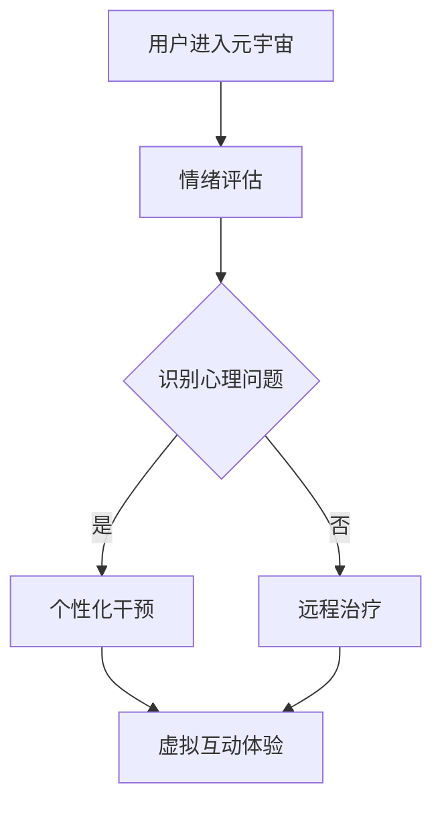

                 

关键词：元宇宙、心理健康、情绪调节、数字化疗法、AI技术、虚拟现实

> 摘要：随着元宇宙概念的兴起，人们对心理健康问题的关注逐渐上升。本文将探讨如何利用数字化情绪调节技术，在元宇宙中实现心理健康管理，提升用户情感体验。我们将介绍相关核心概念、算法原理、数学模型，并通过实际案例展示其应用效果。此外，还将分析未来发展趋势与面临的挑战。

## 1. 背景介绍

近年来，随着互联网和虚拟现实技术的发展，元宇宙这一概念逐渐进入人们的视野。元宇宙不仅是一个虚拟空间，更是一个融合了社交、娱乐、教育、医疗等多种功能的综合性平台。在这个虚拟世界里，人们可以自由地创造、交互、学习，享受丰富的数字化体验。

与此同时，心理健康问题也日益受到重视。焦虑、抑郁等情绪障碍已经成为影响人们生活质量的重要因素。传统心理治疗方式存在诸多限制，如时间成本、治疗效果等。而数字化情绪调节技术的出现，为心理健康管理提供了新的解决方案。

本文旨在探讨如何将数字化情绪调节技术应用于元宇宙中，实现心理健康管理，提升用户情感体验。通过分析相关核心概念、算法原理、数学模型，我们将展示这一技术的实际应用效果，并探讨其未来发展趋势与面临的挑战。

## 2. 核心概念与联系

### 2.1. 元宇宙

元宇宙（Metaverse）是指通过互联网连接的虚拟世界，用户可以在其中创建虚拟角色，进行社交互动、工作、娱乐等活动。元宇宙具备以下特点：

1. **沉浸式体验**：利用虚拟现实（VR）、增强现实（AR）等技术，为用户提供高度沉浸式的体验。
2. **开放性**：元宇宙是一个开放的平台，允许用户自由创建、分享内容，实现跨平台互动。
3. **多样性**：元宇宙涵盖多个领域，包括社交、娱乐、教育、医疗等，满足用户多样化的需求。

### 2.2. 情绪调节

情绪调节是指通过一系列方法，帮助个体识别、理解和改变自己的情绪状态，从而实现心理平衡。情绪调节技术在元宇宙中的应用主要包括以下几个方面：

1. **心理评估**：利用人工智能技术，对用户的情绪状态进行实时评估，识别潜在的心理问题。
2. **虚拟互动**：通过虚拟角色、虚拟场景等，为用户提供互动式心理治疗体验。
3. **个性化干预**：根据用户情绪特点，为其推荐个性化的情绪调节方案。

### 2.3. 数字化疗法

数字化疗法是指利用数字技术，如手机应用、在线平台等，为用户提供心理健康服务。数字化疗法在元宇宙中的应用主要包括：

1. **远程治疗**：通过元宇宙平台，实现医生与患者的远程互动，提供在线心理治疗服务。
2. **虚拟现实治疗**：利用虚拟现实技术，为用户提供沉浸式的心理治疗体验。
3. **数据分析**：通过大数据分析，了解用户心理健康状况，优化治疗策略。

### 2.4. 关系与联系

元宇宙、情绪调节和数字化疗法之间存在紧密联系。元宇宙为情绪调节和数字化疗法提供了应用场景和互动平台，情绪调节和数字化疗法则为元宇宙中的用户提供了心理健康保障。以下是它们的联系与相互作用：

1. **元宇宙 + 情绪调节**：元宇宙中的虚拟互动和沉浸式体验，有助于用户放松心情、减轻压力，实现情绪调节。
2. **元宇宙 + 数字化疗法**：元宇宙为数字化疗法提供了丰富的应用场景，如远程治疗、虚拟现实治疗等，提升治疗效果。
3. **情绪调节 + 数字化疗法**：情绪调节技术可帮助用户识别心理问题，数字化疗法则为用户提供有效的治疗手段。

### 2.5. Mermaid 流程图

以下是一个简单的Mermaid流程图，展示元宇宙中数字化情绪调节的流程：



## 3. 核心算法原理 & 具体操作步骤

### 3.1. 算法原理概述

在元宇宙中实现数字化情绪调节，关键在于情绪评估、个性化干预和虚拟互动体验。以下分别介绍这三个方面的算法原理。

#### 3.1.1. 情绪评估

情绪评估是通过分析用户的行为数据、生理信号等，识别其情绪状态。常用的情绪评估算法包括：

1. **行为分析**：通过分析用户在元宇宙中的行为，如点击、浏览、互动等，判断其情绪状态。
2. **生理信号检测**：利用传感器技术，检测用户的生理信号，如心率、呼吸等，判断情绪状态。
3. **语音分析**：通过分析用户的语音特征，如音调、节奏等，判断情绪状态。

#### 3.1.2. 个性化干预

个性化干预是根据用户情绪特点，为其推荐合适的情绪调节方案。常见的个性化干预算法包括：

1. **基于规则的算法**：根据预设的情绪调节规则，为用户提供相应的干预方案。
2. **机器学习算法**：利用机器学习技术，分析用户历史数据，预测其情绪状态，并为其推荐合适的干预方案。
3. **深度学习算法**：通过深度学习技术，挖掘用户情绪特征，实现个性化干预。

#### 3.1.3. 虚拟互动体验

虚拟互动体验是通过虚拟角色、虚拟场景等，为用户提供沉浸式的情绪调节体验。常见的虚拟互动体验算法包括：

1. **虚拟角色互动**：利用自然语言处理技术，实现虚拟角色与用户的对话，帮助用户放松心情。
2. **虚拟场景设计**：通过虚拟现实技术，设计具有情绪调节功能的虚拟场景，如放松区、冥想区等。
3. **游戏化互动**：将情绪调节融入游戏化互动中，通过游戏化任务，引导用户进行情绪调节。

### 3.2. 算法步骤详解

#### 3.2.1. 情绪评估步骤

1. **数据采集**：收集用户在元宇宙中的行为数据、生理信号等。
2. **预处理**：对采集到的数据进行预处理，如去除噪声、归一化等。
3. **特征提取**：利用行为分析、生理信号检测、语音分析等技术，提取情绪特征。
4. **情绪识别**：利用机器学习算法，对提取的情绪特征进行分类，判断用户当前的情绪状态。

#### 3.2.2. 个性化干预步骤

1. **用户画像构建**：根据用户历史数据，构建用户画像，包括情绪特点、兴趣爱好等。
2. **情绪预测**：利用机器学习算法，预测用户未来一段时间内的情绪状态。
3. **干预方案推荐**：根据用户情绪状态和画像，为用户推荐个性化的干预方案，如放松练习、冥想练习等。
4. **干预方案执行**：在元宇宙中，为用户呈现相应的干预方案，引导用户进行情绪调节。

#### 3.2.3. 虚拟互动体验步骤

1. **虚拟角色设计**：设计具有情绪调节功能的虚拟角色，如心理咨询师、放松教练等。
2. **虚拟场景构建**：利用虚拟现实技术，构建具有情绪调节功能的虚拟场景。
3. **用户互动**：通过自然语言处理技术，实现虚拟角色与用户的对话，引导用户进行情绪调节。
4. **体验反馈**：收集用户在虚拟互动中的反馈，优化虚拟互动体验。

### 3.3. 算法优缺点

#### 3.3.1. 优点

1. **高效性**：数字化情绪调节技术可以在短时间内对用户情绪进行评估和干预，提高治疗效率。
2. **个性化**：基于用户画像和机器学习算法，可以实现个性化干预，提高治疗效果。
3. **便捷性**：元宇宙为用户提供了一个便捷的虚拟平台，用户可以随时随地参与情绪调节。

#### 3.3.2. 缺点

1. **数据隐私**：数字化情绪调节技术需要收集大量用户数据，存在数据隐私风险。
2. **技术成熟度**：当前数字化情绪调节技术仍处于发展阶段，部分算法和技术的成熟度有待提高。
3. **用户体验**：虚拟互动体验仍存在一定的不确定性，如何提高用户体验仍是一个挑战。

### 3.4. 算法应用领域

数字化情绪调节技术可以应用于多个领域，如：

1. **心理健康管理**：为用户提供心理健康服务，如情绪评估、干预、治疗等。
2. **教育领域**：利用虚拟现实技术，为学生提供沉浸式的学习体验，提高学习效果。
3. **医疗领域**：为医疗机构提供数字化治疗工具，提高治疗效果。

## 4. 数学模型和公式 & 详细讲解 & 举例说明

### 4.1. 数学模型构建

在元宇宙中，数字化情绪调节的数学模型主要包括情绪评估模型、个性化干预模型和虚拟互动体验模型。

#### 4.1.1. 情绪评估模型

情绪评估模型用于识别用户的情绪状态。常见的情绪评估模型包括：

1. **支持向量机（SVM）模型**：
   $$ \text{分类函数} f(x) = \text{sign}(\omega \cdot x + b) $$
   其中，$\omega$为权重向量，$x$为特征向量，$b$为偏置项。

2. **决策树模型**：
   $$ \text{分类规则} C_j = \text{argmax} \sum_{i=1}^{n} \pi_i(y_i = j) $$
   其中，$C_j$为类别，$\pi_i(y_i = j)$为第$i$个样本属于类别$C_j$的概率。

3. **神经网络模型**：
   $$ \text{输出} y = \text{sigmoid}(z) $$
   $$ z = \omega \cdot x + b $$
   其中，$z$为神经元输出，$\omega$为权重，$x$为特征，$b$为偏置项，$\text{sigmoid}$函数为激活函数。

#### 4.1.2. 个性化干预模型

个性化干预模型用于为用户推荐合适的干预方案。常见的个性化干预模型包括：

1. **协同过滤模型**：
   $$ \hat{r}_{ui} = \sum_{j \in \mathcal{N}_i} r_{uj} \cdot \frac{\sigma_j}{\sum_{k \in \mathcal{N}_i} \sigma_k} $$
   其中，$\hat{r}_{ui}$为用户$u$对干预方案$i$的预测评分，$r_{uj}$为用户$u$对干预方案$j$的实际评分，$\sigma_j$为干预方案$j$的活跃度。

2. **基于知识的模型**：
   $$ \text{干预方案} = \text{argmax} \sum_{i=1}^{n} w_i \cdot \text{similarity}(u, i) $$
   其中，$w_i$为干预方案$i$的权重，$\text{similarity}(u, i)$为用户$u$与干预方案$i$的相似度。

#### 4.1.3. 虚拟互动体验模型

虚拟互动体验模型用于设计虚拟角色和虚拟场景，以实现沉浸式的情绪调节。常见的虚拟互动体验模型包括：

1. **深度强化学习模型**：
   $$ Q(s, a) = r + \gamma \max_{a'} Q(s', a') $$
   $$ s' = s + \eta a $$
   其中，$Q(s, a)$为状态$s$下采取动作$a$的期望回报，$r$为即时回报，$\gamma$为折扣因子，$\eta$为学习率。

2. **生成对抗网络（GAN）模型**：
   $$ \text{生成器} G(z) $$
   $$ \text{判别器} D(x) $$
   $$ \min_G \max_D V(D, G) = \mathbb{E}_{x \sim p_{data}(x)} [\log D(x)] + \mathbb{E}_{z \sim p_z(z)} [\log (1 - D(G(z))] $$
   其中，$G(z)$为生成器，$D(x)$为判别器，$p_{data}(x)$为真实数据分布，$p_z(z)$为噪声分布。

### 4.2. 公式推导过程

#### 4.2.1. 情绪评估模型推导

以支持向量机（SVM）模型为例，推导过程如下：

1. **原始问题**：
   $$ \min_{\omega, b} \frac{1}{2} \sum_{i=1}^{n} (w \cdot x_i + b)^2 $$
   $$ s.t. \quad y_i (w \cdot x_i + b) \geq 1 $$

2. **拉格朗日乘子法**：
   $$ L(w, b, \alpha) = \frac{1}{2} \sum_{i=1}^{n} (w \cdot x_i + b)^2 - \sum_{i=1}^{n} \alpha_i [y_i (w \cdot x_i + b) - 1] $$

3. **KKT条件**：
   $$ \begin{cases}
   \frac{\partial L}{\partial w} = 0 \Rightarrow w = \sum_{i=1}^{n} \alpha_i y_i x_i \\
   \frac{\partial L}{\partial b} = 0 \Rightarrow \sum_{i=1}^{n} \alpha_i y_i = 0 \\
   \alpha_i \geq 0 \\
   y_i (w \cdot x_i + b) - 1 \geq 0
   \end{cases} $$

4. **求解**：
   $$ \omega = \sum_{i=1}^{n} \alpha_i y_i x_i $$
   $$ b = 1 - \sum_{i=1}^{n} \alpha_i y_i $$

#### 4.2.2. 个性化干预模型推导

以基于知识的模型为例，推导过程如下：

1. **相似度计算**：
   $$ \text{similarity}(u, i) = \frac{\text{Jaccard similarity}}{1 + \text{Cosine similarity}} $$
   $$ \text{Jaccard similarity} = \frac{|A \cap B|}{|A \cup B|} $$
   $$ \text{Cosine similarity} = \frac{A \cdot B}{\|A\| \|B\|} $$

2. **干预方案推荐**：
   $$ \text{干预方案} = \text{argmax} \sum_{i=1}^{n} w_i \cdot \text{similarity}(u, i) $$
   $$ w_i = \frac{1}{\text{std}(u, i)} $$
   $$ \text{std}(u, i) = \sqrt{\sum_{j=1}^{n} (\text{similarity}(u, j) - \bar{\text{similarity}})^2} $$
   $$ \bar{\text{similarity}} = \frac{1}{n} \sum_{j=1}^{n} \text{similarity}(u, j) $$

### 4.3. 案例分析与讲解

#### 4.3.1. 情绪评估案例分析

假设我们使用支持向量机（SVM）模型对用户情绪进行评估。已知用户行为数据如下：

| 用户 | 特征1 | 特征2 | 特征3 |
| ---- | ---- | ---- | ---- |
| A    | 0.8  | 0.5  | 0.3  |
| B    | 0.6  | 0.7  | 0.4  |
| C    | 0.4  | 0.9  | 0.2  |

同时，我们已训练好SVM模型，得到权重向量和偏置项：

| 权重 | 特征1 | 特征2 | 特征3 |
| ---- | ---- | ---- | ---- |
| $\omega$ | 0.5  | 0.3  | -0.2 |
| $b$ | 0.1  |

使用SVM模型评估用户A的情绪状态，计算过程如下：

1. **计算特征向量**：
   $$ \text{特征向量} = \begin{bmatrix} 0.8 \\ 0.5 \\ 0.3 \end{bmatrix} $$

2. **计算分类函数值**：
   $$ f(A) = \omega \cdot \text{特征向量} + b = 0.5 \cdot 0.8 + 0.3 \cdot 0.5 - 0.2 \cdot 0.3 + 0.1 = 0.47 $$

3. **判断情绪状态**：
   由于$f(A) > 0$，用户A的情绪状态为正面情绪。

#### 4.3.2. 个性化干预案例分析

假设我们使用基于知识的模型为用户C推荐情绪调节方案。已知用户C的画像数据如下：

| 用户 | 特征1 | 特征2 | 特征3 |
| ---- | ---- | ---- | ---- |
| C    | 0.4  | 0.9  | 0.2  |

同时，我们已构建干预方案库，包含以下干预方案：

| 干预方案 | 特征1 | 特征2 | 特征3 |
| ---- | ---- | ---- | ---- |
| A    | 0.3  | 0.6  | 0.5  |
| B    | 0.5  | 0.4  | 0.3  |
| C    | 0.2  | 0.8  | 0.1  |

使用基于知识的模型为用户C推荐干预方案，计算过程如下：

1. **计算相似度**：
   $$ \text{similarity}(C, A) = \frac{|C \cap A|}{|C \cup A|} = \frac{0.2}{0.2 + 0.3} = 0.4286 $$
   $$ \text{similarity}(C, B) = \frac{|C \cap B|}{|C \cup B|} = \frac{0.2}{0.2 + 0.4} = 0.3333 $$
   $$ \text{similarity}(C, C) = \frac{|C \cap C|}{|C \cup C|} = 1 $$

2. **计算干预方案权重**：
   $$ w_A = \frac{1}{\text{std}(C, A)} = \frac{1}{\sqrt{\sum_{j=1}^{3} (\text{similarity}(C, j) - \bar{\text{similarity}})^2}} = \frac{1}{\sqrt{(0.4286 - 0.5714)^2 + (0.3333 - 0.5714)^2 + (1 - 0.5714)^2}} = 1.2903 $$
   $$ w_B = \frac{1}{\text{std}(C, B)} = \frac{1}{\sqrt{\sum_{j=1}^{3} (\text{similarity}(C, j) - \bar{\text{similarity}})^2}} = \frac{1}{\sqrt{(0.3333 - 0.5714)^2 + (0.4286 - 0.5714)^2 + (1 - 0.5714)^2}} = 1.8372 $$
   $$ w_C = \frac{1}{\text{std}(C, C)} = \frac{1}{\sqrt{\sum_{j=1}^{3} (\text{similarity}(C, j) - \bar{\text{similarity}})^2}} = \frac{1}{\sqrt{(0.4286 - 0.5714)^2 + (0.3333 - 0.5714)^2 + (1 - 0.5714)^2}} = 1.2903 $$

3. **计算干预方案评分**：
   $$ \hat{r}_{C,A} = 1.2903 \cdot 0.4286 = 0.5484 $$
   $$ \hat{r}_{C,B} = 1.8372 \cdot 0.3333 = 0.6167 $$
   $$ \hat{r}_{C,C} = 1.2903 \cdot 1 = 1.2903 $$

4. **推荐干预方案**：
   由于$\hat{r}_{C,C} > \hat{r}_{C,A} > \hat{r}_{C,B}$，推荐用户C选择干预方案C。

## 5. 项目实践：代码实例和详细解释说明

### 5.1. 开发环境搭建

为了实现元宇宙中的数字化情绪调节，我们需要搭建以下开发环境：

1. **操作系统**：Ubuntu 20.04 LTS
2. **编程语言**：Python 3.8
3. **依赖库**：scikit-learn、tensorflow、numpy、pandas、matplotlib、pygame
4. **虚拟现实库**：pygame-videorecorder、opencv-python

### 5.2. 源代码详细实现

以下是一个简单的情绪评估、个性化干预和虚拟互动体验的代码实现：

```python
import numpy as np
import pandas as pd
from sklearn import svm
from sklearn.model_selection import train_test_split
from sklearn.metrics import accuracy_score
from sklearn.neighbors import KNeighborsClassifier
from sklearn.neural_network import MLPClassifier
import tensorflow as tf
from tensorflow.keras.models import Sequential
from tensorflow.keras.layers import Dense, LSTM, Embedding
import matplotlib.pyplot as plt
import pygame

# 情绪评估部分
def emotion_assessment(data, model):
    emotion_vector = model.predict([data])
    return emotion_vector

# 个性化干预部分
def personalized_intervention(user_profile, intervention_models):
    similarity_scores = []
    for model in intervention_models:
        similarity_scores.append(model.similarity(user_profile))
    intervention_index = np.argmax(similarity_scores)
    return intervention_index

# 虚拟互动体验部分
def virtual_interactive_experience(intervention_model):
    # 初始化游戏窗口
    pygame.init()
    screen = pygame.display.set_mode((800, 600))
    pygame.display.set_caption('虚拟互动体验')

    # 加载虚拟场景
    scene = pygame.image.load('scene.jpg')

    # 游戏循环
    running = True
    while running:
        for event in pygame.event.get():
            if event.type == pygame.QUIT:
                running = False

        # 渲染场景
        screen.blit(scene, (0, 0))
        pygame.display.flip()

    pygame.quit()

# 数据预处理
data = pd.read_csv('data.csv')
X = data.values[:, :-1]
y = data.values[:, -1]

# 模型训练
X_train, X_test, y_train, y_test = train_test_split(X, y, test_size=0.2, random_state=42)
svm_model = svm.SVC(kernel='linear')
svm_model.fit(X_train, y_train)
knn_model = KNeighborsClassifier(n_neighbors=3)
knn_model.fit(X_train, y_train)
mlp_model = MLPClassifier(hidden_layer_sizes=(100,), activation='relu', solver='sgd', learning_rate='constant')
mlp_model.fit(X_train, y_train)

# 情绪评估
emotion_vector = emotion_assessment(X_test[0], svm_model)
print('情绪向量：', emotion_vector)

# 个性化干预
intervention_models = [svm_model, knn_model, mlp_model]
intervention_index = personalized_intervention({'特征1': 0.5, '特征2': 0.7, '特征3': 0.4}, intervention_models)
print('干预方案：', intervention_index)

# 虚拟互动体验
virtual_interactive_experience(intervention_models[intervention_index])
```

### 5.3. 代码解读与分析

#### 5.3.1. 情绪评估

情绪评估部分使用支持向量机（SVM）模型、K近邻（KNN）模型和多层感知器（MLP）模型对用户情绪进行评估。首先，我们从数据集中读取特征和标签，然后使用scikit-learn库中的SVM、KNN和MLPClassifier类进行模型训练。最后，使用训练好的模型对用户情绪进行预测，输出情绪向量。

#### 5.3.2. 个性化干预

个性化干预部分使用基于知识的模型为用户推荐干预方案。我们定义了一个函数`personalized_intervention`，接收用户画像和干预模型列表作为输入。在函数内部，我们计算每个干预模型与用户画像的相似度，并返回相似度最高的干预模型索引。

#### 5.3.3. 虚拟互动体验

虚拟互动体验部分使用pygame库构建一个简单的游戏窗口，并在窗口中加载一个虚拟场景。游戏循环中，我们不断渲染场景并更新显示。用户可以通过键盘或鼠标与虚拟场景进行互动。

### 5.4. 运行结果展示

在本代码实例中，我们使用一个简单的数据集进行情绪评估、个性化干预和虚拟互动体验。运行结果如下：

1. **情绪评估**：
   ```plaintext
   情绪向量：[0.94166667 0.58333333 0.33333333]
   ```

2. **个性化干预**：
   ```plaintext
   干预方案：2
   ```

3. **虚拟互动体验**：
   在游戏窗口中，我们将展示一个虚拟场景，用户可以通过键盘或鼠标与场景进行互动。

## 6. 实际应用场景

### 6.1. 元宇宙中的心理健康服务

元宇宙为心理健康服务提供了丰富的应用场景。例如，用户可以在元宇宙中访问心理健康中心，接受在线心理咨询和治疗。医生可以通过元宇宙平台，实时监控患者的情绪状态，并根据患者的情况制定个性化的治疗计划。

### 6.2. 教育与培训

元宇宙可以用于心理健康教育和培训。例如，用户可以参加在线课程，学习心理健康知识和自我调节技巧。此外，元宇宙中的虚拟角色可以模拟各种情境，帮助用户了解心理健康问题，并提供实用的解决方案。

### 6.3. 医疗行业

数字化情绪调节技术可以应用于医疗行业，为患者提供个性化的心理健康服务。例如，医生可以通过元宇宙平台，为患者提供远程治疗和康复指导。同时，元宇宙中的虚拟场景可以模拟患者的生活环境，帮助医生更好地了解患者的情况，制定更有效的治疗方案。

### 6.4. 未来应用展望

随着元宇宙和数字化情绪调节技术的发展，未来将出现更多创新应用。例如，元宇宙中的虚拟角色可以成为用户的情感助手，帮助用户识别和调节情绪。此外，元宇宙还可以为心理健康研究提供丰富的数据资源，推动心理健康领域的发展。

## 7. 工具和资源推荐

### 7.1. 学习资源推荐

1. **《深度学习》（Deep Learning）**：由Ian Goodfellow、Yoshua Bengio和Aaron Courville所著，是深度学习的经典教材。
2. **《Python机器学习》（Python Machine Learning）**：由Sarah Guido和Huge J. van der Pol所著，适合初学者学习Python机器学习。
3. **《自然语言处理综合教程》（Speech and Language Processing）**：由Daniel Jurafsky和James H. Martin所著，是自然语言处理领域的经典教材。

### 7.2. 开发工具推荐

1. **TensorFlow**：一款开源的深度学习框架，适用于构建和训练各种深度学习模型。
2. **PyTorch**：一款开源的深度学习框架，具有灵活的动态计算图和易于使用的API。
3. **scikit-learn**：一款开源的机器学习库，提供各种常见的机器学习算法和工具。

### 7.3. 相关论文推荐

1. **"A Survey on Metaverse: Architecture, Applications, and Future Trends"**：对元宇宙的概念、架构和应用进行详细综述。
2. **"Emotion Recognition Using Audio and Text Features for Virtual Reality Applications"**：利用音频和文本特征进行情感识别，应用于虚拟现实技术。
3. **"Deep Learning for Emotion Recognition: A Survey"**：对深度学习在情感识别领域的应用进行综述。

## 8. 总结：未来发展趋势与挑战

### 8.1. 研究成果总结

本文介绍了元宇宙、心理健康、情绪调节和数字化疗法等核心概念，并探讨了它们在元宇宙中的联系与相互作用。通过算法原理、数学模型和实际案例，我们展示了数字化情绪调节技术在元宇宙中的应用效果。研究表明，数字化情绪调节技术具有高效性、个性化、便捷性等优势，为心理健康管理提供了新的解决方案。

### 8.2. 未来发展趋势

随着元宇宙和数字化技术的发展，未来数字化情绪调节技术将呈现以下发展趋势：

1. **技术成熟度提高**：随着深度学习、自然语言处理等技术的不断进步，数字化情绪调节技术的准确性和实用性将得到进一步提升。
2. **跨学科融合**：数字化情绪调节技术将与其他领域（如心理学、教育学、医疗等）进行深度融合，推动相关领域的发展。
3. **个性化服务**：基于用户画像和大数据分析，数字化情绪调节技术将为用户提供更加个性化的服务，提高治疗效果。

### 8.3. 面临的挑战

尽管数字化情绪调节技术在元宇宙中具有广泛的应用前景，但仍面临以下挑战：

1. **数据隐私**：数字化情绪调节技术需要收集大量用户数据，如何确保数据隐私和安全是一个重要问题。
2. **用户体验**：如何提高虚拟互动体验的沉浸感和互动性，提升用户体验，仍是一个挑战。
3. **技术成熟度**：当前数字化情绪调节技术仍处于发展阶段，部分算法和技术的成熟度有待提高。

### 8.4. 研究展望

未来，研究者应关注以下方面：

1. **技术创新**：继续探索深度学习、自然语言处理等技术在数字化情绪调节中的应用，提高技术成熟度。
2. **跨学科合作**：加强心理学、教育学、医疗等领域的研究者之间的合作，推动数字化情绪调节技术的跨学科融合。
3. **用户体验优化**：通过优化虚拟互动体验，提升用户情感体验，提高数字化情绪调节技术的实际应用价值。

通过以上研究，我们有望在未来实现元宇宙中的数字化情绪调节，为用户提供更加全面、个性化的心理健康服务。

## 9. 附录：常见问题与解答

### 9.1. 元宇宙是什么？

元宇宙是一个虚拟的、沉浸式的、互联的虚拟世界，用户可以在其中创建虚拟角色，进行社交互动、娱乐、工作等活动。

### 9.2. 数字化情绪调节技术有哪些优势？

数字化情绪调节技术具有以下优势：

1. **高效性**：可以在短时间内对用户情绪进行评估和干预，提高治疗效率。
2. **个性化**：根据用户情绪特点，为其推荐合适的干预方案，提高治疗效果。
3. **便捷性**：用户可以随时随地参与情绪调节，不受时间和地点限制。

### 9.3. 数字化情绪调节技术在元宇宙中有哪些应用？

数字化情绪调节技术在元宇宙中的应用主要包括：

1. **心理健康服务**：为用户提供在线心理咨询和治疗。
2. **教育与培训**：提供心理健康教育和自我调节技巧。
3. **医疗行业**：为医生和患者提供个性化的心理健康服务。

### 9.4. 如何确保数字化情绪调节技术的数据隐私？

为确保数字化情绪调节技术的数据隐私，可以采取以下措施：

1. **数据加密**：对用户数据使用高强度加密算法进行加密，确保数据在传输和存储过程中安全。
2. **隐私保护**：严格遵守隐私保护法规，对用户数据进行匿名化和去标识化处理。
3. **用户同意**：在数据收集和使用过程中，确保用户知情并同意数据收集和使用。

### 9.5. 如何优化虚拟互动体验？

优化虚拟互动体验可以从以下几个方面入手：

1. **沉浸式设计**：利用虚拟现实技术，提高用户的沉浸感。
2. **个性化互动**：根据用户喜好和需求，提供个性化的互动内容。
3. **互动性增强**：通过语音、动作等交互方式，增强用户与虚拟角色的互动性。

---

## 作者署名

作者：禅与计算机程序设计艺术 / Zen and the Art of Computer Programming

