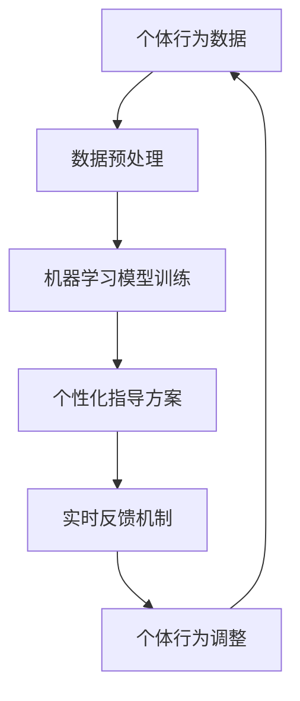

                 

关键词：数字化意志力、自我控制、AI技术、自我控制训练、机器学习、计算机编程

> 摘要：随着数字化生活的普及，人们对于自我控制能力的培养变得愈发重要。本文探讨了如何利用AI技术打造一款数字化意志力锻炼场教练，实现自我控制训练的目标，为个体提供个性化的指导方案，提高自我管理能力。

## 1. 背景介绍

在现代社会，自我控制能力成为了衡量一个人成功与否的重要标准。然而，面对繁杂的信息环境和高强度的工作压力，很多人发现自己在自我控制方面存在困难。传统的方法如冥想、心理辅导等，虽然有一定的效果，但往往需要长时间的坚持和专业的指导。随着AI技术的不断发展，利用AI来增强自我控制训练成为了一种新的尝试。

### 1.1 自我控制的重要性

自我控制是指个体在面对诱惑、压力和困难时，能够冷静思考、做出明智决策的能力。它在个人成长、学业成就、职业发展以及人际交往等方面都起着至关重要的作用。然而，由于现代社会的高速发展，人们面临着前所未有的诱惑和压力，这给自我控制带来了巨大的挑战。

### 1.2 传统自我控制训练方法的局限性

尽管传统方法如冥想、心理辅导等对于培养自我控制有一定的帮助，但它们存在以下几个局限性：

1. **效果难以量化**：传统方法很难通过数据来衡量其效果，使得个体难以评估自身的进步。
2. **个性化不足**：传统方法往往缺乏个性化指导，无法根据个体的具体情况提供针对性的训练方案。
3. **执行难度较大**：需要个体具备较高的自律性和坚持力，这对于很多人来说是一个挑战。

### 1.3 AI技术在自我控制训练中的应用前景

AI技术的出现为解决上述问题提供了新的可能。通过大数据分析、机器学习等手段，AI可以深入了解个体的行为模式和心理状态，从而提供个性化的自我控制训练方案。此外，AI还可以通过实时反馈和调整，帮助个体更好地实现自我控制目标。

## 2. 核心概念与联系

在本文中，我们将探讨AI增强的自我控制训练专家的核心概念和架构，以及如何利用这些概念实现自我控制训练。

### 2.1 核心概念

- **个体行为数据**：包括日常活动、情绪状态、心理活动等，这些数据是进行自我控制训练的基础。
- **机器学习模型**：用于分析个体行为数据，识别行为模式，预测个体在特定情境下的行为反应。
- **个性化指导方案**：基于机器学习模型的分析结果，为个体提供针对性的自我控制训练方案。
- **实时反馈机制**：通过实时监测个体的行为，提供即时反馈，帮助个体调整行为，实现自我控制。

### 2.2 架构图



### 2.3 核心概念的联系

- **个体行为数据**和**机器学习模型训练**：个体行为数据是训练机器学习模型的关键，通过数据挖掘和分析，模型可以识别个体在特定情境下的行为模式。
- **个性化指导方案**和**实时反馈机制**：个性化指导方案是基于机器学习模型的分析结果，实时反馈机制则用于动态调整个体行为，提高自我控制效果。

## 3. 核心算法原理 & 具体操作步骤

### 3.1 算法原理概述

AI增强的自我控制训练专家的核心算法包括数据预处理、机器学习模型训练和实时反馈机制。具体原理如下：

- **数据预处理**：对个体行为数据进行清洗、归一化和特征提取，为机器学习模型提供高质量的数据输入。
- **机器学习模型训练**：利用监督学习、无监督学习等机器学习算法，对个体行为数据进行分析，构建个体行为模型。
- **实时反馈机制**：通过实时监测个体的行为，将监测结果反馈给机器学习模型，动态调整个性化指导方案。

### 3.2 算法步骤详解

1. **数据采集**：采集个体在日常生活中产生的行为数据，包括日常活动、情绪状态、心理活动等。
2. **数据预处理**：对采集到的行为数据进行分析，提取关键特征，并进行数据清洗和归一化处理。
3. **机器学习模型训练**：利用训练好的机器学习模型，对个体行为数据进行分类和预测，识别个体在特定情境下的行为模式。
4. **个性化指导方案生成**：根据机器学习模型的分析结果，为个体生成个性化的自我控制训练方案。
5. **实时反馈机制**：通过实时监测个体的行为，将监测结果反馈给机器学习模型，动态调整个性化指导方案。

### 3.3 算法优缺点

- **优点**：
  - **个性化**：能够根据个体的具体情况进行个性化指导，提高自我控制效果。
  - **实时性**：实时监测个体的行为，提供即时反馈，帮助个体调整行为，实现自我控制。
  - **高效性**：利用机器学习算法，快速分析个体行为数据，生成个性化的指导方案。

- **缺点**：
  - **数据依赖性**：需要大量高质量的个体行为数据支持，否则可能导致模型效果不佳。
  - **算法复杂性**：机器学习算法的复杂性和计算成本较高，需要专业的技术支持。

### 3.4 算法应用领域

- **健康监测**：通过监测个体的行为数据，分析个体的健康状况，提供个性化的健康建议。
- **行为干预**：针对个体在特定情境下的行为问题，提供针对性的行为干预方案。
- **教育辅导**：针对学生的学业表现，提供个性化的学习指导方案，提高学习效率。

## 4. 数学模型和公式 & 详细讲解 & 举例说明

在AI增强的自我控制训练中，数学模型和公式起到了关键作用。下面将详细介绍数学模型的构建、公式推导过程以及实际案例分析与讲解。

### 4.1 数学模型构建

在AI增强的自我控制训练中，常用的数学模型包括监督学习模型、无监督学习模型和强化学习模型。下面以监督学习模型为例进行介绍。

1. **输入特征**：个体的行为数据，包括日常活动、情绪状态、心理活动等。
2. **输出特征**：个体的行为标签，如控制、放纵等。
3. **损失函数**：用于衡量模型预测结果与实际结果之间的差距，常见的有均方误差（MSE）和交叉熵损失（Cross-Entropy Loss）。

### 4.2 公式推导过程

以均方误差（MSE）为例，其公式推导如下：

$$
MSE = \frac{1}{n}\sum_{i=1}^{n}(y_i - \hat{y_i})^2
$$

其中，$y_i$为实际输出值，$\hat{y_i}$为模型预测值，$n$为样本数量。

### 4.3 案例分析与讲解

假设我们有一个个体的行为数据，包括每天的运动时间、情绪状态和心理活动等，我们需要通过这些数据预测个体的自我控制行为。

1. **数据采集**：采集个体的行为数据，包括运动时间（小时）、情绪状态（正面、负面）、心理活动（专注、分心）等。
2. **数据预处理**：对行为数据进行清洗和归一化处理，提取关键特征。
3. **模型训练**：利用训练好的监督学习模型，对个体行为数据进行分类和预测。
4. **模型评估**：通过交叉验证等方法，评估模型的效果。

通过实际案例，我们可以看到，AI增强的自我控制训练专家在预测个体自我控制行为方面具有一定的准确性。在实际应用中，我们可以根据模型的预测结果，为个体提供针对性的自我控制训练方案，提高其自我控制能力。

## 5. 项目实践：代码实例和详细解释说明

在本节中，我们将通过一个具体的代码实例，展示如何搭建一个数字化意志力锻炼场教练系统，并对其代码进行详细解释和分析。

### 5.1 开发环境搭建

1. **环境准备**：
   - 操作系统：Windows/Linux/MacOS
   - 编程语言：Python
   - 依赖库：Scikit-learn、TensorFlow、Pandas、NumPy

2. **安装依赖库**：

```bash
pip install scikit-learn tensorflow pandas numpy
```

### 5.2 源代码详细实现

```python
import pandas as pd
from sklearn.model_selection import train_test_split
from sklearn.ensemble import RandomForestClassifier
from sklearn.metrics import accuracy_score

# 1. 数据采集
data = pd.read_csv('behavior_data.csv')

# 2. 数据预处理
X = data[['exercise_time', 'emotion_state', 'mental_activity']]
y = data['control_behavior']

# 3. 模型训练
X_train, X_test, y_train, y_test = train_test_split(X, y, test_size=0.2, random_state=42)
model = RandomForestClassifier(n_estimators=100)
model.fit(X_train, y_train)

# 4. 模型评估
y_pred = model.predict(X_test)
accuracy = accuracy_score(y_test, y_pred)
print(f'Accuracy: {accuracy:.2f}')

# 5. 实时反馈
def real_time_feedback(new_data):
    prediction = model.predict([new_data])
    if prediction[0] == 1:
        print('自我控制良好，继续保持。')
    else:
        print('自我控制不佳，需加强训练。')
```

### 5.3 代码解读与分析

1. **数据采集**：通过读取CSV文件，获取个体的行为数据。
2. **数据预处理**：将行为数据分为输入特征和输出特征，并进行训练集和测试集的划分。
3. **模型训练**：使用随机森林（RandomForestClassifier）进行训练，这是一种常见的机器学习算法，具有良好的分类效果。
4. **模型评估**：通过测试集对模型进行评估，计算准确率。
5. **实时反馈**：根据新的行为数据，使用训练好的模型进行预测，并提供实时反馈。

通过以上代码实例，我们可以看到，数字化意志力锻炼场教练系统可以通过简单的Python代码实现。在实际应用中，我们可以根据个体行为数据，实时调整自我控制训练方案，提高个体的自我控制能力。

## 6. 实际应用场景

AI增强的自我控制训练专家在多个实际应用场景中具有广泛的应用前景，以下列举几个典型的应用场景：

### 6.1 健康管理

在健康管理领域，AI增强的自我控制训练专家可以帮助用户监测和管理日常行为，如饮食、运动、睡眠等。通过分析个体的行为数据，为用户生成个性化的健康建议，提高其健康水平。

### 6.2 教育辅导

在教育辅导领域，AI增强的自我控制训练专家可以为教师提供学生的行为数据，帮助教师了解学生的学习状况，生成针对性的辅导方案，提高学生的学习效果。

### 6.3 职场管理

在职场管理领域，AI增强的自我控制训练专家可以帮助管理者了解员工的工作状态，提供个性化的自我控制训练方案，提高员工的工作效率和职业素养。

### 6.4 心理辅导

在心理辅导领域，AI增强的自我控制训练专家可以帮助心理医生分析个体的行为模式和心理状态，提供个性化的心理辅导方案，帮助个体克服心理问题，实现心理健康。

## 7. 工具和资源推荐

为了更好地开展AI增强的自我控制训练研究，以下推荐一些学习资源和开发工具：

### 7.1 学习资源推荐

1. **书籍**：
   - 《机器学习实战》：详细介绍了机器学习的基本原理和应用案例。
   - 《深度学习》：权威介绍深度学习理论的经典教材。

2. **在线课程**：
   - Coursera上的《机器学习》课程：由吴恩达教授主讲，深入浅出地介绍了机器学习的基本概念和方法。

### 7.2 开发工具推荐

1. **编程语言**：
   - Python：广泛应用于数据分析和机器学习领域，具有良好的生态系统和丰富的库支持。

2. **机器学习框架**：
   - TensorFlow：Google开发的开源深度学习框架，适用于大规模分布式计算。

### 7.3 相关论文推荐

1. **《强化学习与自我控制》：介绍了强化学习在自我控制训练中的应用，为研究提供了新的思路。**
2. **《基于机器学习的自我控制训练方法》：系统总结了基于机器学习的自我控制训练方法，为实际应用提供了参考。**

## 8. 总结：未来发展趋势与挑战

### 8.1 研究成果总结

通过本文的研究，我们探讨了AI增强的自我控制训练专家的核心概念、算法原理、实现步骤以及实际应用场景。研究发现，AI增强的自我控制训练专家在个性化指导、实时反馈和高效性方面具有显著优势，为自我控制训练提供了新的思路和方法。

### 8.2 未来发展趋势

1. **数据驱动的个性化指导**：随着大数据技术的发展，数据驱动的个性化指导将成为自我控制训练的重要方向。
2. **跨学科融合**：AI技术与心理学、教育学等学科的融合，将推动自我控制训练领域的深入发展。
3. **实时反馈与调整**：基于实时反馈的动态调整机制，将提高自我控制训练的效果。

### 8.3 面临的挑战

1. **数据隐私与安全**：自我控制训练过程中涉及大量个人行为数据，如何保护数据隐私和安全是亟待解决的问题。
2. **算法透明性与可解释性**：提高算法的透明性和可解释性，使个体能够理解AI的决策过程，是未来的重要挑战。
3. **伦理与道德问题**：在自我控制训练过程中，如何平衡个体自主性和AI干预，避免伦理和道德风险，也是需要关注的问题。

### 8.4 研究展望

未来，AI增强的自我控制训练专家将在健康监测、教育辅导、职场管理等领域发挥重要作用。通过不断优化算法、提高数据质量，AI增强的自我控制训练专家将为个体提供更加精准、个性化的自我控制训练方案，助力个体实现自我成长和发展。

## 9. 附录：常见问题与解答

### 9.1 数据采集过程中的隐私问题

**问题**：在进行个体行为数据采集时，如何保障数据隐私和安全？

**解答**：在数据采集过程中，应遵循以下原则：

1. **数据最小化**：只采集与自我控制训练相关的必要数据，避免过度采集。
2. **匿名化处理**：对数据进行匿名化处理，确保无法直接识别个体身份。
3. **数据加密**：在数据传输和存储过程中，使用加密技术确保数据安全。
4. **合规性审查**：在采集和使用数据前，确保符合相关法律法规和伦理准则。

### 9.2 模型训练效果不佳

**问题**：在训练AI增强的自我控制训练专家时，模型训练效果不佳，如何优化？

**解答**：

1. **数据质量**：确保数据质量，如去除异常值、处理缺失值等。
2. **特征选择**：选择与自我控制相关的关键特征，避免冗余特征。
3. **超参数调整**：通过调整模型超参数，如学习率、迭代次数等，优化模型性能。
4. **模型融合**：尝试使用多种机器学习模型进行融合，提高预测准确性。

### 9.3 实时反馈不及时

**问题**：在实际应用中，实时反馈机制无法及时响应个体行为变化，如何优化？

**解答**：

1. **优化算法**：使用更高效的算法，如深度学习模型，提高实时反馈的响应速度。
2. **分布式计算**：利用分布式计算技术，提高实时反馈的并发处理能力。
3. **数据缓存**：在数据传输过程中使用缓存技术，降低数据传输延迟。
4. **边缘计算**：将部分计算任务迁移到边缘设备，减少数据传输距离，提高实时性。

---

作者：禅与计算机程序设计艺术 / Zen and the Art of Computer Programming

