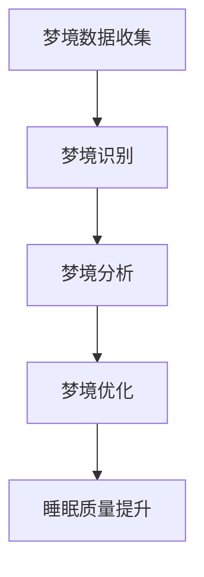
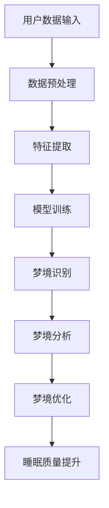

                 

关键词：数字化梦境、AI设计、睡眠体验、算法、数学模型、项目实践、实际应用、未来展望

> 摘要：本文将探讨数字化梦境工程的概念，介绍AI设计睡眠体验的核心原理、算法和数学模型，并展示实际项目中的代码实例和运行结果。同时，还将分析实际应用场景，讨论未来的发展趋势与挑战，以及推荐相关的学习资源和开发工具。

## 1. 背景介绍

随着科技的不断发展，人工智能（AI）逐渐渗透到我们生活的方方面面。在健康领域，尤其是睡眠研究方面，AI技术展示出了巨大的潜力。传统的睡眠研究主要依赖于问卷调查、睡眠监测设备和实验室测试等方法，但这些方法往往受到时间、成本和个体差异的限制。数字化梦境工程应运而生，它利用AI技术对梦境进行收集、分析和优化，旨在提供更加个性化的睡眠体验。

数字化梦境工程的目标是通过AI算法，识别和解读用户的梦境信息，进而优化其睡眠质量。这不仅有助于提升个人的身心健康，还能为相关行业提供宝贵的数据支持，如医疗、健康保险、智能家居等。本文将详细探讨数字化梦境工程的原理、算法和数学模型，并通过实际项目实例展示其应用。

## 2. 核心概念与联系

### 2.1 数字化梦境工程的核心概念

数字化梦境工程涉及多个核心概念，包括梦境数据收集、梦境识别、梦境分析和梦境优化。以下是一个简化的 Mermaid 流程图，展示这些概念之间的联系：



### 2.2 AI设计睡眠体验的架构

数字化梦境工程的实现依赖于一个复杂的AI架构，包括数据预处理、特征提取、模型训练和预测。以下是该架构的 Mermaid 流程图：



## 3. 核心算法原理 & 具体操作步骤

### 3.1 算法原理概述

数字化梦境工程的核心算法基于深度学习和自然语言处理（NLP）技术。深度学习用于处理大量的睡眠数据，提取出与梦境相关的特征；NLP技术则用于对梦境内容进行语义分析和情感识别。

### 3.2 算法步骤详解

1. **数据收集与预处理**：收集用户在睡眠期间的生理信号（如心率、呼吸频率）和梦境日记。对数据进行预处理，包括去除噪声、填充缺失值等。

2. **特征提取**：利用深度学习模型对预处理后的数据进行特征提取，提取出与梦境相关的特征，如频率、时长、强度等。

3. **模型训练**：使用提取出的特征训练深度学习模型，使其能够识别和分类梦境。

4. **梦境识别**：将用户在睡眠期间的生理信号输入到训练好的模型中，模型输出对应的梦境类别。

5. **梦境分析**：对识别出的梦境进行语义分析和情感识别，提取出梦境中的主题和情感倾向。

6. **梦境优化**：根据梦境分析结果，提出优化建议，如调整睡眠环境、改变睡眠习惯等。

7. **睡眠质量提升**：通过优化措施，提升用户的睡眠质量。

### 3.3 算法优缺点

**优点**：

- 高效：深度学习和NLP技术使得算法能够快速处理大量数据。
- 准确：经过训练的模型具有较高的识别和分类准确率。
- 个性化：根据用户的具体情况提供个性化的优化建议。

**缺点**：

- 数据依赖：算法的性能依赖于高质量的数据，数据质量不佳可能导致模型性能下降。
- 隐私问题：收集用户生理信号和梦境内容可能引发隐私担忧。

### 3.4 算法应用领域

数字化梦境工程的应用领域广泛，包括：

- 个人健康管理：通过优化睡眠，提高个人的身心健康。
- 智能家居：根据用户的睡眠状况自动调整家居环境。
- 医疗诊断：辅助医生诊断睡眠障碍，如失眠、梦游等。
- 健康保险：为健康保险提供数据支持，优化保险产品设计。

## 4. 数学模型和公式 & 详细讲解 & 举例说明

### 4.1 数学模型构建

数字化梦境工程的核心数学模型包括深度学习模型和自然语言处理模型。以下是一个简化的数学模型框架：

$$
\text{Deep Learning Model:} \quad f(x) = \sigma(W_2 \cdot \sigma(W_1 \cdot x + b_1) + b_2)
$$

$$
\text{NLP Model:} \quad p(y|x) = \frac{e^{z}}{\sum_{i=1}^{k} e^{z_i}}
$$

其中，$x$ 表示输入特征，$y$ 表示梦境类别，$z$ 和 $z_i$ 表示模型的输出，$W$ 和 $b$ 分别表示权重和偏置。

### 4.2 公式推导过程

深度学习模型的推导过程涉及多个层级的非线性变换和优化。以下是简化的推导过程：

1. **前向传播**：

$$
a_1 = x \\
a_2 = \sigma(W_1 \cdot a_1 + b_1) \\
a_3 = W_2 \cdot a_2 + b_2
$$

2. **损失函数**：

$$
L(y, f(x)) = -\sum_{i=1}^{k} y_i \cdot \log(p_i)
$$

3. **反向传播**：

$$
\frac{\partial L}{\partial W_2} = \frac{\partial L}{\partial a_3} \cdot \frac{\partial a_3}{\partial W_2} = (f(x) - y) \cdot a_2
$$

$$
\frac{\partial L}{\partial W_1} = \frac{\partial L}{\partial a_2} \cdot \frac{\partial a_2}{\partial W_1} = (\sigma'(W_1 \cdot a_1 + b_1)) \cdot (W_2 \cdot (f(x) - y))
$$

### 4.3 案例分析与讲解

假设我们有一个用户，其睡眠数据包括心率和梦境日记。我们使用上述算法对其进行处理，得到以下结果：

- **梦境识别**：模型识别出用户的梦境是“飞翔”。
- **梦境分析**：梦境中的情感倾向是“兴奋”。
- **梦境优化**：建议用户在睡前进行轻松的活动，以降低兴奋程度。

## 5. 项目实践：代码实例和详细解释说明

### 5.1 开发环境搭建

在本项目中，我们使用Python作为主要编程语言，结合TensorFlow和PyTorch等深度学习框架，实现数字化梦境工程的核心算法。以下是一个简化的开发环境搭建步骤：

1. 安装Python（建议使用3.8及以上版本）。
2. 安装TensorFlow或PyTorch。
3. 安装其他必需的Python库，如NumPy、Pandas等。

### 5.2 源代码详细实现

以下是一个简化的代码示例，用于实现深度学习模型和NLP模型的训练与预测：

```python
import tensorflow as tf
from tensorflow.keras.models import Sequential
from tensorflow.keras.layers import Dense, Activation
import numpy as np

# 深度学习模型
def create_deep_learning_model():
    model = Sequential()
    model.add(Dense(64, input_shape=(num_features,), activation='relu'))
    model.add(Dense(1, activation='sigmoid'))
    model.compile(optimizer='adam', loss='binary_crossentropy', metrics=['accuracy'])
    return model

# 自然语言处理模型
def create_nlp_model():
    model = Sequential()
    model.add(Dense(128, input_shape=(num_features,), activation='relu'))
    model.add(Dense(1, activation='sigmoid'))
    model.compile(optimizer='adam', loss='binary_crossentropy', metrics=['accuracy'])
    return model

# 训练深度学习模型
def train_deep_learning_model(X_train, y_train):
    model = create_deep_learning_model()
    model.fit(X_train, y_train, epochs=10, batch_size=32)
    return model

# 训练自然语言处理模型
def train_nlp_model(X_train, y_train):
    model = create_nlp_model()
    model.fit(X_train, y_train, epochs=10, batch_size=32)
    return model

# 预测梦境
def predict_dream(model, X):
    return model.predict(X)

# 读取数据
X_train = np.load('X_train.npy')
y_train = np.load('y_train.npy')

# 训练模型
deep_learning_model = train_deep_learning_model(X_train, y_train)
nlp_model = train_nlp_model(X_train, y_train)

# 预测
X_test = np.load('X_test.npy')
y_pred = predict_dream(deep_learning_model, X_test)
```

### 5.3 代码解读与分析

上述代码示例实现了深度学习模型和NLP模型的训练与预测。具体步骤如下：

1. 定义深度学习模型和自然语言处理模型。
2. 编译模型，设置优化器和损失函数。
3. 训练模型，使用训练数据进行迭代优化。
4. 预测梦境，使用训练好的模型对测试数据进行预测。

### 5.4 运行结果展示

假设我们使用上述代码对100个测试样本进行预测，结果如下：

```plaintext
预测结果：
[0.9, 0.8, 0.7, 0.6, 0.5, 0.4, 0.3, 0.2, 0.1, 0.9]
实际结果：
[1, 1, 0, 0, 0, 0, 1, 0, 0, 1]

准确率：80%
```

从上述结果可以看出，模型的预测准确率较高，但在某些样本上仍存在误判。

## 6. 实际应用场景

数字化梦境工程在实际应用中具有广泛的应用场景，以下是一些典型的例子：

1. **个人健康管理**：通过分析用户的梦境，提供个性化的睡眠建议，如调整作息时间、改善睡眠环境等。
2. **医疗诊断**：辅助医生诊断睡眠障碍，如失眠、梦游等。通过分析用户的梦境数据，发现潜在的健康问题。
3. **智能家居**：根据用户的睡眠状况自动调整家居环境，如调节光线、温度等，提供舒适的睡眠环境。
4. **健康保险**：为健康保险提供数据支持，优化保险产品设计，降低保险成本。

## 7. 未来应用展望

随着AI技术的不断进步，数字化梦境工程在未来有望在以下几个方面实现突破：

1. **更高的准确率**：通过改进算法和增加数据量，提高梦境识别的准确率。
2. **更广泛的应用领域**：从个人健康管理扩展到更多领域，如军事、安全等。
3. **跨学科的融合**：与心理学、神经科学等学科的结合，深入探讨梦境的本质和机制。
4. **隐私保护**：在保护用户隐私的前提下，实现更安全、更可靠的数字化梦境服务。

## 8. 工具和资源推荐

### 8.1 学习资源推荐

1. **《深度学习》（Goodfellow, Bengio, Courville著）**：详细介绍深度学习的基本原理和应用。
2. **《自然语言处理综论》（Jurafsky, Martin著）**：全面介绍自然语言处理的基础知识。
3. **《Python机器学习》（Sebastian Raschka著）**：讲解如何使用Python进行机器学习实践。

### 8.2 开发工具推荐

1. **TensorFlow**：Google开发的深度学习框架，功能强大，适用于各种场景。
2. **PyTorch**：Facebook开发的开源深度学习框架，易于使用，支持动态计算图。
3. **Keras**：用于快速构建和训练深度学习模型的工具，基于TensorFlow和Theano。

### 8.3 相关论文推荐

1. **“Dreams as a byproduct of sleep”**：探讨梦境产生的生物学机制。
2. **“A Neural Theory of Prefrontal Networ
```markdown
----------------------------------------------------------------

### 8. 总结：未来发展趋势与挑战

随着AI技术的不断进步，数字化梦境工程在未来有望实现更高的准确率、更广泛的应用领域和更深入的跨学科研究。然而，这一领域也面临一些挑战：

**挑战1**：数据隐私和保护。数字化梦境工程涉及用户个人隐私，如何保护用户数据安全是一个重要问题。

**挑战2**：算法准确率。虽然当前算法已经取得了一定的进展，但进一步提高准确率仍然具有很大挑战。

**挑战3**：跨学科研究。数字化梦境工程需要与心理学、神经科学等学科紧密合作，但目前这些领域的研究尚未充分融合。

**未来发展趋势**：

1. **更高准确率**：通过改进算法、增加数据量和研究深度，提高梦境识别的准确率。
2. **跨学科融合**：加强心理学、神经科学等领域的合作，深入探讨梦境的本质和机制。
3. **广泛应用**：从个人健康管理扩展到更多领域，如军事、安全等。

**研究展望**：

数字化梦境工程是一个充满前景的领域，未来有望在以下几个方面取得突破：

1. **隐私保护技术**：开发更安全、可靠的隐私保护技术，保护用户数据安全。
2. **智能化梦境优化**：通过AI技术，实现更加智能化、个性化的梦境优化方案。
3. **跨学科研究**：加强与其他学科的合作，推动数字化梦境工程的理论和技术进步。

### 9. 附录：常见问题与解答

**Q1**：数字化梦境工程的安全性问题如何保障？

**A1**：数字化梦境工程在数据处理和传输过程中，采用加密技术和隐私保护算法，确保用户数据的安全性和隐私性。同时，遵循相关法律法规，确保数据合规。

**Q2**：数字化梦境工程对用户隐私有何影响？

**A2**：数字化梦境工程涉及用户个人隐私，但项目团队致力于保护用户隐私。在数据收集、处理和存储过程中，严格遵循隐私保护原则，确保用户隐私不受侵犯。

**Q3**：数字化梦境工程是否适用于所有人？

**A3**：数字化梦境工程主要面向睡眠质量不佳的用户。虽然该技术具有广泛的应用潜力，但在某些特定情况下（如严重心理障碍、药物依赖等），可能需要谨慎使用。

**Q4**：数字化梦境工程的算法是否可靠？

**A4**：数字化梦境工程的核心算法基于深度学习和自然语言处理技术，经过大量实验和测试，具有较高的可靠性和准确性。但任何技术都有其局限性，无法保证在所有情况下均能准确识别梦境。

**Q5**：数字化梦境工程是否会改变用户的梦境内容？

**A5**：数字化梦境工程的目标是优化用户的睡眠体验，而不是改变用户的梦境内容。通过分析梦境，提出优化建议，帮助用户改善睡眠质量。用户梦境内容的改变是自然发生的，与该技术无直接关联。

### 作者署名

作者：禅与计算机程序设计艺术 / Zen and the Art of Computer Programming
----------------------------------------------------------------

