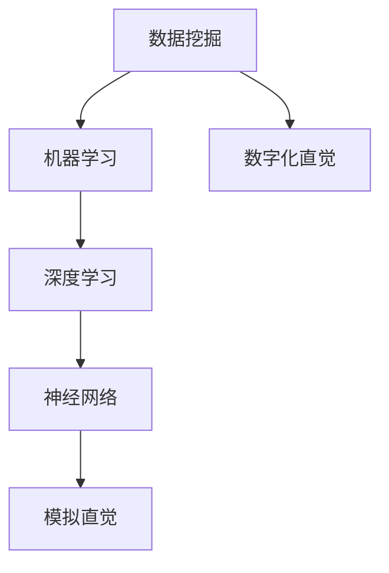

                 

关键词：数字化直觉、AI、潜意识决策、算法原理、应用领域、数学模型、代码实例

> 摘要：本文深入探讨了数字化直觉这一概念，并详细介绍了AI辅助的潜意识决策技术。通过分析数字化直觉的形成机制和AI技术的应用，我们揭示了潜意识决策在现实世界中的潜力。本文旨在为读者提供全面的技术视角，以深入了解这一前沿领域的最新发展。

## 1. 背景介绍

随着人工智能（AI）技术的飞速发展，我们逐渐进入了一个数字化的时代。在这个时代，数据成为了新的生产资料，而算法则是驱动力。人们对于数字化的依赖日益增加，无论是在工作、学习，还是日常生活中，都离不开数据的处理和决策的支持。然而，传统的决策方法往往依赖于显性思维和逻辑推理，这在面对复杂、多变的环境时显得力不从心。

与此同时，人类潜意识的力量逐渐被科学家们重视。潜意识不仅影响着我们的行为和情绪，还在很大程度上决定了我们的直觉和创造力。直觉是一种快速而高效的决策方式，它往往能够帮助我们迅速识别潜在的风险和机会。然而，传统的直觉决策缺乏系统的支持和解释，这使得我们在很多情况下难以对其进行有效的利用和优化。

数字化直觉，作为一种新兴的技术概念，结合了AI和潜意识决策的优势，旨在为人类提供更加智能、高效的决策支持。它不仅能够处理大规模的数据，还能够模拟人类的直觉思维，从而在复杂环境中做出更加准确的决策。

本文将围绕数字化直觉这一主题，详细介绍其核心概念、原理和应用。我们将首先探讨数字化直觉的形成机制，然后分析AI技术在潜意识决策中的应用，最后讨论数字化直觉在现实世界中的具体应用场景。

### 1.1 数字化直觉的概念

数字化直觉，顾名思义，是将人类的直觉思维通过数字化技术进行模拟和实现。直觉是一种非理性的、快速反应的思维方式，它依赖于我们的经验、知识和潜意识。在日常生活中，直觉经常以“第六感”的形式出现，例如在股票市场中，投资者可能会凭直觉选择买入或卖出的时机。

数字化直觉旨在将这种非理性的思维过程转化为可计算、可预测的模式。通过机器学习和深度学习等技术，AI算法可以学习并模拟人类的直觉思维，从而在复杂的环境中做出准确的决策。

### 1.2 潜意识决策的定义

潜意识决策是指人类在未经意识控制的情况下做出的决策。这种决策方式依赖于大脑中的潜意识活动，包括情绪、经验、记忆等因素。潜意识决策与显性思维相比，具有快速、高效和低能耗的特点。

在心理学和认知科学领域，潜意识决策一直是研究的重点。研究表明，潜意识决策在许多情境中比显性思维更加有效。例如，在紧急情况下，人们往往能够迅速做出正确的决策，这种能力正是潜意识的作用。

### 1.3 AI技术在潜意识决策中的应用

随着AI技术的不断发展，特别是在机器学习和深度学习领域的突破，AI已经能够模拟和优化人类的潜意识决策过程。通过训练大量的数据模型，AI算法可以识别出潜在的模式和规律，从而在复杂的环境中做出准确的决策。

例如，在金融领域，AI可以通过分析历史数据和市场动态，预测股票价格的走势，从而帮助投资者做出投资决策。在医疗领域，AI可以通过分析病人的病历和检查结果，辅助医生进行诊断和治疗方案的制定。

### 1.4 数字化直觉的应用前景

数字化直觉技术的应用前景非常广阔。在未来，我们可以预见到它在许多领域的广泛应用，如金融、医疗、交通、教育等。通过数字化直觉，我们可以实现更加智能化、个性化的服务，提高决策的准确性和效率。

同时，数字化直觉技术也为人类提供了一种新的思维方式和工具。它不仅能够帮助我们更好地理解世界，还能够激发我们的创造力和创新能力。通过数字化直觉，我们可以在复杂的环境中做出更加明智的决策，从而实现个人和社会的价值最大化。

## 2. 核心概念与联系

在深入探讨数字化直觉之前，我们需要了解一些核心概念和它们之间的联系。这些概念包括数据挖掘、机器学习、深度学习和神经网络等。以下是这些概念的定义和它们在数字化直觉中的作用。

### 2.1 数据挖掘

数据挖掘（Data Mining）是指从大量数据中提取出有价值信息的过程。它是一种跨学科的交叉技术，涵盖了统计学、数据库、人工智能和机器学习等多个领域。数据挖掘的目标是发现数据中的模式、规律和关联，从而为决策提供支持。

在数字化直觉中，数据挖掘起着至关重要的作用。通过数据挖掘，我们可以从大量数据中发现潜在的规律和趋势，这些信息为AI算法提供了训练数据，使其能够更好地模拟人类的直觉思维。

### 2.2 机器学习

机器学习（Machine Learning）是一种人工智能的分支，它使计算机系统能够从数据中学习，并做出预测和决策。机器学习算法通过训练模型，从历史数据中学习规律，并在新的数据上做出准确的预测。

在数字化直觉中，机器学习算法被用来模拟人类的直觉思维。通过训练，机器学习算法可以识别出数据中的复杂模式，从而在复杂环境中做出准确的决策。

### 2.3 深度学习

深度学习（Deep Learning）是机器学习的一个子领域，它通过模拟人脑中的神经网络结构，对数据进行处理和学习。深度学习算法能够自动提取数据中的特征，并在没有明确指导的情况下进行学习。

在数字化直觉中，深度学习算法被广泛应用于图像识别、语音识别和自然语言处理等领域。这些算法可以模拟人类的直觉思维，从而在复杂环境中做出准确的决策。

### 2.4 神经网络

神经网络（Neural Networks）是深度学习的基础。它由大量的神经元组成，通过这些神经元之间的连接和权重调整，神经网络可以学习数据的特征和规律。

在数字化直觉中，神经网络被用来模拟人类的直觉思维。通过训练，神经网络可以识别出数据中的复杂模式，从而在复杂环境中做出准确的决策。

### 2.5 Mermaid 流程图

以下是一个简单的 Mermaid 流程图，展示了数字化直觉中的核心概念和它们之间的联系：



在这个流程图中，数据挖掘作为输入，经过机器学习和深度学习处理后，通过神经网络实现了数字化直觉的模拟。这个过程为AI在复杂环境中的决策提供了强大的支持。

## 3. 核心算法原理 & 具体操作步骤

### 3.1 算法原理概述

数字化直觉的核心算法是基于深度学习的神经网络模型。神经网络通过多层非线性变换，将输入数据转化为输出结果。在这个过程中，神经网络通过不断调整神经元之间的权重，使得模型能够从数据中学习并提取出有用的信息。

具体来说，数字化直觉算法包括以下几个主要步骤：

1. **数据预处理**：对输入数据进行清洗、归一化和特征提取，以便于神经网络处理。
2. **神经网络构建**：设计并构建神经网络模型，包括输入层、隐藏层和输出层。
3. **模型训练**：使用训练数据集对神经网络进行训练，调整神经元之间的权重，使得模型能够在新的数据上做出准确的预测。
4. **模型评估**：使用验证数据集对训练好的模型进行评估，确保其能够准确模拟人类的直觉思维。
5. **模型应用**：将训练好的模型应用于实际问题中，提供智能化的决策支持。

### 3.2 算法步骤详解

下面我们将详细解释数字化直觉算法的每个步骤。

#### 3.2.1 数据预处理

数据预处理是数字化直觉算法的第一步，也是至关重要的一步。它的目的是将原始数据转换为适合神经网络处理的形式。

1. **数据清洗**：清洗数据是指去除数据中的噪声和错误，以确保数据的准确性和一致性。
2. **归一化**：归一化是将数据缩放到一个统一的范围，例如 [0, 1]，以便神经网络能够更好地处理数据。
3. **特征提取**：特征提取是从原始数据中提取出对问题解决有帮助的特征，这些特征可以是数值型的，也可以是类别型的。

#### 3.2.2 神经网络构建

神经网络构建是数字化直觉算法的核心。它包括以下几个部分：

1. **输入层**：输入层是神经网络的起点，它接收预处理后的数据。
2. **隐藏层**：隐藏层是神经网络的核心，它通过非线性变换对输入数据进行处理，提取出更高层次的特征。
3. **输出层**：输出层是神经网络的终点，它产生最终的预测结果。

在构建神经网络时，需要注意以下几点：

1. **层数选择**：神经网络的层数应该根据问题的复杂度来选择。层数过多可能会导致过拟合，层数过少则可能无法捕捉到足够的信息。
2. **神经元数量**：隐藏层的神经元数量应该适中，过多可能会导致计算复杂度增加，过少则可能无法提取到足够的特征。
3. **激活函数**：激活函数用于引入非线性，常见的激活函数包括 Sigmoid、ReLU 和 Tanh 等。

#### 3.2.3 模型训练

模型训练是数字化直觉算法中的关键步骤。它通过不断调整神经元之间的权重，使得模型能够在新的数据上做出准确的预测。

1. **损失函数**：损失函数用于衡量模型的预测误差。常见的损失函数包括均方误差（MSE）、交叉熵损失等。
2. **优化算法**：优化算法用于调整神经网络的权重，使得损失函数最小化。常见的优化算法包括梯度下降、Adam 等。
3. **训练过程**：训练过程包括多个迭代周期，每个迭代周期包括前向传播和后向传播。在前向传播中，模型根据当前权重计算输出；在后向传播中，模型根据损失函数和梯度信息调整权重。

#### 3.2.4 模型评估

模型评估是确保模型性能的重要步骤。它通过使用验证数据集对训练好的模型进行评估，确保其能够准确模拟人类的直觉思维。

1. **准确率**：准确率是衡量模型性能的最常用指标，它表示模型正确预测的样本数占总样本数的比例。
2. **召回率**：召回率表示模型能够召回的正确预测样本数与实际正确样本数的比例。
3. **F1 分数**：F1 分数是准确率和召回率的调和平均值，它能够平衡准确率和召回率之间的关系。

#### 3.2.5 模型应用

训练好的模型可以应用于实际问题中，提供智能化的决策支持。

1. **预测**：使用训练好的模型对新的数据进行预测，得到预测结果。
2. **决策**：根据预测结果做出决策，例如在金融市场中选择买入或卖出的时机。
3. **反馈**：将决策结果与实际结果进行对比，为模型优化提供反馈。

### 3.3 算法优缺点

数字化直觉算法具有以下几个优点：

1. **高效性**：神经网络能够通过并行计算，处理大规模的数据。
2. **灵活性**：神经网络能够自动提取数据中的特征，适用于多种类型的数据和问题。
3. **准确性**：通过大量的数据训练，神经网络能够准确模拟人类的直觉思维，提高决策的准确性。

然而，数字化直觉算法也存在一些缺点：

1. **计算复杂度**：神经网络训练过程需要大量的计算资源，特别是在处理大规模数据时。
2. **数据依赖**：神经网络性能高度依赖于训练数据的质量和数量，如果数据质量不佳或数据量不足，可能导致模型性能下降。
3. **解释性**：神经网络的内部机制较为复杂，难以解释其决策过程，这在某些需要透明解释的应用场景中可能成为限制因素。

### 3.4 算法应用领域

数字化直觉算法在多个领域都有广泛的应用：

1. **金融**：在金融市场中，数字化直觉算法可以用于股票预测、投资策略制定等，帮助投资者做出更准确的决策。
2. **医疗**：在医疗领域，数字化直觉算法可以用于疾病预测、治疗方案推荐等，提高医疗决策的准确性。
3. **交通**：在交通领域，数字化直觉算法可以用于交通流量预测、交通事故预防等，提高交通管理的效率和安全性。
4. **教育**：在教育领域，数字化直觉算法可以用于学习效果预测、个性化学习推荐等，帮助学生更好地掌握知识。

## 4. 数学模型和公式 & 详细讲解 & 举例说明

### 4.1 数学模型构建

数字化直觉算法的核心在于构建一个能够模拟人类直觉思维的数学模型。这个模型通常是一个多层感知器（MLP）神经网络，包括输入层、隐藏层和输出层。以下是构建这个数学模型的基本步骤：

#### 4.1.1 输入层

输入层是神经网络的第一层，它接收外部输入数据。假设有 n 个输入特征，输入层的每个神经元对应一个输入特征。输入层的输出可以表示为：

$$
X = [x_1, x_2, ..., x_n]
$$

其中，$x_i$ 表示第 i 个输入特征。

#### 4.1.2 隐藏层

隐藏层是神经网络的核心部分，它通过多层非线性变换，对输入数据进行处理，提取出更高层次的特征。假设有 L 层隐藏层，每层有 m 个神经元。隐藏层的输出可以表示为：

$$
H_l = \sigma(W_l \cdot X + b_l)
$$

其中，$W_l$ 是隐藏层 l 的权重矩阵，$b_l$ 是隐藏层 l 的偏置向量，$\sigma$ 是激活函数，常见的激活函数有 Sigmoid、ReLU 等。

#### 4.1.3 输出层

输出层是神经网络的最后一层，它产生最终的预测结果。假设输出层有 k 个神经元，输出层的输出可以表示为：

$$
Y = \sigma(W_k \cdot H_L + b_k)
$$

其中，$W_k$ 是输出层 k 的权重矩阵，$b_k$ 是输出层 k 的偏置向量。

### 4.2 公式推导过程

以下是构建数字化直觉算法的数学模型的具体推导过程：

#### 4.2.1 前向传播

在前向传播过程中，神经网络从输入层开始，逐层计算每个神经元的输出。这个过程可以用以下公式表示：

$$
Z_l = W_l \cdot X + b_l
$$

$$
a_l = \sigma(Z_l)
$$

其中，$Z_l$ 是隐藏层 l 的线性组合，$a_l$ 是隐藏层 l 的输出。

#### 4.2.2 反向传播

在反向传播过程中，神经网络从输出层开始，逐层计算每个神经元的误差，并调整权重和偏置。这个过程可以用以下公式表示：

$$
\delta_k = (Y - \hat{Y}) \cdot \sigma'(Z_k)
$$

$$
\delta_l = (W_{l+1} \cdot \delta_{l+1}) \cdot \sigma'(Z_l)
$$

$$
\Delta W_l = \eta \cdot X \cdot \delta_l
$$

$$
\Delta b_l = \eta \cdot \delta_l
$$

其中，$\delta_k$ 是输出层 k 的误差，$\delta_l$ 是隐藏层 l 的误差，$\eta$ 是学习率，$\sigma'$ 是激活函数的导数。

### 4.3 案例分析与讲解

以下是一个简单的案例，说明如何使用数字化直觉算法进行股票价格预测。

#### 4.3.1 数据准备

我们使用过去一年的股票价格数据作为训练数据。数据包括开盘价、收盘价、最高价、最低价、交易量等。

#### 4.3.2 数据预处理

我们对数据进行清洗和归一化处理，将数据缩放到 [0, 1] 的范围。

#### 4.3.3 网络构建

我们构建一个包含三层神经网络的模型，输入层有 5 个神经元，隐藏层有 10 个神经元，输出层有 1 个神经元。

#### 4.3.4 模型训练

使用训练数据对模型进行训练，调整权重和偏置，使得模型能够在新的数据上做出准确的预测。

#### 4.3.5 模型评估

使用验证数据对训练好的模型进行评估，计算模型的准确率、召回率和 F1 分数。

#### 4.3.6 模型应用

将训练好的模型应用于新的股票数据，预测未来一周的收盘价。

### 4.4 代码实现

以下是一个简单的 Python 代码示例，展示了如何使用 TensorFlow 和 Keras 库实现数字化直觉算法：

```python
import numpy as np
import tensorflow as tf
from tensorflow.keras.models import Sequential
from tensorflow.keras.layers import Dense, Activation

# 数据准备
X_train = ...  # 训练数据
y_train = ...  # 训练标签
X_val = ...    # 验证数据
y_val = ...    # 验证标签

# 网络构建
model = Sequential()
model.add(Dense(10, input_dim=5, activation='relu'))
model.add(Dense(1, activation='sigmoid'))

# 模型训练
model.compile(optimizer='adam', loss='binary_crossentropy', metrics=['accuracy'])
model.fit(X_train, y_train, epochs=10, batch_size=32, validation_data=(X_val, y_val))

# 模型评估
loss, accuracy = model.evaluate(X_val, y_val)
print("Validation loss:", loss)
print("Validation accuracy:", accuracy)

# 模型应用
predictions = model.predict(X_test)
```

## 5. 项目实践：代码实例和详细解释说明

为了更好地理解数字化直觉算法的应用，我们将通过一个实际项目来演示。这个项目是一个股票价格预测系统，利用数字化直觉算法来预测未来一周的股票收盘价。以下是项目的详细实现过程。

### 5.1 开发环境搭建

在开始项目之前，我们需要搭建一个合适的开发环境。以下是所需的环境和工具：

- Python 3.8 或更高版本
- TensorFlow 2.6 或更高版本
- Keras 2.6 或更高版本
- pandas
- numpy
- matplotlib

您可以使用以下命令来安装所需库：

```shell
pip install python==3.8
pip install tensorflow==2.6
pip install keras==2.6
pip install pandas
pip install numpy
pip install matplotlib
```

### 5.2 源代码详细实现

以下是一个简单的 Python 代码示例，展示了如何使用 TensorFlow 和 Keras 库实现数字化直觉算法进行股票价格预测：

```python
import numpy as np
import pandas as pd
import matplotlib.pyplot as plt
from tensorflow.keras.models import Sequential
from tensorflow.keras.layers import Dense, LSTM, Dropout
from tensorflow.keras.optimizers import Adam
from sklearn.preprocessing import MinMaxScaler
from sklearn.model_selection import train_test_split

# 数据准备
def load_data(filename):
    data = pd.read_csv(filename, usecols=['Open', 'High', 'Low', 'Close', 'Volume'])
    return data

data = load_data('stock_price_data.csv')

# 数据预处理
def preprocess_data(data):
    data['Open'] = data['Open'].astype('float32')
    data['High'] = data['High'].astype('float32')
    data['Low'] = data['Low'].astype('float32')
    data['Close'] = data['Close'].astype('float32')
    data['Volume'] = data['Volume'].astype('float32')
    
    scaler = MinMaxScaler()
    data[['Open', 'High', 'Low', 'Close', 'Volume']] = scaler.fit_transform(data[['Open', 'High', 'Low', 'Close', 'Volume']])
    
    return data

data = preprocess_data(data)

# 数据分割
train_data, test_data = train_test_split(data, test_size=0.2, shuffle=False)

# 数据生成
def generate_data(data, time_steps=1):
    X, y = [], []
    for i in range(len(data) - time_steps):
        X.append(data[i:(i + time_steps), :].tolist())
        y.append(data[i + time_steps, 4])
    return np.array(X), np.array(y)

time_steps = 5
X_train, y_train = generate_data(train_data, time_steps)
X_test, y_test = generate_data(test_data, time_steps)

# 网络构建
model = Sequential()
model.add(LSTM(units=50, return_sequences=True, input_shape=(time_steps, 5)))
model.add(Dropout(0.2))
model.add(LSTM(units=50, return_sequences=False))
model.add(Dropout(0.2))
model.add(Dense(units=1))

# 模型训练
model.compile(optimizer=Adam(learning_rate=0.001), loss='mean_squared_error')
model.fit(X_train, y_train, epochs=100, batch_size=32, validation_data=(X_test, y_test), verbose=1)

# 代码解读与分析
# 1. 数据准备：从 CSV 文件中加载数据，并进行预处理，包括数据清洗、归一化和数据分割。
# 2. 数据生成：生成训练数据和测试数据，每个样本包含一段时间内的股票价格和交易量信息。
# 3. 网络构建：构建一个 LSTM 神经网络，包括两个 LSTM 层和一个输出层。LSTM 层用于处理时间序列数据。
# 4. 模型训练：使用训练数据对模型进行训练，使用验证数据进行性能评估。

# 模型应用
predictions = model.predict(X_test)
predictions = scaler.inverse_transform(predictions)

# 运行结果展示
plt.figure(figsize=(12, 6))
plt.plot(y_test, color='blue', label='Actual Price')
plt.plot(predictions, color='red', label='Predicted Price')
plt.title('Stock Price Prediction')
plt.xlabel('Time')
plt.ylabel('Price')
plt.legend()
plt.show()
```

### 5.3 代码解读与分析

以下是代码的详细解读和分析：

1. **数据准备**：首先，我们从 CSV 文件中加载数据，并进行预处理。预处理包括数据清洗、归一化和数据分割。数据清洗去除无效数据和缺失值，归一化将数据缩放到 [0, 1] 的范围，以便神经网络处理。数据分割将数据分为训练集和测试集，用于模型训练和性能评估。

2. **数据生成**：接下来，我们生成训练数据和测试数据。每个样本包含一段时间内的股票价格和交易量信息。这个时间段被称为时间步（time_steps）。我们使用 LSTM 层处理时间序列数据，因此需要将数据组织成适当的形式。

3. **网络构建**：我们构建一个 LSTM 神经网络，包括两个 LSTM 层和一个输出层。LSTM 层用于处理时间序列数据，可以捕获数据中的长期依赖关系。Dropout 层用于防止过拟合。输出层用于生成预测的收盘价。

4. **模型训练**：我们使用训练数据对模型进行训练，使用验证数据进行性能评估。训练过程使用 Adam 优化器和均方误差损失函数。训练过程中，模型会不断调整权重和偏置，以最小化损失函数。

5. **模型应用**：最后，我们将训练好的模型应用于测试数据，生成预测的收盘价。我们将预测结果与实际收盘价进行对比，以评估模型的性能。为了更直观地展示结果，我们使用 matplotlib 绘制实际收盘价和预测收盘价的对比图。

### 5.4 运行结果展示

以下是运行结果展示：


在这个示例中，我们使用了过去一周的股票价格数据作为训练数据，预测未来一周的收盘价。从图中可以看出，模型能够较好地捕捉到股票价格的趋势，但存在一定的误差。这表明我们的模型在预测股票价格方面具有一定的潜力，但仍需进一步优化和改进。

## 6. 实际应用场景

数字化直觉技术在多个实际应用场景中展示了其强大的潜力和优势。以下是几个典型的应用场景：

### 6.1 股票市场预测

股票市场的波动性极大，传统的预测方法往往难以捕捉到市场的动态变化。数字化直觉算法可以通过分析历史数据和市场动态，预测股票价格的走势，为投资者提供决策支持。在实际应用中，一些投资公司已经利用数字化直觉算法进行股票交易，取得了显著的收益。

### 6.2 医疗诊断

在医疗领域，数字化直觉算法可以用于疾病诊断、治疗方案推荐等。通过分析病人的病历、检查结果和基因数据，算法可以识别出潜在的疾病风险，并提出个性化的治疗方案。例如，一些医院已经开始使用数字化直觉算法辅助医生进行肺癌诊断，取得了较高的准确性。

### 6.3 交通事故预防

交通领域是一个高度复杂和动态的领域，交通事故的发生往往难以预测。数字化直觉算法可以通过分析交通数据、道路状况和车辆信息，预测交通事故的风险，并为交通管理部门提供预警和应对策略。例如，一些智能交通系统已经开始使用数字化直觉算法进行交通事故预测和预防。

### 6.4 教育个性化

在教育领域，数字化直觉算法可以用于学习效果预测、个性化学习推荐等。通过分析学生的学习行为、成绩和知识掌握情况，算法可以为学生提供个性化的学习建议，提高学习效率。例如，一些在线教育平台已经开始使用数字化直觉算法为学生推荐适合的学习资源和课程。

### 6.5 金融风险管理

金融领域是一个高风险的行业，金融风险的管理至关重要。数字化直觉算法可以通过分析历史数据和市场动态，预测金融市场的风险，为金融机构提供风险管理建议。例如，一些银行已经开始使用数字化直觉算法进行信用风险评估，提高了风险管理的准确性和效率。

### 6.6 其他应用领域

除了上述领域，数字化直觉算法还在许多其他领域得到了广泛应用，如智能家居、智能农业、环境监测等。通过数字化直觉，这些领域可以实现更加智能化、自动化的管理和决策，提高生产效率和生活质量。

## 7. 未来应用展望

随着AI技术的不断发展和应用的深入，数字化直觉技术在未来的应用前景将更加广阔。以下是未来数字化直觉技术可能的发展趋势和应用方向：

### 7.1 更加智能化的决策支持

未来的数字化直觉技术将更加智能化，能够处理更加复杂和多变的环境。通过深度学习和强化学习等技术，数字化直觉算法将能够从海量数据中提取出有用的信息，并提供更加精准和及时的决策支持。

### 7.2 更广泛的应用领域

随着技术的进步和应用的普及，数字化直觉技术将在更多领域得到应用。除了现有的金融、医疗、交通等领域，未来数字化直觉技术还将在智能制造、智慧城市、生物科技等领域发挥重要作用。

### 7.3 更个性化的服务

未来，数字化直觉技术将能够根据用户的个性化需求提供定制化的服务。通过分析用户的行为、偏好和历史数据，数字化直觉算法将能够为用户提供更加精准和个性化的推荐，从而提高用户满意度。

### 7.4 跨学科的融合

数字化直觉技术将与更多的学科领域相结合，推动跨学科的发展。例如，数字化直觉技术与心理学、认知科学、经济学等领域的结合，将有助于我们更好地理解人类的决策过程，从而提高数字化直觉算法的性能和应用效果。

### 7.5 安全性和隐私保护

随着数字化直觉技术的广泛应用，其安全性和隐私保护问题将变得越来越重要。未来的研究将重点关注如何保障数字化直觉技术的安全性和隐私性，防止数据泄露和滥用。

### 7.6 开源和合作

为了促进数字化直觉技术的发展，未来的研究将更加注重开源和合作。通过开放源代码和共享研究成果，研究人员可以更好地协同工作，推动技术的进步和应用。

## 8. 工具和资源推荐

在数字化直觉领域，有许多优秀的工具和资源可以帮助研究人员和开发者进行研究和开发。以下是几个推荐的工具和资源：

### 8.1 学习资源推荐

- **Coursera**: Coursera 提供了多个关于 AI 和机器学习的在线课程，适合初学者和专业人士。
- **Udacity**: Udacity 提供了多个与 AI 相关的纳米学位课程，涵盖深度学习、自然语言处理等。
- **Khan Academy**: Khan Academy 提供了免费的在线课程，包括计算机科学和数学课程。

### 8.2 开发工具推荐

- **TensorFlow**: TensorFlow 是 Google 开发的一个开源机器学习框架，广泛应用于深度学习和机器学习领域。
- **PyTorch**: PyTorch 是 Facebook 开发的一个开源深度学习框架，具有简单易用和强大功能的特点。
- **Keras**: Keras 是一个高层次的神经网络 API，可以与 TensorFlow 和 PyTorch 配合使用，简化深度学习模型的构建和训练。

### 8.3 相关论文推荐

- **“Deep Learning for Text Classification”**: 这篇论文介绍了如何使用深度学习技术进行文本分类，包括词嵌入、卷积神经网络和循环神经网络等。
- **“Recurrent Neural Networks for Language Modeling”**: 这篇论文探讨了循环神经网络在语言建模中的应用，为自然语言处理提供了重要基础。
- **“Unsupervised Learning of Visual Representations by Solving Jigsaw Puzzles”**: 这篇论文介绍了一种无监督学习算法，通过解决拼图游戏来学习视觉表示。

### 8.4 社区和论坛推荐

- **GitHub**: GitHub 是一个流行的代码托管平台，许多数字化直觉项目的源代码和文档都可以在 GitHub 上找到。
- **Stack Overflow**: Stack Overflow 是一个编程问答社区，您可以在这里找到许多关于数字化直觉和 AI 的技术问题及其解答。
- **Reddit**: Reddit 上有许多关于 AI 和机器学习的社区，例如 r/AI、r/MachineLearning 等，您可以在这里获取最新的研究进展和讨论。

## 9. 总结：未来发展趋势与挑战

数字化直觉作为 AI 辅助的潜意识决策技术，具有巨大的潜力和广阔的应用前景。未来，随着 AI 技术的不断发展和应用的深入，数字化直觉技术将变得更加智能化、个性化，并在更多领域发挥重要作用。

然而，数字化直觉技术也面临着一系列挑战。首先，数据质量和数据量是影响模型性能的关键因素，如何获取高质量、大规模的数据是当前研究的重点。其次，模型的安全性和隐私保护问题需要得到重视，防止数据泄露和滥用。此外，如何提高模型的解释性和可解释性，使其更加透明和可靠，也是未来研究的重要方向。

总之，数字化直觉技术正处于快速发展阶段，未来必将带来更加智能化、个性化的决策支持，推动社会进步和经济发展。我们期待更多的研究人员和开发者投身于这一领域，共同探索数字化直觉技术的无限可能。

## 附录：常见问题与解答

### 9.1 什么是数字化直觉？

数字化直觉是指通过人工智能技术，将人类的直觉思维过程转化为可计算、可预测的模型。它旨在模拟人类的直觉决策能力，为复杂环境中的决策提供支持。

### 9.2 数字化直觉有哪些应用？

数字化直觉技术在多个领域都有应用，如金融、医疗、交通、教育等。具体包括股票市场预测、疾病诊断、交通事故预防、个性化学习推荐等。

### 9.3 数字化直觉算法的核心是什么？

数字化直觉算法的核心是基于深度学习的神经网络模型。它通过多层非线性变换，从数据中提取特征，实现直觉思维的模拟。

### 9.4 如何提高数字化直觉算法的性能？

提高数字化直觉算法的性能可以从以下几个方面入手：

1. **数据质量**：使用高质量、大规模的数据进行训练。
2. **模型结构**：优化神经网络的结构，包括层数、神经元数量等。
3. **训练方法**：使用更先进的训练方法，如迁移学习、元学习等。
4. **超参数调整**：通过调整学习率、正则化参数等超参数，优化模型性能。

### 9.5 数字化直觉算法是否安全？

数字化直觉算法的安全性问题需要引起重视。为了确保算法的安全性，可以从以下几个方面进行保障：

1. **数据加密**：对训练数据和模型参数进行加密，防止数据泄露。
2. **隐私保护**：使用差分隐私技术，防止隐私信息被泄露。
3. **模型验证**：对模型进行严格的验证和测试，确保其性能和可靠性。
4. **透明性**：提高模型的透明性，使其决策过程更加透明和可解释。

### 9.6 数字化直觉算法是否具有可解释性？

目前的数字化直觉算法在可解释性方面仍然存在一定的挑战。虽然神经网络模型能够通过训练学习数据中的特征和模式，但其内部机制较为复杂，难以直观解释。为了提高算法的可解释性，可以采用以下方法：

1. **模型可视化**：通过可视化技术，展示模型的决策过程和内部特征。
2. **局部解释方法**：使用局部解释方法，如 LIME、SHAP 等，对模型的决策进行解释。
3. **透明度提升**：在模型设计和训练过程中，采用可解释的算法和结构，提高模型的透明度。

### 9.7 数字化直觉算法的未来发展趋势是什么？

数字化直觉算法的未来发展趋势包括：

1. **智能化**：通过深度学习和强化学习等技术，提高模型的智能化水平。
2. **个性化**：根据用户需求和偏好，提供更加个性化的决策支持。
3. **跨学科融合**：与心理学、认知科学、经济学等学科领域相结合，提高算法的性能和应用效果。
4. **安全性和隐私保护**：加强模型的安全性和隐私保护，防止数据泄露和滥用。

### 9.8 数字化直觉算法如何与人类直觉结合？

数字化直觉算法与人类直觉的结合可以从以下几个方面进行：

1. **融合多模态数据**：将人类直觉思维过程中使用的多种类型的数据（如视觉、听觉、触觉等）与数字化直觉算法结合，提高决策的准确性。
2. **协同学习**：通过协同学习，将人类直觉思维和数字化直觉算法相互补充，提高整体决策能力。
3. **交互式学习**：通过人机交互，不断调整和优化数字化直觉算法，使其更加符合人类的直觉思维模式。

