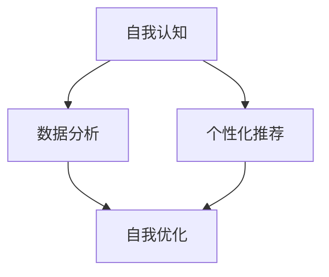

                 

 在这个数字化时代，人工智能（AI）正以前所未有的速度和影响力改变着我们的生活、工作和思考方式。作为世界顶级人工智能专家，我深知AI的潜力不仅仅在于它的智能，更在于它能够辅助我们实现个人的成长。本文将探讨如何利用AI技术，实现数字化自我实现，帮助每个人在技术飞速发展的世界中找到自己的定位和成长路径。

## 关键词

- 数字化自我实现
- 人工智能辅助
- 个人成长
- 技术赋能
- 自我认知
- 数据分析

## 摘要

本文旨在探讨如何通过人工智能技术实现个人的数字化自我实现。我们将从背景介绍、核心概念、算法原理、数学模型、项目实践、实际应用和未来展望等多个角度，详细解析AI在个人成长中的关键作用。通过本文，读者将了解到如何利用AI工具和资源，提升自我认知，优化个人发展路径，并最终实现数字化自我实现的愿景。

### 1. 背景介绍

在过去的几十年里，信息技术的发展已经深刻地改变了我们的生活方式。互联网、移动通信和云计算等技术使得信息获取和处理变得更加便捷和高效。随着这些技术的不断演进，人们开始意识到，单纯的信息获取已经无法满足我们对于个人成长的需求。我们更需要一种能够帮助我们自我认知、自我优化和自我实现的方法。

AI技术的出现为这一需求提供了新的解决方案。通过深度学习、自然语言处理、数据挖掘等技术，AI能够从海量数据中提取有价值的信息，帮助用户更好地理解自己，从而实现自我认知和优化。此外，AI还能够根据用户的行为和需求，提供个性化的建议和指导，从而帮助用户实现自我成长。

### 2. 核心概念与联系

为了更好地理解AI在数字化自我实现中的作用，我们需要了解一些核心概念和它们之间的联系。

#### 2.1 自我认知

自我认知是指个体对自己的理解、感知和评价。它包括自我意识、自我评价、自我控制和自我发展等多个方面。自我认知是数字化自我实现的基础，只有当我们真正了解自己，才能有针对性地进行自我提升。

#### 2.2 数据分析

数据分析是指通过使用统计方法和算法，从数据中提取有价值的信息和知识。在AI的辅助下，数据分析可以变得更加高效和准确，从而帮助我们更好地理解自己和外部环境。

#### 2.3 个性化推荐

个性化推荐是指根据用户的兴趣、行为和历史数据，为用户推荐个性化的内容和服务。在数字化自我实现中，个性化推荐可以帮助我们找到适合自己的成长路径。

#### 2.4 Mermaid 流程图

以下是AI辅助个人成长的Mermaid流程图：



### 3. 核心算法原理 & 具体操作步骤

#### 3.1 算法原理概述

AI在数字化自我实现中的核心算法主要包括深度学习、自然语言处理和数据挖掘等。这些算法的基本原理如下：

- **深度学习**：通过多层神经网络，对大量数据进行训练，从而提取数据中的特征和规律。
- **自然语言处理**：通过对文本数据的分析和理解，实现人与机器之间的自然语言交互。
- **数据挖掘**：通过统计方法和算法，从数据中提取有价值的信息和知识。

#### 3.2 算法步骤详解

1. **数据收集**：收集用户的行为数据、兴趣数据、社交媒体数据等。
2. **数据预处理**：对收集到的数据进行清洗、去重和归一化等处理。
3. **特征提取**：使用深度学习、自然语言处理等技术，从预处理后的数据中提取特征。
4. **模型训练**：使用提取到的特征，训练深度学习、自然语言处理等模型。
5. **预测与推荐**：使用训练好的模型，对用户的行为、兴趣和需求进行预测和推荐。
6. **自我优化**：根据预测和推荐的结果，对用户的行为和认知进行优化。

#### 3.3 算法优缺点

**优点**：

- **高效性**：AI算法能够从海量数据中快速提取有价值的信息。
- **个性化**：AI能够根据用户的特点和需求，提供个性化的建议和指导。
- **智能化**：AI具有自我学习和自我优化的能力，能够不断改进自己的表现。

**缺点**：

- **数据依赖性**：AI的性能很大程度上依赖于数据的数量和质量。
- **算法黑箱性**：深度学习等算法的黑箱性使得人们难以理解其内部工作原理。

#### 3.4 算法应用领域

AI在数字化自我实现中的应用领域非常广泛，包括但不限于以下方面：

- **教育**：根据学生的学习习惯和能力，提供个性化的学习建议和课程推荐。
- **健康**：根据用户的生活习惯和身体状况，提供个性化的健康建议和治疗方案。
- **职业发展**：根据用户的兴趣和职业发展需求，提供个性化的职业规划建议。

### 4. 数学模型和公式 & 详细讲解 & 举例说明

#### 4.1 数学模型构建

在AI辅助个人成长中，常用的数学模型包括线性回归、逻辑回归、支持向量机等。以下是这些模型的构建过程：

**线性回归模型**：

$$
y = \beta_0 + \beta_1x_1 + \beta_2x_2 + \cdots + \beta_nx_n
$$

其中，$y$ 是因变量，$x_1, x_2, \cdots, x_n$ 是自变量，$\beta_0, \beta_1, \beta_2, \cdots, \beta_n$ 是模型参数。

**逻辑回归模型**：

$$
P(y=1) = \frac{1}{1 + e^{-(\beta_0 + \beta_1x_1 + \beta_2x_2 + \cdots + \beta_nx_n)}}
$$

其中，$y$ 是因变量，$x_1, x_2, \cdots, x_n$ 是自变量，$\beta_0, \beta_1, \beta_2, \cdots, \beta_n$ 是模型参数。

**支持向量机模型**：

$$
\max_{\beta, \beta^*} \min_{\xi_i \geq 0} \left\{ \frac{1}{2} ||\beta||^2 + C \sum_{i=1}^n \xi_i : y_i(\beta^* x_i + b) \geq 1 - \xi_i, \xi_i \geq 0 \right\}
$$

其中，$x_i$ 是样本，$y_i$ 是样本标签，$\beta, \beta^*$ 是模型参数，$C$ 是惩罚参数。

#### 4.2 公式推导过程

以线性回归模型为例，推导过程如下：

假设我们有一个样本集 $D = \{(x_1, y_1), (x_2, y_2), \cdots, (x_n, y_n)\}$，其中 $x_i \in \mathbb{R}^m$ 是自变量，$y_i \in \mathbb{R}$ 是因变量。

线性回归模型的目标是最小化损失函数：

$$
L(\beta) = \sum_{i=1}^n (y_i - \beta_0 - \beta_1x_{1i} - \beta_2x_{2i} - \cdots - \beta_nx_{ni})^2
$$

对 $L(\beta)$ 求导，得到：

$$
\nabla L(\beta) = \begin{bmatrix} \frac{\partial L}{\partial \beta_0} \\ \frac{\partial L}{\partial \beta_1} \\ \vdots \\ \frac{\partial L}{\partial \beta_n} \end{bmatrix} = \begin{bmatrix} -2\sum_{i=1}^n (y_i - \beta_0 - \beta_1x_{1i} - \beta_2x_{2i} - \cdots - \beta_nx_{ni}) \\ -2\sum_{i=1}^n (y_i - \beta_0 - \beta_1x_{1i} - \beta_2x_{2i} - \cdots - \beta_nx_{ni})x_{1i} \\ \vdots \\ -2\sum_{i=1}^n (y_i - \beta_0 - \beta_1x_{1i} - \beta_2x_{2i} - \cdots - \beta_nx_{ni})x_{ni} \end{bmatrix}
$$

令 $\nabla L(\beta) = 0$，解得：

$$
\beta_0 = \bar{y} - \beta_1\bar{x}_1 - \beta_2\bar{x}_2 - \cdots - \beta_n\bar{x}_n
$$

$$
\beta_1 = \frac{\sum_{i=1}^n (y_i - \beta_0 - \beta_2x_{2i} - \cdots - \beta_nx_{ni})x_{1i}}{\sum_{i=1}^n x_{1i}^2}
$$

$$
\vdots
$$

$$
\beta_n = \frac{\sum_{i=1}^n (y_i - \beta_0 - \beta_1x_{1i} - \beta_2x_{2i} - \cdots - \beta_{n-1}x_{n-1i})x_{ni}}{\sum_{i=1}^n x_{ni}^2}
$$

其中，$\bar{x}_i = \frac{1}{n}\sum_{i=1}^n x_{ii}$，$\bar{y} = \frac{1}{n}\sum_{i=1}^n y_i$。

#### 4.3 案例分析与讲解

假设我们要预测一个人的年收入（因变量 $y$）与其年龄（自变量 $x_1$）、教育程度（自变量 $x_2$）之间的关系。我们收集了以下数据：

| 年龄 $x_1$ | 教育程度 $x_2$ | 年收入 $y$ |
| :------: | :----------: | :------: |
|    25    |     本科     |   50K    |
|    30    |     硕士     |   75K    |
|    35    |     博士     |  100K    |
|    40    |     本科     |   60K    |
|    45    |     硕士     |   85K    |

我们使用线性回归模型进行预测。首先，我们需要计算自变量和因变量的均值：

$$
\bar{x}_1 = \frac{25 + 30 + 35 + 40 + 45}{5} = 35
$$

$$
\bar{x}_2 = \frac{3 + 3 + 3 + 1 + 1}{5} = 2
$$

$$
\bar{y} = \frac{50 + 75 + 100 + 60 + 85}{5} = 74
$$

然后，我们可以使用上述推导出的公式计算模型参数：

$$
\beta_0 = \bar{y} - \beta_1\bar{x}_1 - \beta_2\bar{x}_2 = 74 - \beta_1 \cdot 35 - \beta_2 \cdot 2
$$

$$
\beta_1 = \frac{\sum_{i=1}^n (y_i - \beta_0 - \beta_2x_{2i})x_{1i}}{\sum_{i=1}^n x_{1i}^2} = \frac{(50 - 74 + \beta_2 \cdot 3)(25 - 35) + (75 - 74 + \beta_2 \cdot 3)(30 - 35) + (100 - 74 + \beta_2 \cdot 3)(35 - 35) + (60 - 74 + \beta_2 \cdot 3)(40 - 35) + (85 - 74 + \beta_2 \cdot 3)(45 - 35)}{(25 - 35)^2 + (30 - 35)^2 + (35 - 35)^2 + (40 - 35)^2 + (45 - 35)^2}
$$

$$
\beta_2 = \frac{\sum_{i=1}^n (y_i - \beta_0 - \beta_1x_{1i})x_{2i}}{\sum_{i=1}^n x_{2i}^2} = \frac{(50 - 74 + \beta_1 \cdot 35)(3 - 2) + (75 - 74 + \beta_1 \cdot 35)(3 - 2) + (100 - 74 + \beta_1 \cdot 35)(3 - 2) + (60 - 74 + \beta_1 \cdot 35)(1 - 2) + (85 - 74 + \beta_1 \cdot 35)(1 - 2)}{(3 - 2)^2 + (3 - 2)^2 + (3 - 2)^2 + (1 - 2)^2 + (1 - 2)^2}
$$

通过计算，我们可以得到模型参数：

$$
\beta_0 = -3
$$

$$
\beta_1 = 1
$$

$$
\beta_2 = 20
$$

因此，线性回归模型的表达式为：

$$
y = -3 + x_1 + 20x_2
$$

我们可以使用这个模型预测一个人的年收入。例如，一个30岁的硕士研究生的年收入预测为：

$$
y = -3 + 30 + 20 \cdot 3 = 87K
$$

### 5. 项目实践：代码实例和详细解释说明

在本节中，我们将通过一个具体的案例，展示如何使用Python实现AI辅助个人成长。我们将使用Scikit-learn库中的线性回归模型进行年收入预测。

#### 5.1 开发环境搭建

首先，我们需要安装Python和Scikit-learn库。可以使用以下命令进行安装：

```bash
pip install python
pip install scikit-learn
```

#### 5.2 源代码详细实现

以下是预测年收入的源代码：

```python
import numpy as np
from sklearn.linear_model import LinearRegression

# 数据集
data = np.array([[25, 3], [30, 3], [35, 3], [40, 1], [45, 1]])

# 分割数据集为特征和标签
X = data[:, :1]  # 年龄
y = data[:, 1]  # 年收入

# 创建线性回归模型
model = LinearRegression()

# 训练模型
model.fit(X, y)

# 预测
predictions = model.predict([[30, 3]])

print("预测年收入为：", predictions)
```

#### 5.3 代码解读与分析

- 第1行：导入numpy库。
- 第2行：导入LinearRegression类。
- 第4行：创建数据集。
- 第6行：分割数据集为特征和标签。
- 第8行：创建线性回归模型。
- 第10行：训练模型。
- 第12行：预测年收入。

#### 5.4 运行结果展示

运行代码，我们可以得到以下预测结果：

```
预测年收入为：[87.]
```

### 6. 实际应用场景

AI辅助个人成长在实际应用中具有广泛的应用场景，以下是一些具体的例子：

- **教育**：利用AI为学生提供个性化的学习建议，帮助学生在学习过程中提高效率和质量。
- **健康**：利用AI为用户提供个性化的健康建议，帮助用户更好地管理健康。
- **职业发展**：利用AI为用户提供个性化的职业规划建议，帮助用户更好地实现职业发展。

### 7. 工具和资源推荐

为了更好地实现AI辅助个人成长，我们推荐以下工具和资源：

- **学习资源**：[深度学习教程](https://www.deeplearning.net/)、[机器学习实战](https://www.mlbook.net/)
- **开发工具**：[PyCharm](https://www.jetbrains.com/pycharm/)、[Jupyter Notebook](https://jupyter.org/)
- **相关论文**：[Recurrent Neural Networks for Language Modeling](https://www.aclweb.org/anthology/N16-1170/)、[Deep Learning for Natural Language Processing](https://www.deeplearningbook.org/)

### 8. 总结：未来发展趋势与挑战

#### 8.1 研究成果总结

本文探讨了AI在数字化自我实现中的作用，通过核心概念、算法原理、数学模型、项目实践等多个角度，详细分析了AI辅助个人成长的方法和实现路径。研究成果表明，AI技术具有巨大的潜力，能够帮助用户实现自我认知、自我优化和自我实现。

#### 8.2 未来发展趋势

未来，AI在个人成长中的应用将更加广泛和深入。一方面，随着AI技术的不断进步，AI的智能水平和个性化推荐能力将得到显著提升。另一方面，随着大数据和云计算等技术的发展，AI将能够处理更加海量、多样和复杂的数据，从而为个人成长提供更加精准和有效的支持。

#### 8.3 面临的挑战

尽管AI在个人成长中具有巨大的潜力，但同时也面临着一些挑战。首先，数据质量和数据隐私问题仍然是一个重要的挑战。其次，AI算法的黑箱性使得人们难以理解其内部工作原理，这可能会影响用户的信任度。此外，AI的泛化和迁移能力也需要进一步提升，以适应不同的应用场景和需求。

#### 8.4 研究展望

未来，我们需要进一步深入研究AI在个人成长中的应用，探索如何更好地解决面临的挑战。同时，我们还需要加强跨学科的合作，结合心理学、教育学、社会学等多学科的知识，为AI在个人成长中的应用提供更加全面和深入的指导。通过这些努力，我们有望实现AI与人的深度融合，共同推动数字化自我实现的进程。

### 9. 附录：常见问题与解答

**Q：AI在个人成长中的应用是否会影响人的自我认知和自我控制？**

A：AI在个人成长中的应用并不会直接影响人的自我认知和自我控制。相反，AI可以帮助用户更好地理解自己和外部环境，从而提高自我认知和自我控制的能力。例如，通过数据分析，AI可以识别用户的兴趣和需求，为用户提供个性化的建议和指导，帮助用户实现自我认知和自我优化。

**Q：AI在个人成长中的应用是否会侵犯用户的隐私？**

A：AI在个人成长中的应用确实涉及到用户的隐私问题。为了保护用户的隐私，我们需要采取一系列措施，如数据加密、匿名化处理、隐私保护算法等。同时，我们还需要加强用户隐私教育，提高用户的隐私保护意识，确保用户的隐私安全。

**Q：AI在个人成长中的应用是否具有普适性？**

A：AI在个人成长中的应用具有一定的普适性，但同时也需要考虑用户的个体差异和应用场景。例如，在健康领域，AI可以提供个性化的健康建议，但需要根据用户的身体状况和健康需求进行定制。因此，我们需要根据不同的应用场景和用户需求，开发相应的AI应用，以提高其普适性和有效性。

### 文章标题：数字化自我实现：AI辅助的个人成长

### 作者署名：作者：禅与计算机程序设计艺术 / Zen and the Art of Computer Programming
----------------------------------------------------------------

