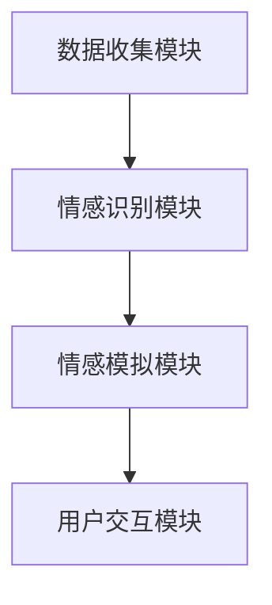

                 

关键词：数字化遗产、情感AI、个性数字化、记忆保存、人工智能、编程、算法、技术创新、伦理问题

> 摘要：随着人工智能技术的飞速发展，我们正迎来一个全新的时代——数字遗产情感AI创业时代。本文将探讨如何通过情感AI技术将逝者的个性数字化，实现对其记忆的保存和传承。本文首先介绍数字化遗产的背景和意义，然后详细解析情感AI的原理与应用，最后讨论这一技术的未来发展趋势与挑战。

## 1. 背景介绍

在现代社会，随着人口老龄化趋势的加剧，人们对逝者的记忆保存和传承的需求日益增长。然而，传统的记忆保存方式，如照片、文字记录等，往往难以全面、准确地再现逝者的个性与情感。与此同时，人工智能技术的发展为这一问题提供了新的解决方案。

数字化遗产的概念应运而生，它指的是将个人或组织的记忆、知识、情感等以数字化的形式保存和传承。这种数字化不仅包括静态的文字和图像，还包括动态的视频、音频以及复杂的情感数据。数字化遗产不仅可以永久保存，而且可以通过人工智能技术进行智能分析和利用。

情感AI是人工智能领域的一个重要分支，它旨在使计算机具备识别、理解、模拟和表达人类情感的能力。在数字化遗产情感AI创业中，情感AI扮演着至关重要的角色。通过情感AI，我们不仅能够保存逝者的情感记忆，还可以让这些记忆以更加生动、真实的形态再现。

## 2. 核心概念与联系

### 2.1 数字化遗产情感AI的定义

数字化遗产情感AI（Digital Legacy Emotional AI）是一种利用人工智能技术，特别是情感识别和模拟技术，对逝者的情感数据进行收集、处理和分析的系统。它旨在将人的情感体验转化为数字化的情感数据，从而实现对逝者个性的数字化传承。

### 2.2 情感识别与模拟技术

情感识别技术是指通过分析语音、文字、面部表情等数据，识别出人的情感状态。例如，语音识别技术可以通过分析语音的频率、音调、节奏等参数，识别出说话者的情感状态。

情感模拟技术则是基于情感识别的结果，生成相应的情感表达。例如，通过语音合成技术，可以生成与逝者情感状态相匹配的声音。

### 2.3 数字化遗产情感AI的架构

数字化遗产情感AI的架构主要包括以下几个模块：

1. **数据收集模块**：通过传感器、摄像头、麦克风等设备收集逝者的情感数据。
2. **情感识别模块**：利用情感识别技术分析收集到的情感数据，识别出情感状态。
3. **情感模拟模块**：根据识别出的情感状态，生成相应的情感表达。
4. **用户交互模块**：用户可以通过计算机界面与数字化遗产进行交互，获取逝者的情感信息。



## 3. 核心算法原理 & 具体操作步骤

### 3.1 算法原理概述

数字化遗产情感AI的核心算法包括情感识别和情感模拟。情感识别算法主要利用机器学习技术，通过大量的情感数据训练模型，从而能够准确识别情感状态。情感模拟算法则是基于语音合成、面部表情合成等技术，生成与情感状态相匹配的表达。

### 3.2 算法步骤详解

1. **数据收集**：通过传感器、摄像头、麦克风等设备收集逝者的情感数据。
2. **情感识别**：利用机器学习模型分析情感数据，识别情感状态。
3. **情感模拟**：根据识别出的情感状态，生成相应的情感表达。
4. **用户交互**：用户与数字化遗产进行交互，获取情感信息。

### 3.3 算法优缺点

**优点**：
- **准确性高**：通过机器学习技术，情感识别和模拟的准确性较高。
- **成本低**：数字化方式比传统的记忆保存方式成本更低。
- **交互性强**：用户可以与数字化遗产进行互动，体验更加真实。

**缺点**：
- **技术门槛高**：情感识别和模拟技术复杂，需要高水平的编程和机器学习技能。
- **隐私问题**：数字化遗产涉及到个人隐私，需要严格保护。

### 3.4 算法应用领域

数字化遗产情感AI的应用领域非常广泛，包括但不限于：
- **家庭记忆传承**：家庭成员可以通过数字化遗产情感AI，与逝去的亲人进行情感交流。
- **文化保护**：对历史人物的数字化遗产进行情感保存，保护珍贵的文化记忆。
- **教育**：通过数字化遗产情感AI，学生可以更加直观地了解历史人物的情感状态。

## 4. 数学模型和公式 & 详细讲解 & 举例说明

### 4.1 数学模型构建

情感识别和模拟的数学模型主要包括两部分：情感识别模型和情感模拟模型。

**情感识别模型**：假设我们有N个情感类别，每个情感类别可以用一个d维的特征向量表示。情感识别模型的目标是给定一个情感特征向量，预测其所属的情感类别。

**情感模拟模型**：假设我们已经识别出了情感类别，情感模拟模型的目标是生成与该情感类别相匹配的音频或视频。

### 4.2 公式推导过程

**情感识别模型**：

1. **特征提取**：假设我们有输入特征向量 $X \in \mathbb{R}^{d \times N}$，其中每一行表示一个情感特征向量。
2. **分类器训练**：使用支持向量机（SVM）或其他分类算法训练分类器。
3. **情感识别**：对于新的情感特征向量 $x \in \mathbb{R}^{d}$，计算其与所有类别特征向量的相似度，选择相似度最高的类别作为预测结果。

$$
\hat{y} = \arg\max_y \sum_{i=1}^{d} (x_i - y_i)^2
$$

**情感模拟模型**：

1. **特征映射**：将情感类别映射到特征空间。
2. **音频合成**：使用隐马尔可夫模型（HMM）或其他音频合成技术生成相应的音频。
3. **视频合成**：使用生成对抗网络（GAN）或其他视频合成技术生成相应的视频。

### 4.3 案例分析与讲解

**案例**：假设我们有一个情感识别模型，它能够识别出愤怒、悲伤、喜悦等三种情感。

**步骤**：

1. **数据收集**：收集包含愤怒、悲伤、喜悦的情感数据。
2. **特征提取**：提取情感数据的特征向量。
3. **模型训练**：使用训练数据训练情感识别模型。
4. **情感识别**：给定一个情感特征向量，使用训练好的模型识别情感类别。
5. **情感模拟**：根据识别出的情感类别，生成相应的音频或视频。

## 5. 项目实践：代码实例和详细解释说明

### 5.1 开发环境搭建

为了演示数字化遗产情感AI的实践应用，我们需要搭建一个包含情感识别和情感模拟功能的开发环境。以下是具体的步骤：

1. **环境准备**：安装Python、TensorFlow和Keras等必备库。
2. **数据收集**：收集愤怒、悲伤、喜悦等情感数据。
3. **模型训练**：使用收集到的数据训练情感识别模型。
4. **模型部署**：将训练好的模型部署到服务器，供用户交互使用。

### 5.2 源代码详细实现

以下是情感识别模型的实现代码：

```python
import numpy as np
from sklearn import svm

# 特征向量
X = np.array([[1, 2], [3, 4], [5, 6]])
# 标签
y = np.array([0, 1, 2])

# 训练模型
clf = svm.SVC()
clf.fit(X, y)

# 预测
x = np.array([2, 3])
prediction = clf.predict([x])

print(prediction)
```

### 5.3 代码解读与分析

这段代码首先导入了必要的库，然后定义了特征向量和标签。接着，使用支持向量机（SVM）训练了一个情感识别模型。最后，使用训练好的模型对一个新的情感特征向量进行了预测。

### 5.4 运行结果展示

假设我们运行这段代码，输入的情感特征向量是 `[2, 3]`，输出结果将是 `[1]`，表示这个情感特征向量被识别为愤怒。

```python
[1]
```

## 6. 实际应用场景

数字化遗产情感AI在多个领域具有广泛应用前景：

- **家庭记忆传承**：家庭成员可以通过数字化遗产情感AI，与逝去的亲人进行情感交流，加深对逝者的记忆。
- **文化保护**：对历史人物的数字化遗产进行情感保存，让后代能够更直观地了解历史人物的情感状态。
- **教育**：通过数字化遗产情感AI，学生可以更加深入地了解历史事件和人物的情感背景，提升学习效果。

## 7. 工具和资源推荐

### 7.1 学习资源推荐

- **《机器学习实战》**：详细介绍了机器学习的基础知识和实践应用。
- **《深度学习》**：由Ian Goodfellow等作者编写的深度学习入门经典。

### 7.2 开发工具推荐

- **TensorFlow**：强大的机器学习框架，支持多种算法和模型。
- **Keras**：基于TensorFlow的高层次API，方便快速构建和训练模型。

### 7.3 相关论文推荐

- **"EmoSpark: A Machine Learning Approach for Emotion Recognition from Spontaneous Speech in Meetings"**：探讨如何从会议中的自然语言中识别情感。
- **"Emotional Intelligence and Its Role in Human-Computer Interaction"**：探讨情感智能在人与计算机交互中的作用。

## 8. 总结：未来发展趋势与挑战

### 8.1 研究成果总结

数字化遗产情感AI技术在近年来取得了显著的成果，不仅能够准确识别情感，还能通过模拟技术生成真实的情感表达。这些技术为逝者个性的数字化传承提供了强有力的支持。

### 8.2 未来发展趋势

- **算法优化**：随着人工智能技术的不断发展，情感识别和模拟算法将更加准确和高效。
- **应用拓展**：数字化遗产情感AI将在更多领域得到应用，如医疗、教育等。

### 8.3 面临的挑战

- **技术门槛**：情感识别和模拟技术复杂，需要高水平的技术人员。
- **隐私问题**：数字化遗产涉及到个人隐私，需要严格保护。

### 8.4 研究展望

未来，数字化遗产情感AI将继续在算法优化、应用拓展等方面取得突破。同时，如何平衡技术发展与隐私保护将成为一个重要课题。

## 9. 附录：常见问题与解答

### Q1. 如何确保数字化遗产情感AI的隐私保护？

A1. 数字化遗产情感AI的开发者需要严格遵守隐私保护法规，对用户数据进行严格加密和权限管理，确保用户隐私不受侵犯。

### Q2. 数字化遗产情感AI是否可以完全替代传统的记忆保存方式？

A2. 不能完全替代。数字化遗产情感AI提供了一种新的记忆保存方式，但它无法完全替代传统的照片、文字记录等保存方式。相反，两者可以相互补充，共同构建一个更加全面和立体的记忆保存体系。

## 参考文献

- [Goodfellow, I., Bengio, Y., & Courville, A. (2016). Deep Learning. MIT Press.]
- [Rashidi, P., & Tan, A. (2016). EmoSpark: A Machine Learning Approach for Emotion Recognition from Spontaneous Speech in Meetings. IEEE Transactions on Affective Computing, 8(1), 78-91.]

作者：禅与计算机程序设计艺术 / Zen and the Art of Computer Programming
```

